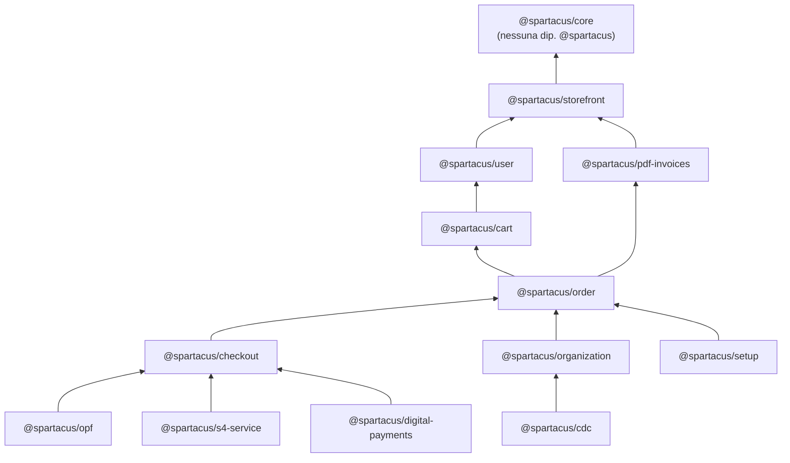
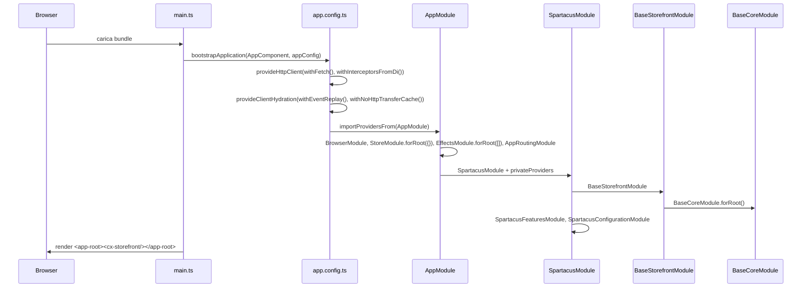
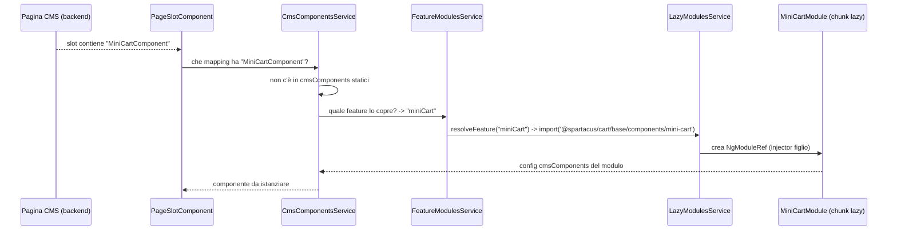

# 01 — Panoramica e monorepo

> Capitolo di apertura del deep dive. Qui guardiamo Spartacus "dall'alto": che cosa c'è nel repository, come sono divise le librerie, come dipendono l'una dall'altra, come si costruiscono, si testano e si rilasciano. Il capitolo copre la **Fase 0** (ricognizione) e l'**Area J** (organizzazione delle librerie e tooling).
>
> Revisione del codice analizzata: commit `8a84d3dc` (`chore: allow root self imports (#22030)`).
> Tutti i path sono relativi alla root del repository (`/home/user/spartacus`).

---

## In una frase

Spartacus è un **monorepo npm workspaces + Nx** che pubblica circa 35 pacchetti Angular `@spartacus/*` (core, storefront, styles, setup, feature-libs, integration-libs), ciascuno diviso in tanti piccoli **secondary entry point** (`root`, `core`, `occ`, `components`, `assets`) così che un'app possa caricare in modo *eager* solo la "radice" leggera di una feature e scaricare il resto *lazy* quando il CMS lo chiede.

---

## Il problema che risolve

Uno storefront e-commerce "vero" ha decine di funzionalità: carrello, checkout, account utente, storico ordini, B2B, configuratori di prodotto, pagamenti, store finder, integrazioni con sistemi SAP. Se tutto questo stesse in **un solo pacchetto**:

1. **Bundle enorme**: il browser scaricherebbe anche il codice del checkout B2B quando l'utente guarda la home page.
2. **Upgrade dolorosi**: un cliente che usa solo B2C dovrebbe comunque portarsi dietro il codice B2B.
3. **Confini confusi**: il codice UI potrebbe importare liberamente dallo state management e viceversa, e nessuno se ne accorgerebbe.
4. **Build lenta**: ogni modifica ricompila tutto.

Spartacus risolve questi problemi con quattro scelte architetturali che vediamo nel capitolo:

| Problema | Soluzione in Spartacus | Dove si vede |
|---|---|---|
| Bundle enorme | Secondary entry point + lazy loading guidato dal CMS (`featureModules`) | `feature-libs/cart/base/root/cart-base-root.module.ts` (`defaultCartComponentsConfig`) |
| Upgrade dolorosi | Una lib npm per ogni feature, installabile con `ng add` | `core-libs/schematics/src/collection.json` |
| Confini confusi | Tag Nx + regola `@nx/enforce-module-boundaries` + regole ESLint custom | `eslint.config.mjs`, `tools/eslint-rules/rules/` |
| Build lenta | Nx con cache e `dependsOn: ["^build"]` | `nx.json` |

---

## Come è implementato (con path)

### 1. La root del repository

Contenuto reale della root (verificato con `ls`):

```
ci-scripts/            script bash usati dalla CI (build, unit test, e2e, release)
core-libs/             le librerie "fondamentali": core, storefront, styles, setup, assets, schematics, skills
feature-libs/          20 librerie di feature standard (cart, checkout, order, user, ...)
integration-libs/      13 librerie che richiedono addon backend (cdc, cds, opf, s4om, ...)
projects/              app demo (storefrontapp) + e2e Cypress + test SSR
tools/                 builder custom, regole ESLint custom, tool di config/dipendenze
scripts/               script di i18n e di installazione (verdaccio)
testing/               setup condiviso per Vitest (setup-vitest.ts)
docs/                  documentazione "storica" del team (SSR-FAQ, migration, libs)
package.json           workspace root (nome "storefrontapp", versione 2611.0.0)
nx.json                configurazione Nx
tsconfig.json          path alias @spartacus/* (315 alias)
tsconfig.base.json     estende tsconfig.json, include **/*.ts
eslint.config.mjs      configurazione ESLint "flat config"
.prettierrc            configurazione Prettier
.env-cmdrc             variabili d'ambiente per env-cmd (CX_BASE_URL, CX_B2B, ...)
types.d.ts             augmentation globale di GlobalEventHandlersEventMap
```

**Non esiste `angular.json`**: ogni progetto ha il suo `project.json` (formato Nx). Verificato: `ls angular.json` → "No such file or directory".

### 2. `package.json` root: workspaces, engine, versioni

File: `package.json`

```json
{
  "name": "storefrontapp",
  "version": "2611.0.0",
  "workspaces": ["feature-libs/*", "integration-libs/*", "core-libs/*"],
  "engines": { "node": "^22.22.0" }
}
```

- **npm workspaces**: le tre cartelle di librerie sono workspace. Questo significa che `npm install` alla root crea i symlink in `node_modules/@spartacus/...` verso le cartelle sorgente e installa una sola volta tutte le dipendenze (un solo `package-lock.json` alla root).
- **Node**: è richiesto `^22.22.0` (stesso vincolo ripetuto in ogni `package.json` di libreria, es. `core-libs/core/package.json`).

#### Versioni reali delle dipendenze principali

Dal blocco `dependencies` / `devDependencies` di `package.json`:

| Pacchetto | Versione dichiarata | Ruolo |
|---|---|---|
| `@angular/core`, `common`, `router`, `forms`, `platform-browser` | `~21.2.23` | Framework |
| `@angular/ssr` | `~21.2.23` | Server-side rendering (usato da `@spartacus/setup/ssr`) |
| `@angular/platform-server` | `^21.2.23` | Render lato server |
| `@angular/service-worker`, `@angular/pwa` | `~21.2.23` / `^21.2.23` | PWA |
| `@angular/build` | `^21.2.23` | Builder esbuild ufficiale |
| `@ngrx/store`, `effects`, `router-store`, `operators` | `~21.0.1` | State management |
| `@ngrx/store-devtools` (dev) | `~21.0.1` | Redux DevTools (solo in dev, vedi `private.providers.ts`) |
| `rxjs` | `~7.8.0` | Programmazione reattiva |
| `zone.js` | `^0.16.0` | Change detection zone-based |
| `angular-oauth2-oidc` | `~20.0.2` | Login OAuth2 / OIDC |
| `i18next` | `~25.7.4` | Motore di traduzioni |
| `i18next-http-backend` | `~3.0.6` | Caricamento traduzioni via HTTP |
| `i18next-resources-to-backend` | `~1.2.2` | Caricamento traduzioni da import dinamici |
| `@ng-select/ng-select` | `~21.1.4` | Select avanzate |
| `ngx-infinite-scroll` | `~21.0.0` | Scroll infinito nella lista prodotti |
| `express` | `^5.1.0` | Server SSR |
| `@fortawesome/fontawesome-free` | `7.1.0` | Icone |
| `@fontsource/open-sans` | `~5.2.7` | Font |
| `hamburgers` | `^1.2.1` | CSS icona menu hamburger |
| `typescript` (dev) | `~5.9.3` | Compilatore |
| `nx` (dev) | `^22.7.6` | Orchestratore monorepo |
| `ng-packagr` (dev) | `^21.2.3` | Build librerie Angular (formato APF) |
| `vitest` (dev) | `^4.1.10` | Test runner per la maggior parte delle lib |
| `jest` (dev) | `^30.2.0` | Test runner per schematics, setup, styles, ssr-tests |
| `karma` / `jasmine-core` (dev) | `~6.4.4` / `~6.3.0` | Test runner "storico" (ancora per molte integration-libs) |
| `eslint` (dev) | `^9.28.0` | Linting (flat config) |
| `prettier` (dev) | `~3.5.0` | Formattazione |
| `verdaccio` (dev) | `6.8.0` | Registry npm locale per provare i pacchetti |
| `@analogjs/vite-plugin-angular` (dev) | `^2.6.4` | Compila Angular dentro Vitest |
| `@angular-builders/custom-esbuild` (dev) | `^21.0.3` | Builder dell'app demo con plugin esbuild |

Nota: bootstrap (il framework CSS) **non** compare come dipendenza npm in `package.json`. Gli stili Bootstrap sono **vendorizzati** in `core-libs/styles/vendor` (cartella presente, verificato con `ls core-libs/styles`). Questo si collega alle costanti `SPARTACUS_BOOTSTRAP_*` usate dagli schematics (`core-libs/schematics/src/shared/lib-configs/cart-schematics-config.ts`).

#### Due numeri di versione diversi: attenzione!

- La root dichiara `"version": "2611.0.0"`.
- **Tutte** le librerie pubblicate dichiarano `"version": "221121.18.0"` (es. `core-libs/core/package.json`, `feature-libs/cart/package.json`).
- La costante usata dal tooling di rilascio è `PUBLISHING_VERSION = '221121.18.0'` in `tools/config/const.ts`.

Quindi la versione che finisce su npm è quella delle librerie (`221121.18.0`), mentre `2611.0.0` è la versione del pacchetto root "storefrontapp", che non viene pubblicato come libreria. Le peerDependencies interne sono "pinnate" alla versione esatta: `"@spartacus/core": "221121.18.0"` in `core-libs/storefront/package.json`.

### 3. `nx.json`

File: `nx.json` (contenuto completo):

```json
{
  "workspaceLayout": { "appsDir": "projects/storefrontapp", "libsDir": "feature-libs" },
  "targetDefaults": {
    "build": { "cache": true, "dependsOn": ["^build"], "outputs": ["{workspaceRoot}/dist/{projectName}"] },
    "lint":  { "cache": true },
    "test":  { "cache": true },
    "e2e":   { "cache": true }
  },
  "useInferencePlugins": false,
  "analytics": false
}
```

Cosa significa in pratica:

- `dependsOn: ["^build"]`: prima di buildare `cart`, Nx builda tutte le librerie da cui `cart` dipende (`core`, `storefrontlib`, `user`, ...). Il simbolo `^` vuol dire "le dipendenze del progetto".
- `cache: true`: se gli input non sono cambiati, Nx riusa l'output precedente (cache locale).
- `useInferencePlugins: false`: Nx **non** deduce target automaticamente da file come `vite.config.ts` o `jest.config.js`; tutti i target sono scritti a mano nei `project.json`. Per questo il target Vitest si chiama `test-vitest` ed è un `nx:run-commands` esplicito.

### 4. I progetti Nx (tutti i `project.json`)

Estratti con uno script Node su tutti i `project.json` (nome Nx | tag | target:executor):

| Progetto Nx | Cartella | Tag | Build | Test |
|---|---|---|---|---|
| `core` | `core-libs/core` | `type:util`, `scope:core` | `./tools/build-lib:declaration-merging` | `test-vitest` |
| `storefrontlib` | `core-libs/storefront` | `type:ui` | `./tools/build-lib:declaration-merging` | `test-vitest` |
| `storefrontstyles` | `core-libs/styles` | `type:style` | nessun target build | `test-jest` |
| `setup` | `core-libs/setup` | `type:util` | `@angular-devkit/build-angular:ng-packagr` | `test-jest` |
| `assets` | `core-libs/assets` | `type:util` | `ng-packagr` | nessuno |
| `schematics` | `core-libs/schematics` | `type:util` | nessuno (build via `tsc`, script npm) | `test-jest` |
| `skills` | `core-libs/skills` | `type:util` | nessuno | nessuno |
| `cart`, `checkout`, `order`, `user`, `organization`, `quote`, `tracking`, `pickup-in-store`, `pdf-invoices`, `product-configurator`, `requested-delivery-date`, `estimated-delivery-date`, `customer-ticketing`, `subscription-billing` | `feature-libs/*` | `type:feature` | `declaration-merging` | `test-vitest` + `test-jest` (schematics) |
| `asm`, `product`, `product-multi-dimensional`, `qualtrics`, `smartedit`, `storefinder` | `feature-libs/*` | `type:feature` | `ng-packagr` | `test-vitest` + `test-jest` |
| `cds` | `integration-libs/cds` | `type:feature`, `type:integration` | `ng-packagr` | `test-vitest` + `test-jest` |
| `cdc`, `cdp`, `digital-payments`, `epd-visualization`, `omf`, `opf`, `opps`, `s4-service`, `s4om`, `segment-refs` | `integration-libs/*` | `type:feature`, `type:integration` | `ng-packagr` | `test` (Karma) + `test-jest` |
| `cpq-quote` | `integration-libs/cpq-quote` | `type:feature` | `declaration-merging` | `test` (Karma) + `test-jest` |
| `punchout` | `integration-libs/punchout` | `type:integration` | `declaration-merging` | `test` (Karma) + `test-jest` |
| `storefrontapp` | `projects/storefrontapp` | `type:app` | `@angular-builders/custom-esbuild:application` | `test` (Karma) |
| `ssr-tests` | `projects/ssr-tests` | `type:util` | nessuno | `test-jest` |

Due trappole per chi arriva:

1. **Il nome Nx non coincide sempre col nome della cartella**: `core-libs/storefront` si chiama `storefrontlib`, `core-libs/styles` si chiama `storefrontstyles`. Quindi `nx build storefrontlib`, non `nx build storefront` (vedi script `build:storefrontlib` in `package.json`).
2. **Il target di test varia per libreria**: `core` e `storefrontlib` hanno **solo** `test-vitest` (non `test`). Le integration-libs "vecchie" hanno `test` (Karma). Quindi il comando citato in `.claude/CLAUDE.md` (`nx run storefrontlib:test`) **non corrisponde** al `project.json` attuale di `core-libs/storefront`, che espone `test-vitest`. Lo script root `test:libs` (`package.json`) usa ancora `nx test <lib>`: per le lib migrate a Vitest quel target non esiste più.

### 5. `tsconfig.json`: i path alias

File: `tsconfig.json`. Opzioni chiave:

```jsonc
{
  "compilerOptions": {
    "target": "ES2022",
    "strict": true,
    "strictPropertyInitialization": false,
    "noUnusedLocals": true,
    "noUnusedParameters": true,
    "stripInternal": true,
    "moduleResolution": "bundler",
    "experimentalDecorators": true,
    "paths": {
      "@spartacus/core": ["core-libs/core/public_api"],
      "@spartacus/storefront": ["core-libs/storefront/public_api"],
      "@spartacus/assets": ["core-libs/assets/src/public_api"],
      "@spartacus/setup": ["core-libs/setup/public_api"],
      "@spartacus/setup/ssr": ["core-libs/setup/ssr/public_api"],
      "@spartacus/cart/base/root": ["feature-libs/cart/base/root/public_api"],
      "@spartacus/cart/base/core": ["feature-libs/cart/base/core/public_api"]
      // ... 315 alias in totale
    }
  }
}
```

- Ci sono **315 alias** `@spartacus/...` (conteggio con `grep -o '"@spartacus/[^"]*"' tsconfig.json | sort -u | wc -l`).
- Ogni alias punta al `public_api.ts` **sorgente** della libreria. Questo significa che in sviluppo l'app demo compila direttamente i sorgenti delle librerie (non i pacchetti buildati in `dist/`). È il motivo per cui `npm start` funziona senza aver prima buildato le librerie.
- `stripInternal: true`: i simboli marcati `/** @internal */` spariscono dai `.d.ts` pubblicati.
- `tsconfig.base.json` è minimale: `{ "extends": "./tsconfig.json", "include": ["**/*.ts"] }`.
- I path sono **mantenuti da un tool**, non a mano: `tools/config/tsconfig-paths.ts` (funzione `manageTsConfigs`), invocato da `npm run config:update` / `config:check` (`tools/config/index.ts`).

Ogni libreria ha poi:

- `tsconfig.lib.json` (es. `core-libs/core/tsconfig.lib.json`): `declaration: true`, `importHelpers: true`, `angularCompilerOptions.strictInjectionParameters`, `fullTemplateTypeCheck`.
- `tsconfig.lib.prod.json`: aggiunge `"compilationMode": "partial"`, cioè il formato **partial Ivy** richiesto per pubblicare librerie Angular su npm (il compilatore dell'app consumer finirà la compilazione).
- `tsconfig.spec.json` per i test.

L'app demo usa `projects/storefrontapp/tsconfig.app.json` con `"strict": false` e `strictTemplates: false` (un commento nel file indica che è una scelta temporanea, in attesa di correggere gli errori strict), e `skipLibCheck: true` per via di `@sapui5/ts-types-esm` usato da `epd-visualization`.

### 6. Il grafo delle dipendenze tra librerie

Ricavato **esclusivamente** dalle `peerDependencies` `@spartacus/*` di ogni `package.json` di libreria (script Node su `core-libs/*/package.json`, `feature-libs/*/package.json`, `integration-libs/*/package.json`). Le librerie senza peerDependencies `@spartacus` sono `core`, `assets`, `styles`, `schematics`, `skills`.

```mermaid
flowchart BT
  %% core-libs
  storefront --> core
  setup --> cart & core & order & user
  %% feature-libs
  asm --> cart & core & order & schematics & storefinder & storefront & styles & user
  cart --> core & schematics & storefront & styles & user
  checkout --> cart & core & order & schematics & storefront & styles & user
  customer_ticketing --> cart & core & schematics & storefront & styles
  estimated_delivery_date --> cart & core & order & schematics & storefront & styles
  order --> cart & core & pdf_invoices & schematics & storefront & styles & user
  organization --> cart & core & order & schematics & storefront & styles & user
  pdf_invoices --> core & schematics & storefront & styles
  pickup_in_store --> cart & core & order & schematics & storefinder & storefront & styles & user
  product_configurator --> cart & checkout & core & order & schematics & storefront & styles
  product_multi_dimensional --> core & schematics & storefront & styles
  product --> core & schematics & storefront & styles
  qualtrics --> core & schematics & styles
  quote --> cart & core & order & schematics & storefront & styles
  requested_delivery_date --> cart & checkout & core & order & schematics & storefront & styles
  smartedit --> core & schematics
  storefinder --> core & schematics & storefront & styles
  subscription_billing --> cart & core & schematics & storefront & styles
  tracking --> core & schematics
  user --> core & schematics & storefront & styles
  %% integration-libs
  cdc --> asm & core & organization & schematics & storefront & user
  cdp --> customer_ticketing & schematics
  cds --> cart & core & order & schematics & storefront & tracking
  cpq_quote --> cart & core & schematics & storefront
  digital_payments --> cart & checkout & core & schematics & storefront
  epd_visualization --> cart & core & schematics & storefront & styles
  omf --> core & order & schematics
  opf --> cart & checkout & core & order & pickup_in_store & schematics & storefront & styles & user
  opps --> core & schematics & storefront
  punchout --> cart & core & schematics & storefront & styles
  s4_service --> cart & checkout & core & order & schematics & storefront
  s4om --> cart & core & pdf_invoices & requested_delivery_date & schematics & storefront & styles
  segment_refs --> core & schematics
```



(I trattini dei nomi sono sostituiti con `_` perché Mermaid non li accetta negli id dei nodi.)

Versione semplificata "a strati", più facile da ricordare (tolti `schematics` e `styles`, che sono dipendenze di servizio):



Osservazioni utili:

- **`core` è la foglia**: non dipende da nessun'altra lib `@spartacus`. Le sue peerDependencies sono solo Angular, NgRx, RxJS, `angular-oauth2-oidc` e i18next (`core-libs/core/package.json`).
- **`storefront` dipende solo da `core`** (`core-libs/storefront/package.json`).
- **`cart` dipende da `user`**, e `order` da `cart` e `pdf-invoices`: c'è una catena lineare user → cart → order → checkout che rispecchia il percorso d'acquisto.
- **`setup` dipende da `cart`, `order`, `user`**: perché contiene "ricette" (`core-libs/setup/recipes/b2b`) che mettono insieme più feature.
- **`schematics` è peerDependency di quasi tutte le feature-libs**: perché ogni feature lib contiene i propri schematics (`feature-libs/cart/schematics`) che riusano le utility di `@spartacus/schematics`.

### 7. L'app demo `projects/storefrontapp`

Struttura reale:

```
projects/storefrontapp/
  project.json                  target Nx (build/serve/test/lint/prerender/build-csr)
  esbuild/plugins.ts            plugin esbuild: inietta le env CX_* come buildProcess.env
  tsconfig.app.json
  karma.conf.js
  prerender.txt                 rotte da prerenderizzare
  src/
    main.ts                     bootstrap browser
    main.server.ts              bootstrap server (SSR)
    server.ts                   server Express
    index.html, styles.scss, styles/lib-*.scss
    environments/environment.ts, environment.prod.ts, models/
    test-outlets/               outlet usati solo dagli e2e
    app/
      app.component.ts          <cx-storefront />
      app.config.ts             ApplicationConfig browser
      app.config.server.ts      ApplicationConfig server (merge)
      app.module.ts             NgModule "ponte" importato con importProvidersFrom
      app.module.server.ts      provideServer(...)
      private/private.providers.ts   config usata SOLO nel repo (backend, e2e, devtools)
      spartacus/
        spartacus.module.ts
        spartacus-features.module.ts
        spartacus-configuration.module.ts
        spartacus-b2c-configuration.providers.ts
        spartacus-b2b-configuration.providers.ts
        features/<feature>/<feature>-feature.module.ts  (+ *-wrapper.module.ts)
```

I dettagli di ciascun file sono nel "Flusso passo-passo" più sotto.

### 8. Organizzazione interna di una libreria (Area J)

Prendiamo `feature-libs/cart` come esempio canonico (verificato con `ls`):

```
feature-libs/cart/
  package.json          nome @spartacus/cart, peerDependencies, "schematics": "./schematics/collection.json"
  ng-package.json       entry point PRIMARIO -> public_api.ts, dest ../../dist/cart
  public_api.ts         export {}  (il primary entry point è VUOTO!)
  project.json          target Nx
  vitest.config.ts      test unitari
  jest.schematics.config.js   test degli schematics
  _index.scss           stili della lib (esportati come sass)
  schematics/           ng add @spartacus/cart
  base/                 sotto-feature "base" del carrello
    ng-package.json     secondary entry point @spartacus/cart/base
    public_api.ts       export * from './cart-base.module'
    cart-base.module.ts CartBaseModule = Core + Occ + Components
    root/               @spartacus/cart/base/root        (eager, leggero)
    core/               @spartacus/cart/base/core        (facade impl, store NgRx, connectors)
    occ/                @spartacus/cart/base/occ         (adapter OCC)
    components/         @spartacus/cart/base/components  (componenti UI)
      mini-cart/        @spartacus/cart/base/components/mini-cart (entry point ancora più fine)
      add-to-cart/      @spartacus/cart/base/components/add-to-cart
    assets/             @spartacus/cart/base/assets      (traduzioni)
    styles/             scss
  import-export/  quick-order/  saved-cart/  wish-list/   altre sotto-feature con la stessa struttura
```

Numeri reali (con `find ... -name ng-package.json`):

- **314** file `ng-package.json` in `core-libs`, `feature-libs`, `integration-libs` (quindi 314 entry point, primari + secondari).
- Nelle feature/integration libs: **57** entry point `root`, **42** `core`, **30** `occ`, **40** `components`, **44** `assets`.
- Le lib con più entry point: `integration-libs/opf` (46), `feature-libs/cart` (31), `feature-libs/organization` (28), `feature-libs/product` (22).

Ruolo di ogni strato:

| Entry point | Cosa contiene | Caricamento | Esempio reale |
|---|---|---|---|
| `root` | `XxxRootModule`, facade astratte con `facadeFactory`, config di default, feature name, eventi, modelli, token, rotte | **Eager** (nel bundle iniziale) | `feature-libs/cart/base/root/cart-base-root.module.ts` |
| `core` | Implementazione dei facade, store NgRx, connectors, adapter astratti, guard | **Lazy** | `feature-libs/cart/base/core/cart-base-core.module.ts` |
| `occ` | Adapter OCC concreti, converter, config endpoint | **Lazy** | `feature-libs/cart/base/occ/cart-base-occ.module.ts` |
| `components` | Componenti Angular mappati al CMS | **Lazy** | `feature-libs/cart/base/components/cart-base-components.module.ts` |
| `assets` | Traduzioni (`cartBaseTranslationsEn`, `cartBaseTranslationChunksConfig`) | Eager o lazy, a scelta dell'app | `feature-libs/cart/base/assets/public_api.ts` |
| `styles` | SCSS | Build-time | `feature-libs/cart/base/styles` |

Le core-libs **non** seguono questa suddivisione: `@spartacus/core` e `@spartacus/storefront` hanno un solo entry point ciascuno (`core-libs/core/ng-package.json`, `core-libs/storefront/ng-package.json`); `@spartacus/setup` ne ha due (`@spartacus/setup` e `@spartacus/setup/ssr`).

### 9. Il pattern `XxxRootModule` vs `XxxModule`

Questo è **il** pattern da capire per leggere qualsiasi feature lib.

**Cos'è.** Ogni feature ha due moduli "di ingresso":

- `XxxRootModule` (in `root/`): piccolo, importato **subito** dall'app. Dichiara solo "promesse": quali componenti CMS appartengono alla feature, quali rotte esistono, quali config di default usare, e i facade astratti.
- `XxxModule` (nel secondary entry point principale della sotto-feature, es. `@spartacus/cart/base`): importa **tutto il resto** (`XxxCoreModule`, `XxxOccModule`, `XxxComponentsModule`). Viene caricato **lazy**.

**Perché.** Così il bundle iniziale contiene solo le "etichette" della feature. Il codice pesante viene scaricato la prima volta che il CMS restituisce una pagina contenente un componente della feature, oppure quando qualcuno chiama un metodo del facade.

**Dove sta nel codice.**

`feature-libs/cart/base/cart-base.module.ts`:

```ts
@NgModule({
  imports: [CartBaseCoreModule, CartBaseOccModule, CartBaseComponentsModule],
})
export class CartBaseModule {}
```

`feature-libs/cart/base/root/cart-base-root.module.ts` (estratto reale, funzione `defaultCartComponentsConfig` + classe `CartBaseRootModule`):

```ts
export function defaultCartComponentsConfig() {
  const config = {
    featureModules: {
      [CART_BASE_FEATURE]: {
        cmsComponents: [
          'CartApplyCouponComponent',
          'CartComponent',
          'CartProceedToCheckoutComponent',
          'CartTotalsComponent',
          'SaveForLaterComponent',
          'ClearCartComponent',
        ],
      },
      [MINI_CART_FEATURE]: { cmsComponents: ['MiniCartComponent'] },
      [ADD_TO_CART_FEATURE]: { cmsComponents: ['ProductAddToCartComponent'] },
      [CART_BASE_CORE_FEATURE]: CART_BASE_FEATURE, // alias: il "core" sta insieme ai componenti
    },
  };
  return config;
}

@NgModule({
  imports: [
    CartBaseEventModule,
    RouterModule.forChild([
      {
        // @ts-ignore
        path: null,
        canActivate: [CmsPageGuard],
        component: PageLayoutComponent,
        data: { cxRoute: 'cart', cxContext: { [ORDER_ENTRIES_CONTEXT]: ActiveCartOrderEntriesContextToken } },
      },
    ]),
  ],
  providers: [
    provideDefaultConfigFactory(defaultCartComponentsConfig),
    provideDefaultConfig(defaultCartConfig),
    provideDefaultConfig(defaultCartRoutingConfig),
  ],
})
export class CartBaseRootModule {}
```

I nomi delle feature sono semplici stringhe: `feature-libs/cart/base/root/feature-name.ts` definisce `CART_BASE_FEATURE = 'cartBase'`, `CART_BASE_CORE_FEATURE = 'cartBaseCore'`, `MINI_CART_FEATURE = 'miniCart'`, `ADD_TO_CART_FEATURE = 'addToCart'`.

L'app collega le due metà in `projects/storefrontapp/src/app/spartacus/features/cart/cart-base-feature.module.ts` (classe `CartBaseFeatureModule`):

```ts
@NgModule({
  imports: [CartBaseRootModule],
  providers: [
    provideConfig({
      featureModules: {
        [CART_BASE_FEATURE]: {
          module: () => import('./cart-base-wrapper.module').then((m) => m.CartBaseWrapperModule),
        },
      },
    }),
    provideConfig({
      featureModules: {
        [MINI_CART_FEATURE]: {
          module: () => import('@spartacus/cart/base/components/mini-cart').then((m) => m.MiniCartModule),
        },
      },
    }),
    // ... ADD_TO_CART_FEATURE, i18n
  ],
})
export class CartBaseFeatureModule {}
```

E il `CartBaseWrapperModule` (`projects/storefrontapp/src/app/spartacus/features/cart/cart-base-wrapper.module.ts`) importa `CartBaseModule` più eventuali estensioni (`EstimatedDeliveryDateModule`, `CpqQuoteModule`) se abilitate dall'environment. Il **wrapper module** serve per caricare nello stesso chunk lazy la feature e le sue estensioni: lo genera lo schematic `wrapper-module` (`core-libs/schematics/src/collection.json`, factory `./wrapper-module/index#generateWrapperModule`).

Il contratto di `featureModules` è definito in `core-libs/core/src/cms/config/cms-config.ts`:

```ts
export interface FeatureModuleConfig {
  module?: () => Promise<any>;                         // modulo lazy
  dependencies?: ((() => Promise<any>) | string)[];   // altre feature da caricare prima
  cmsComponents?: string[];                            // componenti CMS coperti
}

export abstract class CmsConfig extends OccConfig {
  featureModules?: { [featureName: string]: FeatureModuleConfig | string }; // string = alias
  cmsComponents?: CMSComponentConfig;
  // ...
}
```

Nota l'unione `FeatureModuleConfig | string`: una stringa è un **alias** (es. `cartBaseCore` → `cartBase`), risolto da `FeatureModulesService.resolveFeatureAlias` in `core-libs/core/src/lazy-loading/feature-modules.service.ts`.

### 10. `defaultXxxComponentsConfig`: la convenzione

In tutto il repo ci sono **43** funzioni/costanti che seguono il nome `defaultXxxComponentsConfig` (grep `export function default.*ComponentsConfig|export const default.*ComponentsConfig` escludendo gli spec). Esempi reali:

- `defaultCartComponentsConfig` — `feature-libs/cart/base/root/cart-base-root.module.ts`
- `defaultUserProfileComponentsConfig` — `feature-libs/user/profile/root/user-profile-root.module.ts`
- `defaultUserAccountComponentsConfig` — `feature-libs/user/account/root/user-account-root.module.ts`
- `defaultOrderComponentsConfig` — `feature-libs/order/root/order-root.module.ts`
- `defaultCheckoutComponentsConfig` — `feature-libs/checkout/base/root/checkout-root.module.ts` (lo stesso nome esiste anche in `checkout/b2b/root` e `checkout/scheduled-replenishment/root`)
- `defaultStoreFinderComponentsConfig` — `feature-libs/storefinder/root/store-finder-root.module.ts`
- `defaultPickupInStoreComponentsConfig` — `feature-libs/pickup-in-store/root/pickup-in-store-root.module.ts`

Perché è una **funzione** e non una costante? Perché viene passata a `provideDefaultConfigFactory(...)`, che la esegue in un contesto di injection: la funzione può quindi usare `inject()` per leggere feature toggle o altri servizi e costruire la config in modo condizionale. Esiste anche una regola ESLint che impone di usare `provideDefaultConfig`/`provideDefaultConfigFactory` dentro i file `*.module.ts` delle librerie (vedi sezione ESLint).

### 11. `provideConfig` vs `provideDefaultConfig`

File: `core-libs/core/src/config/config-providers.ts`.

```ts
export function provideConfig(config: Config = {}, defaultConfig = false): ValueProvider {
  return { provide: defaultConfig ? DefaultConfigChunk : ConfigChunk, useValue: config, multi: true };
}
export function provideDefaultConfig(config: Config = {}): ValueProvider {
  return { provide: DefaultConfigChunk, useValue: config, multi: true };
}
```

- `ConfigChunk` e `DefaultConfigChunk` sono `InjectionToken<Config[]>` **multi** definiti in `core-libs/core/src/config/config-tokens.ts`.
- Le **librerie** usano `provideDefaultConfig` (valori di default, sovrascrivibili).
- L'**app** usa `provideConfig` (valori del cliente, vincono sui default).
- Il merge profondo avviene nei token `DefaultConfig` e `RootConfig` dello stesso file (dettagli nel capitolo 02).

La regola ESLint `@nx/workspace-use-provide-default-config` (`tools/eslint-rules/rules/use-provide-default-config.ts`) ha il messaggio: *"provideConfig() is intended for library consumers. To allow for better extensibility, please provide default configs inside Spartacus libraries using provideDefaultConfig()."*

### 12. Feature toggles (`core-libs/core/src/features-config`)

**Cos'è.** Un feature toggle è un booleano con nome (es. `a11yFocusIndicatorContrast`) che accende un comportamento nuovo. Spartacus rilascia spesso migliorie "potenzialmente breaking" (soprattutto di accessibilità e stile) spente di default: il cliente le accende quando è pronto.

**Perché.** Permette di rilasciare in minor version codice che cambierebbe il comportamento, senza rompere le app esistenti.

**Dove sta nel codice.** Struttura reale della cartella:

```
core-libs/core/src/features-config/
  features-config.module.ts                       FeaturesConfigModule.forRoot()
  config/features-config.ts                       FeaturesConfig (vecchio sistema, deprecato)
  feature-toggles/config/feature-toggles.ts       FeatureTogglesInterface + defaultFeatureToggles
  feature-toggles/feature-toggles-tokens.ts       FeatureToggles, DefaultFeatureToggles, RootFeatureToggles, *Chunk
  feature-toggles/feature-toggles-providers.ts    provideFeatureToggles, provideFeatureTogglesFactory, provideDefault...
  feature-toggles/populate-feature-toggles-to-features-config.ts  compatibilità col vecchio FeaturesConfig
  services/feature-config.service.ts              FeatureConfigService (deprecato: "Use FeatureToggles instead")
  directives/feature.directive.ts                 *cxFeature="'nomeToggle'"
  directives/feature-level.directive.ts           *cxFeatureLevel (deprecato)
  utils/feature-config-utils.ts                   isFeatureEnabled, isFeatureLevel
  services/feature-styles.service.ts, utils/use-feature-styles.ts
```

Punti chiave (dal codice):

1. `FeatureTogglesInterface` (in `feature-toggles/config/feature-toggles.ts`) è volutamente **senza** index signature. Commento nel file: *"We want this interface to be STRICT and cause a compilation error when a removed property is used."*
2. `defaultFeatureToggles: Required<FeatureTogglesInterface>` (stesso file, riga ~859) dà un valore di default a **ogni** toggle.
3. `FeatureToggles` (in `feature-toggles-tokens.ts`) è una classe astratta `providedIn: 'root'` con `useFactory: () => Object.assign({}, inject(DefaultFeatureToggles), inject(RootFeatureToggles))`: i toggle dell'app vincono sui default.
4. `DefaultFeatureToggles` e `RootFeatureToggles` sono `InjectionToken` che fondono i rispettivi `*Chunk` multi-provider con `Object.assign`.
5. `FeaturesConfigModule.forRoot()` (`features-config.module.ts`) registra `provideDefaultFeatureToggles(defaultFeatureToggles)` e `populateFeatureTogglesToFeaturesConfig` (copia i toggle nella vecchia `config.features` per retro-compatibilità). È importato da `BaseCoreModule` (`core-libs/core/src/base-core.module.ts`).
6. Nel template si usa la direttiva `FeatureDirective` (selector `[cxFeature]`), che chiama `FeatureConfigService.isEnabled`. Supporta la negazione con `!` (tipo `FeatureToggleExpression = FeatureToggleKey | \`!${FeatureToggleKey}\``).
7. L'app demo accende **tutti** i toggle in `projects/storefrontapp/src/app/spartacus/spartacus-features.module.ts` con `provideFeatureTogglesFactory(() => { const appFeatureToggles: Required<FeatureToggles> = {...}; return appFeatureToggles; })`. Il tipo `Required<...>` obbliga a elencarli tutti. Un'unica eccezione è `asyncAuthConfigInitializer: false as boolean` (commento: *"exception until sample data is updated"*).
8. La regola `@nx/workspace-no-storefrontapp-false-feature-toggles` (`tools/eslint-rules/rules/no-storefrontapp-false-feature-toggles.ts`, attiva in `projects/storefrontapp/eslint.config.mjs`) vieta toggle a `false` nell'app demo, così CI e sviluppatori esercitano sempre il codice nuovo.
9. Le regole `@nx/workspace-feature-toggles-must-be-private` e `@nx/workspace-feature-config-service-must-be-private` impongono che `FeatureToggles`/`FeatureConfigService` iniettati siano `private` (non devono diventare API pubblica estendibile dai clienti).

### 13. Schematics (`core-libs/schematics`)

**Cos'è.** Gli Angular schematics sono generatori di codice che modificano un workspace Angular. `ng add @spartacus/schematics` installa e configura Spartacus in un'app esistente.

**Perché.** Configurare a mano ~30 feature module, i18n, stili, SSR sarebbe lungo e soggetto a errori. Gli schematics generano gli stessi file che vedete nell'app demo (`spartacus.module.ts`, `spartacus-features.module.ts`, `spartacus-configuration.module.ts`, `features/**`).

**Dove sta nel codice.** `core-libs/schematics/src/collection.json` definisce:

| Schematic | Factory | Alias | Cosa fa |
|---|---|---|---|
| `ng-add` | `./ng-add/index` | `install` | Esegue `add-spartacus` e, se `options.ssr`, `add-ssr` |
| `add-spartacus` | `./add-spartacus/index#addSpartacus` | `spa` | Installazione completa |
| `add-ssr` | `./add-ssr/index#addSSR` | `ssr` | Aggiunge SSR |
| `add-cms-component` | `./add-cms-component/index#addCmsComponent` | `cms` | Genera un componente CMS |
| `wrapper-module` | `./wrapper-module/index#generateWrapperModule` | `wrapper` | Genera un wrapper module per feature lazy |
| `ai-context` | `./ai-context/index#addAiContextSchematic` | `ai` | Aggiunge guida per assistenti AI (`.claude` / `.agents`) |
| `modernize-app-migrated-from-6_8-to-2211_19` | `.../index#migrate` | - | Modernizzazione app migrate |
| `modernize-app-migrated-from-2211_32-to-2211_36` | `.../index#migrate` | - | idem |
| `modernize-app-to-standalone-bootstrap-application` | `.../index#migrate` | - | Passaggio a `bootstrapApplication` |

La funzione principale `addSpartacus` (`core-libs/schematics/src/add-spartacus/index.ts`, riga ~531) è una `chain([...])` di regole, in quest'ordine:

1. `detectAndSetupAppStructure` → 2. `createAppModule` → 3. `updateAppConfig` → 4. `addStorefrontComponentToAppComponent` → 5. `analyzeApplication` → 6. `setupStoreModules` (`store.ts`) → 7. `scaffoldStructure` → 8. `setupSpartacusModule` (`spartacus.ts`, aggiunge `BaseStorefrontModule` a `SpartacusModule`) → 9. `setupSpartacusFeaturesModule` (`spartacus-features.ts`) → 10. `addSpartacusConfiguration` (`configuration.ts`) → 11. `addFeatureToggles` (`spartacus-feature-toggles.ts`) → 12. `updateAppModule` → 13. `createStylesConfig` / `installStyles` → 14. `updateMainComponent`, `updateIndexFile` (se `useMetaTags`) → 15. `increaseBudgets`, `createStylePreprocessorOptions` → 16. `addFeatures(options, features)` → 17. `addAiContext` → 18. aggiunta/aggiornamento dipendenze in `package.json`, `installPackageJsonDependencies()`, `replaceCaretWithTildeForSpartacusDependencies` → 19. `scheduleAiContext`, `finalizeInstallation`.

Le feature installabili sono descritte da oggetti `SchematicConfig` in `core-libs/schematics/src/shared/lib-configs/` (es. `CART_BASE_SCHEMATICS_CONFIG` in `cart-schematics-config.ts`, che conosce `CartBaseRootModule`, `CartBaseModule`, `CART_BASE_FEATURE`, `cartBaseTranslations`, ecc.). Le dipendenze tra feature sono calcolate da `analyzeCrossFeatureDependencies` usando `core-libs/schematics/src/dependencies.json`, generato da `npm run generate:deps` (`tools/schematics/dependency-collector.ts`).

Aggiornamenti di versione: `core-libs/schematics/package.json` dichiara `"ng-update": { "migrations": "./src/migrations/migrations.json", "packageGroup": [...] }`, quindi `ng update @spartacus/schematics` esegue le migrazioni in `core-libs/schematics/src/migrations/` (cartelle `221121_7`, `2211_19`, `2211_36`, `add-or-update-ai-skills`, `mechanism`).

Ogni feature lib ha i propri schematics (es. `feature-libs/cart/schematics`, dichiarati con `"schematics": "./schematics/collection.json"` in `feature-libs/cart/package.json`), compilati con `tsc` dallo script `build:schematics` e testati con Jest (`test:schematics`).

### 14. Build delle librerie

**Chi builda.** `ng-packagr` (Angular Package Format). Due modalità, a seconda del `project.json`:

- `@angular-devkit/build-angular:ng-packagr` "liscio" (es. `setup`, `assets`, `asm`, `product`, quasi tutte le integration-libs).
- `./tools/build-lib:declaration-merging` (es. `core`, `storefrontlib`, `cart`, `checkout`, `order`, `user`): un **builder custom** definito in `tools/build-lib/builders.json` e implementato in `tools/build-lib/declaration-merging/index.ts`.

Perché serve il builder custom? Spartacus usa molto la **declaration merging** di TypeScript per rendere la config estendibile. Esempio reale in `core-libs/core/src/occ/config/occ-config.ts`: `declare module '../../config/config-tokens' { interface Config extends OccConfig {} }`. Dopo il build, ng-packagr produce un unico `.d.ts` "flat" in cui quel path relativo `'../../config/config-tokens'` non esiste più. La funzione `propagateDeclarationMerging` cerca con la regex `/declare module \'([^\@spartacus].+)\'/g` ogni `declare module '<path relativo>'` nel file typings e lo riscrive in `declare module './<nome-typings>'`, così la merging continua a funzionare per chi installa il pacchetto.

In `tools/build-lib/builders.json` esiste anche un secondo builder, `augmented-types` (`tools/build-lib/augmented-types/index.ts`), che lavora sui marcatori `/** AUGMENTABLE_TYPES_START */ ... /** AUGMENTABLE_TYPES_END */` presenti in `core-libs/core/public_api.ts`, `core-libs/storefront/public_api.ts` e nei `public_api.ts` delle root (es. `feature-libs/cart/base/root/public_api.ts`). Nessun `project.json` lo referenzia attualmente (grep `augmented-types` nei `project.json` → nessun risultato): i marcatori restano nel sorgente, ma il builder non è agganciato ad alcun target.

**Output.** `ng-package.json` del primary entry point dice dove scrivere: `"dest": "../../dist/core"` (`core-libs/core/ng-package.json`), `"dest": "../../dist/cart"` (`feature-libs/cart/ng-package.json`). I secondary entry point non hanno `dest` (ereditano dal primario). `feature-libs/cart/ng-package.json` dichiara anche `"assets": ["**/*.scss", "schematics/**/*.json", "schematics/**/*.js"]` per copiare SCSS e schematics compilati nel pacchetto.

**Script `build:libs`** (`package.json`): una lunga sequenza, in ordine:

1. `ts-node ./scripts/i18n/validate-translations-json-files.ts` (valida i JSON di traduzione)
2. `nx build core --configuration production`
3. `nx build storefrontlib --configuration production`
4. in parallelo `build:schematics` e `build:user`
5. `build:cart` → `build:pdf-invoices` → `build:order` → `build:storefinder`
6. in parallelo `checkout`, `asm`, `tracking`, `customer-ticketing`, `subscription-billing`
7. in parallelo `organization`, `product`, `product-configurator`, `product-multi-dimensional`
8. `requested-delivery-date`, poi `estimated-delivery-date` + `pickup-in-store`
9. in parallelo `smartedit`, `qualtrics`, `assets`, tutte le integration libs
10. `build:setup` e infine `build:s4-service`

L'ordine rispecchia il grafo del punto 6. Ogni `build:<lib>` di feature fa prima `npm --prefix <lib> run build:schematics` e poi `nx build <lib> --configuration production`.

In CI si usa invece `build_libs_ci` in `ci-scripts/npm-commands.sh`: valida le traduzioni, compila gli schematics in parallelo (`xargs -P`), poi `npx nx run-many --target=build --configuration=production --parallel=$NX_BUILD_PARALLEL` (default 3) escludendo `storefrontapp` e l'e2e, e infine `npm run build:assets`. Qui l'ordine è delegato a Nx grazie a `dependsOn: ["^build"]`.

**`@spartacus/styles`** non ha target di build Nx (`core-libs/styles/project.json` ha solo `test-jest`): il pacchetto distribuisce SCSS sorgente (`core-libs/styles/scss`, temi `theme-sparta.scss`, `theme-santorini.scss`, `theme-lambda.scss`, Bootstrap vendorizzato in `core-libs/styles/vendor/bootstrap`).

**`@spartacus/assets`** ha uno script dedicato (`core-libs/assets/package.json`): `nx build assets --configuration production && npm run generate:translations:ts-2-json`. Le traduzioni vivono in `core-libs/assets/src/translations/<lingua>/*.json` (17 cartelle lingua, es. `en`, `de`, `ja`, `zh`, `zh_TW`) più `translations.ts` e `translation-chunks-config.ts`.

**`postinstall`**: NON presente. Né `package.json` root né i `package.json` delle core-libs definiscono uno script `postinstall` o `prepare` (verificato con grep).

### 15. Versioning e rilascio (tooling realmente presente)

- **Workflow GitHub** in `.github/workflows/`: `minor-release.yml` ("Release snapshot"), `pre-release.yml`, `ci.yml`, `ci-continuous-integration.yml`, `ci-merge-checks.yml`, `e2e-vendor.yml`, `lighthouse.yml`, `breaking-changes-detection-bot.yml`, `config-check.yml`, `validate-translations.yml`, ecc.
- `minor-release.yml` (input manuali `source`, `version`, `create_pr`): valida la versione (`.github/actions/validate-version`), crea un branch di release, aggiorna `core-libs/styles/scss/_versioning.scss` (major/minor/patch via `sed`), aggiorna `PUBLISHING_VERSION` in `tools/config/const.ts`, esegue `npm ci`, `npm run config:update` (+ `generate:deps`), `npm run test:all-schematics`, fa push e tag.
- `npm run config:update` / `config:check` (`tools/config/index.ts`): esegue `checkLockFiles` (`tools/config/check-lock-files.ts`), `manageDependencies` (`tools/config/manage-dependencies.ts`: allinea versioni e peerDependencies di tutti i `package.json`) e `manageTsConfigs` (`tools/config/tsconfig-paths.ts`: rigenera i path alias). Con `--fix` corregge, senza segnala.
- `ci-scripts/release-packer.sh`: script per la pipeline SAP ("piper") che builda tutte le lib (`build_libs_ci`) e porta ogni pacchetto alla root per pubblicarlo uno alla volta.
- `ci-scripts/release-packages-list-generator.sh`: elenca i nomi dei pacchetti trovando tutti i `package.json` in `core-libs`, `feature-libs`, `integration-libs`, `projects`.
- `tools/breaking-changes/`: tool basato su API Extractor (`api-extractor.json`, `extract.ts`, `compare.ts`, `generate-*.ts`) per rilevare breaking change tra versioni; affiancato dal workflow `breaking-changes-detection-bot.yml` e dall'azione `.github/api-extractor-action`.
- `scripts/install/` (`run.sh`, `config.default.sh`, ...): installa le librerie buildate in un'app nuova tramite **verdaccio** (README: *"Build Spartacus libraries from source, Create a new shell app, Install the libraries"*).
- `docs/self-publishing-spartacus-libraries.md` e `docs/snapshot_builds.md`: documentazione del team su pubblicazione e snapshot.

### 16. Test unitari: Vitest, Jest, Karma/Jasmine

Il repo è **in migrazione** da Karma/Jasmine a Vitest. Stato reale per libreria (dai `project.json` e dai file di config presenti):

| Runner | Target Nx | Librerie | File di config |
|---|---|---|---|
| **Vitest** (jsdom) | `test-vitest` | `core`, `storefrontlib`, tutte le 20 `feature-libs`, `cds` | `vitest.config.ts` (es. `core-libs/storefront/vitest.config.ts`) |
| **Karma + Jasmine** | `test` | `cdc`, `cdp`, `cpq-quote`, `digital-payments`, `epd-visualization`, `omf`, `opf`, `opps`, `punchout`, `s4-service`, `s4om`, `segment-refs`, app `storefrontapp` | `karma.conf.js` (es. `integration-libs/opf/karma.conf.js`) |
| **Jest** | `test-jest` | `setup` (SSR), `schematics`, `storefrontstyles` (test SCSS con `sass-true`), `ssr-tests`, e gli schematics di ogni feature/integration lib | `core-libs/setup/jest.config.js`, `jest.schematics.config.js` |

Dettagli di `core-libs/storefront/vitest.config.ts`:

- plugin `@analogjs/vite-plugin-angular` (compila i componenti Angular) e `nxViteTsPaths()` (legge i path alias del tsconfig);
- `environment: 'jsdom'`, `globals: true`, `pool: 'forks'`;
- `setupFiles: ['../../testing/setup-vitest.ts']` → `testing/setup-vitest.ts` importa `zone.js`, `zone.js/testing`, `@angular/compiler` e chiama `getTestBed().initTestEnvironment(BrowserTestingModule, platformBrowserTesting())`;
- alias espliciti per `@spartacus/core/testing/...` (con commento: l'ordine conta, gli alias più specifici prima);
- soglie di coverage: statements 85, lines 85, branches 65, functions 85;
- reporter JUnit in `unit-tests-reports/unit-test-storefront.xml`.

Dettagli di `core-libs/setup/jest.config.js`: preset `jest-preset-angular`, `moduleNameMapper` costruito da `pathsToModuleNameMapper` del `tsconfig.spec.json`, mapping speciali per `beasties` e per `bundled-domino.mjs` (con link alle PR Angular che spiegano il problema), coverage threshold 90/80/90/90.

Lo script CI `ci-scripts/unit-tests.sh` seleziona il runner con la variabile `TEST_RUNNER` (`karma`, `vitest` o vuota = tutto):

- Karma: `npx nx run-many --target=test --exclude="storefrontapp,ssr-tests,storefrontstyles,schematics,setup" -- --no-watch --source-map --code-coverage --browsers ChromeHeadless`
- Jest: `npx nx run-many --target=test-jest ... -- --coverage --runInBand`
- Vitest: `npx nx run-many --target=test-vitest -- --coverage`

Comandi pratici per un singolo progetto:

```bash
nx run storefrontlib:test-vitest                   # Vitest
nx run opf:test --no-watch --browsers ChromeHeadless   # Karma
nx run setup:test-jest                              # Jest
npm run test:ssr                                    # e2e SSR (Jest, projects/ssr-tests)
```

### 17. E2E: Cypress e test SSR

- `projects/storefrontapp-e2e-cypress/`: progetto npm separato (ha il suo `package.json` e `package-lock.json`), `cypress` `^15.16.0`, `@testing-library/cypress`. Config in `cypress.config.ts` (baseUrl `http://localhost:4200`, `BASE_SITE: 'electronics-spa'`, `OCC_PREFIX: '/occ/v2'`, `retries` 2) e `cypress.config.ci.ts`. Test in `cypress/e2e/` divisi in `a11y/`, `b2b/`, `regression/` (sotto-cartelle per area: `cart`, `checkout`, `auth-flow`, `my-account`, ...), `ssr/`, `vendor/`.
- Gli script root `e2e:run*` / `e2e:open*` sono tutti wrapper `npm --prefix ./projects/storefrontapp-e2e-cypress run cy:...`. Lo script bash CI è `ci-scripts/e2e-cypress.sh`.
- `projects/ssr-tests/`: test Jest (`src/ssr-testing.spec.ts`, utility `src/utils/ssr.utils.ts`, `proxy.utils.ts`, `http.utils.ts`, `log.utils.ts`) che avviano il server SSR buildato e verificano comportamenti (timeout, cache, fallback CSR). Target Nx `test-jest` → `npm run test --verbose` in `projects/ssr-tests`.
- L'app demo inietta config dinamica per gli e2e tramite `TestConfigModule.forRoot({ cookie: 'cxConfigE2E' })` (`core-libs/core/src/config/test-config.module.ts`) in `private.providers.ts`, e lato server `TestConfigServerModule.forRoot()` (`core-libs/setup/ssr/testing/test-config-server.module.ts`) in `app.config.server.ts`.

### 18. ESLint (`eslint.config.mjs`)

Formato **flat config** (ESLint 9, `defineConfig` da `eslint/config`). Contenuti principali:

- Ignora `**/dist`, `**/out-tsc`, `projects/storefrontapp-e2e-cypress/**`, `**/vitest.config.ts` e `**/schematics/**/*.d.ts`.
- Per `**/*.ts`: `angular.configs.tsRecommended`, plugin `@typescript-eslint`, `@nx`, `@stylistic/ts`, `import`, `jsdoc`, `prefer-arrow`; `parserOptions.project: ['tsconfig.eslint.json']`.
- **Confini tra librerie** con `@nx/enforce-module-boundaries` e i tag definiti nella costante `TAG`:

```js
depConstraints: [
  { sourceTag: '*', onlyDependOnLibsWithTags: ['*'], notDependOnLibsWithTags: ['type:app'] },
  { sourceTag: 'type:feature', notDependOnLibsWithTags: ['type:integration'] },
  { sourceTag: 'type:ui',      notDependOnLibsWithTags: ['type:feature'] },
  { sourceTag: 'scope:core',   notDependOnLibsWithTags: ['type:ui', 'type:feature'] },
]
```

  Tradotto: nessuno importa dall'app; una feature non importa da un'integrazione; `storefront` (`type:ui`) non importa dalle feature; `core` (`scope:core`) non importa né da `storefront` né dalle feature.

- `no-restricted-imports`: vietato `rxjs/Rx`.
- `no-restricted-syntax` (warn) con due messaggi `[Spartacus]`: non accedere a proprietà di `nativeElement` (usare `Renderer2`); le dipendenze iniettate con `inject()` devono essere `protected` e non `private` "per permettere ai clienti di estendere la classe" (eccezioni: `FeatureConfigService`, `FeatureToggles`).
- `no-console: 'error'`, `curly: 'error'`, `eqeqeq: ['error','smart']`.
- Per `**/*.html`: `angular.configs.templateRecommended`, `prefer-self-closing-tags`, `template/eqeqeq`.
- Regole custom (in `tools/eslint-rules/rules/`, esposte come `@nx/workspace-*`):
  - su `**/*.module.ts`: `use-provide-default-config`, `use-provide-default-config-factory`, `use-provide-default-feature-toggles`, `use-provide-default-feature-toggles-factory`;
  - su `**/*.action*.ts`: `no-ngrx-fail-action-without-error-action-implementation`, `ngrx-fail-action-must-initialize-error` (le action di fallimento NgRx devono portare un errore, per l'error handling centralizzato);
  - su `**/*.ts`: `no-const-enum`, `feature-config-service-must-be-private`, `feature-toggles-must-be-private`, `no-self-public-api-import` (warn: *"Inside library X, use relative imports instead of importing from its own public API entry point"*).

### 19. Prettier, stylelint, i18n-lint, editorconfig

- `.prettierrc`: `{ "singleQuote": true, "trailingComma": "es5" }`. Script `npm run prettier` (solo check con `--list-different`) e `prettier:fix`, su `{projects,feature-libs,core-libs,integration-libs}/**/*{.ts,.js,.json,.scss,.html}`.
- `npm run lint:styles`: `stylelint` sugli SCSS; regole custom in `tools/stylelint-rules`.
- `npm run i18n-lint`: controlla che nei template HTML non ci siano testi hard-coded negli attributi `alt,title,placeholder,aria-label`.
- `.editorconfig` presente alla root.
- `ci-scripts/prepend-license.sh` e workflow `check-license.yml` / `prepend-license.yml`: header SPDX (`SPDX-FileCopyrightText: 2026 SAP Spartacus team`, `SPDX-License-Identifier: Apache-2.0`) in testa a ogni file sorgente, come si vede in tutti i file letti.

### 20. `tools/` e `ci-scripts/` in sintesi

| Cartella/file | Scopo |
|---|---|
| `tools/build-lib/` | Builder Angular custom `declaration-merging` e `augmented-types` |
| `tools/config/` | `config:check` / `config:update`: dipendenze, peerDependencies, tsconfig paths, lock file |
| `tools/eslint-rules/` | Regole ESLint custom `@nx/workspace-*` (con test Jest propri: `jest.config.ts`) |
| `tools/stylelint-rules/` | Regole stylelint custom |
| `tools/schematics/dependency-collector.ts` | Genera `core-libs/schematics/src/dependencies.json` (`npm run generate:deps`) |
| `tools/breaking-changes/` | Rilevazione breaking change con API Extractor |
| `tools/chalk/` | Wrapper per colori in console usato dai tool |
| `ci-scripts/unit-tests.sh` | Esecuzione unit test (Karma/Jest/Vitest) |
| `ci-scripts/npm-commands.sh` | Wrapper bash: `build_libs`, `build_libs_ci`, `build_csr`, ... |
| `ci-scripts/e2e-cypress.sh` | Esecuzione e2e |
| `ci-scripts/check-peer-deps.sh` | Controllo peerDependencies |
| `ci-scripts/compute-unit-shards.sh`, `shard-lib.sh`, `test-distribution*.sh` | Sharding dei test in CI |
| `ci-scripts/lhci.sh` | Lighthouse CI |
| `ci-scripts/validate-lint.sh`, `validate-translations.sh`, `validate-e2e-execution.sh` | Validazioni |
| `ci-scripts/release-packer.sh`, `release-packages-list-generator.sh` | Rilascio |

### 21. `public_api.ts` / `index.ts` e regole di esportazione

Regole osservate nel codice:

1. **Ogni entry point ha un `public_api.ts`** indicato da `"lib": { "entryFile": "./public_api.ts" }` nel suo `ng-package.json`. Unica variante: `@spartacus/assets` → `core-libs/assets/src/public_api.ts`.
2. **Ogni cartella interna ha un `index.ts`** che riesporta i file della cartella; il `public_api.ts` riesporta gli `index.ts`. Esempio: `core-libs/core/public_api.ts` contiene `export * from './src/auth/index';`, `export * from './src/cms/index';`, ... (27 righe `export *`).
3. **Il primary entry point di una feature lib è vuoto**: `feature-libs/cart/public_api.ts` contiene solo `export {};` (più un `/// <reference path="../../types.d.ts" />`). Non si importa mai `@spartacus/cart`, si importa sempre un secondary entry point come `@spartacus/cart/base/root`.
4. **Tipi "augmentabili" riesportati per nome** tra i marcatori `/** AUGMENTABLE_TYPES_START */` e `/** AUGMENTABLE_TYPES_END */`: ad esempio `export { Cart, DeliveryMode, OrderEntry } from './models/cart.model';` in `feature-libs/cart/base/root/public_api.ts`, o `export { Config } from './src/config/config-tokens';`, `export { Product, Price, Stock } from './src/model/product.model';` in `core-libs/core/public_api.ts`. Servono perché il cliente possa fare `declare module '@spartacus/core' { interface Product { mioCampo: string } }`.
5. **Mai importare dal proprio public API**: dentro una libreria si usano import relativi (regola `no-self-public-api-import`). Tra librerie diverse, invece, si usano sempre gli alias `@spartacus/...` (mai path relativi che attraversano librerie).
6. **Riferimento a `types.d.ts`**: `core-libs/storefront/public_api.ts` e `feature-libs/cart/public_api.ts` includono `/// <reference path="../../types.d.ts" />`, per l'augmentation globale `GlobalEventHandlersEventMap` necessaria ai `@HostListener('keydown.Escape')` (commento in `types.d.ts`).

---

## Flusso passo-passo

In questa sezione seguiamo tre flussi concreti: (A) cosa succede quando lanci `npm start`, (B) come l'app demo si avvia nel browser e sul server, (C) come una feature lazy viene caricata.

### A. `npm start` → dev server

1. Lo script `start` in `package.json` è:
   `env-cmd --no-override -e dev,b2c,$SPA_ENV -- nx serve storefrontapp --configuration=development`.
2. `env-cmd` legge `.env-cmdrc` e unisce gli ambienti `dev` (`CX_BASE_URL: https://40.76.109.9:9002`) e `b2c` (`CX_B2B: "false"`, `CX_CDS: "false"`), più eventuali ambienti extra passati in `SPA_ENV` (es. `SPA_ENV=cdc` → `CX_CDC: "true"`).
3. Nx esegue il target `serve` di `projects/storefrontapp/project.json`, executor `@angular-builders/custom-esbuild:dev-server`, che usa la configurazione del target `build` (`@angular-builders/custom-esbuild:application`).
4. Il builder carica i plugin `./projects/storefrontapp/esbuild/plugins.ts`. Il plugin `resolve-env-plugin` legge **tutte** le variabili `process.env` che iniziano con `CX_`, converte `"true"`/`"false"` in booleani e le inietta nel bundle come costante `buildProcess.env` (via `build.initialOptions.define`).
5. `projects/storefrontapp/src/environments/environment.ts` legge quei valori: `occBaseUrl: buildProcess.env.CX_BASE_URL`, `b2b: buildProcess.env.CX_B2B ?? false`, ecc. Il tipo è `Environment` (`environments/models/environment.model.ts`).
6. Grazie ai path alias di `tsconfig.json`, `import ... from '@spartacus/core'` punta a `core-libs/core/public_api.ts`: il dev server compila **direttamente i sorgenti** delle librerie.

### B. Bootstrap dell'app demo



Passo per passo, con i file reali:

1. **`projects/storefrontapp/src/main.ts`**: `bootstrapApplication(AppComponent, appConfig)`. Se `environment.production`, prima `enableProdMode()`.
2. **`app/app.config.ts`** (`appConfig: ApplicationConfig`): `provideHttpClient(withFetch(), withInterceptorsFromDi())` — `withInterceptorsFromDi()` è indispensabile perché Spartacus registra i suoi interceptor come classi con `HTTP_INTERCEPTORS`; `provideClientHydration(withEventReplay(), withNoHttpTransferCache())` — hydration attiva ma transfer cache HTTP di Angular disattivata (Spartacus usa il proprio meccanismo di TransferState, vedi capitolo 09); `provideZoneChangeDetection({ eventCoalescing: true })`; `provideBrowserGlobalErrorListeners()`; `importProvidersFrom(AppModule)`.
3. **`app/app.module.ts`** (`AppModule`): importa `BrowserModule`, `StoreModule.forRoot({})`, `AppRoutingModule` (da `@spartacus/storefront`, file `core-libs/storefront/router/app-routing.module.ts`), `EffectsModule.forRoot([])`, `SpartacusModule`; provider `privateProviders`.
4. **`app/app.component.ts`** (`AppComponent`): componente standalone con template `<cx-storefront />` e `imports: [StorefrontComponent]` (`core-libs/storefront/layout/main/storefront.component.ts`).
5. **`app/spartacus/spartacus.module.ts`** (`SpartacusModule`): importa `BaseStorefrontModule`, `SpartacusFeaturesModule`, `SpartacusConfigurationModule`; esporta `BaseStorefrontModule`.
6. **`core-libs/storefront/base-storefront.module.ts`** (`BaseStorefrontModule`): importa `BaseCoreModule.forRoot()`, `RouterModule`, `GlobalMessageComponentModule`, `OutletModule`, `OutletRefModule`, `PwaModule`, `PageLayoutModule`, `SeoModule`, `PageComponentModule.forRoot()`, `PageSlotModule`, `SkipLinkModule`, `KeyboardFocusModule`, `LayoutModule`, `RoutingModule.forRoot()`, `MediaModule.forRoot()`, `OutletModule.forRoot()`, `CmsLcpModule.forRoot()`, `StorefrontComponentModule`.
7. **`core-libs/core/src/base-core.module.ts`** (`BaseCoreModule`): importa nell'ordine `ErrorHandlingModule.forRoot()` (commento: "Import this module before any other interceptor"), `StateModule.forRoot()`, `ConfigModule.forRoot()`, `ConfigInitializerModule.forRoot()`, `ConfigValidatorModule.forRoot()`, `I18nModule.forRoot()`, `CmsModule.forRoot()`, `GlobalMessageModule.forRoot()`, `ProcessModule.forRoot()`, `FeaturesConfigModule.forRoot()`, `SiteContextModule.forRoot()` (commento: "should be imported after RouterModule.forRoot, because it overwrites UrlSerializer"), `MetaTagConfigModule.forRoot()`, `BaseOccModule.forRoot()`, `LazyLoadingModule.forRoot()`, `HttpModule.forRoot()`, `SiteThemeModule.forRoot()`, `FederatedLoginModule`.
8. **`app/spartacus/spartacus-features.module.ts`** (`SpartacusFeaturesModule`): importa `AuthModule.forRoot()`, i moduli CMS base (`HamburgerMenuModule`, `SiteContextSelectorModule`, `LinkModule`, `BannerModule`, `CmsParagraphModule`, `NavigationModule`, `BreadcrumbModule`, ...), `UserModule`, `UserOccModule`, `AnonymousConsentsModule.forRoot()`, `ProductModule.forRoot()`, `ProductOccModule`, moduli UI prodotto (`ProductDetailsPageModule`, `ProductListingPageModule`, `SearchBoxModule`, ...), `CostCenterOccModule`, eventi di pagina (`NavigationEventModule`, `HomePageEventModule`, `ProductPageEventModule`), `ExternalRoutesModule.forRoot()`, `JsonLdBuilderModule`, e poi tutti i `*FeatureModule` dell'app (`UserFeatureModule`, `CartBaseFeatureModule`, `OrderFeatureModule`, `CheckoutFeatureModule`, `AsmFeatureModule`, ...). Le feature B2B (`AdministrationFeatureModule`, `OrderApprovalFeatureModule`, `UnitOrderFeatureModule`, `BulkPricingFeatureModule`, `FutureStockFeatureModule`, ...) sono aggiunte solo se `environment.b2b`, altrimenti viene aggiunto `PickupInStoreFeatureModule`. Le integration libs sono aggiunte solo se il rispettivo flag d'ambiente è vero (`environment.cdc`, `environment.opf`, ...). Nei provider: `USE_MY_ACCOUNT_V2_CONSENT`, `USE_MY_ACCOUNT_V2_NOTIFICATION_PREFERENCE` e il grande `provideFeatureTogglesFactory`.
9. **`app/spartacus/spartacus-configuration.module.ts`** (`SpartacusConfigurationModule`): `registerLocaleData` per `de`, `ja`, `zh`; `provideConfigFactory(layoutConfigFactory)`, `provideConfig(mediaConfig)`, `...defaultCmsContentProviders`, `pwa: { enabled: false, addToHomeScreen: true }`, `i18n: { resources: { en, ja, de, zh }, chunks: translationChunksConfig, fallbackLang: 'en' }` (dalle costanti di `@spartacus/assets`) e infine i provider specifici del canale (`spartacusB2bConfigurationProviders` o `spartacusB2cConfigurationProviders`).
10. **`app/spartacus/spartacus-b2c-configuration.providers.ts`**: `makeEnvironmentProviders([...])` con `context: { urlParameters: ['baseSite', 'language', 'currency'], baseSite: ['electronics-spa', 'electronics-spa-standalone', 'electronics', ..., 'apparel-uk-standalone'] }` e `cart: { validation: { enabled: true }, selectiveCart: { enabled: true } }`.
11. **`app/private/private.providers.ts`** (`privateProviders`): config **solo per il repo** (commento: "CAUTION: IT IS NOT MEANT FOR CUSTOMERS' APPLICATIONS!"): `backend.occ.baseUrl/prefix` da `environment`, rotta prodotto custom `product/:productCode/:name`, `features: { level: '*' }`, `googleMaps.apiKey: GOOGLE_MAPS_DEVELOPMENT_KEY_CONFIG`, `TestOutletModule`, `TestConfigModule.forRoot({ cookie: 'cxConfigE2E' })`, e `StoreDevtoolsModule.instrument()` solo fuori produzione.

**Lato server (SSR):**

1. **`src/main.server.ts`**: esporta di default `const bootstrap = (context: BootstrapContext) => bootstrapApplication(AppComponent, config, context);`.
2. **`app/app.config.server.ts`**: `mergeApplicationConfig(appConfig, serverConfig)` dove `serverConfig` contiene `provideServerRendering()` (da `@angular/platform-server`), `importProvidersFrom(AppServerModule)` e `importProvidersFrom(TestConfigServerModule.forRoot())` (commento: "DO NOT USE IN CUSTOMERS APPS").
3. **`app/app.module.server.ts`** (`AppServerModule`): `...provideServer({ serverRequestOrigin: process.env['SERVER_REQUEST_ORIGIN'] })` — `provideServer` è in `core-libs/setup/ssr/providers/ssr-providers.ts`.
4. **`src/server.ts`**: crea `ssrOptions` (`timeout` da `SSR_TIMEOUT` o `defaultSsrOptimizationOptions.timeout`, `cache` da `SSR_CACHE === 'true'`); `NgExpressEngineDecorator.get(engine, ssrOptions)` avvolge `ngExpressEngine` con l'`OptimizedSsrEngine`; la funzione `app()` crea il server Express, imposta `trust proxy`, aggiunge `getOriginValidationMiddleware({ allowedOrigins: process.env['SSR_ALLOWED_ORIGINS'] })`, registra l'engine `html`, serve i file statici da `../browser` con `maxAge: '1y'`, renderizza tutte le altre rotte con `res.render(indexHtml, { req, providers: [{ provide: APP_BASE_HREF, useValue: req.baseUrl }] })` e infine `server.use(defaultExpressErrorHandlers(indexHtmlContent))`. `run()` ascolta su `PORT` (default 4000).
5. Build SSR: `npm run build:ssr` (`nx run storefrontapp:build:production`); il target `build` ha `"server": "projects/storefrontapp/src/main.server.ts"` e `"ssr": { "entry": "projects/storefrontapp/src/server.ts" }`. Avvio: `npm run serve:ssr` → `node dist/storefrontapp/server/server.mjs` con `NG_ALLOWED_HOSTS=localhost`.

### C. Caricamento lazy di una feature (esempio: mini-cart)



1. `CartBaseRootModule` (eager) ha dichiarato, via `defaultCartComponentsConfig`, che `MiniCartComponent` appartiene alla feature `miniCart`.
2. `CartBaseFeatureModule` (app) ha detto come caricare `miniCart`: `module: () => import('@spartacus/cart/base/components/mini-cart')`.
3. Quando il CMS restituisce una pagina con quel componente, `CmsComponentsService` (`core-libs/storefront/cms-structure/services/cms-components.service.ts`) usa `CmsFeaturesService` (`core-libs/storefront/cms-structure/services/cms-features.service.ts`) che a sua volta usa `FeatureModulesService.resolveFeature` (`core-libs/core/src/lazy-loading/feature-modules.service.ts`) e `LazyModulesService` (`core-libs/core/src/lazy-loading/lazy-modules.service.ts`) per importare il modulo.
4. Allo stesso modo, un **facade** come `ActiveCartFacade` (`feature-libs/cart/base/root/facade/active-cart.facade.ts`) è dichiarato con `useFactory: () => facadeFactory({ facade: ActiveCartFacade, feature: CART_BASE_CORE_FEATURE, methods: [...], async: true })`. La prima chiamata a un metodo scatena il caricamento della feature `cartBaseCore`, che per alias è `cartBase`, cioè `CartBaseWrapperModule`. `facadeFactory` sta in `core-libs/core/src/lazy-loading/facade-factory/facade-factory.ts` e delega a `FacadeFactoryService.create`.

---

## Codice minimo riscritto a mano

Obiettivo: ricreare in piccolo lo **scheletro del monorepo** e il **pattern Root/Module con lazy loading**, senza Spartacus. È un esercizio didattico: il codice è semplificato ma segue esattamente le stesse idee.

### 1. Struttura delle cartelle

```
mini-spa/
  package.json            workspaces: ["libs/*"]
  tsconfig.json           paths: @mini/core, @mini/cart/root, @mini/cart
  libs/
    core/
      package.json        { "name": "@mini/core" }
      ng-package.json
      public_api.ts
      src/config.ts
      src/feature-modules.ts
    cart/
      package.json        { "name": "@mini/cart", "peerDependencies": { "@mini/core": "1.0.0" } }
      ng-package.json     primary entry point (vuoto)
      public_api.ts       export {};
      root/ng-package.json + public_api.ts + cart-root.module.ts + cart.facade.ts
      core/ng-package.json + public_api.ts + cart-core.module.ts + cart.service.ts
      cart.module.ts + ng-package.json + public_api.ts  (entry point @mini/cart/base, per semplicità @mini/cart/feature)
  app/
    main.ts
```

### 2. `tsconfig.json` con i path verso i sorgenti

```jsonc
{
  "compilerOptions": {
    "strict": true,
    "moduleResolution": "bundler",
    "paths": {
      "@mini/core": ["libs/core/public_api"],
      "@mini/cart/root": ["libs/cart/root/public_api"],
      "@mini/cart/core": ["libs/cart/core/public_api"],
      "@mini/cart/feature": ["libs/cart/feature/public_api"]
    }
  }
}
```

### 3. `@mini/core`: config a chunk e registro delle feature lazy

```ts
// libs/core/src/config.ts
import { InjectionToken, Provider, inject } from '@angular/core';

export interface MiniConfig {
  featureModules?: Record<string, { module?: () => Promise<any>; cmsComponents?: string[] } | string>;
  [key: string]: unknown;
}

export const DefaultConfigChunk = new InjectionToken<MiniConfig[]>('DefaultConfigChunk');
export const ConfigChunk = new InjectionToken<MiniConfig[]>('ConfigChunk');

// merge profondo molto semplificato
function deepMerge(target: any, ...sources: any[]): any {
  for (const src of sources) {
    for (const key of Object.keys(src ?? {})) {
      const v = src[key];
      if (v && typeof v === 'object' && !Array.isArray(v) && typeof v !== 'function') {
        target[key] = deepMerge(target[key] ?? {}, v);
      } else {
        target[key] = v;
      }
    }
  }
  return target;
}

export const MINI_CONFIG = new InjectionToken<MiniConfig>('MINI_CONFIG', {
  providedIn: 'root',
  factory: () =>
    deepMerge(
      {},
      ...(inject(DefaultConfigChunk, { optional: true }) ?? []), // prima i default delle lib
      ...(inject(ConfigChunk, { optional: true }) ?? []) // poi l'app, che vince
    ),
});

// usato dalle LIBRERIE
export function provideDefaultConfig(config: MiniConfig): Provider {
  return { provide: DefaultConfigChunk, useValue: config, multi: true };
}
// usato dall'APP
export function provideConfig(config: MiniConfig): Provider {
  return { provide: ConfigChunk, useValue: config, multi: true };
}
```

```ts
// libs/core/src/feature-modules.ts
import { Injectable, Injector, NgModuleRef, createNgModule, inject } from '@angular/core';
import { MINI_CONFIG } from './config';

@Injectable({ providedIn: 'root' })
export class MiniFeatureModulesService {
  protected config = inject(MINI_CONFIG);
  protected injector = inject(Injector);
  protected cache = new Map<string, Promise<NgModuleRef<unknown>>>();

  /** Risolve gli alias stringa, come FeatureModulesService.resolveFeatureAlias */
  protected resolveAlias(name: string): string {
    let entry = this.config.featureModules?.[name];
    while (typeof entry === 'string') {
      name = entry;
      entry = this.config.featureModules?.[name];
    }
    return name;
  }

  /** Trova la feature che copre un componente CMS */
  findFeatureForComponent(componentType: string): string | undefined {
    const fm = this.config.featureModules ?? {};
    return Object.keys(fm).find((k) => {
      const e = fm[k];
      return typeof e === 'object' && e.cmsComponents?.includes(componentType);
    });
  }

  resolveFeature(name: string): Promise<NgModuleRef<unknown>> {
    const real = this.resolveAlias(name);
    if (!this.cache.has(real)) {
      const entry = this.config.featureModules?.[real];
      if (typeof entry !== 'object' || !entry.module) {
        return Promise.reject(new Error(`Feature "${real}" non configurata`));
      }
      this.cache.set(
        real,
        entry.module().then((ngModule) => createNgModule(ngModule, this.injector))
      );
    }
    return this.cache.get(real)!;
  }
}
```

```ts
// libs/core/public_api.ts
export * from './src/config';
export * from './src/feature-modules';
```

### 4. `@mini/cart/root`: il RootModule leggero e il facade "proxy"

```ts
// libs/cart/root/feature-name.ts
export const CART_FEATURE = 'cart';
export const CART_CORE_FEATURE = 'cartCore';
```

```ts
// libs/cart/root/cart.facade.ts
import { Injectable, inject } from '@angular/core';
import { Observable, from, switchMap } from 'rxjs';
import { MiniFeatureModulesService } from '@mini/core';
import { CART_CORE_FEATURE } from './feature-name';

@Injectable({
  providedIn: 'root',
  // Versione "a mano" di facadeFactory: un proxy che carica la feature al primo uso
  useFactory: () => {
    const features = inject(MiniFeatureModulesService);
    const realImpl = () =>
      from(features.resolveFeature(CART_CORE_FEATURE)).pipe(
        // l'implementazione concreta è registrata nell'injector del modulo lazy
        switchMap((ref) => [ref.injector.get(CartFacade)])
      );
    const proxy: CartFacade = {
      getItemCount: () => realImpl().pipe(switchMap((impl) => impl.getItemCount())),
      addItem: (code: string) => {
        realImpl().subscribe((impl) => impl.addItem(code));
      },
    };
    return proxy;
  },
})
export abstract class CartFacade {
  abstract getItemCount(): Observable<number>;
  abstract addItem(code: string): void;
}
```

```ts
// libs/cart/root/cart-root.module.ts
import { NgModule } from '@angular/core';
import { provideDefaultConfig } from '@mini/core';
import { CART_CORE_FEATURE, CART_FEATURE } from './feature-name';

export function defaultCartComponentsConfig() {
  return {
    featureModules: {
      [CART_FEATURE]: { cmsComponents: ['MiniCartComponent', 'CartComponent'] },
      [CART_CORE_FEATURE]: CART_FEATURE, // alias: il core viaggia con i componenti
    },
  };
}

@NgModule({
  providers: [provideDefaultConfig(defaultCartComponentsConfig())],
})
export class CartRootModule {}
```

```ts
// libs/cart/root/public_api.ts
export * from './cart-root.module';
export * from './cart.facade';
export * from './feature-name';
```

### 5. `@mini/cart/core` e `@mini/cart/feature`: la parte pesante (lazy)

```ts
// libs/cart/core/cart.service.ts
import { Injectable } from '@angular/core';
import { BehaviorSubject, Observable, map } from 'rxjs';
import { CartFacade } from '@mini/cart/root';

@Injectable()
export class CartService implements CartFacade {
  protected items$ = new BehaviorSubject<string[]>([]);
  getItemCount(): Observable<number> {
    return this.items$.pipe(map((items) => items.length));
  }
  addItem(code: string): void {
    this.items$.next([...this.items$.value, code]);
  }
}
```

```ts
// libs/cart/core/cart-core.module.ts
import { NgModule } from '@angular/core';
import { CartFacade } from '@mini/cart/root';
import { CartService } from './cart.service';

@NgModule({
  providers: [CartService, { provide: CartFacade, useExisting: CartService }],
})
export class CartCoreModule {}
```

```ts
// libs/cart/feature/cart.module.ts  (equivalente di CartBaseModule)
import { NgModule } from '@angular/core';
import { CartCoreModule } from '@mini/cart/core';

@NgModule({ imports: [CartCoreModule /*, CartOccModule, CartComponentsModule */] })
export class CartModule {}
```

### 6. L'app collega le due metà

```ts
// app/cart-feature.module.ts  (equivalente di CartBaseFeatureModule)
import { NgModule } from '@angular/core';
import { provideConfig } from '@mini/core';
import { CART_FEATURE, CartRootModule } from '@mini/cart/root';

@NgModule({
  imports: [CartRootModule],
  providers: [
    provideConfig({
      featureModules: {
        [CART_FEATURE]: {
          module: () => import('@mini/cart/feature').then((m) => m.CartModule),
        },
      },
    }),
  ],
})
export class CartFeatureModule {}
```

```ts
// app/main.ts
import { Component, importProvidersFrom, inject } from '@angular/core';
import { AsyncPipe } from '@angular/common';
import { bootstrapApplication } from '@angular/platform-browser';
import { CartFacade } from '@mini/cart/root';
import { CartFeatureModule } from './cart-feature.module';

@Component({
  selector: 'app-root',
  imports: [AsyncPipe],
  template: `
    <button (click)="cart.addItem('P-1')">Aggiungi</button>
    Articoli: {{ cart.getItemCount() | async }}
  `,
})
class AppComponent {
  protected cart = inject(CartFacade); // proxy: il chunk lazy arriva alla prima chiamata
}

bootstrapApplication(AppComponent, {
  providers: [importProvidersFrom(CartFeatureModule)],
});
```

Nota importante: nell'implementazione reale `FacadeFactoryService` gestisce anche la ripetizione delle emissioni, la condivisione dei risultati e le proprietà Observable; il proxy scritto sopra è volutamente minimale (ad esempio ricrea l'Observable a ogni chiamata di `getItemCount`).

### 7. Confini tra librerie con i tag Nx

```js
// eslint.config.mjs (estratto minimo, stessa idea di Spartacus)
'@nx/enforce-module-boundaries': ['error', {
  depConstraints: [
    { sourceTag: 'scope:core', notDependOnLibsWithTags: ['type:ui', 'type:feature'] },
    { sourceTag: 'type:ui', notDependOnLibsWithTags: ['type:feature'] },
  ],
}],
```

```jsonc
// libs/core/project.json
{ "name": "mini-core", "tags": ["type:util", "scope:core"] }
```

---

## Errori comuni

1. **Importare dal primary entry point di una feature lib.** `import { ... } from '@spartacus/cart'` non porta nulla: `feature-libs/cart/public_api.ts` esporta solo `export {};`. Bisogna importare da `@spartacus/cart/base/root`, `@spartacus/cart/base/core`, ecc.
2. **Importare `core`/`components` di una feature in modo eager.** Se in un modulo eager dell'app scrivete `import { CartBaseCoreModule } from '@spartacus/cart/base/core'`, tutto il core finisce nel bundle iniziale e il lazy loading è vanificato. Nell'app demo solo `root` e `assets` sono importati staticamente (vedi `cart-base-feature.module.ts`); `components`/`core` passano da `import()` dinamici.
3. **Usare `provideConfig` dentro una libreria.** È la config "del cliente" e vincerebbe sui valori scelti dall'app: usare `provideDefaultConfig`. La regola `@nx/workspace-use-provide-default-config` lo segnala nei `*.module.ts`.
4. **Confondere nome cartella e nome progetto Nx.** `nx build storefront` non esiste: il progetto si chiama `storefrontlib` (`core-libs/storefront/project.json`), e gli stili `storefrontstyles`.
5. **Lanciare `nx test <lib>` su una lib migrata a Vitest.** `core`, `storefrontlib` e le feature-libs espongono `test-vitest`, non `test`. Controllare sempre il `project.json`.
6. **Aggiungere un path alias a mano in `tsconfig.json`.** I path sono gestiti da `tools/config/tsconfig-paths.ts`: dopo aver creato un nuovo entry point (nuovo `ng-package.json`) va eseguito `npm run config:update`; `config:check` in CI fallisce se non allineati.
7. **Dimenticare di aggiornare le peerDependencies.** Se `cart` inizia a importare da `@spartacus/order`, `tools/config/manage-dependencies.ts` segnalerà la peerDependency mancante; inoltre si rischia un ciclo (oggi è `order` che dipende da `cart`).
8. **Violare i confini dei tag.** `core` non può importare da `@spartacus/storefront`; `storefront` non può importare da una feature lib; una feature non può importare da un'integration lib (`eslint.config.mjs`, `@nx/enforce-module-boundaries`).
9. **Iniettare dipendenze come `private`.** Spartacus vuole `protected` per permettere l'estensione da parte dei clienti (regola `no-restricted-syntax` in `eslint.config.mjs`), tranne `FeatureToggles` e `FeatureConfigService` che devono essere `private`.
10. **Pensare che la versione npm sia `2611.0.0`.** Le librerie pubblicate hanno `221121.18.0` (`tools/config/const.ts`, `PUBLISHING_VERSION`).
11. **Usare `TestConfigModule` / `TestConfigServerModule` in un'app di produzione.** Sono solo per gli e2e: permettono di iniettare config da un cookie (`cxConfigE2E`). I commenti nei file dell'app demo lo dicono esplicitamente.
12. **Aspettarsi un `angular.json`.** Il workspace è Nx: ogni progetto ha il proprio `project.json`.
13. **Mettere un feature toggle a `false` nell'app demo.** La regola `@nx/workspace-no-storefrontapp-false-feature-toggles` lo vieta (serve un `eslint-disable` motivato con ticket).
14. **Modificare `declare module` con path relativi senza buildare con `declaration-merging`.** Se una libreria usa declaration merging relativa ma nel `project.json` ha il builder `ng-packagr` "liscio", i `.d.ts` pubblicati avranno path relativi rotti.

---

## Domande di autoverifica

1. Perché `feature-libs/cart/public_api.ts` contiene solo `export {};`? Da dove si importa allora `ActiveCartFacade`?
2. Quali sono i cinque tipi di secondary entry point tipici di una feature lib e quali di questi vengono caricati eager nell'app demo?
3. Che differenza c'è tra `provideConfig` e `provideDefaultConfig`? In quale token finisce ciascuno? (`core-libs/core/src/config/config-providers.ts`)
4. Cosa significa `dependsOn: ["^build"]` in `nx.json`? Perché lo script CI `build_libs_ci` può permettersi di usare `nx run-many` invece di elencare le lib in ordine?
5. Disegna a memoria la catena di peerDependencies che parte da `@spartacus/checkout` e arriva a `@spartacus/core`.
6. Perché esiste il builder `./tools/build-lib:declaration-merging`? Che cosa riscrive nei file `.d.ts`?
7. In `defaultCartComponentsConfig`, che cosa significa `[CART_BASE_CORE_FEATURE]: CART_BASE_FEATURE`? Chi risolve quell'alias?
8. Quale test runner usa `core-libs/storefront`? E `integration-libs/opf`? E `core-libs/setup`? Dove l'hai verificato?
9. Come arrivano i valori di `CX_BASE_URL` e `CX_B2B` dentro `environment.ts`? Nomina il file del plugin esbuild e la costante globale.
10. Quali regole del blocco `depConstraints` impediscono a `@spartacus/core` di importare `@spartacus/storefront`?
11. Perché `FeatureTogglesInterface` non ha una index signature `[key: string]: boolean`?
12. Nell'app demo, perché l'elenco dei feature toggle è tipizzato `Required<FeatureToggles>`?
13. Cosa fanno, nell'ordine, `ng-add` e `add-spartacus`? Quali file dell'app generano?
14. Che ruolo ha `withInterceptorsFromDi()` in `app.config.ts`, e cosa succederebbe senza?
15. Qual è la differenza fra `main.ts` e `main.server.ts`? Chi usa l'export di default di `main.server.ts`?
16. Quali tre cose controlla/aggiorna `npm run config:update`?
17. Cosa sono i marcatori `AUGMENTABLE_TYPES_START/END` e perché servono al cliente?
18. Perché un wrapper module (`CartBaseWrapperModule`) è utile quando si abilitano estensioni come `EstimatedDeliveryDateModule`?
19. Dove vive Bootstrap in questo repo, visto che non è in `package.json`?
20. Quale versione di Node è richiesta e dove è dichiarata?
