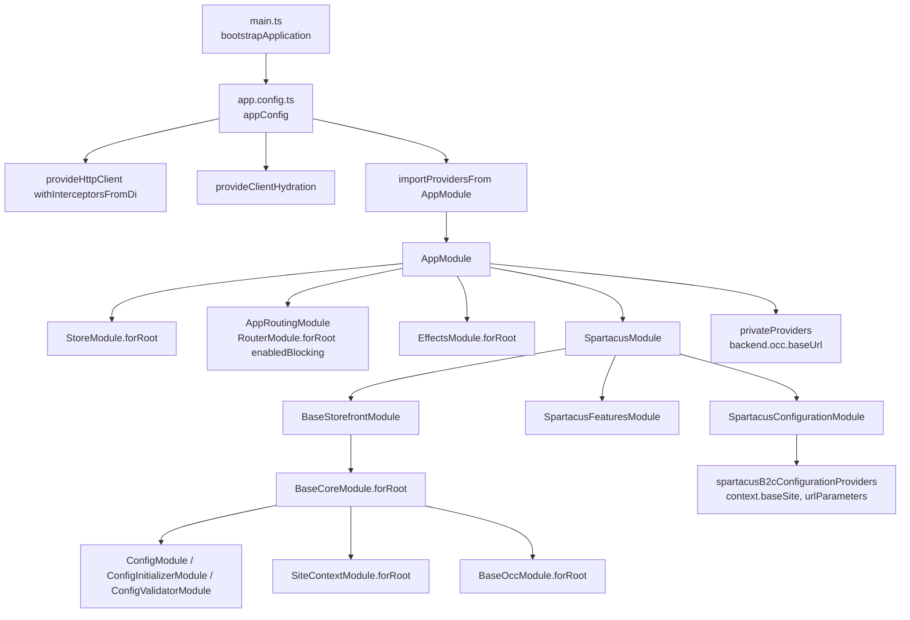
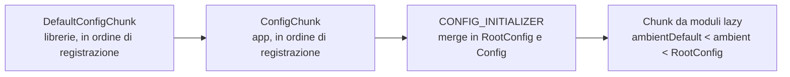
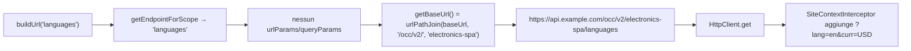
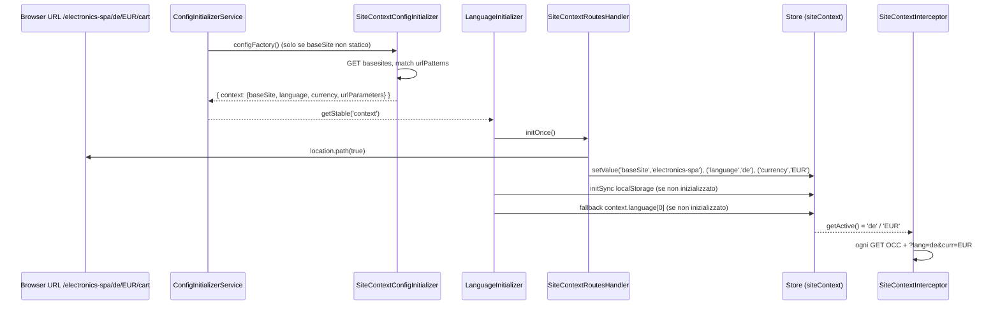
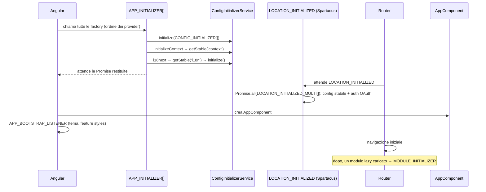

# 02 — Bootstrap e Configurazione

> Area A del deep dive. Revisione del codice: versione `2611.0.0` (Angular 21.2, NgRx 21, RxJS 7.8, TS 5.9).
> Tutti i path sono relativi alla root del repository (`/home/user/spartacus`).
> Quando una cosa non è verificabile leggendo il codice del repo è marcata **NON VERIFICATO NEL CODICE**.

Questo file è diviso in 5 parti. Ogni parte ha le stesse sezioni fisse:
"In una frase", "Il problema che risolve", "Come è implementato (con path)",
"Flusso passo-passo", "Codice minimo riscritto a mano", "Errori comuni", "Domande di autoverifica".

| Parte | Argomento |
|---|---|
| A1 | Come parte l'app: da `main.ts` a `BaseCoreModule` |
| A2 | Il sistema di configurazione (`Config`, chunk, `deepMerge`, initializer, validator) |
| A3 | `OccConfig`: dove sta il backend e come si costruiscono gli URL |
| A4 | Site Context: base site, lingua, valuta, URL e chiamate OCC |
| A5 | Tutti i token di inizializzazione (tabella) |

---

## Parte A1 — Come parte l'app

### In una frase

L'app demo parte con `bootstrapApplication(AppComponent, appConfig)`; `appConfig` importa il vecchio `AppModule` con `importProvidersFrom`, e da lì una catena di `NgModule` (`SpartacusModule` → `BaseStorefrontModule` → `BaseCoreModule.forRoot()`) registra centinaia di provider: config, store NgRx, interceptor HTTP e `APP_INITIALIZER`.

### Il problema che risolve

Spartacus è una libreria, non un'app. Deve:

1. lasciare all'app cliente il controllo di *cosa* attivare (feature, B2B/B2C, backend URL);
2. registrare in modo coerente tutto ciò che serve "sempre" (store NgRx, config, site context, i18n, routing CMS);
3. funzionare sia con il vecchio mondo `NgModule` sia con il nuovo bootstrap standalone di Angular.

La soluzione è un "guscio" standalone (`main.ts` + `app.config.ts`) che contiene tutto il mondo `NgModule` di Spartacus tramite `importProvidersFrom(AppModule)`.

### Come è implementato (con path)

**1. `projects/storefrontapp/src/main.ts`**

Chiama `bootstrapApplication(AppComponent, appConfig)`; se `environment.production` chiama prima `enableProdMode()`.

**2. `projects/storefrontapp/src/app/app.config.ts`** — costante `appConfig: ApplicationConfig`:

| Provider (in ordine) | Cosa fa |
|---|---|
| `provideHttpClient(withFetch(), withInterceptorsFromDi())` | `HttpClient` basato su `fetch`; `withInterceptorsFromDi()` è **indispensabile** perché tutti gli interceptor Spartacus sono registrati con il vecchio token `HTTP_INTERCEPTORS` |
| `provideClientHydration(withEventReplay(), withNoHttpTransferCache())` | hydration SSR; disattiva la transfer cache HTTP di Angular (Spartacus ha il suo meccanismo di TransferState, vedi file 09) |
| `provideZoneChangeDetection({ eventCoalescing: true })` | l'app usa ancora Zone.js |
| `provideBrowserGlobalErrorListeners()` | listener globali errori del browser |
| `importProvidersFrom(AppModule)` | "scongela" tutto il mondo `NgModule` |

Per SSR esiste `projects/storefrontapp/src/app/app.config.server.ts`: fa `mergeApplicationConfig(appConfig, serverConfig)` aggiungendo `provideServerRendering()`, `importProvidersFrom(AppServerModule)` (che usa `provideServer(...)` da `@spartacus/setup/ssr`, file `projects/storefrontapp/src/app/app.module.server.ts`) e `TestConfigServerModule.forRoot()` (solo per e2e).

**3. `projects/storefrontapp/src/app/app.module.ts`** — classe `AppModule`:

```ts
imports: [
  BrowserModule,
  StoreModule.forRoot({}),      // store NgRx vuoto: le feature si aggiungono con forFeature
  AppRoutingModule,             // da @spartacus/storefront: RouterModule.forRoot([], {initialNavigation: 'enabledBlocking'})
  EffectsModule.forRoot([]),
  SpartacusModule,
],
providers: [privateProviders],
```

- `AppRoutingModule` sta in `core-libs/storefront/router/app-routing.module.ts`: chiama `RouterModule.forRoot([], { anchorScrolling: 'enabled', initialNavigation: 'enabledBlocking' })` (le rotte sono **vuote**: le aggiunge il CMS a runtime), registra `provideDefaultConfig(defaultOnNavigateConfig)` e un `APP_INITIALIZER` con `onNavigateFactory` → `OnNavigateService.initializeWithConfig()`.
- `privateProviders` sta in `projects/storefrontapp/src/app/private/private.providers.ts` (funzione `makeEnvironmentProviders`): contiene la config del backend (`backend.occ.baseUrl = environment.occBaseUrl`, `prefix = environment.occApiPrefix`, `backend.media`), una rotta `product` custom, `features: { level: '*' }`, la chiave Google Maps di sviluppo e `TestConfigModule.forRoot({ cookie: 'cxConfigE2E' })`. Il commento nel file dice esplicitamente che `TestConfigModule` "Should be imported after other config modules".
- `environment.occBaseUrl` arriva da `buildProcess.env.CX_BASE_URL` (`projects/storefrontapp/src/environments/environment.ts`).

**4. `projects/storefrontapp/src/app/spartacus/spartacus.module.ts`** — classe `SpartacusModule`:

```ts
imports: [BaseStorefrontModule, SpartacusFeaturesModule, SpartacusConfigurationModule],
exports: [BaseStorefrontModule],
```

**5. `projects/storefrontapp/src/app/spartacus/spartacus-features.module.ts`** — classe `SpartacusFeaturesModule` (403 righe). Importa, nell'ordine:

- Auth: `AuthModule.forRoot()` (che a sua volta importa `UserAuthModule.forRoot()` e `ClientAuthModule.forRoot()`, `core-libs/core/src/auth/auth.module.ts`), `LogoutModule`, `LoginRouteModule`;
- componenti CMS di base (`HamburgerMenuModule`, `SiteContextSelectorModule`, `LinkModule`, `BannerModule`, ...);
- User core/UI (`UserModule`, `UserOccModule`, `PaymentMethodsModule`, ...);
- `AnonymousConsentsModule.forRoot()` + UI;
- Product core/UI (`ProductModule.forRoot()`, `ProductOccModule`, `ProductDetailsPageModule`, ...);
- `CostCenterOccModule`, eventi di pagina (`NavigationEventModule`, `HomePageEventModule`, `ProductPageEventModule`);
- opt-in: `ExternalRoutesModule.forRoot()`, `JsonLdBuilderModule`;
- le **feature library** tramite moduli "wrapper" locali in `projects/storefrontapp/src/app/spartacus/features/**` (es. `CartBaseFeatureModule`, `CheckoutFeatureModule`, `OrderFeatureModule`, `AsmFeatureModule`, ...);
- `...featureModules`: array costruito con `if (environment.b2b)`, `if (environment.cdc)`, ecc.

I suoi `providers` contengono `USE_MY_ACCOUNT_V2_CONSENT`, `USE_MY_ACCOUNT_V2_NOTIFICATION_PREFERENCE` e un grande `provideFeatureTogglesFactory(() => ({ ... }))` con tutti i feature toggle attivi per la demo.

Un feature module tipico, `projects/storefrontapp/src/app/spartacus/features/cart/cart-base-feature.module.ts` (`CartBaseFeatureModule`), importa solo il modulo *root* (`CartBaseRootModule`) e registra con `provideConfig({ featureModules: { [CART_BASE_FEATURE]: { module: () => import('./cart-base-wrapper.module') ... } } })` il modulo pesante da caricare **lazy**. Questo è il collegamento con `MODULE_INITIALIZER` (Parte A5) e con `ConfigurationService.unifiedConfig$` (Parte A2).

**6. `projects/storefrontapp/src/app/spartacus/spartacus-configuration.module.ts`** — classe `SpartacusConfigurationModule`. Solo `providers`:

- `provideConfigFactory(layoutConfigFactory)` e `provideConfig(mediaConfig)` (da `@spartacus/storefront`);
- `...defaultCmsContentProviders`;
- `provideConfig({ pwa: { enabled: false, addToHomeScreen: true } })`;
- `provideConfig({ i18n: { resources: {en, ja, de, zh}, chunks: translationChunksConfig, fallbackLang: 'en' } })`;
- `spartacusChannelSpecificConfigurationProviders` = B2B o B2C a seconda di `environment.b2b`.

Fuori dalla classe chiama anche `registerLocaleData(localeDe | localeJa | localeZh)`.

**7. `projects/storefrontapp/src/app/spartacus/spartacus-b2c-configuration.providers.ts`** — costante `spartacusB2cConfigurationProviders` (`makeEnvironmentProviders`):

```ts
provideConfig({
  context: {
    urlParameters: ['baseSite', 'language', 'currency'],
    baseSite: ['electronics-spa', 'electronics-spa-standalone', 'electronics', /* ... */ 'apparel-uk-standalone'],
  },
}),
provideConfig({ cart: { validation: { enabled: true }, selectiveCart: { enabled: true } } }),
```

Nota importante: siccome `context.baseSite` è **statico**, il caricamento della config di site context dal backend (`SiteContextConfigInitializer`) **non** viene attivato (vedi `initSiteContextConfig` in Parte A4).

**8. `core-libs/storefront/base-storefront.module.ts`** — classe `BaseStorefrontModule`, `imports` in quest'ordine:

| # | Modulo | Cosa registra (sintesi) |
|---|---|---|
| 1 | `BaseCoreModule.forRoot()` | tutto il core non-UI (tabella sotto) |
| 2 | `RouterModule` | direttive router |
| 3 | `GlobalMessageComponentModule` | componente messaggi globali |
| 4 | `OutletModule` | direttiva `cxOutlet` |
| 5 | `OutletRefModule` | direttiva `cxOutletRef` |
| 6 | `PwaModule` | `APP_INITIALIZER` `pwaFactory` (`core-libs/storefront/cms-structure/pwa/pwa.module.ts`) |
| 7 | `PageLayoutModule` | layout pagina |
| 8 | `SeoModule` | `APP_INITIALIZER` `initSeoService` + `htmlLangProvider` (`core-libs/storefront/cms-structure/seo/`) |
| 9 | `PageComponentModule.forRoot()` | mapping componenti CMS |
| 10 | `PageSlotModule` | slot CMS |
| 11 | `SkipLinkModule` | `APP_INITIALIZER` `skipLinkFactory` |
| 12 | `KeyboardFocusModule` | direttive a11y focus |
| 13 | `LayoutModule` | layout, include `ThemeModule` (`APP_BOOTSTRAP_LISTENER` `initTheme`) e `DirectionModule` |
| 14 | `RoutingModule.forRoot()` (storefront) | importa `CoreRoutingModule.forRoot()` + `CmsRouteModule`; config rotte default, guard `BEFORE_CMS_PAGE_GUARD` |
| 15 | `MediaModule.forRoot()` | `APP_INITIALIZER` `mediaPreconnectInitializer` |
| 16 | `OutletModule.forRoot()` | `APP_INITIALIZER` `registerOutletsFactory` |
| 17 | `CmsLcpModule.forRoot()` | contesto LCP |
| 18 | `StorefrontComponentModule` | `<cx-storefront>` |

**9. `core-libs/core/src/base-core.module.ts`** — classe `BaseCoreModule`, `imports` in quest'ordine esatto:

| # | Modulo | Cosa registra (verificato nei file) |
|---|---|---|
| 1 | `ErrorHandlingModule.forRoot()` | `ErrorHandler` → `CxErrorHandler`, `provideMultiErrorHandler()`, importa `EffectsErrorHandlerModule` e `HttpErrorHandlerModule`. Commento: "Import this module before any other interceptor" |
| 2 | `StateModule.forRoot()` | `stateMetaReducers` |
| 3 | `ConfigModule.forRoot()` | `provideConfig({})` + istanzia `ConfigurationService` nel costruttore |
| 4 | `ConfigInitializerModule.forRoot()` | `CONFIG_INITIALIZER_FORROOT_GUARD`, `APP_INITIALIZER` `configInitializerFactory`, `LOCATION_INITIALIZED_MULTI` che aspetta `getStable()` |
| 5 | `ConfigValidatorModule.forRoot()` | `APP_INITIALIZER` `configValidatorFactory` |
| 6 | `I18nModule.forRoot()` | `defaultI18nConfig`, `TranslationService` → `I18nextTranslationService`, `i18nextProviders` (`APP_INITIALIZER`), `CONFIG_INITIALIZER` `initI18nConfig` |
| 7 | `CmsModule.forRoot()` | `CmsService`, `defaultCmsModuleConfig`, `CmsStoreModule`, `PageMetaModule` |
| 8 | `GlobalMessageModule.forRoot()` | store + effect messaggi, `errorHandlers`, `httpErrorInterceptors` |
| 9 | `ProcessModule.forRoot()` | `ProcessStoreModule` |
| 10 | `FeaturesConfigModule.forRoot()` | `provideDefaultFeatureToggles(defaultFeatureToggles)`, `features.level` default `'3.0'`, `APP_BOOTSTRAP_LISTENER` per `FeatureStylesService` |
| 11 | `SiteContextModule.forRoot()` | vedi Parte A4. Commento: "should be imported after RouterModule.forRoot, because it overwrites UrlSerializer" |
| 12 | `MetaTagConfigModule.forRoot()` | `provideConfigFromMetaTags()`: legge `occ-backend-base-url` e `media-backend-base-url` dai `<meta>` |
| 13 | `BaseOccModule.forRoot()` | `WithCredentialsInterceptor`, `defaultOccConfig`, `occConfigValidator`; importa `CmsOccModule`, `SiteContextOccModule` |
| 14 | `LazyLoadingModule.forRoot()` | `APP_INITIALIZER` `moduleInitializersFactory` (esegue i `MODULE_INITIALIZER` eager) |
| 15 | `HttpModule.forRoot()` | importa `HttpTimeoutModule` |
| 16 | `SiteThemeModule.forRoot()` | `SiteThemeService`, `defaultSiteThemeConfig`, `siteThemeInitializerProviders` |
| 17 | `FederatedLoginModule` | `provideDefaultConfigFactory(defaultFederatedLoginConfigFactory)` |

### Flusso passo-passo



1. Il browser carica il bundle; `main.ts` esegue `bootstrapApplication`.
2. Angular crea l'`EnvironmentInjector` radice con i provider di `appConfig`. `importProvidersFrom(AppModule)` "appiattisce" l'albero dei moduli: **prima i provider dei moduli importati (in profondità, nell'ordine degli `imports`), poi i `providers` del modulo stesso** (comportamento del compilatore DI Angular — NON VERIFICATO NEL CODICE del repo, è logica di `@angular/core`). Per questo `privateProviders` (in `AppModule.providers`) arrivano **dopo** tutti i chunk di `SpartacusModule` e quindi vincono nel merge (Parte A2).
3. Angular esegue gli **`APP_INITIALIZER`** (Parte A5): il più importante è `configInitializerFactory`, che risolve la config asincrona.
4. In parallelo il router, configurato con `initialNavigation: 'enabledBlocking'`, aspetta `LOCATION_INITIALIZED`, che Spartacus ridefinisce in `core-libs/core/src/routing/routing.module.ts` (`locationInitializedFactory`) come `Promise.all` di tutti i `LOCATION_INITIALIZED_MULTI`.
5. Terminati gli initializer, Angular crea `AppComponent` (`projects/storefrontapp/src/app/app.component.ts`, template `<cx-storefront />`) ed esegue gli `APP_BOOTSTRAP_LISTENER` (`initTheme`, `FeatureStylesService.init`).
6. Parte la prima navigazione; la rotta viene risolta dal CMS (file 04/05).

### Codice minimo riscritto a mano

Un mini-bootstrap "alla Spartacus" (solo concetto, non codice del repo):

```ts
// main.ts
import { bootstrapApplication } from '@angular/platform-browser';
import { ApplicationConfig, importProvidersFrom, NgModule } from '@angular/core';
import { provideHttpClient, withInterceptorsFromDi } from '@angular/common/http';
import { AppComponent } from './app.component';

// "BaseCoreModule" giocattolo: registra config + initializer
@NgModule({ providers: [/* provideDefaultConfig(...), APP_INITIALIZER... */] })
class MiniCoreModule {}

// "SpartacusModule" dell'app: sceglie cosa attivare
@NgModule({
  imports: [MiniCoreModule],
  providers: [/* provideConfig({ backend: { occ: { baseUrl: 'https://api.example.com' } } }) */],
})
class MiniShopModule {}

const appConfig: ApplicationConfig = {
  providers: [
    provideHttpClient(withInterceptorsFromDi()), // senza questo gli HTTP_INTERCEPTORS "classici" non girano!
    importProvidersFrom(MiniShopModule),
  ],
};

bootstrapApplication(AppComponent, appConfig).catch(console.error);
```

### Errori comuni

- **Dimenticare `withInterceptorsFromDi()`**: `SiteContextInterceptor`, `WithCredentialsInterceptor`, gli interceptor auth ecc. sono registrati con `HTTP_INTERCEPTORS` e verrebbero ignorati. Nessuna chiamata OCC avrebbe `lang`/`curr` né il token.
- **Importare `BaseCoreModule` due volte** (es. in un modulo lazy): `ConfigInitializerModule.forRoot()` e gli `APP_INITIALIZER` verrebbero duplicati in un injector figlio. Il `forRoot()` va importato solo nella root.
- **Mettere `SiteContextModule.forRoot()` prima di `RouterModule.forRoot()`**: `RouterModule.forRoot` registra il suo `UrlSerializer` e sovrascriverebbe `SiteContextUrlSerializer` (commento in `base-core.module.ts`). Nell'app demo l'ordine è corretto perché `AppRoutingModule` è importato in `AppModule` prima di `SpartacusModule`.
- **Credere che `AppRoutingModule` contenga le rotte**: `RouterModule.forRoot([])` ha rotte vuote; le aggiunge `CmsRouteModule` (`addCmsRoute`) e la config `routing`.
- **Aspettarsi la config B2B** in un'app B2C: in `spartacus-configuration.module.ts` la scelta avviene a build time con `environment.b2b`.

### Domande di autoverifica

1. Perché `app.config.ts` usa `importProvidersFrom(AppModule)` invece di dichiarare tutti i provider direttamente?
2. Quale modulo, dentro `BaseCoreModule`, va importato per primo e perché?
3. Dove si trova il `baseUrl` OCC nell'app demo e da quale variabile d'ambiente arriva?
4. Perché i `privateProviders` "vincono" sui chunk dichiarati in `SpartacusConfigurationModule`?
5. In che modo un feature module (es. `CartBaseFeatureModule`) evita di caricare subito tutto il codice del carrello?

---

## Parte A2 — Il sistema di configurazione

### In una frase

In Spartacus tutta la configurazione è **un unico grande oggetto** (`Config`) costruito unendo con `deepMerge` tanti pezzi ("chunk") forniti da librerie (`DefaultConfigChunk`) e dall'app (`ConfigChunk`), eventualmente completato in modo **asincrono** da `CONFIG_INITIALIZER` e controllato da **validator** in dev mode.

### Il problema che risolve

- Decine di librerie devono fornire valori di default (endpoint OCC, rotte, layout, traduzioni) **senza conoscersi tra loro**.
- L'app cliente deve poter sovrascrivere *solo* il pezzetto che le interessa (es. `backend.occ.baseUrl`) senza ricopiare tutto.
- Alcuni valori si conoscono solo a runtime (es. il base site dipende dall'URL e dalla risposta di `/basesites`).
- Moduli caricati lazy portano con sé altra config dopo il bootstrap.

La risposta è un pattern "multi-provider + merge profondo + precedenza fissa".

### Come è implementato (con path)

Cartella: `core-libs/core/src/config/`.

#### `Config` (classe astratta-token) — `config-tokens.ts`

```ts
@Injectable({ providedIn: 'root', useFactory: configFactory })
export abstract class Config {}

export function configFactory() {
  return deepMerge({}, inject(DefaultConfig), inject(RootConfig));
}
```

- È una **classe astratta usata come token DI**: chi scrive `constructor(config: Config)` riceve l'oggetto unito.
- È vuota: ogni libreria la "estende" con la **declaration merging** di TypeScript. Esempio reale in `core-libs/core/src/occ/config/occ-config.ts`:

```ts
declare module '../../config/config-tokens' {
  interface Config extends OccConfig {}
}
```

- Le config "tipizzate" (`OccConfig`, `SiteContextConfig`, `I18nConfig`, `RoutingConfig`, ...) sono a loro volta classi astratte con `@Injectable({ providedIn: 'root', useExisting: Config })`: **sono alias dello stesso oggetto** `Config`, solo con un tipo più stretto.

#### Token `DefaultConfig`, `RootConfig`, `ConfigChunk`, `DefaultConfigChunk` — `config-tokens.ts`

| Token | Tipo | Come viene costruito |
|---|---|---|
| `DefaultConfigChunk` | `InjectionToken<Config[]>` multi | lo riempiono le librerie con `provideDefaultConfig*` |
| `ConfigChunk` | `InjectionToken<Config[]>` multi | lo riempie l'app con `provideConfig*` |
| `DefaultConfig` | `InjectionToken`, `providedIn: 'root'` | `defaultConfigFactory()` = `deepMerge({}, ...inject(DefaultConfigChunk))` |
| `RootConfig` | `InjectionToken`, `providedIn: 'root'` | `rootConfigFactory()` = `deepMerge({}, ...inject(ConfigChunk))` |
| `Config` | classe astratta | `configFactory()` = `deepMerge({}, DefaultConfig, RootConfig)` |

#### Helper di registrazione — `config-providers.ts`

| Funzione | Token | Tipo provider |
|---|---|---|
| `provideConfig(config = {}, defaultConfig = false)` | `ConfigChunk` (o `DefaultConfigChunk` se `defaultConfig=true`) | `ValueProvider`, `multi: true` |
| `provideConfigFactory(factory, deps?, defaultConfig = false)` | `ConfigChunk` (o default) | `FactoryProvider`, `multi: true` |
| `provideDefaultConfig(config = {})` | `DefaultConfigChunk` | `ValueProvider`, `multi: true` |
| `provideDefaultConfigFactory(factory, deps?)` | `DefaultConfigChunk` | `FactoryProvider`, `multi: true` |

Il tipo `ConfigFactory` è in `config-factory.ts`: `(...props: any[]) => Config`.

Regola (dai commenti in `config-tokens.ts`): *"all config provided in libraries should be provided as default config"*. Il repo la impone anche con regole ESLint custom: in `config.module.ts` compaiono i commenti `eslint-disable-next-line @nx/workspace-use-provide-default-config`.

#### `ConfigModule` — `config.module.ts`

- `ConfigModule.withConfig(config)` → `provideConfig(config)`;
- `ConfigModule.withConfigFactory(factory, deps)` → `provideConfigFactory(...)`;
- `ConfigModule.forRoot(config = {})` → `provideConfig(config)`;
- il costruttore inietta `ConfigurationService` "To make sure ConfigurationService will be instantiated".

Oggi il modo raccomandato è usare direttamente `provideConfig`/`provideDefaultConfig` nei `providers`.

#### `deepMerge` — `utils/deep-merge.ts`

```ts
export function deepMerge(target: Record<string, unknown> = {}, ...sources: any[]): any
```

Regole reali (leggendo il codice):

1. **muta** `target` e lo restituisce;
2. processa le sorgenti **da sinistra a destra**: l'ultima vince;
3. oggetti "semplici" → merge ricorsivo;
4. **array → sostituiti interi** (`isObject` ritorna `false` per gli array, quindi `target[key] = source[key]`);
5. `Date` → copiata per riferimento;
6. chiavi `__proto__` e `constructor` **ignorate** (`isRestricted`, protezione da prototype pollution);
7. una sorgente non-oggetto (es. `undefined`) viene saltata.

#### `ConfigurationService` — `services/configuration.service.ts`

Esiste. Espone:

- `config: Config` — la config globale;
- `unifiedConfig$: Observable<Config>` — un `BehaviorSubject` che riemette quando arrivano chunk da **moduli lazy**.

Come funziona: usa `UnifiedInjector.get(ConfigChunk, [])` e `get(DefaultConfigChunk, [])` (`core-libs/core/src/lazy-loading/unified-injector.ts`), che emettono i chunk di ogni nuovo injector di modulo lazy. In `emitUnifiedConfig()` calcola:

```ts
deepMerge({}, this.defaultConfig, this.ambientDefaultConfig, this.ambientConfig, this.rootConfig)
```

e, se il flag `disableConfigUpdates` **non** è attivo (`isFeatureEnabled(this.config, 'disableConfigUpdates')`), fa anche `deepMerge(this.config, newConfig)`, cioè **muta l'oggetto `Config` globale** (meccanismo di compatibilità descritto in `core-libs/core/src/features-config/config/features-config.ts`).

#### `ConfigInitializer`, `CONFIG_INITIALIZER`, `ConfigInitializerService` — `config-initializer/`

- Interfaccia `ConfigInitializer` (`config-initializer.ts`): `scopes: string[]` + `configFactory: () => Promise<Config>`.
- Token multi `CONFIG_INITIALIZER`; helper `provideConfigInitializer(Class)` e `provideConfigInitializerFactory(() => initializer | null)`.
- Token `CONFIG_INITIALIZER_FORROOT_GUARD`: se presente, la config è considerata "da stabilizzare".
- `ConfigInitializerModule.forRoot()` (`config-initializer.module.ts`) registra:
  - `APP_INITIALIZER` con `configInitializerFactory(configInitializer, initializers)` → `configInitializer.initialize(initializers)`;
  - `provideLocationInitializerFactory(...)` che blocca la navigazione iniziale finché `getStable()` non emette.
- `ConfigInitializerService` (`config-initializer.service.ts`):
  - `isStable`: `true` se non c'è la guard o se non ci sono scope in corso;
  - `getStable(...scopes)`: Observable che emette la config quando gli scope richiesti (es. `'context'`, `'i18n.fallbackLang'`) non sono più "in corso". Senza argomenti aspetta **tutto**;
  - `initialize(initializers)`: per ogni initializer non nullo registra gli scope (errore `'CONFIG_INITIALIZER should provide scope!'` se mancano), lancia `configFactory()` **in parallelo**, e alla risoluzione fa `deepMerge(this.rootConfig, cfg)` **e** `deepMerge(this.config, cfg)`, poi `finishScopes`. In dev mode avvisa se due initializer coprono lo stesso scope;
  - `scopesOverlap(a, b)`: `'test.a'` e `'test'` si sovrappongono, `'test'` e `'testA'` no.

CONFIG_INITIALIZER registrati nel core (grep su `provide: CONFIG_INITIALIZER` / `provideConfigInitializerFactory(`):

| Dove | Initializer | Scope | Attivo solo se |
|---|---|---|---|
| `core-libs/core/src/site-context/site-context.module.ts` (`initSiteContextConfig`) | `SiteContextConfigInitializer` | `['context']` | manca `context.baseSite` statico |
| `core-libs/core/src/i18n/i18n.module.ts` (`initI18nConfig`) | `I18nConfigInitializer` | `['i18n.fallbackLang']` | manca `i18n.fallbackLang` statico |
| `core-libs/core/src/routing/routing.module.ts` (`initSecurePortalConfig`) | `SecurePortalConfigInitializer` | `['routing']` | `routing.protected === undefined` |
| `core-libs/core/src/auth/user-auth/user-auth.module.ts` | `AuthConfigInitializer` | `['authentication.OAuthLibConfig.redirectUri', 'authentication.client_id']` | feature toggle `asyncAuthConfigInitializer` |

Il pattern "ritorno `null` se la config statica c'è già" è voluto: `initialize()` salta gli initializer falsy (`if (!initializer) continue;`).

#### Validator — `config-validator/`

- `ConfigValidator = (config: Config) => string | void` (`config-validator.ts`).
- `provideConfigValidator(fn)` → multi su `ConfigValidatorToken`.
- `ConfigValidatorModule.forRoot()` registra un `APP_INITIALIZER` (`configValidatorFactory`) che **solo in `isDevMode()`** aspetta `getStable()` e chiama `validateConfig`, che fa `logger.warn(messaggio)` per ogni validator che ritorna una stringa. Non blocca mai l'app.
- Esempi reali: `occConfigValidator` (`core-libs/core/src/occ/config/occ-config-validator.ts`, messaggio "Please configure backend.occ.baseUrl before using storefront library!") e `baseSiteConfigValidator` (`core-libs/core/src/site-context/config/base-site-config-validator.ts`).

#### Config da `<meta>` — `core-libs/core/src/occ/config/config-from-meta-tag-factory.ts`

`provideConfigFromMetaTags()` registra due `provideConfigFactory(..., [Meta])` che leggono `<meta name="occ-backend-base-url">` e `<meta name="media-backend-base-url">`, ignorando i placeholder `OCC_BACKEND_BASE_URL_VALUE` / `MEDIA_BACKEND_BASE_URL_VALUE`. Serve a cambiare backend **senza ricompilare** (sostituendo il valore nell'`index.html`). Sono `ConfigChunk` (non default): hanno quindi priorità alta.

#### Config da cookie (solo test) — `core-libs/core/src/config/test-config.module.ts`

`TestConfigModule.forRoot({ cookie })` legge un JSON da cookie (`TEST_CONFIG`) e lo registra con `provideConfigFactory` e `provideFeatureTogglesFactory`. Il file ripete "DON'T USE IT IN PRODUCTION".

#### Feature toggles (sistema parallelo) — `core-libs/core/src/features-config/feature-toggles/`

Stessa idea, ma con `Object.assign` (merge **superficiale**, non `deepMerge`): `FeatureToggles` = `Object.assign({}, DefaultFeatureToggles, RootFeatureToggles)` in `feature-toggles-tokens.ts`; helper `provideFeatureToggles`, `provideFeatureTogglesFactory`, `provideDefaultFeatureToggles`, `provideDefaultFeatureTogglesFactory` in `feature-toggles-providers.ts`.

### Ordine di precedenza (dal più debole al più forte)



1. **`DefaultConfigChunk`** (librerie), uniti nell'ordine in cui Angular li raccoglie nel multi-provider: l'ultimo registrato vince.
2. **`ConfigChunk`** (app, meta tag, test cookie), stesso criterio. Qualsiasi `ConfigChunk` batte qualsiasi `DefaultConfigChunk`, a prescindere dall'ordine, perché `configFactory` fa `deepMerge({}, DefaultConfig, RootConfig)`.
3. **Risultati dei `CONFIG_INITIALIZER`**: vengono uniti *dopo* sia in `RootConfig` sia in `Config`, quindi sovrascrivono. In pratica gli initializer del core si attivano solo quando il valore statico manca, quindi "riempiono buchi".
4. **Chunk dei moduli lazy** (`ConfigurationService.emitUnifiedConfig`): `defaultConfig < ambientDefaultConfig < ambientConfig < rootConfig`. Conseguenza: un modulo lazy **non può** sovrascrivere un valore messo dall'app in `RootConfig`, può solo aggiungere chiavi nuove.

### Flusso passo-passo

```mermaid
sequenceDiagram
  participant NG as Angular DI
  participant CF as configFactory
  participant AI as APP_INITIALIZER (configInitializerFactory)
  participant CIS as ConfigInitializerService
  participant INIT as CONFIG_INITIALIZER[]
  participant V as ConfigValidator
  NG->>CF: primo inject(Config)
  CF->>NG: inject(DefaultConfig) = deepMerge(DefaultConfigChunk[])
  CF->>NG: inject(RootConfig) = deepMerge(ConfigChunk[])
  CF-->>NG: Config = deepMerge({}, Default, Root)
  NG->>AI: esegue initializer
  AI->>CIS: initialize(initializers)
  CIS->>INIT: configFactory() in parallelo
  INIT-->>CIS: chunk async
  CIS->>CIS: deepMerge(rootConfig, chunk); deepMerge(config, chunk); finishScopes
  CIS-->>V: getStable() emette (solo dev mode)
  V->>V: validateConfig -> logger.warn
```

1. Il primo che inietta `Config` (o un suo alias, es. `OccConfig`) fa scattare `configFactory`.
2. `DefaultConfig` e `RootConfig` vengono calcolati una sola volta (token `providedIn: 'root'`).
3. Durante gli `APP_INITIALIZER`, `ConfigInitializerService.initialize` avvia gli initializer e **muta** lo stesso oggetto `Config` già iniettato ovunque: chi ha letto troppo presto un valore async può averlo visto `undefined` → usare `getStable('scope')`.
4. Il `LOCATION_INITIALIZED_MULTI` registrato da `ConfigInitializerModule` impedisce la prima navigazione finché la config non è stabile.
5. In dev mode, a config stabile, girano i validator.
6. Dopo il bootstrap, ogni modulo lazy caricato può aggiungere chunk: `ConfigurationService` ricalcola e riemette `unifiedConfig$`.

### Codice minimo riscritto a mano

Una versione giocattolo completa (~60 righe) dello stesso pattern:

```ts
import { inject, Injectable, InjectionToken, Provider, APP_INITIALIZER } from '@angular/core';

// 1) deepMerge semplificato (array sostituiti, oggetti fusi)
function isObj(x: unknown): x is Record<string, unknown> {
  return !!x && typeof x === 'object' && !Array.isArray(x);
}
export function deepMerge(target: any = {}, ...sources: any[]): any {
  for (const src of sources) {
    if (!isObj(src)) continue;
    for (const key of Object.keys(src)) {
      if (key === '__proto__' || key === 'constructor') continue;
      if (isObj(src[key])) {
        if (!isObj(target[key])) target[key] = {};
        deepMerge(target[key], src[key]);
      } else {
        target[key] = src[key];
      }
    }
  }
  return target;
}

// 2) token
export const MiniDefaultChunk = new InjectionToken<object[]>('MiniDefaultChunk');
export const MiniChunk = new InjectionToken<object[]>('MiniChunk');

@Injectable({
  providedIn: 'root',
  useFactory: () =>
    deepMerge(
      {},
      ...(inject(MiniDefaultChunk, { optional: true }) ?? []),
      ...(inject(MiniChunk, { optional: true }) ?? []),
    ),
})
export abstract class MiniConfig {
  backend?: { occ?: { baseUrl?: string; prefix?: string } };
  context?: { [k: string]: string[] | undefined };
}

// 3) helper
export const provideMiniDefaultConfig = (c: MiniConfig): Provider =>
  ({ provide: MiniDefaultChunk, useValue: c, multi: true });
export const provideMiniConfig = (c: MiniConfig): Provider =>
  ({ provide: MiniChunk, useValue: c, multi: true });

// 4) initializer asincrono giocattolo
export const MINI_CONFIG_INITIALIZER = new InjectionToken<(() => Promise<MiniConfig>)[]>('MINI_CI');

export const miniConfigInitProvider: Provider = {
  provide: APP_INITIALIZER,
  multi: true,
  useFactory: () => {
    const config = inject(MiniConfig);
    const inits = inject(MINI_CONFIG_INITIALIZER, { optional: true }) ?? [];
    return () =>
      Promise.all(inits.map((f) => f().then((chunk) => deepMerge(config, chunk))));
  },
};

// Uso:
// providers: [
//   provideMiniDefaultConfig({ backend: { occ: { prefix: '/occ/v2/' } } }),   // libreria
//   provideMiniConfig({ backend: { occ: { baseUrl: 'https://api.example.com' } } }), // app
//   miniConfigInitProvider,
// ]
// risultato: { backend: { occ: { prefix: '/occ/v2/', baseUrl: 'https://api.example.com' } } }
```

### Errori comuni

- **Usare `provideConfig` dentro una libreria**: il valore diventa "app-level" e il cliente non riesce più a sovrascriverlo con un proprio `provideConfig` registrato prima. Nelle librerie si usa `provideDefaultConfig`.
- **Aspettarsi che gli array si uniscano**: `provideConfig({ context: { language: ['it'] } })` **sostituisce** l'intera lista di default (`defaultSiteContextConfigFactory` ha 17 lingue), non aggiunge `'it'`.
- **Leggere config asincrona nel costruttore**: `config.context.baseSite` può essere ancora `undefined` se caricata dal backend. Usare `configInitializerService.getStable('context')`.
- **`CONFIG_INITIALIZER` senza `scopes`**: `initialize()` lancia `Error('CONFIG_INITIALIZER should provide scope!')`.
- **Contare sui validator in produzione**: girano solo con `isDevMode()`.
- **Clonare `Config` e aspettarsi aggiornamenti**: il meccanismo si basa sulla **mutazione** dello stesso oggetto (`deepMerge(this.config, ...)` sia in `ConfigInitializerService` sia in `ConfigurationService`).

### Domande di autoverifica

1. Qual è la differenza tra `RootConfig` e `DefaultConfig`, e come vengono combinati in `configFactory`?
2. Cosa succede con `deepMerge({a: [1, 2]}, {a: [3]})`?
3. Perché `OccConfig` è dichiarata con `useExisting: Config`?
4. Quando `initSiteContextConfig` restituisce `null` e cosa comporta?
5. Un modulo lazy fornisce `provideConfig({ backend: { occ: { baseUrl: 'x' } } })`: sovrascrive il `baseUrl` dell'app? Perché?
6. A cosa serve `getStable('context')` rispetto a `getStable()` senza argomenti?

---

## Parte A3 — `OccConfig`: dove sta il backend

### In una frase

`OccConfig` è la "vista tipizzata" della config che descrive il backend SAP Commerce (`backend.occ.baseUrl`, `prefix`, `endpoints`, `backend.media`, `loadingScopes`) ed estende `SiteContextConfig` (`context.baseSite`, `language`, `currency`, `urlParameters`); `OccEndpointsService` la usa per costruire ogni URL.

### Il problema che risolve

Ogni chiamata OCC ha la forma:

```
{baseUrl}{prefix}{baseSite}/{endpoint con ${placeholder}}?{query}&lang=..&curr=..
es. https://api.example.com/occ/v2/electronics-spa/products/1234?fields=FULL&lang=en&curr=USD
```

Senza un punto unico di configurazione ogni adapter dovrebbe ricostruire questa stringa a mano, e cambiare backend, prefisso o formato di un endpoint richiederebbe modifiche in decine di file.

### Come è implementato (con path)

**`core-libs/core/src/occ/config/occ-config.ts`**

```ts
export interface BackendConfig {
  occ?: {
    baseUrl?: string;
    prefix?: string;
    useWithCredentials?: boolean;
    endpoints?: OccEndpoints;
  };
  media?: { baseUrl?: string; prefix?: string };
  loadingScopes?: LoadingScopes;
}

@Injectable({ providedIn: 'root', useExisting: Config })
export abstract class OccConfig extends SiteContextConfig {
  backend?: BackendConfig;
}
```

| Chiave | Significato | Default / dove |
|---|---|---|
| `backend.occ.baseUrl` | host del backend | nessun default; validato da `occConfigValidator`; nell'app demo da `environment.occBaseUrl`; può arrivare dal meta tag `occ-backend-base-url` |
| `backend.occ.prefix` | path API | `'/occ/v2/'` in `defaultOccConfig` (`core-libs/core/src/occ/config/default-occ-config.ts`) |
| `backend.occ.useWithCredentials` | se definito, `WithCredentialsInterceptor` aggiunge `withCredentials: true` alle richieste che contengono il prefix | `core-libs/core/src/occ/interceptors/with-credentials.interceptor.ts` |
| `backend.occ.endpoints` | mappa nome → template (stringa o `OccEndpoint` con scope) | ogni `*OccModule` fornisce i suoi con `provideDefaultConfig`; es. `defaultOccSiteContextConfig` in `core-libs/core/src/occ/adapters/site-context/default-occ-site-context-config.ts` (`languages`, `currencies`, `countries`, `regions`, `baseSites: 'basesites?fields=FULL'`, ...) |
| `backend.media.baseUrl` / `prefix` | host/prefisso immagini | letti in `MediaService.getBaseUrl()` (`core-libs/storefront/shared/components/media/media.service.ts`): `media.baseUrl ?? occ.baseUrl ?? ''`; il `prefix` è applicato solo con il toggle `enableMediaPrefix` |
| `backend.loadingScopes` | scope di caricamento per modello (es. prodotto) | tipi in `core-libs/core/src/occ/config/loading-scopes-config.ts` |
| `context.*` | parametri di site context | in `SiteContextConfig` (Parte A4) |

`OccEndpoint` (`core-libs/core/src/occ/occ-models/occ-endpoints.model.ts`): `{ default?: string; [scope: string]: string | undefined }`, con `DEFAULT_SCOPE = 'default'`. Permette per esempio `product: { list: '...', details: '...' }`.

**`core-libs/core/src/occ/services/occ-endpoints.service.ts`** — classe `OccEndpointsService`:

- nel costruttore si sottoscrive a `BaseSiteService.getActive()` e memorizza `_activeBaseSite`; se non c'è ancora, usa `getContextParameterDefault(config, 'baseSite')` (primo elemento dell'array);
- `getBaseUrl({ baseUrl, prefix, baseSite })` → `urlPathJoin(baseUrl, prefix, baseSite)`; ogni pezzo si può omettere passando `false`;
- `getPrefix()` aggiunge `/` davanti se manca;
- `buildUrl(endpoint, { urlParams, queryParams, scope }, propertiesToOmit)`:
  1. prende il template con `getEndpointForScope` (se manca, usa **il nome stesso** dell'endpoint come path, e in dev mode avvisa se manca lo scope);
  2. sostituisce `${var}` con `StringTemplate.resolve(url, urlParams, true)` (valori **encodati** con `encodeURIComponent`, `core-libs/core/src/config/utils/string-template.ts`);
  3. unisce la query già presente nel template con `queryParams` usando `HttpParams` e `HttpParamsURIEncoder`; `null` rimuove un parametro, `undefined` viene ignorato;
  4. antepone `getBaseUrl(propertiesToOmit)`.
- `getRawEndpointValue`, `isConfigured` per interrogare la config.

`urlPathJoin` (`core-libs/core/src/occ/utils/occ-url-util.ts`) filtra le parti vuote e toglie gli slash doppi.

**`core-libs/core/src/occ/base-occ.module.ts`** — `BaseOccModule.forRoot()` registra `HTTP_INTERCEPTORS` → `WithCredentialsInterceptor`, `provideDefaultConfig(defaultOccConfig)`, `provideConfigValidator(occConfigValidator)`, e importa `CmsOccModule`, `SiteContextOccModule`.

### Flusso passo-passo

Esempio: `OccSiteAdapter.loadLanguages()` (`core-libs/core/src/occ/adapters/site-context/occ-site.adapter.ts`) chiama `occEndpointsService.buildUrl('languages')`.



1. L'adapter chiama `buildUrl`.
2. Il template viene preso da `config.backend.occ.endpoints.languages`.
3. Viene anteposto `baseUrl + prefix + baseSite attivo`.
4. `HttpClient` passa per gli interceptor: `SiteContextInterceptor` (Parte A4) aggiunge `lang` e `curr`, `WithCredentialsInterceptor` eventualmente `withCredentials`.
5. Per `basesites` l'adapter usa `buildUrl('baseSites', {}, { baseSite: false })`: il base site non è ancora noto (è proprio ciò che si sta scaricando).

### Codice minimo riscritto a mano

```ts
import { Injectable } from '@angular/core';

interface MiniOcc {
  baseUrl: string;
  prefix: string;
  endpoints: Record<string, string>;
}

const join = (...parts: string[]) =>
  parts
    .filter(Boolean)
    .map((p, i) => (i === 0 ? p.replace(/\/+$/, '') : p.replace(/^\/+|\/+$/g, '')))
    .join('/');

@Injectable({ providedIn: 'root' })
export class MiniEndpoints {
  activeBaseSite = 'electronics-spa';
  constructor(private occ: MiniOcc) {}

  buildUrl(
    name: string,
    urlParams: Record<string, string> = {},
    queryParams: Record<string, string | undefined> = {},
    omitBaseSite = false,
  ): string {
    let path = this.occ.endpoints[name] ?? name;               // fallback: nome = path
    for (const [k, v] of Object.entries(urlParams)) {
      path = path.replace(new RegExp('\\$\\{' + k + '\\}', 'g'), encodeURIComponent(v));
    }
    const qs = Object.entries(queryParams)
      .filter(([, v]) => v !== undefined)
      .map(([k, v]) => `${k}=${encodeURIComponent(v!)}`)
      .join('&');
    const base = join(this.occ.baseUrl, this.occ.prefix, omitBaseSite ? '' : this.activeBaseSite);
    return join(base, path) + (qs ? (path.includes('?') ? '&' : '?') + qs : '');
  }
}

// new MiniEndpoints({ baseUrl: 'https://api.example.com', prefix: '/occ/v2/',
//   endpoints: { product: 'products/${productCode}' } })
//   .buildUrl('product', { productCode: 'A 1' }, { fields: 'FULL' })
// → 'https://api.example.com/occ/v2/electronics-spa/products/A%201?fields=FULL'
```

### Errori comuni

- **`baseUrl` con `/occ/v2` dentro**: il prefisso verrebbe aggiunto due volte. `baseUrl` è solo l'host (es. `https://api.example.com`).
- **Dimenticare `baseUrl`**: in dev appare il warning di `occConfigValidator`; gli URL diventano relativi (`/occ/v2/...`) e vanno allo stesso host dell'app (utile solo dietro proxy).
- **Endpoint non configurato**: `getEndpointForScope` usa il nome dell'endpoint come path, quindi un refuso produce una 404 silenziosa, non un errore.
- **Passare valori già encodati in `urlParams`**: `buildUrl` li encoda di nuovo (`StringTemplate.resolve(..., true)`) → doppio encoding.
- **Sovrascrivere `endpoints.product` con una stringa** quando il codice usa scope (`list`, `details`): per `scope !== 'default'` si otterrà il warning "endpoint configuration missing for scope" e verrà usato il fallback.

### Domande di autoverifica

1. Quale file fornisce il default `prefix: '/occ/v2/'`?
2. Perché `loadBaseSites` usa `{ baseSite: false }`?
3. Che cosa restituisce `buildUrl('foo')` se `endpoints.foo` non esiste?
4. Qual è l'ordine di fallback per l'URL base dei media?
5. In che modo si può cambiare il `baseUrl` senza ricompilare l'app?

---

## Parte A4 — Site Context

### In una frase

Il site context è l'insieme dei parametri "globali" della sessione di shopping (**base site**, **lingua**, **valuta**, più **tema**) tenuti nello store NgRx, sincronizzati con l'URL (`/electronics-spa/en/USD/...`) e aggiunti automaticamente a ogni chiamata OCC (`baseSite` nel path, `lang`/`curr` in query).

### Il problema che risolve

- Lo stesso storefront serve più siti/negozi (`electronics-spa`, `apparel-uk`, ...), più lingue e valute.
- Il valore attivo deve venire, in ordine, da: URL, eventualmente localStorage, config di default.
- Cambiare lingua deve aggiornare l'URL senza ricaricare, e viceversa navigare a `/de/...` deve cambiare lingua.
- Tutte le chiamate al backend devono usare i valori correnti.

### Come è implementato (con path)

Cartella: `core-libs/core/src/site-context/`.

#### Config — `config/`

- `SiteContextConfig` (`config/site-context-config.ts`): `context?: { urlParameters?: string[]; [contextName: string]: string[] | undefined }`. Alias di `Config` (`useExisting: Config`). **Ogni parametro è un array; il primo elemento è il default.**
- `defaultSiteContextConfigFactory` (`config/default-site-context-config.ts`): default per `language` (17 codici, primo `'en'`) e `currency` (20 codici, primo `'USD'`). **Nessun default per `baseSite`.**
- `getContextParameterValues` / `getContextParameterDefault` (`config/context-config-utils.ts`): leggono l'array e il suo primo elemento.
- `baseSiteConfigValidator` (`config/base-site-config-validator.ts`): warning se manca il default di `baseSite`.

#### ID dei contesti — `providers/context-ids.ts`

```ts
export const LANGUAGE_CONTEXT_ID = 'language';
export const CURRENCY_CONTEXT_ID = 'currency';
export const BASE_SITE_CONTEXT_ID = 'baseSite';
export const THEME_CONTEXT_ID = 'theme';
```

#### Facade — `facade/`

Interfaccia `SiteContext<T>` (`facade/site-context.interface.ts`): `getAll()`, `getActive()`, `setActive(isocode)`.

| Classe | File | Note |
|---|---|---|
| `BaseSiteService` | `facade/base-site.service.ts` | `getActive()` da `SiteContextSelectors.getActiveBaseSite`; `getAll()` dispatcha `LoadBaseSites` se vuoto; `get(uid?)`; `setActive` **non** chiama `isValid` (a differenza di lingua/valuta) |
| `LanguageService` | `facade/language.service.ts` | `setActive` dispatcha `SetActiveLanguage` solo se diverso e `isValid` (cioè presente in `context.language`) |
| `CurrencyService` | `facade/currency.service.ts` | come lingua, con `isValid` su `context.currency` |

Nessuno dei tre è `providedIn: 'root'`: vengono registrati da `contextServiceProviders` (`providers/context-service-providers.ts`) in `SiteContextModule.forRoot()`.

`ContextServiceMap` (`providers/context-service-map.ts`) mappa `'language' → LanguageService`, `'currency' → CurrencyService`, `'baseSite' → BaseSiteService`. Serve a trattare i parametri in modo generico per nome.

#### `SiteContextParamsService` — `services/site-context-params.service.ts`

- `getContextParameters()`: tutte le chiavi di `config.context` tranne `urlParameters`;
- `getUrlEncodingParameters()`: `config.context.urlParameters` (nell'app demo `['baseSite', 'language', 'currency']`);
- `getParamValues(param)`, `getParamDefaultValue(param)`;
- `getSiteContextService(param)`: usa `ContextServiceMap` + `Injector`;
- `getValue(param)`: valore attivo **sincrono** (subscribe + unsubscribe) o default;
- `setValue(param, value)`, `getValues(params)` (combineLatest, emette solo quando tutti sono valorizzati).

#### `SiteContextUrlSerializer` — `services/site-context-url-serializer.ts`

Estende `DefaultUrlSerializer` di Angular e viene registrato come `UrlSerializer` in `siteContextParamsProviders` (`providers/site-context-params-providers.ts`: `{ provide: UrlSerializer, useExisting: SiteContextUrlSerializer }`).

- `parse(url)`: con `urlExtractContextParameters` toglie dall'inizio del path i segmenti che sono valori validi dei parametri in `urlParameters` (in ordine), e li salva in `urlTree.siteContext`. Se un segmento non è un valore valido, quel parametro viene saltato e si prova il successivo.
- `serialize(tree)`: rimette davanti al path i valori dei parametri presi da `tree.siteContext` o, se mancano, da `siteContextParams.getValue(param)` (valore attivo).

Quindi per il router Angular l'URL `/electronics-spa/en/USD/product/123` è in realtà `/product/123`: le rotte CMS non devono conoscere i prefissi.

#### `SiteContextRoutesHandler` — `services/site-context-routes-handler.ts`

Sincronizzazione bidirezionale stato ⇄ URL, avviata una sola volta con `initOnce()`:

- all'avvio legge `location.path(true)` e chiama `setValue` per i parametri trovati;
- `subscribeRouting()`: a ogni `NavigationStart` legge i parametri dall'URL di destinazione e aggiorna lo stato;
- `subscribeChanges()`: quando cambia un valore attivo (e non si sta navigando) fa `router.parseUrl` + `serializeUrl` e `location.replaceState(...)`: l'URL si aggiorna **senza navigazione**.
- il flag `isNavigating` evita il loop infinito tra i due versi.

#### Initializer dei valori — `services/*-initializer.ts` + `providers/context-initializer-providers.ts`

`contextInitializerProviders` registra tre `APP_INITIALIZER` (`initializeLanguage`, `initializeCurrency`, `initializeBaseSite`). Le funzioni chiamano `initialize()` **senza restituire la promise**, quindi non bloccano il bootstrap.

- `LanguageInitializer.initialize()` (`services/language-initializer.ts`): `getStable('context')` → `setFromFederatedLoginContext()` → `siteContextRoutesHandler.initOnce()` (valore da URL) → `languageStatePersistenceService.initSync()` (valore da localStorage via `StatePersistenceService`, solo se non già inizializzato) → `setFallbackValue()` (primo elemento di `context.language`, solo se ancora non inizializzato).
- `CurrencyInitializer` (`services/currency-initializer.ts`): stessa catena, con `CurrencyStatePersistenceService`.
- `BaseSiteInitializer` (`services/base-site-initializer.ts`): `getStable('context')` → `initOnce()` → default da config. Niente persistenza.

In più `contextServiceProviders` registra un `APP_INITIALIZER` **bloccante** `initializeContext` che restituisce `lastValueFrom(configInit.getStable('context'))`.

#### Config dal backend: `SiteContextConfigInitializer` — `config/config-loader/site-context-config-initializer.ts`

Implementa `ConfigInitializer` con `scopes = ['context']`. `resolveConfig()`:

1. `baseSiteService.getAll()` → dispatch `LoadBaseSites` → effect `loadBaseSites$` in `store/effects/base-site.effect.ts` → `SiteConnector.getBaseSites()` → `OccSiteAdapter.loadBaseSites()` → `GET {baseUrl}{prefix}basesites?fields=FULL`;
2. prende l'URL corrente (`WindowRef.location.href`, o l'origin del federated login) e cerca il base site i cui `urlPatterns` (regex Java convertite da `JavaRegExpConverter.toJsRegExp`) corrispondono. Se nessuno: `Error('Cannot get base site config! Current url (...) doesn't match any of url patterns of any base sites.')`;
3. `getConfig(baseSite)` costruisce:
   - `urlParameters` da `urlEncodingAttributes` (mappando `'storefront'` → `'baseSite'`);
   - `baseSite: [uid]`;
   - `language`: isocode delle lingue del base store con il **default spostato in testa** (`moveToFirst`);
   - `currency`: idem;
   - `theme: [source.theme]`.

Viene registrato in `SiteContextModule.forRoot()` tramite `initSiteContextConfig`, che lo restituisce **solo se `config.context.baseSite` non è configurato staticamente**.

#### Modulo — `site-context.module.ts`

`SiteContextModule` importa `StateModule`, `SiteContextStoreModule`, `SiteContextEventModule`; `forRoot()` registra in ordine: `provideDefaultConfigFactory(defaultSiteContextConfigFactory)`, `contextServiceMapProvider`, `...contextServiceProviders`, `...siteContextParamsProviders`, `provideConfigValidator(baseSiteConfigValidator)`, il `CONFIG_INITIALIZER` (`initSiteContextConfig`), `...contextInitializerProviders`.

#### Come i parametri finiscono nelle chiamate OCC

- **`baseSite` nel path**: `OccEndpointsService.getBaseUrl()` usa `_activeBaseSite` (sottoscritto a `BaseSiteService.getActive()`) o il default da config.
- **`lang` e `curr` in query**: `SiteContextInterceptor` (`core-libs/core/src/occ/adapters/site-context/site-context.interceptor.ts`), registrato come `HTTP_INTERCEPTORS` in `SiteContextOccModule` (`site-context-occ.module.ts`). Parte dai default di config, si sottoscrive a `LanguageService.getActive()` e `CurrencyService.getActive()`, e per ogni richiesta il cui URL **contiene** `occEndpoints.getBaseUrl()` fa `request.clone({ setParams: { lang, curr } })`.

### Flusso passo-passo



1. Config: statica (app demo) oppure caricata da `basesites` tramite `SiteContextConfigInitializer`.
2. `initializeContext` blocca il bootstrap finché lo scope `context` è stabile.
3. I tre initializer impostano i valori attivi: prima URL, poi storage (lingua/valuta), poi default.
4. `SiteContextUrlSerializer` toglie i prefissi dall'URL prima del matching delle rotte.
5. Da qui in poi ogni cambio di lingua (`LanguageService.setActive('ja')`) aggiorna lo store → `SiteContextRoutesHandler` riscrive l'URL con `replaceState` → `SiteContextInterceptor` usa `lang=ja` nelle chiamate successive.

### Codice minimo riscritto a mano

Serializer semplificato che toglie e rimette i prefissi di contesto:

```ts
import { Injectable } from '@angular/core';
import { DefaultUrlSerializer, UrlSerializer, UrlTree } from '@angular/router';

type Ctx = Record<string, string>;
const CONTEXT: Record<string, string[]> = {
  baseSite: ['electronics-spa', 'apparel-uk'],
  language: ['en', 'de'],
  currency: ['USD', 'EUR'],
};
const URL_PARAMS = ['baseSite', 'language', 'currency'];

@Injectable({ providedIn: 'root' })
export class MiniContextState {
  active: Ctx = { baseSite: 'electronics-spa', language: 'en', currency: 'USD' };
}

@Injectable()
export class MiniContextUrlSerializer extends DefaultUrlSerializer {
  constructor(private state: MiniContextState) { super(); }

  override parse(url: string): UrlTree & { siteContext?: Ctx } {
    const [, path = '', rest = ''] = /(^[^#?]*)(.*)/.exec(url) ?? [];
    const segs = path.split('/').filter((s, i) => !(i === 0 && s === ''));
    const found: Ctx = {};
    let s = 0;
    for (const p of URL_PARAMS) {
      if (s < segs.length && CONTEXT[p].includes(segs[s])) found[p] = segs[s++];
    }
    const tree = super.parse('/' + segs.slice(s).join('/') + rest) as UrlTree & { siteContext?: Ctx };
    tree.siteContext = found;
    return tree;
  }

  override serialize(tree: UrlTree & { siteContext?: Ctx }): string {
    const prefix = URL_PARAMS.map((p) => tree.siteContext?.[p] ?? this.state.active[p]).join('/');
    return '/' + prefix + super.serialize(tree);
  }
}

// providers: [MiniContextUrlSerializer, { provide: UrlSerializer, useExisting: MiniContextUrlSerializer }]
```

Interceptor semplificato:

```ts
import { HttpInterceptorFn } from '@angular/common/http';
import { inject } from '@angular/core';

export const miniContextInterceptor: HttpInterceptorFn = (req, next) => {
  const { language, currency } = inject(MiniContextState).active;
  return req.url.startsWith('https://api.example.com/occ/v2/')
    ? next(req.clone({ setParams: { lang: language, curr: currency } }))
    : next(req);
};
```

### Errori comuni

- **Configurare `baseSite` come stringa**: tutti i parametri di context sono **array** (`string[]`); il primo è il default.
- **Aggiungere una lingua solo lato backend**: `LanguageService.setActive` rifiuta i codici non presenti in `context.language` (`isValid`). Con config statica bisogna aggiornare anche l'array.
- **Aspettarsi il caricamento da `basesites` con `baseSite` statico**: `initSiteContextConfig` restituisce `null` e l'initializer non parte (caso dell'app demo).
- **`urlPatterns` del backend che non combaciano con l'host locale** (es. `localhost:4200`): errore "Cannot get base site config!" e app bloccata, perché lo scope `context` non si stabilizza.
- **Iniettare `LanguageService` in un modulo lazy che non importa il `SiteContextModule`**: non è `providedIn: 'root'`; funziona solo perché `SiteContextModule.forRoot()` lo registra nella root.
- **Usare `Router.navigateByUrl('/de/...')` pensando di dover costruire il prefisso a mano**: il serializer lo aggiunge già; costruirlo a mano porta a prefissi duplicati se i valori non vengono riconosciuti.

### Domande di autoverifica

1. In che ordine `LanguageInitializer` sceglie il valore della lingua attiva?
2. Chi aggiunge `lang` e `curr` alle chiamate OCC e con quale condizione sull'URL?
3. Perché `SiteContextUrlSerializer` salva i parametri in `urlTree.siteContext`?
4. Cosa fa `moveToFirst` in `SiteContextConfigInitializer` e perché è necessario?
5. Come si evita il loop tra "stato cambia → URL cambia" e "URL cambia → stato cambia"?
6. Qual è la differenza tra `initializeContext` e `initializeLanguage` dal punto di vista del bootstrap?

---

## Parte A5 — Token di inizializzazione

### In una frase

Spartacus usa quattro famiglie di "ganci" di avvio: `APP_INITIALIZER`/`provideAppInitializer` di Angular (prima del bootstrap del componente radice), il proprio `CONFIG_INITIALIZER` (config asincrona), il proprio `LOCATION_INITIALIZED_MULTI` (blocca la prima navigazione) e il proprio `MODULE_INITIALIZER` (l'equivalente di `APP_INITIALIZER` per i moduli lazy); più `APP_BOOTSTRAP_LISTENER` dopo la creazione del componente radice.

### Il problema che risolve

- Alcune cose devono essere pronte **prima** che l'utente veda qualcosa (config, base site, traduzioni, token OAuth nell'URL).
- Angular offre un solo `LOCATION_INITIALIZED` (non multi): Spartacus ha bisogno che più librerie possano bloccare la navigazione iniziale.
- I moduli lazy non hanno `APP_INITIALIZER`: serve un gancio che parta quando il modulo viene caricato.
- Alcuni initializer devono aspettare altri (es. i18n aspetta la lingua di default): serve un meccanismo a "scope" più fine del semplice ordine di registrazione.

### Come è implementato (con path)

#### I token

| Token | Origine | Definito in | Chi lo consuma |
|---|---|---|---|
| `APP_INITIALIZER` / `provideAppInitializer` | Angular | `@angular/core` | Angular (`ApplicationInitStatus`): esegue tutte le funzioni e attende le Promise/Observable restituite prima di creare il root component (comportamento di Angular — NON VERIFICATO NEL CODICE del repo) |
| `CONFIG_INITIALIZER` | Spartacus | `core-libs/core/src/config/config-initializer/config-initializer.ts` | `configInitializerFactory` in `config-initializer.module.ts` → `ConfigInitializerService.initialize` |
| `CONFIG_INITIALIZER_FORROOT_GUARD` | Spartacus | stesso file | `ConfigInitializerService.isStable` |
| `LOCATION_INITIALIZED_MULTI` | Spartacus | `core-libs/core/src/routing/location-initialized-multi/location-initialized-multi.ts` (+ helper `provideLocationInitializer`, `provideLocationInitializerFactory`) | `locationInitializedFactory` in `core-libs/core/src/routing/routing.module.ts`, che fornisce `LOCATION_INITIALIZED` di `@angular/common` come `Promise.all` di tutti i multi |
| `LOCATION_INITIALIZED` | Angular | `@angular/common` | il Router, per la navigazione iniziale `enabledBlocking` (NON VERIFICATO NEL CODICE del repo, è logica di `@angular/router`) |
| `MODULE_INITIALIZER` | Spartacus | `core-libs/core/src/lazy-loading/tokens.ts` | `LazyModulesService.runModuleInitializersForModule` (moduli lazy, legge solo con `{ self: true }`) e `moduleInitializersFactory` in `LazyLoadingModule.forRoot()` (moduli eager, fallback su `APP_INITIALIZER`) |
| `APP_BOOTSTRAP_LISTENER` | Angular | `@angular/core` | Angular, dopo la creazione del componente radice |
| `ConfigValidatorToken` | Spartacus | `core-libs/core/src/config/config-validator/config-validator.ts` | `configValidatorFactory` (un `APP_INITIALIZER`) |

Nota: il JSDoc di `LOCATION_INITIALIZED_MULTI` avverte "Don't use Router and don't perform any Router navigation in its implementations"; gli initializer vengono invocati in un injection context, che si perde dopo il primo `await`.

#### Inventario completo (grep su `provide: APP_INITIALIZER`, `provideAppInitializer(`, `MODULE_INITIALIZER`, `CONFIG_INITIALIZER`, `LOCATION_INITIALIZED_MULTI`, `APP_BOOTSTRAP_LISTENER`, esclusi gli spec)

**APP_INITIALIZER / provideAppInitializer — core (`core-libs/core/src/`)**

| File | Factory | Cosa fa | Blocca? |
|---|---|---|---|
| `config/config-initializer/config-initializer.module.ts` | `configInitializerFactory` | esegue tutti i `CONFIG_INITIALIZER` | sì (Promise) |
| `config/config-validator/config-validator.module.ts` | `configValidatorFactory` | in dev mode valida la config quando è stabile | no |
| `i18n/i18next/i18next-providers.ts` | factory inline | `getStable('i18n')` poi `I18nextInitializer.initialize()` | sì |
| `site-context/providers/context-service-providers.ts` | `initializeContext` | `getStable('context')` | sì |
| `site-context/providers/context-initializer-providers.ts` | `initializeLanguage`, `initializeCurrency`, `initializeBaseSite` | valori attivi da URL/storage/default | no (non restituiscono la promise) |
| `site-theme/providers/site-theme-initializer-providers.ts` | `initializeTheme` | `SiteThemeInitializer.initialize()` | no |
| `lazy-loading/lazy-loading.module.ts` | `moduleInitializersFactory` | esegue i `MODULE_INITIALIZER` dei moduli eager | sì |
| `routing/routing.module.ts` | `provideAppInitializer(() => initConfigurableRoutes(...)())` | `ConfigurableRoutesService.init()`: arricchisce le rotte Angular con la config `routing` (una sola volta, guard `initCalled`) | no (`init()` restituisce `void`) |
| `routing/external-routes/external-routes.module.ts` | `addExternalRoutesFactory` | aggiunge rotte verso storefront esterni | — |
| `anonymous-consents/store/anonymous-consents-store.module.ts` | `anonymousConsentsStatePersistenceFactory` | sync consensi anonimi con storage | — |

**APP_INITIALIZER — storefront (`core-libs/storefront/`)**

| File | Factory | Cosa fa |
|---|---|---|
| `router/app-routing.module.ts` | `onNavigateFactory` | `OnNavigateService.initializeWithConfig()` |
| `cms-structure/routing/cms-route/cms-route.module.ts` | `addCmsRoute` (`add-cms-route.ts`) | `router.config.push(cmsRoute)`: aggiunge la rotta CMS in fondo alla config del router |
| `cms-structure/outlet/outlet.module.ts` | `registerOutletsFactory` | registra gli outlet forniti via `PROVIDE_OUTLET_OPTIONS` (in `forRoot`); in `forChild` lo stesso factory è un `MODULE_INITIALIZER` |
| `cms-structure/pwa/pwa.module.ts` | `pwaFactory` | PWA / add-to-home-screen |
| `cms-structure/seo/seo.module.ts` | `initSeoService` | metadati pagina |
| `cms-structure/seo/html-lang-provider.ts` | `setHtmlLangAttribute` | attributo `lang` su `<html>` |
| `cms-structure/seo/structured-data/structured-data.module.ts` | `getStructuredDataFactory` | JSON-LD |
| `layout/a11y/skip-link/skip-link.module.ts` | `skipLinkFactory` | skip link a11y |
| `layout/direction/direction.module.ts` | `initHtmlDirAttribute` | attributo `dir` (LTR/RTL) |
| `shared/components/media/media.module.ts` | `mediaPreconnectInitializer` | preconnect verso l'host media |

**APP_INITIALIZER — feature/integration libs**

| File | Factory |
|---|---|
| `feature-libs/asm/root/asm-loader.module.ts` | `asmFactory` (`AsmEnablerService`) |
| `feature-libs/smartedit/root/smart-edit-root.module.ts` | `smartEditFactory` |
| `feature-libs/tracking/tms/core/base-tms.module.ts` | `tmsFactory` |
| `integration-libs/cdc/root/cdc-root.module.ts` | `cdcJsFactory` (usa `ConfigInitializerService`) |
| `integration-libs/cds/src/profiletag/tracking/tracking.module.ts` | `TrackingService.factory` |
| `integration-libs/cds/src/profiletag/providers/login-events.provider.ts` | `provideAppInitializer` che ascolta `AuthActions.LOGIN` |
| `integration-libs/opf/base/root/opf-base-root.module.ts` | `provideAppInitializer` → `OpfMetadataStatePersistanceService.initSync()` |
| `integration-libs/opf/checkout/root/opf-checkout-root.module.ts` | `provideAppInitializer` → istanzia `CheckoutFlowOrchestratorService` |
| `integration-libs/punchout/root/punchout.root.module.ts` | `provideAppInitializer` → `PunchoutStatePersistenceService.initSync()` |

**MODULE_INITIALIZER**

| File | Factory |
|---|---|
| `core-libs/storefront/cms-structure/outlet/outlet.module.ts` (`forChild`) | `registerOutletsFactory` |
| `feature-libs/cart/base/core/cart-persistence.module.ts` | `cartStatePersistenceFactory` (aspetta `getStable('context')`, poi `initSync()`) |
| `feature-libs/asm/core/asm-core.module.ts` | `asmStatePersistenceFactory` |
| `feature-libs/order/components/order-details/order-details.module.ts` | `registerOrderOutletFactory` |

**CONFIG_INITIALIZER** — vedi tabella in Parte A2 (site context, i18n, secure portal, auth).

**LOCATION_INITIALIZED_MULTI**

| File | Factory | Cosa aspetta |
|---|---|---|
| `core-libs/core/src/config/config-initializer/config-initializer.module.ts` | inline | `lastValueFrom(configInitializer.getStable())`: tutta la config stabile |
| `core-libs/core/src/auth/user-auth/user-auth.module.ts` | `authNotificationInitializerFactory` | avvia `AuthNotificationService.listen()` se toggle `propagateLogoutToAllTabs` |
| `core-libs/core/src/auth/user-auth/user-auth.module.ts` | `authInitializedFactory` | `AuthStatePersistenceService.initSync()` + `checkOAuthParamsInUrl` (solo browser): legge `code`/`token` OAuth dall'URL prima che il router navighi |

**APP_BOOTSTRAP_LISTENER**

| File | Cosa fa |
|---|---|
| `core-libs/core/src/features-config/features-config.module.ts` | `FeatureStylesService.init(compRef)` |
| `core-libs/storefront/layout/theme/theme.module.ts` | `initTheme` → `ThemeService.init(component)` |
| `integration-libs/punchout/root/punchout.root.module.ts` | listener della punchout |

### Flusso passo-passo



1. Angular chiama tutte le factory `APP_INITIALIZER`. Quelle "bloccanti" restituiscono una Promise.
2. `configInitializerFactory` lancia i `CONFIG_INITIALIZER` in parallelo; gli altri initializer aspettano lo **scope** che serve a loro (`getStable('context')`, `getStable('i18n')`) invece di affidarsi all'ordine.
3. Il router, con `initialNavigation: 'enabledBlocking'` (in `AppRoutingModule`), attende `LOCATION_INITIALIZED`, che Spartacus fornisce come unione dei `LOCATION_INITIALIZED_MULTI`.
4. Creato il componente radice, girano gli `APP_BOOTSTRAP_LISTENER`.
5. Ogni volta che un feature module lazy viene caricato (via `featureModules` in config), `LazyModulesService` esegue i suoi `MODULE_INITIALIZER` e `ConfigurationService` integra i suoi chunk di config.

### Codice minimo riscritto a mano

Un `MODULE_INITIALIZER` giocattolo e il suo runner:

```ts
import { InjectionToken, NgModuleRef, createNgModule, Injector, Type } from '@angular/core';

export const MINI_MODULE_INITIALIZER = new InjectionToken<(() => unknown)[]>('MINI_MODULE_INITIALIZER');

export async function loadLazyModule(loader: () => Promise<Type<unknown>>, parent: Injector) {
  const moduleType = await loader();
  const ref: NgModuleRef<unknown> = createNgModule(moduleType, parent);
  // solo gli initializer dichiarati DAL modulo lazy stesso, non quelli del parent
  const inits = ref.injector.get(MINI_MODULE_INITIALIZER, [], { self: true });
  await Promise.all(inits.map((fn) => fn()).filter((r) => r instanceof Promise));
  return ref;
}
```

Un `LOCATION_INITIALIZED` multi giocattolo:

```ts
import { LOCATION_INITIALIZED } from '@angular/common';
import { inject, InjectionToken, Provider } from '@angular/core';

export const MINI_LOCATION_INIT = new InjectionToken<(() => Promise<unknown>)[]>('MINI_LOCATION_INIT');

export const miniLocationInitializedProvider: Provider = {
  provide: LOCATION_INITIALIZED,
  useFactory: () => Promise.all((inject(MINI_LOCATION_INIT, { optional: true }) ?? []).map((f) => f())),
};

// una libreria aggiunge il suo "blocco" alla prima navigazione:
export const waitForTokenInUrl: Provider = {
  provide: MINI_LOCATION_INIT,
  multi: true,
  useValue: () => new Promise((resolve) => setTimeout(resolve, 0)),
};
```

Un `CONFIG_INITIALIZER` reale scritto per un'app (usa le API pubbliche di `@spartacus/core`):

```ts
import { Injectable, inject } from '@angular/core';
import { HttpClient } from '@angular/common/http';
import { ConfigInitializer, provideConfigInitializer, Config } from '@spartacus/core';
import { lastValueFrom } from 'rxjs';

@Injectable({ providedIn: 'root' })
export class RemoteFlagsConfigInitializer implements ConfigInitializer {
  private http = inject(HttpClient);
  readonly scopes = ['myShop.flags'];
  readonly configFactory = (): Promise<Config> =>
    lastValueFrom(this.http.get<Record<string, boolean>>('/assets/flags.json')).then(
      (flags) => ({ myShop: { flags } }) as Config,
    );
}

// providers: [provideConfigInitializer(RemoteFlagsConfigInitializer)]
// altrove: inject(ConfigInitializerService).getStable('myShop.flags').subscribe(...)
```

(Per `myShop` servirebbe una `declare module '@spartacus/core' { interface Config { myShop?: ... } }`: esempio illustrativo.)

### Errori comuni

- **Navigare con il Router dentro un `LOCATION_INITIALIZED_MULTI`**: vietato dal JSDoc; la navigazione iniziale non è ancora partita.
- **Usare `inject()` dopo un `await`** in un location initializer: l'injection context è perso (avvertenza nel JSDoc di `LocationInitializer`).
- **Aspettarsi che un `MODULE_INITIALIZER` di un modulo lazy parta al bootstrap**: parte solo quando il modulo viene caricato (a meno che il modulo non sia importato eager: allora ci pensa `moduleInitializersFactory`).
- **Contare sull'ordine degli `APP_INITIALIZER`** per le dipendenze: vengono avviati tutti insieme; usare `getStable('scope')`.
- **Un `CONFIG_INITIALIZER` che non si risolve mai** (es. `basesites` che fallisce): `getStable('context')` non emette, `initializeContext` e il location initializer restano appesi → pagina bianca.
- **Promesse rifiutate in `MODULE_INITIALIZER`**: vengono loggate ("MODULE_INITIALIZER promise was rejected during app initialization.") e rilanciate, quindi il bootstrap fallisce.

### Domande di autoverifica

1. Perché Spartacus ha creato `LOCATION_INITIALIZED_MULTI` invece di usare `LOCATION_INITIALIZED` direttamente?
2. Quale `APP_INITIALIZER` del site context blocca il bootstrap e quali no?
3. Cosa significa `{ self: true }` nella lettura di `MODULE_INITIALIZER` in `LazyModulesService`?
4. In quale momento viene letto il `code` OAuth dall'URL e perché proprio lì?
5. Se aggiungi un tuo `CONFIG_INITIALIZER` con scope `'context.language'` mentre è attivo `SiteContextConfigInitializer` (scope `'context'`), cosa succede in dev mode?

---

## Riepilogo in una tabella

| Cosa voglio fare | Dove / API |
|---|---|
| Cambiare backend | `provideConfig({ backend: { occ: { baseUrl } } })` o `<meta name="occ-backend-base-url">` |
| Dare un default da libreria | `provideDefaultConfig` / `provideDefaultConfigFactory` |
| Config calcolata a runtime (sincrona) | `provideConfigFactory(fn, deps)` |
| Config asincrona prima del bootstrap | `provideConfigInitializer(Class)` + `scopes` |
| Leggere config asincrona in sicurezza | `ConfigInitializerService.getStable('scope')` |
| Leggere anche la config dei moduli lazy | `ConfigurationService.unifiedConfig$` |
| Validare la config in sviluppo | `provideConfigValidator(fn)` |
| Configurare siti/lingue/valute | `provideConfig({ context: { baseSite: [...], language: [...], currency: [...], urlParameters: [...] } })` |
| Costruire un URL OCC | `OccEndpointsService.buildUrl(name, { urlParams, queryParams, scope })` |
| Codice all'avvio di un modulo lazy | `MODULE_INITIALIZER` |
| Bloccare la prima navigazione | `provideLocationInitializerFactory` |

## Glossario rapido di questo file

- **Chunk**: un pezzo di config fornito con un multi-provider.
- **Default config**: config delle librerie, sempre più debole di quella dell'app.
- **Scope**: stringa "puntata" (`'context.language'`) che identifica una parte di config in fase di caricamento asincrono.
- **Stabile**: la config (o uno scope) per cui tutti gli initializer hanno finito.
- **Ambient config**: config portata da moduli caricati lazy (`ConfigurationService`).
- **Site context**: base site + lingua + valuta (+ tema) attivi.
