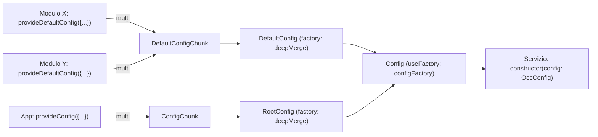
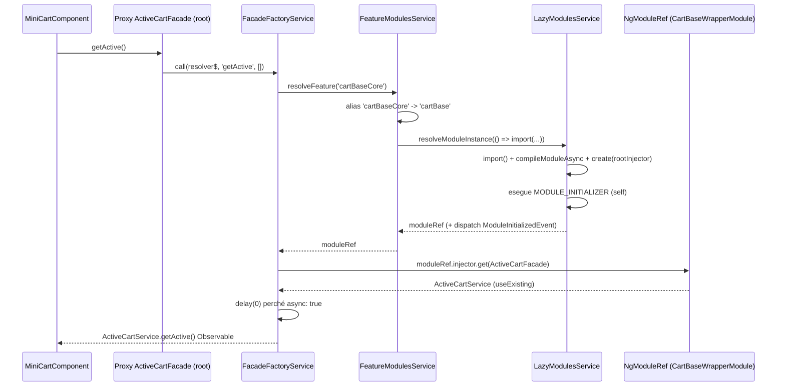
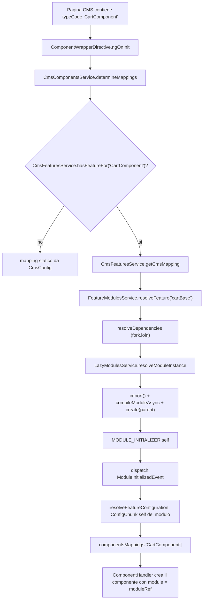
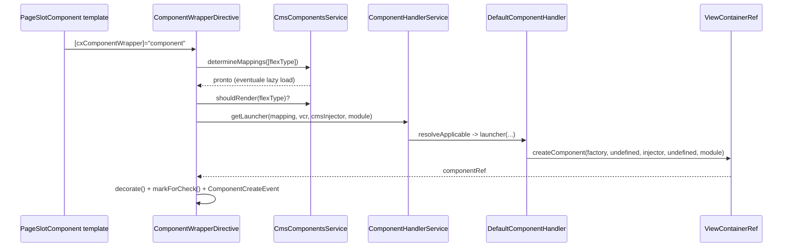
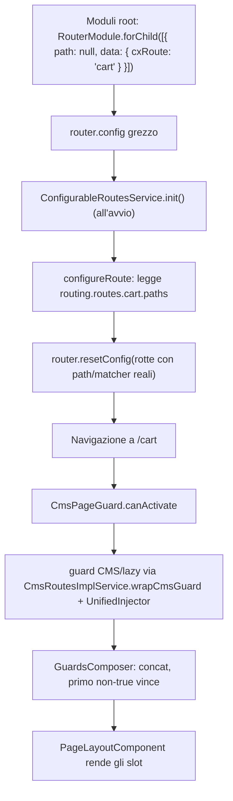
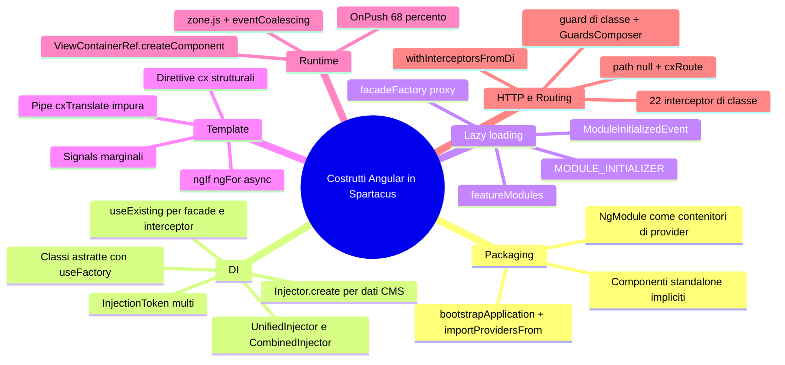

# 03 — Costrutti Angular usati da Spartacus (area B)

> Revisione analizzata: repository in `/home/user/spartacus`, versione `2611.0.0`, Angular `~21.2.23` (`package.json`), `zone.js ^0.16.0`.
> Tutti i path sono relativi alla radice del repository. I conteggi sono stati ottenuti con `grep` sui file `.ts`/`.html`
> escludendo i file `*.spec.ts` e la cartella `core-libs/schematics/` (che contiene codice di migrazione, non runtime).
> Dove un'affermazione non si può dimostrare leggendo il codice è marcata **NON VERIFICATO NEL CODICE**.

Questo capitolo è un **catalogo ragionato**: per ogni costrutto Angular trovi cos'è, perché Spartacus lo usa,
dove sta nel codice e un esempio minimo riscritto a mano (non copiato) che puoi incollare in un progetto
Angular 21 vuoto per capire il meccanismo.

## Indice

- [B0. Fotografia numerica](#b0-fotografia-numerica)
- [B1. NgModule vs standalone component](#b1-ngmodule-vs-standalone-component)
- [B2. Dependency Injection avanzata](#b2-dependency-injection-avanzata)
- [B3. Facade pattern con proxy lazy (`facadeFactory`)](#b3-facade-pattern-con-proxy-lazy-facadefactory)
- [B4. Lazy loading delle feature (`featureModules`)](#b4-lazy-loading-delle-feature-featuremodules)
- [B5. Direttive custom (strutturali e di attributo)](#b5-direttive-custom-strutturali-e-di-attributo)
- [B6. ViewContainerRef, creazione dinamica, change detection e zone](#b6-viewcontainerref-creazione-dinamica-change-detection-e-zone)
- [B7. Pipe custom](#b7-pipe-custom)
- [B8. Guard, resolver, routing con `cxRoute`](#b8-guard-resolver-routing-con-cxroute)
- [B9. Interceptor HTTP](#b9-interceptor-http)
- [B10. Signals, control flow (`@if`/`@for`/`@defer`)](#b10-signals-control-flow-ifordefer)
- [Riepilogo finale e assunzioni](#riepilogo-finale-e-assunzioni)

---

## B0. Fotografia numerica

Numeri misurati su `core-libs/`, `feature-libs/`, `integration-libs/`, `projects/storefrontapp/` (spec e schematics esclusi).

| Costrutto | Conteggio | Come è stato misurato |
|---|---|---|
| File con `@Component(` | 555 | `grep -rl "@Component("` |
| di cui con `ChangeDetectionStrategy.OnPush` | 380 (68%) | `grep -l ChangeDetectionStrategy.OnPush` |
| di cui senza proprietà `changeDetection` (quindi Default) | 172 | `grep -L changeDetection` |
| `standalone: false` | **0** | `grep "standalone: false"` |
| `standalone: true` esplicito | 14 (componenti + direttive) | `grep "standalone: true"` |
| Occorrenze di `@NgModule(` | ≈ 907 (117 storefront, 497 feature-libs, 172 integration-libs, 54 core, 67 app demo) | `grep -rn "@NgModule("` |
| `declarations: [...]` non vuoti | **0** (solo 7 `declarations: []` vuoti) | `grep "declarations:"` |
| File `@Directive(` | 35 storefront, 2 core, 11 feature-libs, 1 integration-libs | `grep -rl "@Directive("` |
| Pipe custom (`@Pipe(`) runtime | 13 (+3 mock di test) | vedi B7 |
| `new InjectionToken` | 220 | |
| `multi: true` | 198 | |
| `useFactory` / `useExisting` / `useClass` | 144 / 384 / 127 | |
| `providedIn: 'root'` | 804 | |
| `@Optional()` / `@Inject(` | 79 / 53 | |
| `@SkipSelf` / `@Self()` / `@Host()` | **0 / 0 / 0** | |
| chiamate `inject(` | 1503 | regex `[^a-zA-Z.]inject\(` |
| file DI con `inject()` / con constructor injection / con entrambi | 583 / 1037 / 274 (su 1742 classi decorate) | |
| `Injector.create(` | 5 | |
| `facadeFactory({` | 62 | |
| `implements HttpInterceptor` | 22 classi | vedi B9 |
| Guard (classi con metodo `canActivate(`) | 40 file | vedi B8 |
| Resolver (`Resolve`/`ResolveFn`) | **0** | |
| `signal(` / `computed(` / `effect(` / `toSignal(` | 11 / 13 / 3 / 6 | vedi B10 |
| `input()` / `output()` / `model()` signal-based | **0 / 0 / 0** | |
| `@Input(` / `@Output(` / `@ViewChild(` | 483 / 94 / 103 | |
| `*ngIf` / `*ngFor` nei template `.html` | 1617 / 282 | |
| `@if (` / `@for (` / `@switch (` / `@defer` / `@let` | **0 / 0 / 0 / 0 / 0** | |
| `\| async` nei template | 938 | |

**Lettura veloce:** Spartacus è una codebase *module-first* con componenti tecnicamente standalone,
DI molto spinta (token multi, factory, proxy lazy), change detection a zone con OnPush maggioritario,
template ancora con direttive strutturali classiche (`*ngIf`, `*ngFor`) e un uso di Signals appena iniziato
(concentrato in `feature-libs/subscription-billing`).

---

## B1. NgModule vs standalone component

### In una frase
In Spartacus **tutti i componenti sono standalone** (default di Angular ≥ 19, nessuno ha `standalone: false`),
ma vengono ancora **distribuiti e registrati tramite NgModule**, che li importano ed esportano e soprattutto
portano con sé i *provider* di configurazione (`provideDefaultConfig`).

### Il problema che risolve
Spartacus è una libreria consumata da migliaia di storefront. Due esigenze si scontrano:
1. Angular moderno spinge verso i componenti standalone (niente `declarations`, dipendenze esplicite con `imports`).
2. Spartacus deve restare retro-compatibile: le app clienti importano `BreadcrumbModule`, `CartBaseModule` ecc.
   e i moduli sono anche il **contenitore dei provider** (config CMS, effetti NgRx, interceptor) che la libreria registra.

La soluzione è ibrida: il componente è standalone (e quindi dichiara le sue dipendenze di template),
il modulo lo *importa* (non lo *dichiara*) e lo riesporta, mentre la mappatura CMS `cmsComponents` resta nel modulo.

### Come è implementato (con path)
- `core-libs/storefront/cms-components/navigation/breadcrumb/breadcrumb.component.ts` — classe `BreadcrumbComponent`:
  `@Component({ selector: 'cx-breadcrumb', changeDetection: OnPush, imports: [NgFor, RouterLink, AsyncPipe, TranslatePipe] })`.
  Nessun flag `standalone` → è standalone per default.
- `core-libs/storefront/cms-components/navigation/breadcrumb/breadcrumb.module.ts` — classe `BreadcrumbModule`:
  `imports: [..., BreadcrumbComponent]`, `exports: [BreadcrumbComponent]`, `providers: [provideDefaultConfig(<CmsConfig>{ cmsComponents: { BreadcrumbComponent: { component: BreadcrumbComponent } } })]`.
- 538 file componente su 555 hanno un array `imports:` a livello di `@Component` (misurato con `grep -l "^  imports:"`).
- `declarations:` non vuoto: **nessuno**. I 7 `declarations: []` vuoti (es. `feature-libs/storefinder/root/store-finder-root.module.ts`,
  `integration-libs/cdc/components/cdc-components.module.ts`) sono residui.
- `eslint.config.mjs` riga 78: `'@angular-eslint/prefer-standalone': 'error'` → la regola **impone** lo standalone.
- 14 file hanno `standalone: true` esplicito (ridondante in Angular 21), es.
  `core-libs/storefront/shared/components/read-more/read-more.component.ts`,
  `core-libs/storefront/layout/a11y/truncation-tooltip/truncation-tooltip.directive.ts`,
  `feature-libs/subscription-billing/components/actions-modal/subscription-actions-modal.component.ts`.
- Bootstrap dell'app demo: `projects/storefrontapp/src/main.ts` usa `bootstrapApplication(AppComponent, appConfig)` (API standalone),
  e `projects/storefrontapp/src/app/app.config.ts` fa `importProvidersFrom(AppModule)` → il mondo NgModule viene "incapsulato" dentro l'API standalone.
- Esiste uno schematic di modernizzazione: `core-libs/schematics/src/modernize-app-to-standalone-bootstrap-application/` (rimuove `declarations: [AppComponent]` e crea `app.config.ts`).

### Stato reale della migrazione

| Area | File `@Component` | `standalone: false` | `standalone: true` esplicito | `@NgModule` |
|---|---|---|---|---|
| `core-libs/storefront` | 99 | 0 | 6 | 117 |
| `feature-libs` | 381 | 0 | 4 | 497 |
| `integration-libs` | 73 | 0 | 4 | 172 |
| `core-libs/core` | 0 | 0 | 0 | 54 |
| `projects/storefrontapp` | 4 | 0 | 0 | 67 |

Conclusione: migrazione **completata a livello di componenti/direttive/pipe** (tutti standalone),
**non iniziata a livello di packaging**: le API pubbliche restano gli NgModule, e i provider di libreria
non sono ancora esposti come funzioni `provideXxx()` stile `provideRouter()` (a parte gli helper di config, vedi B2).

### Flusso passo-passo
1. `main.ts` → `bootstrapApplication(AppComponent, appConfig)`.
2. `appConfig.providers` contiene `importProvidersFrom(AppModule)`.
3. `AppModule` (`projects/storefrontapp/src/app/app.module.ts`) importa `SpartacusModule` → `BaseStorefrontModule` + `SpartacusFeaturesModule`.
4. `SpartacusFeaturesModule` importa `BreadcrumbModule`.
5. `BreadcrumbModule` registra `provideDefaultConfig({ cmsComponents: { BreadcrumbComponent: ... } })`.
6. Quando il CMS restituisce uno slot con `typeCode: 'BreadcrumbComponent'`, il `ComponentWrapperDirective` (vedi B5)
   crea dinamicamente la classe `BreadcrumbComponent`: essendo standalone, porta con sé tutto ciò che serve al suo template.

### Codice minimo riscritto a mano
```ts
// hello.component.ts — standalone implicito (Angular >= 19)
import { AsyncPipe, NgIf } from '@angular/common';
import { ChangeDetectionStrategy, Component, inject } from '@angular/core';
import { of } from 'rxjs';

@Component({
  selector: 'my-hello',
  template: `<p *ngIf="name$ | async as n">Ciao {{ n }}</p>`,
  changeDetection: ChangeDetectionStrategy.OnPush,
  imports: [NgIf, AsyncPipe], // dipendenze di template esplicite
})
export class HelloComponent {
  name$ = of('Spartacus');
}

// hello.module.ts — il modulo NON dichiara, IMPORTA ed ESPORTA, e porta i provider
import { NgModule } from '@angular/core';
import { MY_CMS_MAPPING } from './tokens';

@NgModule({
  imports: [HelloComponent],
  exports: [HelloComponent],
  providers: [
    { provide: MY_CMS_MAPPING, multi: true, useValue: { HelloCmsComponent: HelloComponent } },
  ],
})
export class HelloModule {}
```

### Errori comuni
- Mettere un componente standalone in `declarations` di un NgModule: Angular dà errore di compilazione. In Spartacus va in `imports`.
- Dimenticare di aggiungere una pipe (es. `TranslatePipe`) negli `imports` del componente: il template non compila
  (`No pipe found with name 'cxTranslate'`). Importare `I18nModule` nel *modulo* non basta più per i componenti standalone.
- Pensare che "standalone" significhi "senza moduli": in Spartacus il modulo serve ancora per i provider (config CMS, NgRx, interceptor).
- Aggiungere `standalone: false` a un nuovo componente: viola `@angular-eslint/prefer-standalone`.

### Domande di autoverifica
1. Perché `BreadcrumbModule` elenca `BreadcrumbComponent` sia in `imports` che in `exports`?
2. Quale regola ESLint impedisce di scrivere componenti non standalone e in quale file è configurata?
3. In che punto dell'app demo il mondo NgModule viene agganciato al bootstrap standalone?
4. Perché la mappatura `cmsComponents` non può stare dentro il `@Component`?

---

## B2. Dependency Injection avanzata

### In una frase
Spartacus usa la DI di Angular come **sistema di plugin**: token multi-provider per raccogliere contributi da molti moduli,
classi astratte come token sostituibili, factory per calcolare valori a runtime e injector creati a mano per
passare dati ai componenti CMS.

### Il problema che risolve
Una libreria estendibile deve permettere al cliente di:
- **aggiungere** comportamenti senza toccare il codice (es. un nuovo handler di errore HTTP) → `multi: true`;
- **sostituire** un servizio con il proprio (es. `ActiveCartService` custom) → token astratto + `useExisting`/`useClass`;
- **configurare** tutto con oggetti parziali che vengono fusi (deep merge) → token + `useFactory`;
- **ricevere dati** quando un componente è creato dinamicamente da JSON CMS → `Injector.create`.

### Come è implementato (con path)

#### 1. `InjectionToken` (220 occorrenze)
- `core-libs/core/src/config/config-tokens.ts`:
  - `ConfigChunk = new InjectionToken<Config[]>('ConfigurationChunk')` e `DefaultConfigChunk` → token **multi** senza factory.
  - `DefaultConfig = new InjectionToken('DefaultConfiguration', { providedIn: 'root', factory: defaultConfigFactory })` e
    `RootConfig` → token **tree-shakable con factory** (16 token nel repo hanno `factory:`).
- `core-libs/core/src/lazy-loading/tokens.ts`: `MODULE_INITIALIZER: InjectionToken<(() => any)[]>`.
- `core-libs/storefront/cms-structure/outlet/outlet.providers.ts`: `PROVIDE_OUTLET_OPTIONS` usato da `provideOutlet()`.

#### 2. `multi: true` (198 occorrenze)
- `core-libs/core/src/config/config-providers.ts`: `provideConfig`, `provideDefaultConfig`, `provideConfigFactory`,
  `provideDefaultConfigFactory` restituiscono tutti `{ provide: ConfigChunk | DefaultConfigChunk, ..., multi: true }`.
  Ogni modulo contribuisce un "pezzo" di configurazione; `rootConfigFactory()` li fonde con `deepMerge`.
- `core-libs/storefront/cms-structure/page/component/page-component.module.ts`: `ComponentHandler` multi con
  `useExisting: DefaultComponentHandler` e `useExisting: LazyComponentHandler`.
- `HTTP_INTERCEPTORS` (vedi B9), `HttpErrorHandler` (es. `core-libs/core/src/global-message/http-interceptors/index.ts`),
  `APP_INITIALIZER`, `MODULE_INITIALIZER`.

#### 3. `useFactory` (144) e `@Injectable({ useFactory })`
- `core-libs/core/src/config/config-tokens.ts` — classe astratta `Config` decorata con
  `@Injectable({ providedIn: 'root', useFactory: configFactory })`: iniettare `Config` produce `deepMerge({}, inject(DefaultConfig), inject(RootConfig))`.
- `feature-libs/cart/base/root/facade/active-cart.facade.ts` — `ActiveCartFacade` con
  `@Injectable({ providedIn: 'root', useFactory: () => facadeFactory({...}) })` (vedi B3).
- `core-libs/core/src/lazy-loading/lazy-loading.module.ts` — `APP_INITIALIZER` con `useFactory: moduleInitializersFactory`
  e `deps: [LazyModulesService, [new Optional(), MODULE_INITIALIZER]]` (sintassi a array per le dipendenze opzionali).

#### 4. `useExisting` (384) — alias
- `feature-libs/cart/base/core/facade/facade-providers.ts` — `{ provide: ActiveCartFacade, useExisting: ActiveCartService }`:
  la stessa istanza è raggiungibile sia dal token astratto che dalla classe concreta. È il pattern più usato del repo.

#### 5. `providedIn: 'root'` (804)
Quasi tutti i servizi, i guard (es. `AuthGuard` in `core-libs/core/src/auth/user-auth/guards/auth.guard.ts`),
gli handler (`DefaultComponentHandler`) e gli interceptor (vedi B9) sono `providedIn: 'root'`. Gli interceptor sono
poi *agganciati* a `HTTP_INTERCEPTORS` con `useExisting`, così l'istanza è unica e tree-shakable.
`providedIn: 'any'`: 0 occorrenze.

#### 6. `@Optional()` (79) e `@Inject()` (53)
- `core-libs/storefront/cms-structure/page/component/services/component-handler.service.ts` — `ComponentHandlerService`:
  `constructor(@Optional() @Inject(ComponentHandler) protected handlers: ComponentHandler[])` → riceve l'array multi.
- `core-libs/storefront/shared/components/assistive-technology-message/assistive-technology-message.directive.ts` —
  `@Optional() protected templateRef: TemplateRef<HTMLElement>`: la direttiva funziona sia come strutturale (`*cxAtMessage`) sia come attributo.
- `@Inject(PLATFORM_ID)` / `@Inject(DOCUMENT)` in `core-libs/storefront/cms-structure/page/slot/page-slot.service.ts` (`PageSlotService`).

#### 7. `@SkipSelf`, `@Self`, `@Host`
**Zero occorrenze** nel codice runtime. Il concetto di "self" è però usato *programmaticamente* tramite
`injector.get(token, notFound, { self: true })` in:
- `core-libs/core/src/lazy-loading/unified-injector.ts` (`UnifiedInjector.get`),
- `core-libs/core/src/util/combined-injector.ts` (`CombinedInjector.get`),
- `core-libs/core/src/lazy-loading/lazy-modules.service.ts` (`runModuleInitializersForModule` legge `MODULE_INITIALIZER` con `{ self: true }`),
- `core-libs/storefront/cms-structure/services/cms-features.service.ts` (`resolveFeatureConfiguration` legge `ConfigChunk` con `{ self: true }`).

#### 8. Injector manuali
- `Injector.create(...)` in 5 punti: `CmsInjectorService.getInjector` (`core-libs/storefront/cms-structure/page/component/services/cms-injector.service.ts`),
  `OutletDirective.getComponentInjector` (`core-libs/storefront/cms-structure/outlet/outlet.directive.ts`),
  `InlineRootRenderStrategy` (`core-libs/storefront/layout/launch-dialog/services/inline-root-render.strategy.ts`),
  `MessageRenderService` (`feature-libs/organization/administration/components/shared/message/services/message-render.service.ts`),
  `ConfiguratorAttributeCompositionDirective` (`feature-libs/product-configurator/rulebased/components/attribute/composition/configurator-attribute-composition.directive.ts`).
- Classi che **implementano** `Injector`: `CombinedInjector` (`core-libs/core/src/util/combined-injector.ts`).
- Servizio che **aggrega** injector: `UnifiedInjector` (vedi B4).
- `runInInjectionContext`: 0 usi reali (solo citato in un commento in `core-libs/core/src/routing/location-initialized-multi/location-initialized-multi.ts`).
- `createEnvironmentInjector`: 0.

#### 9. `inject()` vs constructor injection
| Area | Classi decorate | con `inject()` | con parametri nel `constructor` |
|---|---|---|---|
| `core-libs/core` | 252 | 89 | 179 |
| `core-libs/storefront` | 248 | 58 | 157 |
| `feature-libs` | 965 | 281 | 619 |
| `integration-libs` | 270 | 153 | 82 |
| **Totale** (incl. app) | 1742 | 583 | 1037 (274 usano entrambi) |

La regola `'@angular-eslint/prefer-inject': 'off'` in `eslint.config.mjs` (riga 79) conferma che la migrazione non è forzata.
Pattern tipico misto: il costruttore resta (API pubblica, estesa dai clienti), le **nuove** dipendenze vengono aggiunte come campo
`protected x = inject(X)` per non rompere le sottoclassi. Esempio: `TranslatePipe` (`core-libs/core/src/i18n/translate.pipe.ts`)
ha `protected logger = inject(LoggerService)` più `constructor(protected service: TranslationService, protected cd: ChangeDetectorRef)`.
Opzionali: `inject(X, { optional: true })` 22 volte (es. `core-libs/storefront/shared/components/ng-select-a11y/ng-select-a11y.directive.ts`).
Curiosità: `core-libs/storefront/layout/main/storefront.component.ts` scrive `@Optional() protected document = inject(DOCUMENT, {...})`:
il decoratore `@Optional()` su un campo non ha effetto, conta solo l'opzione di `inject()`.
Pulizia: `DestroyRef` 54 occorrenze, `takeUntilDestroyed` 48.

### Flusso passo-passo (risoluzione di `Config`)

1. Ogni modulo registra un pezzo di config nel token multi.
2. Alla prima richiesta di `Config`, Angular esegue `configFactory()` (dentro un injection context, quindi `inject()` è lecito).
3. `inject(DefaultConfig)` esegue `defaultConfigFactory()` → `deepMerge` di tutti i `DefaultConfigChunk`.
4. `inject(RootConfig)` fa lo stesso con i `ConfigChunk` (quelli del cliente vincono perché fusi dopo).
5. Tipi come `OccConfig` sono classi astratte che puntano allo stesso oggetto `Config`: in `core-libs/core/src/occ/config/occ-config.ts` la classe `OccConfig` è decorata con `@Injectable({ providedIn: 'root', useExisting: Config })`. Quindi `inject(OccConfig) === inject(Config)`.

### Codice minimo riscritto a mano
```ts
import { Injectable, InjectionToken, Injector, inject, Provider } from '@angular/core';

// 1) token multi per contributi di configurazione
export const CONFIG_CHUNK = new InjectionToken<object[]>('CONFIG_CHUNK');
export function provideMyConfig(cfg: object): Provider {
  return { provide: CONFIG_CHUNK, useValue: cfg, multi: true };
}

// 2) classe astratta come token, risolta da una factory
@Injectable({
  providedIn: 'root',
  useFactory: () =>
    Object.assign({}, ...(inject(CONFIG_CHUNK, { optional: true }) ?? [])),
})
export abstract class MyConfig {
  [key: string]: any;
}

// 3) facade astratta + implementazione con alias useExisting
export abstract class GreetingFacade {
  abstract greet(name: string): string;
}
@Injectable({ providedIn: 'root' })
export class GreetingService implements GreetingFacade {
  private cfg = inject(MyConfig);
  greet(name: string) {
    return `${this.cfg['prefix'] ?? 'Ciao'} ${name}`;
  }
}
export const greetingProviders: Provider[] = [
  { provide: GreetingFacade, useExisting: GreetingService },
];

// 4) injector manuale per passare dati a un componente dinamico
export abstract class ComponentData {
  abstract uid: string;
}
export function createDataInjector(parent: Injector, uid: string): Injector {
  return Injector.create({
    providers: [{ provide: ComponentData, useValue: { uid } }],
    parent,
  });
}
```

### Errori comuni
- Fornire un token multi **senza** `multi: true` in un punto e **con** in un altro: Angular lancia
  "Mixing multi and non multi provider is not possible". `UnifiedInjector.getMulti` ha un controllo analogo
  (`Multi-providers mixed with single providers`).
- Usare `useClass` invece di `useExisting` per alias facade→servizio: si ottengono **due istanze** diverse (stato duplicato).
- Chiamare `inject()` fuori da un injection context (es. dentro un `subscribe`): errore NG0203. Nelle factory di provider è lecito.
- Aspettarsi che `@Optional()` su un campo inizializzato con `inject()` renda opzionale la dipendenza: serve `{ optional: true }`.
- Aggiungere un nuovo parametro nel `constructor` di una classe pubblica: rompe i clienti che la estendono → Spartacus usa `inject()` per le aggiunte.

### Domande di autoverifica
1. Qual è la differenza tra `ConfigChunk` e `DefaultConfigChunk` e chi vince nel merge?
2. Perché `ActiveCartFacade` è fornita con `useExisting` e non con `useClass` nel modulo core del carrello?
3. Quante volte compare `@SkipSelf` e con quale meccanismo alternativo Spartacus legge solo i provider "self"?
4. In quali cinque punti Spartacus crea un `Injector` a mano e perché?
5. Perché la regola `prefer-inject` è disattivata?

---

## B3. Facade pattern con proxy lazy (`facadeFactory`)

### In una frase
Una *facade* in Spartacus è una **classe astratta** disponibile subito nel root injector; finché la feature non è caricata,
l'istanza iniettata è un **proxy** generato da `facadeFactory` che, alla prima chiamata, scarica il chunk lazy e inoltra
la chiamata al servizio reale.

### Il problema che risolve
Il mini-cart nell'header ha bisogno di `ActiveCartFacade.getActive()` su ogni pagina, ma il codice del carrello
(NgRx store, effetti, connettori OCC) è pesante. Se lo si importasse eager, il bundle iniziale crescerebbe.
Con la facade proxy:
- i componenti dipendono solo dalla classe astratta (in `@spartacus/cart/base/root`, pacchetto leggero);
- l'implementazione (in `@spartacus/cart/base/core`) viene scaricata **solo quando qualcuno chiama un metodo o si iscrive a una proprietà**.

### Come è implementato (con path)
- `core-libs/core/src/lazy-loading/facade-factory/facade-factory.ts` — funzione `facadeFactory<T>(descriptor)`:
  `return inject(FacadeFactoryService).create(descriptor);`.
- `core-libs/core/src/lazy-loading/facade-factory/facade-descriptor.ts` — interfaccia `FacadeDescriptor<T>`:
  `facade` (classe astratta), `feature` (nome feature), `methods?`, `properties?`, `async?`.
  I tipi `MethodKeys`, `PropertyKeys`, `StrictlyAllowedFacade` vietano a compile-time metodi che non restituiscono `Observable` o `void`.
- `core-libs/core/src/lazy-loading/facade-factory/facade-factory.service.ts` — classe `FacadeFactoryService`:
  - `getResolver(feature, facadeClass, async)`: se `featureModules.isConfigured(feature)` è falso restituisce `throwError`;
    altrimenti `featureModules.resolveFeature(feature)` → `moduleRef.injector` → `injector.get(facadeClass)`; con `async` aggiunge `delay(0)`; poi `shareReplay()`.
  - `call(resolver$, method, args)`: crea un `connectable(..., { connector: () => new ReplaySubject() })` e lo **connette subito**
    (quindi il metodo viene eseguito anche se nessuno si iscrive: importante per i comandi `void` come `addEntry`);
    se il risultato è un Observable lo inoltra, altrimenti `EMPTY`.
  - `get(resolver$, property)`: `resolver$.pipe(switchMap(service => service[property]))` (lazy: carica solo alla subscribe).
  - `create(...)`: `const result = new (class extends (facade as any) {})();` poi assegna i metodi/proprietà proxy e marca
    `result['proxyFacadeInstance'] = true` (leggibile con `isProxyFacadeInstance`).
- Esempio reale: `feature-libs/cart/base/root/facade/active-cart.facade.ts` — `ActiveCartFacade` con
  `@Injectable({ providedIn: 'root', useFactory: () => facadeFactory({ facade: ActiveCartFacade, feature: CART_BASE_CORE_FEATURE, methods: [...22 metodi], async: true }) })`.
- Nome feature: `feature-libs/cart/base/root/feature-name.ts` — `CART_BASE_CORE_FEATURE = 'cartBaseCore'`, `CART_BASE_FEATURE = 'cartBase'`.
- Alias di feature: `feature-libs/cart/base/root/cart-base-root.module.ts` — `defaultCartComponentsConfig()` contiene
  `[CART_BASE_CORE_FEATURE]: CART_BASE_FEATURE` (stringa → alias risolto da `FeatureModulesService.resolveFeatureAlias`).
- Implementazione reale nel chunk lazy: `feature-libs/cart/base/core/facade/facade-providers.ts` —
  `{ provide: ActiveCartFacade, useExisting: ActiveCartService }`, incluso in `CartBaseCoreModule`
  (`feature-libs/cart/base/core/cart-base-core.module.ts`, `providers: [...facadeProviders]`).
- Collegamento del chunk: `projects/storefrontapp/src/app/spartacus/features/cart/cart-base-feature.module.ts` —
  `provideConfig({ featureModules: { [CART_BASE_FEATURE]: { module: () => import('./cart-base-wrapper.module').then(m => m.CartBaseWrapperModule) } } })`;
  `CartBaseWrapperModule` importa `CartBaseModule` = `CartBaseCoreModule + CartBaseOccModule + CartBaseComponentsModule`.
- Diffusione: 62 `facadeFactory({` (10 file in `feature-libs/cart`, 8 `order`, 8 `integration-libs/opf`, 7 `checkout`, 6 `user`, …).
  In `core-libs/core` nessuna: le facade core (es. `AuthService`) sono servizi eager normali.

### Flusso passo-passo

1. Il componente inietta `ActiveCartFacade`; il root injector esegue la `useFactory` → proxy.
2. La prima chiamata `getActive()` passa per `FacadeFactoryService.call`.
3. `resolveFeature('cartBaseCore')` segue l'alias fino a `'cartBase'` e scarica il modulo configurato.
4. Il modulo è istanziato con parent = root injector; nel suo injector `ActiveCartFacade` è **ridefinito** con `useExisting: ActiveCartService`.
5. `moduleRef.injector.get(ActiveCartFacade)` trova il provider del modulo lazy (più vicino) → servizio reale, non il proxy.
6. `delay(0)` (`async: true`) lascia il tempo allo store NgRx lazy di registrare reducer ed effetti.
7. Le chiamate successive riusano `resolver$` grazie a `shareReplay()`; `FeatureModulesService` memorizza la feature in una `Map`.

### Codice minimo riscritto a mano
```ts
import { Injectable, Injector, inject, createNgModule, Type } from '@angular/core';
import { defer, from, Observable, EMPTY, isObservable } from 'rxjs';
import { map, shareReplay, switchMap } from 'rxjs/operators';

// registro minimo: nome feature -> import dinamico
export const FEATURES: Record<string, () => Promise<Type<unknown>>> = {
  cart: () => import('./cart-impl.module').then((m) => m.CartImplModule),
};

@Injectable({ providedIn: 'root' })
export class MiniFacadeFactory {
  private root = inject(Injector);
  private cache = new Map<string, Observable<Injector>>();

  private load(feature: string): Observable<Injector> {
    if (!this.cache.has(feature)) {
      this.cache.set(
        feature,
        defer(() => from(FEATURES[feature]())).pipe(
          map((mod) => createNgModule(mod, this.root).injector),
          shareReplay(1)
        )
      );
    }
    return this.cache.get(feature)!;
  }

  create<T extends object>(facade: abstract new () => T, feature: string, methods: (keyof T)[]): T {
    const impl$ = this.load(feature).pipe(map((inj) => inj.get(facade as any) as T), shareReplay(1));
    const proxy: any = new (class extends (facade as any) {})();
    for (const m of methods) {
      proxy[m] = (...args: unknown[]) =>
        impl$.pipe(switchMap((impl: any) => {
          const r = impl[m](...args);
          return isObservable(r) ? r : EMPTY;
        }));
    }
    return proxy;
  }
}

// facade astratta nel pacchetto "root" (leggero)
@Injectable({
  providedIn: 'root',
  useFactory: () => inject(MiniFacadeFactory).create(CartFacade, 'cart', ['getCount']),
})
export abstract class CartFacade {
  abstract getCount(): Observable<number>;
}

// cart-impl.module.ts (chunk lazy)
// @NgModule({ providers: [CartService, { provide: CartFacade, useExisting: CartService }] })
// export class CartImplModule {}
```

### Errori comuni
- **Dimenticare** `{ provide: XFacade, useExisting: XService }` nel modulo lazy: `moduleRef.injector.get(XFacade)` risale al root
  e restituisce il proxy stesso → ricorsione infinita o chiamate che non arrivano mai.
- Aggiungere alla facade un metodo che restituisce un valore sincrono (es. `string`): il tipo `StrictlyAllowedFacade` lo impedisce;
  se si forza con `any`, il proxy restituisce `EMPTY`.
- Non configurare `featureModules[feature].module` nell'app: `getResolver` lancia `Feature X is not configured properly`.
- Aspettarsi che una *proprietà* Observable del proxy carichi la feature senza subscribe: `get()` è lazy, `call()` invece è eager.
- Omettere `async: true` per facade basate su store NgRx lazy: la prima emissione può arrivare prima che lo store feature sia registrato.

### Domande di autoverifica
1. Perché `call()` usa `connectable(...).connect()` e `get()` no?
2. Come fa `FacadeFactoryService` a creare un'istanza di una classe **astratta**?
3. Cosa succede se `CART_BASE_CORE_FEATURE` non avesse l'alias verso `CART_BASE_FEATURE`?
4. Dove si trova la riga che fa sì che `moduleRef.injector.get(ActiveCartFacade)` restituisca `ActiveCartService`?

---

## B4. Lazy loading delle feature (`featureModules`)

### In una frase
Spartacus non usa (solo) il lazy loading del Router: ha un **proprio sistema di lazy loading guidato dalla configurazione**
(`featureModules`) che carica NgModule on-demand quando serve un componente CMS o una facade, con dipendenze tra feature,
inizializzatori per modulo ed eventi.

### Il problema che risolve
In uno storefront CMS-driven le "rotte" non dicono quali componenti serviranno: lo decide il JSON della pagina.
Il componente `CartComponent` può comparire in qualunque pagina. Serve quindi un lazy loading **per tipo di componente CMS**
e **per facade**, non per URL. Inoltre alcune feature dipendono da altre (checkout richiede il carrello) e devono
condividere le istanze dei servizi.

### Come è implementato (con path)
| Pezzo | File | Ruolo |
|---|---|---|
| `FeatureModuleConfig`, `CmsConfig.featureModules` | `core-libs/core/src/cms/config/cms-config.ts` | `module?: () => Promise<any>`, `dependencies?: ((() => Promise<any>) \| string)[]`, `cmsComponents?: string[]`; valore `string` = alias |
| `FeatureModulesService` | `core-libs/core/src/lazy-loading/feature-modules.service.ts` | `isConfigured`, `resolveFeature` (cache in `Map`), `resolveFeatureAlias`, `resolveDependencies` (`forkJoin`) |
| `LazyModulesService` | `core-libs/core/src/lazy-loading/lazy-modules.service.ts` | `resolveModuleInstance` (nuova istanza), `resolveDependencyModuleInstance` (singleton per classe modulo), `runModuleInitializersForModule`, `modules$` |
| `MODULE_INITIALIZER` | `core-libs/core/src/lazy-loading/tokens.ts` | equivalente di `APP_INITIALIZER` per moduli lazy |
| `LazyLoadingModule.forRoot()` | `core-libs/core/src/lazy-loading/lazy-loading.module.ts` | esegue i `MODULE_INITIALIZER` eager come `APP_INITIALIZER` (`moduleInitializersFactory`) |
| `ModuleInitializedEvent` | `core-libs/core/src/lazy-loading/events/module-initialized-event.ts` | `CxEvent` con `feature?` e `moduleRef` |
| `CombinedInjector` | `core-libs/core/src/util/combined-injector.ts` | parent injector quando una feature ha ≥ 2 dipendenze |
| `UnifiedInjector` | `core-libs/core/src/lazy-loading/unified-injector.ts` | `injectors$` (root + ogni modulo lazy), `get`, `getMulti` |
| `CmsFeaturesService` | `core-libs/storefront/cms-structure/services/cms-features.service.ts` | mappa `componentType → feature`, `getCmsMapping`, `getModule`, legge `ConfigChunk`/`DefaultConfigChunk` *self* del modulo lazy |

Dettagli chiave letti nel codice:
- `LazyModulesService.resolveModuleInstance` sceglie il parent injector: nessuna dipendenza → `this.injector` (root);
  una → `dependencyModuleRefs[0].injector`; più di una → `new CombinedInjector(this.injector, deps.map(d => d.injector))`.
- `resolveModuleFactory` usa `this.compiler.compileModuleAsync(module)` (commento nel codice: in AOT non ha overhead) e `observeOn(queueScheduler)`.
- Dopo la creazione: `runModuleInitializersForModule` legge `MODULE_INITIALIZER` con `{ self: true }` (solo quelli del modulo appena creato),
  attende le Promise, poi `events.dispatch(createFrom(ModuleInitializedEvent, { feature, moduleRef }))`.
- `modules$` è un `connectable` su `ReplaySubject` connesso nel costruttore: chi si iscrive tardi riceve **tutti** i moduli già caricati.
- `CombinedInjector.get`: prima cerca *self* in tutti gli injector complementari, poi a tutti i livelli, infine nel `mainInjector`;
  se chiamato con `{ self: true }` lancia errore (può essere solo parent).
- `UnifiedInjector.get(token)`: per l'indice 0 (root) cerca normalmente, per gli altri solo `{ self: true }` e filtra i "not found".
  `getMulti` accumula con `scan` gli array multi-provider di tutti gli injector.
- Utilizzatori reali di `UnifiedInjector`: `HttpErrorInterceptor` (`getMulti(HttpErrorHandler)`), `ConverterService`
  (`core-libs/core/src/util/converter.service.ts`, `getMulti(injectionToken)` per i converter), `CmsRoutesImplService`
  (guard lazy), `PageLayoutService`, `CmsGuardsService`, `RoutingContextService`, `ConfigurationService`, `DynamicAttributeService`, `PageMetaService`.
- Dipendenze reali: `feature-libs/checkout/base/root/checkout-root.module.ts` e `feature-libs/order/root/order-root.module.ts`
  → `dependencies: [CART_BASE_FEATURE]`; `feature-libs/organization/order-approval/root/order-approval-root.module.ts` → `[ORDER_FEATURE]`.
- `MODULE_INITIALIZER` reali: `feature-libs/cart/base/core/cart-persistence.module.ts`, `feature-libs/asm/core/asm-core.module.ts`,
  `feature-libs/order/components/order-details/order-details.module.ts`, `core-libs/storefront/cms-structure/outlet/outlet.module.ts` (`OutletModule.forChild()`).

### Flusso passo-passo (caricamento per componente CMS)

1. All'avvio `CmsFeaturesService.initFeatureMap()` attende `configInitializer.getStable('featureModules')` e costruisce `componentFeatureMap`.
2. Il wrapper chiede la mappatura; se il tipo appartiene a una feature, parte `resolveFeature`.
3. Le dipendenze (stringhe = altre feature, funzioni = moduli "dependency" singleton) sono risolte prima.
4. Il modulo è creato con il parent giusto (root, dipendenza, o `CombinedInjector`).
5. Si eseguono i suoi `MODULE_INITIALIZER`, si emette `ModuleInitializedEvent`; `UnifiedInjector.injectors$` riceve il nuovo injector.
6. La config CMS del componente è letta **dal modulo lazy** (self) e fusa con `deepMerge`.
7. Il componente è creato passando `module` a `ViewContainerRef.createComponent` (vedi B6), così i suoi servizi vengono dall'injector del modulo lazy.

### Codice minimo riscritto a mano
```ts
import { Injectable, Injector, NgModuleRef, createNgModule, inject, InjectionToken } from '@angular/core';
import { defer, forkJoin, from, Observable, of, Subject } from 'rxjs';
import { map, shareReplay, switchMap, tap } from 'rxjs/operators';

export const MODULE_INIT = new InjectionToken<(() => unknown)[]>('MODULE_INIT');

export interface FeatureCfg {
  module: () => Promise<any>;
  dependencies?: string[];
}
export const FEATURE_CFG = new InjectionToken<Record<string, FeatureCfg | string>>('FEATURE_CFG');

@Injectable({ providedIn: 'root' })
export class MiniFeatureLoader {
  private root = inject(Injector);
  private cfg = inject(FEATURE_CFG);
  private cache = new Map<string, Observable<NgModuleRef<unknown>>>();
  readonly loaded$ = new Subject<{ feature: string; ref: NgModuleRef<unknown> }>();

  private alias(name: string): string {
    while (typeof this.cfg[name] === 'string') name = this.cfg[name] as string;
    return name;
  }

  resolve(name: string): Observable<NgModuleRef<unknown>> {
    name = this.alias(name);
    return defer(() => {
      if (!this.cache.has(name)) {
        const c = this.cfg[name] as FeatureCfg;
        const deps$ = c.dependencies?.length
          ? forkJoin(c.dependencies.map((d) => this.resolve(d)))
          : of([] as NgModuleRef<unknown>[]);
        this.cache.set(
          name,
          deps$.pipe(
            switchMap((deps) =>
              from(c.module()).pipe(
                // semplificazione: con più dipendenze Spartacus usa CombinedInjector
                map((mod) => createNgModule(mod, deps[0]?.injector ?? this.root))
              )
            ),
            switchMap((ref) => {
              const inits = ref.injector.get(MODULE_INIT, [], { self: true });
              return from(Promise.all(inits.map((f) => f()))).pipe(map(() => ref));
            }),
            tap((ref) => this.loaded$.next({ feature: name, ref })),
            shareReplay(1)
          )
        );
      }
      return this.cache.get(name)!;
    });
  }
}
```

### Errori comuni
- Mettere la configurazione `cmsComponents` di una feature lazy **nel modulo eager**: il componente viene risolto staticamente
  e il chunk non viene mai usato (o viene incluso nel bundle principale).
- Dimenticare `cmsComponents: [...]` nella voce `featureModules` (lato root module): `CmsFeaturesService` non sa che quel tipo appartiene alla feature.
- Fornire un `HttpErrorHandler` o un converter in un modulo lazy e leggerlo con `inject()` dal root: non lo si trova; bisogna passare da `UnifiedInjector.getMulti`.
- Usare `CombinedInjector` come injector "self": lancia `CombinedInjector should be used as a parent injector`.
- Aspettarsi che due feature diverse che importano lo stesso modulo condividano lo stato: `resolveModuleInstance` crea **una nuova istanza per feature**;
  per condividere bisogna dichiarare la feature comune in `dependencies`.

### Domande di autoverifica
1. Che differenza c'è tra `resolveModuleInstance` e `resolveDependencyModuleInstance`?
2. Perché `UnifiedInjector.get` usa `{ self: true }` per tutti gli injector tranne il primo?
3. Chi ascolta `ModuleInitializedEvent` e come fa a ricevere anche i moduli caricati prima della sua sottoscrizione?
4. Quale parent injector riceve il modulo checkout, che ha `dependencies: [CART_BASE_FEATURE]`?
5. A cosa serve `MODULE_INITIALIZER` rispetto a `APP_INITIALIZER`?

---

## B5. Direttive custom (strutturali e di attributo)

### In una frase
Spartacus ha circa 45 direttive runtime con prefisso `cx` (imposto da `@angular-eslint/directive-selector` con `prefix: 'cx'`
in `eslint.config.mjs`): alcune **strutturali** (manipolano `TemplateRef`/`ViewContainerRef`, es. `*cxFeature`, `*cxOutlet`),
la maggior parte **di attributo** (accessibilità, focus, stili).

### Il problema che risolve
- **Feature toggle nel template** senza `*ngIf` + servizio in ogni componente → `*cxFeature`.
- **Punti di estensione** (outlet) dove il cliente inserisce o sostituisce pezzi di UI senza fare fork → `*cxOutlet`, `*cxOutletRef`.
- **Rendering di componenti decisi dal CMS** → `[cxComponentWrapper]`, `[cxInnerComponentsHost]`.
- **Accessibilità coerente** (focus trap, focus lock, annunci screen reader) → famiglia `cxFocus`, `cxAtMessage`.

### Come è implementato (con path)

| Direttiva (classe) | Selettore | Tipo | File | Scopo |
|---|---|---|---|---|
| `FeatureDirective` | `[cxFeature]` | strutturale | `core-libs/core/src/features-config/directives/feature.directive.ts` | crea/distrugge la vista se `FeatureConfigService.isEnabled(expr)`; supporta `'!flag'` (135 usi nei template) |
| `FeatureLevelDirective` | `[cxFeatureLevel]` | strutturale | `core-libs/core/src/features-config/directives/feature-level.directive.ts` | come sopra con `isLevel(level)`; 0 usi nei template |
| `OutletDirective` | `[cxOutlet]` | strutturale | `core-libs/storefront/cms-structure/outlet/outlet.directive.ts` | rende template/componenti registrati per un outlet in posizione BEFORE/REPLACE/AFTER; input `cxOutletContext`, `cxOutletDefer` |
| `OutletRefDirective` | `[cxOutletRef]` | strutturale | `core-libs/storefront/cms-structure/outlet/outlet-ref/outlet-ref.directive.ts` | registra un `TemplateRef` in un outlet |
| `ComponentWrapperDirective` | `[cxComponentWrapper]` | attributo con VCR | `core-libs/storefront/cms-structure/page/component/component-wrapper.directive.ts` | crea il componente mappato per `flexType` di un `ContentSlotComponentData` |
| `InnerComponentsHostDirective` | `[cxInnerComponentsHost]` | attributo con VCR | `core-libs/storefront/cms-structure/page/component/inner-components-host.directive.ts` | rende componenti CMS annidati |
| `PageTemplateDirective` | `[cxPageTemplateStyle]` | attributo (anche strutturale, `@Optional() TemplateRef`) | `core-libs/storefront/cms-structure/page/page-layout/page-template.directive.ts` | aggiunge la classe CSS del template di pagina; trasferisce lo stato SSR con `DirectiveStateTransferService` |
| `AtMessageDirective` | `[cxAtMessage]` | attributo o strutturale (`@Optional() TemplateRef`) | `core-libs/storefront/shared/components/assistive-technology-message/assistive-technology-message.directive.ts` | al click pubblica un messaggio `MSG_TYPE_ASSISTIVE` per screen reader |
| `FocusDirective` | `[cxFocus]` | attributo | `core-libs/storefront/layout/a11y/keyboard-focus/focus.directive.ts` | punto d'ingresso unico della gerarchia focus (111 usi) |
| `LockFocusDirective`, `TrapFocusDirective`, `TabFocusDirective`, `AutoFocusDirective`, `EscapeFocusDirective`, `PersistFocusDirective`, `BlockFocusDirective`, `VisibleFocusDirective`, `SkipFocusDirective` | `[cxLockFocus]`, `[cxTrapFocus]`, … | attributo | `core-libs/storefront/layout/a11y/keyboard-focus/**` | catena di ereditarietà: `FocusDirective extends LockFocusDirective`, `TrapFocusDirective extends TabFocusDirective extends AutoFocusDirective`, `VisibleFocusDirective extends BaseFocusDirective` |
| `PopoverDirective` | `[cxPopover]` | attributo | `core-libs/storefront/shared/components/popover/popover.directive.ts` | apre un popover creando dinamicamente il componente |
| `SkipLinkDirective` | `[cxSkipLink]` | attributo | `core-libs/storefront/layout/a11y/skip-link/directive/skip-link.directive.ts` | registra target per i link "salta al contenuto" |
| `NgSelectA11yDirective` | `[cxNgSelectA11y]` | attributo | `core-libs/storefront/shared/components/ng-select-a11y/ng-select-a11y.directive.ts` | patch a11y per `ng-select`; usa `effect()` |
| `FocusFirstInvalidFieldDirective`, `TruncationTooltipDirective`, `NativeSelectSpaceDirective`, `DomChangeDirective`, `BtnLikeLinkDirective` | `[cxFocusFirstInvalidField]`, `[cxTruncationTooltip]`, `select[cxNativeSelectSpace]`, `[cxDomChange]`, `a[cxBtnLikeLink].btn` | attributo | `core-libs/storefront/layout/a11y/**` | utilità di accessibilità |
| `JsonLdDirective` | `[cxJsonLd]` | attributo | `core-libs/storefront/cms-structure/seo/structured-data/json-ld.directive.ts` | scrive dati strutturati SEO |
| `LcpContextDirective`, `ProvideLcpPresenceDirective` | `[cxLcpContext]`, `[cxProvideLcpPresence]` | strutturale / attributo | `core-libs/storefront/shared/lcp-context/` | contesto "Largest Contentful Paint" per ottimizzare immagini |
| `HorizontalScrollingPositionDirective`, `FocusableCarouselItemDirective`, `PasswordVisibilityToggleDirective` | … | attributo | `core-libs/storefront/shared/**` | UI |
| `AbstractOrderContextDirective` | `[cxAbstractOrderContext]` | attributo | `feature-libs/cart/base/components/abstract-order-context/abstract-order-context.directive.ts` | fornisce contesto ordine/carrello ai figli |
| `ItemExistsDirective`, `ItemActiveDirective` | `[cxOrgItemExists]`, `[cxOrgItemActive]` | attributo | `feature-libs/organization/administration/components/shared/` | messaggi se l'elemento B2B non esiste / non è attivo |
| `ConfiguratorAttributeCompositionDirective` | `[cxConfiguratorAttributeComponent]` | attributo con VCR | `feature-libs/product-configurator/rulebased/components/attribute/composition/configurator-attribute-composition.directive.ts` | crea dinamicamente il componente per tipo di attributo (con `Injector.create`) |
| `ConfiguratorMainAriaLabelledByDirective` | `[cxConfiguratorMainAriaLabelledBy]` | attributo | `feature-libs/product-configurator/rulebased/components/product-title/configurator-product-title.directive.ts` | a11y |
| `AttributesDirective` | `[cxAttributes]` | attributo | `integration-libs/cds/src/merchandising/cms-components/directives/attributes/attributes.directive.ts` | attributi dinamici CDS |

Mock di test (non runtime): `MockFeatureDirective`, `MockFeatureLevelDirective` in `core-libs/storefront/shared/test/`,
`MockKeyboardFocusDirective` in `core-libs/storefront/layout/a11y/keyboard-focus/focus-testing.module.ts`.

### Flusso passo-passo (`*cxFeature`)
1. Il template scrive `<span *cxFeature="'a11yItemCounterValueText'">…</span>`.
2. Il compilatore trasforma `*` in `<ng-template [cxFeature]="'a11y…'"><span>…</span></ng-template>`.
3. `FeatureDirective` riceve nel costruttore `TemplateRef`, `ViewContainerRef`, `FeatureConfigService`.
4. Il setter `@Input() set cxFeature(feature)` valuta `featureConfig.isEnabled(feature)`.
5. Se vero e la vista non esiste → `viewContainer.createEmbeddedView(templateRef)`; se falso e la vista esiste → `viewContainer.clear()`.
   Il flag `hasView` evita ricreazioni inutili.

### Flusso passo-passo (`*cxOutlet`)
1. `ngOnChanges` rileva `cxOutlet` → `render()` → `vcr.clear()` e poi `build()` (o `deferLoading()` se `cxOutletDefer`, tramite `DeferLoaderService` e IntersectionObserver).
2. `buildOutlet(BEFORE | REPLACE | AFTER)`: `OutletService.get(name, position, USE_STACKED_OUTLETS)`.
3. Se per REPLACE non c'è nulla → usa il `templateRef` originale (contenuto di default).
4. Per ogni elemento: se `ComponentFactory` → `vcr.createComponent(factory, undefined, injector)` con un injector creato da
   `Injector.create({ providers: [{ provide: OutletContextData, useValue }], parent: vcr.injector })`;
   se `TemplateRef` → `vcr.createEmbeddedView(tpl, { $implicit: cxOutletContext })` + `markForCheck()`.

### Codice minimo riscritto a mano
```ts
import { Directive, Input, TemplateRef, ViewContainerRef, inject } from '@angular/core';
import { Injectable } from '@angular/core';

@Injectable({ providedIn: 'root' })
export class FlagsService {
  private flags: Record<string, boolean> = { newHeader: true };
  isEnabled(expr: string): boolean {
    const negate = expr.startsWith('!');
    const value = !!this.flags[negate ? expr.slice(1) : expr];
    return negate ? !value : value;
  }
}

@Directive({ selector: '[myFeature]' })
export class MyFeatureDirective {
  private tpl = inject(TemplateRef<unknown>);
  private vcr = inject(ViewContainerRef);
  private flags = inject(FlagsService);
  private hasView = false;

  @Input() set myFeature(expr: string) {
    const on = this.flags.isEnabled(expr);
    if (on && !this.hasView) {
      this.vcr.createEmbeddedView(this.tpl);
      this.hasView = true;
    } else if (!on && this.hasView) {
      this.vcr.clear();
      this.hasView = false;
    }
  }
}
// uso: <div *myFeature="'newHeader'">nuovo</div> <div *myFeature="'!newHeader'">vecchio</div>
```

### Errori comuni
- Usare `[cxFeature]` senza asterisco su un elemento normale: non c'è `TemplateRef` da iniettare → errore NG0201 (No provider for TemplateRef).
  `AtMessageDirective` e `PageTemplateDirective` evitano il problema con `@Optional() templateRef`.
- Aspettarsi che `*cxFeature` reagisca a cambi di flag a runtime senza cambio di input: il setter è chiamato solo quando l'input cambia.
- Annidare molte direttive focus sullo stesso elemento: `cxFocus` accetta già un `FocusConfig` che le combina (lock, trap, autofocus…).
- Dimenticare il prefisso `cx` in una direttiva nuova: blocca il lint.

### Domande di autoverifica
1. Perché `FeatureDirective` tiene un flag `hasView`?
2. Quale injector riceve un componente reso in un outlet e quale dato aggiuntivo può iniettare?
3. Come fa `AtMessageDirective` a funzionare sia con che senza asterisco?
4. Qual è la catena di ereditarietà dietro `cxFocus`?

---

## B6. ViewContainerRef, creazione dinamica, change detection e zone

### In una frase
Spartacus crea a runtime i componenti decisi dal CMS con `ViewContainerRef.createComponent`, gira su **zone.js**
(`provideZoneChangeDetection({ eventCoalescing: true })`) e usa **OnPush** nel 68% dei componenti, notificando i cambi con
`async` pipe e `markForCheck()`.

### Il problema che risolve
- Le pagine sono JSON: il componente da mostrare è noto solo dopo la chiamata OCC → serve creazione **dinamica**.
- Molti componenti in pagina + flussi RxJS dallo store NgRx → OnPush riduce il costo del controllo delle modifiche.
- SSR + librerie terze che assumono zone.js → Spartacus resta su zone (Angular 21 di default è *zoneless*; qui si sceglie esplicitamente zone).

### Come è implementato (con path)
**Creazione dinamica**
- `ViewContainerRef` in 58 file; `.createComponent(` 7 chiamate; `createEmbeddedView(` 6.
- `core-libs/storefront/cms-structure/page/component/handlers/default-component.handler.ts` — `DefaultComponentHandler.launcher`:
  `viewContainerRef.createComponent(factory, undefined, injector, undefined, module)`; la factory viene da
  `injector.get(ComponentFactoryResolver).resolveComponentFactory(component)` (API deprecata ma ancora presente; `ComponentFactoryResolver` compare in 11 file).
  Il quinto argomento `module` è l'`NgModuleRef` della feature lazy (vedi B4).
- `core-libs/storefront/cms-structure/page/component/handlers/lazy-component.handler.ts` — `LazyComponentHandler`: se `component` è una
  funzione `() => import(...)` (riconosciuta da `isNotClass` leggendo `toString()`), la risolve e delega a `DefaultComponentHandler`.
- `core-libs/storefront/cms-structure/page/component/handlers/web-component.handler.ts` — `WebComponentHandler` per web component.
- `ComponentHandlerService` sceglie l'handler con `resolveApplicable(this.handlers, [componentMapping])` basato su `hasMatch()` e `getPriority()`
  (`Priority.FALLBACK` per default, `Priority.LOW` per lazy).
- `ComponentWrapperDirective.launchComponent` passa `CmsInjectorService.getInjector(type, uid, this.injector)`, che crea
  `Injector.create({ providers: [{ provide: CmsComponentData, useFactory: (dp) => ({ uid, data$: dp.get(uid, type) }), deps: [ComponentDataProvider] }, provideLcpPresenceForCmsComponent(), ...configProviders], parent })`.
  Dopo la creazione chiama `this.injector.get(ChangeDetectorRef).markForCheck()` ed emette `ComponentCreateEvent`.
- Aperture di dialog: `core-libs/storefront/layout/launch-dialog/services/inline-render.strategy.ts`, `inline-root-render.strategy.ts`, `outlet-render.strategy.ts`.

**Change detection**
| Misura | Valore |
|---|---|
| Componenti con `ChangeDetectionStrategy.OnPush` | 380 / 555 |
| Componenti senza `changeDetection` (Default) | 172 |
| File con `ChangeDetectionStrategy.Default` esplicito | 4 (es. `core-libs/storefront/cms-components/product/product-list/product-facet-navigation/active-facets/active-facets.component.ts`) |
| File che usano `ChangeDetectorRef` | 46 |
| `markForCheck()` / `.detectChanges()` | 34 / 44 |
| File con `NgZone` / `runOutsideAngular` | 8 / 1 |
| `\| async` nei template | 938 |

**Zone**
- `projects/storefrontapp/src/app/app.config.ts` — `provideZoneChangeDetection({ eventCoalescing: true })` insieme a
  `provideHttpClient(withFetch(), withInterceptorsFromDi())`, `provideClientHydration(withEventReplay(), withNoHttpTransferCache())`,
  `provideBrowserGlobalErrorListeners()`.
- `projects/storefrontapp/project.json` — `"polyfills": ["zone.js"]`; `package.json` — `"zone.js": "^0.16.0"`.
- Migrazione schematics `core-libs/schematics/src/migrations/221121_7/move-zone-change-detection-to-main/` sposta `provideZoneChangeDetection` in `app.module.ts` delle app clienti.
- `provideZonelessChangeDetection`: 0 occorrenze.

### Flusso passo-passo

1. Il wrapper chiede le mappature (con eventuale lazy loading).
2. Costruisce un injector figlio con `CmsComponentData`.
3. L'handler scelto crea il componente nel `ViewContainerRef` del wrapper.
4. Il wrapper aggiunge attributi dinamici (`DynamicAttributeService`) e segnala il cambiamento al padre OnPush con `markForCheck()`.
5. Alla distruzione della sottoscrizione (`finalize`) emette `ComponentDestroyEvent`.

### Codice minimo riscritto a mano
```ts
import {
  ChangeDetectionStrategy, Component, Directive, Injector, Input, OnInit,
  Type, ViewContainerRef, inject, ChangeDetectorRef,
} from '@angular/core';
import { AsyncPipe } from '@angular/common';
import { Observable, of } from 'rxjs';

export abstract class CmsData {
  abstract uid: string;
  abstract data$: Observable<any>;
}

@Component({
  selector: 'my-banner',
  template: `<h2>{{ (data.data$ | async)?.title }}</h2>`,
  changeDetection: ChangeDetectionStrategy.OnPush,
  imports: [AsyncPipe],
})
export class BannerComponent {
  data = inject(CmsData);
}

const MAPPING: Record<string, Type<unknown>> = { SimpleBannerComponent: BannerComponent };

@Directive({ selector: '[myWrapper]' })
export class MyWrapperDirective implements OnInit {
  @Input() myWrapper!: { uid: string; typeCode: string };
  private vcr = inject(ViewContainerRef);
  private injector = inject(Injector);
  private cd = inject(ChangeDetectorRef);

  ngOnInit() {
    const cmp = MAPPING[this.myWrapper.typeCode];
    if (!cmp) return;
    const child = Injector.create({
      providers: [{ provide: CmsData, useValue: { uid: this.myWrapper.uid, data$: of({ title: 'Promo' }) } }],
      parent: this.injector,
    });
    // API moderna: niente ComponentFactoryResolver
    this.vcr.createComponent(cmp, { injector: child });
    this.cd.markForCheck();
  }
}

// app.config.ts equivalente
// providers: [provideZoneChangeDetection({ eventCoalescing: true }), ...]
```

### Errori comuni
- Aggiornare un campo non-Observable in un componente OnPush da una callback asincrona senza `markForCheck()`: la vista non si aggiorna.
- Usare `detectChanges()` su una vista già distrutta: errore `ViewDestroyedError`.
- Creare componenti dinamici senza passare il `module` della feature lazy: i servizi forniti nel modulo lazy non sono trovati.
- Rimuovere `zone.js` dai polyfill pensando che Angular 21 sia zoneless: `provideZoneChangeDetection` richiede zone.js, l'app non si avvia.
- Dimenticare di distruggere il `ComponentRef` creato a mano: memory leak (Spartacus lo fa nella funzione di teardown dell'Observable in `DefaultComponentHandler`).

### Domande di autoverifica
1. Perché `DefaultComponentHandler` passa `module` a `createComponent`?
2. Quale percentuale di componenti è OnPush e come Spartacus propaga i cambi da RxJS?
3. In quale file è scelta la strategia zone e con quale opzione?
4. Come distingue `LazyComponentHandler` una classe da una funzione di import?

---

## B7. Pipe custom

### In una frase
Spartacus ha 13 pipe runtime (più 3 mock per i test); le due fondamentali sono `cxTranslate` (i18n, **impura**, 2789 usi nei template)
e `cxUrl` (URL semantici da configurazione di routing, 192 usi).

### Il problema che risolve
- Testi tradotti che arrivano **in modo asincrono** (chunk i18n caricati on-demand) senza scrivere `| async` ovunque → `cxTranslate` impura che si iscrive da sola.
- URL non scritti a mano nei template ma derivati dal nome della rotta (`{ cxRoute: 'product', params }`) → `cxUrl`, `cxProductUrl`.
- Numeri e date localizzati secondo la lingua **attiva del sito** (non il `LOCALE_ID` statico) → `cxNumeric`, `cxDate`.

### Come è implementato (con path)

| Nome pipe | Classe | File | Pura? | Cosa fa |
|---|---|---|---|---|
| `cxTranslate` | `TranslatePipe` | `core-libs/core/src/i18n/translate.pipe.ts` | **no** (`pure: false`) | si iscrive a `TranslationService.translate(key, options, true)`, memorizza `lastKey`/`lastOptions` (confronto con `ObjectComparisonUtils.shallowEqualObjects`), chiama `cd.markForCheck()` a ogni nuovo valore, si disiscrive in `ngOnDestroy`; supporta `Translatable` con `raw` e `params` |
| `cxUrl` | `UrlPipe` | `core-libs/core/src/routing/configurable-routes/url-translation/url.pipe.ts` | sì | `SemanticPathService.transform(commands)` → array di segmenti per `routerLink` |
| `cxProductUrl` | `ProductURLPipe` | `core-libs/core/src/routing/configurable-routes/url-translation/product-url.pipe.ts` | sì | scorciatoia per `{ cxRoute: 'product', params: product }` |
| `cxNumeric` | `CxNumericPipe` | `core-libs/core/src/i18n/numeric.pipe.ts` | sì | `extends DecimalPipe`, usa la lingua attiva di `LanguageService`; se mancano i locale data ricade su `'en'` e logga |
| `cxDate` | `CxDatePipe` | `core-libs/core/src/i18n/date.pipe.ts` | sì | `extends DatePipe` con lingua attiva |
| `cxMediaSources` | `MediaSourcesPipe` | `core-libs/storefront/shared/components/media/media-sources.pipe.ts` | sì | trasforma una stringa `srcset` in `{ srcset, media: '(min-width: …px)' }[]` per `<picture>` |
| `cxTruncate` | `TruncatePipe` | `core-libs/storefront/shared/components/truncate-text-popover/truncate.pipe.ts` | sì | tronca a N caratteri con suffisso (default `...`) |
| `cxSupplementHashAnchors` | `SupplementHashAnchorsPipe` | `core-libs/storefront/shared/pipes/suplement-hash-anchors/supplement-hash-anchors.pipe.ts` | sì | nell'HTML CMS riscrive gli `href="#x"` in URL completo + ancora (usa `Renderer2` e un `<template>`) |
| `cxHighlight` | `HighlightPipe` | `core-libs/storefront/cms-components/navigation/search-box/highlight.pipe.ts` | sì | avvolge il testo cercato in `<span class="highlight">` |
| `cxMultiLine` | `MultiLinePipe` | `feature-libs/checkout/base/components/checkout-progress/multiline-titles.pipe.ts` | sì | inserisce `<br />` prima dell'ultima parola |
| `formatTimer` | `FormatTimerPipe` | `feature-libs/asm/components/asm-session-timer/format-timer.pipe.ts` | sì | secondi → `mm:ss` (unica pipe **senza** prefisso `cx`) |
| `cxArgs` | `ArgsPipe` | `feature-libs/asm/core/utils/args/args.pipe.ts` | sì | esegue `projectionFunction(...args)`: permette di chiamare funzioni nel template senza rieseguirle a ogni ciclo |
| `cxGetAddressCardContent` | `GetAddressCardContent` | `integration-libs/opf/checkout/components/opf-checkout-billing-address-form/get-address-card-content.pipe.ts` | sì | `Address` → `Card` per il componente card |

Mock per i test: `MockTranslatePipe` (`core-libs/core/src/i18n/testing/mock-translate.pipe.ts`), `MockDatePipe`
(`core-libs/core/src/i18n/testing/mock-date.pipe.ts`), `MockUrlPipe` (`core-libs/core/src/routing/configurable-routes/url-translation/testing/mock-url.pipe.ts`).

`cxSupplement...`: il nome reale è `cxSupplementHashAnchors` (la cartella si chiama `suplement-hash-anchors` con una sola "p").

### Flusso passo-passo (`cxTranslate`)
1. Template: `{{ 'miniCart.item' | cxTranslate: { count: n } }}`.
2. Pipe impura → Angular chiama `transform` a **ogni** ciclo di change detection del componente.
3. Se chiave e opzioni sono uguali all'ultima volta, restituisce subito `translatedValue` (costo quasi zero).
4. Altrimenti disiscrive la vecchia sottoscrizione e si iscrive a `TranslationService.translate(...)`.
5. Quando il chunk di traduzione arriva, `markForCheck(value)` aggiorna `translatedValue` e marca il componente OnPush da ricontrollare.
6. Al ciclo successivo `transform` restituisce il testo tradotto.

### Codice minimo riscritto a mano
```ts
import { ChangeDetectorRef, Injectable, OnDestroy, Pipe, PipeTransform, inject } from '@angular/core';
import { BehaviorSubject, Observable, Subscription } from 'rxjs';
import { map } from 'rxjs/operators';

@Injectable({ providedIn: 'root' })
export class MiniTranslation {
  private dict$ = new BehaviorSubject<Record<string, string>>({});
  constructor() {
    // simula il caricamento asincrono di un chunk
    setTimeout(() => this.dict$.next({ hello: 'Ciao {{name}}' }), 300);
  }
  translate(key: string, params: Record<string, string> = {}): Observable<string> {
    return this.dict$.pipe(
      map((d) => (d[key] ?? '').replace(/{{(\w+)}}/g, (_, p) => params[p] ?? ''))
    );
  }
}

@Pipe({ name: 'myTranslate', pure: false })
export class MyTranslatePipe implements PipeTransform, OnDestroy {
  private svc = inject(MiniTranslation);
  private cd = inject(ChangeDetectorRef);
  private lastKey?: string;
  private lastParams?: string;
  private value = '';
  private sub?: Subscription;

  transform(key: string, params: Record<string, string> = {}): string {
    const p = JSON.stringify(params);
    if (key !== this.lastKey || p !== this.lastParams) {
      this.lastKey = key;
      this.lastParams = p;
      this.sub?.unsubscribe();
      this.sub = this.svc.translate(key, params).subscribe((v) => {
        this.value = v;
        this.cd.markForCheck();
      });
    }
    return this.value;
  }
  ngOnDestroy() {
    this.sub?.unsubscribe();
  }
}
```

### Errori comuni
- Passare un oggetto opzioni creato inline che cambia identità a ogni ciclo: Spartacus usa un confronto *shallow* proprio per evitare risottoscrizioni continue; nel proprio codice va fatto lo stesso.
- Usare `cxTranslate` senza averla negli `imports` del componente standalone (vedi B1).
- Usare l'output di `cxHighlight`/`cxMultiLine` con interpolazione `{{ }}`: il markup viene mostrato come testo; va usato `[innerHTML]` (sanitizzato da Angular).
- Scrivere URL a mano (`routerLink="/product/123"`) invece di `[routerLink]="{ cxRoute: 'product', params: p } | cxUrl"`: si rompe quando il cliente cambia la config di routing.

### Domande di autoverifica
1. Perché `cxTranslate` è impura e come evita di essere costosa?
2. Quale servizio c'è dietro `cxUrl` e cosa restituisce?
3. Perché `CxNumericPipe` estende `DecimalPipe` invece di usarla direttamente nel template?
4. Quale pipe non rispetta il prefisso `cx`?

---

## B8. Guard, resolver, routing con `cxRoute`

### In una frase
Spartacus usa **guard basati su classe** (`@Injectable` con metodo `canActivate`, senza `implements CanActivate` nella maggior parte dei casi),
li compone con `GuardsComposer`, **non usa resolver**, e definisce le rotte con `path: null` + `data: { cxRoute: 'nome' }`
lasciando che il `path` reale venga calcolato dalla configurazione di routing.

### Il problema che risolve
- Gli URL cambiano da cliente a cliente e per lingua (`/product/:code` vs `/p/:code`): le rotte non possono avere path cablati.
- Le pagine CMS possono richiedere guard dichiarati **nel CMS** (lato backend) o forniti da feature lazy: il router di Angular
  da solo non conosce i guard che stanno in un injector lazy.
- I dati della pagina arrivano da NgRx/facade in modo reattivo: i resolver bloccherebbero la navigazione e duplicherebbero la cache dello store.

### Come è implementato (con path)
**Guard**
- 40 file con metodo `canActivate(` in `core-libs`, `feature-libs`, `integration-libs`. Solo 4 hanno `implements CanActivate`
  (`core-libs/core/src/auth/user-auth/guards/federated-login.guard.ts`, `custom-login.guard.ts`,
  `feature-libs/quote/components/cart-guard/quote-cart.guard.ts`, `integration-libs/cdc/components/gigya-raas/gigya-raas.guard.ts`).
- Esempio: `core-libs/core/src/auth/user-auth/guards/auth.guard.ts` — `AuthGuard` (`providedIn: 'root'`), `canActivate(): Observable<GuardResult>`:
  se non loggato salva l'URL (`AuthRedirectService.saveCurrentNavigationUrl`) e restituisce `router.parseUrl(semanticPathService.get('login'))`.
- Altri guard: `NotAuthGuard`, `OAuthCallbackGuard` (core auth), `ProtectedRoutesGuard`, `ExternalRoutesGuard` (core routing), `CmsPageGuard`
  (`core-libs/storefront/cms-structure/guards/cms-page.guard.ts`), `LoginGuard`, `LogoutGuard`, `CheckoutGuard`, `CheckoutAuthGuard`,
  `CartNotEmptyGuard`, `CheckoutStepsSetGuard` (`feature-libs/checkout/base/components/guards/`), `CartValidationGuard`,
  `AdminGuard`, `OrgUnitGuard`, `ApproverGuard`, `ProductVariantsGuard`, `PunchoutNavigationGuard`, `OppsLoginRequiredGuard`, …
- Guard **funzionali**: il tipo `CanActivateFn` è usato come *wrapper*: `core-libs/storefront/cms-structure/services/cms-routes-impl.service.ts` —
  metodo privato `wrapCmsGuard(guard)` restituisce una funzione `(route, state) => Observable<GuardResult>` che cerca il guard tramite
  `this.unifiedInjector.get(guard)` (quindi anche in injector lazy) e, se non lo trova, lo tratta come `CanActivateFn`.
- `core-libs/storefront/cms-structure/services/guards-composer.ts` — `GuardsComposer.canActivate(guards, route, state)`:
  `concat(...observables).pipe(skipWhile(r => r === true), endWith(true), first())` → esegue i guard **in sequenza** e si ferma al primo risultato diverso da `true`.
- `core-libs/storefront/cms-structure/guards/before-cms-page-guard.token.ts` — token con array `{ canActivate: CanActivateFn }[]` eseguiti prima di `CmsPageGuard`.
- `CanDeactivate`, `CanMatch`, `canActivateChild`: **0 occorrenze**. Resolver (`Resolve`, `ResolveFn`, `resolve:` nelle rotte): **0**.

**Rotte**
- `core-libs/storefront/router/app-routing.module.ts` — `AppRoutingModule`: `RouterModule.forRoot([], { anchorScrolling: 'enabled', initialNavigation: 'enabledBlocking' })` → nessuna rotta statica.
- `RouterModule.forChild(` 28 occorrenze; `path: null` 41; `cxRoute: '...'` 177.
- Esempio: `feature-libs/cart/base/root/cart-base-root.module.ts` — `RouterModule.forChild([{ // @ts-ignore  path: null, canActivate: [CmsPageGuard], component: PageLayoutComponent, data: { cxRoute: 'cart', cxContext: { [ORDER_ENTRIES_CONTEXT]: ActiveCartOrderEntriesContextToken } } }])`.
- `core-libs/core/src/routing/configurable-routes/configurable-routes.service.ts` — `ConfigurableRoutesService`:
  `init()` → `configure()` → `router.resetConfig(this.configureRoutes(router.config))`. `configureRoute(route)` legge `route.data.cxRoute`,
  prende `routingConfigService.getRouteConfig(name)` e: se `disabled` → `matcher: urlMatcherService.getFalsy()`; se `matchers` → matcher combinato;
  se un solo path → `path: paths[0]`; altrimenti matcher da più path. Il `Router` è preso con `this.injector.get(Router)` per evitare dipendenze cicliche con `APP_INITIALIZER`.

### Flusso passo-passo


### Codice minimo riscritto a mano
```ts
import { Injectable, inject, APP_INITIALIZER, Provider } from '@angular/core';
import { Router, Routes, Route, GuardResult } from '@angular/router';
import { Observable, of, concat } from 'rxjs';
import { endWith, first, skipWhile } from 'rxjs/operators';

// 1) configurazione dei path per nome
export const ROUTING: Record<string, { paths: string[] }> = {
  cart: { paths: ['cart', 'carrello'] },
  login: { paths: ['login'] },
};

// 2) rotte dichiarate senza path
export const featureRoutes: Routes = [
  { path: null as any, data: { cxRoute: 'cart' }, loadComponent: () => import('./cart.page').then((m) => m.CartPage) },
];

// 3) servizio che riempie i path
@Injectable({ providedIn: 'root' })
export class MiniConfigurableRoutes {
  private router = inject(Router);
  init() {
    const fix = (r: Route): Route => {
      const name = r.data?.['cxRoute'];
      const cfg = name && ROUTING[name];
      const out: Route = cfg ? { ...r, path: cfg.paths[0] } : r; // semplificato: primo path
      return r.children ? { ...out, children: r.children.map(fix) } : out;
    };
    this.router.resetConfig(this.router.config.map(fix));
  }
}
export const routingInit: Provider = {
  provide: APP_INITIALIZER, multi: true,
  useFactory: () => { const s = inject(MiniConfigurableRoutes); return () => s.init(); },
};

// 4) guard di classe + composizione sequenziale
@Injectable({ providedIn: 'root' })
export class MyAuthGuard {
  private router = inject(Router);
  canActivate(): Observable<GuardResult> {
    const logged = false;
    return of(logged ? true : this.router.parseUrl('/login'));
  }
}
export function composeGuards(guards: Observable<GuardResult>[]): Observable<GuardResult> {
  return concat(...guards).pipe(skipWhile((r) => r === true), endWith(true), first());
}
```

### Errori comuni
- Scrivere `path: 'cart'` nella rotta di una libreria: il cliente non può più cambiarlo da config.
- Dimenticare la voce `routing.routes.<nome>` in config: `ConfigurableRoutesService.validateRouteConfig` segnala in dev la configurazione mancante (commento nel codice: `undefined ... 'paths'` è una misconfiguration, `null` significa rotta disattivata di proposito).
- Aggiungere un guard fornito solo in un modulo lazy nell'array `canActivate` di una rotta eager: il Router di Angular non lo trova; i guard CMS passano da `UnifiedInjector`.
- Aggiungere un resolver per caricare dati: va contro il modello Spartacus (dati da facade/NgRx, spinner nei componenti).
- Rimuovere il commento `// @ts-ignore` sopra `path: null`: TypeScript segnala che `path` deve essere `string | undefined`.

### Domande di autoverifica
1. Come fa Spartacus a sostituire `path: null` con il path reale e in quale momento?
2. Cosa fa `GuardsComposer` quando il primo guard restituisce un `UrlTree`?
3. Perché `wrapCmsGuard` interroga `UnifiedInjector` invece di `inject()`?
4. Quanti resolver usa Spartacus e perché?

---

## B9. Interceptor HTTP

### In una frase
Spartacus registra **22 interceptor di classe** (`implements HttpInterceptor`) tramite il token multi `HTTP_INTERCEPTORS` con
`useExisting`; l'app li attiva con `provideHttpClient(withFetch(), withInterceptorsFromDi())`. Non esistono interceptor funzionali (`HttpInterceptorFn`: 0).

### Il problema che risolve
Ogni chiamata OCC ha bisogno di "contorno" trasversale: token OAuth utente o client, parametri `lang`/`curr`, `withCredentials`,
timeout, gestione errori globale (messaggi, errori SSR), header di consenso anonimo, header di personalizzazione, ticket SmartEdit…
Metterlo negli adapter sarebbe ripetitivo; un interceptor lo applica **a tutte le richieste** e ogni feature può aggiungere il suo.

### Come è implementato (con path)
Attivazione: `projects/storefrontapp/src/app/app.config.ts` → `provideHttpClient(withFetch(), withInterceptorsFromDi())`.
Senza `withInterceptorsFromDi()` nessuno degli interceptor seguenti verrebbe eseguito.

#### Elenco completo (grep `implements HttpInterceptor`, spec esclusi)

| # | Classe | File | Registrato in | Scopo |
|---|---|---|---|---|
| 1 | `HttpErrorHandlerInterceptor` | `core-libs/core/src/error-handling/http-error-handler/http-error-handler.interceptor.ts` | `HttpErrorHandlerModule.forRoot()` (`.../http-error-handler/http-error-handler.module.ts`), importato da `ErrorHandlingModule.forRoot()` | solo lato server (`!windowRef.isBrowser()`): inoltra gli errori HTTP all'`ErrorHandler` come `OutboundHttpError` o `CmsPageNotFoundOutboundHttpError`; usa `toSignal(inject(UserIdService).getUserId())` |
| 2 | `HttpErrorInterceptor` | `core-libs/core/src/global-message/http-interceptors/http-error.interceptor.ts` | `GlobalMessageModule.forRoot()` (`httpErrorInterceptors`) | su `HttpErrorResponse` sceglie un `HttpErrorHandler` (multi, letto con `UnifiedInjector.getMulti`) con `resolveApplicable` e lo esegue (handler in `core-libs/core/src/global-message/http-interceptors/handlers/`: bad-request, forbidden, not-found, conflict, internal-server, bad-gateway, gateway, unknown-error) |
| 3 | `SiteContextInterceptor` | `core-libs/core/src/occ/adapters/site-context/site-context.interceptor.ts` | `SiteContextOccModule` (importato da `BaseOccModule`) | per URL che contengono `occEndpoints.getBaseUrl()` aggiunge `?lang=…&curr=…` |
| 4 | `WithCredentialsInterceptor` | `core-libs/core/src/occ/interceptors/with-credentials.interceptor.ts` | `BaseOccModule.forRoot()` | se `backend.occ.useWithCredentials` è definito e l'URL contiene il prefisso OCC → `withCredentials: true` |
| 5 | `HttpTimeoutInterceptor` | `core-libs/core/src/http/http-timeout/http-timeout.interceptor.ts` | `HttpTimeoutModule` (importato da `HttpModule`) | timeout per richiesta (`HttpContext` `HTTP_TIMEOUT_CONFIG`) o globale (`backend.timeout`), converte il timeout in `HttpErrorResponse` |
| 6 | `AuthInterceptor` | `core-libs/core/src/auth/user-auth/http-interceptors/auth.interceptor.ts` | `UserAuthModule.forRoot()` (`interceptors` in `.../user-auth/http-interceptors/index.ts`) | aggiunge `Authorization` utente tramite `AuthHttpHeaderService`; su 401 token scaduto → refresh; su token invalido / 400 `invalid_grant` con refresh → logout |
| 7 | `TokenRevocationInterceptor` | `core-libs/core/src/auth/user-auth/http-interceptors/token-revocation.interceptor.ts` | `UserAuthModule.forRoot()` | se `sendAuthHeaderOnRevoke()` è attivo, aggiunge `Authorization` alla chiamata di revoca token |
| 8 | `ClientTokenInterceptor` | `core-libs/core/src/auth/client-auth/http-interceptors/client-token.interceptor.ts` | `ClientAuthModule.forRoot()` | per richieste marcate con header `USE_CLIENT_TOKEN`: rimuove il marcatore, aggiunge token client-credentials, su 401 scaduto lo rinnova |
| 9 | `AnonymousConsentsInterceptor` | `core-libs/core/src/anonymous-consents/http-interceptors/anonymous-consents-interceptor.ts` | `AnonymousConsentsModule.forRoot()` | invia i consensi anonimi in un header sulle chiamate OCC e legge dalla risposta `anonymousConsentTemplates` l'header `ANONYMOUS_CONSENTS_HEADER` |
| 10 | `CheckoutCartInterceptor` | `feature-libs/checkout/base/root/http-interceptors/checkout-cart.interceptor.ts` | `CheckoutRootModule` (`feature-libs/checkout/base/root/checkout-root.module.ts`) | su errore "Cart not found" durante il checkout reindirizza e ricarica il carrello |
| 11 | `SiteContextInterceptor` (ASM 360) | `feature-libs/asm/customer-360/root/interceptors/site-context.interceptor.ts` | `AsmCustomer360RootModule` (`asm-customer-360-root.module.ts`) | aggiunge `lang`/`curr` alle chiamate `/assistedservicewebservices/` |
| 12 | `UserIdHttpHeaderInterceptor` | `feature-libs/asm/root/interceptors/user-id-http-header.interceptor.ts` | `AsmRootModule` (`feature-libs/asm/root/asm-root.module.ts`) | se il contesto `OCC_ASM_TOKEN` è presente imposta l'header `sap-commerce-cloud-user-id` (emulazione cliente) |
| 13 | `OccPersonalizationIdInterceptor` | `feature-libs/tracking/personalization/root/http-interceptors/occ-personalization-id.interceptor.ts` | `PersonalizationRootModule` | invia/salva l'header di id personalizzazione (`personalization.httpHeaderName.id`) |
| 14 | `OccPersonalizationTimeInterceptor` | `feature-libs/tracking/personalization/root/http-interceptors/occ-personalization-time.interceptor.ts` | `PersonalizationRootModule` | idem per il timestamp (`httpHeaderName.timestamp`) |
| 15 | `BlobErrorInterceptor` | `feature-libs/organization/account-summary/root/http-interceptors/blob-error.interceptor.ts` | `AccountSummaryRootModule` | nel browser, se l'errore è un `Blob` JSON lo legge e rilancia un `HttpErrorResponse` con l'errore parsato |
| 16 | `CmsTicketInterceptor` | `feature-libs/smartedit/root/http-interceptors/cms-ticket.interceptor.ts` | `SmartEditRootModule` | aggiunge `cmsTicketId` come parametro per l'anteprima SmartEdit |
| 17 | `OccSegmentRefsInterceptor` | `integration-libs/segment-refs/root/http-interceptors/occ-segment-refs.interceptor.ts` | root module segment-refs (`http-interceptors/index.ts`) | header configurabile `segmentRefs.httpHeaderName` |
| 18 | `OpfGiftCardPaymentApiInterceptor` | `integration-libs/opf/gift-card/root/http-interceptors/opf-gift-card-payment-api.interceptor.ts` | `OpfGiftCardRootModule` | ricarica il carrello se `placePaymentAuthorizedOrder` fallisce |
| 19 | `PunchoutCartInterceptor` | `integration-libs/punchout/root/interceptors/punchout-cart.interceptor.ts` | `punchout.root.module.ts` | aggiunge l'header `PUNCHOUT_SESSION_ID_HEADER` alle chiamate `carts/{punchoutCartId}` |
| 20 | `OccOppsCouponCodesInterceptor` | `integration-libs/opps/root/coupon-codes/http-interceptors/occ-opps-coupon-codes.interceptor.ts` | root module OPPS (`coupon-codes/http-interceptors/index.ts`) | header con il coupon OPPS |
| 21 | `ConsentReferenceInterceptor` | `integration-libs/cds/src/profiletag/http-interceptors/consent-reference-interceptor.ts` | `ProfileTagModule` (`integration-libs/cds/src/profiletag/profile-tag.module.ts`) | header `X-Consent-Reference` |
| 22 | `DebugInterceptor` | `integration-libs/cds/src/profiletag/http-interceptors/debug-interceptor.ts` | `ProfileTagModule` | header `X-Profile-Tag-Debug` |

Nota sui nomi citati nella richiesta: un `UserIdInterceptor` **non esiste**; l'interceptor più vicino è `UserIdHttpHeaderInterceptor` (ASM).
Esistono due classi con lo stesso nome `SiteContextInterceptor` (core e ASM customer-360), in pacchetti diversi.

#### Ordine di registrazione
Con `withInterceptorsFromDi()` gli interceptor vengono eseguiti nell'ordine dell'array `HTTP_INTERCEPTORS`: **il primo registrato è il più esterno**
(vede per primo la richiesta e per ultimo la risposta/errore). L'ordine dell'array dipende dall'ordine in cui Angular visita
gli `imports` degli NgModule. Dal codice si ricava con certezza:
- **Core prima delle feature**: `projects/storefrontapp/src/app/spartacus/spartacus.module.ts` importa `BaseStorefrontModule` (che contiene `BaseCoreModule.forRoot()`) **prima** di `SpartacusFeaturesModule`.
- **`HttpErrorHandlerInterceptor` per primo tra i core**: `core-libs/core/src/base-core.module.ts` importa `ErrorHandlingModule.forRoot()` come primo elemento con il commento
  *"Import this module before any other interceptor to handle HTTP errors efficiently"*.
- Poi, nell'ordine degli import di `BaseCoreModule`: `GlobalMessageModule.forRoot()` (2), `BaseOccModule.forRoot()` (3–4), `HttpModule.forRoot()` (5).
- In `projects/storefrontapp/src/app/spartacus/spartacus-features.module.ts`: `AuthModule.forRoot()` (6–8) è il primo import, poi `AnonymousConsentsModule.forRoot()` (9),
  poi i feature module nell'ordine `Cart…`, `Order…`, `CheckoutFeatureModule`, `PersonalizationFeatureModule`, `AsmFeatureModule`, `AsmCustomer360FeatureModule`,
  `SmartEditFeatureModule`, … e infine `...featureModules` (B2B, CDS, OPPS, OPF, Punchout, SegmentRefs… attivati da `environment`).

L'ordine **esatto** all'interno del core è **NON VERIFICATO NEL CODICE** a runtime: Angular elabora i `providers` di un `ModuleWithProviders`
(`forRoot()`) dopo aver visitato gli `imports` del modulo che lo importa, mentre i `providers` di un NgModule semplice (es. `SiteContextOccModule`, `HttpTimeoutModule`)
sono raccolti durante la visita; quindi `SiteContextInterceptor` e `HttpTimeoutInterceptor` potrebbero precedere `HttpErrorInterceptor` e `WithCredentialsInterceptor`.
Per verificarlo: `inject(HTTP_INTERCEPTORS).map(i => i.constructor.name)` in un componente dell'app demo.

### Flusso passo-passo
```mermaid
sequenceDiagram
  participant A as OccCartAdapter (HttpClient.get)
  participant E as HttpErrorHandlerInterceptor
  participant G as HttpErrorInterceptor
  participant S as SiteContextInterceptor
  participant Au as AuthInterceptor
  participant B as Backend OCC
  A->>E: request
  E->>G: next.handle
  G->>S: next.handle
  S->>S: clone(setParams lang, curr)
  S->>Au: next.handle
  Au->>Au: token = getStableToken(); alterRequest
  Au->>B: GET /occ/v2/site/users/current/carts?lang=en&curr=USD
  B-->>Au: 401 invalid_token (scaduto)
  Au->>Au: handleExpiredAccessToken: refresh + retry
  B-->>Au: 200
  Au-->>G: risposta
  G-->>E: risposta
  E-->>A: risposta
```
(Il diagramma mostra solo alcuni interceptor per leggibilità; l'ordine relativo tra core è quello dedotto sopra.)

### Codice minimo riscritto a mano
```ts
import {
  HTTP_INTERCEPTORS, HttpErrorResponse, HttpEvent, HttpHandler,
  HttpInterceptor, HttpRequest, provideHttpClient, withInterceptorsFromDi,
} from '@angular/common/http';
import { ApplicationConfig, Injectable, Provider, inject } from '@angular/core';
import { Observable, throwError } from 'rxjs';
import { catchError } from 'rxjs/operators';

@Injectable({ providedIn: 'root' })
export class SiteParams {
  lang = 'it';
  curr = 'EUR';
  baseUrl = 'https://api.example.com/occ/v2';
}

@Injectable({ providedIn: 'root' })
export class MySiteContextInterceptor implements HttpInterceptor {
  private site = inject(SiteParams);
  intercept(req: HttpRequest<unknown>, next: HttpHandler): Observable<HttpEvent<unknown>> {
    if (req.url.includes(this.site.baseUrl)) {
      req = req.clone({ setParams: { lang: this.site.lang, curr: this.site.curr } });
    }
    return next.handle(req);
  }
}

@Injectable({ providedIn: 'root' })
export class MyErrorInterceptor implements HttpInterceptor {
  intercept(req: HttpRequest<unknown>, next: HttpHandler): Observable<HttpEvent<unknown>> {
    return next.handle(req).pipe(
      catchError((err: unknown) => {
        if (err instanceof HttpErrorResponse && err.status >= 500) {
          console.warn('Errore server', err.status); // Spartacus: GlobalMessageService
        }
        return throwError(() => err);
      })
    );
  }
}

// ordine = ordine dell'array: MyErrorInterceptor è il più esterno
export const interceptorProviders: Provider[] = [
  { provide: HTTP_INTERCEPTORS, useExisting: MyErrorInterceptor, multi: true },
  { provide: HTTP_INTERCEPTORS, useExisting: MySiteContextInterceptor, multi: true },
];

export const appConfig: ApplicationConfig = {
  providers: [provideHttpClient(withInterceptorsFromDi()), ...interceptorProviders],
};
```

### Errori comuni
- Usare `provideHttpClient()` senza `withInterceptorsFromDi()`: tutti gli interceptor Spartacus vengono ignorati silenziosamente (niente token, niente `lang`/`curr`).
- Registrare un interceptor con `useClass` invece di `useExisting` quando il servizio è anche iniettato altrove: due istanze con stato diverso.
- Registrare `HTTP_INTERCEPTORS` in un modulo **lazy** aspettandosi che valga per l'`HttpClient` del root: ogni injector con `HttpClient` proprio usa i suoi interceptor; Spartacus registra gli interceptor nei moduli *root* delle feature (eager).
- Modificare la richiesta senza `clone()`: `HttpRequest` è immutabile.
- Dimenticare `take(1)` quando si legge un token da uno store (come fa `AuthInterceptor`): la richiesta verrebbe rieseguita a ogni emissione.

### Domande di autoverifica
1. Quale provider di `app.config.ts` rende attivi gli interceptor basati su DI?
2. Perché `HttpErrorHandlerInterceptor` agisce solo lato server?
3. Come fa `HttpErrorInterceptor` a trovare gli `HttpErrorHandler` forniti da feature lazy come il carrello?
4. Quale interceptor aggiunge `lang` e `curr` e a quali URL?
5. Cosa succede in `AuthInterceptor` su un 401 con token scaduto?

---

## B10. Signals, control flow (`@if`/`@for`/`@defer`)

### In una frase
Spartacus è ancora **RxJS-first**: i Signals compaiono in poche decine di righe (soprattutto `feature-libs/subscription-billing`),
e il nuovo control flow dei template (`@if`, `@for`, `@switch`, `@defer`, `@let`) **non è usato da nessuna parte**:
tutti i template usano `*ngIf`, `*ngFor`, `[ngSwitch]` e `| async`.

### Il problema che risolve
I Signals risolvono lo stato locale sincrono e la change detection fine (base del futuro zoneless); il control flow nativo migliora
performance e type-checking dei template; `@defer` fa lazy loading di porzioni di template.
Spartacus ha già soluzioni proprie per molte di queste esigenze:
- stato → NgRx + facade Observable (vedi `06-STATE-NGRX-QUERY-COMMAND.md`);
- rendering differito → `cxOutletDefer` / `DeferLoaderService` (`core-libs/storefront/layout/loading/defer-loader.service.ts`, usato da `OutletDirective.deferLoading`);
- lazy loading di componenti → `featureModules` (B4).
Migrare 1617 `*ngIf` e 282 `*ngFor` è costoso e rischioso per i clienti che sovrascrivono i template, quindi la regola
`'@angular-eslint/template/prefer-control-flow': 'off'` è disattivata esplicitamente in `eslint.config.mjs` (riga 227).

### Come è implementato (con path)

| API | Occorrenze | Dove |
|---|---|---|
| `signal(` | 11 | `core-libs/storefront/cms-components/myaccount/consent-management/components/consent-management.component.ts` (`isLoading = signal(false)`), `feature-libs/order/components/order-details/order-attachments/attachments-dialog/order-attachments-dialog.component.ts` (`loadError`), `feature-libs/order/document-flow/components/order-document-flow-dialog/order-document-flow-dialog.component.ts`, `feature-libs/subscription-billing/components/actions-modal/subscription-actions-modal.component.ts` (5 signal), `feature-libs/subscription-billing/components/list/subscription-list.component.ts`, `integration-libs/opf/gift-card/root/components/opf-gift-card-apply/opf-gift-card-apply.component.ts` |
| `computed(` | 13 | quasi tutti in `feature-libs/subscription-billing/**` (es. `subscription-product-price.component.ts`: `isCurrentProductSubscription`, `oneTimeCharges`, `recurringCharges`) |
| `effect(` | 3 | `core-libs/storefront/shared/components/ng-select-a11y/ng-select-a11y.directive.ts`, `feature-libs/storefinder/components/store-finder-search-result/store-finder-list/store-finder-list.component.ts`, `subscription-actions-modal.component.ts` |
| `toSignal(` | 6 | ponte RxJS→Signal: `core-libs/core/src/error-handling/http-error-handler/http-error-handler.interceptor.ts` (`userId = toSignal(inject(UserIdService).getUserId())`), `subscription-cart-price-body.component.ts` (`toSignal(this.outletContext?.context$ ?? EMPTY)`), … |
| `toObservable(` | 2 | `feature-libs/subscription-billing/components/list/subscription-list.component.ts` (`subscriptions$ = toObservable(this.listParams).pipe(...)`) |
| `input()`, `output()`, `model()`, `linkedSignal` | 0 | — |
| `viewChild(` signal | 1 | — |
| `@Input` / `@Output` / `@ViewChild` / `@HostListener` / `@HostBinding` | 483 / 94 / 103 / 57 / 79 | ovunque |
| `@if (` / `@for (` / `@switch (` / `@defer` / `@let` | 0 / 0 / 0 / 0 / 0 | — |
| `*ngIf` / `*ngFor` / `[ngSwitch]` (html) | 1617 / 282 / 11 | ovunque |
| `\| async` (html) | 938 | ovunque |
| `ngTemplateOutlet` (html) | 110 | ovunque |

Pattern osservato in `feature-libs/subscription-billing/root/components/cart/price-body/subscription-cart-price-body.component.ts`:
un componente reso in un **outlet** (vedi B5) converte `OutletContextData.context$` in signal con `toSignal`, poi deriva i valori con `computed`.
È il modo in cui il codice nuovo "parla" con l'infrastruttura RxJS esistente.

### Flusso passo-passo (ponte RxJS → Signal in un componente outlet)
1. `OutletDirective.getComponentInjector` fornisce `OutletContextData` con `context$` (un `ReplaySubject` alimentato da `ngOnChanges`).
2. Il componente inietta `OutletContextData` e fa `outletData = toSignal(this.outletContext?.context$ ?? EMPTY)`.
3. `computed(() => this.outletData().parent)` ricalcola solo quando il signal cambia.
4. Il template legge `parent()`; con zone + OnPush, la lettura di un signal nel template marca la vista come "da controllare" quando il signal cambia.

### Codice minimo riscritto a mano
```ts
import { ChangeDetectionStrategy, Component, computed, inject, signal } from '@angular/core';
import { toSignal, toObservable } from '@angular/core/rxjs-interop';
import { NgFor, NgIf } from '@angular/common';
import { Observable, of } from 'rxjs';
import { switchMap } from 'rxjs/operators';

export abstract class OrdersFacade {
  abstract list(page: number): Observable<string[]>;
}

// Stile Spartacus attuale: *ngIf / *ngFor + signal solo per lo stato locale
@Component({
  selector: 'my-orders',
  changeDetection: ChangeDetectionStrategy.OnPush,
  imports: [NgIf, NgFor],
  template: `
    <button (click)="page.set(page() + 1)">Pagina {{ page() }}</button>
    <ul *ngIf="orders() as list">
      <li *ngFor="let o of list">{{ o }}</li>
    </ul>
    <p *ngIf="isEmpty()">Nessun ordine</p>
  `,
})
export class OrdersComponent {
  private facade = inject(OrdersFacade);
  page = signal(0);
  // Signal -> Observable -> facade RxJS -> Signal (come subscription-list.component.ts)
  orders = toSignal(toObservable(this.page).pipe(switchMap((p) => this.facade.list(p))), {
    initialValue: [] as string[],
  });
  isEmpty = computed(() => this.orders().length === 0);
}

// Equivalente con il nuovo control flow (NON usato in Spartacus oggi):
//   @if (orders(); as list) { <ul> @for (o of list; track o) { <li>{{ o }}</li> } </ul> }
//   @defer (on viewport) { <my-heavy-widget /> } @placeholder { <p>...</p> }
```

### Errori comuni
- Usare `@if`/`@for` in un template che un cliente estende/sovrascrive: tecnicamente funziona, ma va contro la convenzione del repo (regola `prefer-control-flow` spenta e 0 usi).
- Chiamare `toSignal()` fuori da un injection context (es. in `ngOnInit`): errore NG0203; va fatto nell'inizializzazione di un campo, come nel codice Spartacus.
- Dimenticare `initialValue` in `toSignal` e leggere il signal prima della prima emissione: vale `undefined` (il codice Spartacus gestisce con `?? EMPTY` e optional chaining).
- Mescolare `effect()` con scritture su altri signal senza motivo: gli effect in Spartacus sono usati solo per sincronizzare con il DOM o librerie esterne (`NgSelectA11yDirective`).
- Pensare che `@defer` sia necessario per il lazy loading in Spartacus: il meccanismo equivalente è `cxOutletDefer` + `featureModules`.

### Domande di autoverifica
1. Quante occorrenze di `@if (` e `*ngIf` ci sono nel repo e cosa dice questo sulla strategia di migrazione?
2. In quale libreria si concentra l'uso dei Signals e con quale pattern parla con gli outlet?
3. Quale meccanismo Spartacus sostituisce `@defer (on viewport)`?
4. Perché `HttpErrorHandlerInterceptor` usa `toSignal` per lo user id invece di iscriversi all'Observable?

---

## Riepilogo finale e assunzioni

### Mappa mentale


### Tabella "se devo riscriverlo da zero"
| Costrutto Spartacus | Equivalente minimo moderno | Note |
|---|---|---|
| NgModule con `provideDefaultConfig` | funzione `provideXxx(): EnvironmentProviders` | stessa semantica multi-token |
| `facadeFactory` + `featureModules` | proxy + `createNgModule` o `loadChildren`/`loadComponent` | serve comunque la risoluzione per nome feature |
| `UnifiedInjector.getMulti` | registro esplicito popolato dai moduli lazy | Angular non offre un "injector globale di tutti i lazy" |
| `ComponentWrapperDirective` | `ViewContainerRef.createComponent(Type, { injector })` o `NgComponentOutlet` | `ComponentFactoryResolver` è deprecato |
| `cxTranslate` impura | pipe impura o signal `translate()` | |
| guard di classe + `GuardsComposer` | `CanActivateFn[]` (Angular li esegue già in sequenza con priorità) | |
| `HTTP_INTERCEPTORS` di classe | `HttpInterceptorFn` + `withInterceptors([...])` | l'ordine diventa esplicito nell'array |

### Assunzioni fatte in questo capitolo
1. I conteggi escludono `*.spec.ts` e `core-libs/schematics/`; i conteggi "file" contano i file, non le singole classi.
2. "Componente standalone" = qualunque `@Component` senza `standalone: false`, perché in Angular ≥ 19 `standalone` vale `true` per default (Angular 21.2 in `package.json`).
3. Il numero di `@NgModule` (≈ 907) include anche moduli di test non `.spec.ts` presenti nelle cartelle `testing/`.
4. La percentuale OnPush (68%) è calcolata su 555 file componente esclusi `testing/` e `test/`.
5. L'ordine degli interceptor è dedotto dall'ordine degli `imports`; la posizione relativa esatta tra gli interceptor core è marcata NON VERIFICATO NEL CODICE (richiede esecuzione).
6. Le regex per `signal(`, `computed(`, `inject(` escludono i caratteri alfabetici e il punto prima del nome, per non contare metodi omonimi (`this.injector.get`, `toSignal`).
7. Gli esempi "Codice minimo riscritto a mano" sono didattici e semplificati: non replicano gestione errori, SSR e casi limite del codice reale.
