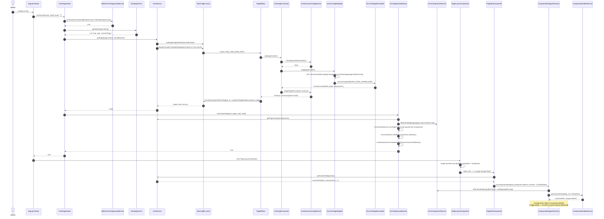
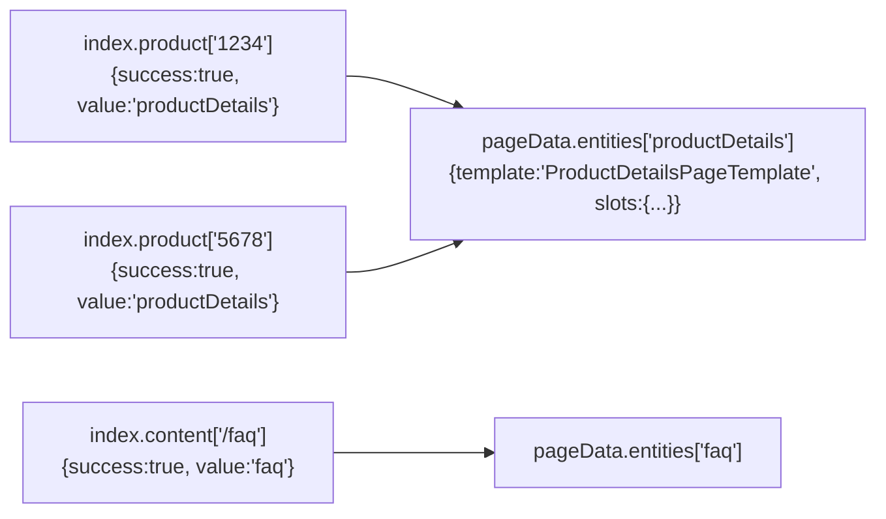
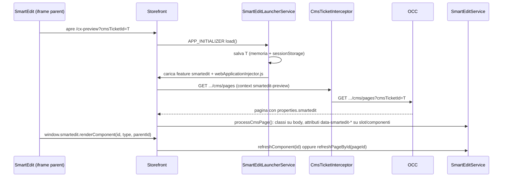

# 04 — UI guidata dal CMS (CMS-driven UI)

> Area C del deep dive. Revisione del codice: `2611.0.0` (Angular 21.2, NgRx 21).
> Tutti i path sono relativi alla radice del repository `/home/user/spartacus`.
> Quando un'affermazione non si può dimostrare leggendo il codice è marcata **NON VERIFICATO NEL CODICE**.

---

## Indice

1. [In una frase](#1-in-una-frase)
2. [Il problema che risolve](#2-il-problema-che-risolve)
3. [Mappa dei pezzi (chi fa cosa)](#3-mappa-dei-pezzi-chi-fa-cosa)
4. [Flusso passo-passo del caricamento di una pagina](#4-flusso-passo-passo-del-caricamento-di-una-pagina)
5. [Il contratto OCC `/cms/pages`](#5-il-contratto-occ-cmspages)
6. [Come è implementato (con path) — dal router allo store](#6-come-è-implementato-con-path--dal-router-allo-store)
7. [Struttura CMS statica](#7-struttura-cms-statica)
8. [LayoutConfig e `layoutSlots`](#8-layoutconfig-e-layoutslots)
9. [PageLayoutComponent e PageSlotComponent](#9-pagelayoutcomponent-e-pageslotcomponent)
10. [ComponentWrapperDirective e i ComponentHandler](#10-componentwrapperdirective-e-i-componenthandler)
11. [Mapping `cmsComponents` (CmsConfig / CmsComponentMapping)](#11-mapping-cmscomponents-cmsconfig--cmscomponentmapping)
12. [CmsComponentData: come un componente riceve i suoi dati](#12-cmscomponentdata-come-un-componente-riceve-i-suoi-dati)
13. [Outlet: punti di estensione del template](#13-outlet-punti-di-estensione-del-template)
14. [Defer loading, IntersectionService e page fold](#14-defer-loading-intersectionservice-e-page-fold)
15. [SmartEdit e preview](#15-smartedit-e-preview)
16. [Codice minimo riscritto a mano (mini CMS engine)](#16-codice-minimo-riscritto-a-mano-mini-cms-engine)
17. [Errori comuni](#17-errori-comuni)
18. [Domande di autoverifica](#18-domande-di-autoverifica)

---

## 1. In una frase

In Spartacus **non esiste un template Angular per ogni pagina**: esiste un'unica route "cattura-tutto"
(`path: '**'`) che mostra `PageLayoutComponent`; prima di attivarla, `CmsPageGuard` scarica dal backend
(OCC `/cms/pages`) la **descrizione** della pagina (template, slot, componenti), la mette nello store NgRx
`cms`, e poi il layout disegna gli slot e dentro ogni slot crea dinamicamente il componente Angular
associato al `typeCode`/`flexType` tramite la configurazione `cmsComponents`.

---

## 2. Il problema che risolve

In un e-commerce SAP Commerce Cloud la struttura delle pagine la decide il **business**, non lo sviluppatore:

- il merchandiser in Backoffice/SmartEdit aggiunge un banner nella home, sposta un carosello, crea una pagina
  "/faq" nuova;
- ogni pagina ha un **template** (es. `LandingPage2Template`) che ha delle **posizioni** (slot) come
  `Section1`, `Section2A`...;
- ogni slot contiene **componenti CMS** (es. `SimpleBannerComponent`, `ProductCarouselComponent`) con i loro
  dati (immagine, testo, lista prodotti).

Se il frontend avesse le pagine "cablate" nel codice, ogni modifica del merchandiser richiederebbe un
rilascio. Spartacus risolve così:

| Esigenza | Soluzione Spartacus |
|---|---|
| Pagine create dal business senza deploy | route `**` + `CmsPageGuard` che chiede al CMS "che pagina è questa URL?" |
| Posizionare componenti in slot | `PageLayoutComponent` + `PageSlotComponent` guidati da `LayoutConfig.layoutSlots` |
| Collegare un tipo CMS a un componente Angular | `CmsConfig.cmsComponents` (mapping `typeCode → component`) |
| Componenti di feature caricate lazy | `featureModules` + `CmsFeaturesService` + `LazyComponentHandler` |
| Pagine che non esistono nel backend (es. demo, test) | struttura statica `CmsStructureConfig` / `provideCmsStructure` |
| Estendere un pezzo di UI senza toccare il template | Outlet (`cxOutlet`, `cxOutletRef`, `provideOutlet`) |
| Performance "above the fold" | `DeferLoadingStrategy`, `IntersectionService`, `pageFold` |
| Editing visuale nel CMS | libreria `@spartacus/smartedit` (`cmsTicketId`, attributi DOM `data-smartedit-*`) |

---

## 3. Mappa dei pezzi (chi fa cosa)

| # | Pezzo | Path | Ruolo |
|---|---|---|---|
| 1 | `addCmsRoute` / `CmsRouteModule` | `core-libs/storefront/cms-structure/routing/cms-route/add-cms-route.ts`, `cms-route.module.ts` | In un `APP_INITIALIZER` aggiunge in fondo al router la route `{ path: '**', canActivate: [CmsPageGuard], component: PageLayoutComponent }` |
| 2 | `CmsPageGuard` | `core-libs/storefront/cms-structure/guards/cms-page.guard.ts` | Guard che carica la pagina CMS e decide se attivare la route |
| 3 | `BeforeCmsPageGuardService` | `core-libs/storefront/cms-structure/guards/before-cms-page-guard.service.ts` | Esegue prima i guard registrati sul token `BEFORE_CMS_PAGE_GUARD` (es. `ProtectedRoutesGuard`, `FederatedLoginGuard`, registrati in `routing.module.ts`) |
| 4 | `CmsPageGuardService` | `core-libs/storefront/cms-structure/guards/cms-page-guard.service.ts` | Dato il contenuto della pagina: risolve i mapping, esegue i guard dei componenti, carica chunk i18n, registra le child route; gestisce il "not found" |
| 5 | `CmsService` | `core-libs/core/src/cms/facade/cms.service.ts` | Facade: nasconde lo store (`getPage`, `hasPage`, `getContentSlot`, `getComponentData`, `refresh*`) |
| 6 | Store `cms` | `core-libs/core/src/cms/store/*` | Actions (`LoadCmsPageData`...), effects (`PageEffects`, `ComponentsEffects`), reducers (`page.pageData`, `page.index.{content,product,category,catalog}`, `components`, `navigation`) |
| 7 | `CmsPageConnector` | `core-libs/core/src/cms/connectors/page/cms-page.connector.ts` | Decide se chiamare il backend o solo la config statica; unisce la struttura statica |
| 8 | `CmsPageAdapter` (astratto) / `OccCmsPageAdapter` | `core-libs/core/src/cms/connectors/page/cms-page.adapter.ts`, `core-libs/core/src/occ/adapters/cms/occ-cms-page.adapter.ts` | Chiamata HTTP a `users/${userId}/cms/pages` |
| 9 | `OccCmsPageNormalizer` | `core-libs/core/src/occ/adapters/cms/converters/occ-cms-page-normalizer.ts` | Converte `Occ.CMSPage` in `CmsStructureModel` |
| 10 | `CmsStructureConfigService` | `core-libs/core/src/cms/services/cms-structure-config.service.ts` | Pagine/slot/componenti da configurazione statica (`cmsStructure`) |
| 11 | `PageLayoutService` | `core-libs/storefront/cms-structure/page/page-layout/page-layout.service.ts` | Calcola la lista di slot da mostrare (template + breakpoint + `LayoutConfig`) |
| 12 | `PageLayoutComponent` (`cx-page-layout`) | `core-libs/storefront/cms-structure/page/page-layout/page-layout.component.ts` | Disegna gli slot della pagina o di una sezione (header/navigation/footer) |
| 13 | `PageSlotComponent` (`cx-page-slot`) | `core-libs/storefront/cms-structure/page/slot/page-slot.component.ts` | Legge lo slot dallo store e itera i componenti |
| 14 | `ComponentWrapperDirective` (`[cxComponentWrapper]`) | `core-libs/storefront/cms-structure/page/component/component-wrapper.directive.ts` | Crea dinamicamente il componente Angular |
| 15 | `ComponentHandlerService` + handler | `core-libs/storefront/cms-structure/page/component/services/component-handler.service.ts`, `.../handlers/*.ts` | Sceglie la strategia di creazione: `DefaultComponentHandler`, `LazyComponentHandler`, `WebComponentHandler` |
| 16 | `CmsComponentsService` | `core-libs/storefront/cms-structure/services/cms-components.service.ts` | Legge e risolve i mapping `cmsComponents` (anche da feature lazy) |
| 17 | `CmsInjectorService` + `ComponentDataProvider` | `core-libs/storefront/cms-structure/page/component/services/cms-injector.service.ts`, `component-data.provider.ts` | Costruisce l'injector figlio con `CmsComponentData` |
| 18 | `OutletDirective`, `OutletService`, `OutletRefDirective`, `provideOutlet` | `core-libs/storefront/cms-structure/outlet/*` | Punti di estensione nel template |
| 19 | `DeferLoaderService`, `IntersectionService` | `core-libs/storefront/layout/loading/*` | Rendering differito basato su IntersectionObserver |
| 20 | SmartEdit | `feature-libs/smartedit/*` | Preview/editing: `cmsTicketId`, `CmsTicketInterceptor`, decoratori DOM |

---

## 4. Flusso passo-passo del caricamento di una pagina

### 4.1 Diagramma di sequenza



### 4.2 Lo stesso flusso a parole

1. **Bootstrap.** `CmsRouteModule` registra `addCmsRoute` come `APP_INITIALIZER`; la funzione fa
   `router.config.push(cmsRoute)` con `path: '**'` (file `core-libs/storefront/cms-structure/routing/cms-route/add-cms-route.ts`).
   Essendo in fondo, vince solo se nessuna route più specifica fa match.
2. **Page context.** Il router store di Spartacus calcola un `PageContext` `{ id, type }` per la navigazione
   (per la preview SmartEdit vedi §15). Il guard lo legge con `RoutingService.getNextPageContext()`.
3. **Guard preliminari.** `CmsPageGuard.canActivate` chiama per primo `BeforeCmsPageGuardService.canActivate`,
   che compone i guard del token `BEFORE_CMS_PAGE_GUARD` (in `RoutingModule.forRoot` sono registrati
   `ProtectedRoutesGuard` e `FederatedLoginGuard`, file `core-libs/storefront/cms-structure/routing/routing.module.ts`).
4. **Caricamento pagina.** Se passano, chiama `CmsService.getPage(pageContext, this.shouldReload())`.
   `shouldReload()` è `true` a meno che `RoutingConfigService.getLoadStrategy()` sia `RouteLoadStrategy.ONCE`.
5. **Store.** `CmsService.hasPage` osserva l'indice della pagina; se non è mai stata tentata (o si forza il reload)
   fa `dispatch(new CmsActions.LoadCmsPageData(pageContext))`.
6. **Effect.** `PageEffects.loadPageData$` fa `groupBy` per contesto serializzato, `switchMap` su
   `CmsPageConnector.get(pageContext)` e alla risposta emette `CmsGetComponentFromPage` (i dati dei
   componenti già presenti nella risposta pagina finiscono nello stato `components`) e
   `LoadCmsPageDataSuccess(pageContext, page)`. Se il `label` restituito è diverso dall'id richiesto aggiunge
   `CmsSetPageSuccessIndex` anche per il label corretto.
7. **Connector/Adapter/Normalizer.** Il connector chiede a `CmsStructureConfigService.shouldIgnoreBackend(id)`;
   se `false` chiama `CmsPageAdapter.load` (implementato da `OccCmsPageAdapter`), che fa la GET e passa la
   risposta al converter `CMS_PAGE_NORMALIZER` (`OccCmsPageNormalizer`). Un errore HTTP **400** viene trasformato
   in struttura vuota `{}`; gli altri errori vengono rilanciati. Poi il connector fa sempre
   `mergePageStructure` con la struttura statica.
8. **Pagina trovata?** Se `getPage` emette una `Page` → `CmsPageGuardService.canActivatePage`; se emette `null`
   → `canActivateNotFoundPage`, che carica la pagina con label `semanticPathService.get('notFound')`, e con
   `setPageFailIndex` fa puntare l'indice della pagina richiesta alla pagina "not found".
9. **Componenti della pagina.** `canActivatePage` prende i tipi di componente della pagina
   (`CmsSelectors.getPageComponentTypes`, che raccoglie i `flexType` di tutti gli slot), chiama
   `CmsComponentsService.determineMappings` (può scaricare moduli di feature lazy), valuta i `guards` dei
   componenti (`CmsGuardsService.cmsPageCanActivate`), carica i chunk i18n (`CmsI18nService.loadForComponents`)
   e, se servono, crea dinamicamente le child route (`CmsRoutesService.handleCmsRoutesInGuard`).
10. **Rendering.** Il router crea `PageLayoutComponent`. Questo chiede a `PageLayoutService.getSlots()`
    la lista di slot da disegnare per il template corrente e il breakpoint corrente.
11. **Slot.** Per ogni slot `<cx-page-slot [position]>` legge `CmsService.getContentSlot(position)`.
12. **Componenti.** Per ogni componente dello slot c'è un `ng-template [cxOutlet]="component.flexType"` con
    `[cxOutletDefer]` e dentro `<ng-container [cxComponentWrapper]="component">`.
13. **Creazione dinamica.** `ComponentWrapperDirective` risolve il mapping, costruisce un injector con
    `CmsComponentData` (`CmsInjectorService.getInjector`) e chiede a `ComponentHandlerService` il launcher
    corretto; il componente viene creato nel `ViewContainerRef`.
14. **Dati del componente.** Il componente legge `CmsComponentData.data$`, che deriva da
    `CmsService.getComponentData(uid)`: se i dati sono già arrivati con la pagina li trova nello store,
    altrimenti parte `LoadCmsComponent` (caricamento a lotti, vedi §12).

---

## 5. Il contratto OCC `/cms/pages`

### 5.1 Endpoint

Definiti in `core-libs/core/src/cms/config/default-cms-config.ts` (`defaultCmsModuleConfig`):

```ts
endpoints: {
  component: 'users/${userId}/cms/components/${id}',
  components: 'users/${userId}/cms/components',
  pages: 'users/${userId}/cms/pages',
  page: 'users/${userId}/cms/pages/${id}',
},
```

`OccCmsPageAdapter.load` (file `core-libs/core/src/occ/adapters/cms/occ-cms-page.adapter.ts`) usa:

- endpoint `page` (per id) quando `pageContext.type` **non** è definito;
- endpoint `pages` con query params negli altri casi, calcolati da `getPagesRequestParams`:
  - `ContentPage` → `?pageType=ContentPage&pageLabelOrId=/faq`
  - `ProductPage`/`CategoryPage`/`CatalogPage` → `?pageType=ProductPage&code=1234`
  - home (`HOME_PAGE_CONTEXT = '__HOMEPAGE__'`) o preview SmartEdit (`SMART_EDIT_CONTEXT = 'smartedit-preview'`)
    → nessun parametro: il backend restituisce la pagina di default / quella legata al `cmsTicketId`.

Le costanti sono in `core-libs/core/src/routing/models/page-context.model.ts`.

### 5.2 Il modello OCC

`Occ.CMSPage` in `core-libs/core/src/occ/occ-models/occ.models.ts`:

```ts
export interface CMSPage {
  contentSlots?: ContentSlotList;   // { contentSlot?: ContentSlot[] }
  defaultPage?: boolean;
  name?: string;
  template?: string;
  title?: string;
  description?: string;
  typeCode?: string;                // 'ContentPage' | 'ProductPage' | ...
  uid?: string;
  label?: string;
  properties?: any;                 // es. { smartedit: { classes: '...' } }
  robotTag?: PageRobots;            // INDEX_FOLLOW, NOINDEX_NOFOLLOW, ...
}

export interface ContentSlot {
  components?: ComponentList;       // { component?: Component[] }
  name?: string;
  position?: string;                // chiave usata dal layout: 'Section1', 'SiteLogo'...
  slotId?: string;
  slotShared?: boolean;
  slotStatus?: string;
  properties?: any;
}
```

### 5.3 Esempio JSON (ricostruito da mock reali)

Non esiste nel repo un file fixture JSON completo di `/cms/pages` (la ricerca `grep -rl contentSlot --include=*.json`
non restituisce risultati). L'esempio seguente **unisce due mock reali**:

- la forma della pagina viene da `cmsPageData` in `core-libs/core/src/occ/adapters/cms/occ-cms-page.adapter.spec.ts`;
- la forma di un componente `CMSFlexComponent` viene dall'intercept Cypress in
  `projects/storefrontapp-e2e-cypress/cypress/helpers/site-theme.ts` (funzione `interceptCmsPageToAddThemeComponent`,
  che modifica lo slot `SiteContextSlot` della risposta reale);
- lo slot `Section3Slot-Homepage` con `ElectronicsHomepageProductCarouselComponent` e il campo `productCodes` compare in
  `projects/storefrontapp-e2e-cypress/cypress/e2e/regression/product-carousel/product-carousel.e2e.cy.ts`.

Mock originale dello spec (copiato):

```ts
// core-libs/core/src/occ/adapters/cms/occ-cms-page.adapter.spec.ts
const components: CmsComponent[] = [
  { uid: 'comp1', typeCode: 'SimpleBannerComponent' },
  { uid: 'comp2', typeCode: 'CMSLinkComponent' },
  { uid: 'comp3', typeCode: 'NavigationComponent' },
];

const cmsPageData: any = {
  uid: 'testPageId',
  name: 'testPage',
  template: 'testTemplate',
  contentSlots: {
    contentSlot: [
      { components: { component: components }, position: 'testPosition' },
    ],
  },
};
```

Esempio composto (i valori non presenti nei mock, come `robotTag` e `label`, sono illustrativi ma i nomi dei campi
sono quelli di `Occ.CMSPage`):

```json
{
  "uid": "homepage",
  "typeCode": "ContentPage",
  "name": "Homepage",
  "label": "homepage",
  "template": "LandingPage2Template",
  "robotTag": "INDEX_FOLLOW",
  "contentSlots": {
    "contentSlot": [
      {
        "slotId": "SiteContextSlot",
        "position": "SiteContext",
        "components": {
          "component": [
            {
              "uid": "SiteThemeSwitcherComponent",
              "uuid": "SiteThemeSwitcherComponent",
              "typeCode": "CMSFlexComponent",
              "modifiedtime": "2024-09-09T15:15:02.954Z",
              "name": "Site Theme Switcher Component",
              "container": false,
              "flexType": "SiteThemeSwitcherComponent",
              "synchronizationBlocked": false
            }
          ]
        }
      },
      {
        "slotId": "Section3Slot-Homepage",
        "position": "Section3",
        "components": {
          "component": [
            {
              "uid": "ElectronicsHomepageProductCarouselComponent",
              "typeCode": "ProductCarouselComponent",
              "productCodes": "..."
            }
          ]
        }
      }
    ]
  }
}
```

### 5.4 Cosa ne fa il normalizer

`OccCmsPageNormalizer.convert` (4 passi, ognuno un metodo `protected` ridefinibile):

| Metodo | Input | Output in `CmsStructureModel` |
|---|---|---|
| `normalizePageData` | `name, typeCode, label, template, uid, title, description, properties, robotTag` | `page.name, page.type, page.label, page.template, page.pageId, page.title, page.description, page.properties, page.robots` |
| `normalizePageSlotData` | `contentSlots.contentSlot[]` (se oggetto singolo lo trasforma in array) | `page.slots[position] = { properties }` |
| `normalizePageComponentData` | `slot.components.component[]` | `page.slots[position].components.push({ uid, typeCode, flexType, properties })` |
| `normalizeComponentData` | stessi componenti | `components[]` con i dati completi (rinomina `modifiedtime` → `modifiedTime`, azzera `properties`) |

La regola chiave è `getFlexTypeFromComponent`:

```ts
// core-libs/core/src/occ/adapters/cms/converters/occ-cms-page-normalizer.ts
if (component.typeCode === CMS_FLEX_COMPONENT_TYPE) {        // 'CMSFlexComponent'
  return component.flexType;
} else if (component.typeCode === JSP_INCLUDE_CMS_COMPONENT_TYPE) { // 'JspIncludeComponent'
  return component.uid;
}
return component.typeCode;
```

Quindi **la chiave del mapping Angular è `flexType`**, che vale:
- per un `CMSFlexComponent` → il suo campo `flexType` (es. `SiteThemeSwitcherComponent`);
- per un `JspIncludeComponent` → il suo `uid` (es. `AccountAddressBookComponent`, vedi `JspIncludeCmsComponentConfig`);
- per tutti gli altri → il `typeCode` (es. `SimpleBannerComponent`).

`CMSFlexComponent` e `JspIncludeComponent` sono il trucco per avere nel backend un componente "segnaposto"
la cui implementazione esiste solo nel frontend.

Il risultato per il JSON sopra è:

```ts
const result: CmsStructureModel = {
  page: {
    pageId: 'homepage',
    type: 'ContentPage',
    name: 'Homepage',
    label: 'homepage',
    template: 'LandingPage2Template',
    robots: [PageRobotsMeta.INDEX, PageRobotsMeta.FOLLOW],
    slots: {
      SiteContext: {
        components: [
          { uid: 'SiteThemeSwitcherComponent', typeCode: 'CMSFlexComponent',
            flexType: 'SiteThemeSwitcherComponent', properties: undefined },
        ],
      },
      Section3: {
        components: [
          { uid: 'ElectronicsHomepageProductCarouselComponent',
            typeCode: 'ProductCarouselComponent',
            flexType: 'ProductCarouselComponent', properties: undefined },
        ],
      },
    },
  },
  components: [ /* i due oggetti componente completi, senza properties */ ],
};
```

Il modello di destinazione è definito in `core-libs/core/src/cms/model/page.model.ts` (`Page`, `CmsStructureModel`),
`content-slot-data.model.ts` (`ContentSlotData { components?, properties? }`) e
`content-slot-component-data.model.ts` (`ContentSlotComponentData { uid?, typeCode?, flexType?, properties? }`).

Il cablaggio adapter/normalizer avviene in `CmsOccModule` (`core-libs/core/src/occ/adapters/cms/cms-occ.module.ts`):

```ts
{ provide: CmsPageAdapter, useExisting: OccCmsPageAdapter },
{ provide: CMS_PAGE_NORMALIZER, useExisting: OccCmsPageNormalizer, multi: true },
{ provide: CmsComponentAdapter, useExisting: OccCmsComponentAdapter },
```

Poiché `CMS_PAGE_NORMALIZER` è `multi`, puoi **aggiungere** un tuo normalizer che arricchisce il risultato senza
sostituire quello di default.

---
## 6. Come è implementato (con path) — dal router allo store

### 6.1 CmsPageGuard

**Cos'è.** Un guard class-based `@Injectable({ providedIn: 'root' })` con `static guardName = 'CmsPageGuard'`
(file `core-libs/storefront/cms-structure/guards/cms-page.guard.ts`).

**Perché.** È il punto in cui la navigazione "aspetta" il CMS: la pagina viene attivata **solo** dopo che i dati
sono nello store, così il layout non parte mai vuoto e in SSR l'HTML contiene già gli slot.

**Dove si usa.** Oltre alla route `**`, lo trovi su route esplicite che hanno comunque bisogno del CMS, es.
`core-libs/storefront/cms-pages/product-details-page/product-details-page.module.ts` (`ProductDetailsPageModule`):

```ts
RouterModule.forChild([
  {
    // @ts-ignore
    path: null,                       // il path reale lo dà la config di routing (cxRoute)
    canActivate: [CmsPageGuard],
    component: PageLayoutComponent,
    data: { cxRoute: 'product' },
  },
]),
```

**Il cuore del codice (semplificato):**

```ts
canActivate(route, state) {
  return this.beforeCmsPageGuardService.canActivate(route, state).pipe(
    switchMap((canActivate) =>
      canActivate === true
        ? this.routingService.getNextPageContext().pipe(
            filter(isNotUndefined), take(1),
            switchMap((pageContext) =>
              this.cmsService.getPage(pageContext, this.shouldReload()).pipe(
                first(),
                switchMap((pageData) => pageData
                  ? this.service.canActivatePage(pageContext, pageData, route, state)
                  : this.service.canActivateNotFoundPage(pageContext, route, state))
              ))
          )
        : of(canActivate)
    )
  );
}
```

### 6.2 CmsPageGuardService

File `core-libs/storefront/cms-structure/guards/cms-page-guard.service.ts`.

- `canActivatePage(pageContext, pageData, route, state)`
  1. `cmsService.getPageComponentTypes(pageContext)`;
  2. `cmsComponentsService.determineMappings(componentTypes)`;
  3. `cmsGuards.cmsPageCanActivate(componentTypes, route, state)` → i `guards` di **tutti** i componenti della
     pagina (se uno dice `false` o `UrlTree`, la pagina intera non si attiva);
  4. se `true` → `cmsI18n.loadForComponents(componentTypes)`;
  5. se `true` e la route non ha già `data.cxCmsRouteContext` → `cmsRoutes.handleCmsRoutesInGuard(...)`.
- `canActivateNotFoundPage(...)` → carica la ContentPage con id `semanticPathService.get('notFound')`, poi
  `cmsService.setPageFailIndex(pageContext, notFoundIndex)` e `routing.changeNextPageContext(notFoundCmsPageContext)`.
  L'URL resta quello richiesto, ma il contenuto è la pagina 404 del CMS.

**Child routes.** `CmsRoutesImplService.handleCmsRoutesInGuard`
(`core-libs/storefront/cms-structure/services/cms-routes-impl.service.ts`): se i componenti della pagina dichiarano
`childRoutes`, e la pagina è una `ContentPage` con label che inizia con `/`, crea una nuova route
`{ path: label.substring(1), component: PageLayoutComponent, children, data: { cxCmsRouteContext } }`, fa
`router.resetConfig([newRoute, ...router.config])` e rinaviga all'URL corrente (il guard ritorna `false`).
Alla seconda passata la route ha `cxCmsRouteContext` e il guard non la ricrea.

### 6.3 CmsService (facade)

File `core-libs/core/src/cms/facade/cms.service.ts`. Metodi principali:

| Metodo | Cosa fa |
|---|---|
| `getCurrentPage()` | `routingService.getPageContext()` → `select(CmsSelectors.getPageData(ctx))` |
| `hasPage(ctx, forceReload)` | osserva l'indice; se non caricata (o reload) dispatcha `LoadCmsPageData`; emette `true/false` quando `success` o `error` |
| `getPage(ctx, forceReload)` | `hasPage` + `getPageState` oppure `of(null)` |
| `getPageComponentTypes(ctx)` | tipi (`flexType`) presenti negli slot |
| `getContentSlot(position)` | `CmsSelectors.getCurrentSlotSelectorFactory(ctx, position)`: se lo slot non esiste restituisce `{ components: [] }` |
| `getComponentData(uid, ctx?)` | cache per `uid`+contesto; se non in store e **non** in caricamento con la pagina corrente, dispatcha `LoadCmsComponent` |
| `refreshLatestPage()`, `refreshPageById(id)`, `refreshComponent(uid)` | forzano ricarichi (usati da SmartEdit) |
| `setPageFailIndex(ctx, value)` | per la pagina "not found" |
| `clearComponentState(uids?)` | svuota la cache componenti (SmartEdit) |

Nota su `getComponentData`: usa `using(() => loading$.subscribe(), () => component$)` e `shareReplay({ bufferSize: 1, refCount: true })`.
Il caricamento parte **solo finché c'è almeno un sottoscrittore** e le richieste nello stesso event loop vengono
accorpate in una sola chiamata HTTP dall'effect `ComponentsEffects.loadComponent$`
(`core-libs/core/src/cms/store/effects/components.effect.ts`, `groupBy` per contesto + `bufferDebounceTime`),
con paginazione `componentsLoading.pageSize` (default 50) in `CmsComponentConnector.getList`.

### 6.4 Lo store `cms`

Feature key `CMS_FEATURE = 'cms'` (`core-libs/core/src/cms/store/cms-state.ts`):

```ts
export interface CmsState {
  page: PageState;                // { pageData: EntityState<Page>, index: IndexType }
  components: ComponentsState;    // EntityState<ComponentsContext>
  navigation: StateUtils.EntityLoaderState<NodeItem>;
}

export type IndexType = {
  content: StateUtils.EntityLoaderState<string>;
  product: StateUtils.EntityLoaderState<string>;
  category: StateUtils.EntityLoaderState<string>;
  catalog: StateUtils.EntityLoaderState<string>;
};
```

**Idea chiave: indice + entità.** La pagina viene salvata una sola volta in `page.pageData.entities[pageId]`.
Per ogni tipo di pagina c'è un indice `pageContext.id → pageId` con stato loader
(`loading/success/error/value`). Esempio: 100 prodotti diversi usano tutti la stessa `productDetails` page:
`index.product.entities['1234'].value = 'productDetails'` e l'entità pagina è una sola.



Composizione dei reducer (`core-libs/core/src/cms/store/reducers/index.ts`, `getReducers()`):

- `page.pageData` → `page-data.reducer.ts` (su `LOAD_CMS_PAGE_DATA_SUCCESS` salva `entities[page.pageId]`);
- `page.index.<tipo>` → `entityLoaderReducer(PageType.X, fromPageIndexReducer.reducer(PageType.X))`; il reducer
  dell'indice (`page-index.reducer.ts`) salva `pageId` su `LOAD_CMS_PAGE_DATA_SUCCESS` / `CMS_SET_PAGE_SUCCESS_INDEX`
  e il valore passato su `CMS_SET_PAGE_FAIL_INDEX`;
- `components` → `entityReducer(COMPONENT_ENTITY, components.reducer)`;
- `navigation` → `entityLoaderReducer(NAVIGATION_DETAIL_ENTITY, ...)`.

Meta-reducer `clearCmsState`: su `LANGUAGE_CHANGE`, `LOGOUT`, `LOGIN` lo stato `cms` viene azzerato (i contenuti
possono cambiare per lingua o per utente con restrizioni). In parallelo `PageEffects.refreshPage$` ricarica la
pagina corrente se `routerState.state.cmsRequired`.

Actions (`core-libs/core/src/cms/store/actions/page.action.ts`): `LoadCmsPageData`, `LoadCmsPageDataFail`,
`LoadCmsPageDataSuccess`, `CmsSetPageSuccessIndex`, `CmsSetPageFailIndex` — sono `StateUtils.EntityLoadAction` /
`EntitySuccessAction` / `EntityFailAction`, cioè si agganciano al meccanismo generico "entity loader" (vedi file 06).

SSR: `CmsStoreModule` (`core-libs/core/src/cms/store/cms-store.module.ts`) dichiara
`state.ssrTransfer.keys = { cms: StateTransferType.TRANSFER_STATE }`: lo stato `cms` calcolato sul server viene
trasferito al browser, così il client non richiama `/cms/pages` all'idratazione.

### 6.5 CmsPageConnector

File `core-libs/core/src/cms/connectors/page/cms-page.connector.ts`:

```ts
get(pageContext: PageContext): Observable<CmsStructureModel> {
  return this.cmsStructureConfigService.shouldIgnoreBackend(pageContext.id).pipe(
    switchMap((loadFromConfig) =>
      !loadFromConfig
        ? this.cmsPageAdapter.load(pageContext).pipe(
            catchError((error) => {
              if (error instanceof HttpErrorResponse && error.status === 400) return of({});
              throw error;
            }))
        : of({})
    ),
    switchMap((page) => this.mergeDefaultPageStructure(pageContext, page))
  );
}
```

`CmsPageAdapter` è una classe astratta con un solo metodo `load(pageContext)`: è il punto dove collegare un CMS
di terze parti (il commento del file lo dice esplicitamente).

---

## 7. Struttura CMS statica

### In una frase
`CmsStructureConfig.cmsStructure` permette di descrivere pagine, slot e componenti **in configurazione**, che vengono
fusi nella risposta del backend o la sostituiscono del tutto (`ignoreBackend: true`).

### Il problema che risolve
- aggiungere un componente "tecnico" su tutte le pagine senza toccare il CMS (es. menu hamburger, login);
- pagine demo/test che nel backend non esistono;
- velocità: saltare la chiamata di rete per pagine "commodity".

### Come è implementato
Config (`core-libs/core/src/cms/config/cms-structure.config.ts`):

```ts
export abstract class CmsStructureConfig extends CmsConfig {
  cmsStructure?: {
    components?: { [key: string]: ContentSlotComponentData | any };
    pages?: CmsPageConfig[];       // { ignoreBackend?, pageId?, type?, title?, template?, slots }
    slots?: CmsPageSlotsConfig;    // { [position]: { componentIds?: string[], properties? } }
  };
}
```

Servizio `CmsStructureConfigService` (`core-libs/core/src/cms/services/cms-structure-config.service.ts`):

- `shouldIgnoreBackend(pageId)` → `!!page?.ignoreBackend` per la pagina con quel `pageId`;
- `mergePageStructure(pageId, structure)` → `mergePage` + `mergeSlots`;
- `mergePage` → se c'è una pagina in config e la struttura non ha `page`, la crea copiando la config;
  poi unisce gli slot della pagina;
- `mergeSlots(structure, slots?)` → se non vengono passati slot usa quelli **globali** `cmsStructure.slots`;
  aggiunge uno slot solo se la posizione **non esiste già** nella pagina (il backend vince sempre);
- `getComponentFromConfig(id)` / `getComponentsFromConfig(ids)` → usati da `CmsComponentConnector`.

Helper `provideCmsStructure` (`core-libs/storefront/cms-structure/utils/cms-structure.util.ts`): genera insieme una
`CmsStructureConfig` e, se passi `pageTemplate`/`section`, una `LayoutConfig`:

```ts
provideCmsStructure({
  componentId: 'LoginComponent',   // -> cmsStructure.components.LoginComponent = { typeCode, flexType }
  pageSlotPosition: 'SiteLogin',   // -> cmsStructure.slots.SiteLogin = { componentIds: ['LoginComponent'] }
  // opzionali: pageTemplate, section (PageSection.HEADER|FOOTER|NAVIGATION), breakpoint
});
```

Esempio reale 1 — `core-libs/storefront/recipes/config/static-cms-structure.ts` (usato in
`projects/storefrontapp/src/app/spartacus/spartacus-configuration.module.ts` con `...defaultCmsContentProviders`):

```ts
export const defaultCmsContentProviders: ValueProvider[] = [
  provideCmsStructure({ componentId: 'HamburgerMenuComponent', pageSlotPosition: 'PreHeader' }),
  provideCmsStructure({ componentId: 'LoginComponent', pageSlotPosition: 'SiteLogin' }),
];
```

Effetto: in **ogni** pagina che non ha già gli slot `PreHeader`/`SiteLogin`, compaiono questi due componenti flex.

Esempio reale 2 — pagine interamente statiche per i test e2e degli outlet,
`projects/storefrontapp/src/test-outlets/test-outlet-cms-page.config.ts` (`testOutletPagesCmsContentConfig`):

```ts
cmsStructure: {
  components: { ...paragraphComponents, ...linkComponents },
  pages: [
    {
      slots: { Section2A: { componentIds: ['Paragraph1'] }, Section2B: {} },
      ignoreBackend: true,
      pageId: '/test/outlet/slot',
      template: 'ContentPage1Template',
    },
    // ...
  ],
},
```

### Flusso passo-passo
1. `PageEffects` chiama `CmsPageConnector.get({ id: '/test/outlet/slot', type: 'ContentPage' })`.
2. `shouldIgnoreBackend` → `true` → nessuna HTTP, struttura `{}`.
3. `mergePage` crea `page = { ...config, slots: {} }` e chiama `mergeSlots` con gli slot della pagina.
4. Per `Section2A` aggiunge `{ uid, flexType, typeCode }` in `page.slots.Section2A.components` e il componente completo in `components`.
5. `mergeSlots` viene chiamato di nuovo senza slot → aggiunge gli slot globali (`PreHeader`, `SiteLogin`).
6. Lo store riceve una pagina "normale": il resto del motore non sa che non viene dal backend.

### Errore tipico
Una `pageId` statica con `ignoreBackend: true` deve essere uguale all'`id` del `PageContext` (per le ContentPage è il
path con `/` iniziale, es. `'/test/outlet/slot'`). Se non combacia, `shouldIgnoreBackend` restituisce `false` e parte la
chiamata HTTP.

---

## 8. LayoutConfig e `layoutSlots`

### In una frase
`LayoutConfig.layoutSlots` dice, per ogni **template** CMS o **sezione** (header, navigation, footer), **quali slot**
mostrare, **in che ordine**, per quale **breakpoint** e quale è l'ultimo slot "above the fold".

### Il problema che risolve
Il backend dice quali slot esistono in una pagina, ma non come disporli. Il frontend deve decidere ordine e
responsività senza un template HTML per ogni pagina.

### Come è implementato
Tipi in `core-libs/storefront/layout/config/layout-config.ts`:

```ts
export enum BREAKPOINT { xs = 'xs', sm = 'sm', md = 'md', lg = 'lg', xl = 'xl' }

export type SlotConfig = { slots?: string[]; pageFold?: string };
export type SlotGroup = { lg?: SlotConfig; md?: SlotConfig; sm?: SlotConfig; xs?: SlotConfig };
export type LayoutSlotConfig = { [section: string]: SlotConfig | SlotGroup | LayoutSlotConfig };

export abstract class LayoutConfig {
  breakpoints?: LayoutBreakPoints;
  layoutSlots?: LayoutSlotConfig;
  deferredLoading?: { strategy?: DeferLoadingStrategy; intersectionMargin?: string };
  launch?: LaunchConfig;
}
```

Breakpoint di default (`core-libs/storefront/layout/config/default-layout.config.ts`, `defaultLayoutConfig`):
`xs: 576, sm: 768, md: 992, lg: 1200, xl: { min: 1200 }`.

Configurazione reale (path verificato: `core-libs/storefront/recipes/config/layout-config.ts`). La costante
`layoutConfig` è **deprecata**; l'app demo usa `provideConfigFactory(layoutConfigFactory)`
(`projects/storefrontapp/src/app/spartacus/spartacus-configuration.module.ts`). Estratto:

```ts
export const layoutConfig: LayoutConfig = {
  layoutSlots: {
    header: {
      lg: {
        slots: ['PreHeader', 'SiteContext', 'SiteLinks', 'SiteLogo',
                'SearchBox', 'SiteLogin', 'MiniCart', 'NavigationBar'],
      },
      slots: ['PreHeader', 'SiteLogo', 'SearchBox', 'MiniCart'],
    },
    navigation: {
      lg: { slots: [] },
      slots: ['SiteLogin', 'NavigationBar', 'SiteContext', 'SiteLinks'],
    },
    footer: { slots: ['Footer'] },
    LandingPage2Template: {
      pageFold: 'Section2B',
      slots: ['Section1', 'Section2A', 'Section2B', 'Section2C', 'Section3', 'Section4', 'Section5'],
    },
    ProductDetailsPageTemplate: {
      lg: { pageFold: 'UpSelling' },
      pageFold: 'Summary',
      slots: ['Summary', 'UpSelling', 'CrossSelling', 'Tabs', 'PlaceholderContentSlot'],
    },
    // ... CategoryPageTemplate, CartPageTemplate, AccountPageTemplate, ecc.
  },
};
```

`layoutConfigFactory()` fa una deep copy e poi:
- `applyUnifiedHeaderSlots`: rimuove `header.lg` e mette tutti gli 8 slot in `header.slots` (header unico per tutti i breakpoint);
- `applyWithoutPageFold`: **rimuove** `pageFold` da `LandingPage2Template`, `CategoryPageTemplate`, `ProductDetailsPageTemplate`
  (anche `lg`), per evitare CLS in SSR (commento nel file).

Quindi nell'app demo attuale **nessun template ha `pageFold`**, a meno che tu non lo configuri.

### Come vengono lette le sezioni
In `core-libs/storefront/layout/main/storefront.component.html`:

```html
<header ...>
  <cx-page-layout section="header" [cxSkipFocus]="skipFocusConfig" />
  <cx-page-layout section="navigation" />
</header>
<cx-page-slot position="BottomHeaderSlot" class="cx-bottom-header-slot" />
<main ...><router-outlet /></main>
<footer ...><cx-page-layout section="footer" /></footer>
```

Il `<router-outlet>` ospita il `PageLayoutComponent` **senza** `section`: quello usa il template della pagina.

### Regole di risoluzione (`PageLayoutService`, `core-libs/storefront/cms-structure/page/page-layout/page-layout.service.ts`)

1. `getSlots(section?)` combina `cms.getCurrentPage()` e `breakpointService.breakpoint$`.
2. `resolveSlots`:
   - se trova una config → restituisce `config.slots` **filtrati** con gli slot effettivamente presenti nella pagina
     (`pageSlots.includes(slot)`): l'ordine è quello della config, la presenza la decide il CMS;
   - se non c'è config e non c'è sezione → tutti gli slot della pagina (`Object.keys(page.slots)`) e, in dev mode,
     un `logger.warn("No layout config found for ...")` + un `info` con gli slot disponibili;
   - se non c'è config e c'è sezione → `[]`.
3. Per una sezione (`getSlotConfigForSection`): cerca prima `layoutSlots[template][section]` (override per template),
   altrimenti `layoutSlots[section]` globale.
4. Responsività (`getResponsiveSlotConfig`): se esiste la config per il breakpoint corrente con quell'attributo la usa;
   altrimenti prende la più vicina **tra i breakpoint più piccoli** (`all.slice(0, all.indexOf(breakpoint))`), altrimenti
   la config di default (senza breakpoint).
5. Alla fine la lista passa per tutti i `PAGE_LAYOUT_HANDLER` (multi token, `page-layout-handler.ts`) che possono
   modificarla. Esempio reale: `CpqConfiguratorPageLayoutHandler` in
   `feature-libs/product-configurator/rulebased/root/cpq/cpq-configurator-page-layout-handler.ts`.
6. `distinctUntilChanged` confronta gli array elemento per elemento: nessun re-render se la lista non cambia.

---
## 9. PageLayoutComponent e PageSlotComponent

### 9.1 PageLayoutComponent (`cx-page-layout`)

**Cos'è.** Il componente standalone che disegna una pagina (o una sezione) come elenco di slot.
File `core-libs/storefront/cms-structure/page/page-layout/page-layout.component.ts` + `.html`.

**Perché.** È l'unico componente "pagina" di tutta l'app CMS: tutte le route CMS puntano a lui.

Proprietà reattive:

```ts
@Input() set section(value: string) { this.section$.next(value); }
readonly section$ = new BehaviorSubject<string | undefined>(undefined);
readonly templateName$ = this.pageLayoutService.templateName$;
readonly layoutName$ = this.section$.pipe(switchMap((s) => (s ? of(s) : this.templateName$)));
readonly slots$ = this.section$.pipe(switchMap((s) => this.pageLayoutService.getSlots(s)));
readonly pageFoldSlot$ = this.templateName$.pipe(
  switchMap((t) => this.pageLayoutService.getPageFoldSlot(t)), distinctUntilChanged());
```

Template (copiato):

```html
<ng-template
  *ngIf="layoutName$ | async as layoutName"
  [cxPageTemplateStyle]="layoutName"
  [cxOutlet]="layoutName"
  [cxOutletContext]="{ templateName$: templateName$, slots$: slots$, section$: section$ }"
>
  <ng-content />
  <cx-page-slot
    *ngFor="let slot of slots$ | async"
    [position]="slot"
    [isPageFold]="slot === (pageFoldSlot$ | async)"
  />
</ng-template>
```

Da notare:
- `cxPageTemplateStyle` (`PageTemplateDirective`, `page-template.directive.ts`) aggiunge al DOM una **classe CSS uguale
  al nome del template** (es. `LandingPage2Template`): gli stili di layout (CSS grid) in `core-libs/styles` si agganciano a
  quella classe;
- l'intero layout è dentro un **outlet con nome uguale al template o alla sezione**: puoi sostituire tutta la pagina
  `ProductDetailsPageTemplate` con un tuo template registrando un outlet con quel nome (§13).

### 9.2 PageSlotComponent (`cx-page-slot`)

File `core-libs/storefront/cms-structure/page/slot/page-slot.component.ts`. Selettore `'cx-page-slot,[cx-page-slot]'`.

Input e host binding:

| Membro | Tipo | Effetto |
|---|---|---|
| `@Input() position` + `@HostBinding('attr.position')` | string | chiave dello slot; viene anche aggiunta come classe CSS |
| `@Input() isPageFold` + `@HostBinding('class.page-fold')` | boolean | marca l'ultimo slot sopra la piega |
| `@HostBinding('class.cx-pending') isPending` | boolean | `true` finché ci sono componenti non ancora renderizzati |
| `@Input() hasComponents` + `@HostBinding('class.has-components')` | boolean | tenuto per retro-compatibilità |

Flusso interno:

1. `slot$ = position$.pipe(filter(isNotUndefined), switchMap(p => cmsService.getContentSlot(p)), distinctUntilChanged(isDistinct))`
   — `isDistinct` confronta gli `uid` dei componenti: se non cambiano, niente re-render.
2. In `ngOnInit` si sottoscrive, chiama `decorate(slot)` e aggiorna `components`.
3. `decorate` imposta la classe con la posizione, il contatore `pending = components.length` e chiama
   `dynamicAttributeService.addAttributesToSlot(...)` (qui entrano gli attributi SmartEdit, §15).
4. Ogni volta che un componente è pronto l'outlet emette `(loaded)="isLoaded($event)"` → `pending--` →
   quando arriva a 0 la classe `cx-pending` sparisce.

Template (copiato):

```html
<ng-template *ngIf="position" [cxOutlet]="position" [cxOutletContext]="{ components$: components$ }">
  <ng-container *ngFor="let component of components">
    <ng-template
      *ngIf="component.flexType"
      [cxOutlet]="component.flexType"
      [cxOutletContext]="{ component: component }"
      [cxOutletDefer]="getComponentDeferOptions(component.flexType)"
      (loaded)="isLoaded($event)"
    >
      <ng-container [cxComponentWrapper]="component" />
    </ng-template>
  </ng-container>
</ng-template>
```

Quindi ci sono **due livelli di outlet**: uno col nome dello **slot** e uno col nome del **tipo di componente**. È per
questo che puoi sostituire tutti i `ProductCarouselComponent` della storefront con un outlet `ProductCarouselComponent`.

`getComponentDeferOptions` delega a `PageSlotService.getComponentDeferOptions(position, componentType)`
(`page-slot.service.ts`, vedi §14).

---

## 10. ComponentWrapperDirective e i ComponentHandler

### In una frase
`[cxComponentWrapper]` riceve un `ContentSlotComponentData` (`uid`, `typeCode`, `flexType`), trova il mapping in
`cmsComponents` e delega a un `ComponentHandler` la creazione concreta del componente.

### Il problema che risolve
Il componente da creare non è noto a compile-time: può essere una classe Angular già caricata, una funzione che fa
`import()` lazy, o un Web Component esterno. Serve un punto unico che scelga la strategia.

### Come è implementato
`ComponentWrapperDirective` (`core-libs/storefront/cms-structure/page/component/component-wrapper.directive.ts`):

```ts
ngOnInit() {
  this.cmsComponentsService
    .determineMappings([this.cxComponentWrapper.flexType ?? ''])
    .subscribe(() => {
      if (this.cmsComponentsService.shouldRender(this.cxComponentWrapper.flexType ?? '')) {
        this.launchComponent();
      }
    });
}

private launchComponent() {
  const componentMapping = this.cmsComponentsService.getMapping(this.cxComponentWrapper.flexType ?? '');
  if (!componentMapping) return;
  this.launcherResource = this.componentHandler
    .getLauncher(
      componentMapping,
      this.vcr,
      this.cmsInjector.getInjector(flexType, uid, this.injector),
      this.cmsComponentsService.getModule(flexType)            // NgModuleRef della feature lazy, se c'è
    )
    ?.pipe(
      filter(isNotUndefined),
      tap(({ elementRef, componentRef }) => {
        this.cmpRef = componentRef;
        this.cxComponentRef.emit(componentRef);
        this.dispatchEvent(ComponentCreateEvent, elementRef);   // evento sull'EventService
        this.decorate(elementRef);                              // DynamicAttributeService (SmartEdit)
        this.injector.get(ChangeDetectorRef).markForCheck();
      }),
      finalize(() => this.dispatchEvent(ComponentDestroyEvent))
    )
    .subscribe();
}
```

In `ngOnDestroy` fa `launcherResource.unsubscribe()`: poiché il launcher è un `Observable` con funzione di teardown,
la disiscrizione **distrugge** il componente creato.

`ComponentHandler` (`.../handlers/component-handler.ts`) implementa `Applicable` di `@spartacus/core`:

```ts
export abstract class ComponentHandler implements Applicable {
  abstract launcher(mapping, vcr, elementInjector?, module?):
    Observable<{ elementRef: ElementRef; componentRef?: ComponentRef<any> }>;
  abstract hasMatch(componentMapping: CmsComponentMapping): boolean;
  abstract getPriority?(): Priority;
}
```

`ComponentHandlerService.resolve` usa `resolveApplicable(this.handlers, [componentMapping])`: tra gli handler con
`hasMatch === true` vince quello con priorità più alta.

| Handler | `hasMatch` | Priorità | Cosa fa | Registrato |
|---|---|---|---|---|
| `DefaultComponentHandler` | `typeof mapping.component === 'function'` | `Priority.FALLBACK` | `vcr.createComponent(factory, undefined, injector, undefined, module)` | sì, in `PageComponentModule.forRoot()` |
| `LazyComponentHandler` | è una funzione **ma non una classe** (`toString()` inizia con `function()` o `()=>`) | `Priority.LOW` | `from(mapping.component())` → poi delega al default handler | sì, in `PageComponentModule.forRoot()` |
| `WebComponentHandler` | `typeof component === 'string' && component.includes('#')` | `Priority.LOW` | inietta `<script src=path>` e crea l'elemento `selector`; assegna `webElement.cxApi = { ...CxApiService, cmsComponentData }` | **no**: nel repo non viene registrato da nessun modulo (grep di `WebComponentHandler` fuori da spec/file stesso: nessun risultato); va aggiunto a mano come `{ provide: ComponentHandler, useExisting: WebComponentHandler, multi: true }` |

`PageComponentModule.forRoot()` viene importato in `BaseStorefrontModule` (`core-libs/storefront/base-storefront.module.ts`).

Formati di `component` nel mapping:

```ts
cmsComponents: {
  A: { component: MyComponent },                                      // DefaultComponentHandler
  B: { component: () => import('./b.component').then(m => m.BComponent) }, // LazyComponentHandler
  C: { component: 'https://cdn.example.com/c.js#my-c-element' },      // WebComponentHandler (se registrato)
}
```

### Errori comuni
- Mapping con `component` classe **ma** transpilato come `function()`: con target ES5 (non usato da Angular moderno) il
  `LazyComponentHandler` potrebbe confondersi; con ES2022 le classi iniziano con `class` e non c'è ambiguità.
- `WebComponentHandler` non registrato → in dev mode `"Can't resolve handler for component mapping"`.

---

## 11. Mapping `cmsComponents` (CmsConfig / CmsComponentMapping)

### In una frase
`CmsConfig.cmsComponents` è un dizionario `flexType → CmsComponentMapping` che dice quale componente Angular usare e
con quali extra (provider, guard, child route, dati statici, defer, SSR, i18n).

### Come è implementato
File `core-libs/core/src/cms/config/cms-config.ts`:

```ts
export interface CmsComponentMapping<T = CmsComponent> {
  component?: any;                                         // classe | () => import() | 'url#selector'
  providers?: StaticProvider[];                            // provider nell'injector del componente
  childRoutes?: Route[] | CmsComponentChildRoutesConfig;   // route figlie create dinamicamente
  disableSSR?: boolean;                                    // non renderizzare sul server
  i18nKeys?: string[];                                     // chunk i18n da precaricare nel guard
  guards?: any[];                                          // guard della pagina che contiene il componente
  data?: T;                                                // dati statici iniziali / di default
  deferLoading?: DeferLoadingStrategy;                     // INSTANT | DEFER per questo tipo
}

export abstract class CmsConfig extends OccConfig {
  featureModules?: { [featureName: string]: FeatureModuleConfig | string };
  cmsComponents?: CMSComponentConfig;
  componentsLoading?: { pageSize?: number };
}
```

Il tipo `CMSComponentConfig` estende `StandardCmsComponentConfig` e `JspIncludeCmsComponentConfig` (autocompletamento
per i tipi più noti) e ammette qualunque chiave stringa.

### Esempi reali per ogni campo

**`component`** — `core-libs/storefront/cms-components/content/paragraph/paragraph.module.ts`:

```ts
CMSParagraphComponent: { component: ParagraphComponent },
CMSTabParagraphComponent: { component: ParagraphComponent },
```

Pagina di dettaglio prodotto — `core-libs/storefront/cms-components/product/product-summary/product-summary.module.ts`
e `product-images/product-images.module.ts`:

```ts
ProductSummaryComponent: { component: ProductSummaryComponent },
ProductImagesComponent: { component: ProductImagesComponent },
```

**`providers`** — `core-libs/storefront/cms-components/misc/site-context-selector/site-context-selector.module.ts`:

```ts
CMSSiteContextComponent: {
  component: SiteContextSelectorComponent,
  providers: [
    {
      provide: SiteContextComponentService,
      useClass: SiteContextComponentService,
      deps: [CmsComponentData, ContextServiceMap, Injector],
    },
  ],
},
```

Qui il servizio ha bisogno di `CmsComponentData`, che esiste solo nell'injector del singolo componente: per questo lo
si fornisce come provider di mapping e non come singleton.

**`guards`** — `core-libs/storefront/cms-components/myaccount/my-interests/my-interests.module.ts`:

```ts
MyInterestsComponent: { component: MyInterestsComponent, guards: [AuthGuard] },
```

Se una qualunque pagina CMS contiene `MyInterestsComponent`, l'intera pagina richiede login.

**`childRoutes`** — `feature-libs/storefinder/components/store-finder-components.module.ts`:

```ts
StoreFinderComponent: {
  component: StoreFinderComponent,
  childRoutes: [
    { path: 'find', component: StoreFinderSearchResultComponent },
    { path: 'view-all', component: StoreFinderStoresCountComponent },
    { path: 'country/:country', component: StoreFinderGridComponent },
    // ...
  ],
},
```

La variante oggetto `{ parent: { data }, children }` è usata ad esempio in
`feature-libs/organization/administration/components/budget/budget.config.ts`.

**`deferLoading`** — `core-libs/storefront/cms-components/anonymous-consent-management/anonymous-consent-management.module.ts`:

```ts
AnonymousConsentManagementBannerComponent: {
  component: AnonymousConsentManagementBannerComponent,
  deferLoading: DeferLoadingStrategy.INSTANT,
},
```

Altro esempio: `integration-libs/cds/src/profiletag/cms-components/profile-tag-cms.module.ts`.

**`disableSSR`, `i18nKeys`, `data`** — nessun uso reale nelle librerie (grep di `disableSSR`/`i18nKeys` fuori da
`cms-config.ts`, `cms-components.service.ts`, `cms-i18n.service.ts` e spec: nessun risultato). Il comportamento è però
verificabile nel codice:
- `disableSSR` → `CmsComponentsService.shouldRender` restituisce `false` se `isPlatformServer` e `disableSSR`;
  il componente non viene creato sul server e le sue `childRoutes`/`i18nKeys` non vengono considerate;
- `i18nKeys` → `CmsI18nService.loadForComponents` trasforma le chiavi in nomi di chunk
  (`TranslationChunkService.getChunkNameForKey`) e chiama `translation.loadChunks`;
- `data` → `CmsComponentsService.getStaticData` → `ComponentDataProvider.get` lo emette subito (`startWith`) e poi lo
  fonde con i dati del backend.

### featureModules: mapping pigri
Molte feature non dichiarano il mapping nel bundle iniziale ma solo l'elenco dei tipi che gestiscono.
Esempio `feature-libs/cart/base/root/cart-base-root.module.ts` (`defaultCartComponentsConfig`):

```ts
featureModules: {
  [CART_BASE_FEATURE]: {
    cmsComponents: ['CartApplyCouponComponent', 'CartComponent', 'CartProceedToCheckoutComponent',
                    'CartTotalsComponent', 'SaveForLaterComponent', 'ClearCartComponent'],
  },
  [MINI_CART_FEATURE]: { cmsComponents: ['MiniCartComponent'] },
  [ADD_TO_CART_FEATURE]: { cmsComponents: ['ProductAddToCartComponent'] },
  [CART_BASE_CORE_FEATURE]: CART_BASE_FEATURE,   // alias
},
```

e l'app dice come caricarli (`projects/storefrontapp/src/app/spartacus/features/cart/cart-base-feature.module.ts`):

```ts
[MINI_CART_FEATURE]: {
  module: () => import('@spartacus/cart/base/components/mini-cart').then((m) => m.MiniCartModule),
},
```

`CmsFeaturesService` (`core-libs/storefront/cms-structure/services/cms-features.service.ts`) costruisce una mappa
`tipoComponente → nomeFeature` (`initFeatureMap`) considerando solo le feature che hanno sia `module` sia
`cmsComponents`. `CmsComponentsService.determineMappings` per quei tipi chiama `getFeatureMappingResolver`, che
carica il modulo, legge i suoi `componentsMappings` e fa `deepMerge({}, featureMapping, staticConfig)`:
**la config statica dell'app vince** su quella della feature.

### CmsComponentsService: API

File `core-libs/storefront/cms-structure/services/cms-components.service.ts`:

| Metodo | Scopo |
|---|---|
| `determineMappings(types)` | risolve (anche lazy) i mapping; emette i tipi quando pronti |
| `getMapping(type)` | mapping risolto o statico; in dev mode avvisa `"No component implementation found for the CMS component type '...'"` |
| `getModule(type)` | `NgModuleRef` della feature lazy (per l'injector del componente) |
| `shouldRender(type)` | `false` in SSR se `disableSSR` |
| `getDeferLoadingStrategy(type)` | `deferLoading` del mapping statico |
| `getChildRoutes(types)` | unisce le `childRoutes` di tutti i tipi |
| `getGuards(types)` | unione (Set) dei guard |
| `getI18nKeys(types)` | unione delle chiavi i18n |
| `getStaticData(type)` | `mapping.data` |

Nota: il costruttore copia `cmsComponents` quando la config è "stabile" (`configInitializer.getStable('cmsComponents')`)
in `staticCmsConfig`, per non essere influenzato da config aggiunte dopo da moduli lazy.

---

## 12. CmsComponentData: come un componente riceve i suoi dati

### In una frase
Ogni componente CMS viene creato con un **injector figlio** che contiene un oggetto `CmsComponentData<T>` con `uid` e
`data$`; il componente lo inietta nel costruttore e legge i dati CMS da `data$`.

### Il problema che risolve
Il componente è creato dinamicamente: non può ricevere i dati via `@Input` dal template padre. Serve un modo
"DI" per passargli il contesto, uno per istanza.

### Come è implementato
Modello (`core-libs/storefront/cms-structure/page/model/cms-component-data.ts`):

```ts
export abstract class CmsComponentData<T extends CmsComponent> {
  uid: string;
  data$: Observable<T>;
}
```

Injector (`core-libs/storefront/cms-structure/page/component/services/cms-injector.service.ts`, `CmsInjectorService.getInjector`):

```ts
const configProviders = this.cmsComponentsService.getMapping(type)?.providers ?? [];
return Injector.create({
  providers: [
    {
      provide: CmsComponentData,
      useFactory: (dataProvider: ComponentDataProvider) => ({ uid, data$: dataProvider.get(uid, type) }),
      deps: [ComponentDataProvider],
    },
    provideLcpPresenceForCmsComponent(),
    ...configProviders,              // i providers del mapping
  ],
  parent: parentInjector ?? this.injector,
});
```

Dati (`core-libs/storefront/cms-structure/page/component/services/component-data.provider.ts`, `ComponentDataProvider.get`):

- se esiste `mapping.data` e c'è un `uid` → `cmsService.getComponentData(uid)` fuso con i dati statici e `startWith(dati statici)`;
- se c'è solo `uid` → `cmsService.getComponentData(uid)`;
- se non c'è `uid` → i dati statici o `EMPTY`.

Uso reale (`core-libs/storefront/cms-components/content/paragraph/paragraph.component.ts`):

```ts
export class ParagraphComponent {
  constructor(
    public component: CmsComponentData<CmsParagraphComponent>,
    protected router: Router
  ) {}
}
```

e nel template si usa `component.data$ | async`.

### Flusso passo-passo
1. Lo slot ha `{ uid: 'comp1', flexType: 'CMSParagraphComponent' }`.
2. `ComponentWrapperDirective` chiama `cmsInjector.getInjector('CMSParagraphComponent', 'comp1', this.injector)`.
3. Il `DefaultComponentHandler` crea `ParagraphComponent` con quell'injector.
4. Angular risolve `CmsComponentData` → factory → `{ uid: 'comp1', data$ }`.
5. `data$` si sottoscrive solo quando il template usa `async`; allora `CmsService.getComponentData('comp1')`:
   - se la pagina aveva già i dati (`CmsGetComponentFromPage`), li legge dallo store;
   - altrimenti dispatcha `LoadCmsComponent({ uid })` e l'effect li carica a lotti (`/cms/components?componentIds=...`).

`InnerComponentsHostDirective` (`inner-components-host.directive.ts`) è la variante per componenti CMS che contengono
altri componenti CMS (container): NON approfondita qui.

---
## 13. Outlet: punti di estensione del template

### In una frase
Un **outlet** è un "buco con nome" nel template (`<ng-template [cxOutlet]="'nome'">`) dove altri moduli possono
inserire un loro template o componente **prima**, **al posto di**, o **dopo** il contenuto di default.

### Il problema che risolve
I componenti di Spartacus sono in una libreria npm: non puoi modificarne l'HTML. Gli outlet permettono di
personalizzare la UI senza forkare i template. Il CMS li usa in modo sistematico: ogni **template di pagina**, ogni
**slot** e ogni **tipo di componente** è automaticamente un outlet (§9).

### Come è implementato
Modello (`core-libs/storefront/cms-structure/outlet/outlet.model.ts`):

```ts
export enum OutletPosition { REPLACE = 'replace', BEFORE = 'before', AFTER = 'after' }
export const AVOID_STACKED_OUTLETS = false;
export const USE_STACKED_OUTLETS = true;

export abstract class OutletContextData<T = any> {
  reference: string;           // nome dell'outlet
  position: OutletPosition;
  context: T;                  // @deprecated since 3.0 -> usare context$
  context$: Observable<T>;
}
```

Registro (`outlet.service.ts`, `OutletService`): tre `Map<string, T[]>` (una per posizione). `add(outlet, tplOrFactory,
position = REPLACE)` accoda; `get(outlet, position, stacked)` restituisce il primo elemento o, se `stacked`, tutto
l'array; `remove(...)` toglie un valore o tutti.

Direttiva (`outlet.directive.ts`, `OutletDirective`, selettore `[cxOutlet]`):

| Input/Output | Significato |
|---|---|
| `cxOutlet: string` | nome dell'outlet |
| `cxOutletContext: T` | contesto passato ai template (`$implicit`) e ai componenti (`OutletContextData`) |
| `cxOutletDefer: IntersectionOptions` | se presente il rendering passa da `DeferLoaderService` |
| `(loaded)` | `false` all'inizio del defer, `true` quando renderizzato |
| `cxComponentRef` / `(cxComponentRefChange)` | riferimento a ciò che è stato creato |

`build()` renderizza nell'ordine `BEFORE`, `REPLACE`, `AFTER`, sempre con `USE_STACKED_OUTLETS` (più registrazioni per
la stessa posizione vengono tutte renderizzate). Se per `REPLACE` non c'è nulla, usa il `templateRef` originale
(il contenuto di default). Se l'elemento registrato è una `ComponentFactory` crea un componente con un injector che
fornisce `OutletContextData`; se è un `TemplateRef` crea una embedded view con `$implicit: cxOutletContext`.
Su `ngOnChanges` di `cxOutlet` rifà il render e si registra in `OutletRendererService`.

Tre modi di registrare contenuto:

**1) Nel template, con `cxOutletRef`** (`outlet-ref/outlet-ref.directive.ts`, `OutletRefDirective`: in `ngOnInit`
`outletService.add(cxOutletRef, tpl, cxOutletPos)`, in `ngOnDestroy` `remove`). Esempio reale
`projects/storefrontapp/src/test-outlets/test-outlet-slot/test-outlet-slot.component.html`:

```html
<cx-page-layout />

<ng-template [cxOutletRef]="testSlot1" cxOutletPos="before" let-model>
  <p>Before slot 1, components: {{ (model.components$ | async)?.length }}</p>
</ng-template>

<ng-template [cxOutletRef]="testSlot1" cxOutletPos="after" let-model>
  <p>After slot 1, components: {{ (model.components$ | async)?.length }}</p>
</ng-template>

<ng-template [cxOutletRef]="testSlot1" let-model>
  <p>Replace slot 1, components: {{ (model.components$ | async)?.length }}</p>
</ng-template>
```

`let-model` riceve il contesto dello slot `{ components$ }` (vedi template di `PageSlotComponent`).

**2) Da un modulo, con `provideOutlet`** (`outlet.providers.ts`): registra un componente; la posizione di default è
**`AFTER`** (non `REPLACE`!). Esempio reale `feature-libs/cart/base/components/cart-shared/cart-shared.module.ts`:

```ts
providers: [
  provideOutlet({ id: CartOutlets.ORDER_SUMMARY, component: OrderSummaryComponent }),
  provideOutlet({ id: CartOutlets.CART_ITEM_LIST, component: CartItemListComponent }),
],
```

`provideOutlet` è solo `{ provide: PROVIDE_OUTLET_OPTIONS, useValue: options, multi: true }`; la registrazione vera la fa
`registerOutletsFactory` in `outlet.module.ts`, eseguita da `APP_INITIALIZER` (`OutletModule.forRoot()`, importato in
`BaseStorefrontModule`) o da `MODULE_INITIALIZER` (`OutletModule.forChild()`, per moduli lazy).

**3) Da codice**, iniettando `OutletService` e chiamando `add(...)`.

**Leggere il contesto in un componente registrato** — esempio reale
`feature-libs/order/components/order-confirmation/order-confirmation-shipping/order-confirmation-shipping.component.ts`:

```ts
constructor(
  // ...
  @Optional() protected outlet?: OutletContextData<{ showItemList?: boolean; order?: any }>
) {}

ngOnInit(): void {
  this.subscription.add(
    this.outlet?.context$.subscribe((context) => {
      if (context.order) { this.order$ = of(context.order); }
      this.cd.markForCheck();
    })
  );
}
```

### Nomi di outlet utili

| Nome outlet | Dove nasce | Contesto |
|---|---|---|
| nome template (es. `LandingPage2Template`) o sezione (`header`) | `page-layout.component.html` | `{ templateName$, slots$, section$ }` |
| posizione slot (es. `Section1`) | `page-slot.component.html` | `{ components$ }` |
| tipo componente (es. `ProductCarouselComponent`) | `page-slot.component.html` | `{ component }` |
| `StorefrontOutlets.STOREFRONT`, `cx-header`, `cx-footer` | `storefront.component.html` | nessuno |
| `CartOutlets.*`, `OrderOutlets.*`, ecc. | template delle feature | specifico |

---

## 14. Defer loading, IntersectionService e page fold

### In una frase
I componenti CMS possono essere creati **solo quando stanno per entrare nel viewport** (strategia `DEFER`) invece che
subito (`INSTANT`); `pageFold` marca l'ultimo slot visibile senza scroll per aiutare il CSS a spingere in basso gli slot
successivi ancora in attesa.

### Il problema che risolve
Una home con 30 componenti creerebbe 30 componenti Angular e 30 richieste dati al primo paint. Con il defer si
crea solo ciò che è visibile, migliorando il tempo di caricamento percepito.

### Come è implementato
Enum (`core-libs/core/src/cms/config/cms-config.ts`):

```ts
export enum DeferLoadingStrategy {
  DEFER = 'DEFERRED-LOADING',   // attende che l'elemento sia vicino/dentro il viewport
  INSTANT = 'INSTANT-LOADING',  // renderizza subito
}
```

Config globale: `LayoutConfig.deferredLoading = { strategy?, intersectionMargin? }`. Nella recipe
`core-libs/storefront/recipes/config/layout-config.ts` il blocco è **commentato**:

```ts
// deferredLoading: {
//   strategy: DeferLoadingStrategy.DEFER,
//   intersectionMargin: '50px',
// },
```

`DeferLoaderService` (`core-libs/storefront/layout/loading/defer-loader.service.ts`):

```ts
this.globalLoadStrategy = config.deferredLoading?.strategy ?? DeferLoadingStrategy.INSTANT;

load(element, options?) {
  return this.shouldLoadInstantly(options?.deferLoading)
    ? of(true)
    : this.intersectionService.isIntersected(element, options);
}

private shouldLoadInstantly(s) {
  return isPlatformServer(this.platformId)                 // SSR: sempre subito
    || s === DeferLoadingStrategy.INSTANT                  // il componente chiede INSTANT
    || (s !== DeferLoadingStrategy.DEFER && this.globalLoadStrategy === DeferLoadingStrategy.INSTANT);
}
```

Quindi **di default tutto è INSTANT**; il defer si attiva solo se lo imposti globalmente (`deferredLoading.strategy = DEFER`)
o per un tipo (`cmsComponents.X.deferLoading = DEFER`).

`IntersectionService` (`core-libs/storefront/layout/loading/intersection.service.ts`):
- `isIntersected(element, options)` → Observable che emette `true` **una volta** (`first(v => v === true)`) quando
  l'elemento interseca il viewport; in SSR `of(false)`;
- `isIntersecting(...)` → emette ogni cambio (`distinctUntilChanged`);
- crea un `IntersectionObserver` con `rootMargin` = `options.rootMargin` o `deferredLoading.intersectionMargin`,
  e `threshold` = `options.threshold`; alla disiscrizione fa `disconnect()`.

`IntersectionOptions` (`intersection.model.ts`): `{ deferLoading?, rootMargin?, threshold? }`.

`PageSlotService` (`core-libs/storefront/cms-structure/page/slot/page-slot.service.ts`):
- nel costruttore, **solo nel browser**, legge dal DOM pre-renderizzato (SSR) tutti i `cx-page-slot` con
  `getBoundingClientRect().top < clientHeight` (visibili) e salva le loro `position`;
- `getComponentDeferOptions(slot, type)`: se lo slot era visibile nell'HTML SSR → `INSTANT` (niente flicker durante
  l'idratazione; lo slot viene tolto dalla lista alla prima richiesta), altrimenti `cmsComponentsService.getDeferLoadingStrategy(type)`.

### Page fold
`PageLayoutService.getPageFoldSlot(template)` restituisce `pageFold` (con risoluzione responsiva), il layout passa
`[isPageFold]` allo slot, che ottiene la classe `page-fold`. Il comportamento visivo è **solo CSS**
(`core-libs/styles/scss/layout/_page-fold.scss`):

```scss
cx-page-layout {
  cx-page-slot.cx-pending { min-height: 1px; }  // altrimenti l'IntersectionObserver non scatta mai
  // slot pending DOPO uno slot page-fold pending: spinti sotto la piega
  cx-page-slot.cx-pending.page-fold ~ cx-page-slot.cx-pending { margin-top: var(--btf-margin-top); }   // 100vh
  // slot pending dopo il page-fold: altezza minima per non entrare nel viewport tutti insieme
  cx-page-slot.page-fold ~ cx-page-slot.cx-pending { min-height: var(--btf-min-height); }             // 100vh
}
```

Ricorda: `layoutConfigFactory` rimuove i `pageFold` di default (§8).

### Flusso passo-passo (con DEFER attivo)
1. `PageSlotComponent` passa `[cxOutletDefer]="{ deferLoading: DEFER }"` all'outlet del componente.
2. `OutletDirective.render()` vede `cxOutletDefer` → `deferLoading()` → `loaded.emit(false)`.
3. Trova l'elemento host (`getHostElement` risale fino a un `HTMLElement`, cioè il `cx-page-slot`).
4. `DeferLoaderService.load(host, options)` → `IntersectionService.isIntersected`.
5. Lo slot è `cx-pending` con `min-height` → quando l'utente scorre e lo slot entra nel viewport l'observer emette `true`.
6. `build()` crea il componente e `loaded.emit(true)` → `PageSlotComponent.isLoaded(true)` → `pending--`.
7. A `pending === 0` la classe `cx-pending` sparisce e lo slot riprende la sua altezza naturale.

---

## 15. SmartEdit e preview

### In una frase
Quando la storefront è aperta dentro l'iframe di SmartEdit su `/cx-preview?cmsTicketId=...`, Spartacus aggiunge il
`cmsTicketId` alle chiamate CMS, carica lo script `webApplicationInjector.js`, decora slot e componenti con attributi
`data-smartedit-*` e ricarica pagine/componenti quando il merchandiser li modifica.

### Il problema che risolve
SmartEdit deve (a) vedere i contenuti in bozza (versione Staged del catalogo), cosa possibile solo con un ticket di
preview; (b) sapere quale elemento DOM corrisponde a quale componente CMS; (c) aggiornare la UI dopo una modifica
senza ricaricare l'intera SPA.

### Come è implementato
Libreria `feature-libs/smartedit`, divisa in `root` (sempre caricata) e `core` (caricata lazy).

**Configurazione** (`root/config/smart-edit-config.ts`, `default-smart-edit-config.ts`):

```ts
smartEdit: {
  storefrontPreviewRoute: 'cx-preview',
  allowOrigin: 'localhost:9002',
}
```

**Avvio** — `SmartEditRootModule` (`root/smart-edit-root.module.ts`) registra gli interceptor, la config di default e
un `APP_INITIALIZER` (`smartEditFactory`) che chiama `SmartEditLauncherService.load()`.

**SmartEditLauncherService** (`root/services/smart-edit-launcher.service.ts`):
- `isLaunchedInSmartEdit()` legge `location.path()`: se l'ultimo segmento è `storefrontPreviewRoute` e c'è
  `cmsTicketId=...` salva il ticket (anche in `sessionStorage` con chiave `smartedit.cmsTicketId`, per sopravvivere a
  redirect full-page, es. OIDC); altrimenti tenta di recuperarlo da `sessionStorage` (solo browser);
- `load()`: se in SmartEdit, `featureModulesService.resolveFeature(SMART_EDIT_FEATURE)` (carica il modulo lazy
  `@spartacus/smartedit`, configurato in `projects/storefrontapp/src/app/spartacus/features/smartedit/smartedit-feature.module.ts`)
  e `scriptLoader.embedScript({ src: 'assets/webApplicationInjector.js', attributes: { id: 'text/smartedit-injector',
  'data-smartedit-allow-origin': allowOrigin } })`;
- getter `cmsTicketId`.

**CmsTicketInterceptor** (`root/http-interceptors/cms-ticket.interceptor.ts`):

```ts
intercept(request, next) {
  const cmsTicketId = this.service.cmsTicketId;
  if (!cmsTicketId) return next.handle(request);
  if (request.url.includes('/productList')) {
    return this.setRequestForProductListPage(request, next, cmsTicketId); // aggiunge anche categoryCode = pageContext.id
  }
  if (request.url.includes('/cms/') || request.url.includes('/products/')) {
    request = request.clone({ setParams: { cmsTicketId } });
  }
  return next.handle(request);
}
```

**Page context della preview** — `core-libs/core/src/routing/store/reducers/router.reducer.ts`: se il primo segmento
URL è `cx-preview` e c'è il query param `cmsTicketId`, il contesto diventa
`{ id: SMART_EDIT_CONTEXT /* 'smartedit-preview' */, type: PageType.CONTENT_PAGE }`, e `OccCmsPageAdapter` per questo id
non manda `pageLabelOrId`: è il backend a restituire la pagina legata al ticket.

**SmartEditService** (`core/services/smart-edit.service.ts`), istanziato da `SmartEditCoreModule` che nel costruttore
chiama `processCmsPage()`:
- nel costruttore espone `window.smartedit.renderComponent(componentId, componentType, parentId)` e
  `window.smartedit.reprocessPage` (quest'ultimo oggi è un metodo vuoto);
- `processCmsPage()` legge il base site (`defaultPreviewProductCode`, `defaultPreviewCategoryCode`), poi per ogni pagina
  corrente: `goToPreviewPage` (solo la prima volta: se la pagina in preview è una ProductPage/CategoryPage naviga al
  prodotto/categoria di anteprima) e `addPageContract` (rimuove le classi del `<body>` e applica quelle di `page.properties`);
- `renderComponent`: senza `parentId` (è uno slot) → `cmsService.clearComponentState()` + `refreshPageById(currentPageId)`
  (o `refreshLatestPage()`); con `parentId` e `componentType` → `cmsService.refreshComponent(componentId)`;
- `addSmartEditContract(element, renderer, properties)`: per ogni gruppo di `properties` (es. `smartedit`) e ogni
  proprietà: se si chiama `classes` aggiunge le classi, altrimenti imposta l'attributo
  `data-<gruppo>-<proprietà-in-kebab-case>` (es. `componentUuid` → `data-smartedit-component-uuid`).

**Decoratori** (`core/decorators/smart-edit-component-decorator.ts`, `smart-edit-slot-decorator.ts`): estendono
`ComponentDecorator` / `SlotDecorator` di `@spartacus/core` e chiamano `addSmartEditContract` con `component.properties`
o `slot.properties`. Vengono raccolti da `DynamicAttributeService` (`core-libs/core/src/cms/services/dynamic-attribute.service.ts`)
tramite `UnifiedInjector.getMulti(ComponentDecorator | SlotDecorator)` — così funzionano anche se forniti da un modulo lazy.
`DynamicAttributeService.addAttributesToSlot` è chiamato da `PageSlotComponent.decorate`, `addAttributesToComponent`
da `ComponentWrapperDirective.decorate`.

Esempio reale di `properties` (da `feature-libs/smartedit/core/services/smart-edit.service.spec.ts`):

```ts
{
  pageId: 'testPageId',
  properties: {
    smartedit: {
      classes: 'smartedit-page-uid-testPageId smartedit-page-uuid-testPageUuid smartedit-catalog-version-uuid-testPageCatalogUuid',
    },
  },
}
```

e per slot/componenti (dagli spec dei decoratori): `{ properties: { smartedit: { uuid: 'test-id' } } }` → attributo
`data-smartedit-uuid="test-id"`.

Nota: `OccCmsPageNormalizer.normalizeComponentData` azzera `properties` nei dati completi del componente, ma
`normalizePageComponentData` le conserva nel `ContentSlotComponentData` dello slot: è da lì che il decoratore le legge.

### Flusso SmartEdit



---
## 16. Codice minimo riscritto a mano (mini CMS engine)

Obiettivo: riprodurre **l'idea** di Spartacus in ~200 righe, senza NgRx, per capire i meccanismi. Non è codice del
repository; i nomi richiamano le classi reali per facilitare il confronto. Angular 21 standalone.

### 16.1 Modelli e config

```ts
// mini-cms/models.ts
import { InjectionToken, StaticProvider, Type } from '@angular/core';
import { Observable } from 'rxjs';

export interface SlotComponent { uid: string; typeCode: string; flexType: string; }
export interface Page {
  pageId: string;
  template: string;
  slots: Record<string, { components: SlotComponent[] }>;
}
export interface CmsStructure { page: Page; components: Record<string, any>; }

// come CmsComponentMapping (ridotto)
export interface Mapping {
  component: Type<unknown> | (() => Promise<Type<unknown>>);
  providers?: StaticProvider[];
}
export const CMS_COMPONENTS = new InjectionToken<Record<string, Mapping>>('CMS_COMPONENTS');
export const LAYOUT_SLOTS = new InjectionToken<Record<string, string[]>>('LAYOUT_SLOTS');

// come CmsComponentData
export abstract class CmsData<T = any> {
  uid!: string;
  data$!: Observable<T>;
}
```

### 16.2 Adapter + normalizer

```ts
// mini-cms/occ-page.adapter.ts
import { HttpClient } from '@angular/common/http';
import { Injectable, inject } from '@angular/core';
import { Observable, map } from 'rxjs';
import { CmsStructure, Page } from './models';

@Injectable({ providedIn: 'root' })
export class OccPageAdapter {
  private http = inject(HttpClient);

  load(pageLabel: string): Observable<CmsStructure> {
    return this.http
      .get<any>('/occ/v2/electronics/users/anonymous/cms/pages', {
        params: { pageType: 'ContentPage', pageLabelOrId: pageLabel },
      })
      .pipe(map((occ) => this.normalize(occ)));
  }

  // versione ridotta di OccCmsPageNormalizer
  private normalize(occ: any): CmsStructure {
    const page: Page = { pageId: occ.uid, template: occ.template, slots: {} };
    const components: Record<string, any> = {};
    for (const slot of occ.contentSlots?.contentSlot ?? []) {
      page.slots[slot.position] = { components: [] };
      for (const c of slot.components?.component ?? []) {
        const flexType =
          c.typeCode === 'CMSFlexComponent' ? c.flexType
          : c.typeCode === 'JspIncludeComponent' ? c.uid
          : c.typeCode;
        page.slots[slot.position].components.push({ uid: c.uid, typeCode: c.typeCode, flexType });
        components[c.uid] = c;
      }
    }
    return { page, components };
  }
}
```

### 16.3 Facade con cache (al posto dello store NgRx)

```ts
// mini-cms/cms.service.ts
import { Injectable, inject } from '@angular/core';
import { BehaviorSubject, Observable, filter, map, of, tap, catchError } from 'rxjs';
import { CmsStructure, Page } from './models';
import { OccPageAdapter } from './occ-page.adapter';

@Injectable({ providedIn: 'root' })
export class MiniCmsService {
  private adapter = inject(OccPageAdapter);
  private pages = new Map<string, Page>();                 // come page.pageData.entities
  private index = new Map<string, string>();               // come page.index.content (label -> pageId)
  private components = new Map<string, any>();             // come lo stato components
  readonly current$ = new BehaviorSubject<Page | undefined>(undefined);

  /** come CmsService.getPage: emette la pagina o null */
  getPage(label: string): Observable<Page | null> {
    const cachedId = this.index.get(label);
    if (cachedId) return of(this.pages.get(cachedId)!);
    return this.adapter.load(label).pipe(
      tap((s: CmsStructure) => {
        this.pages.set(s.page.pageId, s.page);
        this.index.set(label, s.page.pageId);
        Object.entries(s.components).forEach(([uid, c]) => this.components.set(uid, c)); // CmsGetComponentFromPage
      }),
      map((s) => s.page),
      catchError(() => of(null))
    );
  }

  setCurrent(page: Page): void { this.current$.next(page); }

  getSlot(position: string) {
    return this.current$.pipe(
      filter((p): p is Page => !!p),
      map((p) => p.slots[position] ?? { components: [] })
    );
  }

  getComponentData<T>(uid: string): Observable<T> {
    return of(this.components.get(uid) as T); // Spartacus qui caricherebbe a lotti se mancante
  }
}
```

### 16.4 Guard e route cattura-tutto

```ts
// mini-cms/cms-page.guard.ts
import { inject } from '@angular/core';
import { CanActivateFn, Router, Routes } from '@angular/router';
import { map } from 'rxjs';
import { MiniCmsService } from './cms.service';
import { MiniPageLayoutComponent } from './page-layout.component';

export const miniCmsPageGuard: CanActivateFn = (_route, state) => {
  const cms = inject(MiniCmsService);
  const router = inject(Router);
  const label = '/' + state.url.split('?')[0].replace(/^\//, '');
  return cms.getPage(label).pipe(
    map((page) => {
      if (!page) return router.parseUrl('/not-found');   // Spartacus invece mostra la pagina notFound del CMS
      cms.setCurrent(page);
      return true;
    })
  );
};

export const routes: Routes = [
  // ... route specifiche prima
  { path: '**', canActivate: [miniCmsPageGuard], component: MiniPageLayoutComponent }, // come addCmsRoute
];
```

### 16.5 Layout, slot e wrapper

```ts
// mini-cms/page-layout.component.ts
import { AsyncPipe } from '@angular/common';
import { Component, inject } from '@angular/core';
import { filter, map } from 'rxjs';
import { LAYOUT_SLOTS, Page } from './models';
import { MiniCmsService } from './cms.service';
import { MiniPageSlotComponent } from './page-slot.component';

@Component({
  selector: 'mini-page-layout',
  imports: [AsyncPipe, MiniPageSlotComponent],
  template: `
    @for (slot of slots$ | async; track slot) {
      <mini-page-slot [position]="slot" />
    }
  `,
})
export class MiniPageLayoutComponent {
  private layout = inject(LAYOUT_SLOTS);
  slots$ = inject(MiniCmsService).current$.pipe(
    filter((p): p is Page => !!p),
    // come PageLayoutService.resolveSlots: ordine dalla config, presenza dal CMS
    map((p) => (this.layout[p.template] ?? Object.keys(p.slots)).filter((s) => s in p.slots))
  );
}
```

```ts
// mini-cms/page-slot.component.ts
import { AsyncPipe } from '@angular/common';
import { Component, HostBinding, Input, inject } from '@angular/core';
import { switchMap, BehaviorSubject } from 'rxjs';
import { MiniCmsService } from './cms.service';
import { MiniComponentWrapperDirective } from './component-wrapper.directive';

@Component({
  selector: 'mini-page-slot',
  imports: [AsyncPipe, MiniComponentWrapperDirective],
  template: `
    @for (c of (slot$ | async)?.components; track c.uid) {
      <ng-container [miniComponentWrapper]="c" />
    }
  `,
})
export class MiniPageSlotComponent {
  private cms = inject(MiniCmsService);            // inject() solo nel contesto di iniezione (campo/costruttore)
  private position$ = new BehaviorSubject<string>('');
  @HostBinding('attr.position') @Input() set position(v: string) { this.position$.next(v); }
  get position() { return this.position$.value; }
  // come PageSlotComponent.slot$ -> CmsService.getContentSlot(position)
  slot$ = this.position$.pipe(switchMap((p) => this.cms.getSlot(p)));
}
```

Nota: `inject()` va chiamato in un inizializzatore di campo o nel costruttore; chiamarlo dentro la callback di
`switchMap` lancerebbe `NG0203` perché la callback gira fuori dal contesto di iniezione.

```ts
// mini-cms/component-wrapper.directive.ts
import { Directive, Injector, Input, OnDestroy, OnInit, Type, ViewContainerRef, inject } from '@angular/core';
import { CMS_COMPONENTS, CmsData, SlotComponent } from './models';
import { MiniCmsService } from './cms.service';

@Directive({ selector: '[miniComponentWrapper]' })
export class MiniComponentWrapperDirective implements OnInit, OnDestroy {
  @Input({ required: true }) miniComponentWrapper!: SlotComponent;
  private vcr = inject(ViewContainerRef);
  private injector = inject(Injector);
  private mappings = inject(CMS_COMPONENTS);
  private cms = inject(MiniCmsService);
  private destroyed = false;

  async ngOnInit() {
    const { uid, flexType } = this.miniComponentWrapper;
    const mapping = this.mappings[flexType];
    if (!mapping) {
      console.warn(`No component implementation found for the CMS component type '${flexType}'`);
      return;
    }
    // come Default vs Lazy handler: una classe Angular ha la proprietà statica ɵcmp
    const cmp: Type<unknown> = (mapping.component as any).ɵcmp
      ? (mapping.component as Type<unknown>)
      : await (mapping.component as () => Promise<Type<unknown>>)();
    if (this.destroyed) return;

    // come CmsInjectorService.getInjector
    const elementInjector = Injector.create({
      providers: [
        { provide: CmsData, useValue: { uid, data$: this.cms.getComponentData(uid) } },
        ...(mapping.providers ?? []),
      ],
      parent: this.injector,
    });
    this.vcr.createComponent(cmp, { injector: elementInjector });
  }

  ngOnDestroy() {
    this.destroyed = true;
    this.vcr.clear();
  }
}
```

### 16.6 Un componente CMS e il suo mapping

```ts
// mini-cms/banner.component.ts
import { AsyncPipe } from '@angular/common';
import { Component, inject } from '@angular/core';
import { CmsData } from './models';

interface BannerData { headline?: string; content?: string; }

@Component({
  selector: 'mini-banner',
  imports: [AsyncPipe],
  template: `@if (data.data$ | async; as d) { <h2>{{ d.headline }}</h2><p>{{ d.content }}</p> }`,
})
export class MiniBannerComponent {
  data = inject<CmsData<BannerData>>(CmsData);
}

// app.config.ts
import { ApplicationConfig } from '@angular/core';
import { provideHttpClient } from '@angular/common/http';
import { provideRouter } from '@angular/router';
import { routes } from './mini-cms/cms-page.guard';
import { CMS_COMPONENTS, LAYOUT_SLOTS } from './mini-cms/models';
import { MiniBannerComponent } from './mini-cms/banner.component';

export const appConfig: ApplicationConfig = {
  providers: [
    provideHttpClient(),
    provideRouter(routes),
    {
      provide: CMS_COMPONENTS,
      useValue: {
        SimpleBannerComponent: { component: MiniBannerComponent },
        CMSParagraphComponent: {
          component: () => import('./paragraph.component').then((m) => m.MiniParagraphComponent),
        },
      },
    },
    {
      provide: LAYOUT_SLOTS,
      useValue: { LandingPage2Template: ['Section1', 'Section2A', 'Section2B', 'Section3'] },
    },
  ],
};
```

### 16.7 Cosa manca rispetto a Spartacus (e dove guardare)

| Mini engine | Spartacus reale |
|---|---|
| `Map` in memoria | store NgRx `cms` con indice per tipo pagina + TransferState SSR (§6.4) |
| nessun reload | `clearCmsState` su login/logout/cambio lingua + `refreshPage$` |
| componenti solo dalla pagina | `LoadCmsComponent` con batching e paginazione (§6.3) |
| handler "if/else" | `ComponentHandler` + `resolveApplicable` + priorità (§10) |
| niente outlet | `cxOutlet` su template, slot e tipo componente (§13) |
| niente defer | `DeferLoaderService` + `IntersectionService` (§14) |
| niente guard componenti / child route / i18n | `CmsPageGuardService.canActivatePage` (§6.2) |
| nessuna struttura statica | `CmsStructureConfigService` (§7) |
| niente breakpoint | `PageLayoutService.getResponsiveSlotConfig` (§8) |

---

## 17. Errori comuni

1. **"No component implementation found for the CMS component type 'X'"** (warn di `CmsComponentsService.getMapping`, solo
   dev mode). Il backend manda un tipo che non è in `cmsComponents`. Soluzione: aggiungi il mapping, oppure verifica che
   per un `CMSFlexComponent` la chiave sia il `flexType` e non `CMSFlexComponent`.
2. **Slot che non compare.** `PageLayoutService.resolveSlots` mostra solo gli slot presenti **sia** in `layoutSlots[template].slots`
   **sia** nella pagina CMS. Se aggiungi uno slot nel backend devi aggiungerlo anche nella config (e viceversa).
   Il warn `"No layout config found for <template>"` indica template non configurato: in quel caso sono mostrati tutti gli slot.
3. **Sezione header vuota in una pagina custom.** Senza config per la sezione `header` (globale o per template)
   `resolveSlots` restituisce `[]`.
4. **Breakpoint "sbagliato".** Se non c'è config per il breakpoint corrente si usa quella del breakpoint **più piccolo** più
   vicino che ha l'attributo, non del più grande.
5. **`provideOutlet` che non sostituisce.** La posizione di default di `provideOutlet` è `AFTER`; per sostituire serve
   `position: OutletPosition.REPLACE`. Invece `OutletService.add` e `cxOutletRef` senza posizione usano `REPLACE`.
6. **`cxOutletRef` in un componente mai istanziato.** La registrazione avviene in `ngOnInit`: il componente che contiene
   l'`ng-template [cxOutletRef]` deve essere renderizzato da qualche parte (come `TestOutletSlotComponent` che include
   `<cx-page-layout />`).
7. **Guard di componente che blocca tutta la pagina.** `guards` nel mapping si applica alla **pagina** che contiene il
   componente (`CmsGuardsService.cmsPageCanActivate`), non solo al componente.
8. **Pagina statica che chiama comunque il backend.** `pageId` in `cmsStructure.pages` diverso dall'`id` del `PageContext`
   (es. manca lo `/` iniziale) → `shouldIgnoreBackend` falso.
9. **Lo slot statico non appare.** `mergeSlots` aggiunge uno slot solo se la posizione **non** esiste già nella risposta
   backend, anche se vuota: il backend vince.
10. **Aspettarsi il defer di default.** Senza `deferredLoading.strategy = DEFER` o `deferLoading: DEFER` sul mapping tutto è
    `INSTANT`; e in SSR è sempre `INSTANT`.
11. **Aspettarsi `pageFold` dalla recipe.** `layoutConfigFactory` lo rimuove; lo ritrovi solo usando la costante deprecata
    `layoutConfig` o configurandolo tu.
12. **`WebComponentHandler` non funziona.** Non è registrato di default: va fornito come `ComponentHandler` multi.
13. **Servizio che inietta `CmsComponentData` come singleton.** Se lo fornisci in `providedIn: 'root'` non trova
    `CmsComponentData` (esiste solo nell'injector del componente): va messo nei `providers` del mapping, come
    `SiteContextComponentService`.
14. **Stato CMS che "sparisce" al login.** È voluto: `clearCmsState` azzera lo stato su `LOGIN`/`LOGOUT`/`LANGUAGE_CHANGE`.
15. **SmartEdit: le modifiche non si vedono.** Il `cmsTicketId` si attiva solo su `/cx-preview?cmsTicketId=...`
    (`storefrontPreviewRoute`); e `allowOrigin` deve corrispondere all'host di SmartEdit (default `localhost:9002`).
16. **Errore 400 del backend nascosto.** `CmsPageConnector` trasforma un 400 in `{}` (pagina vuota, poi eventualmente
    unita alla struttura statica): una pagina inesistente può apparire "vuota" invece di andare in errore, a seconda di
    cosa restituisce il backend. NON VERIFICATO NEL CODICE quale status OCC restituisca per una label inesistente.

---

## 18. Domande di autoverifica

1. Perché la route CMS ha `path: '**'` e chi la aggiunge al router? *(`addCmsRoute` in un `APP_INITIALIZER` di `CmsRouteModule`, con `router.config.push`: deve essere l'ultima.)*
2. Quali guard vengono eseguiti prima di caricare la pagina CMS e dove sono registrati? *(Token `BEFORE_CMS_PAGE_GUARD`: `ProtectedRoutesGuard` e `FederatedLoginGuard` in `RoutingModule.forRoot`.)*
3. Che cosa succede se `/cms/pages` non trova la pagina? *(`canActivateNotFoundPage`: carica la pagina con label `notFound` e con `setPageFailIndex` fa puntare l'indice della pagina richiesta a quella.)*
4. Perché lo store `cms` separa `index` e `pageData`? *(Molti contesti, es. 1000 prodotti, condividono la stessa pagina CMS: si salva una sola entità.)*
5. Da dove viene la chiave usata per cercare il componente Angular? *(`flexType`, calcolato da `OccCmsPageNormalizer.getFlexTypeFromComponent`.)*
6. Qual è la differenza tra `typeCode` e `flexType` per un `CMSFlexComponent`? E per un `JspIncludeComponent`?
7. Come fa un componente CMS a ricevere i propri dati? *(Inietta `CmsComponentData`, fornito dall'injector costruito da `CmsInjectorService.getInjector`; `data$` viene da `ComponentDataProvider.get`.)*
8. Quando parte una richiesta HTTP per i dati di un componente e come vengono accorpate? *(Se non presenti in store e non in arrivo con la pagina; `ComponentsEffects.loadComponent$` con `groupBy` + `bufferDebounceTime`.)*
9. Quale handler crea `{ component: () => import('./x').then(m => m.X) }` e perché non il default? *(`LazyComponentHandler`, priorità `LOW` > `FALLBACK`; `hasMatch` riconosce una funzione che non è una classe.)*
10. Quali sono le tre posizioni di un outlet e in che ordine vengono renderizzate? *(`BEFORE`, `REPLACE`, `AFTER`.)*
11. Qual è la posizione di default di `provideOutlet`? E di `cxOutletRef`?
12. Quali tre "livelli" di outlet crea automaticamente il motore CMS? *(Template/sezione, slot, tipo componente.)*
13. Come decide `PageLayoutService` gli slot di una pagina su tablet (`md`) se esiste solo una config `lg` e una di default?
14. Che cosa fa `pageFold` in pratica? *(Aggiunge la classe `page-fold` allo slot; gli stili in `_page-fold.scss` spingono sotto la piega gli slot pending successivi.)*
15. Perché, dopo l'SSR, uno slot visibile non viene differito anche con strategia `DEFER`? *(`PageSlotService.shouldNotDefer` usa gli slot visibili nel DOM pre-renderizzato.)*
16. Come si crea una pagina che esiste solo nel frontend? *(`cmsStructure.pages` con `ignoreBackend: true` e `pageId` uguale all'id del contesto.)*
17. A cosa servono `childRoutes` e come vengono aggiunte al router? *(`CmsRoutesImplService.updateRouting` + `router.resetConfig` + rinavigazione.)*
18. Perché i provider di un servizio che dipende da `CmsComponentData` vanno nel mapping e non in un modulo?
19. Quando `disableSSR: true` ha effetto e su cosa oltre al rendering? *(`shouldRender` in SSR; esclude anche child route e i18n keys del tipo.)*
20. Come arriva il `cmsTicketId` alle chiamate OCC e a quali URL viene aggiunto? *(`CmsTicketInterceptor`: URL con `/cms/`, `/products/`, e `/productList` con `categoryCode`.)*
21. Come vengono generati gli attributi `data-smartedit-*` e chi li applica a slot e componenti?
22. Cosa succede allo stato `cms` al login dell'utente e perché?
23. In che punto potresti collegare un CMS headless diverso da SAP Commerce? *(Implementando `CmsPageAdapter`/`CmsComponentAdapter`, o aggiungendo un `CMS_PAGE_NORMALIZER`.)*

---

## Assunzioni e limiti di questo capitolo

- Non esiste nel repository una fixture JSON completa di `/cms/pages`: l'esempio al §5.3 è **composto** da mock reali
  (spec dell'adapter + intercept Cypress), con alcuni valori illustrativi dichiarati.
- `disableSSR`, `i18nKeys` e `data` nel mapping non hanno usi reali nelle librerie: il comportamento descritto è quello
  del codice che li legge (`CmsComponentsService`, `CmsI18nService`, `ComponentDataProvider`).
- Il capitolo descrive la route CMS generica; il calcolo del `PageContext` nel router store è approfondito nel file 05.
- `InnerComponentsHostDirective`, `CmsLcpService` / `provideLcpPresenceForCmsComponent` e la navigazione CMS
  (`NavigationEntryItem`) sono solo citati.
