# 05 — Routing in Spartacus

> Area D del deep dive. Codice di riferimento: revisione del repository alla versione `2611.0.0`
> (Angular 21.2, NgRx 21 con `@ngrx/router-store`).
> Tutti i path sono relativi alla root del repository `spartacus/`.
> Nota sui path: la libreria storefront **non** ha una cartella `src/` (es. `core-libs/storefront/router/...`),
> mentre la libreria core sì (`core-libs/core/src/routing/...`).

## Indice

1. [Panoramica: le quattro idee del routing di Spartacus](#1-panoramica)
2. [Routing configurabile: `RoutingConfig`, `RouteConfig`, `ConfigurableRoutesService`](#2-routing-configurabile)
3. [Link semantici: `UrlCommands`, `SemanticPathService`, pipe `cxUrl`](#3-link-semantici)
4. [Facade di navigazione: `RoutingService` e `RoutingParamsService`](#4-facade-di-navigazione)
5. [URL matcher: `UrlMatcherService`, `UrlMatcherFactory`, matcher PDP/PLP](#5-url-matcher)
6. [Route wildcard `**` e `CmsPageGuard`: le pagine guidate dal CMS](#6-route-wildcard-e-cmspageguard)
7. [Guard dei componenti CMS e child routes (`CmsGuardsService`, `CmsRoutesService`)](#7-guard-dei-componenti-cms-e-child-routes)
8. [Rotte protette, autenticazione e auth flow](#8-rotte-protette-e-autenticazione)
9. [La catena di guard del checkout](#9-la-catena-di-guard-del-checkout)
10. [URL multilingua / multisito: `SiteContextUrlSerializer` e `SiteContextRoutesHandler`](#10-url-multilingua-e-multisito)
11. [NgRx Router Store: `RouterState`, `CustomSerializer`, `PageContext`](#11-ngrx-router-store)
12. [Eventi di navigazione e page meta (`NavigationEvent`, `RoutingPageMetaResolver`)](#12-eventi-di-navigazione-e-page-meta)
13. [`AppRoutingModule`, `RouterModule.forRoot` e `OnNavigateService`](#13-approutingmodule-e-onnavigateservice)
14. [Tabella dei principali route name → path](#14-tabella-route-name--path)
15. [Riepilogo errori comuni e domande di autoverifica finali](#15-riepilogo-finale)

Ogni sezione segue lo stesso schema fisso:
**In una frase** → **Il problema che risolve** → **Come è implementato (con path)** → **Flusso passo-passo** →
**Codice minimo riscritto a mano** → **Errori comuni** → **Domande di autoverifica**.

---

## 1. Panoramica

### In una frase

Il routing di Spartacus è il router di Angular "arricchito" con quattro idee: (1) i path si configurano
per **nome** e non si scrivono a mano, (2) quasi tutte le pagine sono risolte da un'unica route
wildcard `**` che chiede la pagina al **CMS**, (3) le **guard** possono essere attaccate ai componenti
CMS invece che alle route, (4) lo stato del router è salvato in **NgRx** con un `PageContext` che dice
"quale pagina CMS caricare".

### Il problema che risolve

In un e-commerce le URL cambiano spesso (SEO, marketing, lingue diverse, siti diversi), mentre il
codice che crea i link deve restare stabile. Inoltre la maggior parte delle pagine non è decisa dallo
sviluppatore ma dal **backend CMS** (SAP Commerce): lo storefront non conosce in anticipo la lista
delle pagine. Serve quindi un router che:

- permetta di cambiare `product/:productCode` in `p/:productCode` **solo da configurazione**;
- sappia mostrare una pagina che esiste solo nel CMS (es. `/faq`) senza una route Angular dedicata;
- metta il prefisso di sito, lingua e valuta nell'URL (`/electronics-spa/en/USD/...`);
- esponga lo stato di navigazione in modo reattivo (`Observable`) a tutto il resto della libreria.

### Come è implementato (con path)

| Blocco | File principale | Classe / simbolo |
|---|---|---|
| Config dei path | `core-libs/core/src/routing/configurable-routes/config/routing-config.ts` | `RoutingConfig`, `RoutingConfigDefinition`, `RouteLoadStrategy` |
| Singola route | `core-libs/core/src/routing/configurable-routes/routes-config.ts` | `RoutesConfig`, `RouteConfig`, `ParamsMapping` |
| Applicazione della config al Router | `core-libs/core/src/routing/configurable-routes/configurable-routes.service.ts` | `ConfigurableRoutesService` |
| Link semantici | `core-libs/core/src/routing/configurable-routes/url-translation/semantic-path.service.ts` | `SemanticPathService` |
| Pipe | `core-libs/core/src/routing/configurable-routes/url-translation/url.pipe.ts` | `UrlPipe` (`cxUrl`) |
| Facade | `core-libs/core/src/routing/facade/routing.service.ts` | `RoutingService` |
| Store | `core-libs/core/src/routing/store/reducers/router.reducer.ts` | `reducer`, `CustomSerializer` |
| Modulo core | `core-libs/core/src/routing/routing.module.ts` | `RoutingModule` (core) |
| Modulo storefront | `core-libs/storefront/cms-structure/routing/routing.module.ts` | `RoutingModule` (storefront) |
| Route CMS `**` | `core-libs/storefront/cms-structure/routing/cms-route/add-cms-route.ts` | `addCmsRoute` |
| Guard CMS | `core-libs/storefront/cms-structure/guards/cms-page.guard.ts` | `CmsPageGuard` |
| Router root | `core-libs/storefront/router/app-routing.module.ts` | `AppRoutingModule` |

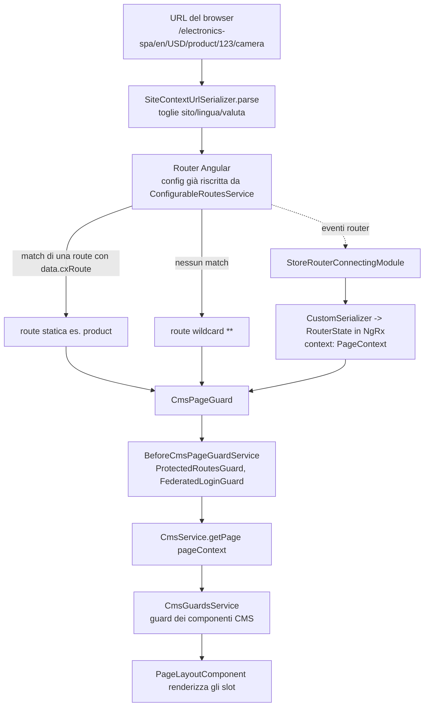

### Flusso passo-passo

1. Avvio: `RoutingModule.forRoot()` (core) registra un `APP_INITIALIZER` che chiama
   `ConfigurableRoutesService.init()`: le route Angular con `data.cxRoute` ricevono `path` o `matcher`
   presi dalla config.
2. Avvio: `CmsRouteModule` registra un altro `APP_INITIALIZER` (`addCmsRoute`) che aggiunge in coda la
   route `{ path: '**', canActivate: [CmsPageGuard], component: PageLayoutComponent }`.
3. Navigazione: il serializer toglie i parametri di site context, il Router fa il match.
4. `@ngrx/router-store` emette `ROUTER_NAVIGATION`: il `CustomSerializer` calcola il `PageContext`
   (es. `{ id: '123', type: ProductPage }`) e il reducer lo mette in `nextState`.
5. `CmsPageGuard` legge `getNextPageContext()`, carica la pagina CMS, esegue le guard dei componenti.
6. A navigazione completata (`ROUTER_NAVIGATED`) `nextState` diventa `state`, e viene emesso il
   `NavigationEvent`.

### Codice minimo riscritto a mano

```typescript
// Mini-modello mentale: nome di route -> path, poi link generati dal nome.
const routes: Record<string, { paths: string[] }> = {
  product: { paths: ['product/:productCode'] },
};

function linkTo(name: string, params: Record<string, string>): string {
  const path = routes[name].paths[0];
  return '/' + path
    .split('/')
    .map((seg) => (seg.startsWith(':') ? params[seg.slice(1)] : seg))
    .join('/');
}

linkTo('product', { productCode: '123' }); // "/product/123"
```

### Errori comuni

- Pensare che esista un file `app.routes.ts` con tutte le pagine: in Spartacus quasi tutte le pagine
  passano dalla route `**` e sono decise dal CMS.
- Cercare la libreria storefront in `core-libs/storefront/src/...`: la cartella `src` non esiste.

### Domande di autoverifica

1. Quali sono le due `APP_INITIALIZER` che modificano `router.config` all'avvio?
2. Perché lo stato del router viene salvato in NgRx invece di leggerlo solo da `ActivatedRoute`?

---

## 2. Routing configurabile

### In una frase

`RoutingConfig.routing.routes` è una mappa `nomeRoute → RouteConfig` (path, matcher, mapping dei
parametri, flag di protezione) che `ConfigurableRoutesService` applica alle route Angular marcate con
`data: { cxRoute: 'nome' }`.

### Il problema che risolve

Se il path fosse scritto direttamente nel `RouterModule.forChild`, cambiarlo richiederebbe di
sovrascrivere il modulo della libreria. Con un **nome** stabile (`product`, `cart`, `orderDetails`) il
path diventa un semplice valore di configurazione, sovrascrivibile con `provideConfig` come ogni altra
config di Spartacus (vedi `02-BOOTSTRAP-E-CONFIG.md`).

### Come è implementato (con path)

**`RoutingConfig`** — `core-libs/core/src/routing/configurable-routes/config/routing-config.ts`

```typescript
@Injectable({ providedIn: 'root', useExisting: Config })
export abstract class RoutingConfig {
  routing?: RoutingConfigDefinition;
}

export interface RoutingConfigDefinition {
  routes?: RoutesConfig;          // nomeRoute -> RouteConfig
  protected?: boolean;            // chiude TUTTO lo storefront agli anonimi
  loadStrategy?: RouteLoadStrategy; // 'once' | 'always' (ricarica dati CMS)
}
```

`RoutingConfig` usa il pattern "config token astratto" (`useExisting: Config`) e il `declare module`
per estendere l'interfaccia globale `Config`.

**`RouteConfig`** — `core-libs/core/src/routing/configurable-routes/routes-config.ts`

| Proprietà | Tipo | Significato |
|---|---|---|
| `paths` | `string[]` | Alias di path. Il **primo** "riempibile" genera i link; tutti servono per il match (se non ci sono `matchers`). |
| `matchers` | `(UrlMatcher \| InjectionToken<UrlMatcherFactory>)[]` | Matcher Angular o token di factory. Se presenti, sostituiscono `paths` per il match. |
| `paramsMapping` | `{ [paramName]: string }` | Mappa il nome del parametro nel path (`:productCode`) sulla proprietà dell'oggetto passato (`code`). |
| `disabled` | `boolean` | Disabilita il match (matcher "falsy") ma i link si possono ancora generare. |
| `protected` | `boolean` | Solo `false` conta: rende pubblica la route quando `routing.protected` è `true`. |
| `authFlow` | `boolean` | La pagina fa parte del flusso di login: dopo il login non si torna qui. |

**`RoutingConfigService`** — `core-libs/core/src/routing/configurable-routes/routing-config.service.ts`

- `getRouteConfig(routeName)`: ritorna la `RouteConfig`; in dev mode logga un warning se manca.
- `getLoadStrategy()`: default `RouteLoadStrategy.ALWAYS`.
- `getRouteName(path)`: lookup inverso path → nome, costruito pigramente in `initRouteNamesByPath()`;
  in dev mode segnala con `logger.error` se lo stesso path è usato da due nomi.

**`ConfigurableRoutesService`** — `core-libs/core/src/routing/configurable-routes/configurable-routes.service.ts`

- `init()`: idempotente (flag `initCalled`), chiama `configure()`.
- `configure()`: prende il `Router` dall'`Injector` (non dal costruttore, per evitare la dipendenza
  ciclica con `APP_INITIALIZER`) e chiama `router.resetConfig(this.configureRoutes(router.config))`.
- `configureRoutes()`: ricorsivo sui `children`.
- `configureRoute(route)`: legge `route.data.cxRoute` e applica una di quattro regole.

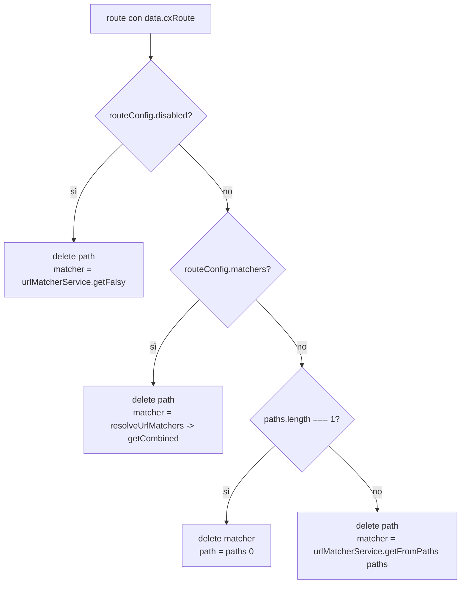

La registrazione avviene in `core-libs/core/src/routing/routing.module.ts`:

```typescript
provideAppInitializer(() =>
  initConfigurableRoutes(inject(ConfigurableRoutesService))()
),
```

Le route "con nome" nelle librerie sono dichiarate con `path: null` e `// @ts-ignore`, perché il path
reale arriverà dalla config. Esempio reale in
`core-libs/storefront/cms-pages/product-details-page/product-details-page.module.ts`
(`ProductDetailsPageModule`):

```typescript
RouterModule.forChild([
  {
    // @ts-ignore
    path: null,
    canActivate: [CmsPageGuard],
    component: PageLayoutComponent,
    data: { cxRoute: 'product' },
  },
]),
```

**Config di default.** Il nome richiesto nel compito, `defaultStorefrontRoutesConfig`, **non esiste nel
codice** di questa versione (NON VERIFICATO NEL CODICE come simbolo). La config di default dello
storefront è la factory `defaultRoutesConfigFactory` in
`core-libs/storefront/cms-structure/routing/default-routing-config.ts`, registrata con
`provideDefaultConfigFactory(defaultRoutesConfigFactory)` in `RoutingModule.forRoot()` di
`core-libs/storefront/cms-structure/routing/routing.module.ts`. È una **factory** perché legge i
`FeatureToggles` con `inject()`: ad esempio il path di `login` diventa `sign-in` se
`authorizationCodeFlowByDefault` è attivo, e in quel caso viene aggiunta anche la route `loginForm`
(`login`) e, con `oauthCallbackPage` + `asyncAuthConfigInitializer`, la route `oAuthCallback`.

Ogni feature-lib aggiunge le proprie route con `provideDefaultConfig`, ad esempio:

- `feature-libs/cart/base/root/config/default-cart-routing-config.ts` → `cart`
- `feature-libs/checkout/base/root/config/default-checkout-routing-config.ts` → `defaultCheckoutRoutingConfig`
- `feature-libs/order/root/config/default-order-routing-config.ts` → `orders`, `orderDetails`, ...
- `feature-libs/storefinder/root/config/default-store-finder-routing-config.ts` → `storeFinder*`

Le config si fondono con deep merge (meccanismo generale descritto in `02-BOOTSTRAP-E-CONFIG.md`).
La tabella completa è nella [sezione 14](#14-tabella-route-name--path).

**Protezione "secure portal".** In `routing.module.ts` la funzione `initSecurePortalConfig` registra
`SecurePortalConfigInitializer`
(`core-libs/core/src/routing/configurable-routes/secure-portal-config/secure-portal-config-initializer.ts`)
**solo se** `routing.protected` non è definito in config. L'initializer legge il `BaseSite` dal
backend e imposta `routing.protected = baseSite.requiresAuthentication` (scope `['routing']`).

### Flusso passo-passo

1. Le librerie dichiarano route Angular con `data.cxRoute` e `path: null`.
2. Le librerie e l'app forniscono config `routing.routes.<nome>`.
3. All'avvio, `ConfigurableRoutesService.init()` visita `router.config` e riscrive ogni route con nome.
4. Il Router di Angular lavora poi con route "normali" (`path` o `matcher`).

### Codice minimo riscritto a mano

```typescript
import { APP_INITIALIZER, inject, Injectable, Injector } from '@angular/core';
import { Route, Router, Routes, UrlMatcher, UrlSegment } from '@angular/router';

interface MyRouteConfig { paths?: string[]; disabled?: boolean }
const MY_ROUTING: Record<string, MyRouteConfig> = {
  product: { paths: ['p/:productCode/:name', 'p/:productCode'] },
  cart: { paths: ['cart'] },
};

function matcherFromPaths(paths: string[]): UrlMatcher {
  return (segments: UrlSegment[]) => {
    for (const path of paths) {
      const parts = path.split('/');
      if (parts.length > segments.length) continue;
      const posParams: Record<string, UrlSegment> = {};
      const ok = parts.every((p, i) =>
        p.startsWith(':') ? ((posParams[p.slice(1)] = segments[i]), true) : p === segments[i].path
      );
      if (ok) return { consumed: segments.slice(0, parts.length), posParams };
    }
    return null;
  };
}

@Injectable({ providedIn: 'root' })
export class MyConfigurableRoutes {
  private injector = inject(Injector);
  init(): void {
    const router = this.injector.get(Router); // evita il ciclo con APP_INITIALIZER
    router.resetConfig(this.configure(router.config));
  }
  private configure(routes: Routes): Routes {
    return routes.map((route) => {
      const r: Route = { ...route };
      if (r.children) r.children = this.configure(r.children);
      const name = r.data?.['cxRoute'];
      const cfg = name && MY_ROUTING[name];
      if (!cfg) return r;
      delete r.path;
      if (cfg.disabled) return { ...r, matcher: () => null };
      if (cfg.paths?.length === 1) { delete r.matcher; return { ...r, path: cfg.paths[0] }; }
      return { ...r, matcher: matcherFromPaths(cfg.paths ?? []) };
    });
  }
}

export const myRoutingInit = {
  provide: APP_INITIALIZER,
  multi: true,
  useFactory: () => { const s = inject(MyConfigurableRoutes); return () => s.init(); },
};
```

### Errori comuni

- **Dimenticare `paths`**: in dev mode `ConfigurableRoutesService.validateRouteConfig` avvisa
  "Could not configure the named route ...". Attenzione: `paths: null` o `routeConfig === null` sono
  invece considerati uno "spegnimento" voluto e non generano warning.
- **Mettere `protected: true` su una singola route** sperando di proteggerla: il flag individuale conta
  solo quando vale `false` (vedi `ProtectedRoutesService.getNonProtectedPaths`). Per proteggere una
  singola pagina si usa `AuthGuard`.
- **Stesso path per due nomi**: `RoutingConfigService.initRouteNamesByPath` logga un errore e l'ultimo
  vince nel lookup inverso.
- **Aggiungere route a runtime dopo `init()`**: `init()` gira una volta sola (`initCalled`); route
  aggiunte dopo con `data.cxRoute` non vengono riscritte.

### Domande di autoverifica

1. Una route con `paths: ['cart']` finisce con `path` o con `matcher`? E con due paths?
2. Cosa succede se in config metto `product: { matchers: [...] }` e anche `paths`?
3. Perché `defaultRoutesConfigFactory` è una factory e non un oggetto costante?
4. In quale caso `SecurePortalConfigInitializer` **non** viene registrato?

---

## 3. Link semantici

### In una frase

Invece di scrivere `'/product/123'` si scrive `{ cxRoute: 'product', params: { code: '123' } }`:
`SemanticPathService.transform()` traduce questo "comando URL" nell'array di segmenti che il router
di Angular capisce, usando la config della sezione 2.

### Il problema che risolve

Se un componente costruisce a mano `'/product/' + code`, la personalizzazione del path in config
romperebbe tutti i link. Con i link semantici **l'unica fonte di verità dei path è la config**:
cambiando `paths` cambiano sia il match sia tutti i link generati.

### Come è implementato (con path)

**Tipi `UrlCommands`** — `core-libs/core/src/routing/configurable-routes/url-translation/url-command.ts`

```typescript
export interface UrlCommandRoute {
  cxRoute?: string;
  params?: { [param: string]: any };
}
export type UrlCommand = UrlCommandRoute | any;
export type UrlCommands = UrlCommand | UrlCommand[];
```

**`SemanticPathService`** — `core-libs/core/src/routing/configurable-routes/url-translation/semantic-path.service.ts`

- `get(routeName)`: ritorna `'/' + paths[0]` (senza riempire parametri). Usato dalle guard per
  redirigere: `semanticPathService.get('login')`, `get('home')`, `get('notFound')`.
- `transform(commands)`:
  1. se `commands` non è un array lo avvolge in un array;
  2. le stringhe passano invariate;
  3. gli oggetti con `cxRoute` sono tradotti da `generateUrlPart()`;
  4. se un comando semantico non è traducibile (route sconosciuta, senza `paths`, parametri mancanti)
     **l'intero risultato diventa `ROOT_URL = ['/']`**;
  5. se il primo comando è semantico, antepone `'/'` (URL assoluto).
- `findPathWithFillableParams()`: sceglie il **primo** alias di `paths` di cui sono disponibili tutti i
  parametri (dopo il mapping). Per questo in `product` l'ordine è
  `['product/:productCode/:name', 'product/:productCode']`: se il prodotto ha `name` si usa l'URL più
  ricco, altrimenti il più corto.
- `provideParamsValues()`: sostituisce `:param` con `params[paramsMapping[param] ?? param]`.
- I segmenti del path sono estratti da `UrlParsingService.getPrimarySegments()`
  (`core-libs/core/src/routing/configurable-routes/url-translation/url-parsing.service.ts`), che usa
  `router.parseUrl()`; le utility `isParam` / `getParamName` sono in `path-utils.ts` della stessa cartella.

**`UrlPipe`** — `core-libs/core/src/routing/configurable-routes/url-translation/url.pipe.ts`

```typescript
@Pipe({ name: 'cxUrl' })
export class UrlPipe implements PipeTransform {
  constructor(private urlService: SemanticPathService) {}
  transform(commands: UrlCommands): any[] {
    return this.urlService.transform(commands);
  }
}
```

La pipe è standalone (default Angular ≥ 19) ed è esportata da `UrlModule`
(`core-libs/core/src/routing/configurable-routes/url-translation/url.module.ts`) insieme a
`ProductURLPipe` (`cxProductUrl`, file `product-url.pipe.ts`), che è una scorciatoia per
`{ cxRoute: 'product', params: product }`. Uso reale in template:
`core-libs/storefront/cms-components/myaccount/my-interests/my-interests.component.html`
→ `{ cxRoute: 'product', params: product } | cxUrl`.

**`UrlTranslationService`**: nel codice di questa versione **non esiste** una classe con questo nome
(NON VERIFICATO NEL CODICE). La traduzione dei link è interamente in `SemanticPathService`
(nelle versioni molto vecchie di Spartacus esisteva un servizio di traduzione separato; qui è stato
sostituito).

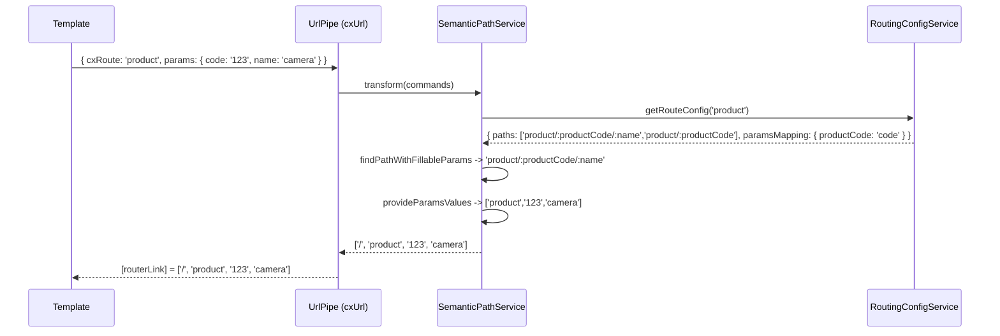

### Flusso passo-passo

1. Il componente passa un `UrlCommands` a `cxUrl` (template) o a `RoutingService.go()` (TypeScript).
2. `SemanticPathService.transform` legge la `RouteConfig` del nome.
3. Sceglie il primo path con tutti i parametri riempibili.
4. Sostituisce i parametri usando `paramsMapping`.
5. Restituisce un array di comandi per `routerLink` / `router.navigate`.
6. Al momento della serializzazione, `SiteContextUrlSerializer` aggiunge `/<sito>/<lingua>/<valuta>`
   (sezione 10): **il link semantico non contiene mai il prefisso di site context**.

### Codice minimo riscritto a mano

```typescript
import { Pipe, PipeTransform, inject, Injectable } from '@angular/core';

interface Cmd { cxRoute?: string; params?: Record<string, any> }
type RouteCfg = { paths?: string[]; paramsMapping?: Record<string, string> };

@Injectable({ providedIn: 'root' })
export class MySemanticPath {
  private routes: Record<string, RouteCfg> = {
    product: {
      paths: ['product/:productCode/:name', 'product/:productCode'],
      paramsMapping: { productCode: 'code' },
    },
  };

  transform(commands: Cmd | any[]): any[] {
    const list = Array.isArray(commands) ? commands : [commands];
    const out: any[] = [];
    for (const c of list) {
      if (!c?.cxRoute) { out.push(c); continue; }
      const cfg = this.routes[c.cxRoute];
      const map = (p: string) => cfg?.paramsMapping?.[p] ?? p;
      const path = cfg?.paths?.find((pt) =>
        pt.split('/').filter((s) => s.startsWith(':'))
          .every((s) => c.params?.[map(s.slice(1))] !== undefined)
      );
      if (!path) return ['/']; // come ROOT_URL
      out.push(...path.split('/').map((s) => (s.startsWith(':') ? c.params[map(s.slice(1))] : s)));
    }
    if (list[0]?.cxRoute) out.unshift('/');
    return out;
  }
}

@Pipe({ name: 'myUrl' })
export class MyUrlPipe implements PipeTransform {
  private s = inject(MySemanticPath);
  transform(c: Cmd | any[]) { return this.s.transform(c); }
}
// <a [routerLink]="{ cxRoute: 'product', params: product } | myUrl">...</a>
```

### Errori comuni

- **Parametro mancante → link alla home**: se nessun alias è riempibile, `transform` ritorna `['/']`
  senza errori. Un link che "porta alla home" è quasi sempre un `params` incompleto o un
  `paramsMapping` sbagliato.
- **Confondere `paramsMapping`**: la chiave è il nome nel path (`productCode`), il valore è la
  proprietà dell'oggetto (`code`). Nell'app demo
  (`projects/storefrontapp/src/app/private/private.providers.ts`) si usa `paramsMapping: { name: 'slug' }`.
- **Usare `get()` quando servono parametri**: `get('orderDetails')` ritorna
  `'/my-account/order/:orderCode'` letterale, con il `:` dentro.
- **Mescolare stringhe e comandi**: `['/', { cxRoute: 'cart' }]` produce un URL non assoluto dal punto
  di vista di `shouldOutputAbsolute` (il primo elemento non è un comando semantico); funziona solo
  perché la stringa `'/'` è già assoluta.

### Domande di autoverifica

1. Che cosa ritorna `transform({ cxRoute: 'product', params: { code: '1' } })` con la config di default?
2. Perché l'ordine degli alias in `paths` è importante per la generazione dei link ma non per il match?
3. Dove viene aggiunto il prefisso `/electronics-spa/en/USD`?

---

## 4. Facade di navigazione

### In una frase

`RoutingService` è la facade unica per navigare (`go`, `goByUrl`, `back`, `forward`) e per leggere lo
stato del router (`getRouterState`, `getPageContext`, `getParams`, `isNavigating`), mentre
`RoutingParamsService` fornisce i parametri di **tutte** le route attive fuse insieme.

### Il problema che risolve

Componenti e servizi non dovrebbero dipendere direttamente da `Router`, `Store` e `Location`:
la facade nasconde tre API diverse, applica sempre la traduzione semantica e fornisce Observable
comodi (per esempio il `PageContext` usato dal CMS).

### Come è implementato (con path)

**`RoutingService`** — `core-libs/core/src/routing/facade/routing.service.ts`

| Metodo | Cosa fa davvero |
|---|---|
| `getParams()` | delega a `RoutingParamsService.getParams()` |
| `getRouterState()` | `store.select(RoutingSelector.getRouterState)` |
| `getPageContext()` | `select(RoutingSelector.getPageContext)` (contesto della pagina **attuale**) |
| `getNextPageContext()` | contesto della navigazione **in corso** (`nextState`) |
| `changeNextPageContext(ctx)` | dispatch di `RoutingActions.ChangeNextPageContext` |
| `isNavigating()` | `true` se esiste `nextState.context` |
| `go(commands, extras?)` | `semanticPathService.transform` + `router.navigate` |
| `getUrl(commands, extras?)` | `router.serializeUrl(router.createUrlTree(...))`, garantisce lo `/` iniziale |
| `getFullUrl(commands, extras?)` | `winRef.location.origin + getUrl(...)` |
| `goByUrl(url, extras?)` | `router.navigateByUrl(url, extras)` (nessuna traduzione semantica) |
| `back()` | `location.back()` solo se `document.referrer` è dello stesso origin, altrimenti `go(['/'])` |
| `forward()` | `location.forward()` |

Il metodo `navigate()` richiesto nel compito esiste ma è **`protected`**: è il punto di estensione
usato da `go()` (`return this.router.navigate(path, extras)`), non un'API pubblica.

**`RoutingParamsService`** — `core-libs/core/src/routing/facade/routing-params.service.ts`

```typescript
protected readonly params$ = this.activatedRoutesService.routes$.pipe(
  map((routes) => this.findAllParam(routes)),       // Object.assign({}, ...routes.map(r => r.params))
  shareReplay({ refCount: true, bufferSize: 1 })
);
```

**`ActivatedRoutesService`** — `core-libs/core/src/routing/services/activated-routes.service.ts`:
a ogni `NavigationEnd` (più un `startWith(undefined)` iniziale) percorre
`router.routerState.snapshot.root → firstChild → ...` e restituisce l'array delle snapshot dalla root
alla foglia.

### Flusso passo-passo

1. `routingService.go({ cxRoute: 'cart' })` → `SemanticPathService.transform` → `['/', 'cart']`.
2. `router.navigate(['/', 'cart'])` → `SiteContextUrlSerializer.serialize` aggiunge il prefisso.
3. Guard, resolver e `CustomSerializer` producono il nuovo `RouterState` in NgRx.
4. A `NavigationEnd`, `ActivatedRoutesService.routes$` emette e `getParams()` produce i parametri fusi.

### Codice minimo riscritto a mano

```typescript
import { Component, inject } from '@angular/core';
import { AsyncPipe, JsonPipe } from '@angular/common';
import { RoutingService } from '@spartacus/core';

@Component({
  selector: 'app-go-to-order',
  imports: [AsyncPipe, JsonPipe],
  template: `
    <pre>{{ params$ | async | json }}</pre>
    <pre>{{ context$ | async | json }}</pre>
    <button (click)="open('00001234')">Apri ordine</button>
    <button (click)="routing.back()">Indietro</button>
  `,
})
export class GoToOrderComponent {
  protected routing = inject(RoutingService);
  params$ = this.routing.getParams();          // es. { orderCode: '00001234' }
  context$ = this.routing.getPageContext();    // es. { id: '/my-account/order', type: 'ContentPage' }

  open(code: string) {
    // paths: ['my-account/order/:orderCode'], paramsMapping: { orderCode: 'code' }
    this.routing.go({ cxRoute: 'orderDetails', params: { code } }, { queryParams: { tab: 'items' } });
  }
}
```

### Errori comuni

- **Usare `goByUrl` con un URL che contiene già `/electronics-spa/en/USD`**: funziona perché il
  serializer ri-estrae il contesto, ma `go` con un comando semantico è più robusto.
- **Aspettarsi i params nel costruttore prima della prima navigazione**: `routes$` emette subito grazie
  a `startWith`, ma la snapshot può ancora essere la root vuota.
- **Confondere `getPageContext` e `getNextPageContext`**: nelle guard la pagina "attuale" è ancora
  quella vecchia; `CmsPageGuard` infatti usa `getNextPageContext()`.
- **`back()` su una pagina aperta da link esterno**: porta alla home, non fuori dal sito (by design).

### Domande di autoverifica

1. Perché `getParams()` fonde i parametri di tutte le route attive e non solo della foglia?
2. Quando `isNavigating()` emette `true`?
3. Qual è la differenza tra `getUrl` e `getFullUrl`?

---

## 5. URL matcher

### In una frase

`UrlMatcherService` costruisce `UrlMatcher` di Angular (da path, combinati, opposti, glob, "falsy") e
le `UrlMatcherFactory` (funzioni `route → UrlMatcher` fornite via `InjectionToken`) permettono di
aggiungere pattern speciali come `**/p/:productCode` per la pagina prodotto.

### Il problema che risolve

La sintassi `path` di Angular accetta un solo pattern per route e non supporta pattern "greedy" come
"qualsiasi cosa, poi `/p/`, poi il codice". Gli URL SEO di SAP Commerce (es.
`/Open-Catalogue/Cameras/Digital-Cameras/c/575` o `/Cameras/Sony/p/1234`) hanno bisogno di questo.

### Come è implementato (con path)

**`UrlMatcherService`** — `core-libs/core/src/routing/services/url-matcher.service.ts`

| Metodo | Ritorna |
|---|---|
| `getFalsy()` | matcher che ritorna sempre `null` (usato per `disabled: true`) |
| `getFromPaths(paths)` | `getCombined(paths.map(getFromPath))` |
| `getCombined(matchers)` | primo matcher che dà risultato non nullo |
| `getFromPath(path)` (protected) | reimplementazione del match di Angular con `:param` e `pathMatch: 'full'` |
| `getOpposite(matcher)` | match quando l'originale **non** fa match (consuma tutto) |
| `getFromGlob(patterns)` | match con pattern glob tramite `GlobService` |

In dev mode ogni matcher riceve proprietà di debug (`_path`, `_paths`, `_matchers`,
`_originalMatcher`, `_globPatterns`) utili per ispezionare `router.config` nella console.

**`UrlMatcherFactory`** — `core-libs/core/src/routing/url-matcher/url-matcher-factory.ts`:
`export type UrlMatcherFactory = (route: Route) => UrlMatcher;`

**`DEFAULT_URL_MATCHER`** — `core-libs/core/src/routing/url-matcher/default-url-matcher.ts`: token con
factory `getDefaultUrlMatcherFactory` che legge `route.data.cxRoute`, prende i `paths` dalla config e
chiama `urlMatcherService.getFromPaths(paths)`.

**Matcher PDP** — `core-libs/storefront/cms-pages/product-details-page/product-details-url-matcher.ts`:

```typescript
export function getProductDetailsUrlMatcherFactory(service, defaultMatcherFactory) {
  return (route: Route) => {
    const defaultMatcher = defaultMatcherFactory(route);             // i "paths" configurati
    const suffixPDPMatcher = getSuffixUrlMatcher({ marker: 'p', paramName: 'productCode' });
    return service.getCombined([defaultMatcher, suffixPDPMatcher]);
  };
}
export const PRODUCT_DETAILS_URL_MATCHER = new InjectionToken<UrlMatcherFactory>(
  'PRODUCT_DETAILS_URL_MATCHER', { providedIn: 'root', factory: () =>
    getProductDetailsUrlMatcherFactory(inject(UrlMatcherService), inject(DEFAULT_URL_MATCHER)) });
```

Il modulo `ProductDetailsPageModule` configura `routing.routes.product.matchers =
[PRODUCT_DETAILS_URL_MATCHER]`. Analogamente `PRODUCT_LISTING_URL_MATCHER`
(`core-libs/storefront/cms-pages/product-listing-page/product-listing-url-matcher.ts`) usa
`marker: 'c'`, `paramName: 'categoryCode'` per la route `category` in `ProductListingPageModule`.

**`getSuffixUrlMatcher`** — `core-libs/storefront/cms-structure/routing/suffix-routes/suffix-url-matcher.ts`:
cerca l'**ultima** occorrenza del segmento marker (`findLastIndex`); se esiste e non è l'ultimo
segmento, `posParams[paramName] = segments[markerIndex + 1]` e i segmenti precedenti diventano
`param0`, `param1`, ... (`precedingParamName` di default `'param'`).

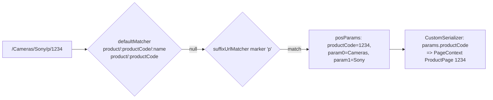

### Flusso passo-passo

1. La config `product.matchers` contiene un token.
2. `ConfigurableRoutesService.resolveUrlMatchers` vede che non è una funzione e chiama
   `resolveUrlMatcherFactory` → `injector.get(token)(route)`.
3. Il matcher combinato è assegnato alla route (`delete route.path`).
4. Il router chiama il matcher sui segmenti; `posParams` diventano `route.params`.

### Codice minimo riscritto a mano

```typescript
import { inject, InjectionToken } from '@angular/core';
import { Route, UrlSegment } from '@angular/router';
import {
  DEFAULT_URL_MATCHER, provideConfig, RoutingConfig, UrlMatcherFactory, UrlMatcherService,
} from '@spartacus/core';

// Matcher: ".../sku-<code>" come ultima parte dell'URL
export const SKU_MATCHER = new InjectionToken<UrlMatcherFactory>('SKU_MATCHER', {
  providedIn: 'root',
  factory: () => {
    const service = inject(UrlMatcherService);
    const defaultFactory = inject(DEFAULT_URL_MATCHER);
    return (route: Route) =>
      service.getCombined([
        defaultFactory(route),
        (segments: UrlSegment[]) => {
          const last = segments[segments.length - 1];
          const m = last?.path.match(/^sku-(.+)$/);
          return m
            ? { consumed: segments, posParams: { productCode: new UrlSegment(m[1], {}) } }
            : null;
        },
      ]);
  },
});

export const skuRoutingProvider = provideConfig(<RoutingConfig>{
  routing: { routes: { product: { matchers: [SKU_MATCHER] } } },
});
```

### Errori comuni

- **Sostituire i matcher perdendo i `paths`**: se si configura `matchers: [mioMatcher]` senza includere
  `DEFAULT_URL_MATCHER`, i `paths` non servono più per il match (servono ancora per i link).
- **Matcher troppo greedy**: un matcher che consuma tutti i segmenti per URL generici può "rubare" le
  pagine CMS alla route `**`.
- **Dimenticare che l'ordine conta**: `getCombined` restituisce il primo risultato non nullo.
- **Parametro con nome diverso da `productCode`**: il `CustomSerializer` riconosce la pagina prodotto
  solo da `params['productCode']` (sezione 11).

### Domande di autoverifica

1. In quale metodo il token di una `UrlMatcherFactory` viene risolto in un `UrlMatcher`?
2. Quali `posParams` produce il suffix matcher per `/a/b/c/575`?
3. Perché `disabled: true` usa un matcher "falsy" invece di rimuovere la route?

---

## 6. Route wildcard e CmsPageGuard

### In una frase

Una route `{ path: '**', canActivate: [CmsPageGuard], component: PageLayoutComponent }` aggiunta in
coda al router cattura ogni URL non gestito; `CmsPageGuard` chiede al CMS la pagina che corrisponde al
`PageContext` e, se non esiste, mostra la pagina `notFound`.

### Il problema che risolve

Le pagine di contenuto (`/faq`, `/contact`, `/my-account/address-book`, `/checkout/delivery-address`)
sono create dai merchandiser nel backoffice: lo storefront non può avere una route Angular per ognuna.
Una route jolly unita a una guard che interroga il CMS risolve il problema e gestisce anche il 404.

### Come è implementato (con path)

**Aggiunta della route `**`** — `core-libs/storefront/cms-structure/routing/cms-route/add-cms-route.ts`:

```typescript
const cmsRoute: Route = { path: '**', canActivate: [CmsPageGuard], component: PageLayoutComponent };

export function addCmsRoute(injector: Injector): () => void {
  return () => {
    const router = injector.get(Router); // non via deps[] per il ciclo con APP_INITIALIZER
    router.config.push(cmsRoute);
  };
}
```

È registrata come `APP_INITIALIZER` in `CmsRouteModule`
(`core-libs/storefront/cms-structure/routing/cms-route/cms-route.module.ts`), importato dal
`RoutingModule` dello storefront. Usa `push`: la wildcard è sempre **l'ultima** route di primo livello.

**`CmsPageGuard`** — `core-libs/storefront/cms-structure/guards/cms-page.guard.ts`:

```typescript
export class CmsPageGuard {
  static guardName = 'CmsPageGuard';   // usato dal CustomSerializer per riconoscere le route CMS
  canActivate(route, state) {
    return this.beforeCmsPageGuardService.canActivate(route, state).pipe(
      switchMap((canActivate) => canActivate === true
        ? this.routingService.getNextPageContext().pipe(
            filter(isNotUndefined), take(1),
            switchMap((pageContext) =>
              this.cmsService.getPage(pageContext, this.shouldReload()).pipe(first(),
                switchMap((pageData) => pageData
                  ? this.service.canActivatePage(pageContext, pageData, route, state)
                  : this.service.canActivateNotFoundPage(pageContext, route, state)))))
        : of(canActivate)));
  }
  private shouldReload() { return this.routingConfig.getLoadStrategy() !== RouteLoadStrategy.ONCE; }
}
```

**`BeforeCmsPageGuardService`** — `core-libs/storefront/cms-structure/guards/before-cms-page-guard.service.ts`:
esegue in sequenza le guard registrate nel token multi `BEFORE_CMS_PAGE_GUARD`
(`before-cms-page-guard.token.ts`, default `[]`) tramite `GuardsComposer`
(`core-libs/storefront/cms-structure/services/guards-composer.ts`). Il `RoutingModule.forRoot()` dello
storefront vi registra `ProtectedRoutesGuard` e `FederatedLoginGuard`. Quindi la protezione "secure
portal" viene valutata **prima** di scaricare la pagina CMS.

**`GuardsComposer.composeCanActivateObservables`**:
`concat(...guards).pipe(skipWhile(r => r === true), endWith(true), first())` → le guard girano in
sequenza, la prima che non ritorna `true` (es. `false` o un `UrlTree`) vince; se tutte ritornano `true`
il risultato è `true`.

**`CmsPageGuardService`** — `core-libs/storefront/cms-structure/guards/cms-page-guard.service.ts`:

- `canActivatePage()`: prende i tipi di componenti della pagina (`cmsService.getPageComponentTypes`),
  risolve i mapping (`CmsComponentsService.determineMappings`, che può caricare moduli lazy), esegue
  le guard dei componenti (`CmsGuardsService.cmsPageCanActivate`), carica le chiavi i18n
  (`CmsI18nService.loadForComponents`) e infine, se la route non è già una route CMS generata
  (`!route.data.cxCmsRouteContext`), chiama `CmsRoutesService.handleCmsRoutesInGuard()` (sezione 7).
- `canActivateNotFoundPage()`: legge `semanticPathService.get('notFound')` (default `/not-found`),
  carica quella pagina CMS, imposta `cmsService.setPageFailIndex(pageContext, notFoundIndex)` e
  `routing.changeNextPageContext(notFoundCmsPageContext)`; l'URL nel browser **resta quello originale**
  ma viene renderizzata la pagina 404.

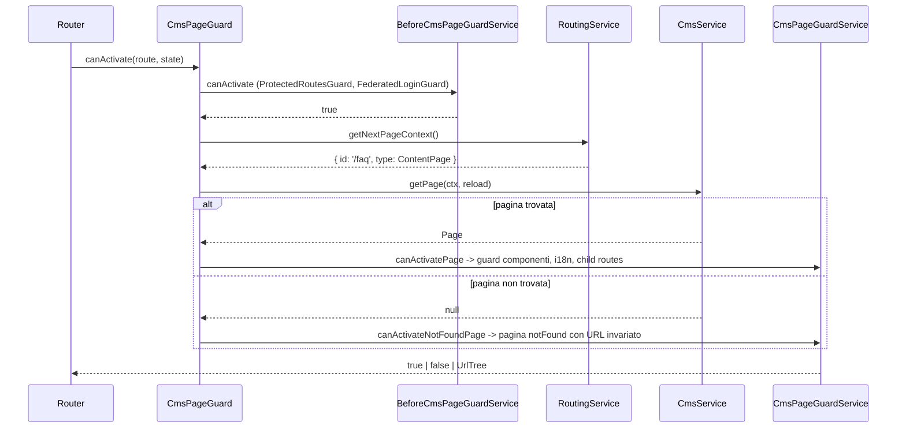

### Flusso passo-passo

1. URL `/faq`: nessuna route con nome fa match → vince `**`.
2. `ROUTER_NAVIGATION` è già stato emesso: nel reducer `nextState.context = { id: '/faq', type: ContentPage }`.
3. `CmsPageGuard` esegue prima le "before" guard, poi carica la pagina CMS.
4. Se la pagina ha componenti con `guards`, vengono eseguite; se hanno `childRoutes`, la config del
   router può essere estesa e la navigazione ripetuta.
5. `PageLayoutComponent` legge la pagina dallo store CMS e disegna gli slot (vedi `04-CMS-DRIVEN-UI.md`).

### Codice minimo riscritto a mano

```typescript
import { inject, Injectable } from '@angular/core';
import { CanActivateFn, Router, Routes } from '@angular/router';
import { Observable, of } from 'rxjs';
import { map } from 'rxjs/operators';

@Injectable({ providedIn: 'root' })
export class FakeCms {
  private pages: Record<string, { title: string }> = { '/faq': { title: 'FAQ' } };
  getPage(id: string): Observable<{ title: string } | null> { return of(this.pages[id] ?? null); }
}

export const myCmsPageGuard: CanActivateFn = (_route, state) => {
  const cms = inject(FakeCms);
  const router = inject(Router);
  const id = state.url.split('?')[0] || '/';
  return cms.getPage(id).pipe(
    // Spartacus NON cambia URL per il 404: renderizza la pagina notFound. Qui semplifichiamo.
    map((page) => (page ? true : router.parseUrl('/not-found')))
  );
};

export const routes: Routes = [
  // ...route con nome prima...
  { path: '**', canActivate: [myCmsPageGuard], loadComponent: () => import('./page-layout') },
];
```

### Errori comuni

- **Aggiungere una propria route `**`** nell'app: essendo `push`-ata da `addCmsRoute` a init, quella di
  Spartacus sarà comunque in fondo, ma una wildcard dell'app dichiarata prima "ruberebbe" tutte le pagine.
- **Aspettarsi un redirect a `/not-found`**: l'URL resta invariato; solo la pagina renderizzata cambia.
- **Registrare una "before guard" che non emette**: `GuardsComposer` usa `first()`, quindi una guard che
  non emette blocca la navigazione.
- **Confondere `loadStrategy: 'once'`** con la cache HTTP: incide su `cmsService.getPage(ctx, reload)`.

### Domande di autoverifica

1. Perché `addCmsRoute` prende il `Router` dall'`Injector` e non da `deps`?
2. Chi fornisce a `CmsPageGuard` il `PageContext` e perché è quello "next"?
3. In che ordine girano `ProtectedRoutesGuard` e il caricamento della pagina CMS?

---

## 7. Guard dei componenti CMS e child routes

### In una frase

Un componente CMS può dichiarare nella sua mappatura `cmsComponents` delle `guards` (eseguite quando la
pagina che lo contiene viene attivata) e delle `childRoutes` (sotto-rotte Angular create **dinamicamente**
sotto il path della pagina CMS).

### Il problema che risolve

Le pagine del checkout o dello store finder sono pagine CMS: non hanno una route Angular statica su cui
mettere `canActivate` o `children`. Spartacus sposta queste responsabilità sul **componente**:
"se nella pagina c'è `CheckoutOrchestrator`, allora esegui `CheckoutGuard`".

### Come è implementato (con path)

**Config** — `core-libs/core/src/cms/config/cms-config.ts`, interfaccia `CmsComponentMapping`:

```typescript
childRoutes?: Route[] | CmsComponentChildRoutesConfig; // { parent?: { data }, children?: Route[] }
guards?: any[];
```

**Lettura delle guard** — `core-libs/storefront/cms-structure/services/cms-components.service.ts`,
`CmsComponentsService.getGuards(componentTypes)`: unisce in un `Set` (quindi senza duplicati) le guard
di tutti i tipi di componente della pagina.

**`CmsGuardsService`** — `core-libs/storefront/cms-structure/services/cms-guards.service.ts`,
`cmsPageCanActivate(componentTypes, route, state)`: per ogni classe di guard ottiene l'istanza con
`UnifiedInjector` (che cerca anche negli injector dei moduli lazy) e la passa a
`GuardsComposer.canActivate()` (esecuzione in sequenza, vince il primo risultato diverso da `true`).

**`CmsRoutesService`** — `core-libs/storefront/cms-structure/services/cms-routes.service.ts`: classe
astratta pubblica con `useExisting: CmsRoutesImplService`. L'implementazione è in
`core-libs/storefront/cms-structure/services/cms-routes-impl.service.ts`:

- `handleCmsRoutesInGuard(pageContext, componentTypes, currentUrl, currentPageLabel)`:
  1. se esiste già una route con `data.cxCmsRouteContext` e `path === pageLabel` → `true`;
  2. altrimenti legge `cmsComponentsService.getChildRoutes(componentTypes)`;
  3. se ci sono `children`, `updateRouting()` crea una nuova route
     `{ path: pageLabel senza '/', component: PageLayoutComponent, children, data: { ...parent.data, cxCmsRouteContext } }`,
     la mette **in testa** con `router.resetConfig([newRoute, ...router.config])`,
     poi `router.navigateByUrl(currentUrl)` e ritorna `false` (annulla la navigazione corrente per rifarla
     con la nuova config).
- `updateRouting` funziona solo per `PageType.CONTENT_PAGE` con label che inizia con `/`.
- `wrapCmsGuardsRecursively` avvolge le guard delle child routes in funzioni che risolvono le istanze
  via `UnifiedInjector` (per supportare guard provenienti da moduli lazy).

**Pulizia** — `core-libs/core/src/routing/store/effects/router.effect.ts`, `RouterEffects.clearCmsRoutes$`:
su `LANGUAGE_CHANGE`, `LOGOUT` e `LOGIN` rimuove dal router tutte le route con `data.cxCmsRouteContext`
(perché le label delle pagine possono cambiare con lingua/utente).

Esempio reale di `childRoutes`: `feature-libs/storefinder/components/store-finder-components.module.ts`
(componente `StoreFinderComponent` con figli `find`, `view-all`, `country/:country`, ...).

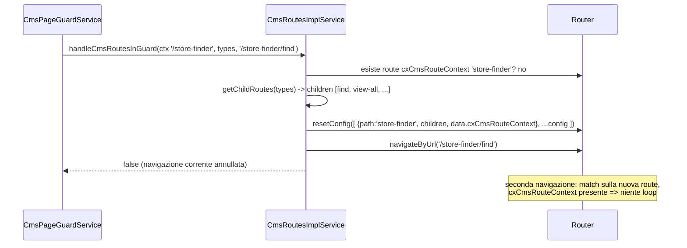

### Flusso passo-passo

1. Il CMS restituisce la pagina `/store-finder` con il componente `StoreFinderComponent`.
2. `CmsPageGuardService.canActivatePage` esegue le guard dei componenti.
3. Poiché la route attiva è la `**` (senza `cxCmsRouteContext`), chiama `handleCmsRoutesInGuard`.
4. Viene generata la route `store-finder` con i figli, e la navigazione riparte.
5. Alla seconda navigazione la route generata ha `data.cxCmsRouteContext`: il `CustomSerializer` usa quel
   contesto e la guard non rigenera nulla.

### Codice minimo riscritto a mano

```typescript
import { inject, Injectable, NgModule } from '@angular/core';
import { Router } from '@angular/router';
import { CmsConfig, provideDefaultConfig, AuthService } from '@spartacus/core';
import { map } from 'rxjs/operators';
import { WishlistBoxComponent, WishlistDetailComponent } from './wishlist.components';

@Injectable({ providedIn: 'root' })
export class LoggedInOnlyGuard {
  private auth = inject(AuthService);
  private router = inject(Router);
  canActivate() {
    return this.auth.isUserLoggedIn().pipe(
      map((ok) => ok || this.router.parseUrl('/login'))
    );
  }
}

@NgModule({
  providers: [
    provideDefaultConfig(<CmsConfig>{
      cmsComponents: {
        WishlistBoxComponent: {               // typeCode del componente CMS
          component: WishlistBoxComponent,
          guards: [LoggedInOnlyGuard],        // eseguita su ogni pagina che contiene il componente
          childRoutes: {
            parent: { data: { cxPageMeta: { breadcrumb: 'wishlist.title' } } },
            children: [{ path: ':listId', component: WishlistDetailComponent }],
          },
        },
      },
    }),
  ],
})
export class WishlistCmsModule {}
```

### Errori comuni

- **Guard non `providedIn: 'root'` né fornita nel modulo lazy**: `UnifiedInjector` non la trova e il
  filtro `isCanActivate` la scarta silenziosamente.
- **`childRoutes` su una pagina prodotto/categoria**: `updateRouting` le ignora (solo `CONTENT_PAGE`).
- **Pensare che le guard dei componenti girino per ogni componente separatamente**: vengono unite in un
  `Set` per pagina e girano una volta sola in sequenza.
- **Stupirsi che le child routes spariscano al cambio lingua**: è voluto (`RouterEffects.clearCmsRoutes$`).

### Domande di autoverifica

1. Perché `handleCmsRoutesInGuard` ritorna `false` dopo aver aggiornato la config?
2. Dove viene usato `data.cxCmsRouteContext` oltre che in `CmsRoutesImplService`?
3. Che ruolo ha `UnifiedInjector` in `CmsGuardsService`?

---

## 8. Rotte protette e autenticazione

### In una frase

`ProtectedRoutesService` + `ProtectedRoutesGuard` implementano la modalità "tutto il sito solo per
utenti loggati" (`routing.protected`), mentre `AuthGuard`, `NotAuthGuard`, `LoginGuard` e `LogoutGuard`
gestiscono le singole pagine; `authFlow` e `AuthRedirectService` decidono dove tornare dopo il login.

### Il problema che risolve

Un portale B2B spesso è chiuso agli anonimi tranne login/registrazione. Serve un meccanismo globale
(con eccezioni esplicite), più guard puntuali e un redirect "intelligente" dopo il login che non riporti
l'utente sulla pagina di login stessa.

### Come è implementato (con path)

**`ProtectedRoutesService`** — `core-libs/core/src/routing/protected-routes/protected-routes.service.ts`

- `shouldProtect`: `!!config.routing.protected`.
- Nel costruttore, se `shouldProtect`, pre-calcola `nonProtectedPaths` da `getNonProtectedPaths()`:
  tutti i `paths` delle route con `protected === false` (esattamente `false`).
- `isUrlProtected(urlSegments)`: `shouldProtect && !matchAnyPath(...)`, con match fatto da
  `UrlParsingService.matchPath` (i `:param` accettano qualsiasi valore).

**`ProtectedRoutesGuard`** — `core-libs/core/src/routing/protected-routes/protected-routes.guard.ts`:
converte `route.url` in segmenti (per la root usa `['']`) e, se protetto, delega ad
`AuthGuard.canActivate()`; altrimenti `of(true)`. È eseguito come "before guard" di `CmsPageGuard`
(sezione 6).

**`AuthGuard`** — `core-libs/core/src/auth/user-auth/guards/auth.guard.ts`: se l'utente non è loggato
chiama `authRedirectService.saveCurrentNavigationUrl()` e ritorna
`router.parseUrl(semanticPathService.get('login'))`.

**`NotAuthGuard`** — `core-libs/core/src/auth/user-auth/guards/not-auth.guard.ts`: il contrario; se
loggato redirige a `get('home')`.

**`LoginGuard`** — `core-libs/storefront/cms-components/user/login-route/login.guard.ts`: usato dalla route
`login` in `LoginRouteModule` (`login-route.module.ts`). Se il flusso OAuth è
`ResourceOwnerPasswordFlow` o l'utente è già loggato, delega a `CmsPageGuard` (mostra la pagina CMS
di login); altrimenti chiama `authService.loginWithRedirect()` (redirect al server OAuth) e ritorna
`EMPTY` (la navigazione resta sospesa perché il browser sta lasciando la pagina) o `of(false)`.

**`LogoutGuard`** — `core-libs/storefront/cms-components/user/logout/logout.guard.ts`: usato in
`LogoutModule` con `canActivate: [LogoutGuard, CmsPageGuard]`. Esegue `auth.coreLogout()`, poi verifica
se il CMS ha una pagina `logout`; se non c'è, redirige a `login` (se il sito è protetto) oppure a `home`
(`getRedirectUrl()`).

**`FederatedLoginGuard`** — `core-libs/core/src/auth/user-auth/guards/federated-login.guard.ts`: seconda
"before guard" di `CmsPageGuard`; sul dominio di login federato accetta solo le route `authFlow`.

**`authFlow`** — `core-libs/core/src/auth/user-auth/services/auth-flow-routes.service.ts`,
`AuthFlowRoutesService.isAuthFlow(url)`: vero se l'URL corrisponde a un path di una route con
`authFlow: true`.

**`AuthRedirectService`** — `core-libs/core/src/auth/user-auth/services/auth-redirect.service.ts`:

- ascolta `NavigationEnd` (o, con il toggle `redirectOnlyOnTrueNavigationEnd`, solo le navigazioni che
  non derivano da un redirect) e salva l'URL con `setRedirectUrl()`, **escludendo** le route `authFlow`
  e togliendo i parametri di site context (`siteContextUrlSerializer.urlExtractContextParameters`);
- `saveCurrentNavigationUrl()` salva `router.currentNavigation().finalUrl` (usato dalle guard);
- `redirect()` dopo il login va all'URL salvato (`goByUrl`) o a `'/'`; è chiamato da `AuthService`
  (`core-libs/core/src/auth/user-auth/facade/auth.service.ts`) e da `OAuthCallbackGuard`.

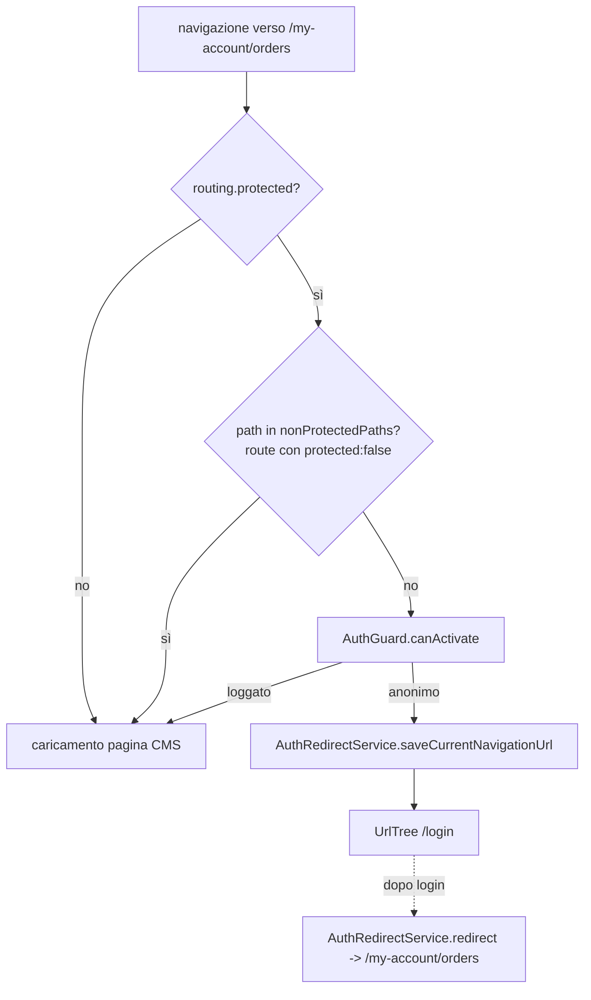

### Flusso passo-passo

1. L'utente anonimo apre `/my-account/orders` su un sito con `requiresAuthentication: true`.
2. `SecurePortalConfigInitializer` ha impostato `routing.protected = true`.
3. `CmsPageGuard` → `BeforeCmsPageGuardService` → `ProtectedRoutesGuard` → `AuthGuard`.
4. `AuthGuard` salva l'URL e ritorna l'`UrlTree` di `/login`.
5. Dopo il login `AuthService` chiama `AuthRedirectService.redirect()`, che naviga a `/my-account/orders`.

### Codice minimo riscritto a mano

```typescript
import { provideConfig, RoutingConfig } from '@spartacus/core';

// 1) Chiudere lo storefront, lasciando pubbliche alcune pagine
export const closedShopProviders = [
  provideConfig(<RoutingConfig>{
    routing: {
      protected: true,
      routes: {
        // le route di login hanno già protected:false nella config di default
        termsAndConditions: { paths: ['terms-and-conditions'], protected: false },
        contactUs: { paths: ['contact'], protected: false },
      },
    },
  }),
];

// 2) Proteggere una route Angular propria
import { Routes } from '@angular/router';
import { AuthGuard } from '@spartacus/core';
import { CmsPageGuard, PageLayoutComponent } from '@spartacus/storefront';

export const myRoutes: Routes = [
  {
    // @ts-ignore  il path arriva dalla config: routing.routes.wishlist.paths
    path: null,
    canActivate: [AuthGuard, CmsPageGuard],
    component: PageLayoutComponent,
    data: { cxRoute: 'wishlist' },
  },
];
```

### Errori comuni

- **`protected: true` su una singola route non protegge nulla** (vedi sezione 2).
- **Pagina di login marcata senza `protected: false`** in un sito protetto: loop di redirect verso il login.
- **Nuova pagina di registrazione custom senza `authFlow: true`**: dopo il login l'utente viene riportato
  sulla pagina di registrazione.
- **Mettere `AuthGuard` dopo `CmsPageGuard`**: la pagina CMS viene scaricata inutilmente prima del
  redirect; l'ordine in `canActivate` è l'ordine di esecuzione.

### Domande di autoverifica

1. Perché `ProtectedRoutesGuard` è una "before guard" e non una guard sulla route `**`?
2. Che differenza c'è tra `protected: false` e `authFlow: true` sulla route `register`?
3. Cosa ritorna `LoginGuard` quando parte il redirect OAuth, e perché?

---

## 9. La catena di guard del checkout

### In una frase

Le pagine del checkout (`/checkout`, `/checkout/delivery-address`, ...) sono pagine CMS senza route
Angular dedicate: le guard sono attaccate ai **componenti CMS** del checkout e girano in sequenza
`CheckoutAuthGuard → CartNotEmptyGuard → (CheckoutGuard | CheckoutStepsSetGuard)`.

### Il problema che risolve

Bisogna impedire che un utente entri in uno step senza carrello, senza login (o guest), o saltando uno
step precedente non completato, e bisogna portare `/checkout` al primo step corretto (o direttamente alla
review con l'express checkout).

### Come è implementato (con path)

Route name in `feature-libs/checkout/base/root/config/default-checkout-routing-config.ts`
(`defaultCheckoutRoutingConfig`): `checkoutLogin`, `checkout`, `checkoutDeliveryAddress`,
`checkoutDeliveryMode`, `checkoutPaymentDetails`, `checkoutReviewOrder`; B2B aggiunge
`checkoutPaymentType` (`feature-libs/checkout/b2b/root/config/default-checkout-b2b-routing-config.ts`).

Mappatura guard → componente (cartella `feature-libs/checkout/base/components/`):

| Componente CMS | Modulo | `guards` |
|---|---|---|
| `CheckoutOrchestrator` | `checkout-orchestrator/checkout-orchestrator.module.ts` | `CheckoutAuthGuard, CartNotEmptyGuard, CheckoutGuard` |
| `CheckoutProgress` (e varianti mobile) | `checkout-progress/checkout-progress.module.ts` | `CheckoutAuthGuard, CartNotEmptyGuard, CheckoutStepsSetGuard` |
| Delivery address | `checkout-delivery-address/checkout-delivery-address.module.ts` | `CheckoutAuthGuard, CartNotEmptyGuard, CartValidationGuard` |
| Delivery mode, payment method, review, place order | rispettivi `*.module.ts` | `CheckoutAuthGuard, CartNotEmptyGuard` |
| Checkout login | `checkout-login/checkout-login.module.ts` | `NotCheckoutAuthGuard` |

Le guard (cartella `feature-libs/checkout/base/components/guards/`):

- **`CheckoutAuthGuard`** (`checkout-auth.guard.ts`): `combineLatest(isUserLoggedIn, isGuestCart, isStable)`,
  aspetta `isStable`; loggato → `true`; anonimo con carrello guest → `true`; altrimenti
  `handleAnonymousUser()`: salva l'URL (`saveCurrentNavigationUrl`) e redirige a `login`, con
  `?forced=true` se il guest checkout è abilitato (o, col toggle `authorizationCodeFlowByDefault`,
  salva `IS_GUEST_USER_CHECKOUT_KEY` in localStorage).
- **`CartNotEmptyGuard`** (`cart-not-empty.guard.ts`): `activeCartFacade.takeActive()`; se
  `!cart.totalItems` → `UrlTree` di `home`.
- **`CheckoutGuard`** (`checkout.guard.ts`): se express checkout è attivo e il carrello non è guest,
  prova `expressCheckoutService.trySetDefaultCheckoutDetails()`; se riesce → path di
  `REVIEW_ORDER`, altrimenti → path del primo step (`firstStep$`, dai `steps$` di `CheckoutStepService`).
  Non ritorna mai `true`: `/checkout` è solo uno smistatore.
- **`CheckoutStepsSetGuard`** (`checkout-steps-set.guard.ts`): trova lo step corrente confrontando
  `'/' + route.url.join('/')` con il primo path di ogni step; se lo step non esiste → `checkout`;
  altrimenti verifica che lo step **precedente** sia completato (`isDeliveryAddress`,
  `isDeliveryModeSet`, `isPaymentDetailsSet`), in caso contrario redirige a quello step. Nel costruttore
  abilita/disabilita gli step di consegna in base a `hasDeliveryItems()` (es. solo ritiro in negozio).
- **`NotCheckoutAuthGuard`** (`not-checkout-auth.guard.ts`): sulla pagina `checkout-login`; loggato →
  `home`, carrello guest → `cart`.

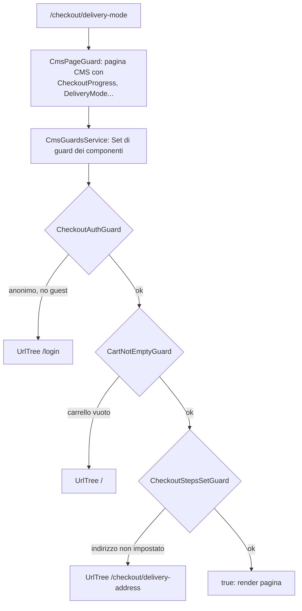

### Flusso passo-passo

1. L'utente clicca "Checkout" → `/checkout` → pagina CMS con `CheckoutOrchestrator`.
2. `CheckoutAuthGuard` e `CartNotEmptyGuard` passano; `CheckoutGuard` ritorna l'`UrlTree` del primo step.
3. Su `/checkout/delivery-mode` il componente `CheckoutProgress` porta `CheckoutStepsSetGuard`, che
   controlla che l'indirizzo di consegna sia stato impostato.
4. Tutte le guard sono deduplicate e composte in sequenza da `GuardsComposer`.

### Codice minimo riscritto a mano

```typescript
import { inject, Injectable } from '@angular/core';
import { GuardResult, Router } from '@angular/router';
import { ActiveCartFacade } from '@spartacus/cart/base/root';
import { CmsConfig, provideDefaultConfig, SemanticPathService } from '@spartacus/core';
import { CheckoutAuthGuard, CartNotEmptyGuard } from '@spartacus/checkout/base/components';
import { Observable } from 'rxjs';
import { map } from 'rxjs/operators';
import { GiftMessageComponent } from './gift-message.component';

/** Blocca lo step "messaggio regalo" se il carrello supera 50 righe. */
@Injectable({ providedIn: 'root' })
export class MaxEntriesGuard {
  private cart = inject(ActiveCartFacade);
  private router = inject(Router);
  private semantic = inject(SemanticPathService);
  canActivate(): Observable<GuardResult> {
    return this.cart.takeActive().pipe(
      map((c) => ((c.entries?.length ?? 0) <= 50 ? true : this.router.parseUrl(this.semantic.get('cart') ?? '/')))
    );
  }
}

export const giftStepProviders = [
  provideDefaultConfig(<CmsConfig>{
    cmsComponents: {
      CheckoutGiftMessage: {
        component: GiftMessageComponent,
        guards: [CheckoutAuthGuard, CartNotEmptyGuard, MaxEntriesGuard],
      },
    },
  }),
];
```

### Errori comuni

- **Cercare `canActivate` nelle route del checkout**: non ci sono route Angular del checkout; le guard
  sono nei `cmsComponents`.
- **Aggiungere uno step alla config `checkout.steps` senza route name in `routing.routes`**:
  `CheckoutStepsSetGuard` confronta con `paths[0]` e, non trovandolo, logga "Missing step with route"
  e redirige a `checkout`.
- **Guard che non completa**: `CheckoutAuthGuard` filtra finché il carrello non è `isStable`; un carrello
  che non si stabilizza blocca la navigazione.
- **Confondere `CheckoutGuard` e `CheckoutStepsSetGuard`**: il primo smista `/checkout`, il secondo
  valida il singolo step.

### Domande di autoverifica

1. Perché `CheckoutGuard` non ritorna mai `true`?
2. Come fa `CheckoutStepsSetGuard` a capire in quale step si trova?
3. In quale caso `CheckoutAuthGuard` lascia passare un utente anonimo?

---

## 10. URL multilingua e multisito

### In una frase

`SiteContextUrlSerializer` sostituisce l'`UrlSerializer` di Angular: in lettura toglie dall'URL i
segmenti iniziali di site context (`baseSite`, `language`, `currency`), in scrittura li rimette;
`SiteContextRoutesHandler` sincronizza quei valori con i servizi di contesto.

### Il problema che risolve

Si vogliono URL come `/electronics-spa/it/EUR/product/123` senza che **nessuna** route o link debba
conoscere il prefisso. Il router vede solo `/product/123`, e cambiando lingua l'URL si aggiorna da solo.

### Come è implementato (con path)

**Config** — `context.urlParameters` (`core-libs/core/src/site-context/config/site-context-config.ts`).
Nell'app demo: `urlParameters: ['baseSite', 'language', 'currency']`
(`projects/storefrontapp/src/app/spartacus/spartacus-b2c-configuration.providers.ts`).
`SiteContextParamsService.getUrlEncodingParameters()`
(`core-libs/core/src/site-context/services/site-context-params.service.ts`) la legge.

**Registrazione** — `core-libs/core/src/site-context/providers/site-context-params-providers.ts`:

```typescript
export const siteContextParamsProviders: Provider[] = [
  SiteContextParamsService,
  SiteContextUrlSerializer,
  { provide: UrlSerializer, useExisting: SiteContextUrlSerializer },
];
```

**`SiteContextUrlSerializer`** — `core-libs/core/src/site-context/services/site-context-url-serializer.ts`
(estende `DefaultUrlSerializer`):

- `parse(url)`: `urlExtractContextParameters(url)` scorre i parametri **nell'ordine configurato**; per
  ognuno, se il segmento corrente è tra i valori ammessi (`getParamValues`) lo consuma, altrimenti passa
  al parametro successivo **senza** consumare il segmento. Il risultato è un `UrlTreeWithSiteContext`
  con la proprietà extra `siteContext`.
- `serialize(tree)`: prende `tree.siteContext` (se c'è) o il valore **attivo** del servizio
  (`siteContextParams.getValue(param)`) per ogni parametro e antepone `/<v1>/<v2>/<v3>`.

**`SiteContextRoutesHandler`** — `core-libs/core/src/site-context/services/site-context-routes-handler.ts`
(API privata):

- `initOnce()`: chiamato da `BaseSiteInitializer`, `LanguageInitializer` e `CurrencyInitializer`
  (es. `language-initializer.ts`: `switchMap(() => this.siteContextRoutesHandler.initOnce())`).
  Legge sincronicamente `location.path(true)` e imposta i valori di contesto dall'URL.
- `subscribeRouting()`: a ogni `NavigationStart` estrae i parametri dall'URL e li applica
  (`siteContextParams.setValue`).
- `subscribeChanges()`: quando un servizio di contesto cambia valore **fuori** da una navigazione (es.
  selettore lingua), riserializza l'URL corrente e fa `location.replaceState` (niente nuova voce di
  cronologia).

**`LOCATION_INITIALIZED`** — in `core-libs/core/src/routing/routing.module.ts` la factory
`locationInitializedFactory` attende tutte le promise del token multi `LOCATION_INITIALIZED_MULTI`
(`core-libs/core/src/routing/location-initialized-multi/location-initialized-multi.ts`): serve a far
aspettare al router la navigazione iniziale finché gli initializer registrati non sono pronti.

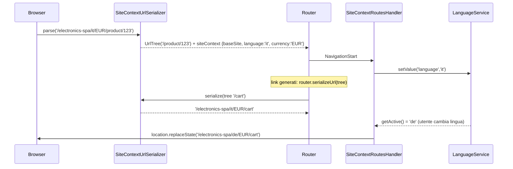

### Flusso passo-passo

1. Bootstrap: gli initializer di site context chiamano `SiteContextRoutesHandler.initOnce()`, che legge
   l'URL iniziale e imposta sito/lingua/valuta.
2. Ogni `parse` produce un albero senza prefisso: il router e le route non vedono mai il contesto.
3. Ogni `serialize` (link, `navigate`, `location`) rimette il prefisso con i valori attivi.
4. Un cambio di lingua da UI aggiorna l'URL con `replaceState` e (via `RouterEffects.clearCmsRoutes$`)
   rimuove le route CMS generate.

### Codice minimo riscritto a mano

```typescript
import { Injectable } from '@angular/core';
import { DefaultUrlSerializer, UrlSerializer, UrlTree } from '@angular/router';

const LANGS = ['en', 'it', 'de'];
let activeLang = 'en';

@Injectable()
export class LangUrlSerializer extends DefaultUrlSerializer {
  override parse(url: string): UrlTree & { lang?: string } {
    const [path, rest = ''] = url.split(/(?=[?#])/);
    const segs = path.split('/').filter((s, i) => !(i === 0 && s === ''));
    let lang: string | undefined;
    if (LANGS.includes(segs[0])) { lang = segs.shift(); activeLang = lang!; }
    const tree = super.parse('/' + segs.join('/') + rest) as UrlTree & { lang?: string };
    tree.lang = lang;
    return tree;
  }
  override serialize(tree: UrlTree & { lang?: string }): string {
    return '/' + (tree.lang ?? activeLang) + super.serialize(tree);
  }
}

export const langUrlProviders = [
  LangUrlSerializer,
  { provide: UrlSerializer, useExisting: LangUrlSerializer },
];
```

### Errori comuni

- **Scrivere il prefisso nei link** (`routerLink="/electronics-spa/en/USD/cart"`): diventa doppio o
  errato quando la lingua cambia; usare `cxUrl` o path senza contesto.
- **Valori di contesto non dichiarati**: se `it` non è tra i valori ammessi di `language`, il segmento
  non viene riconosciuto e diventa parte del path (tipicamente 404 CMS).
- **Leggere `window.location.pathname` per capire la pagina**: contiene il prefisso; usare
  `RoutingService.getRouterState()`.
- **Aspettarsi una nuova voce di history al cambio lingua**: si usa `replaceState`.

### Domande di autoverifica

1. Cosa succede nel `parse` se l'URL è `/it/cart` e `urlParameters` è `['baseSite','language','currency']`?
2. Perché `AuthRedirectService` salva l'URL di redirect senza i parametri di contesto?
3. Chi chiama `SiteContextRoutesHandler.initOnce()`?

---

## 11. NgRx Router Store

### In una frase

`@ngrx/router-store` copia lo stato del router Angular nello store NgRx sotto la chiave `router`;
Spartacus usa un **`CustomSerializer`** che riduce la snapshot a pochi campi (`url`, `params`,
`queryParams`, `context`, `cmsRequired`, `semanticRoute`) e un reducer proprio che distingue lo stato
corrente (`state`) da quello in arrivo (`nextState`).

### Il problema che risolve

1. La snapshot di Angular non è serializzabile e contiene molto di più del necessario.
2. Il CMS ha bisogno di sapere **prima** che la navigazione finisca quale pagina caricare
   (`PageContext`), e questa informazione dipende da regole di dominio (prodotto, categoria, label).
3. Molti effect/selector (CMS, prodotto, eventi) vogliono reagire alla navigazione in modo uniforme.

### Come è implementato (con path)

**Modulo** — `core-libs/core/src/routing/routing.module.ts`, `RoutingModule` (core):

```typescript
imports: [
  StoreModule.forFeature(ROUTING_FEATURE, reducerToken),   // ROUTING_FEATURE = 'router'
  EffectsModule.forFeature(effects),                        // [RouterEffects]
  StoreRouterConnectingModule.forRoot({ routerState: RouterState.Minimal, stateKey: ROUTING_FEATURE }),
],
// forRoot() providers:
{ provide: RouterStateSerializer, useClass: CustomSerializer },
```

Nota: il `RouterState` importato qui è l'**enum** di `@ngrx/router-store` (`Minimal`/`Full`), diverso
dall'interfaccia `RouterState` di Spartacus.

**Stato** — `core-libs/core/src/routing/store/routing-state.ts`:

```typescript
export const ROUTING_FEATURE = 'router';
export interface RouterState extends fromNgrxRouter.RouterReducerState<ActivatedRouterStateSnapshot> {
  nextState?: ActivatedRouterStateSnapshot;
}
export interface ActivatedRouterStateSnapshot {
  url: string; queryParams: Params; params: Params;
  context: PageContext; cmsRequired: boolean; semanticRoute?: string;
}
export interface State { [ROUTING_FEATURE]: RouterState; }
```

Poiché lo stato è registrato con `forFeature('router', { router: reducer })` (vedi `getReducers()`),
il percorso completo nello store è `state.router.router` (`getRouterFeatureState` → `.router` in
`getRouterState`).

**Reducer** — `core-libs/core/src/routing/store/reducers/router.reducer.ts`, funzione `reducer`:

| Azione | Effetto |
|---|---|
| `ROUTER_NAVIGATION` | `nextState = payload.routerState`, `navigationId = event.id` |
| `ROUTER_ERROR`, `ROUTER_CANCEL` | `nextState = undefined` |
| `CHANGE_NEXT_PAGE_CONTEXT` (`'[Router] Change Next PageContext'`) | sostituisce `nextState.context` |
| `ROUTER_NAVIGATED` | `state = payload.routerState` ma con `context = nextState?.context ?? payload.context`; `nextState = undefined` |

La conservazione di `nextState.context` su `ROUTER_NAVIGATED` è ciò che permette alla pagina 404 di
"vincere": `CmsPageGuardService.canActivateNotFoundPage` cambia il contesto durante la navigazione e il
reducer lo mantiene.

**Azioni** — `core-libs/core/src/routing/store/actions/router.action.ts`: unica azione propria
`ChangeNextPageContext` (classe, stile NgRx "legacy"). Le azioni di navigazione vere sono quelle di
`@ngrx/router-store` (`ROUTER_NAVIGATION`, `ROUTER_NAVIGATED`, `ROUTER_CANCEL`, `ROUTER_ERROR`).
In `store/actions/routing-group.actions.ts` e `store/selectors/routing-group.selectors.ts` ci sono gli
export raggruppati (`RoutingActions`, `RoutingSelector`).

**Selettori** — `core-libs/core/src/routing/store/selectors/routing.selector.ts`: `getRouterState`,
`getSemanticRoute`, `getPageContext` (fallback `{ id: '' }`), `getNextPageContext`, `isNavigating`.

**`CustomSerializer.serialize(routerState)`**:

1. scende `root → firstChild → ...` fino alla foglia, costruendo `urlString`;
2. prende `semanticRoute` dall'ultimo `data.cxRoute` trovato;
3. prende `context` da `data.cxCmsRouteContext` (route CMS generate, sezione 7);
4. `cmsRequired = true` se c'è un contesto CMS o se una route ha in `canActivate` una funzione con
   `guardName === 'CmsPageGuard'` (la proprietà statica di `CmsPageGuard`);
5. se `semanticRoute` manca, prova `routingConfig.getRouteName(urlString senza '/')` (solo URL statici);
6. calcola il contesto con `getPageContext()`.

**Regole di `getPageContext()`** (in ordine):

| Condizione | `PageContext` |
|---|---|
| primo segmento `cx-preview` e `queryParams.cmsTicketId` | `{ id: 'smartedit-preview', type: ContentPage }` (`SMART_EDIT_CONTEXT`) |
| `params.productCode` | `{ id: productCode, type: ProductPage }` |
| `params.categoryCode` | `{ id: categoryCode, type: CategoryPage }` |
| `params.brandCode` | `{ id: brandCode, type: CategoryPage }` |
| `data.pageLabel` definito | `{ id: pageLabel, type: ContentPage }` |
| altrimenti, contesto CMS già trovato | quello |
| altrimenti, URL non vuoto | `{ id: '/' + segmenti, type: ContentPage }` |
| altrimenti (home) | `{ id: '__HOMEPAGE__', type: ContentPage }` (`HOME_PAGE_CONTEXT`) |

`PageContext` e le costanti sono in `core-libs/core/src/routing/models/page-context.model.ts`;
`PageType` (`ContentPage`, `ProductPage`, `CategoryPage`, `CatalogPage`) in
`core-libs/core/src/model/cms.model.ts`; `CmsRoute`, `CmsRouteData`, `CmsActivatedRouteSnapshot` in
`core-libs/core/src/routing/models/cms-route.ts`.

Attenzione a una sottigliezza: i parametri (`productCode`, ...) hanno **precedenza** su
`cxCmsRouteContext`; il contesto CMS vale solo se nessuna delle regole "parametri/pageLabel" scatta.

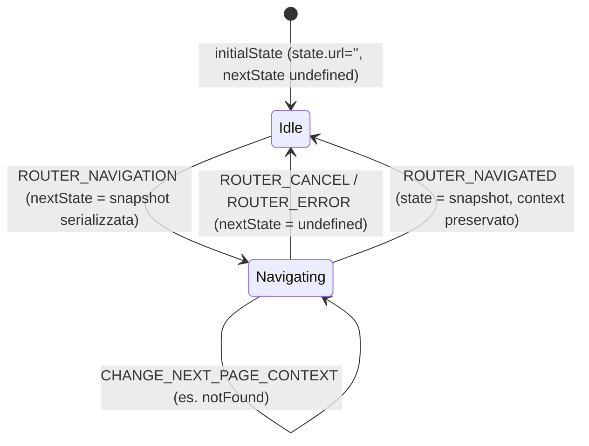

### Flusso passo-passo

1. Il router di Angular emette `ResolveStart`/`GuardsCheck`...; `StoreRouterConnectingModule` dispatcha
   `ROUTER_NAVIGATION` **prima** delle guard (comportamento di default di router-store).
2. `CustomSerializer` calcola il `PageContext` → `nextState`.
3. `CmsPageGuard` legge `getNextPageContext()` e carica la pagina.
4. Se serve, `changeNextPageContext()` modifica il contesto (404).
5. `ROUTER_NAVIGATED` promuove `nextState` a `state`; `getPageContext()` emette il nuovo contesto.

### Codice minimo riscritto a mano

```typescript
import { Injectable } from '@angular/core';
import { RouterStateSnapshot, Params } from '@angular/router';
import { RouterStateSerializer, provideRouterStore, ROUTER_NAVIGATION, ROUTER_NAVIGATED, ROUTER_CANCEL } from '@ngrx/router-store';
import { provideState, createReducer, on, createAction, props } from '@ngrx/store';

interface Ctx { id: string; type: 'ContentPage' | 'ProductPage' | 'CategoryPage' }
interface Snap { url: string; params: Params; context: Ctx }

@Injectable()
export class MySerializer implements RouterStateSerializer<Snap> {
  serialize(rs: RouterStateSnapshot): Snap {
    let s = rs.root; let path = '';
    while (s.firstChild) { s = s.firstChild; path += '/' + s.url.map((u) => u.path).join('/'); }
    const p = s.params;
    const context: Ctx = p['productCode'] ? { id: p['productCode'], type: 'ProductPage' }
      : p['categoryCode'] ? { id: p['categoryCode'], type: 'CategoryPage' }
      : { id: path || '__HOMEPAGE__', type: 'ContentPage' };
    return { url: rs.url, params: p, context };
  }
}

export const changeNextCtx = createAction('[Router] Change Next PageContext', props<{ ctx: Ctx }>());
interface S { state?: Snap; nextState?: Snap }
const reducer = createReducer<S>({},
  on({ type: ROUTER_NAVIGATION } as any, (st, a: any) => ({ ...st, nextState: a.payload.routerState })),
  on({ type: ROUTER_CANCEL } as any, (st) => ({ ...st, nextState: undefined })),
  on(changeNextCtx, (st, { ctx }) => st.nextState ? { ...st, nextState: { ...st.nextState, context: ctx } } : st),
  on({ type: ROUTER_NAVIGATED } as any, (st, a: any) => ({
    state: { ...a.payload.routerState, context: st.nextState?.context ?? a.payload.routerState.context },
    nextState: undefined,
  })),
);

export const myRouterStoreProviders = [
  provideState('myRouter', reducer),
  provideRouterStore({ stateKey: 'myRouter', serializer: MySerializer }),
];
```

(Il codice usa i `provide*` standalone di NgRx 21 per brevità; Spartacus usa ancora i moduli
`StoreModule.forFeature` / `StoreRouterConnectingModule.forRoot`. Il cast `as any` nelle `on()` è una
semplificazione didattica: in produzione si usano le action creator tipizzate `routerNavigationAction`,
`routerNavigatedAction`, `routerCancelAction`.)

### Errori comuni

- **Leggere `getPageContext()` dentro una guard** per sapere dove si sta andando: ritorna la pagina
  precedente. Usare `getNextPageContext()`.
- **Rinominare il parametro della PDP** (es. `:sku` al posto di `:productCode`): il serializer non
  riconosce più la pagina prodotto e la tratta come content page.
- **Aspettarsi `semanticRoute` per URL con parametri su route senza `data.cxRoute`**: il lookup inverso
  funziona solo per path statici.
- **Selezionare `state.router` invece di `state.router.router`** scrivendo selettori propri.

### Domande di autoverifica

1. Perché il reducer tiene `nextState.context` su `ROUTER_NAVIGATED`?
2. Come fa il `CustomSerializer` a sapere che una route è guidata dal CMS?
3. Quale `PageContext` ha l'URL `/` e perché non ha id vuoto?
4. In che ordine vengono valutati `productCode`, `pageLabel` e `cxCmsRouteContext`?

---

## 12. Eventi di navigazione e page meta

### In una frase

`NavigationEventBuilder` trasforma ogni `ROUTER_NAVIGATED` in un `NavigationEvent` dell'`EventService`
(per analytics, tag manager, ecc.); `RoutingPageMetaResolver` costruisce i breadcrumb delle route
Angular "pure" leggendo `data.cxPageMeta`.

### Il problema che risolve

- Chi fa tracking non deve dipendere da NgRx: vuole un evento tipizzato con URL, contesto e route.
- Le pagine con child routes (es. organizzazione B2B, store finder) hanno breadcrumb che dipendono dalla
  gerarchia di route Angular, non solo dal CMS.

### Come è implementato (con path)

**`NavigationEvent`** — `core-libs/storefront/events/navigation/navigation.event.ts`:

```typescript
export class NavigationEvent extends CxEvent {
  static readonly type = 'NavigationEvent';
  context: PageContext; semanticRoute?: string; url: string; params: Params;
}
```

**`NavigationEventBuilder`** — `core-libs/storefront/events/navigation/navigation-event.builder.ts`:
ascolta `ActionsSubject` con `ofType(ROUTER_NAVIGATED)`, prende `payload.routerState` (già serializzato
dal `CustomSerializer`) e registra la sorgente con `eventService.register(NavigationEvent, ...)`.
È istanziato da `NavigationEventModule` (`navigation-event.module.ts`). Eventi più specifici (es.
`ProductPageEventBuilder` in `core-libs/storefront/events/product/product-page-event.builder.ts`) si
basano su `NavigationEvent` filtrando per `semanticRoute`/contesto.

**`RoutingPageMetaResolver`** — `core-libs/core/src/cms/page/routing/routing-page-meta.resolver.ts`:

- `routes$`: route attive da `ActivatedRoutesService`, esclusa la root;
- `routesWithExtras$`: per ogni route calcola l'URL cumulativo e il resolver (quello in
  `data.cxPageMeta.resolver`, altrimenti quello del padre, altrimenti `DefaultRoutePageMetaResolver`);
- `resolveBreadcrumbs({ includeCurrentRoute })`: chiama `resolveBreadcrumbs` di ogni resolver e
  appiattisce; di default toglie la route corrente (e le route padre con path vuoto);
- legge `route.routeConfig.data.cxPageMeta` (non `route.data`) per evitare l'ereditarietà di `data`
  delle route con path vuoto.

Tipi in `core-libs/core/src/cms/page/routing/route-page-meta.model.ts`: `RoutePageMetaConfig`
(`breadcrumb?: string | { raw?, i18n? }`, `resolver?: Type<any>`), `RouteBreadcrumbResolver`.

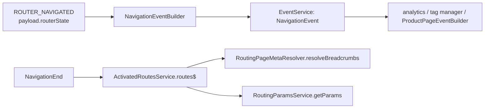

### Flusso passo-passo

1. La navigazione termina: `ROUTER_NAVIGATED` è dispatchato con la snapshot serializzata.
2. `NavigationEventBuilder` crea l'evento con `createFrom(NavigationEvent, {...})`.
3. I sottoscrittori di `eventService.get(NavigationEvent)` lo ricevono.
4. In parallelo `ActivatedRoutesService` emette le route attive, che alimentano breadcrumb e params.

### Codice minimo riscritto a mano

```typescript
import { inject, Injectable } from '@angular/core';
import { EventService } from '@spartacus/core';
import { NavigationEvent } from '@spartacus/storefront';

@Injectable({ providedIn: 'root' })
export class PageViewTracker {
  private events = inject(EventService);
  start() {
    this.events.get(NavigationEvent).subscribe((e) => {
      // e.context: { id, type }, e.semanticRoute: 'product' | 'cart' | ...
      console.log('page_view', { url: e.url, route: e.semanticRoute, page: e.context.id });
    });
  }
}

// Breadcrumb per una route Angular pura:
import { Routes } from '@angular/router';
export const orgRoutes: Routes = [
  {
    path: 'units',
    data: { cxPageMeta: { breadcrumb: 'orgUnit.breadcrumbs.list' } }, // chiave i18n
    children: [{ path: ':unitCode', data: { cxPageMeta: { breadcrumb: { raw: 'Dettaglio' } } }, children: [] }],
  },
];
```

### Errori comuni

- **Sottoscrivere `NavigationEvent` tardi aspettandosi tutte le navigazioni passate**: né
  `NavigationEventBuilder` né `EventService.get` (`core-libs/core/src/event/event.service.ts`) usano
  `shareReplay`. La sorgente è `ActionsSubject` di NgRx, che è un `BehaviorSubject`: un sottoscrittore
  tardivo riceve al massimo l'**ultima** azione dispatchata, e solo se è proprio `ROUTER_NAVIGATED`.
  Conviene quindi sottoscrivere presto (es. in un `APP_INITIALIZER` o nel costruttore di un servizio
  istanziato all'avvio).
- **Mettere `cxPageMeta` su una route con `path: ''` aspettandosi che sia ereditata dai figli**: il
  resolver ignora volutamente l'ereditarietà della config (ma eredita il *resolver*).

### Domande di autoverifica

1. Perché `NavigationEventBuilder` ascolta un'azione NgRx e non `router.events`?
2. Da quale proprietà legge `RoutingPageMetaResolver` la config dei breadcrumb, e perché?

---

## 13. AppRoutingModule e OnNavigateService

### In una frase

`AppRoutingModule` di `@spartacus/storefront` è il `RouterModule.forRoot([])` dell'applicazione (senza
route: le aggiungono le librerie) con `initialNavigation: 'enabledBlocking'` e `anchorScrolling`, più
`OnNavigateService` che gestisce scroll e focus dopo ogni navigazione.

### Il problema che risolve

- In SSR la navigazione iniziale deve completarsi prima del render (altrimenti HTML vuoto): serve
  `enabledBlocking`.
- In una SPA il browser non riporta lo scroll in cima né sposta il focus: questo è un problema di UX e di
  accessibilità (lettori di schermo).

### Come è implementato (con path)

**`AppRoutingModule`** — `core-libs/storefront/router/app-routing.module.ts`:

```typescript
@NgModule({
  imports: [
    RouterModule.forRoot([], { anchorScrolling: 'enabled', initialNavigation: 'enabledBlocking' }),
  ],
  providers: [
    provideDefaultConfig(defaultOnNavigateConfig),
    { provide: APP_INITIALIZER, useFactory: onNavigateFactory, deps: [OnNavigateService], multi: true },
  ],
})
export class AppRoutingModule {}
```

Non imposta `scrollPositionRestoration`: lo scroll è gestito a mano da `OnNavigateService`.
È importato dall'app demo in `projects/storefrontapp/src/app/app.module.ts` (`AppModule`), accanto a
`StoreModule.forRoot({})` ed `EffectsModule.forRoot([])`.

Il `RoutingModule` dello storefront (sezione 2/6) è invece importato da `BaseStorefrontModule`
(`core-libs/storefront/base-storefront.module.ts`, `RoutingModule.forRoot()`), e a sua volta importa
`CoreRoutingModule.forRoot()` e `CmsRouteModule`.

**`OnNavigateConfig`** — `core-libs/storefront/router/config/on-navigate-config.ts`; default in
`default-on-navigate-config.ts`:

```typescript
enableResetViewOnNavigate: { active: true, ignoreQueryString: false, ignoreRoutes: [], selectedHostElement: 'body' }
```

**`OnNavigateService`** — `core-libs/storefront/router/on-navigate.service.ts`:

- `initializeWithConfig()` (dall'`APP_INITIALIZER`) → `setResetViewOnNavigate(true)`;
- imposta `viewportScroller.setHistoryScrollRestoration('manual')`;
- ascolta gli eventi `Scroll` del router a coppie (`pairwise`):
  - se l'evento ha `position` (back/forward) → ripristina quella posizione (subito, `setTimeout 0`);
  - altrimenti, se `ignoreQueryString` e cambia solo la query → non fa nulla;
  - se l'URL contiene uno dei segmenti di `ignoreRoutes` → non fa nulla;
  - altrimenti scrolla a `[0,0]` (o all'`anchor` se `anchorScrolling` è `enabled`) dopo 100 ms;
- `focusOnHostElement()`: mette il focus sull'elemento `selectedHostElement` (default `body`) o sul
  componente root, così i lettori di schermo ripartono dall'inizio della pagina.

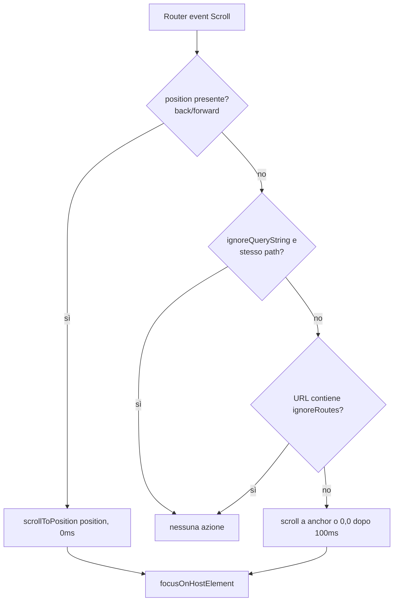

### Flusso passo-passo

1. `AppModule` importa `AppRoutingModule`: router con zero route, navigazione iniziale bloccante.
2. `RoutingModule` (core/storefront) aggiunge config, riscrive route con nome e aggiunge `**`.
3. `LOCATION_INITIALIZED` attende gli initializer registrati; poi parte la prima navigazione.
4. A ogni navigazione `OnNavigateService` gestisce scroll e focus.

### Codice minimo riscritto a mano

```typescript
import { NgModule } from '@angular/core';
import { BrowserModule } from '@angular/platform-browser';
import { StoreModule } from '@ngrx/store';
import { EffectsModule } from '@ngrx/effects';
import { provideConfig } from '@spartacus/core';
import { AppRoutingModule, OnNavigateConfig } from '@spartacus/storefront';

@NgModule({
  imports: [BrowserModule, StoreModule.forRoot({}), AppRoutingModule, EffectsModule.forRoot([])],
  providers: [
    provideConfig(<OnNavigateConfig>{
      enableResetViewOnNavigate: {
        active: true,
        ignoreQueryString: true,          // i filtri PLP cambiano la query: niente scroll in cima
        ignoreRoutes: ['my-account'],     // es. tab interne dell'area utente
      },
    }),
  ],
})
export class AppModule {}
```

### Errori comuni

- **Aggiungere `scrollPositionRestoration: 'enabled'`** con un proprio `RouterModule.forRoot`: entra in
  conflitto con `OnNavigateService` (doppio scroll).
- **Importare due volte `RouterModule.forRoot`** (nell'app e tramite `AppRoutingModule`): errore di
  provider duplicati del router.
- **Disattivare `enableResetViewOnNavigate`** senza gestire il focus: peggiora l'accessibilità.

### Domande di autoverifica

1. Perché `AppRoutingModule` passa un array di route vuoto?
2. Cosa cambia se `initialNavigation` fosse `'enabledNonBlocking'` in SSR?
3. Quando `OnNavigateService` non scrolla in cima?

---

## 14. Tabella route name → path

### In una frase

La tabella elenca i nomi di route (le chiavi di `routing.routes`) più usati, il loro path di default e il
file che li definisce; i nomi sono l'API stabile, i path sono solo il valore di default.

### Il problema che risolve

Quando si scrive `{ cxRoute: '...' }` bisogna conoscere il nome esatto e i parametri attesi. Molte pagine
"famose" (address book, profilo, wishlist, pagamenti) **non** hanno un route name: sono pagine CMS pure
servite dalla route `**` e si linkano con la loro label (es. `'/my-account/address-book'`).

### Come è implementato (con path)

**Storefront** — `core-libs/storefront/cms-structure/routing/default-routing-config.ts` (`defaultRoutesConfigFactory`)

| Route name | Path di default | paramsMapping | protected / authFlow |
|---|---|---|---|
| `home` | `''` | — | — |
| `notFound` | `not-found` | — | — |
| `login` | `login` (oppure `sign-in` con `authorizationCodeFlowByDefault`) | — | `false` / `true` |
| `loginForm` (solo con `authorizationCodeFlowByDefault`) | `login` | — | `false` / `true` |
| `oAuthCallback` (solo con toggle) | `oauth-callback` | — | `false` / `true` |
| `verifyToken` | `login/verify-token` | — | `false` / `true` |
| `verifyTokenForRegistration` | `register/verify-token` | — | `false` / `true` |
| `register` | `login/register` | — | `false` / `true` |
| `forgotPassword` | `login/forgot-password` | — | `false` / `true` |
| `resetPassword` | `login/pw/change` | — | `false` / `true` |
| `logout` | `logout` | — | `false` / `true` |
| `search` | `search/:query` | — | — |
| `category` | `category/:categoryCode` (+ matcher `**/c/:categoryCode`) | `categoryCode → code` | — |
| `brand` | `Brands/:brandName/c/:brandCode` | — | — |
| `product` | `product/:productCode/:name`, `product/:productCode` (+ matcher `**/p/:productCode`) | `productCode → code` | — |
| `termsAndConditions` | `terms-and-conditions` | — | — |
| `coupons` | `my-account/coupons` | — | — |
| `couponClaim` | `my-account/coupon/claim/:couponCode` | `couponCode → code` | — |
| `myInterests` | `my-account/my-interests` | — | — |
| `notificationPreference` | `my-account/notification-preference` | — | — |

**Feature-libs**

| Route name | Path di default | File |
|---|---|---|
| `cart` | `cart` | `feature-libs/cart/base/root/config/default-cart-routing-config.ts` |
| `savedCarts` / `savedCartsDetails` | `my-account/saved-carts` / `my-account/saved-cart/:savedCartId` | `feature-libs/cart/saved-cart/root/saved-cart-root.module.ts` |
| `quickOrder` | `my-account/quick-order` | `feature-libs/cart/quick-order/root/quick-order-root.module.ts` |
| `checkoutLogin` | `checkout-login` (`authFlow: true`) | `feature-libs/checkout/base/root/config/default-checkout-routing-config.ts` |
| `checkout` | `checkout` | idem |
| `checkoutDeliveryAddress` | `checkout/delivery-address` | idem |
| `checkoutDeliveryMode` | `checkout/delivery-mode` | idem |
| `checkoutPaymentDetails` | `checkout/payment-details` | idem |
| `checkoutReviewOrder` | `checkout/review-order` | idem |
| `checkoutPaymentType` | `checkout/payment-type` | `feature-libs/checkout/b2b/root/config/default-checkout-b2b-routing-config.ts` |
| `orders` | `my-account/orders` | `feature-libs/order/root/config/default-order-routing-config.ts` |
| `orderDetails` | `my-account/order/:orderCode` (`orderCode → code`) | idem |
| `orderGuest` | `guest/order/:orderCode` | idem |
| `orderReturn` / `orderCancel` | `my-account/order/return/:orderCode` / `my-account/order/cancel/:orderCode` | idem |
| `returnRequestDetails` | `my-account/return-request/:returnCode` (`returnCode → rma`) | idem |
| `replenishmentOrders` / `replenishmentDetails` | `my-account/my-replenishments` / `my-account/my-replenishment/:replenishmentOrderCode` | idem |
| `orderConfirmation` | `order-confirmation` | idem |
| `storeFinder` ... `storeFinderStore` | `store-finder`, `store-finder/find`, `store-finder/country/:country`, ... | `feature-libs/storefinder/root/config/default-store-finder-routing-config.ts` |
| `supportTickets` / `supportTicketDetails` | `my-account/support-tickets` / `my-account/support-ticket/:ticketCode` | `feature-libs/customer-ticketing/root/config/default-customer-ticketing-routing-config.ts` |
| `quotes` / `quoteDetails` | `my-account/quotes` / `my-account/quote/:quoteId` | `feature-libs/quote/root/quote-root.module.ts` |
| `orderApprovals` / `orderApprovalDetails` | `my-account/approval-dashboard` / `my-account/approval/:approvalCode` | `feature-libs/organization/order-approval/root/order-approval-root.module.ts` |
| `orgBudget`, `orgBudgetDetails`, ... | `organization/budgets`, `organization/budgets/:budgetCode`, ... | `feature-libs/organization/administration/root/config/default-budget-routing.config.ts` |
| `asmDeepLink` | `assisted-service/emulate` | `feature-libs/asm/root/asm-root.module.ts` |
| `configureCPQCONFIGURATOR` | `configure/vc/:ownerType/entityKey/:entityKey` | `feature-libs/product-configurator/rulebased/root/default-rulebased-routing-config.ts` |

**Integration-libs (estratto)**: `integration-libs/opf/checkout/root/config/default-opf-checkout-routing-config.ts`
(`checkout/opf-payment-type`, `checkout/opf-review`, ...), `integration-libs/punchout/root/config/default-punchout-routing-config.ts`
(`punchout/cxml/session`, ...), `integration-libs/cdc/root/config/default-cdc-routing-config.ts` (sovrascrive
`login` e svuota `loginForm` con `paths: []` per evitare path duplicati).

**Rotte esterne** (bonus): `core-libs/core/src/routing/external-routes/` (`ExternalRoutesService`,
`ExternalRoutesGuard`, config `routing.internal`) usa `UrlMatcherService.getFromGlob` + `getOpposite`
per mandare "fuori dalla SPA" (ricaricando la pagina) gli URL che non corrispondono ai pattern interni.

### Flusso passo-passo

1. Cerca il nome nella tabella (o con `grep -rn "paths:" feature-libs/<feature>/root`).
2. Controlla i parametri del path e l'eventuale `paramsMapping`.
3. Usa `{ cxRoute: nome, params: oggetto }` in `cxUrl` o in `RoutingService.go`.
4. Per cambiare il path, sovrascrivi solo `routing.routes.<nome>.paths` con `provideConfig`.

### Codice minimo riscritto a mano

```typescript
import { provideConfig, RoutingConfig } from '@spartacus/core';

export const seoRoutes = provideConfig(<RoutingConfig>{
  routing: {
    routes: {
      product: { paths: ['p/:productCode/:name', 'p/:productCode'] }, // matchers restano quelli del modulo PDP
      category: { paths: ['c/:categoryCode'] },
      cart: { paths: ['carrello'] },
      orderDetails: { paths: ['account/ordini/:orderCode'] },         // paramsMapping ereditato (deep merge)
    },
  },
});
```

### Errori comuni

- **Cercare `addressBook` in config**: non esiste come route name (appare solo come esempio in un
  commento di `RoutingConfigService.getRouteName`).
- **Sovrascrivere `paths` pensando di sovrascrivere anche `matchers`**: il deep merge mantiene i
  `matchers` definiti dal modulo PDP/PLP.
- **Due route con lo stesso path** (es. CDC `login` e `loginForm`): errore in console da
  `RoutingConfigService`; la soluzione ufficiale è `paths: []` sulla route non usata.

### Domande di autoverifica

1. Quale route name usi per linkare il dettaglio di un ordine e quale proprietà dell'oggetto serve?
2. Perché `/my-account/address-book` funziona anche senza route name?

---

## 15. Riepilogo finale

### In una frase

Nome di route → config → route Angular riscritte + wildcard CMS → guard (before, CMS, componenti) →
stato NgRx con `PageContext` → eventi e scroll: questo è il ciclo completo del routing di Spartacus.

### Il problema che risolve

Tenere insieme URL personalizzabili, pagine decise dal backend, multisito e controllo degli accessi,
senza che i componenti conoscano i path reali.

### Come è implementato (con path)

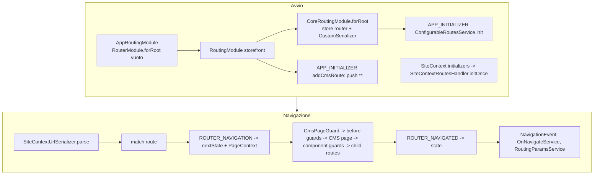

### Flusso passo-passo

1. Configura i path per nome (sezioni 2 e 14).
2. Genera link con `cxUrl` / `RoutingService.go` (sezioni 3–4).
3. Estendi il match con `UrlMatcherFactory` (sezione 5).
4. Lascia che il CMS decida le pagine (sezione 6) e attacca guard/child routes ai componenti (sezioni 7, 9).
5. Proteggi con `routing.protected`, `AuthGuard` e `authFlow` (sezione 8).
6. Metti sito/lingua/valuta nell'URL con `context.urlParameters` (sezione 10).
7. Leggi lo stato da NgRx tramite la facade (sezione 11), ascolta eventi (sezione 12).

### Codice minimo riscritto a mano

```typescript
// Una feature completa "wishlist" con route nominata, guard e link semantico.
import { NgModule, Component, inject } from '@angular/core';
import { RouterModule, RouterLink } from '@angular/router';
import { AuthGuard, provideDefaultConfig, RoutingConfig, RoutingService, UrlModule } from '@spartacus/core';
import { CmsPageGuard, PageLayoutComponent } from '@spartacus/storefront';

@NgModule({
  imports: [
    RouterModule.forChild([
      // @ts-ignore path dalla config
      { path: null, canActivate: [AuthGuard, CmsPageGuard], component: PageLayoutComponent, data: { cxRoute: 'wishlist' } },
    ]),
  ],
  providers: [
    provideDefaultConfig(<RoutingConfig>{
      routing: { routes: { wishlist: { paths: ['my-account/wishlist/:listId'], paramsMapping: { listId: 'id' } } } },
    }),
  ],
})
export class WishlistRoutingModule {}

@Component({
  selector: 'app-wishlist-link',
  imports: [RouterLink, UrlModule],
  template: `<a [routerLink]="{ cxRoute: 'wishlist', params: { id: 'default' } } | cxUrl">Wishlist</a>
             <button (click)="go()">Vai</button>`,
})
export class WishlistLinkComponent {
  private routing = inject(RoutingService);
  go() { this.routing.go({ cxRoute: 'wishlist', params: { id: 'default' } }); }
}
```

Nota: `wishlist` qui è un nome inventato per l'esempio; in Spartacus la wishlist è una pagina CMS senza
route name (vedi sezione 14). Per funzionare serve comunque una pagina CMS con label
`/my-account/wishlist/...` oppure un `pageLabel` in `data`, perché `CmsPageGuard` cercherà una pagina
con il contesto calcolato dal `CustomSerializer`.

### Errori comuni (riassunto)

| Sintomo | Causa probabile | Dove guardare |
|---|---|---|
| Il link porta alla home | parametri mancanti / `paramsMapping` errato | `SemanticPathService.findPathWithFillableParams` |
| Warning "No path was configured for the named route" | nome non presente in `routing.routes` | `RoutingConfigService.getRouteConfig` |
| Pagina 404 su URL valido | contesto calcolato diverso dalla label CMS | `CustomSerializer.getPageContext` |
| Loop di redirect al login | pagina di login non `protected: false` | `ProtectedRoutesService.getNonProtectedPaths` |
| Dopo login torno sulla registrazione | route custom senza `authFlow: true` | `AuthFlowRoutesService.isAuthFlow` |
| Guard di componente ignorata | istanza non risolta da `UnifiedInjector` | `CmsGuardsService.cmsPageCanActivate` |
| Prefisso lingua duplicato nell'URL | prefisso scritto a mano nei link | `SiteContextUrlSerializer.serialize` |
| Scroll doppio o scatti | `scrollPositionRestoration` aggiunto al router | `OnNavigateService.setResetViewOnNavigate` |

### Domande di autoverifica (finali)

1. Descrivi, dal click su un `<a [routerLink]="{cxRoute:'product', params: p} | cxUrl">` fino al
   render, tutti i servizi coinvolti.
2. Cosa succede se configuri `product: { disabled: true }`? Le PDP sono ancora raggiungibili tramite la
   route `**`? (Suggerimento: il `CustomSerializer` riconosce la PDP solo da `params.productCode`.)
3. Perché le guard del checkout non sono su route Angular?
4. Come faresti ad aggiungere un matcher `/<qualsiasi>/sku-<code>` per la PDP mantenendo i path configurati?
5. Qual è la differenza fra `RoutingService.getParams()` e `getRouterState().pipe(map(s => s.state.params))`?
6. In quale momento viene calcolato il `PageContext` rispetto all'esecuzione delle guard?
7. Perché `SiteContextRoutesHandler` usa `location.replaceState` e non `router.navigate`?
8. Qual è il ruolo di `CmsPageGuard.guardName`?

---

## Assunzioni e punti non verificati

- `defaultStorefrontRoutesConfig`: **non esiste** come simbolo; la config di default è
  `defaultRoutesConfigFactory` (`core-libs/storefront/cms-structure/routing/default-routing-config.ts`).
- `UrlTranslationService`: **non esiste** in questa versione; la traduzione è in `SemanticPathService`.
- `RoutingService.navigate` esiste ma è `protected`.
- Le azioni di navigazione sono quelle standard di `@ngrx/router-store` (`ROUTER_NAVIGATION`,
  `ROUTER_NAVIGATED`, `ROUTER_CANCEL`, `ROUTER_ERROR`); l'unica azione propria è `ChangeNextPageContext`.
- Il momento di dispatch di `ROUTER_NAVIGATION` (prima delle guard) è il comportamento di default di
  `@ngrx/router-store` (`NavigationActionTiming.PreActivation`); Spartacus non imposta
  `navigationActionTiming` in `StoreRouterConnectingModule.forRoot` (verificato in `routing.module.ts`).
- I frammenti "Codice minimo riscritto a mano" sono didattici: semplificano il codice reale e non sono
  copie del repository.
