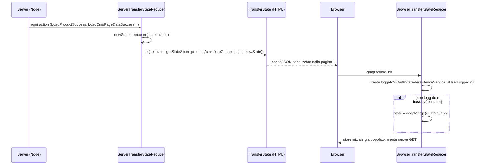
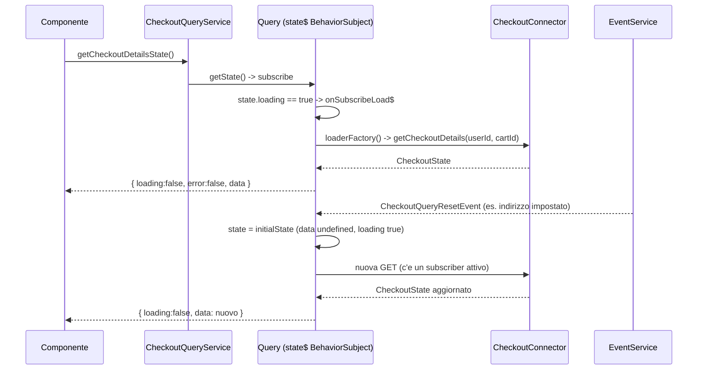
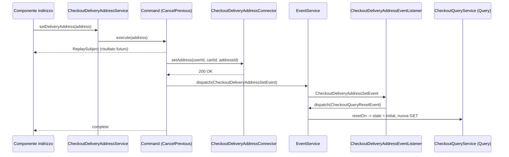
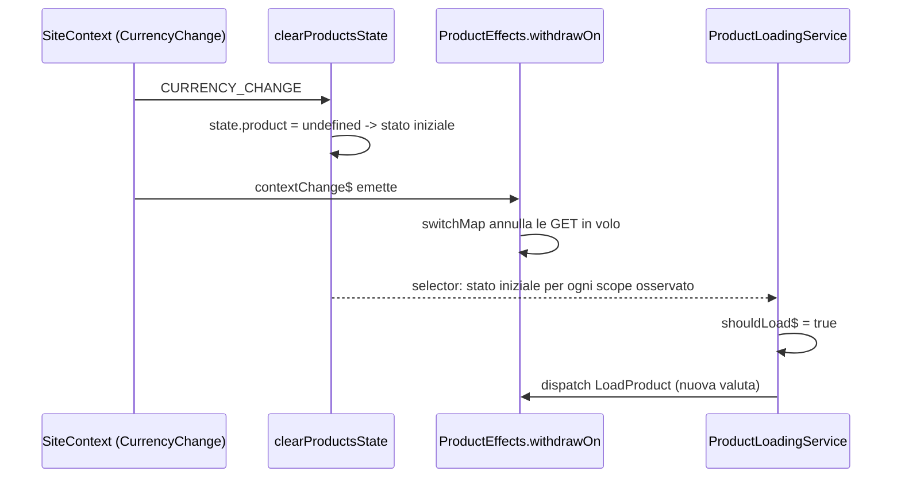

# 06 — Stato applicativo: NgRx, StateUtils, meta-reducer, Query/Command

> Area E della serie "deep dive". Codice di riferimento: repository Spartacus `2611.0.0`
> (Angular 21.2, NgRx 21, RxJS 7.8). Tutti i path sono relativi alla root del repo.
> Quando un'affermazione non è verificabile nel codice è marcata **NON VERIFICATO NEL CODICE**.

Spartacus gestisce lo stato del client con **due meccanismi che convivono**:

1. **NgRx** (store Redux-like: action → effect → reducer → selector), usato dalle parti
   più "storiche" e dalle entità globali condivise (prodotti, CMS, carrello, site context...).
2. **Query/Command** (`QueryService` / `CommandService` in `core-libs/core/src/util/command-query/`),
   un'astrazione RxJS leggera senza store globale, usata dalle feature più recenti
   (checkout, profilo utente, order, quote, OPF...).

Sopra NgRx Spartacus ha costruito un piccolo "framework nel framework": **StateUtils**,
un insieme di reducer/azioni/selettori generici che standardizzano il ciclo
*loading → success / error → reset* per singoli valori, per mappe di entità, per
processi concorrenti e per "scope" di dati (le viste parziali di un prodotto).

Indice:

- [Parte 0 — Mappa: chi usa NgRx, chi usa Query/Command](#parte-0--mappa-chi-usa-ngrx-chi-usa-querycommand)
- [Parte 1 — Anatomia di uno store per feature](#parte-1--anatomia-di-uno-store-per-feature)
- [Parte 2 — StateUtils: LoaderState e loaderReducer](#parte-2--stateutils-loaderstate-e-loaderreducer)
- [Parte 3 — StateUtils: EntityState ed EntityLoader](#parte-3--stateutils-entitystate-ed-entityloader)
- [Parte 4 — StateUtils: ProcessesLoader ed EntityProcessesLoader](#parte-4--stateutils-processesloader-ed-entityprocessesloader)
- [Parte 5 — Scoped loader: gli "scope" del prodotto](#parte-5--scoped-loader-gli-scope-del-prodotto)
- [Parte 6 — StateModule, StateConfig e TransferState meta-reducer](#parte-6--statemodule-stateconfig-e-transferstate-meta-reducer)
- [Parte 7 — Meta-reducer di pulizia (logout, cambio lingua...)](#parte-7--meta-reducer-di-pulizia-logout-cambio-lingua)
- [Parte 8 — Persistenza su storage: StatePersistenceService](#parte-8--persistenza-su-storage-statepersistenceservice)
- [Parte 9 — QueryService](#parte-9--queryservice)
- [Parte 10 — CommandService e CommandStrategy](#parte-10--commandservice-e-commandstrategy)
- [Parte 11 — NgRx o Query/Command? Come scegliere](#parte-11--ngrx-o-querycommand-come-scegliere)
- [Parte 12 — Flusso completo "carica prodotto"](#parte-12--flusso-completo-carica-prodotto)
- [Riepilogo finale e assunzioni](#riepilogo-finale-e-assunzioni)

---

## Parte 0 — Mappa: chi usa NgRx, chi usa Query/Command

### In una frase

Le entità "globali" del core (prodotto, CMS, utente legacy, site context, processi) e alcune
feature (carrello, ordini, ASM, organization, storefinder, pickup-in-store, configuratore)
usano ancora NgRx; checkout, profilo/account utente, quote, subscription-billing e quasi
tutte le integration-libs usano Query/Command.

### Il problema che risolve

Chi entra nel codice di Spartacus trova due stili diversi e si chiede "quale devo usare?".
Sapere **dove** sta ciascuno stile evita di cercare un reducer che non esiste (per esempio
nel checkout) o di scrivere un `QueryService` dove il resto della feature ragiona in action.

### Come è implementato (con path)

Il root store viene creato dall'applicazione, non dalle librerie:

- `projects/storefrontapp/src/app/app.module.ts` → `AppModule` importa
  `StoreModule.forRoot({})` e `EffectsModule.forRoot([])` (root vuoto: tutto il resto è
  registrato "a pezzi" dalle feature con `forFeature`).
- Lo schematic di installazione genera lo stesso codice:
  `core-libs/schematics/src/add-spartacus/store.ts` (stringhe `StoreModule.forRoot({})`,
  `EffectsModule.forRoot([])`).

Risultato di `grep StoreModule.forFeature` (file non-spec):

| Chiave feature (costante) | Modulo | Path |
|---|---|---|
| `product` (`PRODUCT_FEATURE`) | `ProductStoreModule` | `core-libs/core/src/product/store/product-store.module.ts` |
| `cms` (`CMS_FEATURE`) | `CmsStoreModule` | `core-libs/core/src/cms/store/cms-store.module.ts` |
| `user` (`USER_FEATURE`) | `UserStoreModule` | `core-libs/core/src/user/store/user-store.module.ts` |
| `router` (`ROUTING_FEATURE`) | `RoutingModule` | `core-libs/core/src/routing/routing.module.ts` |
| client auth (`CLIENT_AUTH_FEATURE`) | `ClientAuthStoreModule` | `core-libs/core/src/auth/client-auth/store/client-auth-store.module.ts` |
| `process` (`PROCESS_FEATURE`) | `ProcessStoreModule` | `core-libs/core/src/process/store/process-store.module.ts` |
| anonymous consents | `AnonymousConsentsStoreModule` | `core-libs/core/src/anonymous-consents/store/anonymous-consents-store.module.ts` |
| site theme | `SiteThemeStoreModule` | `core-libs/core/src/site-theme/store/site-theme-store.module.ts` |
| global message | `GlobalMessageStoreModule` | `core-libs/core/src/global-message/store/global-message-store.module.ts` |
| site context | `SiteContextStoreModule` | `core-libs/core/src/site-context/store/site-context-store.module.ts` |
| `cart` (`MULTI_CART_FEATURE`) | `MultiCartStoreModule` | `feature-libs/cart/base/core/store/multi-cart-store.module.ts` |
| order | `OrderStoreModule` | `feature-libs/order/core/store/order-store.module.ts` |
| asm | `AsmStoreModule` | `feature-libs/asm/core/store/asm-store.module.ts` |
| store finder | `StoreFinderStoreModule` | `feature-libs/storefinder/core/store/store-finder-store.module.ts` |
| pickup-in-store (3 feature: locations, option, stock) | `PickupInStoreStoreModule` | `feature-libs/pickup-in-store/core/store/pickup-in-store-store.module.ts` |
| organization | `OrganizationStoreModule` | `feature-libs/organization/administration/core/store/organization-store.module.ts` |
| order approval | `OrderApprovalStoreModule` | `feature-libs/organization/order-approval/core/store/order-approval-store.module.ts` |
| unit order | `UnitOrderStoreModule` | `feature-libs/organization/unit-order/core/store/unit-order-store.module.ts` |
| configuratore rulebased | `RulebasedConfiguratorStateModule` | `feature-libs/product-configurator/rulebased/core/state/rulebased-configurator-state.module.ts` |
| configuratore textfield | `ConfiguratorTextfieldStoreModule` | `feature-libs/product-configurator/textfield/core/state/configurator-textfield-store.module.ts` |

Nota: `feature-libs/cart/wish-list/core/store/` contiene solo `actions`, `effects` e
`wish-list-store.module.ts` (`WishListStoreModule`, che importa solo `EffectsModule.forFeature(effects)`,
nessun `StoreModule.forFeature`): la wish-list riusa lo store `cart` del multi-cart
(`WishListService` in `feature-libs/cart/wish-list/core/facade/wish-list.service.ts` inietta `Store<StateWithMultiCart>`).

Feature/servizi che importano `QueryService` o `CommandService` (grep su file non-spec):

| Area | Esempi di file |
|---|---|
| checkout base | `feature-libs/checkout/base/core/facade/checkout-query.service.ts`, `checkout-delivery-address.service.ts`, `checkout-delivery-modes.service.ts`, `checkout-payment.service.ts`, `checkout-billing-address.service.ts` |
| checkout b2b | `feature-libs/checkout/b2b/core/facade/checkout-payment-type.service.ts`, `checkout-cost-center.service.ts` |
| user account / profile | `feature-libs/user/account/core/facade/user-account.service.ts`, `feature-libs/user/profile/core/facade/user-profile.service.ts`, `user-email.service.ts`, `user-password.service.ts`, `user-register.service.ts` |
| order | `feature-libs/order/core/facade/order.service.ts`, `reorder-order.service.ts`, `scheduled-replenishment-order.service.ts` |
| cart (parti nuove) | `feature-libs/cart/base/core/facade/cart-access-code.service.ts`, `cart-guest-user.service.ts` |
| asm | `feature-libs/asm/core/facade/asm-customer-list.service.ts`, `asm-bind-cart.service.ts`, `feature-libs/asm/customer-360/core/services/asm-customer-360.service.ts` |
| quote, ticketing, subscription | `feature-libs/quote/core/facade/quote.service.ts`, `feature-libs/customer-ticketing/core/facade/customer-ticketing.service.ts`, `feature-libs/subscription-billing/core/facade/subscription.service.ts` |
| integration-libs | `integration-libs/opf/*/core/facade/*.service.ts`, `integration-libs/punchout/core/facade/punchout.service.ts`, `integration-libs/s4-service/checkout/core/facade/checkout-service-details.service.ts`, `integration-libs/cdc/...` |

Alcune feature sono **ibride**: `order` ha sia uno store NgRx (storico ordini, dettagli) sia
Query/Command (piazzamento ordine); `cart/base` ha lo store multi-cart ma usa Command per
access code e guest user; il checkout è Query/Command ma tiene un ponte verso lo store utente
legacy: `feature-libs/checkout/base/root/events/checkout-legacy-store-event.listener.ts`
(`CheckoutLegacyStoreEventListener`) che, alla ricezione di `LoadUserAddressesEvent`, fa
`this.store.dispatch(new UserActions.LoadUserAddresses(userId))`, con il commento
"We have to keep this here, since the user address feature is still ngrx-based".

### Flusso passo-passo

1. L'app crea uno store root vuoto (`StoreModule.forRoot({})`).
2. Ogni modulo di feature, quando viene importato (subito o in lazy loading), registra la sua
   "fetta" con `StoreModule.forFeature(CHIAVE, reducerToken, { metaReducers })` e i suoi
   effect con `EffectsModule.forFeature(effects)`.
3. Le feature Query/Command non registrano nulla nello store: il loro stato vive in un
   `BehaviorSubject` dentro il servizio facade.

### Codice minimo riscritto a mano

```ts
// app.module.ts (come projects/storefrontapp/src/app/app.module.ts)
@NgModule({
  imports: [
    BrowserModule,
    StoreModule.forRoot({}),   // root vuoto
    EffectsModule.forRoot([]), // nessun effect root
    SpartacusModule,           // le feature aggiungono le proprie fette
  ],
})
export class AppModule {}
```

### Errori comuni

- Dimenticare `StoreModule.forRoot({})`: tutti i `forFeature` falliscono a runtime
  (nessun `Store` root da estendere).
- Cercare un reducer del checkout: non esiste; lo stato è in `CheckoutQueryService.checkoutQuery$`.
- Pensare che la wish-list abbia una sua fetta di store: riusa quella del carrello.

### Domande di autoverifica

1. Dove viene creato lo store root nella demo app?
2. Quale ponte mantiene il checkout verso lo store NgRx dell'utente, e perché?
3. Cita due feature ibride e spiega dove usano l'uno e l'altro stile.

---

## Parte 1 — Anatomia di uno store per feature

### In una frase

Ogni store NgRx di Spartacus ha la stessa struttura: un file `*-state.ts` con costanti e
interfacce, e le cartelle `actions/`, `effects/`, `reducers/`, `selectors/`, più un
`*-store.module.ts` che li collega.

### Il problema che risolve

Con decine di feature e centinaia di action serve una convenzione rigida: chi apre qualsiasi
store sa dove trovare il nome della fetta, la forma dello stato, le action, e come il reducer
viene fornito (tramite `InjectionToken`, così è sostituibile/estendibile via DI).

### Come è implementato (con path)

Esempio **prodotto** — `core-libs/core/src/product/store/`:

| File | Contenuto reale |
|---|---|
| `product-state.ts` | `PRODUCT_FEATURE = 'product'`, `PRODUCT_DETAIL_ENTITY = '[Product] Detail Entity'`, `PRODUCT_SEARCH_RESULTS_BY_CODES_ENTITY`, `PRODUCT_SEARCH_RESULTS_BY_CATEGORY_ENTITY`, interfacce `StateWithProduct`, `ProductsState` (`details`, `search`, `searchByCode`, `searchByCategory`, `reviews`, `references`) |
| `actions/product.action.ts` | `LOAD_PRODUCT`, `LoadProduct`, `LoadProductFail`, `LoadProductSuccess`, `ClearProductPrice` |
| `actions/product-group.actions.ts` + `actions/index.ts` | riesporta tutte le action nel namespace `ProductActions` (`import * as ProductActions from './product-group.actions'`) |
| `effects/product.effect.ts` | `ProductEffects` con `loadProduct$` e `clearProductPrice$` |
| `reducers/index.ts` | `getReducers()`, `reducerToken`, `reducerProvider`, `clearProductsState`, `metaReducers` |
| `selectors/feature.selector.ts` | `getProductsState = createFeatureSelector<ProductsState>(PRODUCT_FEATURE)` |
| `selectors/product.selectors.ts` | `getProductState`, `getSelectedProductStateFactory`, `getSelectedProductFactory`, `...LoadingFactory`, `...SuccessFactory`, `...ErrorFactory`, `getAllProductCodes` |
| `product-store.module.ts` | `ProductStoreModule` |

`ProductStoreModule` (reale, ridotto):

```ts
// core-libs/core/src/product/store/product-store.module.ts
export function productStoreConfigFactory(): StateConfig {
  return {
    state: {
      ssrTransfer: {
        keys: { [PRODUCT_FEATURE]: StateTransferType.TRANSFER_STATE },
      },
    },
  };
}

@NgModule({
  imports: [
    CommonModule,
    StoreModule.forFeature(PRODUCT_FEATURE, reducerToken, { metaReducers }),
    EffectsModule.forFeature(effects),
  ],
  providers: [
    provideDefaultConfigFactory(productStoreConfigFactory),
    reducerProvider,
  ],
})
export class ProductStoreModule {}
```

Il reducer non è passato direttamente ma tramite **token**:

```ts
// core-libs/core/src/product/store/reducers/index.ts
export function getReducers(): ActionReducerMap<ProductsState, any> {
  return {
    search: fromProductsSearch.reducer,
    searchByCode: entityScopedLoaderReducer<Product>(PRODUCT_SEARCH_RESULTS_BY_CODES_ENTITY),
    searchByCategory: entityScopedLoaderReducer<Product[]>(PRODUCT_SEARCH_RESULTS_BY_CATEGORY_ENTITY),
    details: entityScopedLoaderReducer<Product>(PRODUCT_DETAIL_ENTITY),
    reviews: fromProductReviews.reducer,
    references: fromProductReferences.reducer,
  };
}
export const reducerToken = new InjectionToken<ActionReducerMap<ProductsState>>('ProductReducers');
export const reducerProvider: Provider = { provide: reducerToken, useFactory: getReducers };
```

Esempio **CMS** — `core-libs/core/src/cms/store/`: stessa struttura (`cms-state.ts`,
`actions/components.action.ts`, `actions/page.action.ts`, `actions/navigation-entry-item.action.ts`,
`effects/page.effect.ts`, `effects/components.effect.ts`, ..., `reducers/index.ts`,
`selectors/*.selectors.ts`, `cms-store.module.ts`). Il reducer usa `combineReducers` annidati e
gli StateUtils:

```ts
// core-libs/core/src/cms/store/reducers/index.ts (estratto reale)
page: combineReducers({
  pageData: fromPageReducer.reducer,
  index: combineReducers({
    content: entityLoaderReducer<string, any>(PageType.CONTENT_PAGE, fromPageIndexReducer.reducer(PageType.CONTENT_PAGE)),
    product: entityLoaderReducer<string, any>(PageType.PRODUCT_PAGE, fromPageIndexReducer.reducer(PageType.PRODUCT_PAGE)),
    // category, catalog ...
  }),
}),
components: entityReducer<ComponentsContext, any>(COMPONENT_ENTITY, fromComponentsReducer.reducer),
navigation: entityLoaderReducer<NodeItem, any>(NAVIGATION_DETAIL_ENTITY, fromNavigation.reducer),
```

Esempio **carrello** — `feature-libs/cart/base/core/store/`: `multi-cart-state.ts`
(`MULTI_CART_FEATURE = 'cart'`, `MULTI_CART_DATA`, `MultiCartState { carts: StateUtils.EntityProcessesLoaderState<Cart | undefined>; index: { [cartType: string]: string } }`),
`actions/cart.action.ts`, `cart-entry.action.ts`, `cart-voucher.action.ts`, `multi-cart.action.ts`,
`effects/cart.effect.ts`, `cart-entry.effect.ts`, ..., `reducers/index.ts`
(`getMultiCartReducers`, `multiCartReducerToken`, `clearMultiCartState`), `selectors/multi-cart.selector.ts`,
`multi-cart-store.module.ts` (`MultiCartStoreModule`).

Da notare in `getMultiCartReducers()`: il reducer legge un feature toggle con `inject(FeatureToggles)`
(`enableCartSlowNetworkResilience`) dentro `try/catch`: funziona perché la factory del token
gira in un contesto di injection.

### Flusso passo-passo

1. `ProductModule` (`core-libs/core/src/product/product.module.ts`) importa `ProductStoreModule`.
2. Angular risolve `reducerToken` chiamando `getReducers()` (factory del `reducerProvider`).
3. `StoreModule.forFeature('product', reducerToken, { metaReducers })` aggiunge la chiave
   `product` allo stato globale, avvolgendo il reducer con `clearProductsState`.
4. `EffectsModule.forFeature(effects)` istanzia `ProductEffects` e le altre classi di effect.
5. `provideDefaultConfigFactory(productStoreConfigFactory)` aggiunge alla config globale la
   chiave `state.ssrTransfer.keys.product` (vedi Parte 6).

### Codice minimo riscritto a mano

```ts
// mini-feature "wishlistCount" con la stessa anatomia
// state.ts
export const COUNT_FEATURE = 'count';
export interface CountState { value: number }
export interface StateWithCount { [COUNT_FEATURE]: CountState }

// actions.ts
export const INCREMENT = '[Count] Increment';
export class Increment implements Action { readonly type = INCREMENT; }

// reducers/index.ts
export function countReducer(state: CountState = { value: 0 }, action: Action): CountState {
  return action.type === INCREMENT ? { value: state.value + 1 } : state;
}
export const countReducerToken = new InjectionToken<ActionReducer<CountState>>('CountReducer');
export const countReducerProvider: Provider = { provide: countReducerToken, useValue: countReducer };

// selectors.ts
export const getCountState = createFeatureSelector<CountState>(COUNT_FEATURE);
export const getCount = createSelector(getCountState, (s) => s.value);

// count-store.module.ts
@NgModule({
  imports: [StoreModule.forFeature(COUNT_FEATURE, countReducerToken)],
  providers: [countReducerProvider],
})
export class CountStoreModule {}
```

### Errori comuni

- Passare il reducer direttamente invece del token: funziona, ma perdi la possibilità di
  sostituirlo via DI (Spartacus usa sempre il token).
- Chiamare la chiave della feature con un nome diverso da quello usato in
  `createFeatureSelector`: il selettore restituisce `undefined`.
- Dimenticare `reducerProvider` nei `providers`: errore "No provider for InjectionToken ProductReducers".

### Domande di autoverifica

1. Perché Spartacus fornisce i reducer via `InjectionToken`?
2. In quale file trovi la forma completa di `ProductsState`?
3. Come viene esposto il namespace `ProductActions`?

---

## Parte 2 — StateUtils: LoaderState e loaderReducer

### In una frase

`LoaderState<T>` è un contenitore standard `{ loading, error, success, value }` e
`loaderReducer(entityType, reducer?)` è un reducer "di ordine superiore" che aggiorna quei
flag leggendo **metadati** (`action.meta.loader`) invece del `type` dell'azione.

### Il problema che risolve

Ogni dato caricato da rete ha lo stesso ciclo: parte il caricamento, arriva il dato o l'errore,
a volte si resetta. Senza un'astrazione ogni feature riscriverebbe `loading: true`,
`loading: false, error: true` ecc. in ogni reducer. Con `loaderReducer` basta che l'azione
porti `meta: { entityType, loader: { load | success | error } }`: il reducer generico fa il resto.

### Come è implementato (con path)

Tutto è raggruppato nel namespace **`StateUtils`**:
`core-libs/core/src/state/utils/index.ts` fa `import * as StateUtils from './utils-group'; export { StateUtils };`
e `core-libs/core/src/state/utils/utils-group.ts` riesporta `entity-loader`, `entity-processes-loader`,
`entity`, `getStateSlice`, `loader`, `processes-loader`, `entity-list-state`, `serializer`.

**Stato** — `core-libs/core/src/state/utils/loader/loader-state.ts`:

```ts
export interface LoaderState<T> {
  loading?: boolean;
  error?: boolean;
  success?: boolean;
  value?: T;
}
```

**Azioni** — `core-libs/core/src/state/utils/loader/loader.action.ts`:

```ts
export const LOADER_LOAD_ACTION = '[LOADER] LOAD';
export const LOADER_FAIL_ACTION = '[LOADER] FAIL';
export const LOADER_SUCCESS_ACTION = '[LOADER] SUCCESS';
export const LOADER_RESET_ACTION = '[LOADER] RESET';

export interface LoaderMeta {
  entityType: string;
  loader: { load?: boolean; error?: any; success?: boolean } | undefined;
}
export interface LoaderAction extends Action {
  readonly payload?: any;
  readonly meta?: LoaderMeta;
}

export function loadMeta(entityType: string): LoaderMeta;          // loader: { load: true }
export function failMeta(entityType: string, error: any): LoaderMeta; // loader: { error: error ? error : true }
export function successMeta(entityType: string): LoaderMeta;       // loader: { success: true }
export function resetMeta(entityType: string): LoaderMeta;         // loader: {}

export class LoaderLoadAction implements LoaderAction { constructor(entityType: string) }
export class LoaderFailAction implements LoaderAction, ErrorAction { constructor(entityType: string, error: any) }
export class LoaderSuccessAction implements LoaderAction { constructor(entityType: string) }
export class LoaderResetAction implements LoaderAction { constructor(entityType: string) }
```

`LoaderFailAction` implementa `ErrorAction` (da `core-libs/core/src/error-handling`), cioè
espone `error`: serve al meccanismo di gestione errori globale di Spartacus.

**Reducer** — `core-libs/core/src/state/utils/loader/loader.reducer.ts`:

```ts
export const initialLoaderState: LoaderState<any> = {
  loading: false, error: false, success: false, value: undefined,
};

export function loaderReducer<T, V extends Action = Action>(
  entityType: string,
  reducer?: (state: T | undefined, action: Action | V) => T | undefined
): (state: LoaderState<T> | undefined, action: LoaderAction) => LoaderState<T>
```

Logica reale (semplificata nei commenti):

- se `action.meta.loader` esiste **e** `action.meta.entityType === entityType`:
  - `load` → `{ ...state, loading: true, value: reducer ? reducer(state.value, action) : state.value }`
  - `error` → `{ loading: false, error: true, success: false, value: reducer ? ... : undefined }`
  - `success` → `{ value: reducer ? reducer(state.value, action) : action.payload, loading: false, error: false, success: true }`
  - altrimenti (reset, `loader: {}`) → `{ ...initialLoaderState, value: reducer ? reducer(undefined, action) : undefined }`
- altrimenti, se c'è un sotto-reducer, gli passa l'azione e aggiorna `value` solo se cambia.

Punto chiave: **senza sotto-reducer il `value` in success è `action.payload`**. Con un
sotto-reducer, è il sotto-reducer a decidere il valore.

**Selettori** — `core-libs/core/src/state/utils/loader/loader.selectors.ts`:

```ts
export function loaderValueSelector<T>(state: LoaderState<T>): T;           // state.value
export function loaderLoadingSelector<T>(state: LoaderState<T>): boolean;   // state.loading ?? false
export function loaderErrorSelector<T>(state: LoaderState<T>): boolean;     // state.error ?? false
export function loaderSuccessSelector<T>(state: LoaderState<T>): boolean;   // state.success ?? false
```

Sono funzioni pure, **non** `createSelector`: si compongono dentro `createSelector`.

Uso reale: `core-libs/core/src/user/store/reducers/index.ts` → `getReducers()` usa
`loaderReducer<Address[], any>(USER_ADDRESSES, fromAddressesReducer.reducer)`,
`loaderReducer<PaymentDetails[], any>(USER_PAYMENT_METHODS, ...)`, ecc.;
`feature-libs/order/core/store/reducers/index.ts` usa `StateUtils.loaderReducer<OrderHistoryList, any>(...)`.

### Flusso passo-passo

1. Un effect (o un servizio) fa `dispatch` di un'azione di feature che **estende** `LoaderLoadAction`
   (quindi porta `meta = loadMeta(USER_ADDRESSES)`).
2. NgRx passa l'azione a tutti i reducer; quello creato con `loaderReducer(USER_ADDRESSES, ...)`
   riconosce `meta.entityType` e mette `loading: true`.
3. L'effect chiama il connector; al termine fa `dispatch` di un'azione che estende
   `LoaderSuccessAction` (payload = dati) o `LoaderFailAction`.
4. Il reducer aggiorna `value`/`success` o `error`.
5. I selettori `loaderValueSelector`/`loaderLoadingSelector` leggono il risultato.

### Codice minimo riscritto a mano

```ts
// Reimplementazione didattica di loaderReducer (senza sotto-reducer)
interface MiniLoaderState<T> { loading: boolean; error: boolean; success: boolean; value?: T }
interface MiniLoaderAction extends Action {
  payload?: any;
  meta?: { entityType: string; loader?: { load?: boolean; success?: boolean; error?: any } };
}
const initial: MiniLoaderState<any> = { loading: false, error: false, success: false };

export function miniLoaderReducer<T>(entityType: string) {
  return (state: MiniLoaderState<T> = initial, action: MiniLoaderAction): MiniLoaderState<T> => {
    const l = action.meta?.entityType === entityType ? action.meta.loader : undefined;
    if (!l) return state;
    if (l.load) return { ...state, loading: true };
    if (l.error) return { loading: false, error: true, success: false, value: undefined };
    if (l.success) return { loading: false, error: false, success: true, value: action.payload };
    return initial; // reset
  };
}

// Azioni di feature che riusano i meta
const ADDRESSES = '[User] Addresses';
export class LoadAddresses implements MiniLoaderAction {
  readonly type = '[User] Load Addresses';
  readonly meta = { entityType: ADDRESSES, loader: { load: true } };
}
export class LoadAddressesSuccess implements MiniLoaderAction {
  readonly type = '[User] Load Addresses Success';
  readonly meta = { entityType: ADDRESSES, loader: { success: true } };
  constructor(public payload: Address[]) {}
}
```

### Errori comuni

- Usare lo stesso `entityType` per due fette diverse: entrambe reagiscono alle stesse azioni.
- Aspettarsi che una `LoaderFailAction` conservi il vecchio `value`: senza sotto-reducer viene messo a `undefined`.
- Confondere `type` e `meta.entityType`: il reducer generico guarda solo `meta`, il `type`
  serve a effect e a `ofType`.
- Usare `loaderValueSelector` come selettore NgRx direttamente in `store.select`: è una funzione
  pura sullo slice, va composta con `createSelector`.

### Domande di autoverifica

1. Che cosa contiene `resetMeta(entityType)` e come lo interpreta `loaderReducer`?
2. Se passi un sotto-reducer, chi decide il `value` in caso di success?
3. Perché `LoaderFailAction` implementa `ErrorAction`?

---

## Parte 3 — StateUtils: EntityState ed EntityLoader

### In una frase

`EntityState<T>` è una mappa `{ entities: { [id]: T } }`; `entityReducer` applica un reducer
"per singolo elemento" solo all'id indicato in `action.meta.entityId`; `entityLoaderReducer` è
la composizione `entityReducer(loaderReducer(...))`, cioè **un LoaderState per ogni id**.

### Il problema che risolve

Molti dati sono collezioni indicizzate: prodotti per codice, componenti CMS per uid, ordini per
codice, nodi di navigazione. Ognuno deve avere il suo stato di caricamento indipendente
(il prodotto A può essere in `loading` mentre B è già `success`).

### Come è implementato (con path)

`core-libs/core/src/state/utils/entity/entity-state.ts`:

```ts
export interface EntityState<T> { entities: { [id: string]: T } }
```

`core-libs/core/src/state/utils/entity/entity.action.ts`:

```ts
export const ENTITY_REMOVE_ACTION = '[ENTITY] REMOVE';
export const ENTITY_REMOVE_ALL_ACTION = '[ENTITY] REMOVE ALL';
export type EntityId = string | string[] | null;
export interface EntityMeta { entityType: string; entityId?: EntityId; entityRemove?: boolean }
export function entityMeta(type: string, id?: EntityId): EntityMeta;
export function entityRemoveMeta(type: string, id: EntityId): EntityMeta;
export function entityRemoveAllMeta(type: string): EntityMeta;   // entityId: null, entityRemove: true
export class EntityRemoveAction implements EntityAction { constructor(entityType: string, id: EntityId) }
export class EntityRemoveAllAction implements EntityAction { constructor(entityType: string) }
```

`core-libs/core/src/state/utils/entity/entity.reducer.ts`:

```ts
export const initialEntityState: EntityState<any> = { entities: {} };
export function entityReducer<T, V extends Action = Action>(
  entityType: string,
  reducer: (state: T, action: Action | V) => T
)
```

Logica reale:

- se `meta.entityType === entityType` e `meta.entityId !== undefined`:
  - `ids = [].concat(entityId)` (un id o un array di id);
  - se `entityRemove` → rimuove gli id (o tutto se `entityId === null`);
  - se **sia** `entityId` **sia** `payload` sono array → *partition payload*: all'id `i` va
    `payload[i]`;
- altrimenti (azione senza id) il sotto-reducer viene applicato a **tutti** gli id esistenti
  (utile per un reset globale, es. `ClearProductPrice` con id `undefined`);
- aggiorna solo le entità per cui il sotto-reducer restituisce un valore.

`core-libs/core/src/state/utils/entity/entity.selectors.ts`:

```ts
export function entitySelector<T>(state: EntityState<T>, id: string): T | undefined;
```

**Entity loader** — `core-libs/core/src/state/utils/entity-loader/`:

```ts
// entity-loader-state.ts
export type EntityLoaderState<T> = EntityState<LoaderState<T>>;

// entity-loader.action.ts
export const ENTITY_LOAD_ACTION = '[ENTITY] LOAD';
export const ENTITY_FAIL_ACTION = '[ENTITY] LOAD FAIL';
export const ENTITY_SUCCESS_ACTION = '[ENTITY] LOAD SUCCESS';
export const ENTITY_RESET_ACTION = '[ENTITY] RESET';
export interface EntityLoaderMeta extends EntityMeta, LoaderMeta {}
export function entityLoadMeta(entityType: string, id: EntityId): EntityLoaderMeta;
export function entityFailMeta(entityType: string, id: EntityId, error: any): EntityLoaderMeta;
export function entitySuccessMeta(entityType: string, id: EntityId): EntityLoaderMeta;
export function entityResetMeta(entityType: string, id?: EntityId): EntityLoaderMeta;
export class EntityLoadAction   { constructor(entityType: string, id: EntityId) }
export class EntityFailAction   { constructor(entityType: string, id: EntityId, error: any) } // implements ErrorAction
export class EntitySuccessAction{ constructor(entityType: string, id: EntityId, public payload?: any) }
export class EntityLoaderResetAction { constructor(entityType: string, id: EntityId) }

// entity-loader.reducer.ts
export function entityLoaderReducer<T, V extends LoaderAction = LoaderAction>(
  entityType: string,
  reducer?: (state: T | undefined, action: V | LoaderAction) => T | undefined
): (state: EntityLoaderState<T> | undefined, action: EntityLoaderAction) => EntityLoaderState<T> {
  return entityReducer(entityType, loaderReducer(entityType, reducer));
}

// entity-loader.selectors.ts
export function entityLoaderStateSelector<T>(state: EntityLoaderState<T>, id: string): LoaderState<T>; // fallback initialLoaderState
export function entityValueSelector<T>(state: EntityLoaderState<T>, id: string): T;
export function entityLoadingSelector<T>(state: EntityLoaderState<T>, id: string): boolean;
export function entityErrorSelector<T>(state: EntityLoaderState<T>, id: string): boolean;
export function entitySuccessSelector<T>(state: EntityLoaderState<T>, id: string): boolean;
```

> Nota sul nome: l'azione di reset per le entità si chiama **`EntityLoaderResetAction`**
> (costante `ENTITY_RESET_ACTION`), non `EntityResetAction`. Una classe `EntityResetAction`
> non esiste nel codice (grep senza risultati).

Usi reali: CMS (`entityLoaderReducer<NodeItem, any>(NAVIGATION_DETAIL_ENTITY, ...)`),
process store (`core-libs/core/src/process/store/reducers/index.ts` → `getReducers()` ritorna
`entityLoaderReducer(PROCESS_FEATURE)`), organization
(`feature-libs/organization/administration/core/store/reducers/index.ts`,
`StateUtils.entityLoaderReducer<Budget, any>(...)`), order (`orderById`, `consignmentTrackingById`).

### Flusso passo-passo

1. `new EntityLoadAction('[Order] By Id', 'ORD-1')` → `meta = { entityType, entityId: 'ORD-1', loader: { load: true } }`.
2. `entityReducer` vede `entityId`, prende `state.entities['ORD-1']` (undefined la prima volta)
   e lo passa a `loaderReducer`, che ritorna `{ loading: true, ... }`.
3. `new EntitySuccessAction('[Order] By Id', 'ORD-1', order)` → `entities['ORD-1'] = { loading: false, success: true, value: order }`.
4. `entityValueSelector(state, 'ORD-1')` ritorna `order`; per un id mai caricato ritorna
   `initialLoaderState.value` (undefined) grazie al fallback di `entityLoaderStateSelector`.

### Codice minimo riscritto a mano

```ts
// entityReducer didattico: applica "inner" solo all'id indicato
type Entities<T> = { entities: Record<string, T> };
interface EAction extends Action { payload?: any; meta?: { entityType: string; entityId?: string | string[] } }

export function miniEntityReducer<T>(
  entityType: string,
  inner: (s: T | undefined, a: EAction) => T
) {
  return (state: Entities<T> = { entities: {} }, action: EAction): Entities<T> => {
    const m = action.meta;
    const ids = m?.entityType === entityType && m.entityId !== undefined
      ? ([] as string[]).concat(m.entityId)
      : Object.keys(state.entities);          // azione "globale": tocca tutti
    const updates: Record<string, T> = {};
    for (const id of ids) {
      const next = inner(state.entities[id], action);
      if (next !== state.entities[id]) updates[id] = next;
    }
    return Object.keys(updates).length
      ? { entities: { ...state.entities, ...updates } }
      : state;
  };
}

// Composizione come entityLoaderReducer
export const ordersById = miniEntityReducer('[Order] By Id', miniLoaderReducer<Order>('[Order] By Id'));
```

### Errori comuni

- Passare `entityId: undefined` credendo di colpire "nessuno": in realtà l'azione viene applicata
  a **tutte** le entità esistenti.
- Passare `entityId` come array ma `payload` non array: tutte le entità ricevono lo stesso payload.
- Usare `EntityRemoveAllAction` aspettandosi di azzerare solo i flag: rimuove l'intera mappa.

### Domande di autoverifica

1. Che cosa succede se un'azione con `meta.entityType` corretto non ha `entityId`?
2. Cos'è il "partition payload" in `entityReducer`?
3. Quale selettore usi per sapere se l'ordine `X` è in caricamento?

---

## Parte 4 — StateUtils: ProcessesLoader ed EntityProcessesLoader

### In una frase

`ProcessesLoaderState<T>` estende `LoaderState<T>` con un contatore `processesCount` di
operazioni in corso; il carrello lo usa per sapere quando è "stabile" (nessuna modifica
pendente e nessun caricamento).

### Il problema che risolve

Sul carrello possono partire più operazioni in parallelo (aggiungi riga, cambia quantità,
applica voucher). Un singolo flag `loading` non basta: l'utente deve vedere il carrello come
"in aggiornamento" finché **tutte** le operazioni non sono finite. Il contatore incrementa a
ogni inizio e decrementa a ogni fine.

### Come è implementato (con path)

`core-libs/core/src/state/utils/processes-loader/`:

```ts
// processes-loader-state.ts
export interface ProcessesLoaderState<T> extends LoaderState<T> { processesCount?: number }

// processes-loader.action.ts
export const PROCESSES_INCREMENT_ACTION = '[PROCESSES LOADER] INCREMENT';
export const PROCESSES_DECREMENT_ACTION = '[PROCESSES LOADER] DECREMENT';
export const PROCESSES_LOADER_RESET_ACTION = '[PROCESSES LOADER] RESET';
export interface ProcessesLoaderMeta extends LoaderMeta { entityType: string; processesCountDiff?: number | null }
export function processesIncrementMeta(entityType: string): ProcessesLoaderMeta;   // diff: 1, loader: undefined
export function processesDecrementMeta(entityType: string): ProcessesLoaderMeta;   // diff: -1
export function processesLoaderResetMeta(entityType: string): ProcessesLoaderMeta; // resetMeta + diff: null
export class ProcessesLoaderResetAction { constructor(entityType: string) }
export class ProcessesIncrementAction { constructor(entityType: string) }
export class ProcessesDecrementAction { constructor(entityType: string) }

// processes-loader.reducer.ts
export const initialProcessesState: ProcessesLoaderState<any> = { processesCount: 0 };
export function processesLoaderReducer<T>(
  entityType: string,
  reducer?: (state: T | undefined, action: Action) => T
): (state: ProcessesLoaderState<T>, action: ProcessesLoaderAction) => ProcessesLoaderState<T>;

// processes-loader.selectors.ts
export function isStableSelector<T>(state: ProcessesLoaderState<T>): boolean;          // !processesCount && !loading
export function hasPendingProcessesSelector<T>(state: ProcessesLoaderState<T>): boolean; // processesCount > 0
```

Il reducer prima delega a `loaderReducer` (quindi gestisce anche load/success/error), poi,
se `meta.processesCountDiff` è un numero, somma il delta; se è `null` azzera il contatore.
In `isDevMode()` stampa `console.error` se il contatore scenderebbe sotto zero
("There should always be only one decrement action for each increment action").

`core-libs/core/src/state/utils/entity-processes-loader/`:

```ts
export type EntityProcessesLoaderState<T> = EntityState<ProcessesLoaderState<T>>;
export const ENTITY_PROCESSES_LOADER_RESET_ACTION = '[ENTITY] PROCESSES LOADER RESET';
export const ENTITY_PROCESSES_INCREMENT_ACTION = '[ENTITY] PROCESSES INCREMENT';
export const ENTITY_PROCESSES_DECREMENT_ACTION = '[ENTITY] PROCESSES DECREMENT';
export class EntityProcessesLoaderResetAction { constructor(entityType: string, id: string | string[]) }
export class EntityProcessesIncrementAction  { constructor(entityType: string, id: string | string[]) }
export class EntityProcessesDecrementAction  { constructor(entityType: string, id: string | string[]) }

export function entityProcessesLoaderReducer<T>(
  entityType: string,
  reducer?: (state: T | undefined, action: ProcessesLoaderAction) => T
): (state: EntityProcessesLoaderState<T> | undefined, action: EntityProcessesLoaderAction) => EntityProcessesLoaderState<T> {
  return entityReducer(entityType, processesLoaderReducer(entityType, reducer));
}

export function entityHasPendingProcessesSelector<T>(state: EntityProcessesLoaderState<T>, id: string): boolean;
export function entityIsStableSelector<T>(state: EntityProcessesLoaderState<T>, id: string): boolean;
export function entityProcessesLoaderStateSelector<T>(state: EntityProcessesLoaderState<T>, id: string): ProcessesLoaderState<T>;
```

Uso reale: `feature-libs/cart/base/core/store/reducers/index.ts` →
`carts: StateUtils.entityProcessesLoaderReducer<Cart | undefined>(MULTI_CART_DATA, createCartEntitiesReducer(enabled))`.

### Flusso passo-passo

1. L'utente aggiunge un prodotto: un'azione del carrello con meta di increment
   (`processesCountDiff: 1`) per l'id carrello → `processesCount = 1`.
2. Parte una seconda modifica → `processesCount = 2`.
3. Le risposte arrivano: due decrement → `processesCount = 0`.
4. `entityIsStableSelector(state, cartId)` diventa `true` solo quando il contatore è 0 **e**
   `loading` è false.

### Codice minimo riscritto a mano

```ts
interface ProcState<T> { loading: boolean; value?: T; processesCount: number }
interface ProcAction extends Action { meta?: { entityType: string; processesCountDiff?: number | null } }

export function miniProcessesReducer<T>(entityType: string) {
  return (state: ProcState<T> = { loading: false, processesCount: 0 }, a: ProcAction): ProcState<T> => {
    if (a.meta?.entityType !== entityType) return state;
    const diff = a.meta.processesCountDiff;
    if (diff === null) return { ...state, processesCount: 0 };
    if (diff) return { ...state, processesCount: state.processesCount + diff };
    return state;
  };
}
export const isStable = (s: ProcState<unknown>) => !s.processesCount && !s.loading;
```

### Errori comuni

- Fare un increment senza il decrement corrispondente (es. in un `catchError` dimenticato):
  il carrello resta "instabile" per sempre.
- Resettare lo stato (`EntityProcessesLoaderResetAction`) mentre ci sono processi in corso:
  i decrement successivi portano il contatore sotto zero (messaggio in dev mode).

### Domande di autoverifica

1. Qual è la differenza tra `isStableSelector` e `hasPendingProcessesSelector`?
2. Che valore di `processesCountDiff` usa il reset e cosa produce?
3. Perché il carrello non può usare un semplice `LoaderState`?

---

## Parte 5 — Scoped loader: gli "scope" del prodotto

### In una frase

`ScopedLoaderState<T>` è una mappa `{ [scope]: LoaderState<T> }`: per lo stesso prodotto
Spartacus tiene **un LoaderState separato per ogni vista parziale** (`list`, `details`,
`price`, `stock`...), e `entityScopedLoaderReducer` lo moltiplica per ogni codice prodotto.

### Il problema che risolve

Il prodotto OCC è grande. Una lista prodotti ha bisogno solo di nome, prezzo e immagine;
la pagina dettaglio di descrizione, stock, classificazioni. Caricare tutto sempre sprecherebbe
banda; caricare "a pezzi" richiede di sapere per ogni pezzo se è in caricamento, caricato o
in errore. Gli scope risolvono questo: ogni scope corrisponde a un URL OCC con un parametro
`fields` diverso (vedi `defaultOccProductConfig` in Parte 12).

### Come è implementato (con path)

`core-libs/core/src/state/utils/scoped-loader/scoped-loader.state.ts`:

```ts
export interface ScopedLoaderState<T> { [scope: string]: LoaderState<T> }
export type EntityScopedLoaderState<T> = EntityState<ScopedLoaderState<T>>;
```

`core-libs/core/src/state/utils/scoped-loader/scoped-loader.reducer.ts`:

```ts
export const initialScopedLoaderState: ScopedLoaderState<any> = {};
export function scopedLoaderReducer<T>(
  entityType: string,
  reducer?: (state: T | undefined, action: Action) => T
): (state: ScopedLoaderState<T>, action: EntityScopedLoaderAction) => ScopedLoaderState<T> {
  const loader = loaderReducer<T>(entityType, reducer);
  return (state = initialScopedLoaderState, action) => {
    if (action && action.meta && action.meta.entityType === entityType) {
      return { ...state, [action.meta.scope ?? '']: loader(state[action.meta.scope ?? ''], action) };
    }
    return state;
  };
}
```

`core-libs/core/src/state/utils/scoped-loader/entity-scoped-loader.reducer.ts`:

```ts
export function entityScopedLoaderReducer<T>(
  entityType: string,
  reducer?: (state: T | undefined, action: LoaderAction) => T
): (state: EntityScopedLoaderState<T> | undefined,
    action: EntityScopedLoaderActions.EntityScopedLoaderAction) => EntityScopedLoaderState<T> {
  return entityReducer<ScopedLoaderState<T>>(entityType, scopedLoaderReducer<T>(entityType, reducer));
}
```

`core-libs/core/src/state/utils/scoped-loader/entity-scoped-loader.actions.ts` — namespace
`EntityScopedLoaderActions`:

```ts
export namespace EntityScopedLoaderActions {
  export interface EntityScopedLoaderMeta extends EntityLoaderMeta { scope?: string }
  export interface EntityScopedLoaderAction extends Action { readonly payload?: any; readonly meta?: EntityScopedLoaderMeta }
  export function entityScopedLoadMeta(entityType: string, id: string | string[], scope?: string): EntityScopedLoaderMeta;
  export function entityScopedFailMeta(entityType: string, id: string | string[], scope: string, error: any): EntityScopedLoaderMeta;
  export function entityScopedSuccessMeta(entityType: string, id: string | string[], scope?: string): EntityScopedLoaderMeta;
  export function entityScopedResetMeta(entityType: string, id?: string | string[], scope?: string): EntityScopedLoaderMeta;
  export class EntityScopedLoadAction    { type = ENTITY_LOAD_ACTION;    constructor(entityType: string, id: string | string[], scope?: string) }
  export class EntityScopedFailAction    { type = ENTITY_FAIL_ACTION;    constructor(entityType: string, id: string | string[], scope: string, error: any) }
  export class EntityScopedSuccessAction { type = ENTITY_SUCCESS_ACTION; constructor(entityType: string, id: string | string[], scope?: string, public payload?: any) }
  export class EntityScopedResetAction   { type = ENTITY_RESET_ACTION;   constructor(entityType: string, id?: string | string[], scope?: string) }
}
```

> Nota: la cartella `scoped-loader/` **non** è riesportata da `utils-group.ts` né da
> `core-libs/core/src/state/index.ts` (grep di "scoped" negli index senza risultati): non fa parte
> del namespace pubblico `StateUtils`. È usata internamente da
> `core-libs/core/src/product/store/reducers/index.ts` e `product/store/actions/product.action.ts`
> con import relativi.

Le azioni prodotto estendono queste classi e **sovrascrivono il `type`** (il reducer generico
guarda il `meta`, gli effect il `type`):

```ts
// core-libs/core/src/product/store/actions/product.action.ts
export class LoadProduct extends EntityScopedLoaderActions.EntityScopedLoadAction {
  readonly type = LOAD_PRODUCT; // '[Product] Load Product Data'
  constructor(public payload: string, scope = '') {
    super(PRODUCT_DETAIL_ENTITY, payload, scope);
  }
}
export class LoadProductSuccess extends EntityScopedLoaderActions.EntityScopedSuccessAction {
  readonly type = LOAD_PRODUCT_SUCCESS;
  constructor(public payload: Product, scope = '') {
    super(PRODUCT_DETAIL_ENTITY, payload.code ?? '', scope);
  }
}
export class LoadProductFail extends EntityScopedLoaderActions.EntityScopedFailAction implements ErrorAction {
  readonly type = LOAD_PRODUCT_FAIL;
  constructor(productCode: string, public payload: any, scope = '') {
    super(PRODUCT_DETAIL_ENTITY, productCode, scope, payload);
  }
}
export class ClearProductPrice extends EntityScopedLoaderActions.EntityScopedResetAction {
  readonly type = CLEAR_PRODUCT_PRICE;
  constructor() { super(PRODUCT_DETAIL_ENTITY, undefined, ProductScope.PRICE); }
}
```

`ClearProductPrice` ha `id = undefined`: per la regola di `entityReducer` vista in Parte 3,
l'azione viene applicata a **tutti** i prodotti, e `scopedLoaderReducer` resetta per ognuno
solo lo scope `price`. È emessa da `ProductEffects.clearProductPrice$` su `AuthActions.LOGIN`/`LOGOUT`
(i prezzi possono dipendere dall'utente).

Gli scope disponibili sono nell'enum `ProductScope`
(`core-libs/core/src/product/model/product-scope.ts`): `LIST = 'list'`, `DETAILS = 'details'`,
`ATTRIBUTES`, `VARIANTS`, `CODE`, `PRICE`, `STOCK`, `UNIT`, `PROMOTIONS`, `LIST_ITEM`,
`MULTI_DIMENSIONAL`, `MULTI_DIMENSIONAL_AVAILABILITY`. Lo scope di default è
`DEFAULT_SCOPE = 'default'` (`core-libs/core/src/occ/occ-models/occ-endpoints.model.ts`).

Forma dello stato risultante:

```ts
// state.product.details
{
  entities: {
    '1234': {
      list:    { loading: false, success: true, error: false, value: { code: '1234', name: '...', price: {...} } },
      details: { loading: true,  success: false, error: false, value: undefined },
    },
  },
}
```

Selettori (`core-libs/core/src/product/store/selectors/product.selectors.ts`):

```ts
export const getSelectedProductStateFactory = (code: string, scope = '') =>
  createSelector(getProductState, (details) =>
    (StateUtils.entityLoaderStateSelector(details, code) as any)[scope] || StateUtils.initialLoaderState);

export const getSelectedProductFactory = (code: string, scope = '') =>
  createSelector(getSelectedProductStateFactory(code, scope), (s) => StateUtils.loaderValueSelector(s));
```

### Flusso passo-passo

1. `new LoadProduct('1234', 'list')` → `meta = { entityType: PRODUCT_DETAIL_ENTITY, entityId: '1234', scope: 'list', loader: { load: true } }`.
2. `entityReducer` seleziona `entities['1234']` (inizialmente `{}`), `scopedLoaderReducer` seleziona
   la chiave `list`, `loaderReducer` mette `loading: true`.
3. `new LoadProductSuccess(product, 'list')` → `entities['1234'].list = { success: true, value: product }`.
4. `getSelectedProductFactory('1234', 'list')` ritorna il prodotto parziale "list".

### Codice minimo riscritto a mano

```ts
// scopedLoaderReducer didattico: un loader per ogni scope
type Scoped<T> = Record<string, MiniLoaderState<T>>;
interface ScopedAction extends MiniLoaderAction { meta?: MiniLoaderAction['meta'] & { scope?: string } }

export function miniScopedLoader<T>(entityType: string) {
  const loader = miniLoaderReducer<T>(entityType);
  return (state: Scoped<T> = {}, action: ScopedAction): Scoped<T> => {
    if (action.meta?.entityType !== entityType) return state;
    const scope = action.meta.scope ?? '';
    return { ...state, [scope]: loader(state[scope], action) };
  };
}

// Prodotti: mappa codice -> scope -> LoaderState
export const productDetails = miniEntityReducer('[Product] Detail Entity', miniScopedLoader<Product>('[Product] Detail Entity'));
```

### Errori comuni

- Chiedere uno scope non configurato: `OccEndpointsService.getEndpointForScope` in dev mode
  logga `"product endpoint configuration missing for scope ..."` e ricade sull'endpoint default.
- Aspettarsi che lo scope `details` contenga anche i dati `list`: nello **store** sono separati;
  l'unione avviene nel `ProductLoadingService` (Parte 12) grazie a `loadingScopes`.
- Importare `EntityScopedLoaderActions` da `@spartacus/core` pensando sia in `StateUtils`: non è
  nel namespace pubblico (vedi nota sopra).

### Domande di autoverifica

1. Com'è fatto il path nello stato del LoaderState dello scope `price` del prodotto `X`?
2. Perché `ClearProductPrice` resetta il prezzo di tutti i prodotti?
3. Perché le azioni prodotto ridefiniscono `type` pur estendendo le azioni generiche?

---

## Parte 6 — StateModule, StateConfig e TransferState meta-reducer

### In una frase

`StateModule.forRoot()` registra un **meta-reducer globale** (via `META_REDUCERS`) che, in SSR,
copia nel `TransferState` di Angular le fette di store dichiarate in
`config.state.ssrTransfer.keys`, e nel browser le reidrata all'azione `INIT` di NgRx.

### Il problema che risolve

Con il rendering lato server il server ha già caricato CMS, prodotto e site context per
generare l'HTML. Senza trasferimento, il browser all'avvio ricomincerebbe da uno store vuoto e
rifarebbe le stesse chiamate HTTP (con sfarfallio della pagina). Il meta-reducer serializza le
fette scelte nell'HTML e le fonde nello store del browser prima di qualsiasi altra azione.

### Come è implementato (con path)

**Config** — `core-libs/core/src/state/config/state-config.ts`:

```ts
export enum StorageSyncType {
  NO_STORAGE = 'NO_STORAGE',
  LOCAL_STORAGE = 'LOCAL_STORAGE',
  SESSION_STORAGE = 'SESSION_STORAGE',
}
export enum StateTransferType {
  TRANSFER_STATE = 'SSR',
}
@Injectable({ providedIn: 'root', useExisting: Config })
export abstract class StateConfig {
  state?: {
    ssrTransfer?: {
      keys?: { [key: string]: StateTransferType | undefined };
    };
  };
}
declare module '../../config/config-tokens' {
  interface Config extends StateConfig {}
}
```

`StateConfig` segue il pattern di config di Spartacus (vedi doc 02): è un alias
(`useExisting: Config`) dell'oggetto di config globale, e la `declare module` estende
l'interfaccia `Config` (module augmentation).

> Nota storica: nelle versioni vecchie `StateConfig` aveva anche `storageSync` con un
> meta-reducer che sincronizzava chiavi arbitrarie su localStorage. In `2611.0.0` quella
> proprietà **non esiste** in `StateConfig` (il file contiene solo `ssrTransfer`) e nessun
> meta-reducer `storageSync` è presente (grep `storageSync` senza risultati). Resta solo l'enum
> `StorageSyncType`, usato da `StatePersistenceService` e da `browser-storage.ts` (Parte 8).

**Modulo** — `core-libs/core/src/state/state.module.ts`:

```ts
@NgModule({})
export class StateModule {
  static forRoot(): ModuleWithProviders<StateModule> {
    return { ngModule: StateModule, providers: [...stateMetaReducers] };
  }
}
```

`StateModule.forRoot()` è importato una sola volta in `BaseCoreModule`
(`core-libs/core/src/base-core.module.ts`). Vari moduli di feature importano `StateModule`
**senza** `forRoot` (es. `CmsStoreModule`, `ProcessStoreModule`, `SiteContextModule`,
`MultiCartStoreModule`): è un import "vuoto" che non registra provider.

**Provider** — `core-libs/core/src/state/reducers/index.ts`:

```ts
export const TRANSFER_STATE_META_REDUCER = new InjectionToken('TransferStateMetaReducer');

export const stateMetaReducers: Provider[] = [
  {
    provide: TRANSFER_STATE_META_REDUCER,
    useFactory: getTransferStateReducer,
    deps: [
      PLATFORM_ID,
      [new Optional(), TransferState],
      [new Optional(), Config],
      [new Optional(), AuthStatePersistenceService],
    ],
  },
  { provide: META_REDUCERS, useExisting: TRANSFER_STATE_META_REDUCER, multi: true },
];
```

`META_REDUCERS` è il token multi-provider di NgRx: ogni meta-reducer registrato lì avvolge
il **reducer root** (quindi tutte le fette).

**Meta-reducer** — `core-libs/core/src/state/reducers/transfer-state.reducer.ts`:

```ts
export const CX_KEY: StateKey<string> = makeStateKey<string>('cx-state');

export function getTransferStateReducer(
  platformId: Object,
  transferState?: TransferState,
  config?: StateConfig,
  authStatePersistenceService?: AuthStatePersistenceService
) {
  if (transferState && config?.state?.ssrTransfer?.keys) {
    if (isPlatformBrowser(platformId)) {
      return getBrowserTransferStateReducer(
        transferState, config.state.ssrTransfer.keys,
        Boolean(authStatePersistenceService?.isUserLoggedIn())
      );
    } else if (isPlatformServer(platformId)) {
      return getServerTransferStateReducer(transferState, config.state.ssrTransfer.keys);
    }
  }
  return (reducer: any) => reducer; // meta-reducer trasparente
}
```

- `getServerTransferStateReducer(transferState, keys)`: dopo **ogni** azione calcola il nuovo
  stato, estrae le chiavi di tipo `TRANSFER_STATE` (`filterKeysByType`) con `getStateSlice`
  e fa `transferState.set(CX_KEY, stateSlice)`. Così nell'HTML finisce l'ultimo stato.
- `getBrowserTransferStateReducer(transferState, keys, isLoggedIn)`: solo sull'azione `INIT`
  (`@ngrx/store/init`), se l'utente **non** è loggato e `transferState.hasKey(CX_KEY)`, legge lo
  slice e fa `deepMerge({}, state, transferredStateSlice)`. Per tutte le altre azioni è trasparente.

Il controllo `isLoggedIn` esiste perché il server rende sempre come utente anonimo: prezzi o
CMS personalizzati non devono sovrascrivere lo stato di un utente loggato.

**Chi dichiara le chiavi** (tutte via `provideDefaultConfigFactory`):

| Chiave | Factory | File |
|---|---|---|
| `product` | `productStoreConfigFactory` | `core-libs/core/src/product/store/product-store.module.ts` |
| `cms` | `cmsStoreConfigFactory` | `core-libs/core/src/cms/store/cms-store.module.ts` |
| `siteContext` | `siteContextStoreConfigFactory` | `core-libs/core/src/site-context/store/site-context-store.module.ts` |
| site theme | `siteThemeStoreConfigFactory` | `core-libs/core/src/site-theme/store/site-theme-store.module.ts` |

Le chiavi possono essere "percorsi" con separatore (gestiti da `getStateSliceValue` /
`createShellObject` in `core-libs/core/src/state/utils/get-state-slice.ts`), e
`getStateSlice(keys, excludeKeys, state)` supporta anche chiavi da escludere; il transfer-state
passa `excludeKeys = []`. Documentazione interna: `core-libs/core/src/state/docs/configurable-state-management.md`.

Il SSR in dettaglio è nel doc `09-SSR.md`.

### Flusso passo-passo



### Codice minimo riscritto a mano

```ts
// meta-reducer "trasferisci la fetta 'product'"
const KEY = makeStateKey<any>('mini-state');

export function miniTransferMetaReducer(platformId: object, ts: TransferState): MetaReducer<any> {
  return (reducer) => (state, action) => {
    if (isPlatformServer(platformId)) {
      const next = reducer(state, action);
      ts.set(KEY, { product: next?.product });
      return next;
    }
    if (action.type === INIT && ts.hasKey(KEY)) {
      const base = reducer(state, action);
      return { ...base, ...ts.get(KEY, {}) };
    }
    return reducer(state, action);
  };
}

export const miniMetaReducerProviders: Provider[] = [
  { provide: META_REDUCERS, useFactory: miniTransferMetaReducer, deps: [PLATFORM_ID, TransferState], multi: true },
];
```

### Errori comuni

- Aggiungere una chiave a `ssrTransfer.keys` con dati personali: finirebbero nell'HTML cacheabile.
- Aspettarsi il trasferimento per un utente loggato: il browser lo ignora di proposito.
- Usare `useValue` con una funzione per `META_REDUCERS`: Spartacus usa `useFactory`/`useExisting`
  perché il meta-reducer dipende da `PLATFORM_ID`, `TransferState`, `Config`.
- Importare `StateModule.forRoot()` in più punti: il meta-reducer verrebbe registrato più volte.

### Domande di autoverifica

1. Qual è la chiave usata nel `TransferState` e dove è definita?
2. Perché il meta-reducer del browser agisce solo su `INIT`?
3. Chi dichiara che la fetta `product` va trasferita, e con quale funzione di config?

---

## Parte 7 — Meta-reducer di pulizia (logout, cambio lingua...)

### In una frase

Molte feature registrano, dentro `StoreModule.forFeature(..., { metaReducers })`, un piccolo
meta-reducer che rimette la propria fetta a `undefined` (quindi allo stato iniziale) quando
arriva un'azione che invalida i dati: logout, login, cambio lingua o valuta.

### Il problema che risolve

Dati come indirizzi utente, carrello o contenuti CMS dipendono da chi è loggato e dalla lingua.
Invece di scrivere in ogni reducer un `case LOGOUT: return initialState`, si intercetta l'azione
**una sola volta** a livello di feature: `state = undefined` fa sì che ogni sotto-reducer usi il
proprio stato iniziale di default.

### Come è implementato (con path)

Pattern comune (reale):

```ts
// core-libs/core/src/user/store/reducers/index.ts
export function clearUserState(reducer: ActionReducer<any>): ActionReducer<any> {
  return function (state, action) {
    if (action.type === AuthActions.LOGOUT) {
      state = undefined;
    }
    return reducer(state, action);
  };
}
export const metaReducers: MetaReducer<any>[] = [clearUserState];
```

Tabella dei meta-reducer trovati (grep `export const metaReducers` / `clear*State`):

| Funzione | File | Azioni che azzerano |
|---|---|---|
| `clearUserState` | `core-libs/core/src/user/store/reducers/index.ts` | `AuthActions.LOGOUT` |
| `clearCmsState` | `core-libs/core/src/cms/store/reducers/index.ts` | `SiteContextActions.LANGUAGE_CHANGE`, `AuthActions.LOGOUT`, `AuthActions.LOGIN` |
| `clearProductsState` | `core-libs/core/src/product/store/reducers/index.ts` | `SiteContextActions.CURRENCY_CHANGE`, `SiteContextActions.LANGUAGE_CHANGE` |
| `clearAnonymousConsentTemplates` | `core-libs/core/src/anonymous-consents/store/reducers/index.ts` | `AuthActions.LOGOUT`, `LANGUAGE_CHANGE` (azzera solo `templates`, non tutta la fetta) |
| `clearMultiCartState` (in `multiCartMetaReducers`) | `feature-libs/cart/base/core/store/reducers/index.ts` | `AuthActions.LOGOUT` |
| `clearStoreFinderState` | `feature-libs/storefinder/core/store/reducers/index.ts` | `SiteContextActions.LANGUAGE_CHANGE`, `StoreFinderActions.CLEAR_STORE_FINDER_DATA` |
| `clearCustomerSupportAgentAsmState` | `feature-libs/asm/core/store/reducers/index.ts` | `AsmActions.LOGOUT_CUSTOMER_SUPPORT_AGENT` (azzera solo `customerSearchResult`) |
| `clearStockState` (`stockMetaReducers`) | `feature-libs/pickup-in-store/core/store/reducers/stock/index.ts` | `StockLevelActions.CLEAR_STOCK_DATA` (tramite una `Map` tipo-azione → stato) |
| `clearOrganizationState` | `feature-libs/organization/administration/core/store/reducers/index.ts` | `OrganizationActions.CLEAR_ORGANIZATION_DATA`, `AuthActions.LOGOUT`, `SiteContextActions.LANGUAGE_CHANGE` |
| `clearOrganizationState` (omonimo) | `feature-libs/organization/order-approval/core/store/reducers/index.ts` | `AuthActions.LOGOUT` |

`pickupLocationsMetaReducers` e `pickupOptionMetaReducers` sono array vuoti
(`feature-libs/pickup-in-store/core/store/reducers/pickup-locations/index.ts`, `.../pickup-option/index.ts`).

**Meta-reducer globali via `META_REDUCERS`** (grep del token nelle librerie): solo due file.

1. `core-libs/core/src/state/reducers/index.ts` → transfer state (Parte 6).
2. `feature-libs/cart/base/core/cart-persistence.module.ts` → `uninitializeActiveCartMetaReducerFactory()`:

```ts
export function uninitializeActiveCartMetaReducerFactory(): MetaReducer<any> {
  const metaReducer = (reducer: ActionReducer<any>) => (state: any, action: Action) => {
    const newState = { ...state };
    if (action.type === '@ngrx/store/init') {
      newState.cart = {
        ...newState.cart,
        ...{ index: { [CartType.ACTIVE]: undefined } },
      };
    }
    return reducer(newState, action);
  };
  return metaReducer;
}
```

Scopo: all'avvio l'id del carrello attivo è volutamente `undefined` ("non ancora noto"),
distinto da `''` ("nessun carrello"); sarà `MultiCartStatePersistenceService.onRead` a
impostarlo leggendo localStorage (Parte 8). Il file `CartPersistenceModule` registra anche un
`MODULE_INITIALIZER` (`cartStatePersistenceFactory`) che chiama `initSync()` quando il contesto
di config è stabile (`configInit.getStable('context')`).

Differenza fra i due livelli:

| | `forFeature(..., { metaReducers })` | `META_REDUCERS` (multi provider) |
|---|---|---|
| Avvolge | solo la fetta della feature | il reducer root (tutto lo stato) |
| `state` ricevuto | la fetta (es. `state.user`) | lo stato completo |
| Uso tipico | reset su logout/lingua | SSR transfer, init di chiavi cross-feature |

### Flusso passo-passo

1. L'utente fa logout → viene fatto `dispatch` di `AuthActions.Logout` (tipo `AuthActions.LOGOUT`).
2. NgRx chiama il reducer root, avvolto dai meta-reducer globali (transfer state: trasparente nel browser).
3. Per la fetta `user`, NgRx chiama il reducer composto da `clearUserState`: vede `LOGOUT`,
   mette `state = undefined` e chiama il reducer della feature.
4. Ogni sotto-reducer (`loaderReducer(USER_ADDRESSES, ...)` ecc.) riceve `undefined` e usa il
   suo stato iniziale di default → la fetta torna "pulita".
5. Stessa cosa per `cart` (`clearMultiCartState`) e `cms` (`clearCmsState`).

### Codice minimo riscritto a mano

```ts
export function resetOn(...types: string[]) {
  return (reducer: ActionReducer<any>): ActionReducer<any> =>
    (state, action) => reducer(types.includes(action.type) ? undefined : state, action);
}

@NgModule({
  imports: [
    StoreModule.forFeature('wishlist', wishlistReducerToken, {
      metaReducers: [resetOn('[Auth] Logout', '[Site-context] Language Change')],
    }),
  ],
  providers: [wishlistReducerProvider],
})
export class WishlistStoreModule {}
```

### Errori comuni

- Resettare lo stato in un effect con un'azione "Clear" invece che nel meta-reducer: si apre
  una finestra in cui i componenti vedono i dati del vecchio utente.
- Dimenticare che `clearProductsState` gira anche su cambio valuta: i prezzi vengono ricaricati
  e le subscription del `ProductLoadingService` ripartono da sole (vedi Parte 12).
- Registrare in `META_REDUCERS` un meta-reducer pensato per una sola fetta: riceve lo stato
  intero e rischia di distruggere altre chiavi.

### Domande di autoverifica

1. Perché `state = undefined` è sufficiente per tornare allo stato iniziale?
2. Quali azioni azzerano la fetta `cms`, e perché anche il login?
3. Quale meta-reducer globale aggiunge la feature carrello e che cosa fa?

---

## Parte 8 — Persistenza su storage: StatePersistenceService

### In una frase

`StatePersistenceService.syncWithStorage({ key, state$, context$, storageType, onRead })` salva
uno stream di stato in localStorage/sessionStorage e, a ogni cambio di contesto (es. base site),
rilegge il valore salvato e lo passa a `onRead`, che tipicamente fa `dispatch` nello store.

### Il problema che risolve

Alcune informazioni devono sopravvivere al refresh: token di login, id del carrello attivo,
lingua/valuta, sessione ASM. Il servizio centralizza lettura/scrittura, la gestione SSR (dove
non c'è storage) e la separazione per contesto (il carrello di `electronics` non è quello di `apparel`).

### Come è implementato (con path)

`core-libs/core/src/state/services/state-persistence.service.ts` — `StatePersistenceService`:

```ts
syncWithStorage<T>({
  key, state$, context$ = of(''),
  storageType = StorageSyncType.LOCAL_STORAGE,
  onRead = () => {},
}: {
  key: string;
  state$: Observable<T>;
  context$?: Observable<string | Array<string>>;
  storageType?: StorageSyncType;
  onRead?: (stateFromStorage: T | undefined) => void;
}): Subscription;

readStateFromStorage<T>({ key, context = '', storageType = StorageSyncType.LOCAL_STORAGE }): T | undefined;

protected generateKeyWithContext(context: string | Array<string>, key: string): string;
// => `spartacus⚿${[].concat(context).join('⚿')}⚿${key}`
```

Helper in `core-libs/core/src/state/utils/browser-storage.ts`: `getStorage(storageType, winRef)`
(via `WindowRef.localStorage` / `sessionStorage`; `NO_STORAGE` → `undefined`; default → sessionStorage),
`persistToStorage(configKey, value, storage)` (scrive `JSON.stringify` solo se non SSR e valore definito),
`readFromStorage(storage, key)` (`JSON.parse`), `isSsr(storage)` (`!storage`).

Utilizzatori reali (grep `syncWithStorage(`):
`core-libs/core/src/auth/user-auth/services/auth-state-persistence.service.ts`,
`core-libs/core/src/anonymous-consents/services/anonymous-consents-state-persistence.service.ts`,
`core-libs/core/src/site-context/services/language-state-persistence.service.ts`,
`core-libs/core/src/site-context/services/currency-state-persistence.service.ts`,
`core-libs/core/src/site-theme/services/site-theme-persistence.service.ts`,
`feature-libs/cart/base/core/services/multi-cart-state-persistence.service.ts`,
`feature-libs/cart/base/core/services/active-cart-state-persistence.service.ts`,
`feature-libs/cart/quick-order/core/services/quick-order-state-persistance.service.ts`,
`feature-libs/asm/core/services/asm-state-persistence.service.ts`,
`integration-libs/opf/base/root/services/opf-metadata-state-persistence.service.ts`,
`integration-libs/punchout/root/services/punchout-state-persistence.service.ts`,
`integration-libs/digital-payments/src/checkout/facade/dp-local-storage.service.ts`.

Esempio reale del carrello (`MultiCartStatePersistenceService.initSync`):

```ts
this.statePersistenceService.syncWithStorage({
  key: 'cart',
  state$: this.getCartState(),                  // { active: indexState[CartType.ACTIVE] ?? '' }
  context$: this.siteContextParamsService.getValues([BASE_SITE_CONTEXT_ID]),
  storageType: StorageSyncType.LOCAL_STORAGE,
  onRead: (state) => this.onRead(state),
});

protected onRead(state: { active: string } | undefined) {
  this.store.dispatch(new CartActions.ClearCartState());
  if (state) {
    this.store.dispatch(new CartActions.SetActiveCartId(state.active));
  } else {
    this.store.dispatch(new CartActions.SetActiveCartId(''));
  }
}
```

La chiave in localStorage sarà per esempio `spartacus⚿electronics-spa⚿cart`.

### Flusso passo-passo

1. `MODULE_INITIALIZER` di `CartPersistenceModule` chiama `initSync()`.
2. `context$` emette il base site → il servizio legge `spartacus⚿<site>⚿cart` → `onRead(state)`
   → `ClearCartState` + `SetActiveCartId(...)`.
3. Ogni volta che `state$` emette (id carrello attivo cambiato), il servizio scrive in storage con il
   contesto corrente (`withLatestFrom(context$)`).
4. In SSR `WindowRef.localStorage` non c'è → `getStorage` ritorna `undefined` → nessuna scrittura;
   `onRead(undefined)` viene comunque chiamato.

### Codice minimo riscritto a mano

```ts
@Injectable({ providedIn: 'root' })
export class MiniPersistence {
  constructor(private winRef: WindowRef) {}
  sync<T>(key: string, state$: Observable<T>, onRead: (v: T | undefined) => void): Subscription {
    const storage = this.winRef.localStorage;           // undefined in SSR
    const fullKey = `mini⚿${key}`;
    const raw = storage?.getItem(fullKey);
    onRead(raw ? (JSON.parse(raw) as T) : undefined);
    return state$.subscribe((value) => {
      if (storage && value !== undefined) storage.setItem(fullKey, JSON.stringify(value));
    });
  }
}
```

### Errori comuni

- Persistire oggetti grandi (il carrello intero): Spartacus salva solo l'id attivo, i dati si ricaricano.
- Dimenticare `context$`: lo stesso carrello verrebbe riusato tra base site diversi.
- Leggere lo storage direttamente con `localStorage` invece di `WindowRef`: rompe l'SSR.

### Domande di autoverifica

1. Com'è costruita la chiave di storage e perché include il contesto?
2. Che cosa succede in SSR quando si chiama `syncWithStorage`?
3. Perché `onRead` del carrello fa `ClearCartState` prima di `SetActiveCartId`?

---

## Parte 9 — QueryService

### In una frase

`QueryService.create(loaderFactory, { reloadOn, resetOn })` trasforma una funzione che
restituisce un `Observable` (di solito una chiamata al connector) in una **query in cache**:
carica pigramente al primo subscriber, memorizza il risultato in un `BehaviorSubject`,
espone `{ loading, error, data }` e si ricarica o si azzera quando arrivano certi eventi.

### Il problema che risolve

Per leggere un dato "di sessione" (dettagli del checkout, utente corrente, modalità di consegna)
con NgRx servono: action di load/success/fail, effect, reducer, selettori e un meta-reducer per il
reset. Sono 5-6 file per un GET. `QueryService` offre le stesse garanzie principali (cache
condivisa, stato di caricamento, invalidazione) in **una dichiarazione** dentro la facade.

### Come è implementato (con path)

`core-libs/core/src/util/command-query/query.service.ts`:

```ts
export type QueryNotifier = Observable<unknown> | Type<CxEvent>;

export interface QueryState<T> {
  loading: boolean;
  error: false | Error;
  data: T | undefined;
}

export interface Query<RESULT, PARAMS extends unknown[] = []> {
  get(...params: PARAMS): Observable<RESULT | undefined>;
  getState(...params: PARAMS): Observable<QueryState<RESULT>>;
}

@Injectable({ providedIn: 'root' })
export class QueryService implements OnDestroy {
  constructor(protected eventService: EventService) {}
  create<T>(
    loaderFactory: () => Observable<T>,
    options?: { reloadOn?: QueryNotifier[]; resetOn?: QueryNotifier[] }
  ): Query<T>;
  protected getTriggersStream(triggers: QueryNotifier[]): Observable<unknown>;
  ngOnDestroy(): void;
}
```

Meccanica interna di `create` (dal codice reale):

1. `initialState = { data: undefined, error: false, loading: true }` e
   `state$ = new BehaviorSubject(initialState)`.
2. `onSubscribeLoad$ = iif(() => state$.value.loading, of(undefined), EMPTY)`: al momento della
   sottoscrizione si carica **solo se** lo stato è `loading` (cioè mai caricato, o invalidato).
3. `loadTrigger$ = merge(onSubscribeLoad$, ...reloadOn, ...resetOn)` (i notifier che sono classi
   `CxEvent` diventano `eventService.get(Classe)` in `getTriggersStream`).
4. `loader$ = loaderFactory().pipe(takeUntil(resetTrigger$))`: un reset **interrompe** la richiesta in volo.
5. `load$ = loadTrigger$.pipe(tap(→ loading: true), switchMap(() => loader$), tap(data → { loading: false, error: false, data }), catchError((error, source$) => { state$.next({ loading: false, error, data: undefined }); return source$; }), share())`.
   Il `catchError` che ritorna `source$` fa ri-sottoscrivere: la query resta viva dopo un errore.
6. Due subscription "sempre attive" (salvate in `this.subscriptions`):
   - su `reloadOn` → se non già in loading mette `loading: true` (mantiene `data`);
   - su `resetOn` → riporta `state$` a `initialState` (cancella `data`).
   Servono a invalidare la cache anche quando **nessuno** sta osservando la query.
7. `query$ = using(() => load$.subscribe(), () => state$)`: la logica di caricamento vive solo
   finché qualcuno osserva lo stato.
8. `data$ = query$.pipe(map(s => s.data), distinctUntilChanged())`; ritorna `{ get: () => data$, getState: () => query$ }`.

Differenza tra `reloadOn` e `resetOn`:

| | `reloadOn` | `resetOn` |
|---|---|---|
| `data` durante il ricaricamento | mantenuta (la UI non "sfarfalla") | azzerata (`undefined`) |
| Richiesta in corso | sostituita (`switchMap`) | interrotta (`takeUntil`) e ripartita |
| Esempio checkout | `CheckoutQueryReloadEvent` (cambio lingua/valuta) | `CheckoutQueryResetEvent` (login, logout, ordine piazzato, indirizzo impostato...) |

Esempio reale 1 — `feature-libs/checkout/base/core/facade/checkout-query.service.ts` (`CheckoutQueryService`):

```ts
protected checkoutQuery$: Query<CheckoutState | undefined> =
  this.queryService.create<CheckoutState | undefined>(
    () =>
      this.checkoutPreconditions().pipe(
        switchMap(([userId, cartId]) => this.checkoutConnector.getCheckoutDetails(userId, cartId))
      ),
    {
      reloadOn: this.getCheckoutQueryReloadEvents(), // [CheckoutQueryReloadEvent]
      resetOn: this.getCheckoutQueryResetEvents(),   // [CheckoutQueryResetEvent]
    }
  );

getCheckoutDetailsState(): Observable<QueryState<CheckoutState | undefined>> {
  return this.checkoutQuery$.getState();
}
```

Gli eventi sono "tradotti" da listener dedicati:
`feature-libs/checkout/base/root/events/checkout-query-event.listener.ts` (`CheckoutQueryEventListener`)
emette `CheckoutQueryReloadEvent` su `LanguageSetEvent`/`CurrencySetEvent` e `CheckoutQueryResetEvent` su
`LogoutEvent`, `LoginEvent`, `SaveCartSuccessEvent`, `RestoreSavedCartSuccessEvent`,
`MergeCartSuccessEvent`, `OrderPlacedEvent`;
`feature-libs/checkout/base/root/events/checkout-delivery-address-event.listener.ts` emette
`CheckoutQueryResetEvent` dopo `CheckoutDeliveryAddressCreatedEvent` / `CheckoutDeliveryAddressSetEvent`.

Esempio reale 2 — `feature-libs/user/account/core/facade/user-account.service.ts` (`UserAccountService`):

```ts
protected userQuery: Query<User> = this.query.create(
  () => this.userIdService.takeUserId(true)
          .pipe(switchMap((userId) => this.userAccountConnector.get(userId))),
  {
    reloadOn: [UserAccountChangedEvent],
    resetOn: [LoginEvent, LogoutEvent],
  }
);
get(): Observable<User | undefined> { return this.userQuery.get(); }
```

Altre facade derivano da `QueryState` il proprio pezzo: `CheckoutDeliveryAddressService.getDeliveryAddressState()`
mappa `getCheckoutDetailsState()` in `{ ...state, data: state.data?.deliveryAddress }`.

### Flusso passo-passo



### Codice minimo riscritto a mano

```ts
// Mini QueryService: cache + stato + reset su notifier
export interface MiniQueryState<T> { loading: boolean; error: false | unknown; data?: T }

export function createMiniQuery<T>(loader: () => Observable<T>, resetOn$: Observable<unknown> = EMPTY) {
  const initial: MiniQueryState<T> = { loading: true, error: false };
  const state$ = new BehaviorSubject<MiniQueryState<T>>(initial);

  resetOn$.subscribe(() => state$.next(initial));               // invalida sempre

  const load$ = merge(
    defer(() => (state$.value.loading ? of(null) : EMPTY)),     // primo subscribe
    resetOn$                                                     // ricarica dopo reset
  ).pipe(
    switchMap(() => loader().pipe(takeUntil(resetOn$))),
    tap((data) => state$.next({ loading: false, error: false, data })),
    catchError((error, source$) => { state$.next({ loading: false, error }); return source$; }),
    share()
  );

  const getState = () => using(() => load$.subscribe(), () => state$);
  return {
    getState,
    get: () => getState().pipe(map((s) => s.data), distinctUntilChanged()),
  };
}

// Uso in una facade
@Injectable()
export class MiniTitlesService {
  private titles = createMiniQuery(() => this.http.get<Title[]>('/titles'));
  constructor(private http: HttpClient) {}
  getTitles() { return this.titles.get(); }
}
```

### Errori comuni

- Creare la query dentro un metodo (`getX() { return this.queryService.create(...).get(); }`): ogni
  chiamata crea una nuova cache e rifà la GET. Va creata una volta come campo della classe.
- Query con parametri: l'interfaccia `Query` prevede `PARAMS`, ma `create` genera `get: () => data$`
  senza parametri. I parametri vanno letti **dentro** la loader factory (es. `userIdService.takeUserId()`),
  come fa `UserAccountService`; per un id variabile (`getById`) il codice reale chiama il connector
  direttamente ("no use query for userId can change every time").
- Aspettarsi che `get()` emetta mentre carica: `get()` emette solo `data` (anche `undefined`);
  per lo spinner serve `getState()`.
- Usare `reloadOn` quando i dati non sono più validi per l'utente (login/logout): si vedrebbero i
  dati vecchi fino alla risposta; va usato `resetOn`.

### Domande di autoverifica

1. Perché `QueryService` mantiene subscription attive su `reloadOn`/`resetOn` anche senza subscriber?
2. Che ruolo ha `using()` nella costruzione di `query$`?
3. Cosa succede allo stato se il loader emette un errore, e la query può ancora ricaricare?

---

## Parte 10 — CommandService e CommandStrategy

### In una frase

`CommandService.create(factory, { strategy })` restituisce un `Command` con un solo metodo
`execute(params)`: ogni chiamata mette in coda un'operazione di scrittura (POST/PUT/DELETE), la
esegue secondo una **strategia di concorrenza** e restituisce un `Observable` col risultato.

### Il problema che risolve

Le scritture hanno problemi diversi dalle letture: l'utente può cliccare due volte "Imposta
indirizzo", due richieste possono arrivare fuori ordine, un componente può chiamare `execute`
senza fare `subscribe`. Il Command garantisce che l'operazione parta comunque (anche senza
subscribe), che l'ordine sia controllato dalla strategia, e che chi vuole il risultato lo ottenga.

### Come è implementato (con path)

`core-libs/core/src/util/command-query/command.service.ts`:

```ts
export abstract class Command<PARAMS = undefined, RESULT = unknown> {
  abstract execute(parameters: PARAMS): Observable<RESULT>;
}

export enum CommandStrategy {
  Parallel,
  Queue,
  CancelPrevious,
  ErrorPrevious,
  // SkipIfOngoing,
  // ErrorIfOngoing
}

@Injectable({ providedIn: 'root' })
export class CommandService implements OnDestroy {
  create<PARAMS = undefined, RESULT = unknown>(
    commandFactory: (command: PARAMS) => Observable<RESULT>,
    options?: { strategy?: CommandStrategy }
  ): Command<PARAMS, RESULT>;
  ngOnDestroy(): void;
}
```

Meccanica interna:

- due `Subject`: `commands$` (parametri) e `results$` (un `ReplaySubject` per ogni esecuzione);
- `zip(commands$, results$)` accoppia ogni parametro al suo "notifier";
- in base alla strategia si usa un operatore di flattening:

| Strategia | Operatore | Comportamento | Esito della precedente |
|---|---|---|---|
| `Queue` (default, anche se `strategy` è omessa) | `concatMap` | esegue una alla volta, in ordine | completata normalmente |
| `Parallel` | `mergeMap` | tutte insieme | completata normalmente |
| `CancelPrevious` | `switchMap` | la nuova annulla la precedente | `notifier$.complete()` (senza valore) |
| `ErrorPrevious` | `switchMap` | la nuova annulla la precedente | `notifier$.error(new Error('Canceled by next command'))` |

- ogni esecuzione è `defer(() => commandFactory(cmd)).pipe(tap(notify(notifier$)), catchError(() => EMPTY))`:
  l'errore viene inoltrato al chiamante tramite `notifier$` ma **non** rompe la pipeline del comando;
- `this.subscriptions.add(process$.subscribe())`: la pipeline è sempre sottoscritta dal servizio,
  quindi `execute` **esegue anche se il chiamante non fa subscribe**;
- `execute(parameters)` crea `result$ = new ReplaySubject()`, fa `results$.next(result$)`,
  `commands$.next(parameters)` e ritorna `result$` (un subscriber tardivo riceve comunque il risultato).

Uso delle strategie nel repo (grep, file non-spec): `CancelPrevious` 27 occorrenze (es. checkout,
order), `Queue` in `feature-libs/user/profile/core/facade/user-profile.service.ts`,
`user-email.service.ts`, `feature-libs/customer-ticketing/core/facade/customer-ticketing.service.ts`,
`integration-libs/digital-payments/src/checkout/facade/dp-checkout-payment.service.ts`.
`Parallel` ed `ErrorPrevious` compaiono solo nella definizione dentro `command.service.ts` (nessun
uso nelle feature non-spec).

Esempio reale — `feature-libs/checkout/base/core/facade/checkout-delivery-address.service.ts`
(`CheckoutDeliveryAddressService`):

```ts
protected setDeliveryAddressCommand: Command<Address, unknown> =
  this.commandService.create<Address>(
    (address) =>
      this.checkoutPreconditions().pipe(
        switchMap(([userId, cartId]) => {
          const addressId = address.id;
          if (!addressId) {
            throw new Error('Checkout conditions not met');
          }
          return this.checkoutDeliveryAddressConnector
            .setAddress(userId, cartId, addressId)
            .pipe(
              tap(() =>
                this.eventService.dispatch({ userId, cartId, address }, CheckoutDeliveryAddressSetEvent)
              )
            );
        })
      ),
    { strategy: CommandStrategy.CancelPrevious }
  );

setDeliveryAddress(address: Address): Observable<unknown> {
  return this.setDeliveryAddressCommand.execute(address);
}
```

Nota l'architettura "a eventi": il Command **non** aggiorna direttamente la Query. Emette
`CheckoutDeliveryAddressSetEvent`; il listener `CheckoutDeliveryAddressEventListener` lo traduce in
`CheckoutSupportedDeliveryModesQueryResetEvent` + `CheckoutQueryResetEvent`; la `CheckoutQueryService`
ha `resetOn: [CheckoutQueryResetEvent]` e quindi ricarica. Command e Query restano disaccoppiati.

`checkoutPreconditions()` (stesso file) combina `userIdService.takeUserId()`,
`activeCartFacade.takeActiveCartId()`, `activeCartFacade.isGuestCart()` con `take(1)` e lancia
`Error('Checkout conditions not met')` se manca userId/cartId o se l'utente è anonimo senza guest cart.

### Flusso passo-passo



### Codice minimo riscritto a mano

```ts
// Mini CommandService con strategia "Queue" (concatMap)
export function createMiniCommand<P, R>(factory: (p: P) => Observable<R>) {
  const commands$ = new Subject<[P, ReplaySubject<R>]>();
  commands$
    .pipe(
      concatMap(([params, result$]) =>
        defer(() => factory(params)).pipe(
          tap({
            next: (v) => result$.next(v),
            error: (e) => result$.error(e),
            complete: () => result$.complete(),
          }),
          catchError(() => EMPTY) // l'errore va al chiamante, la coda sopravvive
        )
      )
    )
    .subscribe(); // sempre attiva: esegue anche senza subscribe del chiamante

  return {
    execute(params: P): Observable<R> {
      const result$ = new ReplaySubject<R>();
      commands$.next([params, result$]);
      return result$;
    },
  };
}

// Uso
const updateProfile = createMiniCommand((user: User) => http.patch<User>('/users/current', user));
updateProfile.execute({ firstName: 'Ada' }).subscribe({ error: (e) => showError(e) });
```

### Errori comuni

- Pensare che senza `subscribe()` il comando non parta: parte comunque (la pipeline è sottoscritta
  dal servizio). Chiamare `execute` due volte "per sicurezza" produce **due** richieste.
- Usare `CancelPrevious` per operazioni non idempotenti come "aggiungi al carrello": si annulla
  lato client la risposta, ma la richiesta HTTP precedente può essere già arrivata al server.
- Aggiornare a mano lo stato di una Query dopo un Command: il pattern di Spartacus è emettere un
  evento e far reagire la Query con `reloadOn`/`resetOn`.
- Aspettarsi un valore dalla precedente esecuzione annullata con `CancelPrevious`: completa senza valore.

### Domande di autoverifica

1. Qual è la strategia di default se non passi `options`?
2. Che differenza osserva il chiamante tra `CancelPrevious` ed `ErrorPrevious`?
3. Perché `execute` ritorna un `ReplaySubject` e non un `Observable` "freddo"?

---

## Parte 11 — NgRx o Query/Command? Come scegliere

### In una frase

NgRx serve quando un dato è **condiviso da molte feature, va trasferito in SSR, ha logica di
batching o di reset trasversale**; Query/Command quando il dato è **di una sola feature**,
ha un ciclo semplice "leggi → modifica → ricarica" e si vuole meno codice.

### Il problema che risolve

Scegliere lo strumento sbagliato costa: NgRx per un dato locale = 6 file e boilerplate;
Query per un dato che deve essere trasferito in SSR = perdi il TransferState automatico.

### Come è implementato (con path)

Confronto basato sul codice visto:

| Aspetto | NgRx + StateUtils | Query/Command |
|---|---|---|
| Dove vive lo stato | store globale (`state.product`, `state.cart`...) | `BehaviorSubject` dentro la query (`QueryService.create`) |
| Stato di caricamento | `LoaderState` (`loading/success/error/value`) | `QueryState` (`loading/error/data`) |
| Invalidazione | meta-reducer (`clearProductsState`, `clearUserState`) + action di reset | `reloadOn` / `resetOn` con eventi (`CxEvent`) o Observable |
| Scritture | action + effect | `Command` con `CommandStrategy` |
| SSR transfer | automatico via `ssrTransfer.keys` + meta-reducer (Parte 6) | nessun meccanismo: in `core-libs/core/src/util/command-query/*.ts` non c'è alcun riferimento a `TransferState` (verificato con grep) |
| Batching richieste | possibile negli effect (`bufferDebounceTime` in `ProductEffects`) | non previsto |
| Devtools / time travel | sì (Redux DevTools) | no |
| Codice per un GET | state + actions + effect + reducer + selectors + module | un campo nella facade |
| Esempi | prodotto, CMS, carrello, ordini storici, organization | checkout, user account/profile, quote, OPF |

Regola pratica osservata nel repo: le feature migrate o nuove (checkout, `user/account`,
`user/profile`) usano Query/Command; il commento in `checkout-legacy-store-event.listener.ts`
(marcatore `#deprecation-checkout` con il testo "remove once all the features using store are switched to c&q") indica
la direzione del progetto. Il core (prodotto, CMS) resta NgRx per SSR transfer e batching.

Integrazione tra i due mondi:

- `StateEventService` (`core-libs/core/src/state/event/state-event.service.ts`) con
  `register<T>(mapping: ActionToEventMapping<T>): () => void` trasforma action NgRx in eventi
  `CxEvent` (usa `ActionsSubject` + `ofType` e `EventService.register`). Così una Query può fare
  `resetOn` su un evento che nasce da un'azione NgRx. Esempio reale:
  `core-libs/core/src/auth/user-auth/events/user-auth-event.builder.ts` (`UserAuthEventBuilder.registerLoginEvent`)
  fa `this.stateEventService.register({ action: AuthActions.LOGIN, event: LoginEvent })`.
  `LogoutEvent` invece nasce da `authService.isUserLoggedIn()` con `pairwise()` (transizione true → false).
- Nella direzione opposta: un evento può causare un `dispatch` (es. `CheckoutLegacyStoreEventListener`).

### Flusso passo-passo (albero di decisione)

1. Il dato serve già al primo render SSR ed è pubblico (catalogo, CMS)? → NgRx con `ssrTransfer`.
2. Molte richieste simili vanno raggruppate? → NgRx + effect con buffer (modello prodotto).
3. Più operazioni concorrenti con contatore di stabilità? → NgRx + `entityProcessesLoaderReducer` (modello carrello).
4. Altrimenti (dato di sessione, una feature, CRUD semplice) → `QueryService` per le letture e
   `CommandService` per le scritture, con eventi per invalidare.

### Codice minimo riscritto a mano

```ts
// Stessa lettura "titoli utente" nei due stili

// 1) Query/Command: tutto nella facade
@Injectable()
export class TitlesFacadeQC {
  private titles = this.query.create(() => this.connector.getTitles(), { reloadOn: [LanguageSetEvent] });
  constructor(private query: QueryService, private connector: UserProfileConnector) {}
  getTitles() { return this.titles.get(); }
}

// 2) NgRx: la facade seleziona e, se serve, fa dispatch
@Injectable()
export class TitlesFacadeNgrx {
  constructor(private store: Store<StateWithTitles>) {}
  getTitles() {
    return this.store.select(getTitlesState).pipe(
      tap((s) => { if (!s.loading && !s.success && !s.error) this.store.dispatch(new LoadTitles()); }),
      map((s) => s.value)
    );
  }
}
```

### Errori comuni

- Mescolare nella stessa feature uno stato in NgRx e una copia in una Query: due fonti di verità.
- Spostare in Query un dato che deve arrivare dal server SSR: il browser rifarà la chiamata.
- Usare NgRx solo "perché c'è già": per un dato locale Query/Command è lo standard attuale.

### Domande di autoverifica

1. Perché il prodotto resta su NgRx?
2. Come fa una Query a reagire a un'azione NgRx come il logout?
3. Quale file del checkout testimonia la migrazione in corso da NgRx a Query/Command?

---

## Parte 12 — Flusso completo "carica prodotto"

### In una frase

Un componente chiede un prodotto per codice e scope; `ProductLoadingService` decide se serve
caricarlo e fa `dispatch` di `LoadProduct` per ogni scope; `ProductEffects` raggruppa le
richieste, `OccProductAdapter` + `OccRequestsOptimizerService` fondono gli scope dello stesso
prodotto in **una sola GET** OCC, i normalizer convertono la risposta, `LoadProductSuccess`
riempie lo store per scope, e il servizio ricompone il prodotto unendo gli scope.

### Il problema che risolve

In una pagina prodotto molti componenti chiedono lo stesso prodotto con scope diversi
(intro, galleria, dettagli, varianti, prezzo). Senza coordinamento partirebbero decine di
chiamate HTTP duplicate. Il flusso garantisce:

- **deduplicazione**: un solo caricamento per coppia (codice, scope), anche con molti subscriber;
- **batching**: le richieste emesse nello stesso "tick" sono raccolte in un unico array;
- **fusione degli scope**: scope diversi dello stesso prodotto diventano una sola GET con `fields` uniti;
- **invalidazione**: cambio lingua/valuta azzera lo store e annulla le richieste in volo; login/logout
  azzera solo i prezzi; `maxAge` e `reloadOn` configurabili per scope.

### Come è implementato (con path)

Tabella file per file, nell'ordine di esecuzione:

| # | Classe / funzione | File | Ruolo |
|---|---|---|---|
| 1 | `ProductIntroComponent.product$` | `core-libs/storefront/cms-components/product/product-intro/product-intro.component.ts` | `this.currentProductService.getProduct()`; template `*ngIf="product$ \| async as product"` |
| 2 | `CurrentProductService.getProduct(scopes?)` | `core-libs/storefront/cms-components/product/current-product.service.ts` | legge `params['productCode']` da `RoutingService.getRouterState()`, `distinctUntilChanged`, `switchMap` → `productService.get(code, scopes \|\| ProductScope.DETAILS)`, `filter(isNotUndefined)` |
| 3 | `ProductService.get(productCode, scopes = DEFAULT_SCOPE)` | `core-libs/core/src/product/facade/product.service.ts` | se c'è un codice: `this.productLoading.get(productCode, [].concat(scopes))`, altrimenti `of(undefined)` |
| 4 | `ProductLoadingService.get / initProductScopes / getProductForScope` | `core-libs/core/src/product/services/product-loading.service.ts` | espande gli scope, crea (una volta) un observable per scope, decide quando fare `dispatch` |
| 5 | `LoadingScopesService.expand / getMaxAge / getReloadTriggers` | `core-libs/core/src/occ/services/loading-scopes.service.ts` | legge `backend.loadingScopes.product` |
| 6 | `ProductActions.LoadProduct` | `core-libs/core/src/product/store/actions/product.action.ts` | azione con `payload = code`, `meta.scope` |
| 7 | `ProductEffects.loadProduct$` | `core-libs/core/src/product/store/effects/product.effect.ts` | `bufferDebounceTime`, `productConnector.getMany`, `withdrawOn(contextChange$)` |
| 8 | `ProductConnector.getMany` | `core-libs/core/src/product/connectors/product/product.connector.ts` | usa `adapter.loadMany` se esiste, altrimenti `adapter.load` per ciascuno |
| 9 | `ProductAdapter` (astratta) | `core-libs/core/src/product/connectors/product/product.adapter.ts` | `load(productCode, scope?)`, `loadMany?(products)` |
| 10 | `OccProductAdapter.loadMany / load / getEndpoint` | `core-libs/core/src/occ/adapters/product/occ-product.adapter.ts` | costruisce gli URL per scope, delega all'ottimizzatore, applica `PRODUCT_NORMALIZER` |
| 11 | `OccEndpointsService.buildUrl('product', { urlParams: { productCode }, scope })` | `core-libs/core/src/occ/services/occ-endpoints.service.ts` | sceglie il template per scope (`getEndpointForScope`) e aggiunge base URL/prefix/site |
| 12 | `OccRequestsOptimizerService.scopedDataLoad` | `core-libs/core/src/occ/services/occ-requests-optimizer.service.ts` | raggruppa per URL, una GET condivisa, `extractFields` per scope |
| 13 | `OccFieldsService.getOptimalUrlGroups` | `core-libs/core/src/occ/services/occ-fields.service.ts` | separa `fields` dall'URL, raggruppa, unisce i `fields` (`mergeFields` in `core-libs/core/src/occ/utils/occ-fields.ts`) |
| 14 | `HttpClient.get` + interceptor | es. `SiteContextInterceptor` in `core-libs/core/src/occ/adapters/site-context/site-context.interceptor.ts` | aggiunge `lang` e `curr` con `setParams` (dettagli in doc 07) |
| 15 | `ConverterService.pipeable(PRODUCT_NORMALIZER)` | `core-libs/core/src/util/converter.service.ts` | applica in `reduce` tutti i converter registrati sul token |
| 16 | `ProductImageNormalizer`, `ProductNameNormalizer` | `core-libs/core/src/occ/adapters/product/converters/product-image-normalizer.ts`, `product-name-normalizer.ts` | registrati come `PRODUCT_NORMALIZER` (multi) in `ProductOccModule` (`core-libs/core/src/occ/adapters/product/product-occ.module.ts`) |
| 17 | `ProductActions.LoadProductSuccess` / `LoadProductFail` | `core-libs/core/src/product/store/actions/product.action.ts` | emesse da `ProductEffects.productLoadEffect` |
| 18 | `entityScopedLoaderReducer<Product>(PRODUCT_DETAIL_ENTITY)` | `core-libs/core/src/product/store/reducers/index.ts` | scrive `state.product.details.entities[code][scope]` |
| 19 | `ProductSelectors.getSelectedProductFactory` e simili | `core-libs/core/src/product/store/selectors/product.selectors.ts` | leggono per codice e scope |
| 20 | `uniteLatest` + `deepMerge` | `core-libs/core/src/util/rxjs/unite-latest.ts`, `core-libs/core/src/config/utils/deep-merge.ts` | ricompongono il prodotto multi-scope |

**Nota sui normalizer**: `PRODUCT_NORMALIZER` (`core-libs/core/src/product/connectors/product/converters.ts`)
in `ProductOccModule` ha **due** provider: `ProductImageNormalizer` e `ProductNameNormalizer`.
La classe `ProductReferenceNormalizer` esiste (`core-libs/core/src/occ/adapters/product/converters/product-reference-normalizer.ts`,
riesportata da `converters/index.ts`) ma **non è registrata** su `PRODUCT_NORMALIZER` in nessun modulo
del repo (grep: nessun `useExisting: ProductReferenceNormalizer`). Chi la vuole deve aggiungerla a mano.
Le reference di prodotto usano invece `PRODUCT_REFERENCES_NORMALIZER` → `OccProductReferencesListNormalizer`.

Cosa fanno i due normalizer registrati:

- `ProductImageNormalizer.convert(source, target?)`: trasforma l'array OCC `images` in una struttura
  `images[imageType][format]` (es. `images.PRIMARY.product.url`), e per le immagini con `galleryIndex`
  un array `images.GALLERY[i][format]`; `normalizeImageUrl` antepone `backend.media.baseUrl` (o
  `backend.occ.baseUrl`) agli URL relativi.
- `ProductNameNormalizer.convert(source, target?)`: `name` ripulito dai tag HTML
  (`replace(/<[^>]*>/g, '')`), `slug` per gli URL SEO, `nameHtml` con il nome originale.

`ConverterService.convertSource` usa `reduce((target, converter) => converter.convert(source, target), undefined)`:
il primo converter riceve `target = undefined` e crea la copia `{ ...source }`, i successivi la arricchiscono.

**Configurazione degli scope** — `core-libs/core/src/occ/adapters/product/default-occ-product-config.ts`
(`defaultOccProductConfig`):

```ts
backend: {
  occ: {
    endpoints: {
      product: {
        default: 'products/${productCode}?fields=DEFAULT,averageRating,images(FULL),classifications,manufacturer,numberOfReviews,categories(FULL),baseOptions,baseProduct,variantOptions,variantType',
        list: 'products/${productCode}?fields=code,purchasable,name,summary,price(formattedValue),images(DEFAULT,galleryIndex),baseProduct',
        details: 'products/${productCode}?fields=averageRating,stock(DEFAULT),description,availableForPickup,code,url,price(DEFAULT),numberOfReviews,manufacturer,categories(FULL),priceRange,multidimensional,tags,images(FULL)',
        promotions: 'products/${productCode}?fields=potentialPromotions(description)',
        attributes: 'products/${productCode}?fields=classifications',
        price: 'products/${productCode}?fields=price(formattedValue)',
        stock: 'products/${productCode}?fields=stock(DEFAULT)',
        unit: 'products/${productCode}?fields=sapUnit',
        list_item: 'products/${productCode}?fields=code,name,price(formattedValue),images(DEFAULT),baseProduct',
      },
      // ...
    },
  },
  loadingScopes: {
    product: {
      details: { include: [ProductScope.LIST, ProductScope.VARIANTS] },
    },
  },
}
```

Lo scope `variants` è definito dalla libreria varianti:
`feature-libs/product/variants/occ/config/default-occ-product-variants-config.ts`
(`'products/${productCode}?fields=name,purchasable,baseOptions(DEFAULT),baseProduct,variantOptions(DEFAULT),variantType'`).
Se la libreria non è installata, `OccEndpointsService.getEndpointForScope` in dev mode logga
`product endpoint configuration missing for scope "variants"` e usa l'endpoint `default`.

**Espansione degli scope** — `LoadingScopesService.expand('product', ['details'])`:
parte da `['details']`, scorre la lista da destra a sinistra e inserisce **prima** di ogni scope
quelli che include. Con la config di default il risultato è `['list', 'variants', 'details']`
(calcolato seguendo il ciclo `while (i > 0)` con `splice(i, 0, includedScope)`). L'ordine conta:
nel merge finale l'ultimo scope sovrascrive i precedenti ("the last scope is merged last").

**Deduplicazione e decisione di caricare** — `ProductLoadingService.getProductForScope(productCode, scope)` (reale, ridotto):

```ts
const shouldLoad$ = this.store.pipe(
  select(ProductSelectors.getSelectedProductStateFactory(productCode, scope)),
  map((s) => !s.loading && !s.success && !s.error), // mai toccato
  distinctUntilChanged(),
  filter((x) => x)
);
const isLoading$ = this.store.pipe(
  select(ProductSelectors.getSelectedProductLoadingFactory(productCode, scope))
);
const productLoadLogic$ = merge(shouldLoad$, ...this.getProductReloadTriggers(productCode, scope)).pipe(
  debounceTime(0),
  withLatestFrom(isLoading$),
  tap(([, isLoading]) => {
    if (!isLoading) {
      this.store.dispatch(new ProductActions.LoadProduct(productCode, scope));
    }
  })
);
const productData$ = this.store.pipe(
  select(ProductSelectors.getSelectedProductFactory(productCode, scope))
);
return using(() => productLoadLogic$.subscribe(), () => productData$)
  .pipe(shareReplay({ bufferSize: 1, refCount: true }));
```

- La cache `protected products: { [code: string]: { [scope: string]: Observable<Product> } }` fa sì
  che per ogni (codice, scope) esista **un solo** observable, condiviso con `shareReplay({ refCount: true })`.
- `using()` lega la logica di dispatch alla vita della subscription: finché qualcuno osserva, il
  servizio sorveglia lo store; quando l'ultimo subscriber se ne va, smette.
- Dopo `clearProductsState` (cambio lingua/valuta) lo stato torna iniziale, `shouldLoad$` torna `true`
  e il prodotto si ricarica **da solo** per chi sta ancora osservando.
- `isKeyInvalid(productCode)` (`core-libs/core/src/util/is-key-invalid.ts`) lancia un errore per
  `__proto__`, `constructor`, `prototype` (protezione da prototype pollution sulla mappa `products`).

**Multi-scope** — `initProductScopes`: se gli scope sono più di uno crea anche una chiave combinata
`scopes.join('ɵ')` con:

```ts
uniteLatest(scopes.map((scope) => this.products[productCode][scope])).pipe(
  map((parts) => (parts.every(Boolean) ? deepMerge({}, ...parts) : undefined)),
  distinctUntilChanged()
);
```

`uniteLatest` è un `combineLatest` con `audit` sull'`asapScheduler`: evita emissioni intermedie quando
più sorgenti cambiano nello stesso tick. Finché uno scope non è arrivato il risultato è `undefined`
(e `CurrentProductService` lo filtra con `filter(isNotUndefined)`).

**Reload opzionali** — `getProductReloadTriggers`: se `loadingScopes.product[scope].maxAge` è configurato
(secondi, convertiti in ms da `getMaxAge`) e si è nel browser, `getMaxAgeTrigger` ricarica dopo la
scadenza; `loadingScopes.product[scope].reloadOn` (classi `CxEvent`) aggiunge `eventService.get(evento)`
come trigger. Nessun `maxAge`/`reloadOn` è configurato di default in `defaultOccProductConfig`.

**Batching nell'effect** — `ProductEffects.loadProduct$`:

```ts
loadProduct$ = createEffect(
  () =>
    ({ scheduler, debounce = 0 } = {}) =>
      this.actions$.pipe(
        ofType(ProductActions.LOAD_PRODUCT),
        map((action: ProductActions.LoadProduct) => ({ code: action.payload, scope: action.meta.scope })),
        bufferDebounceTime(debounce, scheduler),
        mergeMap((products) =>
          merge(...this.productConnector.getMany(products).map((p) => this.productLoadEffect(p)))
        ),
        withdrawOn(this.contextChange$) // CURRENCY_CHANGE / LANGUAGE_CHANGE
      )
);
```

- `bufferDebounceTime(time, scheduler)` (`core-libs/core/src/util/rxjs/buffer-debounce-time.ts`):
  accumula i valori e li emette come array dopo `debounceTime(time)`; con `debounce = 0` raccoglie
  tutte le `LoadProduct` dello stesso ciclo.
- `withdrawOn(notifier)` (`core-libs/core/src/util/rxjs/withdraw-on.ts`) = `notifier.pipe(startWith(undefined), switchMap(() => source))`:
  a ogni cambio lingua/valuta **annulla** le richieste in corso e ri-sottoscrive la sorgente.
- `productLoadEffect` mappa `data$` in `new LoadProductSuccess({ code: productLoad.code, ...data }, productLoad.scope)`
  e gli errori in `new LoadProductFail(code, tryNormalizeHttpError(error, this.logger), scope)`; se `data$` manca
  emette `LoadProductFail` con `Error('Scoped product data does not exist')`.
- Il `code` viene reinserito nel payload perché la GET di uno scope potrebbe non includere `code`
  nei `fields`, ma `LoadProductSuccess` usa `payload.code` come `entityId`.

**Fusione delle GET** — `OccProductAdapter.loadMany(products)`:

```ts
const scopedDataWithUrls = products.map((model) => ({
  scopedData: model,
  url: this.getEndpoint(model.code, model.scope), // occEndpoints.buildUrl('product', { urlParams: { productCode }, scope })
}));
return this.requestsOptimizer.scopedDataLoad<Occ.Product>(scopedDataWithUrls).map((scopedProduct) => ({
  ...scopedProduct,
  data$: scopedProduct.data$?.pipe(this.converter.pipeable(PRODUCT_NORMALIZER)),
}));
```

`OccRequestsOptimizerService.scopedDataLoad`:

1. `occFields.getOptimalUrlGroups(scopedDataWithUrls)`: per ogni URL separa la parte prima di `fields`
   (`splitFields`), raggruppa per quella parte (quindi **per codice prodotto**, perché il codice è nel path),
   e ricostruisce un URL con i `fields` uniti (`getUrlWithFields` → `mergeFields`).
2. Se un gruppo ha un solo scope → `data$ = http.get(url)`.
3. Se ne ha più di uno → `data$ = http.get(url).pipe(shareReplay(1))` condiviso, e per ciascuno scope
   `data$.pipe(map((data) => extractFields(data, modelData.fields)))`: ogni scope riceve **solo** i campi
   che aveva chiesto.

Prodotti diversi producono URL diversi, quindi GET diverse (ma nello stesso batch).

### Flusso passo-passo

1. La rotta `/product/1234/...` è attiva; `ProductIntroComponent` viene creato dal CMS (mapping
   `ProductIntroComponent` in `product-intro.module.ts`) e il template sottoscrive `product$`.
2. `CurrentProductService.getProduct()` legge `productCode = '1234'` e chiama
   `ProductService.get('1234', ProductScope.DETAILS)`.
3. `ProductLoadingService.get('1234', ['details'])` → `expand` → `['list', 'variants', 'details']`;
   crea (se mancano) i tre observable per scope e quello combinato `'listɵvariantsɵdetails'`.
4. La subscription combinata sottoscrive i tre observable; per ciascuno `using()` avvia `productLoadLogic$`.
5. Ogni `shouldLoad$` emette `true` (stato mai toccato); dopo `debounceTime(0)`, `isLoading` è `false`
   → tre `dispatch(new LoadProduct('1234', scope))`.
6. Il reducer `entityScopedLoaderReducer` mette `loading: true` sui tre scope (e da ora `shouldLoad$` è `false`).
7. `ProductEffects.loadProduct$` bufferizza le tre azioni in `[{code:'1234',scope:'list'}, {..'variants'}, {..'details'}]`.
8. `ProductConnector.getMany` → `OccProductAdapter.loadMany` → tre URL
   `.../products/1234?fields=<campi dello scope>`.
9. `OccFieldsService.getOptimalUrlGroups` li raggruppa: stessa base `.../products/1234` → un URL con `fields` unione.
10. `OccRequestsOptimizerService` crea **una** `http.get` condivisa e tre `data$` con `extractFields`.
11. Gli interceptor aggiungono `lang`/`curr`; la risposta JSON OCC arriva una sola volta.
12. Per ogni scope, `converter.pipeable(PRODUCT_NORMALIZER)` applica `ProductImageNormalizer` e `ProductNameNormalizer`.
13. L'effect emette tre `LoadProductSuccess({ code: '1234', ...dati }, scope)`.
14. Il reducer scrive `state.product.details.entities['1234'].list/variants/details = { success: true, value }`.
15. I selettori `getSelectedProductFactory('1234', scope)` emettono i tre valori; `uniteLatest` li
    combina, `every(Boolean)` è vero → `deepMerge({}, list, variants, details)`.
16. `CurrentProductService` filtra `undefined` e passa il prodotto; `async` aggiorna il template
    (`OnPush`).
17. In SSR, il meta-reducer server copia `state.product` nel `TransferState`; nel browser, all'`INIT`, lo
    slice è fuso nello store (utente anonimo) → `shouldLoad$` è `false` e **non** parte alcuna GET.

```mermaid
sequenceDiagram
  autonumber
  participant CMP as ProductIntroComponent
  participant CUR as CurrentProductService
  participant PS as ProductService
  participant PLS as ProductLoadingService
  participant LS as LoadingScopesService
  participant ST as Store (product.details)
  participant EF as ProductEffects
  participant CON as ProductConnector
  participant AD as OccProductAdapter
  participant EP as OccEndpointsService
  participant OPT as OccRequestsOptimizerService
  participant HTTP as HttpClient + interceptor
  participant CNV as ConverterService (PRODUCT_NORMALIZER)
  CMP->>CUR: getProduct()
  CUR->>PS: get('1234', 'details')
  PS->>PLS: get('1234', ['details'])
  PLS->>LS: expand('product', ['details'])
  LS-->>PLS: ['list','variants','details']
  PLS->>ST: select getSelectedProductStateFactory x3
  ST-->>PLS: stato iniziale (shouldLoad = true)
  PLS->>ST: dispatch LoadProduct('1234', list/variants/details)
  ST->>ST: entityScopedLoaderReducer: loading = true
  ST->>EF: actions$ (ofType LOAD_PRODUCT)
  EF->>EF: bufferDebounceTime(0) -> array di 3
  EF->>CON: getMany([...])
  CON->>AD: loadMany([...])
  AD->>EP: buildUrl('product', {urlParams, scope}) x3
  EP-->>AD: 3 URL con fields diversi
  AD->>OPT: scopedDataLoad(urls)
  OPT->>OPT: getOptimalUrlGroups -> 1 URL con fields uniti
  OPT->>HTTP: GET /products/1234?fields=...&lang&curr (una volta)
  HTTP-->>OPT: JSON Occ.Product
  OPT-->>AD: 3 data$ (extractFields per scope)
  AD->>CNV: pipeable(PRODUCT_NORMALIZER) per scope
  CNV-->>EF: Product normalizzato (immagini, nome, slug)
  EF->>ST: LoadProductSuccess({code,...data}, scope) x3
  ST->>ST: entities['1234'][scope] = {success, value}
  ST-->>PLS: getSelectedProductFactory x3
  PLS->>PLS: uniteLatest + deepMerge
  PLS-->>PS: Product completo
  PS-->>CUR: Product
  CUR-->>CMP: Product (filter isNotUndefined)
```

Flusso di invalidazione (cambio valuta):



### Codice minimo riscritto a mano

Una versione didattica compatta dell'intera catena, senza NgRx, per fissare le idee
(dedup per scope, batching nello stesso tick, fusione degli scope, merge finale):

```ts
type Scope = 'list' | 'details' | 'price';
const FIELDS: Record<Scope, string> = {
  list: 'code,name,price(formattedValue)',
  details: 'code,description,stock(DEFAULT)',
  price: 'price(formattedValue)',
};

@Injectable({ providedIn: 'root' })
export class MiniProductLoader {
  private cache = new Map<string, Observable<Partial<Product>>>(); // chiave `${code}|${scope}`
  private pending: { code: string; scope: Scope; out: Subject<Partial<Product>> }[] = [];

  constructor(private http: HttpClient) {}

  get(code: string, scopes: Scope[]): Observable<Partial<Product>> {
    const parts = scopes.map((s) => this.getScope(code, s));
    return combineLatest(parts).pipe(map((p) => Object.assign({}, ...p))); // l'ultimo scope vince
  }

  private getScope(code: string, scope: Scope): Observable<Partial<Product>> {
    const key = `${code}|${scope}`;
    if (!this.cache.has(key)) {
      const out = new ReplaySubject<Partial<Product>>(1);
      this.pending.push({ code, scope, out });
      if (this.pending.length === 1) queueMicrotask(() => this.flush()); // batching nello stesso tick
      this.cache.set(key, out);
    }
    return this.cache.get(key)!;
  }

  private flush(): void {
    const batch = this.pending;
    this.pending = [];
    const byCode = new Map<string, typeof batch>();
    batch.forEach((r) => byCode.set(r.code, [...(byCode.get(r.code) ?? []), r]));
    byCode.forEach((reqs, code) => {
      const fields = reqs.map((r) => FIELDS[r.scope]).join(','); // fusione "ingenua" dei fields
      const data$ = this.http.get<Product>(`/occ/v2/site/products/${code}?fields=${fields}`).pipe(shareReplay(1));
      reqs.forEach((r) => data$.subscribe(r.out)); // una GET per prodotto, n scope serviti
    });
  }
}
```

### Errori comuni

- Chiamare `ProductService.get(code)` senza scope aspettandosi i dati di dettaglio: lo scope di default
  è `'default'` (`DEFAULT_SCOPE`), diverso da `details`. `CurrentProductService` usa invece `ProductScope.DETAILS`.
- Aspettarsi che il prodotto multi-scope emetta subito: resta `undefined` finché **tutti** gli scope non
  hanno un valore; se uno scope va in errore (`LoadProductFail` → `value: undefined`) il prodotto combinato
  non emette mai.
- Creare un proprio `ProductAdapter` senza `loadMany`: funziona (fallback in `ProductConnector.getMany`),
  ma si perde la fusione delle GET.
- Aggiungere un normalizer con `useClass` invece di `multi: true`: si sostituiscono quelli esistenti
  (niente più struttura `images`).
- Pensare che `ProductReferenceNormalizer` venga applicato di default: non è registrato.
- Fare `dispatch(new LoadProduct(...))` a mano da un componente: si salta la deduplicazione del
  `ProductLoadingService` e si rischiano caricamenti doppi.

### Domande di autoverifica

1. Quali scope vengono richiesti quando `CurrentProductService` chiede `details`, e in che ordine vengono uniti?
2. In quale classe avviene la fusione di più scope in una sola richiesta HTTP, e come ogni scope riceve solo i suoi campi?
3. Che cosa garantisce `withdrawOn(this.contextChange$)` nell'effect?
4. Perché dopo SSR il browser non ripete la GET del prodotto per un utente anonimo?
5. Come si aggiunge un nuovo normalizer al prodotto senza rompere quelli esistenti?

---

## Riepilogo finale e assunzioni

### Mappa mentale in 10 righe

1. Root store vuoto nell'app (`StoreModule.forRoot({})`), feature registrate con `forFeature` + reducer via `InjectionToken`.
2. `StateUtils` = `loaderReducer` (un valore), `entityLoaderReducer` (mappa per id), `processesLoaderReducer`/`entityProcessesLoaderReducer` (contatore processi, carrello).
3. `entityScopedLoaderReducer` (interno, non in `StateUtils`) = codice → scope → `LoaderState`, usato dal prodotto.
4. I reducer generici reagiscono a `action.meta` (`entityType`, `entityId`, `scope`, `loader`), gli effect al `type`.
5. `StateModule.forRoot()` registra in `META_REDUCERS` il meta-reducer di TransferState, configurato da `state.ssrTransfer.keys`.
6. Ogni feature ha meta-reducer di pulizia su logout/login/lingua/valuta (`clearUserState`, `clearCmsState`, `clearProductsState`, `clearMultiCartState`...).
7. `StatePersistenceService.syncWithStorage` salva piccoli pezzi di stato con chiave `spartacus⚿<contesto>⚿<key>`.
8. `QueryService`: cache lazy in `BehaviorSubject`, `QueryState`, `reloadOn` (tiene i dati) vs `resetOn` (li cancella).
9. `CommandService`: `execute` sempre eseguito, `ReplaySubject` di risultato, strategie `Queue` (default), `Parallel`, `CancelPrevious`, `ErrorPrevious`.
10. Prodotto: `ProductLoadingService` deduplica → `LoadProduct` per scope → effect con buffer → una GET per prodotto con `fields` uniti → normalizer → store per scope → merge.

### Assunzioni e punti non verificati

- Il comportamento runtime (ordine esatto degli scope dopo `expand`, numero di GET effettive) è
  ricavato leggendo il codice, non eseguendo l'app o i test.
- I diagrammi Mermaid semplificano: gli interceptor HTTP e il `SiteContextInterceptor` sono citati
  ma non tracciati nel dettaglio (vedi doc 07).
- Nomi richiesti nella traccia che **non esistono** con quel nome nel codice: `EntityResetAction`
  (il nome reale è `EntityLoaderResetAction`); meta-reducer `storageSync` (rimosso: resta solo
  l'enum `StorageSyncType`); `multiCartMetaReducer` al singolare (il nome reale è l'array
  `multiCartMetaReducers` con `clearMultiCartState`); `clearState` generico (non esiste come meta-reducer; ci sono
  funzioni `clear<Feature>State` per feature; l'unico `clearState$` trovato è un effect in
  `core-libs/core/src/product/store/effects/product-search-by-code.effect.ts`).
- `ProductReferenceNormalizer` esiste ma non è registrato su `PRODUCT_NORMALIZER` in nessun modulo del repo.
- `Parallel` ed `ErrorPrevious` non sono usati da nessuna feature (solo definiti e testati).
