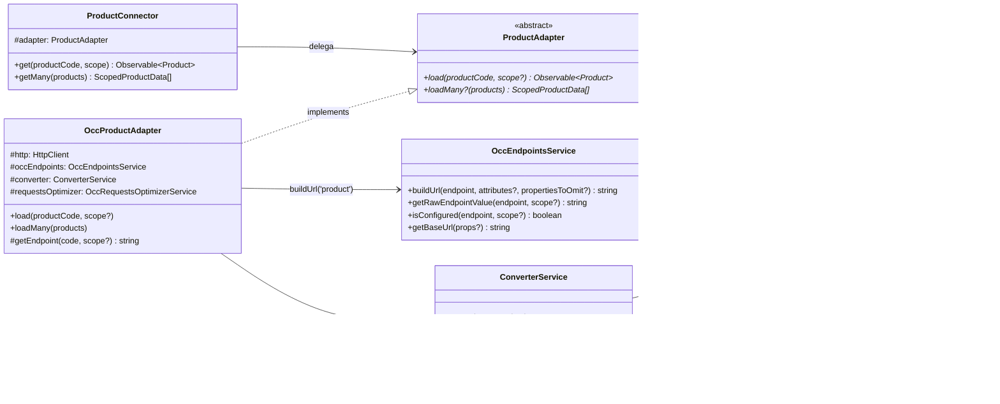
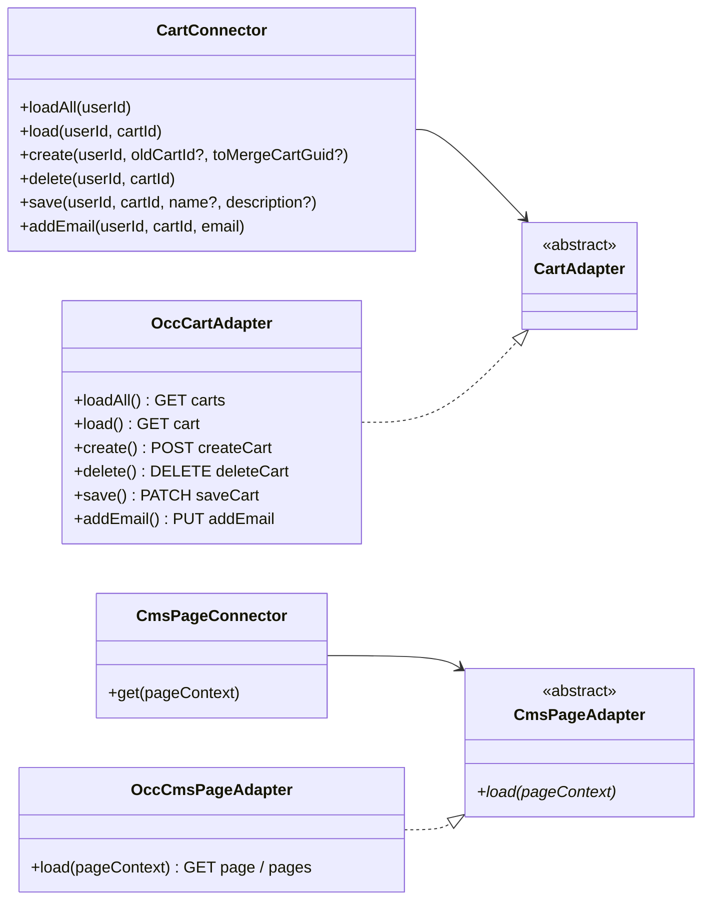
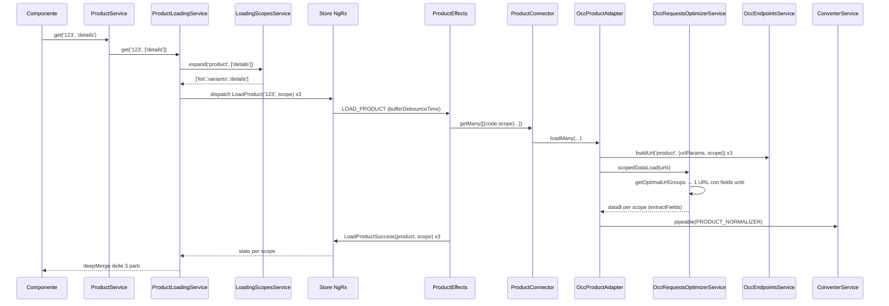

# 07 — Data layer OCC: Connector, Adapter, Converter ed endpoint

> Area F del deep dive. Codice di riferimento: repository alla versione `2611.0.0` (Angular 21.2).
> Tutti i path sono relativi alla radice del repo `/home/user/spartacus`.
> Quando un'affermazione non è verificabile nel codice è marcata **NON VERIFICATO NEL CODICE**.

## Indice

1. [In una frase](#1-in-una-frase)
2. [Il problema che risolve](#2-il-problema-che-risolve)
3. [Come è implementato (con path)](#3-come-è-implementato-con-path)
   - 3.1 Pattern Connector → Adapter → OccAdapter
   - 3.2 `Converter<S,T>` e `ConverterService`
   - 3.3 Token `XXX_NORMALIZER` / `XXX_SERIALIZER` (multi provider)
   - 3.4 `OccConfig`: dove vivono URL, prefix ed endpoint
   - 3.5 `OccEndpointsService`: da chiave a URL completo
   - 3.6 Scope: `OccEndpoint`, `ProductScope`, `LoadingScopesService`, `ScopedLoaderState`
   - 3.7 `OccFieldsService` e `OccRequestsOptimizerService`
   - 3.8 "Template dinamici": `StringTemplate` e `urlPathJoin`
   - 3.9 Caricamento della config del base site (`SiteContextConfigInitializer`, `BaseSiteService`)
   - 3.10 Interceptor HTTP legati a OCC
4. [Flusso passo-passo](#4-flusso-passo-passo)
5. [Codice minimo riscritto a mano](#5-codice-minimo-riscritto-a-mano)
6. [Errori comuni](#6-errori-comuni)
7. [Domande di autoverifica](#7-domande-di-autoverifica)
8. [Appendice A — Tabella completa degli endpoint OCC](#8-appendice-a--tabella-completa-degli-endpoint-occ)
9. [Assunzioni](#9-assunzioni)

---

## 1. In una frase

Spartacus non chiama mai il backend "a mano" dai componenti: un **Connector** (servizio stabile) delega a un **Adapter** astratto, la cui implementazione **OCC** costruisce l'URL con `OccEndpointsService.buildUrl('<chiave>')` a partire da una tabella di endpoint configurabile, esegue la chiamata con `HttpClient` e trasforma la risposta con una catena di **Converter** registrati su un `InjectionToken` multi-provider.

---

## 2. Il problema che risolve

Immagina di scrivere uno storefront che deve funzionare:

- con il backend standard SAP Commerce (API REST chiamate **OCC**, "Omni Commerce Connect", sotto `/occ/v2/<baseSite>/...`);
- con clienti che hanno endpoint personalizzati (campi `fields` diversi, path diversi, un gateway davanti);
- con backend completamente diversi (un altro e-commerce, un mock, un BFF).

Se i componenti o gli effect NgRx chiamassero `http.get('https://.../occ/v2/electronics/products/123?fields=...')` direttamente, ogni personalizzazione obbligherebbe a riscrivere codice di libreria. I problemi concreti sono quattro:

| Problema | Soluzione Spartacus | Dove |
|---|---|---|
| Cambiare backend senza toccare facade/store | Connector → Adapter astratto → implementazione intercambiabile via DI | es. `core-libs/core/src/product/connectors/product/product.connector.ts` (`ProductConnector`) |
| Il JSON del backend non coincide con il modello UI | Converter (normalizer / serializer) componibili | `core-libs/core/src/util/converter.service.ts` (`ConverterService`) |
| Path e `fields` diversi per cliente o per pagina | Endpoint in configurazione, con placeholder `${...}` e scope | `core-libs/core/src/occ/services/occ-endpoints.service.ts` (`OccEndpointsService`) |
| Troppe chiamate per lo stesso prodotto (lista, dettaglio, prezzo...) | Scope + unione dei `fields` in una sola chiamata | `core-libs/core/src/occ/services/occ-requests-optimizer.service.ts` (`OccRequestsOptimizerService`) |

In più, la configurazione di base (quale base site, quali lingue/valute) può essere **scaricata dal backend all'avvio** (`SiteContextConfigInitializer`), così la stessa build serve più siti.

---

## 3. Come è implementato (con path)

### 3.1 Pattern Connector → Adapter → OccAdapter

**1) Cos'è.** Tre livelli con responsabilità separate:

| Livello | Ruolo | Tipo | Esempio reale |
|---|---|---|---|
| Connector | Punto di ingresso stabile per facade/effect. Nessuna logica HTTP. | classe `@Injectable` concreta | `ProductConnector` in `core-libs/core/src/product/connectors/product/product.connector.ts` |
| Adapter | Contratto astratto ("cosa" serve, non "come") | `abstract class` usata come token DI | `ProductAdapter` in `core-libs/core/src/product/connectors/product/product.adapter.ts` |
| OccXxxAdapter | Implementazione per OCC: URL + `HttpClient` + converter | classe che `implements` l'adapter | `OccProductAdapter` in `core-libs/core/src/occ/adapters/product/occ-product.adapter.ts` |

Il collegamento avviene in un modulo "occ" con un provider `{ provide: ProductAdapter, useClass: OccProductAdapter }` (`core-libs/core/src/occ/adapters/product/product-occ.module.ts`, classe `ProductOccModule`).

**2) Perché.** La classe astratta funziona sia da **tipo** TypeScript sia da **token** di Dependency Injection. Chi vuole un backend diverso sostituisce solo il provider dell'adapter; connector, effect, facade e componenti restano identici. Il connector può anche aggiungere piccola logica "neutra" rispetto al backend (es. `ProductConnector.getMany` fa fallback su `load` se l'adapter non implementa `loadMany`; `CmsPageConnector.get` salta il backend se la pagina è definita in configurazione statica).

**3) Dove sta.** Convenzione di cartelle, verificata su più librerie:

| Feature | Connector | Adapter astratto | Implementazione OCC | Modulo che collega |
|---|---|---|---|---|
| Prodotto | `core-libs/core/src/product/connectors/product/product.connector.ts` (`ProductConnector`) | `.../product/product.adapter.ts` (`ProductAdapter`) | `core-libs/core/src/occ/adapters/product/occ-product.adapter.ts` (`OccProductAdapter`) | `core-libs/core/src/occ/adapters/product/product-occ.module.ts` (`ProductOccModule`) |
| Pagina CMS | `core-libs/core/src/cms/connectors/page/cms-page.connector.ts` (`CmsPageConnector`) | `.../page/cms-page.adapter.ts` (`CmsPageAdapter`) | `core-libs/core/src/occ/adapters/cms/occ-cms-page.adapter.ts` (`OccCmsPageAdapter`) | `core-libs/core/src/occ/adapters/cms/cms-occ.module.ts` (`CmsOccModule`, usa `useExisting`) |
| Site context | `core-libs/core/src/site-context/connectors/site.connector.ts` (`SiteConnector`) | `.../connectors/site.adapter.ts` (`SiteAdapter`) | `core-libs/core/src/occ/adapters/site-context/occ-site.adapter.ts` (`OccSiteAdapter`) | `core-libs/core/src/occ/adapters/site-context/site-context-occ.module.ts` |
| Carrello | `feature-libs/cart/base/core/connectors/cart/cart.connector.ts` (`CartConnector`) | `.../cart/cart.adapter.ts` (`CartAdapter`) | `feature-libs/cart/base/occ/adapters/occ-cart.adapter.ts` (`OccCartAdapter`) | `feature-libs/cart/base/occ/cart-base-occ.module.ts` |
| Checkout (indirizzo) | `feature-libs/checkout/base/core/connectors/checkout-delivery-address/checkout-delivery-address.connector.ts` (`CheckoutDeliveryAddressConnector`) | `.../checkout-delivery-address.adapter.ts` (`CheckoutDeliveryAddressAdapter`) | `feature-libs/checkout/base/occ/adapters/occ-checkout-delivery-address.adapter.ts` (`OccCheckoutDeliveryAddressAdapter`) | `feature-libs/checkout/base/occ/checkout-occ.module.ts` |

Nota: nelle feature-libs il pattern è diviso in **entry point** separati: `<lib>/core` (connector + adapter astratto), `<lib>/occ` (implementazione OCC + config endpoint), `<lib>/root` (modelli e token dei converter). Per esempio `CART_NORMALIZER` è importato da `@spartacus/cart/base/root` in `feature-libs/cart/base/occ/cart-base-occ.module.ts`.

Nota 2: non tutti i connector sono `providedIn: 'root'`. `CheckoutDeliveryAddressConnector` ha `@Injectable()` semplice ed è fornito nei `providers` di `feature-libs/checkout/base/core/checkout-core.module.ts`.





**4) Esempio minimo riscritto a mano.**

```typescript
// 1. contratto astratto = tipo + token DI
export abstract class ProductAdapter {
  abstract load(code: string, scope?: string): Observable<Product>;
}

// 2. connector: l'unico che facade/effect conoscono
@Injectable({ providedIn: 'root' })
export class ProductConnector {
  constructor(protected adapter: ProductAdapter) {}
  get(code: string, scope = ''): Observable<Product> {
    return this.adapter.load(code, scope);
  }
}

// 3. implementazione OCC
@Injectable()
export class OccProductAdapter implements ProductAdapter {
  constructor(
    protected http: HttpClient,
    protected endpoints: OccEndpointsService,
    protected converter: ConverterService
  ) {}
  load(code: string, scope?: string): Observable<Product> {
    const url = this.endpoints.buildUrl('product', {
      urlParams: { productCode: code },
      scope,
    });
    return this.http.get(url).pipe(this.converter.pipeable(PRODUCT_NORMALIZER));
  }
}

// 4. collegamento
@NgModule({
  providers: [{ provide: ProductAdapter, useClass: OccProductAdapter }],
})
export class ProductOccModule {}
```

---

### 3.2 `Converter<S,T>` e `ConverterService`

**1) Cos'è.** `Converter<SOURCE, TARGET>` è un'interfaccia con un solo metodo `convert(source, target?)` (`core-libs/core/src/util/converter.service.ts`). Il commento nel codice fissa la convenzione:

- **Normalize**: backend → modello UI (token `XXX_NORMALIZER`);
- **Serialize**: modello UI → backend (token `XXX_SERIALIZER`).

`ConverterService` (stesso file) applica **tutti** i converter registrati su un token, in catena.

**2) Perché.** Più librerie devono poter arricchire lo stesso oggetto senza conoscersi. Per esempio il core registra `ProductImageNormalizer` e `ProductNameNormalizer` sullo stesso `PRODUCT_NORMALIZER`; una feature lazy può aggiungerne un terzo. Il secondo parametro `target` implementa il pattern "populator": ogni converter riceve il risultato del precedente.

**3) Dove sta — metodo per metodo** (`core-libs/core/src/util/converter.service.ts`, classe `ConverterService`):

| Metodo | Cosa fa | Se non ci sono converter |
|---|---|---|
| `getConverters(token)` (private) | Legge i converter con `unifiedInjector.getMulti(token)` e `getLastValueSync`, li mette in cache in una `Map` | restituisce `undefined` |
| `hasConverters(token)` | `true` se l'array esiste e ha lunghezza > 0 | `false` |
| `convert(source, token)` | chiama `convertSource` | restituisce `source` così com'è (cast) |
| `convertMany(sources, token)` | `sources.map(convertSource)` se è un array | restituisce `sources` |
| `pipeable(token)` | operatore RxJS `map(model => convertSource(model))` | operatore identità |
| `pipeableMany(token)` | operatore RxJS `map(models => convertMany(models))` | operatore identità |
| `convertSource` (private) | `converters.reduce((target, c) => c.convert(source, target), undefined)` | — |

Dettagli importanti letti nel codice:

- **Ordine**: il `reduce` segue l'ordine dell'array restituito dall'injector, cioè l'ordine di registrazione dei multi provider. `UnifiedInjector.getMulti` (`core-libs/core/src/lazy-loading/unified-injector.ts`) fa `scan((acc, services) => [...acc, ...services], [])`: prima i provider del root injector, poi quelli dei moduli lazy caricati dopo.
- **Primo converter**: riceve `target = undefined`. Per questo i normalizer reali fanno `target = target ?? { ...source }` (vedi `ProductNameNormalizer.convert` in `core-libs/core/src/occ/adapters/product/converters/product-name-normalizer.ts`).
- **Stesso `source` per tutti**: ogni converter riceve sempre il JSON originale come `source` e il risultato parziale come `target`.
- **Cache invalidata**: nel costruttore, ogni emissione di `unifiedInjector.injectors$` svuota la mappa (`this.converters.clear()`), così un modulo lazy appena caricato aggiunge i suoi converter.
- **Errore di configurazione**: `getMulti` lancia `Multi-providers mixed with single providers for ...` se su un token di converter qualcuno ha dimenticato `multi: true`.

**4) Esempio minimo.**

```typescript
export interface Converter<S, T> {
  convert(source: S, target?: T): T;
}

@Injectable({ providedIn: 'root' })
export class MiniConverterService {
  constructor(private injector: Injector) {}

  private get<S, T>(token: InjectionToken<Converter<S, T>[]>) {
    return this.injector.get(token, []) as Converter<S, T>[];
  }

  convert<S, T>(source: S, token: InjectionToken<Converter<S, T>[]>): T {
    const list = this.get(token);
    if (!list.length) return source as unknown as T; // nessun converter: passa-through
    return list.reduce<T>((target, c) => c.convert(source, target), undefined as unknown as T);
  }

  pipeable<S, T>(token: InjectionToken<Converter<S, T>[]>): OperatorFunction<S, T> {
    return map((s: S) => this.convert(s, token));
  }
}
```

---

### 3.3 Token `XXX_NORMALIZER` / `XXX_SERIALIZER` (multi provider)

**1) Cos'è.** Un `InjectionToken<Converter<A, B>>` creato accanto all'adapter astratto, per esempio:

```typescript
// core-libs/core/src/product/connectors/product/converters.ts
export const PRODUCT_NORMALIZER = new InjectionToken<Converter<any, Product>>('ProductNormalizer');

// core-libs/core/src/user/connectors/address/converters.ts
export const ADDRESS_SERIALIZER = new InjectionToken<Converter<Address, any>>(/* ... */);
```

Conteggio fatto con grep sui sorgenti non-spec di `core-libs/core/src`, `feature-libs`, `integration-libs`: **107** dichiarazioni `*_NORMALIZER = new InjectionToken` e **35** `*_SERIALIZER = new InjectionToken`.

**2) Perché.** Il token è il punto di estensione: chiunque può registrare `{ provide: PRODUCT_NORMALIZER, useExisting: MioNormalizer, multi: true }` e il suo converter entra nella catena senza modificare Spartacus.

**3) Dove sta.** Registrazione reale in `core-libs/core/src/occ/adapters/product/product-occ.module.ts`:

```typescript
{ provide: PRODUCT_NORMALIZER, useExisting: ProductImageNormalizer, multi: true },
{ provide: PRODUCT_NORMALIZER, useExisting: ProductNameNormalizer,  multi: true },
```

Uso reale di un serializer in `core-libs/core/src/occ/adapters/user/occ-user-address.adapter.ts` (`OccUserAddressAdapter`): `address = this.converter.convert(address, ADDRESS_SERIALIZER);` prima della `post`/`patch`.

Uso di `pipeableMany`: `OccCartAdapter.loadAll` (`feature-libs/cart/base/occ/adapters/occ-cart.adapter.ts`) fa `this.converterService.pipeableMany(CART_NORMALIZER)`; `OccCmsComponentAdapter.findComponentsByIds` (`core-libs/core/src/occ/adapters/cms/occ-cms-component.adapter.ts`) fa `map(list => list.component ?? [])` e poi `pipeableMany(CMS_COMPONENT_NORMALIZER)`.

**4) Esempio minimo: aggiungere un campo calcolato a ogni prodotto.**

```typescript
@Injectable({ providedIn: 'root' })
export class DiscountBadgeNormalizer implements Converter<Occ.Product, Product> {
  convert(source: Occ.Product, target?: Product): Product {
    target = target ?? ({ ...source } as Product);
    // campo custom: il modello Product va esteso con module augmentation
    (target as any).hasDiscount = !!source.potentialPromotions?.length;
    return target;
  }
}

@NgModule({
  providers: [
    { provide: PRODUCT_NORMALIZER, useExisting: DiscountBadgeNormalizer, multi: true },
  ],
})
export class DiscountBadgeModule {}
```

---

### 3.4 `OccConfig`: dove vivono URL, prefix ed endpoint

**1) Cos'è.** `OccConfig` (`core-libs/core/src/occ/config/occ-config.ts`) è una classe astratta con `useExisting: Config`, quindi è una "vista tipizzata" della configurazione globale. Contiene `backend?: BackendConfig` con:

| Campo | Significato |
|---|---|
| `backend.occ.baseUrl` | host del backend, es. `https://api.example.com` |
| `backend.occ.prefix` | default `'/occ/v2/'` da `defaultOccConfig` (`core-libs/core/src/occ/config/default-occ-config.ts`) |
| `backend.occ.useWithCredentials` | se `true` il `WithCredentialsInterceptor` aggiunge `withCredentials` |
| `backend.occ.endpoints` | mappa chiave → template (`OccEndpoints`) |
| `backend.media.baseUrl` / `prefix` | per le immagini |
| `backend.loadingScopes` | regole sugli scope (vedi 3.6) |

L'interfaccia `OccEndpoints` è in `core-libs/core/src/occ/occ-models/occ-endpoints.model.ts`; ogni feature-lib la estende con **module augmentation**, per esempio `feature-libs/cart/base/occ/model/occ-cart-endpoints.model.ts` dichiara `CartOccEndpoints` e aggiunge le sue chiavi a `OccEndpoints` di `@spartacus/core`.

**2) Perché.** Gli endpoint sono dati, non codice: un cliente cambia `fields` o path con `provideConfig({ backend: { occ: { endpoints: { product: { details: '...' } } } } })` senza sottoclassare adapter.

**3) Dove sta — come si fondono le config.**

- Ogni modulo OCC registra i suoi default con `provideDefaultConfig(...)` o `provideDefaultConfigFactory(...)` (`core-libs/core/src/config/config-providers.ts`), che usano il token `DefaultConfigChunk`.
- `defaultConfigFactory()` in `core-libs/core/src/config/config-tokens.ts` fa `deepMerge({}, ...DefaultConfigChunk)`; `rootConfigFactory()` fa lo stesso con `ConfigChunk` (config dell'app); `configFactory()` unisce `deepMerge({}, DefaultConfig, RootConfig)`: **la config dell'app vince sui default**.
- Moduli lazy: `ConfigurationService` (`core-libs/core/src/config/services/configuration.service.ts`) ascolta `unifiedInjector.get(ConfigChunk)`/`get(DefaultConfigChunk)`, ricalcola la config (`emitUnifiedConfig`) e, se la feature `disableConfigUpdates` non è attiva, **muta l'oggetto `Config` globale** con `deepMerge(this.config, newConfig)`. Ecco perché `OccEndpointsService`, che tiene un riferimento a `OccConfig`, vede anche gli endpoint aggiunti da una feature lazy.
- Validazione: `occConfigValidator` (`core-libs/core/src/occ/config/occ-config-validator.ts`) restituisce il messaggio `Please configure backend.occ.baseUrl before using storefront library!` se manca `baseUrl`; è registrato in `BaseOccModule.forRoot()` (`core-libs/core/src/occ/base-occ.module.ts`).
- `baseUrl` da meta tag: `occServerConfigFromMetaTagFactory` (`core-libs/core/src/occ/config/config-from-meta-tag-factory.ts`) legge `<meta name="occ-backend-base-url">` e lo ignora se vale il segnaposto `OCC_BACKEND_BASE_URL_VALUE`.

**4) Esempio minimo.**

```typescript
// config dell'app (vince sui default)
provideConfig(<OccConfig>{
  backend: {
    occ: {
      baseUrl: 'https://api.mystore.com',
      prefix: '/occ/v2/',
      endpoints: {
        // sovrascrive solo lo scope "details" del default in default-occ-product-config.ts
        product: { details: 'products/${productCode}?fields=FULL' },
      },
    },
  },
});
```

---

### 3.5 `OccEndpointsService`: da chiave a URL completo

**1) Cos'è.** Il servizio `OccEndpointsService` (`core-libs/core/src/occ/services/occ-endpoints.service.ts`, `providedIn: 'root'`) traduce una chiave di endpoint in un URL assoluto.

API pubblica reale:

| Metodo | Firma | Cosa fa |
|---|---|---|
| `buildUrl` | `(endpoint: string, attributes?: DynamicAttributes, propertiesToOmit?: BaseOccUrlProperties): string` | template → sostituisce `urlParams` → aggiunge `queryParams` → antepone base |
| `getRawEndpointValue` | `(endpoint: string, scope?: string): string` | restituisce il template grezzo (senza base, senza sostituzioni) |
| `isConfigured` | `(endpoint: string, scope?: string): boolean` | `true` se la chiave (e lo scope) esistono in config |
| `getBaseUrl` | `(props?: BaseOccUrlProperties): string` | `baseUrl + prefix + baseSite` attivo, ciascuno omettibile |

Tipi: `DynamicAttributes { urlParams?: object; queryParams?: object; scope?: string }` e `BaseOccUrlProperties { baseUrl?: boolean; prefix?: boolean; baseSite?: boolean }` (stesso file).

> Un metodo `getEndpoint(...)` **non esiste** in questa versione: in `occ-endpoints.service.ts` non c'è nessuna funzione con quel nome. Esistono solo `getRawEndpointValue` e il privato `getEndpointForScope`. **NON VERIFICATO NEL CODICE** qualsiasi uso di `getEndpoint`/`getUrl` citato in documentazione di versioni vecchie.

**2) Perché.** Centralizza quattro cose che altrimenti ogni adapter ripeterebbe: prefisso `/occ/v2/`, base site corrente, encoding dei parametri, scelta dello scope.

**3) Dove sta — algoritmo di `buildUrl`, riga per riga.**

1. `getEndpointForScope(endpoint, attributes?.scope)` (privato):
   - legge `config.backend.occ.endpoints[endpoint]`;
   - se è richiesto uno scope e `endpointConfig[scope]` esiste → usa quello;
   - se lo scope è `'default'` (`DEFAULT_SCOPE`) e il valore è una stringa → usa la stringa;
   - altrimenti, in dev mode, `logger.warn('<endpoint> endpoint configuration missing for scope "<scope>"')` e **ricade** sul default;
   - default = la stringa, oppure `endpointConfig.default`, oppure, se non c'è niente, **il nome stesso della chiave** (`|| endpoint`).
2. Se ci sono `urlParams`: `StringTemplate.resolve(url, urlParams, true)` → ogni `${nome}` diventa `encodeURIComponent(valore)`.
3. Se ci sono `queryParams`:
   - se il template contiene già `?`, la parte dopo `?` diventa `fromString` di `HttpParams` (quindi i `fields` del template sono conservati);
   - `getHttpParamsFromQueryParams`: valori `undefined` ignorati, valori `null` **cancellano** il parametro (utile per togliere un `fields` di default), gli altri fanno `set`;
   - encoder `HttpParamsURIEncoder` (`core-libs/core/src/util/http-params-uri.encoder.ts`).
4. `buildUrlFromEndpointString`: `urlPathJoin(getBaseUrl(propertiesToOmit), url)`.

`getBaseUrl`:

- `baseUrl` = `config.backend.occ.baseUrl ?? ''`;
- `prefix` = `getPrefix()`, che aggiunge `/` iniziale se manca;
- `baseSite` = `activeBaseSite`: il valore emesso da `BaseSiteService.getActive()` (sottoscritto nel costruttore) oppure, prima che arrivi, `getContextParameterDefault(config, BASE_SITE_CONTEXT_ID)`.

Uso di `propertiesToOmit` nel codice reale:

- `OccSiteAdapter.loadBaseSites` (`core-libs/core/src/occ/adapters/site-context/occ-site.adapter.ts`): `buildUrl('baseSites', {}, { baseSite: false })` perché la lista dei siti si chiede **prima** di sapere il sito;
- `OccAsmAdapter` (`feature-libs/asm/occ/adapters/occ-asm.adapter.ts`): `{ baseSite: false, prefix: false }` perché gli endpoint ASM sono sotto `/assistedservicewebservices/...` e non sotto `/occ/v2/`.

Uso di `getRawEndpointValue`: `AuthHttpHeaderService.isBaseSitesRequest` (`core-libs/core/src/auth/user-auth/services/auth-http-header.service.ts`) controlla se `request.url.includes(getRawEndpointValue('baseSites'))`.

Uso di `isConfigured`: `OccUserProfileAdapter.update` e `.close` (`feature-libs/user/profile/occ/adapters/occ-user-profile.adapter.ts`) usano `userUpdateProfile`/`userCloseAccount` se configurati (lo fa la recipe B2B), altrimenti ripiegano su `user`.

**4) Esempio minimo.**

```typescript
// config: product.details = 'products/${productCode}?fields=averageRating,stock(DEFAULT),...'
// baseUrl = 'https://api.x.com', prefix = '/occ/v2/', baseSite attivo = 'electronics-spa'

occEndpoints.buildUrl('product', {
  urlParams: { productCode: 'A B/1' },
  queryParams: { lang: 'it', fields: null }, // null toglie fields
  scope: 'details',
});
// → 'https://api.x.com/occ/v2/electronics-spa/products/A%20B%2F1?lang=it'
```

---

### 3.6 Scope: `OccEndpoint`, `ProductScope`, `LoadingScopesService`, `ScopedLoaderState`

**1) Cos'è.** Uno **scope** è un nome ("list", "details", "price"...) che indica **quanta parte** di un'entità serve. Lo stesso endpoint può avere un template diverso per scope:

```typescript
// core-libs/core/src/occ/occ-models/occ-endpoints.model.ts
export const DEFAULT_SCOPE = 'default';
export interface OccEndpoint { default?: string; [scope: string]: string | undefined; }
export interface ProductOccEndpoint extends OccEndpoint {
  list?: string; details?: string; attributes?: string; variants?: string;
}
// product?: string | ProductOccEndpoint;
```

`ProductScope` (`core-libs/core/src/product/model/product-scope.ts`) è un enum: `LIST`, `DETAILS`, `ATTRIBUTES`, `VARIANTS`, `CODE`, `PRICE`, `STOCK`, `UNIT`, `PROMOTIONS`, `LIST_ITEM`, `MULTI_DIMENSIONAL`, `MULTI_DIMENSIONAL_AVAILABILITY`. Le feature aggiungono scope come stringhe (es. `configurator`, `configuratorProductCard`, `bulkPrices`, `subscription` — vedi tabella in Appendice).

**2) Perché.** In una lista prodotti bastano codice, nome, prezzo e immagine; nella pagina di dettaglio servono descrizione, stock, classificazioni. Caricare sempre tutto costa banda e tempo; caricare con chiamate separate per ogni widget moltiplica le richieste. Gli scope permettono di chiedere "solo quello che serve" e di **riusare** i dati già scaricati per uno scope.

**3) Dove sta.**

| Pezzo | Path e simbolo | Ruolo |
|---|---|---|
| Regole scope | `core-libs/core/src/occ/config/loading-scopes-config.ts` (`LoadingScopes`, `LoadingScopeConfig { include?, maxAge?, reloadOn? }`) | configurazione |
| Tipi prodotto | `core-libs/core/src/occ/adapters/product/product-occ-config.ts` (`ProductScopesConfig`, augmentation di `LoadingScopes.product`) | type-safety |
| Default | `defaultOccProductConfig.backend.loadingScopes.product.details.include = [ProductScope.LIST, ProductScope.VARIANTS]` in `core-libs/core/src/occ/adapters/product/default-occ-product-config.ts` | "details" porta con sé "list" e "variants" |
| Espansione | `LoadingScopesService.expand(model, scopes)` in `core-libs/core/src/occ/services/loading-scopes.service.ts` | inserisce gli scope inclusi **prima** dello scope che li include |
| Scadenza/ricarico | `LoadingScopesService.getMaxAge` (secondi → ms), `getReloadTriggers` (eventi `CxEvent`) | stesso file |
| Stato NgRx | `ScopedLoaderState<T> { [scope]: LoaderState<T> }` e `EntityScopedLoaderState<T>` in `core-libs/core/src/state/utils/scoped-loader/scoped-loader.state.ts` | uno stato loading/success/error per scope |
| Uso nello store prodotto | `ProductsState.details: EntityScopedLoaderState<Product>` in `core-libs/core/src/product/store/product-state.ts` | `[codice][scope]` |
| Orchestrazione | `ProductLoadingService.get(code, scopes)` in `core-libs/core/src/product/services/product-loading.service.ts` | espande, crea un observable per scope, fonde con `deepMerge` |
| Effect | `ProductEffects.loadProduct$` in `core-libs/core/src/product/store/effects/product.effect.ts` | `bufferDebounceTime` raccoglie le `LOAD_PRODUCT` e chiama `productConnector.getMany` |

Come `ProductLoadingService` compone gli scope:

- `get` → `loadingScopes.expand('product', scopes)` → `initProductScopes`;
- per ogni scope crea (una volta sola, in cache `this.products[code][scope]`) un observable che fa dispatch di `new ProductActions.LoadProduct(code, scope)` solo se lo stato non è né loading né success né error;
- se gli scope sono più di uno, crea un observable combinato con `uniteLatest(...)` e `deepMerge({}, ...productParts)`, emesso solo quando **tutte** le parti ci sono (`productParts.every(Boolean)`); chiave di cache `scopes.join('ɵ')`.

**4) Esempio minimo.**

```typescript
// config: uno scope custom "tile" con campi minimi, che include "price"
provideConfig(<OccConfig>{
  backend: {
    occ: { endpoints: { product: { tile: 'products/${productCode}?fields=code,name,images(DEFAULT)' } } },
    loadingScopes: { product: { tile: { include: ['price'], maxAge: 60 } } },
  },
});

// in un componente
this.product$ = this.productService.get(code, 'tile');
// expand('product', ['tile']) → ['price', 'tile']
// → due LoadProduct (scope price e tile), che OccProductAdapter.loadMany può fondere in UNA chiamata
```

---

### 3.7 `OccFieldsService` e `OccRequestsOptimizerService`

**1) Cos'è.** Due servizi che **uniscono** richieste allo stesso URL che differiscono solo per il parametro `fields`, fanno una sola chiamata e poi "ritagliano" la risposta per ogni scope.

- `OccFieldsService.getOptimalUrlGroups(models: ScopedDataWithUrl[])` (`core-libs/core/src/occ/services/occ-fields.service.ts`);
- `OccRequestsOptimizerService.scopedDataLoad<T>(scopedDataWithUrls, dataFactory?)` (`core-libs/core/src/occ/services/occ-requests-optimizer.service.ts`);
- funzioni pure in `core-libs/core/src/occ/utils/occ-fields.ts`: `parseFields`, `mergeFields`, `optimizeFields`, `stringifyFields`, `extractFields`.

**2) Perché.** Se nello stesso "tick" la pagina chiede il prodotto `123` con scope `list`, `details` e `variants`, senza ottimizzazione partirebbero tre GET a `products/123?fields=...`. Con l'ottimizzatore ne parte una sola con i `fields` uniti.

**3) Dove sta — algoritmo.**

1. `splitFields(url)` (privato): separa `fields` dagli altri query param; gli altri vengono **ordinati** e restano nella chiave di raggruppamento.
2. Gruppi per URL senza `fields`; per ogni modello `model.fields = parseFields(fields)` (stringa → albero, es. `a,b(c)` → `{ a: {}, b: { c: {} } }`).
3. `getUrlWithFields(url, fields[])` → `mergeFields` → `deepMerge` degli alberi → `optimizeFields` (se c'è `FULL` toglie `DEFAULT` e `BASIC`; se c'è `DEFAULT` toglie `BASIC`) → `stringifyFields`.
4. `scopedDataLoad`: se un URL copre un solo scope, passa `dataFactory(url)` (default `http.get`); se ne copre più di uno, fa `shareReplay(1)` e per ogni scope `map(data => extractFields(data, modelData.fields))`. `extractFields` **non ritaglia** quando i fields contengono `BASIC`, `DEFAULT` o `FULL` (ambigui) e restituisce l'oggetto intero.

Usi reali:

- `OccProductAdapter.loadMany` → `requestsOptimizer.scopedDataLoad<Occ.Product>(...)`;
- `OccQuoteAdapter.getQuoteEndpoint` (`feature-libs/quote/occ/adapters/occ-quote.adapter.ts`) unisce `getQuote` e `getOrderCode` con `occFieldsService.getOptimalUrlGroups` quando `orderConfig.showOrderQuoteLink` è attivo;
- `OccOrderHistoryAdapter.getOrderDetailUrl` (`feature-libs/order/occ/adapters/occ-order-history.adapter.ts`) unisce `orderDetail` e `quoteCode` allo stesso modo.

**4) Esempio minimo.**

```typescript
const groups = occFieldsService.getOptimalUrlGroups([
  { url: 'https://x/occ/v2/s/products/1?fields=code,name', scopedData: { scope: 'list' } },
  { url: 'https://x/occ/v2/s/products/1?fields=price(value)', scopedData: { scope: 'price' } },
]);
// Object.keys(groups) → ['https://x/occ/v2/s/products/1?fields=code,name,price(value)']
// groups[url].list.fields  → { code: {}, name: {} }
// groups[url].price.fields → { price: { value: {} } }
```

---

### 3.8 "Template dinamici": `StringTemplate` e `urlPathJoin`

**1) Cos'è.** Il meccanismo dei placeholder `${nome}` negli endpoint. Non esiste una classe chiamata `DynamicTemplate`: una ricerca in `core-libs/core/src` non trova nessun simbolo con quel nome (**NON VERIFICATO NEL CODICE** come concetto separato). Il lavoro è fatto da:

- `StringTemplate.resolve(template, variables, encodeVariable?)` in `core-libs/core/src/config/utils/string-template.ts`: per ogni chiave di `variables` crea `new RegExp('\\${' + chiave + '}', 'g')` e sostituisce, con `encodeURIComponent` se `encodeVariable` è `true` (in `buildUrl` è sempre `true`);
- `urlPathJoin(...parts)` in `core-libs/core/src/occ/utils/occ-url-util.ts`: scarta le parti vuote, toglie gli slash iniziali e finali di ogni parte, unisce con `/`, conserva lo slash iniziale della prima parte e quello finale dell'ultima.

**2) Perché.** Il template è una stringa semplice da sovrascrivere in config; l'encoding automatico evita bug con codici prodotto che contengono `/`, spazi o `#`.

**3) Dove sta — conseguenze pratiche.**

- Un placeholder **non** fornito in `urlParams` resta nel testo come `${nome}`: nessun errore.
- Si possono sostituire solo variabili presenti come chiavi di `urlParams`; parametri extra sono ignorati.
- Diversi template di default iniziano con `/` (es. `'/users/${userId}/budgets'` in `feature-libs/organization/administration/occ/config/default-occ-organization-config.ts`); `urlPathJoin` normalizza, quindi il risultato è identico a quello senza slash.
- Alcuni template usano backtick con `\${...}` per non farli interpretare da TypeScript (es. `unitLevelOrderHistory` in `feature-libs/organization/unit-order/occ/config/default-occ-organization-config.ts`).

**4) Esempio minimo.**

```typescript
function resolve(tpl: string, vars: Record<string, unknown>): string {
  for (const k of Object.keys(vars)) {
    tpl = tpl.replace(new RegExp('\\${' + k + '}', 'g'), encodeURIComponent(String(vars[k])));
  }
  return tpl;
}
function join(...parts: string[]): string {
  const clean = parts.filter(Boolean).map((p) => p.replace(/^\/|\/$/g, ''));
  const first = parts.find(Boolean)?.startsWith('/') ? '/' : '';
  return first + clean.join('/');
}
join('https://x', '/occ/v2/', 'electronics', resolve('products/${code}', { code: 'a/b' }));
// → 'https://x/occ/v2/electronics/products/a%2Fb'
```

---

### 3.9 Caricamento della config del base site

**1) Cos'è.** All'avvio, se l'app **non** ha configurato staticamente `context.baseSite`, Spartacus scarica la lista dei base site da OCC, trova quello il cui `urlPatterns` corrisponde all'URL corrente e ne ricava `baseSite`, lingue, valute, tema e parametri URL.

Sul nome `OccConfigLoaderService`: nel codice di runtime **non esiste**. Il nome compare solo come costante in `core-libs/schematics/src/shared/constants.ts` (`OCC_CONFIG_LOADER_SERVICE = 'OccConfigLoaderService'`, `OCC_CONFIG_LOADER_MODULE`), usata per le migrazioni. Il suo ruolo è oggi svolto da `SiteContextConfigInitializer`. **NON VERIFICATO NEL CODICE** qualunque API di `OccConfigLoaderService`.

**2) Perché.** Una sola build per più siti (es. `electronics-spa` e `apparel-uk-spa`) distinti dal dominio o dal path; lingue e valute arrivano dal backend e non vanno duplicate in config.

**3) Dove sta.**

| Pezzo | Path e simbolo |
|---|---|
| Contratto | `ConfigInitializer { scopes: string[]; configFactory: () => Promise<Config> }` e token multi `CONFIG_INITIALIZER` in `core-libs/core/src/config/config-initializer/config-initializer.ts` |
| Esecuzione | `ConfigInitializerService` in `core-libs/core/src/config/config-initializer/config-initializer.service.ts` (`getStable(...scopes)` restituisce la config quando gli scope sono pronti); `APP_INITIALIZER` registrato in `config-initializer.module.ts` |
| Condizione | `initSiteContextConfig(configInitializer, config)` in `core-libs/core/src/site-context/site-context.module.ts`: restituisce l'initializer solo se `!config.context?.[BASE_SITE_CONTEXT_ID]`, altrimenti `null` |
| Initializer | `SiteContextConfigInitializer` in `core-libs/core/src/site-context/config/config-loader/site-context-config-initializer.ts`: `scopes = ['context']`, `configFactory = () => lastValueFrom(this.resolveConfig())` |
| Dati | `BaseSiteService.getAll()` in `core-libs/core/src/site-context/facade/base-site.service.ts`: seleziona dallo store e, se vuoto, fa dispatch di `SiteContextActions.LoadBaseSites()` |
| Chiamata HTTP | `OccSiteAdapter.loadBaseSites()` → `buildUrl('baseSites', {}, { baseSite: false })` → `basesites?fields=FULL` |

Passi dentro `resolveConfig()`:

1. `baseSiteService.getAll()`;
2. URL corrente da `WindowRef.location.href`; se `FederatedLoginService.enabled` e siamo sul dominio di login, usa `federatedLoginService.origin`;
3. `isCurrentBaseSite`: converte ogni regex Java di `site.urlPatterns` con `JavaRegExpConverter.toJsRegExp` e la testa sull'URL;
4. se nessun sito corrisponde lancia `Error: Cannot get base site config! Current url (...) doesn't match any of url patterns of any base sites.`;
5. `getConfig(baseSite)` produce `context: { urlParameters, baseSite: [uid], language: [...], currency: [...], theme: [...] }`. `getUrlParams` traduce `storefront` (nome OCC) in `baseSite` (nome Spartacus); `getIsoCodes` mette per primo il default.

**4) Esempio minimo.**

```typescript
@Injectable({ providedIn: 'root' })
export class MiniSiteInitializer implements ConfigInitializer {
  readonly scopes = ['context'];
  readonly configFactory = () =>
    lastValueFrom(
      this.http.get<{ baseSites: BaseSite[] }>('https://x/occ/v2/basesites?fields=FULL').pipe(
        map(({ baseSites }) => {
          const site = baseSites.find((s) =>
            (s.urlPatterns ?? []).some((p) => new RegExp(p).test(location.href))
          );
          if (!site) throw new Error('no base site');
          return { context: { baseSite: [site.uid!] } } as Config;
        })
      )
    );
  constructor(private http: HttpClient) {}
}
// provideConfigInitializer(MiniSiteInitializer)
```

---

### 3.10 Interceptor HTTP legati a OCC

| Interceptor | Path | Cosa fa |
|---|---|---|
| `SiteContextInterceptor` | `core-libs/core/src/occ/adapters/site-context/site-context.interceptor.ts` | se `request.url.includes(occEndpoints.getBaseUrl())` aggiunge i parametri `lang` e `curr` attivi (da `LanguageService` e `CurrencyService`) |
| `WithCredentialsInterceptor` | `core-libs/core/src/occ/interceptors/with-credentials.interceptor.ts` | aggiunge `withCredentials: true` quando configurato; registrato in `BaseOccModule.forRoot()` |
| `AuthHttpHeaderService` (usato dall'interceptor auth) | `core-libs/core/src/auth/user-auth/services/auth-http-header.service.ts` | `isOccUrl` usa `getBaseUrl()`; `isBaseSitesRequest` usa `getRawEndpointValue('baseSites')` |
| `HttpErrorHandlerInterceptor` | `core-libs/core/src/error-handling/http-error-handler/http-error-handler.interceptor.ts` | usa `buildUrl('pages', ...)` per riconoscere la richiesta di pagina CMS |

Conseguenza: i parametri `lang`/`curr` **non** stanno nei template degli endpoint, li aggiunge l'interceptor.

---

## 4. Flusso passo-passo

### 4.1 Caricamento di un prodotto (scope `details`)



1. Il componente chiama `ProductService.get(code, scopes)` (`core-libs/core/src/product/facade/product.service.ts`), che delega a `ProductLoadingService.get`.
2. `LoadingScopesService.expand` aggiunge gli scope inclusi (`details` → `list`, `variants` con i default).
3. Per ogni scope non ancora caricato parte `ProductActions.LoadProduct(code, scope)`.
4. `ProductEffects.loadProduct$` bufferizza le azioni emesse insieme (`bufferDebounceTime`) e chiama `ProductConnector.getMany`.
5. `OccProductAdapter.loadMany` costruisce un URL per scope con `buildUrl('product', { urlParams: { productCode }, scope })`.
6. `OccRequestsOptimizerService.scopedDataLoad` unisce gli URL uguali tranne `fields` e fa una sola GET.
7. Ogni `data$` passa da `converter.pipeable(PRODUCT_NORMALIZER)` (immagini, nome/slug...).
8. L'effect emette `LoadProductSuccess` o `LoadProductFail` per scope; `withdrawOn(contextChange$)` annulla tutto se cambiano lingua o valuta.
9. `ProductLoadingService` unisce le parti con `deepMerge` e le emette al componente.

### 4.2 Aggiunta al carrello (scrittura)

1. La facade del carrello fa dispatch di un'azione di aggiunta; l'effect `CartEntryEffects` (`feature-libs/cart/base/core/store/effects/cart-entry.effect.ts`) chiama `CartEntryConnector.add(...)` (`feature-libs/cart/base/core/connectors/entry/cart-entry.connector.ts`, fornito in `cart-base-core.module.ts`). Il nome esatto dell'azione e del metodo della facade è **NON VERIFICATO NEL CODICE** in questa analisi.
2. `OccCartEntryAdapter` (`feature-libs/cart/base/occ/adapters/occ-cart-entry.adapter.ts`) fa `buildUrl('addEntries', { urlParams: { userId, cartId, quantity } })` e `http.post<CartModification>(url, toAdd, { headers })`.
3. Con la recipe B2B, `addEntries` è sovrascritto in `core-libs/setup/recipes/b2b/config/default-b2b-occ-config.ts` con `orgUsers/${userId}/carts/${cartId}/entries?quantity=${quantity}`: stessa chiave, stesso adapter, URL diverso.

### 4.3 Avvio con base site da backend

1. `SiteContextModule.forRoot()` registra `CONFIG_INITIALIZER` con `initSiteContextConfig`.
2. Se `context.baseSite` non è in config, `SiteContextConfigInitializer.configFactory` parte durante `APP_INITIALIZER`.
3. `BaseSiteService.getAll()` → `LoadBaseSites` → `OccSiteAdapter.loadBaseSites()` → GET `<baseUrl>/occ/v2/basesites?fields=FULL` (senza base site nell'URL).
4. Si sceglie il sito con `urlPatterns`, si produce `context`, la config diventa stabile.
5. `OccEndpointsService` riceve il base site attivo da `BaseSiteService.getActive()` e da qui in poi tutti gli URL contengono `/<baseSite>/`.

---

## 5. Codice minimo riscritto a mano

Una mini feature "Wishlist" completa, scritta seguendo il pattern (ispirata a `feature-libs/user/wishlist/occ/adapters/occ-user-wishlist.adapter.ts`, ma riscritta da zero per chiarezza).

```typescript
// ---------- modelli ----------
export interface Wishlist { id: string; name: string; entries: WishlistEntry[] }
export interface WishlistEntry { entryId: string; productCode: string }
export namespace OccWish {
  export interface Wishlist { code: string; name?: string; entries?: { pk: string; product: { code: string } }[] }
}

// ---------- token dei converter (entry point "root") ----------
export const WISHLIST_NORMALIZER = new InjectionToken<Converter<OccWish.Wishlist, Wishlist>>(
  'WishlistNormalizer'
);

// ---------- augmentation degli endpoint (entry point "occ") ----------
declare module '@spartacus/core' {
  interface OccEndpoints {
    myWishlists?: string | OccEndpoint;
    myWishlistEntry?: string | OccEndpoint;
  }
}

export const defaultOccMyWishlistConfig: OccConfig = {
  backend: {
    occ: {
      endpoints: {
        myWishlists: 'users/${userId}/wishlists',
        myWishlistEntry: 'users/${userId}/wishlists/${wishlistId}/entries/${entryId}',
      },
    },
  },
};

// ---------- adapter astratto + connector (entry point "core") ----------
export abstract class MyWishlistAdapter {
  abstract loadAll(userId: string): Observable<Wishlist[]>;
  abstract removeEntry(userId: string, wishlistId: string, entryId: string): Observable<unknown>;
}

@Injectable({ providedIn: 'root' })
export class MyWishlistConnector {
  constructor(protected adapter: MyWishlistAdapter) {}
  loadAll(userId: string) { return this.adapter.loadAll(userId); }
  removeEntry(userId: string, wishlistId: string, entryId: string) {
    return this.adapter.removeEntry(userId, wishlistId, entryId);
  }
}

// ---------- normalizer ----------
@Injectable({ providedIn: 'root' })
export class OccMyWishlistNormalizer implements Converter<OccWish.Wishlist, Wishlist> {
  convert(source: OccWish.Wishlist, target?: Wishlist): Wishlist {
    target = target ?? { id: '', name: '', entries: [] };
    target.id = source.code;
    target.name = source.name ?? '';
    target.entries = (source.entries ?? []).map((e) => ({ entryId: e.pk, productCode: e.product.code }));
    return target;
  }
}

// ---------- implementazione OCC ----------
@Injectable()
export class OccMyWishlistAdapter implements MyWishlistAdapter {
  constructor(
    protected http: HttpClient,
    protected occEndpoints: OccEndpointsService,
    protected converter: ConverterService
  ) {}

  loadAll(userId: string): Observable<Wishlist[]> {
    const url = this.occEndpoints.buildUrl('myWishlists', { urlParams: { userId } });
    return this.http
      .get<{ wishlists: OccWish.Wishlist[] }>(url)
      .pipe(
        map((res) => res.wishlists ?? []),
        this.converter.pipeableMany(WISHLIST_NORMALIZER)
      );
  }

  removeEntry(userId: string, wishlistId: string, entryId: string): Observable<unknown> {
    const url = this.occEndpoints.buildUrl('myWishlistEntry', {
      urlParams: { userId, wishlistId, entryId },
    });
    return this.http.delete(url);
  }
}

// ---------- modulo che collega tutto ----------
@NgModule({
  providers: [
    provideDefaultConfig(defaultOccMyWishlistConfig),
    { provide: MyWishlistAdapter, useClass: OccMyWishlistAdapter },
    { provide: WISHLIST_NORMALIZER, useExisting: OccMyWishlistNormalizer, multi: true },
  ],
})
export class MyWishlistOccModule {}
```

Per usare un backend diverso basta un secondo modulo:

```typescript
@Injectable()
export class MockWishlistAdapter implements MyWishlistAdapter {
  loadAll() { return of([{ id: 'w1', name: 'Mock', entries: [] }]); }
  removeEntry() { return of({}); }
}
@NgModule({ providers: [{ provide: MyWishlistAdapter, useClass: MockWishlistAdapter }] })
export class MyWishlistMockModule {}
```

Test unitario minimo dell'URL (senza backend):

```typescript
it('costruisce l\'URL con base site e encoding', () => {
  const url = occEndpoints.buildUrl('myWishlistEntry', {
    urlParams: { userId: 'current', wishlistId: 'w 1', entryId: '7' },
  });
  expect(url).toBe('https://x/occ/v2/electronics-spa/users/current/wishlists/w%201/entries/7');
});
```

---

## 6. Errori comuni

1. **Dimenticare `multi: true` su un normalizer.** `UnifiedInjector.getMulti` lancia `Multi-providers mixed with single providers for ...` (`core-libs/core/src/lazy-loading/unified-injector.ts`). Se invece c'è un solo provider non-multi e nessun altro, si sovrascrive l'intera catena.
2. **Normalizer che ignora `target`.** Se il secondo converter fa `return { ...source, x }` invece di partire da `target`, butta via il lavoro del primo (es. slug creato da `ProductNameNormalizer`). Regola: `target = target ?? {...source}`.
3. **Aspettarsi l'errore per un endpoint mancante.** `getEndpointForScope` ricade sul **nome della chiave** (`|| endpoint`): un typo in `buildUrl('prodcut')` produce un URL tipo `.../electronics/prodcut` senza eccezioni.
4. **Scope inesistente.** Se lo scope non esiste, `buildUrl` usa il default e in dev mode logga solo un warning (`endpoint configuration missing for scope`). I dati arrivano, ma con i `fields` sbagliati.
5. **Mettere `lang`/`curr` nel template.** Li aggiunge già `SiteContextInterceptor`; metterli anche nel template li duplica.
6. **Endpoint fuori da `/occ/v2/<site>`.** Senza `{ baseSite: false, prefix: false }` in `buildUrl` l'URL avrà prefisso e sito (vedi come fa `OccAsmAdapter`).
7. **Override parziale di un endpoint con scope.** Scrivere `product: 'products/${productCode}'` (stringa) in config applicativa, con `deepMerge`, sostituisce l'**oggetto** con una stringa: tutti gli scope (`list`, `details`...) spariscono e ricadono sulla stringa. Per cambiare un solo scope bisogna scrivere `product: { details: '...' }`.
8. **Collisione di chiavi tra librerie.** Le chiavi vivono in un'unica mappa `OccEndpoints`. Nel codice attuale `downloadAttachment` è definito sia in `feature-libs/quote/occ/config/default-occ-quote-config.ts` (`users/${userId}/quotes/${quoteCode}/attachments/${attachmentId}`) sia in `feature-libs/customer-ticketing/occ/config/default-occ-customer-ticketing-config.ts` (`/users/${customerId}/tickets/.../attachments/${attachmentId}`), ed entrambi gli adapter chiamano `buildUrl('downloadAttachment', ...)`. Con entrambe le feature caricate vince l'ultimo default fuso (ordine di caricamento). Il comportamento in esecuzione con le due feature insieme è **NON VERIFICATO NEL CODICE** (dipende dall'ordine dei chunk).
9. **Override "a strati" involontari.** Più file sovrascrivono la stessa chiave: `cart`/`carts`/`createCart` sono ridefiniti da `estimated-delivery-date`, `opf/gift-card` e `opf/global-functions`; `placePaymentAuthorizedOrder` da `opf/b2b-checkout` e `opf/gift-card`; `getCheckoutDetails` da `checkout/b2b` e `s4-service/checkout`. Il valore finale dipende da quali librerie sono installate: quando si personalizza, controllare la tabella in Appendice.
10. **Contare su `extractFields` con `DEFAULT`/`FULL`.** Se i `fields` contengono `BASIC`, `DEFAULT` o `FULL`, `extractFields` restituisce l'oggetto intero: gli scope uniti possono ricevere più dati del previsto.
11. **Chiamare `OccEndpointsService.getEndpoint`.** Non esiste in questa versione: usare `buildUrl` o `getRawEndpointValue`.
12. **Iniettare `ConverterService` e poi fare `new` di un normalizer.** Si perdono i converter aggiunti da altre librerie: passare sempre dal token.
13. **Config statica di `context.baseSite` in un'app multi-sito.** `initSiteContextConfig` salta del tutto il caricamento dal backend se `context.baseSite` è configurato.
14. **Chiavi non tipizzate.** La wishlist (`feature-libs/user/wishlist/occ/adapters/config/default-occ-user-wishlist-endpoint.config.ts`) aggira il tipo con `} as any,`: le sue chiavi non sono nell'interfaccia `OccEndpoints` e il compilatore non segnala i typo.

---

## 7. Domande di autoverifica

1. Perché `ProductAdapter` è una `abstract class` e non una `interface`?
   *Risposta:* un'interfaccia TypeScript sparisce a runtime e non può fare da token DI; la classe astratta sì.
2. Che cosa restituisce `ConverterService.convert(x, TOKEN)` se nessuno ha registrato converter su `TOKEN`?
   *Risposta:* `x` invariato (passa-through, `hasConverters` è `false`).
3. In che ordine vengono eseguiti tre normalizer sullo stesso token, due nel root e uno in un modulo lazy?
   *Risposta:* i due del root nell'ordine dei provider, poi quello lazy (`scan` in `UnifiedInjector.getMulti`); il `reduce` in `convertSource` passa il `target` dall'uno all'altro.
4. Qual è la differenza tra `pipeable` e `pipeableMany`?
   *Risposta:* il primo converte un singolo oggetto emesso dall'observable, il secondo un array (usa `convertMany`).
5. `buildUrl('product', { scope: 'nonEsiste' })`: cosa succede?
   *Risposta:* usa `product.default`; in dev mode logga un warning.
6. Come si toglie il parametro `fields` presente nel template da una singola chiamata?
   *Risposta:* `queryParams: { fields: null }` (in `getHttpParamsFromQueryParams` `null` fa `delete`).
7. Perché `OccSiteAdapter.loadBaseSites` passa `{ baseSite: false }`?
   *Risposta:* la lista dei siti serve per scoprire il sito: non si può mettere un sito nell'URL.
8. Cosa fa `LoadingScopesService.expand('product', ['details'])` con la config di default?
   *Risposta:* restituisce `['list', 'variants', 'details']`: gli scope inclusi vengono inseriti prima.
9. Quando `OccRequestsOptimizerService` fa una sola chiamata per due scope?
   *Risposta:* quando i due URL coincidono dopo aver tolto `fields` (e ordinato gli altri parametri).
10. Dove si decide se caricare la config del base site dal backend?
    *Risposta:* `initSiteContextConfig` in `core-libs/core/src/site-context/site-context.module.ts`.
11. Perché un endpoint aggiunto da un modulo lazy è visibile a `OccEndpointsService` creato prima?
    *Risposta:* `ConfigurationService.emitUnifiedConfig` muta l'oggetto `Config` globale con `deepMerge` (se `disableConfigUpdates` non è attivo).
12. Come cambi l'URL di aggiunta al carrello per un backend B2B senza toccare l'adapter?
    *Risposta:* ridefinendo la chiave `addEntries` in config, come fa `defaultB2bOccConfig`.
13. Cosa succede se scrivi `buildUrl('prodcut')` (typo)?
    *Risposta:* nessuna eccezione: `getEndpointForScope` non trova la chiave e usa la stringa `'prodcut'` come path, quindi l'URL diventa `<base>/prodcut` e il server risponde con un errore (presumibilmente 404, dipende dal backend).
14. Quanti endpoint OCC distinti definisce la configurazione di default di tutte le librerie?
    *Risposta:* 245 chiavi distinte, 263 coppie chiave+scope, 279 definizioni totali contando gli override (vedi Appendice A).

---

## 8. Appendice A — Tabella completa degli endpoint OCC

### 8.1 Come è stata costruita

- **Fonte dei nomi e dei path**: tutti i file `.ts` non-spec sotto `core-libs/core`, `core-libs/setup`, `feature-libs`, `integration-libs` che contengono il blocco `endpoints: {` dentro una `OccConfig` (51 file). Esclusi `node_modules`, `dist`, i file `*.spec.ts`, le config schematics e le 4 config `opf-api` (che usano `OpfApiConfig`, non `OccConfig`: vedi 8.4).
- **Metodo HTTP**: dedotto cercando `buildUrl('<chiave>'` negli adapter e il `http.get/post/put/patch/delete` nel metodo che usa quell'URL (o nel metodo che chiama l'helper `getXxxEndpoint`). Più metodi separati da virgola = lo stesso endpoint è usato con più verbi (es. `addresses`: GET per la lista, POST per creare). `(da verificare)` = nessun `buildUrl` trovato con quella chiave: il metodo indicato è il più probabile.
- **Path template**: valore di default nel file config. I template più lunghi di 95 caratteri sono **troncati con `…`** (quasi sempre dentro `fields=`): il valore completo è nel file indicato.
- **Scope**: `—` significa che il valore è una stringa semplice (equivale allo scope `default`). Un valore nella colonna Scope significa che l'endpoint è un oggetto `OccEndpoint` con più scope.
- **Override**: la stessa chiave può comparire in più righe (es. `cart`, `placeOrder`, `getCheckoutDetails`): ogni riga è una definizione reale in un file diverso; con `deepMerge` vince quella fusa per ultima. Ogni riga è quindi una "definizione", non un endpoint unico.
- `*` nella colonna metodo di `user`: PATCH e DELETE sono usati su `user` solo come ripiego quando `userUpdateProfile`/`userCloseAccount` non sono configurati (`OccUserProfileAdapter.update`/`close`).

### 8.2 Tabella (raggruppata per libreria)

#### @spartacus/core

| # | Endpoint (chiave) | Scope | Metodo HTTP | Path template (default) | Adapter che lo usa | File config sorgente |
|---|---|---|---|---|---|---|
| 1 | `component` | — | GET | `users/${userId}/cms/components/${id}` | occ-cms-component.adapter.ts | `core-libs/core/src/cms/config/default-cms-config.ts` |
| 2 | `components` | — | GET | `users/${userId}/cms/components` | occ-cms-component.adapter.ts | `core-libs/core/src/cms/config/default-cms-config.ts` |
| 3 | `pages` | — | GET | `users/${userId}/cms/pages` | occ-cms-page.adapter.ts | `core-libs/core/src/cms/config/default-cms-config.ts` |
| 4 | `page` | — | GET | `users/${userId}/cms/pages/${id}` | occ-cms-page.adapter.ts | `core-libs/core/src/cms/config/default-cms-config.ts` |
| 5 | `getActiveCostCenters` | — | GET | `/costcenters?fields=DEFAULT,unit(BASIC,addresses(DEFAULT))` | occ-user-cost-centers.adapter.ts | `core-libs/core/src/occ/adapters/cost-center/default-occ-cost-centers-config.ts` |
| 6 | `product` | default | GET | `products/${productCode}?fields=DEFAULT,averageRating,images(FULL),classifications,manufactur…` | occ-product.adapter.ts | `core-libs/core/src/occ/adapters/product/default-occ-product-config.ts` |
| 7 | `product` | list | GET | `products/${productCode}?fields=code,purchasable,name,summary,price(formattedValue),images(DE…` | occ-product.adapter.ts | `core-libs/core/src/occ/adapters/product/default-occ-product-config.ts` |
| 8 | `product` | details | GET | `products/${productCode}?fields=averageRating,stock(DEFAULT),description,availableForPickup,c…` | occ-product.adapter.ts | `core-libs/core/src/occ/adapters/product/default-occ-product-config.ts` |
| 9 | `product` | promotions | GET | `products/${productCode}?fields=potentialPromotions(description)` | occ-product.adapter.ts | `core-libs/core/src/occ/adapters/product/default-occ-product-config.ts` |
| 10 | `product` | attributes | GET | `products/${productCode}?fields=classifications` | occ-product.adapter.ts | `core-libs/core/src/occ/adapters/product/default-occ-product-config.ts` |
| 11 | `product` | price | GET | `products/${productCode}?fields=price(formattedValue)` | occ-product.adapter.ts | `core-libs/core/src/occ/adapters/product/default-occ-product-config.ts` |
| 12 | `product` | stock | GET | `products/${productCode}?fields=stock(DEFAULT)` | occ-product.adapter.ts | `core-libs/core/src/occ/adapters/product/default-occ-product-config.ts` |
| 13 | `product` | unit | GET | `products/${productCode}?fields=sapUnit` | occ-product.adapter.ts | `core-libs/core/src/occ/adapters/product/default-occ-product-config.ts` |
| 14 | `product` | list_item | GET | `products/${productCode}?fields=code,name,price(formattedValue),images(DEFAULT),baseProduct` | occ-product.adapter.ts | `core-libs/core/src/occ/adapters/product/default-occ-product-config.ts` |
| 15 | `productAvailabilities` | — | GET | `productAvailabilities?filters=${productCode}:${unitSapCode}` | occ-product-availability-adapter.ts | `core-libs/core/src/occ/adapters/product/default-occ-product-config.ts` |
| 16 | `productReviews` | — | GET, POST | `products/${productCode}/reviews` | occ-product-reviews.adapter.ts | `core-libs/core/src/occ/adapters/product/default-occ-product-config.ts` |
| 17 | `productReferences` | — | GET | `products/${productCode}/references?fields=DEFAULT,references(target(images(FULL)))` | occ-product-references.adapter.ts | `core-libs/core/src/occ/adapters/product/default-occ-product-config.ts` |
| 18 | `productSearch` | default | GET | `products/search?fields=products(code,name,summary,configurable,configuratorType,multidimensi…` | occ-product-search.adapter.ts | `core-libs/core/src/occ/adapters/product/default-occ-product-config.ts` |
| 19 | `productSearch` | carousel | GET | `products/search?fields=products(code,purchasable,name,summary,price(formattedValue),stock(DE…` | occ-product-search.adapter.ts | `core-libs/core/src/occ/adapters/product/default-occ-product-config.ts` |
| 20 | `productSearch` | carouselMinimal | GET | `products/search?fields=products(code,name,price(formattedValue),images(DEFAULT),baseProduct)` | occ-product-search.adapter.ts | `core-libs/core/src/occ/adapters/product/default-occ-product-config.ts` |
| 21 | `productSearchByCategory` | default | GET | `categories/${categoryCode}/products?fields=DEFAULT` | occ-product-search.adapter.ts | `core-libs/core/src/occ/adapters/product/default-occ-product-config.ts` |
| 22 | `productSearchByCategory` | code | GET | `categories/${categoryCode}/products?fields=products(code)` | occ-product-search.adapter.ts | `core-libs/core/src/occ/adapters/product/default-occ-product-config.ts` |
| 23 | `productSuggestions` | — | GET | `products/suggestions` | occ-product-search.adapter.ts | `core-libs/core/src/occ/adapters/product/default-occ-product-config.ts` |
| 24 | `languages` | — | GET | `languages` | occ-site.adapter.ts | `core-libs/core/src/occ/adapters/site-context/default-occ-site-context-config.ts` |
| 25 | `currencies` | — | GET | `currencies` | occ-site.adapter.ts | `core-libs/core/src/occ/adapters/site-context/default-occ-site-context-config.ts` |
| 26 | `countries` | — | GET | `countries` | occ-site.adapter.ts | `core-libs/core/src/occ/adapters/site-context/default-occ-site-context-config.ts` |
| 27 | `regions` | — | GET | `countries/${isoCode}/regions?fields=regions(name,isocode,isocodeShort)` | occ-site.adapter.ts | `core-libs/core/src/occ/adapters/site-context/default-occ-site-context-config.ts` |
| 28 | `addressCities` | — | GET | `regions/${regionId}/cities?fields=cities(name,isocode)` | occ-site.adapter.ts | `core-libs/core/src/occ/adapters/site-context/default-occ-site-context-config.ts` |
| 29 | `addressDistricts` | — | GET | `cities/${cityId}/districts?fields=districts(name,isocode)` | occ-site.adapter.ts | `core-libs/core/src/occ/adapters/site-context/default-occ-site-context-config.ts` |
| 30 | `baseSites` | — | GET | `basesites?fields=FULL` | occ-site.adapter.ts | `core-libs/core/src/occ/adapters/site-context/default-occ-site-context-config.ts` |
| 31 | `paymentDetailsAll` | — | GET | `users/${userId}/paymentdetails` | occ-user-payment.adapter.ts | `core-libs/core/src/occ/adapters/user/default-occ-user-config.ts` |
| 32 | `paymentDetail` | — | DELETE, PATCH | `users/${userId}/paymentdetails/${paymentDetailId}` | occ-user-payment.adapter.ts, occ-opf-tokenisation-user-payment.adapter.ts | `core-libs/core/src/occ/adapters/user/default-occ-user-config.ts` |
| 33 | `anonymousConsentTemplates` | — | GET | `users/anonymous/consenttemplates` | occ-anonymous-consent-templates.adapter.ts | `core-libs/core/src/occ/adapters/user/default-occ-user-config.ts` |
| 34 | `consentTemplates` | — | GET | `users/${userId}/consenttemplates` | occ-user-consent.adapter.ts | `core-libs/core/src/occ/adapters/user/default-occ-user-config.ts` |
| 35 | `consents` | — | POST | `users/${userId}/consents` | occ-user-consent.adapter.ts | `core-libs/core/src/occ/adapters/user/default-occ-user-config.ts` |
| 36 | `consentDetail` | — | DELETE | `users/${userId}/consents/${consentId}` | occ-user-consent.adapter.ts | `core-libs/core/src/occ/adapters/user/default-occ-user-config.ts` |
| 37 | `addresses` | — | GET, POST | `users/${userId}/addresses` | occ-user-address.adapter.ts | `core-libs/core/src/occ/adapters/user/default-occ-user-config.ts` |
| 38 | `addressDetail` | — | DELETE, PATCH | `users/${userId}/addresses/${addressId}` | occ-user-address.adapter.ts | `core-libs/core/src/occ/adapters/user/default-occ-user-config.ts` |
| 39 | `addressVerification` | — | POST | `users/${userId}/addresses/verification` | occ-user-address.adapter.ts | `core-libs/core/src/occ/adapters/user/default-occ-user-config.ts` |
| 40 | `customerCoupons` | — | GET | `users/${userId}/customercoupons` | occ-customer-coupon.adapter.ts | `core-libs/core/src/occ/adapters/user/default-occ-user-config.ts` |
| 41 | `claimCoupon` | — | DELETE, POST | `users/${userId}/customercoupons/${couponCode}/claim` | occ-customer-coupon.adapter.ts | `core-libs/core/src/occ/adapters/user/default-occ-user-config.ts` |
| 42 | `claimCustomerCoupon` | — | POST | `users/${userId}/customercoupons/claim` | occ-customer-coupon.adapter.ts | `core-libs/core/src/occ/adapters/user/default-occ-user-config.ts` |
| 43 | `couponNotification` | — | DELETE, POST | `users/${userId}/customercoupons/${couponCode}/notification` | occ-customer-coupon.adapter.ts | `core-libs/core/src/occ/adapters/user/default-occ-user-config.ts` |
| 44 | `notificationPreference` | — | GET, PATCH | `users/${userId}/notificationpreferences` | occ-user-notification-preference.adapter.ts | `core-libs/core/src/occ/adapters/user/default-occ-user-config.ts` |
| 45 | `productInterests` | — | DELETE, POST | `users/${userId}/productinterests` | occ-user-interests.adapter.ts | `core-libs/core/src/occ/adapters/user/default-occ-user-config.ts` |
| 46 | `getProductInterests` | — | GET | `users/${userId}/productinterests?fields=sorts,pagination,results(productInterestEntry,produc…` | occ-user-interests.adapter.ts | `core-libs/core/src/occ/adapters/user/default-occ-user-config.ts` |

#### @spartacus/setup (recipe B2B)

| # | Endpoint (chiave) | Scope | Metodo HTTP | Path template (default) | Adapter che lo usa | File config sorgente |
|---|---|---|---|---|---|---|
| 47 | `user` | — | GET, PATCH*, DELETE* | `orgUsers/${userId}` | occ-user-account.adapter.ts, occ-user-profile.adapter.ts | `core-libs/setup/recipes/b2b/config/default-b2b-occ-config.ts` |
| 48 | `userUpdateProfile` | — | PATCH | `users/${userId}` | occ-user-profile.adapter.ts | `core-libs/setup/recipes/b2b/config/default-b2b-occ-config.ts` |
| 49 | `userCloseAccount` | — | DELETE | `users/${userId}` | occ-user-profile.adapter.ts | `core-libs/setup/recipes/b2b/config/default-b2b-occ-config.ts` |
| 50 | `addEntries` | — | POST | `orgUsers/${userId}/carts/${cartId}/entries?quantity=${quantity}` | occ-cart-entry.adapter.ts | `core-libs/setup/recipes/b2b/config/default-b2b-occ-config.ts` |
| 51 | `placeOrder` | — | POST | `orgUsers/${userId}/orders?fields=FULL` | occ-order.adapter.ts | `core-libs/setup/recipes/b2b/config/default-b2b-occ-config.ts` |
| 52 | `scheduleReplenishmentOrder` | — | POST | `orgUsers/${userId}/replenishmentOrders?fields=FULL,costCenter(FULL),purchaseOrderNumber,paym…` | occ-scheduled-replenishment-order.adapter.ts | `core-libs/setup/recipes/b2b/config/default-b2b-occ-config.ts` |
| 53 | `reorder` | — | POST | `orgUsers/${userId}/cartFromOrder?orderCode=${orderCode}` | occ-reorder-order.adapter.ts | `core-libs/setup/recipes/b2b/config/default-b2b-occ-config.ts` |

#### @spartacus/asm/customer-360

| # | Endpoint (chiave) | Scope | Metodo HTTP | Path template (default) | Adapter che lo usa | File config sorgente |
|---|---|---|---|---|---|---|
| 54 | `asmCustomer360` | — | POST | `/assistedservicewebservices/${baseSiteId}/users/${userId}/customer360` | occ-asm-customer-360.adapter.ts | `feature-libs/asm/customer-360/occ/adapters/default-occ-asm-customer-360-config.ts` |

#### @spartacus/asm

| # | Endpoint (chiave) | Scope | Metodo HTTP | Path template (default) | Adapter che lo usa | File config sorgente |
|---|---|---|---|---|---|---|
| 55 | `asmCustomerSearch` | — | POST | `/assistedservicewebservices/customers/search` | occ-asm.adapter.ts | `feature-libs/asm/occ/adapters/default-occ-asm-config.ts` |
| 56 | `asmCustomerLists` | — | GET | `/assistedservicewebservices/customerlists` | occ-asm.adapter.ts | `feature-libs/asm/occ/adapters/default-occ-asm-config.ts` |
| 57 | `asmBindCart` | — | POST | `/assistedservicewebservices/bind-cart` | occ-asm.adapter.ts | `feature-libs/asm/occ/adapters/default-occ-asm-config.ts` |
| 58 | `asmCreateCustomer` | — | POST | `/assistedservicewebservices/customers` | occ-asm.adapter.ts | `feature-libs/asm/occ/adapters/default-occ-asm-config.ts` |
| 59 | `asmSessionEvent` | — | POST | `assistedservicewebservices/${baseSiteId}/users/${userId}/asmSessionEvents` | occ-asm.adapter.ts | `feature-libs/asm/occ/adapters/default-occ-asm-config.ts` |

#### @spartacus/cart/base

| # | Endpoint (chiave) | Scope | Metodo HTTP | Path template (default) | Adapter che lo usa | File config sorgente |
|---|---|---|---|---|---|---|
| 60 | `carts` | — | GET | `users/${userId}/carts?fields=carts(DEFAULT,potentialProductPromotions,appliedProductPromotio…` | occ-cart.adapter.ts | `feature-libs/cart/base/occ/config/default-occ-cart-config-factory.ts` |
| 61 | `cart` | — | GET | `users/${userId}/carts/${cartId}?fields=DEFAULT,potentialProductPromotions,appliedProductProm…` | occ-cart.adapter.ts | `feature-libs/cart/base/occ/config/default-occ-cart-config-factory.ts` |
| 62 | `createCart` | — | POST | `users/${userId}/carts?fields=DEFAULT,potentialProductPromotions,appliedProductPromotions,pot…` | occ-cart.adapter.ts | `feature-libs/cart/base/occ/config/default-occ-cart-config-factory.ts` |
| 63 | `addEntries` | — | POST | `users/${userId}/carts/${cartId}/entries` | occ-cart-entry.adapter.ts | `feature-libs/cart/base/occ/config/default-occ-cart-config-factory.ts` |
| 64 | `updateEntries` | — | PATCH, PUT | `users/${userId}/carts/${cartId}/entries/${entryNumber}` | occ-cart-entry.adapter.ts | `feature-libs/cart/base/occ/config/default-occ-cart-config-factory.ts` |
| 65 | `removeEntries` | — | DELETE | `users/${userId}/carts/${cartId}/entries/${entryNumber}` | occ-cart-entry.adapter.ts | `feature-libs/cart/base/occ/config/default-occ-cart-config-factory.ts` |
| 66 | `addEmail` | — | PUT | `users/${userId}/carts/${cartId}/email` | occ-cart.adapter.ts | `feature-libs/cart/base/occ/config/default-occ-cart-config-factory.ts` |
| 67 | `deleteCart` | — | DELETE | `users/${userId}/carts/${cartId}` | occ-cart.adapter.ts | `feature-libs/cart/base/occ/config/default-occ-cart-config-factory.ts` |
| 68 | `cartVoucher` | — | POST, DELETE | `users/${userId}/carts/${cartId}/vouchers` | occ-cart-voucher.adapter.ts | `feature-libs/cart/base/occ/config/default-occ-cart-config-factory.ts` |
| 69 | `cartApplyVoucher` | — | POST | `users/${userId}/carts/${cartId}/applyVoucher` | occ-cart-voucher.adapter.ts | `feature-libs/cart/base/occ/config/default-occ-cart-config-factory.ts` |
| 70 | `cartRemoveVoucher` | — | POST | `users/${userId}/carts/${cartId}/removeVoucher` | occ-cart-voucher.adapter.ts | `feature-libs/cart/base/occ/config/default-occ-cart-config-factory.ts` |
| 71 | `saveCart` | — | PATCH | `/users/${userId}/carts/${cartId}/save` | occ-cart.adapter.ts | `feature-libs/cart/base/occ/config/default-occ-cart-config-factory.ts` |
| 72 | `validate` | — | POST | `users/${userId}/carts/${cartId}/validate?fields=DEFAULT` | occ-cart-validation.adapter.ts | `feature-libs/cart/base/occ/config/default-occ-cart-config-factory.ts` |
| 73 | `cartAccessCode` | — | POST | `users/${userId}/carts/${cartId}/accessCode` | occ-cart-access-code.adapter.ts | `feature-libs/cart/base/occ/config/default-occ-cart-config-factory.ts` |
| 74 | `cartGuestUser` | — | PATCH, POST | `users/${userId}/carts/${cartId}/guestuser` | occ-cart-guest-user.adapter.ts | `feature-libs/cart/base/occ/config/default-occ-cart-config-factory.ts` |

#### @spartacus/cart/saved-cart

| # | Endpoint (chiave) | Scope | Metodo HTTP | Path template (default) | Adapter che lo usa | File config sorgente |
|---|---|---|---|---|---|---|
| 75 | `savedCarts` | — | GET | `/users/${userId}/carts?savedCartsOnly=true&fields=carts(DEFAULT,potentialProductPromotions,a…` | occ-saved-cart.adapter.ts | `feature-libs/cart/saved-cart/occ/config/default-occ-saved-cart-config-factory.ts` |
| 76 | `savedCart` | — | GET | `/users/${userId}/carts/${cartId}/savedcart` | occ-saved-cart.adapter.ts | `feature-libs/cart/saved-cart/occ/config/default-occ-saved-cart-config-factory.ts` |
| 77 | `restoreSavedCart` | — | PATCH | `/users/${userId}/carts/${cartId}/restoresavedcart` | occ-saved-cart.adapter.ts | `feature-libs/cart/saved-cart/occ/config/default-occ-saved-cart-config-factory.ts` |
| 78 | `cloneSavedCart` | — | POST | `/users/${userId}/carts/${cartId}/clonesavedcart` | occ-saved-cart.adapter.ts | `feature-libs/cart/saved-cart/occ/config/default-occ-saved-cart-config-factory.ts` |

#### @spartacus/checkout/b2b

| # | Endpoint (chiave) | Scope | Metodo HTTP | Path template (default) | Adapter che lo usa | File config sorgente |
|---|---|---|---|---|---|---|
| 79 | `getCheckoutDetails` | — | GET | `users/${userId}/carts/${cartId}?fields=deliveryAddress(FULL),deliveryMode(FULL),paymentInfo(…` | occ-checkout.adapter.ts | `feature-libs/checkout/b2b/occ/config/default-occ-checkout-b2b-config.ts` |
| 80 | `setDeliveryAddress` | — | PUT | `orgUsers/${userId}/carts/${cartId}/addresses/delivery` | occ-checkout-delivery-address.adapter.ts | `feature-libs/checkout/b2b/occ/config/default-occ-checkout-b2b-config.ts` |
| 81 | `paymentTypes` | — | GET | `paymenttypes` | occ-checkout-payment-type.adapter.ts | `feature-libs/checkout/b2b/occ/config/default-occ-checkout-b2b-config.ts` |
| 82 | `setCartCostCenter` | — | PUT | `users/${userId}/carts/${cartId}/costcenter` | occ-checkout-cost-center.adapter.ts | `feature-libs/checkout/b2b/occ/config/default-occ-checkout-b2b-config.ts` |
| 83 | `setCartPaymentType` | — | PUT | `users/${userId}/carts/${cartId}/paymenttype` | occ-checkout-payment-type.adapter.ts | `feature-libs/checkout/b2b/occ/config/default-occ-checkout-b2b-config.ts` |

#### @spartacus/checkout/base

| # | Endpoint (chiave) | Scope | Metodo HTTP | Path template (default) | Adapter che lo usa | File config sorgente |
|---|---|---|---|---|---|---|
| 84 | `setDeliveryAddress` | — | PUT | `users/${userId}/carts/${cartId}/addresses/delivery` | occ-checkout-delivery-address.adapter.ts | `feature-libs/checkout/base/occ/config/default-occ-checkout-config.ts` |
| 85 | `cardTypes` | — | GET | `cardtypes` | occ-checkout-payment.adapter.ts | `feature-libs/checkout/base/occ/config/default-occ-checkout-config.ts` |
| 86 | `createDeliveryAddress` | — | POST | `users/${userId}/carts/${cartId}/addresses/delivery` | occ-checkout-delivery-address.adapter.ts | `feature-libs/checkout/base/occ/config/default-occ-checkout-config.ts` |
| 87 | `removeDeliveryAddress` | — | DELETE | `users/${userId}/carts/${cartId}/addresses/delivery` | occ-checkout-delivery-address.adapter.ts | `feature-libs/checkout/base/occ/config/default-occ-checkout-config.ts` |
| 88 | `deliveryMode` | — | GET (da verificare) | `users/${userId}/carts/${cartId}/deliverymode` | NON VERIFICATO NEL CODICE (nessun buildUrl) | `feature-libs/checkout/base/occ/config/default-occ-checkout-config.ts` |
| 89 | `setDeliveryMode` | — | PUT | `users/${userId}/carts/${cartId}/deliverymode` | occ-checkout-delivery-modes.adapter.ts | `feature-libs/checkout/base/occ/config/default-occ-checkout-config.ts` |
| 90 | `clearDeliveryMode` | — | DELETE | `users/${userId}/carts/${cartId}/deliverymode` | occ-checkout-delivery-modes.adapter.ts | `feature-libs/checkout/base/occ/config/default-occ-checkout-config.ts` |
| 91 | `deliveryModes` | — | GET | `users/${userId}/carts/${cartId}/deliverymodes` | occ-checkout-delivery-modes.adapter.ts | `feature-libs/checkout/base/occ/config/default-occ-checkout-config.ts` |
| 92 | `setCartPaymentDetails` | — | PUT, DELETE | `users/${userId}/carts/${cartId}/paymentdetails` | occ-checkout-payment.adapter.ts | `feature-libs/checkout/base/occ/config/default-occ-checkout-config.ts` |
| 93 | `paymentProviderSubInfo` | — | GET | `users/${userId}/carts/${cartId}/payment/sop/request?responseUrl=sampleUrl` | occ-checkout-payment.adapter.ts | `feature-libs/checkout/base/occ/config/default-occ-checkout-config.ts` |
| 94 | `createPaymentDetails` | — | POST | `users/${userId}/carts/${cartId}/payment/sop/response` | occ-checkout-payment.adapter.ts | `feature-libs/checkout/base/occ/config/default-occ-checkout-config.ts` |
| 95 | `getCheckoutDetails` | — | GET | `users/${userId}/carts/${cartId}?fields=deliveryAddress(FULL),deliveryMode(FULL),paymentInfo(…` | occ-checkout.adapter.ts | `feature-libs/checkout/base/occ/config/default-occ-checkout-config.ts` |
| 96 | `setBillingAddress` | — | PUT | `users/${userId}/carts/${cartId}/addresses/billing` | occ-checkout-billing-address.adapter.ts | `feature-libs/checkout/base/occ/config/default-occ-checkout-config.ts` |

#### @spartacus/customer-ticketing

| # | Endpoint (chiave) | Scope | Metodo HTTP | Path template (default) | Adapter che lo usa | File config sorgente |
|---|---|---|---|---|---|---|
| 97 | `getTicket` | — | GET | `users/${customerId}/tickets/${ticketId}` | occ-customer-ticketing.adapter.ts | `feature-libs/customer-ticketing/occ/config/default-occ-customer-ticketing-config.ts` |
| 98 | `getTickets` | — | GET | `users/${customerId}/tickets` | occ-customer-ticketing.adapter.ts | `feature-libs/customer-ticketing/occ/config/default-occ-customer-ticketing-config.ts` |
| 99 | `createTicketEvent` | — | POST | `users/${customerId}/tickets/${ticketId}/events` | occ-customer-ticketing.adapter.ts | `feature-libs/customer-ticketing/occ/config/default-occ-customer-ticketing-config.ts` |
| 100 | `getTicketCategories` | — | GET | `/ticketCategories` | occ-customer-ticketing.adapter.ts | `feature-libs/customer-ticketing/occ/config/default-occ-customer-ticketing-config.ts` |
| 101 | `getTicketAssociatedObjects` | — | GET | `users/${customerId}/ticketAssociatedObjects` | occ-customer-ticketing.adapter.ts | `feature-libs/customer-ticketing/occ/config/default-occ-customer-ticketing-config.ts` |
| 102 | `createTicket` | — | POST | `users/${customerId}/tickets` | occ-customer-ticketing.adapter.ts | `feature-libs/customer-ticketing/occ/config/default-occ-customer-ticketing-config.ts` |
| 103 | `uploadAttachment` | — | POST | `/users/${customerId}/tickets/${ticketId}/events/${eventCode}/attachments` | occ-customer-ticketing.adapter.ts | `feature-libs/customer-ticketing/occ/config/default-occ-customer-ticketing-config.ts` |
| 104 | `downloadAttachment` | — | GET | `/users/${customerId}/tickets/${ticketId}/events/${eventCode}/attachments/${attachmentId}` | occ-customer-ticketing.adapter.ts | `feature-libs/customer-ticketing/occ/config/default-occ-customer-ticketing-config.ts` |

#### @spartacus/estimated-delivery-date

| # | Endpoint (chiave) | Scope | Metodo HTTP | Path template (default) | Adapter che lo usa | File config sorgente |
|---|---|---|---|---|---|---|
| 105 | `carts` | — | GET | `users/${userId}/carts?fields=carts(DEFAULT,potentialProductPromotions,appliedProductPromotio…` | occ-cart.adapter.ts | `feature-libs/estimated-delivery-date/show-estimated-delivery-date/config/default-occ-cart-with-edd.config.ts` |
| 106 | `cart` | — | GET | `users/${userId}/carts/${cartId}?fields=DEFAULT,potentialProductPromotions,appliedProductProm…` | occ-cart.adapter.ts | `feature-libs/estimated-delivery-date/show-estimated-delivery-date/config/default-occ-cart-with-edd.config.ts` |
| 107 | `createCart` | — | POST | `users/${userId}/carts?fields=DEFAULT,potentialProductPromotions,appliedProductPromotions,pot…` | occ-cart.adapter.ts | `feature-libs/estimated-delivery-date/show-estimated-delivery-date/config/default-occ-cart-with-edd.config.ts` |

#### @spartacus/order/document-flow

| # | Endpoint (chiave) | Scope | Metodo HTTP | Path template (default) | Adapter che lo usa | File config sorgente |
|---|---|---|---|---|---|---|
| 108 | `subsequentDocuments` | — | GET | `users/${userId}/orders/${orderId}/subsequentDocuments` | occ-order-document-flow.adapter.ts | `feature-libs/order/document-flow/occ/config/default-occ-document-flow-config-factory.ts` |
| 109 | `subsequentDocumentsEntries` | — | GET | `users/${userId}/orders/${orderId}/subsequentDocuments/${documentCategory}/${documentId}/entries` | occ-order-document-flow.adapter.ts | `feature-libs/order/document-flow/occ/config/default-occ-document-flow-config-factory.ts` |

#### @spartacus/order

| # | Endpoint (chiave) | Scope | Metodo HTTP | Path template (default) | Adapter che lo usa | File config sorgente |
|---|---|---|---|---|---|---|
| 110 | `orderHistory` | — | GET | `users/${userId}/orders` | occ-order-history.adapter.ts | `feature-libs/order/occ/config/default-occ-order-config.ts` |
| 111 | `orderDetail` | — | GET | `users/${userId}/orders/${orderId}?fields=FULL` | occ-order-history.adapter.ts | `feature-libs/order/occ/config/default-occ-order-config.ts` |
| 112 | `quoteCode` | — | GET | `users/${userId}/orders/${orderId}?fields=sapQuoteCode` | occ-order-history.adapter.ts | `feature-libs/order/occ/config/default-occ-order-config.ts` |
| 113 | `consignmentTracking` | — | GET | `users/${userId}/orders/${orderCode}/consignments/${consignmentCode}/tracking` | occ-order-history.adapter.ts | `feature-libs/order/occ/config/default-occ-order-config.ts` |
| 114 | `cancelOrder` | — | POST | `users/${userId}/orders/${orderId}/cancellation` | occ-order-history.adapter.ts | `feature-libs/order/occ/config/default-occ-order-config.ts` |
| 115 | `returnOrder` | — | POST | `users/${userId}/orderReturns?fields=BASIC,returnEntries(BASIC,refundAmount(formattedValue),o…` | occ-order-history.adapter.ts | `feature-libs/order/occ/config/default-occ-order-config.ts` |
| 116 | `orderReturns` | — | GET | `users/${userId}/orderReturns?fields=BASIC` | occ-order-history.adapter.ts | `feature-libs/order/occ/config/default-occ-order-config.ts` |
| 117 | `orderReturnDetail` | — | GET | `users/${userId}/orderReturns/${returnRequestCode}?fields=BASIC,returnEntries(BASIC,refundAmo…` | occ-order-history.adapter.ts | `feature-libs/order/occ/config/default-occ-order-config.ts` |
| 118 | `cancelReturn` | — | PATCH | `users/${userId}/orderReturns/${returnRequestCode}` | occ-order-history.adapter.ts | `feature-libs/order/occ/config/default-occ-order-config.ts` |
| 119 | `replenishmentOrderDetails` | — | GET | `users/${userId}/replenishmentOrders/${replenishmentOrderCode}?fields=FULL,costCenter(FULL),p…` | occ-replenishment-order-history.adapter.ts | `feature-libs/order/occ/config/default-occ-order-config.ts` |
| 120 | `replenishmentOrderDetailsHistory` | — | GET | `users/${userId}/replenishmentOrders/${replenishmentOrderCode}/orders` | occ-replenishment-order-history.adapter.ts | `feature-libs/order/occ/config/default-occ-order-config.ts` |
| 121 | `cancelReplenishmentOrder` | — | PATCH | `users/${userId}/replenishmentOrders/${replenishmentOrderCode}?fields=FULL,costCenter(FULL),p…` | occ-replenishment-order-history.adapter.ts | `feature-libs/order/occ/config/default-occ-order-config.ts` |
| 122 | `replenishmentOrderHistory` | — | GET | `users/${userId}/replenishmentOrders?fields=FULL,replenishmentOrders(FULL, purchaseOrderNumber)` | occ-replenishment-order-history.adapter.ts | `feature-libs/order/occ/config/default-occ-order-config.ts` |
| 123 | `placeOrder` | — | POST | `users/${userId}/orders?fields=FULL` | occ-order.adapter.ts | `feature-libs/order/occ/config/default-occ-order-config.ts` |
| 124 | `placePaymentAuthorizedOrder` | — | POST | `users/${userId}/orders/paymentAuthorizedOrderPlacement?fields=FULL` | occ-order.adapter.ts | `feature-libs/order/occ/config/default-occ-order-config.ts` |
| 125 | `orderAttachments` | — | GET | `users/${userId}/orders/${orderId}/attachments` | occ-order-attachments.adapter.ts | `feature-libs/order/occ/config/default-occ-order-config.ts` |
| 126 | `downloadOrderAttachment` | — | GET | `users/${userId}/orders/${orderId}/attachments/${attachmentId}/download` | occ-order-attachments.adapter.ts | `feature-libs/order/occ/config/default-occ-order-config.ts` |

#### @spartacus/organization/account-summary

| # | Endpoint (chiave) | Scope | Metodo HTTP | Path template (default) | Adapter che lo usa | File config sorgente |
|---|---|---|---|---|---|---|
| 127 | `accountSummary` | — | GET | `users/${userId}/orgUnits/${orgUnitId}/accountSummary` | occ-account-summary.adapter.ts | `feature-libs/organization/account-summary/occ/config/default-occ-account-summary-config.ts` |
| 128 | `accountSummaryDocument` | — | GET | `users/${userId}/orgUnits/${orgUnitId}/orgDocuments` | occ-account-summary.adapter.ts | `feature-libs/organization/account-summary/occ/config/default-occ-account-summary-config.ts` |
| 129 | `accountSummaryDocumentAttachment` | — | GET | `users/${userId}/orgUnits/${orgUnitId}/orgDocuments/${orgDocumentId}/attachments/${orgDocumen…` | occ-account-summary.adapter.ts | `feature-libs/organization/account-summary/occ/config/default-occ-account-summary-config.ts` |

#### @spartacus/organization/administration

| # | Endpoint (chiave) | Scope | Metodo HTTP | Path template (default) | Adapter che lo usa | File config sorgente |
|---|---|---|---|---|---|---|
| 130 | `budgets` | — | GET, POST | `/users/${userId}/budgets` | occ-budget.adapter.ts | `feature-libs/organization/administration/occ/config/default-occ-organization-config.ts` |
| 131 | `budget` | — | GET, PATCH | `/users/${userId}/budgets/${budgetCode}` | occ-budget.adapter.ts | `feature-libs/organization/administration/occ/config/default-occ-organization-config.ts` |
| 132 | `orgUnitsAvailable` | — | GET | `/users/${userId}/availableOrgUnitNodes` | occ-org-unit.adapter.ts | `feature-libs/organization/administration/occ/config/default-occ-organization-config.ts` |
| 133 | `orgUnitsTree` | — | GET | `/users/${userId}/orgUnitsRootNodeTree` | occ-org-unit.adapter.ts | `feature-libs/organization/administration/occ/config/default-occ-organization-config.ts` |
| 134 | `orgUnitsApprovalProcesses` | — | GET | `/users/${userId}/orgUnitsAvailableApprovalProcesses` | occ-org-unit.adapter.ts | `feature-libs/organization/administration/occ/config/default-occ-organization-config.ts` |
| 135 | `orgUnits` | — | POST | `/users/${userId}/orgUnits` | occ-org-unit.adapter.ts | `feature-libs/organization/administration/occ/config/default-occ-organization-config.ts` |
| 136 | `orgUnit` | — | GET, PATCH | `/users/${userId}/orgUnits/${orgUnitId}` | occ-org-unit.adapter.ts | `feature-libs/organization/administration/occ/config/default-occ-organization-config.ts` |
| 137 | `orgUnitUsers` | — | GET | `/users/${userId}/orgUnits/${orgUnitId}/availableUsers/${roleId}` | occ-org-unit.adapter.ts | `feature-libs/organization/administration/occ/config/default-occ-organization-config.ts` |
| 138 | `orgUnitApprovers` | — | POST | `/users/${userId}/orgUnits/${orgUnitId}/orgCustomers/${orgCustomerId}/roles` | occ-org-unit.adapter.ts | `feature-libs/organization/administration/occ/config/default-occ-organization-config.ts` |
| 139 | `orgUnitApprover` | — | DELETE | `/users/${userId}/orgUnits/${orgUnitId}/orgCustomers/${orgCustomerId}/roles/${roleId}` | occ-org-unit.adapter.ts | `feature-libs/organization/administration/occ/config/default-occ-organization-config.ts` |
| 140 | `orgUnitUserRoles` | — | POST | `/users/${userId}/orgCustomers/${orgCustomerId}/roles` | occ-org-unit.adapter.ts | `feature-libs/organization/administration/occ/config/default-occ-organization-config.ts` |
| 141 | `orgUnitUserRole` | — | DELETE | `/users/${userId}/orgCustomers/${orgCustomerId}/roles/${roleId}` | occ-org-unit.adapter.ts | `feature-libs/organization/administration/occ/config/default-occ-organization-config.ts` |
| 142 | `orgUnitsAddresses` | — | GET, POST | `/users/${userId}/orgUnits/${orgUnitId}/addresses` | occ-org-unit.adapter.ts | `feature-libs/organization/administration/occ/config/default-occ-organization-config.ts` |
| 143 | `orgUnitsAddress` | — | DELETE, PATCH | `/users/${userId}/orgUnits/${orgUnitId}/addresses/${addressId}` | occ-org-unit.adapter.ts | `feature-libs/organization/administration/occ/config/default-occ-organization-config.ts` |
| 144 | `userGroups` | — | GET, POST | `/users/${userId}/orgUnitUserGroups` | occ-user-group.adapter.ts | `feature-libs/organization/administration/occ/config/default-occ-organization-config.ts` |
| 145 | `userGroup` | — | DELETE, GET, PATCH | `/users/${userId}/orgUnitUserGroups/${userGroupId}` | occ-user-group.adapter.ts | `feature-libs/organization/administration/occ/config/default-occ-organization-config.ts` |
| 146 | `userGroupAvailableOrderApprovalPermissions` | — | GET | `/users/${userId}/orgUnitUserGroups/${userGroupId}/availableOrderApprovalPermissions` | occ-user-group.adapter.ts | `feature-libs/organization/administration/occ/config/default-occ-organization-config.ts` |
| 147 | `userGroupAvailableOrgCustomers` | — | GET | `/users/${userId}/orgUnitUserGroups/${userGroupId}/availableOrgCustomers` | occ-user-group.adapter.ts | `feature-libs/organization/administration/occ/config/default-occ-organization-config.ts` |
| 148 | `userGroupMembers` | — | DELETE, POST | `/users/${userId}/orgUnitUserGroups/${userGroupId}/members` | occ-user-group.adapter.ts | `feature-libs/organization/administration/occ/config/default-occ-organization-config.ts` |
| 149 | `userGroupMember` | — | DELETE | `/users/${userId}/orgUnitUserGroups/${userGroupId}/members/${orgCustomerId}` | occ-user-group.adapter.ts | `feature-libs/organization/administration/occ/config/default-occ-organization-config.ts` |
| 150 | `userGroupOrderApprovalPermissions` | — | POST | `/users/${userId}/orgUnitUserGroups/${userGroupId}/orderApprovalPermissions` | occ-user-group.adapter.ts | `feature-libs/organization/administration/occ/config/default-occ-organization-config.ts` |
| 151 | `userGroupOrderApprovalPermission` | — | DELETE | `/users/${userId}/orgUnitUserGroups/${userGroupId}/orderApprovalPermissions/${orderApprovalPe…` | occ-user-group.adapter.ts | `feature-libs/organization/administration/occ/config/default-occ-organization-config.ts` |
| 152 | `costCenters` | — | POST | `/costcenters` | occ-cost-center.adapter.ts | `feature-libs/organization/administration/occ/config/default-occ-organization-config.ts` |
| 153 | `costCenter` | — | GET, PATCH | `/costcenters/${costCenterCode}` | occ-cost-center.adapter.ts | `feature-libs/organization/administration/occ/config/default-occ-organization-config.ts` |
| 154 | `costCentersAll` | — | GET | `/costcentersall` | occ-cost-center.adapter.ts | `feature-libs/organization/administration/occ/config/default-occ-organization-config.ts` |
| 155 | `costCenterBudgets` | — | GET, POST | `/costcenters/${costCenterCode}/budgets` | occ-cost-center.adapter.ts | `feature-libs/organization/administration/occ/config/default-occ-organization-config.ts` |
| 156 | `costCenterBudget` | — | DELETE | `/costcenters/${costCenterCode}/budgets/${budgetCode}` | occ-cost-center.adapter.ts | `feature-libs/organization/administration/occ/config/default-occ-organization-config.ts` |
| 157 | `permissions` | — | GET, POST | `/users/${userId}/orderApprovalPermissions` | occ-permission.adapter.ts | `feature-libs/organization/administration/occ/config/default-occ-organization-config.ts` |
| 158 | `permission` | — | GET, PATCH | `/users/${userId}/orderApprovalPermissions/${orderApprovalPermissionCode}` | occ-permission.adapter.ts | `feature-libs/organization/administration/occ/config/default-occ-organization-config.ts` |
| 159 | `orderApprovalPermissionTypes` | — | GET | `/orderApprovalPermissionTypes` | occ-permission.adapter.ts | `feature-libs/organization/administration/occ/config/default-occ-organization-config.ts` |
| 160 | `b2bUsers` | — | GET, POST | `/users/${userId}/orgCustomers` | occ-b2b-users.adapter.ts | `feature-libs/organization/administration/occ/config/default-occ-organization-config.ts` |
| 161 | `b2bUser` | — | GET, PATCH | `/users/${userId}/orgCustomers/${orgCustomerId}` | occ-b2b-users.adapter.ts | `feature-libs/organization/administration/occ/config/default-occ-organization-config.ts` |
| 162 | `b2bUserApprovers` | — | GET | `/users/${userId}/orgCustomers/${orgCustomerId}/approvers` | occ-b2b-users.adapter.ts | `feature-libs/organization/administration/occ/config/default-occ-organization-config.ts` |
| 163 | `b2bUserApprover` | — | DELETE, POST | `/users/${userId}/orgCustomers/${orgCustomerId}/approvers/${approverId}` | occ-b2b-users.adapter.ts | `feature-libs/organization/administration/occ/config/default-occ-organization-config.ts` |
| 164 | `b2bUserUserGroups` | — | GET | `/users/${userId}/orgCustomers/${orgCustomerId}/orgUserGroups` | occ-b2b-users.adapter.ts | `feature-libs/organization/administration/occ/config/default-occ-organization-config.ts` |
| 165 | `b2bUserUserGroup` | — | DELETE, POST | `/users/${userId}/orgCustomers/${orgCustomerId}/orgUserGroups/${userGroupId}` | occ-b2b-users.adapter.ts | `feature-libs/organization/administration/occ/config/default-occ-organization-config.ts` |
| 166 | `b2bUserPermissions` | — | GET | `/users/${userId}/orgCustomers/${orgCustomerId}/permissions` | occ-b2b-users.adapter.ts | `feature-libs/organization/administration/occ/config/default-occ-organization-config.ts` |
| 167 | `b2bUserPermission` | — | DELETE, POST | `/users/${userId}/orgCustomers/${orgCustomerId}/permissions/${premissionId}` | occ-b2b-users.adapter.ts | `feature-libs/organization/administration/occ/config/default-occ-organization-config.ts` |

#### @spartacus/organization/order-approval

| # | Endpoint (chiave) | Scope | Metodo HTTP | Path template (default) | Adapter che lo usa | File config sorgente |
|---|---|---|---|---|---|---|
| 168 | `orderApprovals` | — | GET | `/users/${userId}/orderapprovals` | occ-order-approval.adapter.ts | `feature-libs/organization/order-approval/occ/config/default-occ-organization-config.ts` |
| 169 | `orderApproval` | — | GET | `/users/${userId}/orderapprovals/${orderApprovalCode}?fields=FULL` | occ-order-approval.adapter.ts | `feature-libs/organization/order-approval/occ/config/default-occ-organization-config.ts` |
| 170 | `orderApprovalDecision` | — | POST | `/users/${userId}/orderapprovals/${orderApprovalCode}/decision` | occ-order-approval.adapter.ts | `feature-libs/organization/order-approval/occ/config/default-occ-organization-config.ts` |

#### @spartacus/organization/unit-order

| # | Endpoint (chiave) | Scope | Metodo HTTP | Path template (default) | Adapter che lo usa | File config sorgente |
|---|---|---|---|---|---|---|
| 171 | `unitLevelOrderHistory` | — | GET | `/orgUsers/${userId}/orgUnits/orders` | occ-unit-order.adapter.ts | `feature-libs/organization/unit-order/occ/config/default-occ-organization-config.ts` |
| 172 | `unitLevelOrderDetail` | — | GET | `orgUsers/${userId}/orgUnits/orders/${orderId}?fields=FULL` | occ-unit-order.adapter.ts | `feature-libs/organization/unit-order/occ/config/default-occ-organization-config.ts` |

#### @spartacus/organization/user-registration

| # | Endpoint (chiave) | Scope | Metodo HTTP | Path template (default) | Adapter che lo usa | File config sorgente |
|---|---|---|---|---|---|---|
| 173 | `organizationUserRegistration` | — | POST | `/orgUsers` | occ-user-registration.adapter.ts | `feature-libs/organization/user-registration/occ/config/default-occ-organization-config.ts` |

#### @spartacus/pdf-invoices

| # | Endpoint (chiave) | Scope | Metodo HTTP | Path template (default) | Adapter che lo usa | File config sorgente |
|---|---|---|---|---|---|---|
| 174 | `pdfInvoicesListInvoices` | — | GET | `users/${userId}/orders/${orderId}/invoices` | occ-pdf-invoices.adapter.ts | `feature-libs/pdf-invoices/occ/config/default-occ-pdf-invoices-config.ts` |
| 175 | `pdfInvoicesDownloadInvoicePDF` | — | GET | `users/${userId}/orders/${orderId}/invoices/${invoiceId}/download` | occ-pdf-invoices.adapter.ts | `feature-libs/pdf-invoices/occ/config/default-occ-pdf-invoices-config.ts` |

#### @spartacus/pickup-in-store

| # | Endpoint (chiave) | Scope | Metodo HTTP | Path template (default) | Adapter che lo usa | File config sorgente |
|---|---|---|---|---|---|---|
| 176 | `storeDetails` | — | GET | `stores/${storeName}` | occ-pickup-location.adapter.ts | `feature-libs/pickup-in-store/occ/adapters/default-occ-pickup-location-config.ts` |
| 177 | `stock` | — | GET | `products/${productCode}/stock` | occ-stock.adapter.ts | `feature-libs/pickup-in-store/occ/adapters/default-occ-stock-config.ts` |
| 178 | `stockAtStore` | — | GET | `products/${productCode}/stock/${storeName}` | occ-stock.adapter.ts | `feature-libs/pickup-in-store/occ/adapters/default-occ-stock-config.ts` |

#### @spartacus/product-configurator/common

| # | Endpoint (chiave) | Scope | Metodo HTTP | Path template (default) | Adapter che lo usa | File config sorgente |
|---|---|---|---|---|---|---|
| 179 | `product` | configurator | GET | `products/${productCode}?fields=code,configurable,configuratorType` | occ-product.adapter.ts | `feature-libs/product-configurator/common/occ/default-occ-configurator-product-config.ts` |
| 180 | `product` | configuratorProductCard | GET | `products/${productCode}?fields=code,description,images(DEFAULT)` | occ-product.adapter.ts | `feature-libs/product-configurator/common/occ/default-occ-configurator-product-config.ts` |

#### @spartacus/product-configurator/rulebased/cpq

| # | Endpoint (chiave) | Scope | Metodo HTTP | Path template (default) | Adapter che lo usa | File config sorgente |
|---|---|---|---|---|---|---|
| 181 | `getCpqAccessData` | — | GET (da verificare) | `users/${userId}/access/cpqconfigurator` | NON VERIFICATO NEL CODICE (nessun buildUrl) | `feature-libs/product-configurator/rulebased/cpq/occ/default-occ-configurator-cpq-config.ts` |
| 182 | `addCpqConfigurationToCart` | — | POST | `users/${userId}/carts/${cartId}/entries/cpqconfigurator` | cpq-configurator-occ.service.ts | `feature-libs/product-configurator/rulebased/cpq/occ/default-occ-configurator-cpq-config.ts` |
| 183 | `readCpqConfigurationForCartEntry` | — | GET | `users/${userId}/carts/${cartId}/entries/${cartEntryNumber}/cpqconfigurator` | cpq-configurator-occ.service.ts | `feature-libs/product-configurator/rulebased/cpq/occ/default-occ-configurator-cpq-config.ts` |
| 184 | `readCpqConfigurationForOrderEntry` | — | GET | `users/${userId}/orders/${orderId}/entries/${orderEntryNumber}/cpqconfigurator` | cpq-configurator-occ.service.ts | `feature-libs/product-configurator/rulebased/cpq/occ/default-occ-configurator-cpq-config.ts` |
| 185 | `updateCpqConfigurationForCartEntry` | — | PUT | `users/${userId}/carts/${cartId}/entries/${cartEntryNumber}/cpqconfigurator` | cpq-configurator-occ.service.ts | `feature-libs/product-configurator/rulebased/cpq/occ/default-occ-configurator-cpq-config.ts` |
| 186 | `createCpqConfiguration` | — | GET | `products/${productCode}/configurators/cpqconfigurator` | cpq-configurator-occ.service.ts | `feature-libs/product-configurator/rulebased/cpq/occ/default-occ-configurator-cpq-config.ts` |
| 187 | `readCpqConfiguration` | — | GET | `cpqconfigurator/${configurationId}/configuration?tabId=${tabId}` | cpq-configurator-occ.service.ts | `feature-libs/product-configurator/rulebased/cpq/occ/default-occ-configurator-cpq-config.ts` |
| 188 | `readCpqConfigurationOverview` | — | GET | `cpqconfigurator/${configurationId}/configurationOverview` | cpq-configurator-occ.service.ts | `feature-libs/product-configurator/rulebased/cpq/occ/default-occ-configurator-cpq-config.ts` |
| 189 | `updateCpqAttribute` | — | PATCH | `cpqconfigurator/${configurationId}/attributes/${attributeCode}?tabId=${tabId}` | cpq-configurator-occ.service.ts | `feature-libs/product-configurator/rulebased/cpq/occ/default-occ-configurator-cpq-config.ts` |
| 190 | `updateCpqAttributeValueQuantity` | — | PATCH | `cpqconfigurator/${configurationId}/attributes/${attributeCode}/values/${attributeValueId}?ta…` | cpq-configurator-occ.service.ts | `feature-libs/product-configurator/rulebased/cpq/occ/default-occ-configurator-cpq-config.ts` |
| 191 | `readCpqConfigurationForCartEntryFull` | — | GET | `users/${userId}/carts/${cartId}/entries/${cartEntryNumber}/cpqconfigurator/configuration` | cpq-configurator-occ.service.ts | `feature-libs/product-configurator/rulebased/cpq/occ/default-occ-configurator-cpq-config.ts` |
| 192 | `readCpqConfigurationForOrderEntryFull` | — | GET | `users/${userId}/orders/${orderId}/entries/${orderEntryNumber}/cpqconfigurator/configuration` | cpq-configurator-occ.service.ts | `feature-libs/product-configurator/rulebased/cpq/occ/default-occ-configurator-cpq-config.ts` |
| 193 | `readCpqConfigurationForQuoteEntryFull` | — | GET | `users/${userId}/quotes/${quoteId}/entries/${quoteEntryNumber}/cpqconfigurator/configuration` | cpq-configurator-occ.service.ts | `feature-libs/product-configurator/rulebased/cpq/occ/default-occ-configurator-cpq-config.ts` |
| 194 | `readCpqConfigurationForSavedCartEntryFull` | — | GET | `users/${userId}/savedCarts/${savedCartId}/entries/${entryNumber}/cpqconfigurator/configuration` | cpq-configurator-occ.service.ts | `feature-libs/product-configurator/rulebased/cpq/occ/default-occ-configurator-cpq-config.ts` |

#### @spartacus/product-configurator/rulebased

| # | Endpoint (chiave) | Scope | Metodo HTTP | Path template (default) | Adapter che lo usa | File config sorgente |
|---|---|---|---|---|---|---|
| 195 | `createVariantConfiguration` | — | GET | `products/${productCode}/configurators/ccpconfigurator` | variant-configurator-occ.adapter.ts | `feature-libs/product-configurator/rulebased/occ/variant/default-occ-configurator-variant-config.ts` |
| 196 | `readVariantConfiguration` | — | GET | `ccpconfigurator/${configId}` | variant-configurator-occ.adapter.ts | `feature-libs/product-configurator/rulebased/occ/variant/default-occ-configurator-variant-config.ts` |
| 197 | `updateVariantConfiguration` | — | PATCH | `ccpconfigurator/${configId}` | variant-configurator-occ.adapter.ts | `feature-libs/product-configurator/rulebased/occ/variant/default-occ-configurator-variant-config.ts` |
| 198 | `addVariantConfigurationToCart` | — | POST | `users/${userId}/carts/${cartId}/entries/ccpconfigurator` | variant-configurator-occ.adapter.ts | `feature-libs/product-configurator/rulebased/occ/variant/default-occ-configurator-variant-config.ts` |
| 199 | `readVariantConfigurationForCartEntry` | — | GET | `users/${userId}/carts/${cartId}/entries/${cartEntryNumber}/ccpconfigurator` | variant-configurator-occ.adapter.ts | `feature-libs/product-configurator/rulebased/occ/variant/default-occ-configurator-variant-config.ts` |
| 200 | `updateVariantConfigurationForCartEntry` | — | PUT | `users/${userId}/carts/${cartId}/entries/${cartEntryNumber}/ccpconfigurator` | variant-configurator-occ.adapter.ts | `feature-libs/product-configurator/rulebased/occ/variant/default-occ-configurator-variant-config.ts` |
| 201 | `readVariantConfigurationOverviewForOrderEntry` | — | GET | `users/${userId}/orders/${orderId}/entries/${orderEntryNumber}/ccpconfigurator/configurationO…` | variant-configurator-occ.adapter.ts | `feature-libs/product-configurator/rulebased/occ/variant/default-occ-configurator-variant-config.ts` |
| 202 | `readVariantConfigurationOverviewForSavedCartEntry` | — | GET | `users/${userId}/carts/${cartId}/entries/${cartEntryNumber}/ccpconfigurator/configurationOver…` | variant-configurator-occ.adapter.ts | `feature-libs/product-configurator/rulebased/occ/variant/default-occ-configurator-variant-config.ts` |
| 203 | `readVariantConfigurationOverviewForQuoteEntry` | — | GET | `users/${userId}/quotes/${quoteId}/entries/${quoteEntryNumber}/ccpconfigurator/configurationO…` | variant-configurator-occ.adapter.ts | `feature-libs/product-configurator/rulebased/occ/variant/default-occ-configurator-variant-config.ts` |
| 204 | `readVariantConfigurationPriceSummary` | — | GET | `ccpconfigurator/${configId}/pricing` | variant-configurator-occ.adapter.ts | `feature-libs/product-configurator/rulebased/occ/variant/default-occ-configurator-variant-config.ts` |
| 205 | `getVariantConfigurationOverview` | — | GET, PATCH | `ccpconfigurator/${configId}/configurationOverview` | variant-configurator-occ.adapter.ts | `feature-libs/product-configurator/rulebased/occ/variant/default-occ-configurator-variant-config.ts` |
| 206 | `searchConfiguratorVariants` | — | GET | `ccpconfigurator/${configId}/variants` | variant-configurator-occ.adapter.ts | `feature-libs/product-configurator/rulebased/occ/variant/default-occ-configurator-variant-config.ts` |

#### @spartacus/product-configurator/textfield

| # | Endpoint (chiave) | Scope | Metodo HTTP | Path template (default) | Adapter che lo usa | File config sorgente |
|---|---|---|---|---|---|---|
| 207 | `createTextfieldConfiguration` | — | GET | `products/${productCode}/configurator/textfield` | occ-configurator-textfield.adapter.ts | `feature-libs/product-configurator/textfield/occ/default-occ-configurator-textfield-config.ts` |
| 208 | `addTextfieldConfigurationToCart` | — | POST | `users/${userId}/carts/${cartId}/entries/configurator/textfield` | occ-configurator-textfield.adapter.ts | `feature-libs/product-configurator/textfield/occ/default-occ-configurator-textfield-config.ts` |
| 209 | `readTextfieldConfigurationForCartEntry` | — | GET | `users/${userId}/carts/${cartId}/entries/${cartEntryNumber}/configurator/textfield` | occ-configurator-textfield.adapter.ts | `feature-libs/product-configurator/textfield/occ/default-occ-configurator-textfield-config.ts` |
| 210 | `readTextfieldConfigurationForOrderEntry` | — | GET | `users/${userId}/orders/${orderId}/entries/${orderEntryNumber}/configurator/textfield` | occ-configurator-textfield.adapter.ts | `feature-libs/product-configurator/textfield/occ/default-occ-configurator-textfield-config.ts` |
| 211 | `readTextfieldConfigurationForQuoteEntry` | — | GET (da verificare) | `users/${userId}/quotes/${quoteId}/entries/${quoteEntryNumber}/configurator/textfield` | NON VERIFICATO NEL CODICE (nessun buildUrl) | `feature-libs/product-configurator/textfield/occ/default-occ-configurator-textfield-config.ts` |
| 212 | `updateTextfieldConfigurationForCartEntry` | — | POST | `users/${userId}/carts/${cartId}/entries/${cartEntryNumber}/configurator/textfield` | occ-configurator-textfield.adapter.ts | `feature-libs/product-configurator/textfield/occ/default-occ-configurator-textfield-config.ts` |

#### @spartacus/product-multi-dimensional

| # | Endpoint (chiave) | Scope | Metodo HTTP | Path template (default) | Adapter che lo usa | File config sorgente |
|---|---|---|---|---|---|---|
| 213 | `product` | multi_dimensional | GET | `products/${productCode}?fields=multidimensional,categories,variantMatrix(variantOption(code,…` | occ-product.adapter.ts | `feature-libs/product-multi-dimensional/selector/occ/config/default-occ-product-multi-dimensional-selector-config.ts` |
| 214 | `product` | multi_dimensional_availability | GET | `products/${productCode}?fields=variantOptions(stock(stockLevel),code),purchasable` | occ-product.adapter.ts | `feature-libs/product-multi-dimensional/selector/occ/config/default-occ-product-multi-dimensional-selector-config.ts` |

#### @spartacus/product/bulk-pricing

| # | Endpoint (chiave) | Scope | Metodo HTTP | Path template (default) | Adapter che lo usa | File config sorgente |
|---|---|---|---|---|---|---|
| 215 | `product` | bulkPrices | GET | `orgProducts/${productCode}?fields=price(DEFAULT),volumePrices(FULL)` | occ-product.adapter.ts | `feature-libs/product/bulk-pricing/occ/config/default-occ-bulk-pricing-config.ts` |

#### @spartacus/product/future-stock

| # | Endpoint (chiave) | Scope | Metodo HTTP | Path template (default) | Adapter che lo usa | File config sorgente |
|---|---|---|---|---|---|---|
| 216 | `futureStock` | — | GET | `users/${userId}/futureStocks/${productCode}` | occ-future-stock.adapter.ts | `feature-libs/product/future-stock/occ/config/default-occ-future-stock.config.ts` |
| 217 | `futureStocks` | — | GET | `users/${userId}/futureStocks` | occ-future-stock.adapter.ts | `feature-libs/product/future-stock/occ/config/default-occ-future-stock.config.ts` |

#### @spartacus/product/variants

| # | Endpoint (chiave) | Scope | Metodo HTTP | Path template (default) | Adapter che lo usa | File config sorgente |
|---|---|---|---|---|---|---|
| 218 | `product` | variants | GET | `products/${productCode}?fields=name,purchasable,baseOptions(DEFAULT),baseProduct,variantOpti…` | occ-product.adapter.ts | `feature-libs/product/variants/occ/config/default-occ-product-variants-config.ts` |

#### @spartacus/quote

| # | Endpoint (chiave) | Scope | Metodo HTTP | Path template (default) | Adapter che lo usa | File config sorgente |
|---|---|---|---|---|---|---|
| 219 | `getQuotes` | — | GET | `users/${userId}/quotes` | occ-quote.adapter.ts | `feature-libs/quote/occ/config/default-occ-quote-config.ts` |
| 220 | `createQuote` | — | POST | `users/${userId}/quotes` | occ-quote.adapter.ts | `feature-libs/quote/occ/config/default-occ-quote-config.ts` |
| 221 | `getQuote` | — | GET | `users/${userId}/quotes/${quoteCode}?fields=FULL,expirationTime,totalPrice(formattedValue),qu…` | occ-quote.adapter.ts | `feature-libs/quote/occ/config/default-occ-quote-config.ts` |
| 222 | `getOrderCode` | — | GET | `users/${userId}/quotes/${quoteCode}?fields=sapOrderCode` | occ-quote.adapter.ts | `feature-libs/quote/occ/config/default-occ-quote-config.ts` |
| 223 | `editQuote` | — | PATCH | `users/${userId}/quotes/${quoteCode}` | occ-quote.adapter.ts | `feature-libs/quote/occ/config/default-occ-quote-config.ts` |
| 224 | `performQuoteAction` | — | POST | `users/${userId}/quotes/${quoteCode}/action` | occ-quote.adapter.ts | `feature-libs/quote/occ/config/default-occ-quote-config.ts` |
| 225 | `addComment` | — | POST | `users/${userId}/quotes/${quoteCode}/comments` | occ-quote.adapter.ts | `feature-libs/quote/occ/config/default-occ-quote-config.ts` |
| 226 | `addDiscount` | — | POST | `users/${userId}/quotes/${quoteCode}/discounts` | occ-quote.adapter.ts | `feature-libs/quote/occ/config/default-occ-quote-config.ts` |
| 227 | `addQuoteEntryComment` | — | POST | `users/${userId}/quotes/${quoteCode}/entries/${entryNumber}/comments` | occ-quote.adapter.ts | `feature-libs/quote/occ/config/default-occ-quote-config.ts` |
| 228 | `downloadAttachment` | — | GET | `users/${userId}/quotes/${quoteCode}/attachments/${attachmentId}` | occ-quote.adapter.ts | `feature-libs/quote/occ/config/default-occ-quote-config.ts` |

#### @spartacus/requested-delivery-date

| # | Endpoint (chiave) | Scope | Metodo HTTP | Path template (default) | Adapter che lo usa | File config sorgente |
|---|---|---|---|---|---|---|
| 229 | `requestedDeliveryDate` | — | PUT | `users/${userId}/carts/${cartId}/requestedretrievaldate` | occ-requested-delivery-date.adapter.ts | `feature-libs/requested-delivery-date/occ/config/default-occ-requested-delivery-date-config.ts` |

#### @spartacus/storefinder

| # | Endpoint (chiave) | Scope | Metodo HTTP | Path template (default) | Adapter che lo usa | File config sorgente |
|---|---|---|---|---|---|---|
| 230 | `store` | — | GET | `stores/${storeId}?fields=FULL` | occ-store-finder.adapter.ts | `feature-libs/storefinder/occ/adapters/default-occ-store-finder-config.ts` |
| 231 | `stores` | — | GET | `stores?fields=stores(name,displayName,formattedDistance,openingHours(weekDayOpeningList(FULL…` | occ-store-finder.adapter.ts | `feature-libs/storefinder/occ/adapters/default-occ-store-finder-config.ts` |
| 232 | `storescounts` | — | GET | `stores/storescounts` | occ-store-finder.adapter.ts | `feature-libs/storefinder/occ/adapters/default-occ-store-finder-config.ts` |

#### @spartacus/subscription-billing

| # | Endpoint (chiave) | Scope | Metodo HTTP | Path template (default) | Adapter che lo usa | File config sorgente |
|---|---|---|---|---|---|---|
| 233 | `subscriptionList` | — | GET | `users/${userId}/subscriptions` | occ-subscription.adapter.ts | `feature-libs/subscription-billing/occ/config/default-occ-subscription-billing-config.ts` |
| 234 | `subscriptionByCode` | — | GET | `users/${userId}/subscriptions/${subscriptionCode}?fields=FULL` | occ-subscription.adapter.ts | `feature-libs/subscription-billing/occ/config/default-occ-subscription-billing-config.ts` |
| 235 | `extensionEffectiveDate` | — | POST | `users/${userId}/subscriptions/${subscriptionCode}/extensionEffectiveAt` | occ-subscription-actions.adapter.ts | `feature-libs/subscription-billing/occ/config/default-occ-subscription-billing-config.ts` |
| 236 | `extendSubscription` | — | POST | `users/${userId}/subscriptions/${subscriptionCode}/extension` | occ-subscription-actions.adapter.ts | `feature-libs/subscription-billing/occ/config/default-occ-subscription-billing-config.ts` |
| 237 | `getEffectiveCancellationDate` | — | GET | `users/${userId}/subscriptions/${subscriptionCode}/cancellationEffectiveAt` | occ-subscription-actions.adapter.ts | `feature-libs/subscription-billing/occ/config/default-occ-subscription-billing-config.ts` |
| 238 | `cancelSubscription` | — | POST | `users/${userId}/subscriptions/${subscriptionCode}/cancellation` | occ-subscription-actions.adapter.ts | `feature-libs/subscription-billing/occ/config/default-occ-subscription-billing-config.ts` |
| 239 | `withdrawSubscription` | — | POST | `users/${userId}/subscriptions/${subscriptionCode}/withdrawal` | occ-subscription-actions.adapter.ts | `feature-libs/subscription-billing/occ/config/default-occ-subscription-billing-config.ts` |
| 240 | `reverseCancellation` | — | POST | `users/${userId}/subscriptions/${subscriptionCode}/cancellationReversal` | occ-subscription-actions.adapter.ts | `feature-libs/subscription-billing/occ/config/default-occ-subscription-billing-config.ts` |
| 241 | `subscriptionBillsList` | — | GET | `users/${userId}/subscriptionbills?fields=FULL` | occ-subscription-billing.adapter.ts | `feature-libs/subscription-billing/occ/config/default-occ-subscription-billing-config.ts` |
| 242 | `subscriptionBillByCode` | — | GET | `users/${userId}/subscriptionbills/${billId}?fields=FULL` | occ-subscription-billing.adapter.ts | `feature-libs/subscription-billing/occ/config/default-occ-subscription-billing-config.ts` |
| 243 | `product` | subscription | GET | `products/${productCode}?fields=sapPricePlan,sapSubscriptionTerm` | occ-product.adapter.ts | `feature-libs/subscription-billing/occ/config/default-occ-subscription-billing-config.ts` |

#### @spartacus/user/account

| # | Endpoint (chiave) | Scope | Metodo HTTP | Path template (default) | Adapter che lo usa | File config sorgente |
|---|---|---|---|---|---|---|
| 244 | `user` | — | GET, PATCH*, DELETE* | `users/${userId}` | occ-user-account.adapter.ts, occ-user-profile.adapter.ts | `feature-libs/user/account/occ/adapters/config/default-occ-user-account-endpoint.config.ts` |
| 245 | `createVerificationToken` | — | POST | `users/anonymous/verificationToken` | occ-user-account.adapter.ts | `feature-libs/user/account/occ/adapters/config/default-occ-user-account-endpoint.config.ts` |

#### @spartacus/user/profile

| # | Endpoint (chiave) | Scope | Metodo HTTP | Path template (default) | Adapter che lo usa | File config sorgente |
|---|---|---|---|---|---|---|
| 246 | `userRegister` | — | POST | `users` | occ-user-profile.adapter.ts | `feature-libs/user/profile/occ/adapters/config/default-occ-user-profile-endpoint.config.ts` |
| 247 | `userForgotPassword` | — | POST (da verificare) | `forgottenpasswordtokens` | NON VERIFICATO NEL CODICE (nessun buildUrl) | `feature-libs/user/profile/occ/adapters/config/default-occ-user-profile-endpoint.config.ts` |
| 248 | `userRestoreToken` | — | POST | `passwordRestoreToken` | occ-user-profile.adapter.ts | `feature-libs/user/profile/occ/adapters/config/default-occ-user-profile-endpoint.config.ts` |
| 249 | `userResetPassword` | — | POST | `resetpassword` | occ-user-profile.adapter.ts | `feature-libs/user/profile/occ/adapters/config/default-occ-user-profile-endpoint.config.ts` |
| 250 | `userUpdateLoginId` | — | POST | `users/${userId}/login` | occ-user-profile.adapter.ts | `feature-libs/user/profile/occ/adapters/config/default-occ-user-profile-endpoint.config.ts` |
| 251 | `userUpdatePassword` | — | POST | `users/${userId}/password` | occ-user-profile.adapter.ts | `feature-libs/user/profile/occ/adapters/config/default-occ-user-profile-endpoint.config.ts` |
| 252 | `titles` | — | GET | `titles` | occ-user-profile.adapter.ts | `feature-libs/user/profile/occ/adapters/config/default-occ-user-profile-endpoint.config.ts` |

#### @spartacus/user/wishlist

| # | Endpoint (chiave) | Scope | Metodo HTTP | Path template (default) | Adapter che lo usa | File config sorgente |
|---|---|---|---|---|---|---|
| 253 | `getWishlists` | — | GET | `users/${userId}/wishlists` | occ-user-wishlist.adapter.ts | `feature-libs/user/wishlist/occ/adapters/config/default-occ-user-wishlist-endpoint.config.ts` |
| 254 | `getWishlistEntries` | — | GET | `users/${userId}/wishlists/${wishlistId}/entries` | occ-user-wishlist.adapter.ts | `feature-libs/user/wishlist/occ/adapters/config/default-occ-user-wishlist-endpoint.config.ts` |
| 255 | `addWishlistEntry` | — | POST | `users/${userId}/wishlists/${wishlistId}/entries` | occ-user-wishlist.adapter.ts | `feature-libs/user/wishlist/occ/adapters/config/default-occ-user-wishlist-endpoint.config.ts` |
| 256 | `removeWishlistEntry` | — | DELETE | `users/${userId}/wishlists/${wishlistId}/entries/${entryId}` | occ-user-wishlist.adapter.ts | `feature-libs/user/wishlist/occ/adapters/config/default-occ-user-wishlist-endpoint.config.ts` |

#### @spartacus/digital-payments

| # | Endpoint (chiave) | Scope | Metodo HTTP | Path template (default) | Adapter che lo usa | File config sorgente |
|---|---|---|---|---|---|---|
| 257 | `paymentRequest` | — | POST | `users/${userId}/carts/${cartId}/payment/digitalPayments/request` | occ-digital-payments.adapter.ts | `integration-libs/digital-payments/src/checkout/adapters/config/occ-digital-payments-endpoint.config.ts` |
| 258 | `paymentDetails` | — | POST | `users/${userId}/carts/${cartId}/payment/digitalPayments/response` | occ-digital-payments.adapter.ts | `integration-libs/digital-payments/src/checkout/adapters/config/occ-digital-payments-endpoint.config.ts` |

#### @spartacus/opf/b2b-checkout

| # | Endpoint (chiave) | Scope | Metodo HTTP | Path template (default) | Adapter che lo usa | File config sorgente |
|---|---|---|---|---|---|---|
| 259 | `placePaymentAuthorizedOrder` | — | POST | `orgUsers/${userId}/orders?fields=FULL` | occ-order.adapter.ts | `integration-libs/opf/b2b-checkout/root/config/default-opf-b2b-checkout-occ-endpoints-config.ts` |

#### @spartacus/opf/checkout

| # | Endpoint (chiave) | Scope | Metodo HTTP | Path template (default) | Adapter che lo usa | File config sorgente |
|---|---|---|---|---|---|---|
| 260 | `cartUserEmail` | — | GET | `users/${userId}/carts/${cartId}?fields=sapCustomerEmail` | opf-api-checkout.adapter.ts | `integration-libs/opf/checkout/root/config/default-occ-opf-checkout-config.ts` |

#### @spartacus/opf/gift-card

| # | Endpoint (chiave) | Scope | Metodo HTTP | Path template (default) | Adapter che lo usa | File config sorgente |
|---|---|---|---|---|---|---|
| 261 | `applyGiftCard` | — | POST | `users/${userId}/carts/${cartId}/giftCards` | occ-opf-gift-card.adapter.ts | `integration-libs/opf/gift-card/occ/config/default-occ-opf-gift-card-config.ts` |
| 262 | `removeGiftCard` | — | DELETE | `users/${userId}/carts/${cartId}/giftCards/${giftCardId}` | occ-opf-gift-card.adapter.ts | `integration-libs/opf/gift-card/occ/config/default-occ-opf-gift-card-config.ts` |
| 263 | `carts` | — | GET | `users/${userId}/carts?fields=carts(DEFAULT,sapGiftCards(FULL,balance(value,formattedValue),r…` | occ-cart.adapter.ts | `integration-libs/opf/gift-card/root/config/default-occ-opf-gift-card-cart-config.ts` |
| 264 | `cart` | — | GET | `users/${userId}/carts/${cartId}?fields=DEFAULT,sapGiftCards(FULL,balance(value,formattedValu…` | occ-cart.adapter.ts | `integration-libs/opf/gift-card/root/config/default-occ-opf-gift-card-cart-config.ts` |
| 265 | `orderDetail` | — | GET | `users/${userId}/orders/${orderId}?fields=FULL,sapGiftCardSummary(FULL,totalAppliedAmount(val…` | occ-order-history.adapter.ts | `integration-libs/opf/gift-card/root/config/default-occ-opf-gift-card-order-config.ts` |
| 266 | `placePaymentAuthorizedOrder` | — | POST | `users/${userId}/orders/paymentAuthorizedOrderPlacement?fields=FULL,sapGiftCardSummary(FULL,t…` | occ-order.adapter.ts | `integration-libs/opf/gift-card/root/config/default-occ-opf-gift-card-order-config.ts` |

#### @spartacus/opf/global-functions

| # | Endpoint (chiave) | Scope | Metodo HTTP | Path template (default) | Adapter che lo usa | File config sorgente |
|---|---|---|---|---|---|---|
| 267 | `cart` | — | GET | `users/${userId}/carts/${cartId}?fields=DEFAULT,potentialProductPromotions,appliedProductProm…` | occ-cart.adapter.ts | `integration-libs/opf/global-functions/root/config/default-occ-opf-cart-config.ts` |

#### @spartacus/opf/payment

| # | Endpoint (chiave) | Scope | Metodo HTTP | Path template (default) | Adapter che lo usa | File config sorgente |
|---|---|---|---|---|---|---|
| 268 | `setCartPaymentOption` | — | PUT | `users/${userId}/carts/${cartId}/paymentOption` | occ-opf-payment.adapter.ts | `integration-libs/opf/payment/occ/config/default-occ-opf-payment-config.ts` |

#### @spartacus/opf/quick-buy

| # | Endpoint (chiave) | Scope | Metodo HTTP | Path template (default) | Adapter che lo usa | File config sorgente |
|---|---|---|---|---|---|---|
| 269 | `quickBuyCreateDeliveryAddress` | — | POST | `users/${userId}/carts/${cartId}/addresses/delivery` | occ-opf-quick-buy-cart.adapter.ts | `integration-libs/opf/quick-buy/occ/config/default-occ-opf-quick-buy-cart-config.ts` |
| 270 | `quickBuySetBillingAddress` | — | PUT | `users/${userId}/carts/${cartId}/addresses/billing` | occ-opf-quick-buy-cart.adapter.ts | `integration-libs/opf/quick-buy/occ/config/default-occ-opf-quick-buy-cart-config.ts` |
| 271 | `quickBuyDeliveryModes` | — | GET | `users/${userId}/carts/${cartId}/deliverymodes` | occ-opf-quick-buy-cart.adapter.ts | `integration-libs/opf/quick-buy/occ/config/default-occ-opf-quick-buy-cart-config.ts` |
| 272 | `quickBuySetDeliveryMode` | — | PUT | `users/${userId}/carts/${cartId}/deliverymode` | occ-opf-quick-buy-cart.adapter.ts | `integration-libs/opf/quick-buy/occ/config/default-occ-opf-quick-buy-cart-config.ts` |
| 273 | `quickBuySelectedDeliveryMode` | — | GET | `users/${userId}/carts/${cartId}?fields=deliveryMode(FULL)` | occ-opf-quick-buy-cart.adapter.ts | `integration-libs/opf/quick-buy/occ/config/default-occ-opf-quick-buy-cart-config.ts` |

#### @spartacus/punchout

| # | Endpoint (chiave) | Scope | Metodo HTTP | Path template (default) | Adapter che lo usa | File config sorgente |
|---|---|---|---|---|---|---|
| 274 | `punchoutSession` | — | GET | `punchout/sessions/${sessionId}` | occ-punchout.adapter.ts | `integration-libs/punchout/occ/config/default-occ-punchout-config.ts` |
| 275 | `punchoutSessionRequisition` | — | GET | `punchout/sessions/${sessionId}/requisition` | occ-punchout.adapter.ts | `integration-libs/punchout/occ/config/default-occ-punchout-config.ts` |

#### @spartacus/s4-service/checkout

| # | Endpoint (chiave) | Scope | Metodo HTTP | Path template (default) | Adapter che lo usa | File config sorgente |
|---|---|---|---|---|---|---|
| 276 | `getCheckoutDetails` | — | GET | `users/${userId}/carts/${cartId}?fields=deliveryAddress(FULL),deliveryMode(FULL),paymentInfo(…` | occ-checkout.adapter.ts | `integration-libs/s4-service/checkout/occ/config/default-occ-checkout-s4-service-config.ts` |
| 277 | `setServiceScheduleSlot` | — | PATCH | `users/${userId}/carts/${cartId}/serviceOrder/serviceScheduleSlot` | occ-checkout-service-details.adapter.ts | `integration-libs/s4-service/checkout/occ/config/default-occ-checkout-s4-service-config.ts` |

#### @spartacus/s4-service/order

| # | Endpoint (chiave) | Scope | Metodo HTTP | Path template (default) | Adapter che lo usa | File config sorgente |
|---|---|---|---|---|---|---|
| 278 | `cancelServiceOrder` | — | POST | `users/${userId}/orders/${code}/serviceOrder/cancellation` | occ-cancel-service-order.adapter.ts | `integration-libs/s4-service/order/occ/config/default-occ-s4-service-config.ts` |
| 279 | `rescheduleService` | — | PATCH | `users/${userId}/orders/${code}/serviceOrder/serviceScheduleSlot` | occ-reschedule-service-order.adapter.ts | `integration-libs/s4-service/order/occ/config/default-occ-s4-service-config.ts` |

### 8.3 Conteggio e verifica di completezza

| Misura | Valore |
|---|---|
| File di config endpoint OCC analizzati | **51** |
| Righe della tabella (definizioni chiave o chiave+scope, override inclusi) | **279** |
| Definizioni trovate con il comando grep qui sotto | **279** |
| Chiavi endpoint distinte | **245** |
| Coppie distinte chiave+scope | **263** |
| Chiavi dichiarate nelle interfacce `OccEndpoints` (augmentation) senza default in config | **0** |
| Chiavi in config senza dichiarazione in un'interfaccia `OccEndpoints` | **4** (`getWishlists`, `getWishlistEntries`, `addWishlistEntry`, `removeWishlistEntry`: la config wishlist usa `as any`) |

Comando usato per contare le definizioni nei file config (da lanciare nella radice del repo):

```bash
FILES=$(grep -rl "endpoints: {" --include=*.ts core-libs/core core-libs/setup feature-libs integration-libs \
  | grep -v "\.spec\.ts\|opf-api/config")
echo "$FILES" | wc -l            # → 51 file
( grep -hPzo "(?m)^\s+\w+:\s*\n?\s*['\`]" $FILES | tr '\0' '\n' ;   # chiavi con valore stringa/backtick (anche a capo)
  grep -hE "^\s+\w+: [A-Z_]+,$" $FILES )                            # chiavi con valore costante (es. DELIVERY_ENDPOINT)
  | grep -oE "^\s+\w+:" | grep -v providedIn | wc -l               # → 279
```

Spiegazione: la prima `grep -Pzo` trova ogni `chiave:` seguita (sulla stessa riga o sulla successiva) da un apice o un backtick, cioè le chiavi il cui valore è un template; la seconda trova le chiavi che puntano a costanti (`setDeliveryAddress: DELIVERY_ENDPOINT,` ecc. in `default-occ-checkout-config.ts`); `providedIn: 'root'` (unico falso positivo, in `occ-digital-payments-endpoint.config.ts`) è escluso. Le chiavi-scope dentro `product: { ... }` sono contate una per scope, come nella tabella.

Comando per contare le righe della tabella in questo file:

```bash
grep -cE "^\| [0-9]+ \| \`" docs-deep-dive/07-DATA-LAYER-OCC.md   # → 279
```

Controllo incrociato con le interfacce (chiavi dichiarate via module augmentation):

```bash
grep -rl "interface OccEndpoints\|OccEndpoints {" --include=*.ts core-libs/core/src feature-libs integration-libs \
  | grep -v spec    # 36 file modello (incluso integration-libs/s4-service/root/model/augmented-types.model.ts)
```

### 8.4 Endpoint non OCC trovati durante la ricerca (NON contati nella tabella)

Le librerie OPF usano un secondo servizio, `OpfEndpointsService` (`integration-libs/opf/base/core/services/opf-endpoints.service.ts`), con config `backend.opfApi.endpoints` (tipo `OpfApiConfig`), quindi **non** passano da `OccEndpointsService`:

| Chiave | Metodo (dall'adapter) | Path | File config |
|---|---|---|---|
| `getActiveConfigurations` | GET | `active-configurations` | `integration-libs/opf/base/opf-api/config/default-opf-api-base-config.ts` |
| `getCtaScripts` | POST | `payments/cta-scripts-rendering` | `integration-libs/opf/cta/opf-api/config/default-opf-api-cta-config.ts` |
| `verifyPayment` | POST | `payments/${paymentSessionId}/verify` | `integration-libs/opf/payment/opf-api/config/default-opf-api-payment-config.ts` |
| `submitPayment` | POST | `payments/${paymentSessionId}/submit` | idem |
| `submitCompletePayment` | POST | `payments/${paymentSessionId}/submit-complete` | idem |
| `getAfterRedirectScripts` | GET | `payments/${paymentSessionId}/after-redirect-scripts` | idem |
| `initiatePayment` | POST | `payments` | idem |
| `updatePaymentTransaction` | PUT | `payments/${paymentSessionId}` | idem |
| `getApplePayWebSession` | POST | `payments/apple-pay-web-sessions` | `integration-libs/opf/quick-buy/opf-api/config/default-opf-api-quick-buy-config.ts` |

Altri casi fuori dalla tabella:

- `OccBackendNotificationAdapter` (`integration-libs/cds/src/profiletag/adapters/occ-backend-notification-adapter.ts`) costruisce a mano `${this.occEndpoints.getBaseUrl()}/users/${userId}/loginnotification`: URL **non** configurabile tramite `OccEndpoints`.
- La libreria CDS ha un suo sistema di endpoint (`CdsEndpoints` in `integration-libs/cds/src/cds-models/cds-endpoints.model.ts`), non OCC.
- `createPaymentDetails` in `OccCheckoutPaymentAdapter` fa anche una POST verso l'URL del payment provider (`postUrl`, non OCC) prima della POST OCC.

### 8.5 Osservazioni ricavate dalla tabella

- **Chiavi definite ma senza `buildUrl` nel codice sorgente**: `deliveryMode` (checkout/base), `userForgotPassword` (user/profile; compare anche in `core-libs/schematics/src/shared/constants.ts`), `getCpqAccessData` (product-configurator cpq), `readTextfieldConfigurationForQuoteEntry` (textfield). Il loro metodo è marcato "(da verificare)".
- **Chiavi usate solo tramite unione di `fields`**: `quoteCode` (order) e `getOrderCode` (quote) sono passate a `buildUrl(scope, ...)` con una variabile, non con una stringa letterale, e poi unite a `orderDetail`/`getQuote` da `OccFieldsService.getOptimalUrlGroups`.
- **Chiave duplicata tra librerie diverse**: `downloadAttachment` (quote e customer-ticketing), vedi Errore comune 8.
- **Recipe B2B**: `core-libs/setup/recipes/b2b/config/default-b2b-occ-config.ts` ridefinisce `user`, `addEntries`, `placeOrder`, `scheduleReplenishmentOrder`, `reorder` verso `orgUsers/...` e aggiunge `userUpdateProfile` e `userCloseAccount`. `scheduleReplenishmentOrder` e `reorder` hanno default **solo** qui (nessun default in `feature-libs/order/occ/config/default-occ-order-config.ts`), pur essendo dichiarate in `OrderOccEndpoints`.
- **Endpoint fuori da `/occ/v2/<site>`**: tutti gli `asm*` (ASM usa `{ baseSite: false, prefix: false }` e passa `baseSiteId` come `urlParams` dove serve).

---

## 9. Assunzioni

1. **Metodo HTTP**: ricavato con uno script che, per ogni `buildUrl('<chiave>'` letterale, cerca le chiamate `http.<verbo>` nel metodo che contiene il `buildUrl` o nei metodi che chiamano quell'helper. I casi con più verbi sono stati ricontrollati a mano per: `cartVoucher`, `cartApplyVoucher`, `cartRemoveVoucher`, `paymentDetail`, `setCartPaymentDetails`, `updateEntries`, `getVariantConfigurationOverview`, `claimCoupon`, `couponNotification`, `userGroupMembers`, `user`. Gli altri sono stati accettati dallo script senza lettura riga per riga.
2. **Metodo "(da verificare)"**: per le 4 chiavi senza uso (`deliveryMode`, `userForgotPassword`, `getCpqAccessData`, `readTextfieldConfigurationForQuoteEntry`) il verbo è dedotto dal nome e dalla semantica REST, non dal codice.
3. **Template troncati**: i valori oltre 95 caratteri sono accorciati con `…` per leggibilità; il contenuto completo è nel file sorgente citato in ogni riga.
4. **Raggruppamento per libreria**: il nome `@spartacus/...` è derivato dal path del file (es. `feature-libs/organization/administration/...` → `@spartacus/organization/administration`) e non dal `package.json` di ogni entry point.
5. **Endpoint OPF API** (8.4) esclusi dal conteggio perché non appartengono a `OccEndpoints`.
6. **`OccConfigLoaderService`** e **"dynamic templates"** citati nella richiesta non esistono come classi nel codice di runtime di questa versione; sono stati documentati i meccanismi che li sostituiscono (`SiteContextConfigInitializer`, `StringTemplate`).
7. **Ordine di merge fra default di librerie diverse** (es. per `cart` o `downloadAttachment`): dipende dall'ordine in cui i moduli vengono importati o caricati in lazy; non è stato verificato su un'app in esecuzione.
8. Nessun test è stato eseguito: tutte le affermazioni derivano dalla lettura statica del codice.
