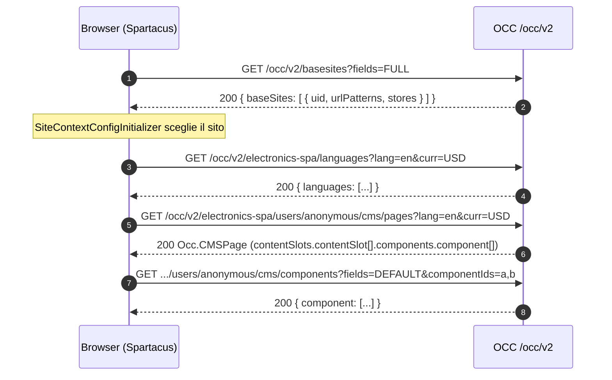
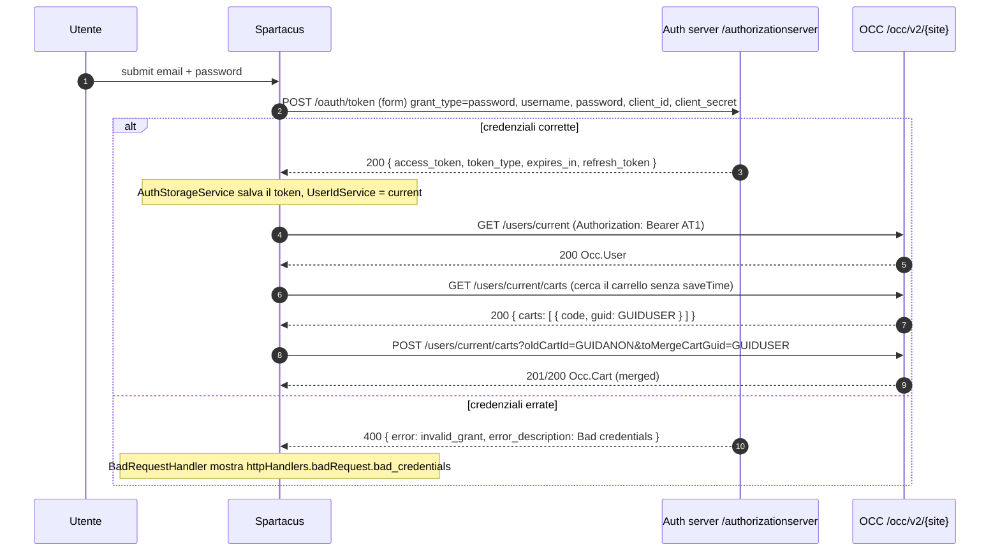
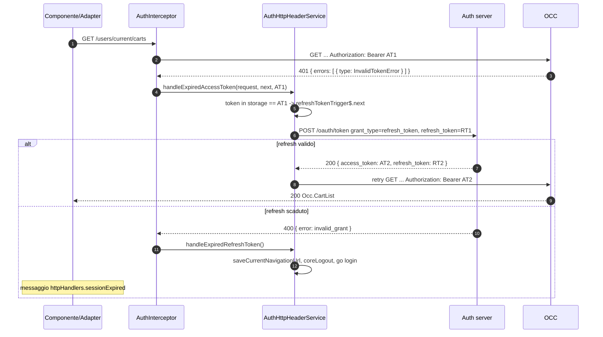
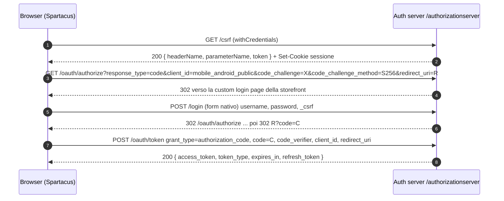

# 08 — Il contratto con il backend (OCC, OAuth2, errori, JSON di esempio)

> Area G del deep dive. Obiettivo pratico: dopo aver letto questo file devi essere in grado di scrivere un **backend mock** che Spartacus 2611 accetta senza lamentarsi.
> Tutti i path sono relativi alla root del repo (`/home/user/spartacus`). Quando un comportamento non è verificabile nel codice del repo (per esempio perché sta dentro una libreria esterna non presente in `node_modules`) lo segnalo con **NON VERIFICATO NEL CODICE**.

## Indice

1. In una frase
2. Il problema che risolve
3. Come è implementato (con path)
   - 3.1 Anatomia di un URL OCC
   - 3.2 Come Spartacus sceglie il base site
   - 3.3 Catalogo degli endpoint per feature
   - 3.4 Le forme dei dati (interfacce `Occ.*`)
   - 3.5 Autenticazione OAuth2
   - 3.6 Utente anonimo, registrato, guest, emulato
   - 3.7 Header custom, CORS, cookie, `withCredentials`
   - 3.8 Gestione errori
4. Flusso passo-passo (con diagrammi Mermaid)
5. Codice minimo riscritto a mano (mock server)
6. I 10 JSON di esempio (derivati da mock reali del repo)
7. Errori comuni
8. Domande di autoverifica
9. Assunzioni e punti non verificati

---

## 1. In una frase

Spartacus parla con SAP Commerce Cloud tramite **OCC** (Omni Commerce Connect), una API REST JSON sotto `{baseUrl}/occ/v2/{baseSiteId}/...`, protetta da **OAuth2** servito da `{baseUrl}/authorizationserver/oauth/*`; il "contratto" è l'insieme di URL, query param (`fields`, `lang`, `curr`), header, forme JSON e codici di errore che il frontend si aspetta.

---

## 2. Il problema che risolve

**Cos'è.** Il contratto backend è la "promessa reciproca" tra frontend e server: se chiedo `GET .../products/123`, tu mi rispondi con un oggetto che ha `code`, `name`, `price`, `images`...

**Perché serve capirlo.**

- Spartacus è **headless**: non ha dati propri. Ogni pagina, ogni slot CMS, ogni prezzo arriva da OCC. Se non conosci il contratto non puoi né fare debug né sostituire il backend.
- Per scrivere **test end-to-end offline**, demo o un corso, conviene un **mock server** (vedi `21-BACKEND-MOCK.md`). Il mock deve imitare esattamente gli URL che `OccEndpointsService` costruisce e le forme che i normalizer si aspettano.
- Gli errori non sono semplici codici HTTP: Spartacus legge il **corpo** dell'errore (`errors[0].type`, `error`, `error_description`) per decidere se rinnovare il token, fare logout o mostrare un messaggio. Un mock che restituisce `401` senza il corpo giusto rompe il refresh del token.

**Dove sta il "confine".** Il confine è lo strato **Adapter OCC** (vedi `07-DATA-LAYER-OCC.md`):

```
Component -> Facade -> Connector -> Adapter (OCC) --HTTP--> Backend
                                     ^
                                     |  qui si decide URL, header, body
                          Converter/Normalizer: qui si decide come leggere la risposta
```

**Esempio minimo del problema.** Se il backend risponde a `GET /occ/v2/electronics-spa/users/anonymous/cms/pages?pageType=ContentPage&pageLabelOrId=/cart` con uno slot senza `position`, lo slot viene ignorato silenziosamente (`OccCmsPageNormalizer.normalizePageSlotData` in `core-libs/core/src/occ/adapters/cms/converters/occ-cms-page-normalizer.ts` salta gli slot senza `position`). La pagina appare vuota e nessuno ti dice perché.

---

## 3. Come è implementato (con path)

### 3.1 Anatomia di un URL OCC

#### 3.1.1 I pezzi

1. **Cos'è.** Ogni URL OCC è `baseUrl + prefix + baseSite + endpoint + query`.
2. **Perché.** Così lo stesso codice funziona con host diversi (config), con prefissi diversi (reverse proxy) e con più siti (multi-site).
3. **Dove sta.**
   - `core-libs/core/src/occ/config/occ-config.ts` — interfaccia `BackendConfig` con `occ.baseUrl`, `occ.prefix`, `occ.useWithCredentials`, `occ.endpoints`, e `media.baseUrl` / `media.prefix`.
   - `core-libs/core/src/occ/config/default-occ-config.ts` — `defaultOccConfig` imposta **solo** `prefix: '/occ/v2/'`. Il `baseUrl` di default è vuoto (stessa origine).
   - `core-libs/core/src/occ/services/occ-endpoints.service.ts` — classe `OccEndpointsService`:
     - `getBaseUrl(props)` restituisce `urlPathJoin(baseUrl, prefix, baseSite)`; ognuno dei tre pezzi può essere omesso passando `{ baseUrl: false }`, `{ prefix: false }`, `{ baseSite: false }`.
     - `buildUrl(endpoint, { urlParams, queryParams, scope }, propertiesToOmit)` prende il template dalla config (es. `'products/${productCode}?fields=...'`), sostituisce `${...}` con `StringTemplate.resolve(url, urlParams, true)` (il `true` significa: encoda i valori), unisce i query param di config con quelli passati, poi antepone la base.
     - `activeBaseSite` viene da `BaseSiteService.getActive()`; se non c'è ancora, usa il default della config (`getContextParameterDefault(config, BASE_SITE_CONTEXT_ID)`).
   - `core-libs/core/src/occ/adapters/site-context/site-context.interceptor.ts` — classe `SiteContextInterceptor`: per **ogni** richiesta il cui URL contiene `occEndpoints.getBaseUrl()` aggiunge `lang` e `curr` come query param (`request.clone({ setParams: { lang, curr } })`).
4. **Esempio minimo.**

```ts
// config: backend.occ.baseUrl = 'https://api.example.com', prefix default '/occ/v2/'
// base site attivo: 'electronics-spa', lingua 'en', valuta 'USD'
occEndpoints.buildUrl('product', {
  urlParams: { productCode: '1446509' },
  scope: 'list',
});
// => https://api.example.com/occ/v2/electronics-spa/products/1446509?fields=code,purchasable,name,summary,price(formattedValue),images(DEFAULT,galleryIndex),baseProduct
// Dopo SiteContextInterceptor la richiesta reale diventa:
// ...&lang=en&curr=USD
```

#### 3.1.2 Tabella riassuntiva dei parametri

| Parte | Da dove viene | Valore tipico | Path |
|---|---|---|---|
| `baseUrl` | `backend.occ.baseUrl` | `https://localhost:9002` o `''` | `core-libs/core/src/occ/config/occ-config.ts` |
| `prefix` | `backend.occ.prefix` | `/occ/v2/` | `core-libs/core/src/occ/config/default-occ-config.ts` |
| `{baseSiteId}` | `BaseSiteService.getActive()` | `electronics-spa` | `occ-endpoints.service.ts` (`activeBaseSite`) |
| endpoint | `backend.occ.endpoints.<chiave>` | `users/${userId}/carts/${cartId}` | vari `default-occ-*-config.ts` |
| `fields` | dentro il template dell'endpoint | `DEFAULT`, `FULL`, liste | idem |
| `lang`, `curr` | `LanguageService` / `CurrencyService` | `en`, `USD` | `site-context.interceptor.ts` |

**Dettagli importanti per un mock:**

- `getPrefix()` in `OccEndpointsService` aggiunge lo slash iniziale se manca (`'occ/v2/'` diventa `'/occ/v2/'`).
- Il `lang`/`curr` viene aggiunto solo se l'URL **contiene** `baseUrl + prefix + baseSite`. Quindi la chiamata `basesites` (costruita con `{ baseSite: false }` in `OccSiteAdapter.loadBaseSites`, file `core-libs/core/src/occ/adapters/site-context/occ-site.adapter.ts`) **non** riceve `lang` e `curr`. Anche gli endpoint ASM che omettono prefix e baseSite (es. `asmCustomerLists` in `feature-libs/asm/occ/adapters/default-occ-asm-config.ts`) non li ricevono.
- Il parametro `fields` è una **proiezione** stile OCC (`DEFAULT`, `BASIC`, `FULL`, o liste annidate come `products(code,name)`). Un mock **può ignorarlo** e restituire sempre l'oggetto completo: Spartacus non si rompe se riceve più campi. Anzi, `OccFieldsService` (`core-libs/core/src/occ/services/occ-fields.service.ts`, metodo `getOptimalUrlGroups`) unisce i `fields` di più scope di prodotto in **una sola** richiesta e poi estrae lato client il sottoinsieme che serve a ogni scope (`OccRequestsOptimizerService.scopedDataLoad` in `occ-requests-optimizer.service.ts`).

#### 3.1.3 Timeout

- `core-libs/core/src/http/http-timeout/default-http-timeout.config.ts` — `defaultBackendHttpTimeoutConfig` imposta `backend.timeout.server = 20_000` ms (solo in SSR). In browser non c'è timeout di default (`HttpTimeoutInterceptor` in `http-timeout.interceptor.ts` sceglie `timeoutConfig.browser` o `timeoutConfig.server` in base alla piattaforma).
- Conseguenza per il mock: se in SSR una risposta impiega più di 20 s la richiesta fallisce e la pagina SSR va in errore (lo dimostra il test "should receive response with status 500 if HTTP call to backend timeouted" in `projects/ssr-tests/src/ssr-testing.spec.ts`).

### 3.2 Come Spartacus sceglie il base site

1. **Cos'è.** Se l'app **non** configura staticamente `context.baseSite`, Spartacus scarica la lista dei siti e sceglie quello il cui `urlPatterns` fa match con l'URL del browser.
2. **Perché.** Un solo deploy del frontend può servire più siti (`electronics-spa`, `apparel-uk-spa`...) distinguendoli dal dominio o dal path.
3. **Dove sta.**
   - `core-libs/core/src/occ/adapters/site-context/default-occ-site-context-config.ts` — `baseSites: 'basesites?fields=FULL'`.
   - `core-libs/core/src/occ/adapters/site-context/occ-site.adapter.ts` — `OccSiteAdapter.loadBaseSites()` chiama `buildUrl('baseSites', {}, { baseSite: false })` e legge `siteList.baseSites`.
   - `core-libs/core/src/occ/adapters/site-context/converters/base-site-normalizer.ts` — `BaseSiteNormalizer` trasforma `stores[0]` in `baseStore` (vedi il test `base-site-normalizer.spec.ts`: `stores: [store]` diventa `baseStore: store`).
   - `core-libs/core/src/site-context/config/config-loader/site-context-config-initializer.ts` — `SiteContextConfigInitializer.resolveConfig()`:
     - cerca il sito con `isCurrentBaseSite(site, url)`: converte ogni `urlPatterns[i]` (regex **Java**) in RegExp JS con `JavaRegExpConverter.toJsRegExp` e la testa su `window.location.href`;
     - se nessuno fa match lancia `Error: Cannot get base site config! Current url (...) doesn't match any of url patterns of any base sites.`;
     - `getConfig()` produce `context.baseSite = [uid]`, `context.language` e `context.currency` con il default **in prima posizione** (`moveToFirst`), `context.theme = [theme]`, `context.urlParameters` = `urlEncodingAttributes` (con `storefront` rinominato in `baseSite`).
   - Nel demo B2C (`projects/storefrontapp/src/app/private/private.providers.ts`) non c'è `context` statico, quindi il B2C usa proprio questo meccanismo; il B2B invece lo fissa in `projects/storefrontapp/src/app/spartacus/spartacus-b2b-configuration.providers.ts` (`baseSite: ['powertools-spa', ...]`).
4. **Esempio minimo.** Il mock deve restituire almeno un sito con un pattern che fa match con `http://localhost:4200/...`:

```ts
// risposta minima di GET /occ/v2/basesites?fields=FULL
const baseSites = {
  baseSites: [
    {
      uid: 'electronics-spa',
      urlPatterns: ['.*localhost.*'],          // regex Java, testata su location.href
      urlEncodingAttributes: ['language', 'currency'],
      theme: 'santorini',
      stores: [
        {
          languages: [{ isocode: 'en' }],
          defaultLanguage: { isocode: 'en' },
          currencies: [{ isocode: 'USD' }],
          defaultCurrency: { isocode: 'USD' },
        },
      ],
    },
  ],
};
```

> Nota: l'`AuthHttpHeaderService.alterRequest` (vedi 3.5) **non** aggiunge mai `Authorization` alla chiamata `basesites` (`isBaseSitesRequest`). Il mock deve quindi rispondere a questa chiamata senza autenticazione.

### 3.3 Catalogo degli endpoint per feature

Legenda: `{b}` = `{baseUrl}/occ/v2/{baseSiteId}`. Tutti i path sono **relativi a `{b}`** salvo dove indicato. `U` = `userId` (`anonymous`, `current` o id cliente in emulazione ASM). `C` = `cartId` (per l'anonimo è il `guid`, per il registrato è il `code` o `current`).

#### 3.3.1 Site context e dati di riferimento

Fonte: `core-libs/core/src/occ/adapters/site-context/default-occ-site-context-config.ts`, `OccSiteAdapter`.

| Chiave config | Metodo | Path | Request | Response |
|---|---|---|---|---|
| `baseSites` | GET | `{baseUrl}/occ/v2/basesites?fields=FULL` (senza baseSite) | - | `Occ.BaseSites` `{ baseSites: BaseSite[] }` |
| `languages` | GET | `languages` | - | `Occ.LanguageList` `{ languages }` |
| `currencies` | GET | `currencies` | - | `Occ.CurrencyList` `{ currencies }` |
| `countries` | GET | `countries[?type=SHIPPING|BILLING]` | `type` opzionale (`loadCountries(type)`) | `Occ.CountryList` `{ countries }` |
| `regions` | GET | `countries/${isoCode}/regions?fields=regions(name,isocode,isocodeShort)` | - | `Occ.RegionList` `{ regions }` |
| `addressCities` | GET | `regions/${regionId}/cities?fields=...` | - | `{ cities: City[] }` |
| `addressDistricts` | GET | `cities/${cityId}/districts?fields=...` | - | `{ districts: CityDistrict[] }` |
| `titles` | GET | `titles` | - | `Occ.TitleList` `{ titles }` (config in `feature-libs/user/profile/occ/adapters/config/default-occ-user-profile-endpoint.config.ts`) |

#### 3.3.2 CMS

Fonte: `core-libs/core/src/cms/config/default-cms-config.ts` (`defaultCmsModuleConfig`), `OccCmsPageAdapter` e `OccCmsComponentAdapter` in `core-libs/core/src/occ/adapters/cms/`.

| Chiave | Metodo | Path | Query | Response |
|---|---|---|---|---|
| `pages` | GET | `users/${userId}/cms/pages` | `pageType`, `pageLabelOrId` (ContentPage) oppure `code` (Product/Category/Catalog); **nessun** parametro per la home | `Occ.CMSPage` |
| `page` | GET | `users/${userId}/cms/pages/${id}` | usato quando il `PageContext` non ha `type` | `Occ.CMSPage` |
| `component` | GET | `users/${userId}/cms/components/${id}` | `productCode` / `categoryCode` / `catalogCode` a seconda del contesto | un componente |
| `components` | GET | `users/${userId}/cms/components` | `fields=DEFAULT`, `componentIds=a,b,c`, `currentPage`, `pageSize`, `sort`, + contesto | `Occ.ComponentList` `{ component: [...] }` |

Regole da `OccCmsPageAdapter.getPagesRequestParams`:

- se `context.id` è `HOME_PAGE_CONTEXT` (`'__HOMEPAGE__'`) o `SMART_EDIT_CONTEXT` (`'smartedit-preview'`) — costanti in `core-libs/core/src/routing/models/page-context.model.ts` — la richiesta non ha query param: il backend deve restituire la **homepage**;
- `PageType` (in `core-libs/core/src/model/cms.model.ts`) vale `ContentPage`, `ProductPage`, `CategoryPage`, `CatalogPage`;
- entrambi gli adapter inviano `Content-Type: application/json` anche sulle GET (campo `headers` nella classe).

`userId` nelle URL CMS: gli adapter leggono `UserIdService.getUserId()`, quindi per l'anonimo l'URL è `users/anonymous/cms/pages`, per il loggato `users/current/cms/pages`.

#### 3.3.3 Prodotti, ricerca, facet, suggerimenti

Fonte: `core-libs/core/src/occ/adapters/product/default-occ-product-config.ts`, `OccProductAdapter`, `OccProductSearchAdapter`.

| Chiave (scope) | Metodo | Path | Response |
|---|---|---|---|
| `product` (`default`, `list`, `details`, `promotions`, `attributes`, `price`, `stock`, `unit`, `list_item`) | GET | `products/${productCode}?fields=...` (un `fields` diverso per ogni scope) | `Occ.Product` |
| `productReviews` | GET/POST | `products/${productCode}/reviews` | `Occ.ReviewList` / review |
| `productReferences` | GET | `products/${productCode}/references?fields=DEFAULT,references(target(images(FULL)))` | `Occ.ProductReferenceList` |
| `productSearch` (`default`, `carousel`, `carouselMinimal`) | GET | `products/search?fields=...` + `query`, `pageSize`, `currentPage`, `sort`, `filters` | `Occ.ProductSearchPage` |
| `productSearchByCategory` | GET | `categories/${categoryCode}/products?fields=DEFAULT` | `Occ.ProductSearchPage` |
| `productSuggestions` | GET | `products/suggestions?term=...&max=3` | `Occ.SuggestionList` `{ suggestions: [{ value }] }` |
| `productAvailabilities` | GET | `productAvailabilities?filters=${productCode}:${unitSapCode}` | disponibilità |

Dettagli verificati:

- `OccProductSearchAdapter.getSearchEndpoint` passa `queryParams: { query, ...searchConfig }`; `DEFAULT_SEARCH_CONFIG.pageSize = 20`.
- `searchByCodes` fa una ricerca con `filters: 'code:A,B,C'` a blocchi di 100 (`CHUNK_SIZE = 100`).
- Se la risposta contiene `keywordRedirectUrl`, l'adapter **naviga** a quell'URL (`parseUrlForNavigation`).
- La query ha il formato Solr di SAP Commerce: `:relevance:category:576` (testo libero, `:`, sort, `:`, coppie facet:valore). Il mock può anche trattarla come stringa opaca, ma **deve** rimandarla nei `FacetValue.query.query.value` se vuoi che i click sulle facet funzionino.
- `OccProductSearchPageNormalizer` (`core-libs/core/src/occ/adapters/product/converters/occ-product-search-page-normalizer.ts`) **rimuove** le facet "inutili" (quelle in cui ogni valore ha `count === pagination.totalResults`) e calcola `topValueCount` (default 6 se `topValues` manca o è vuoto): è verificato nel test `occ-product-search-page-normalizer.spec.ts`.
- `ProductImageNormalizer` (`product-image-normalizer.ts`) trasforma l'array `images` in una mappa `{ PRIMARY: { product: Image, thumbnail: Image, ... }, GALLERY: [ {...}, {...} ] }`: le immagini con `galleryIndex` vanno in una lista, le altre in un oggetto indicizzato per `format`. Gli URL relativi vengono prefissati con `backend.media.baseUrl` (o, in mancanza, `backend.occ.baseUrl`).
- `ProductNameNormalizer` (`product-name-normalizer.ts`) toglie l'HTML dal nome e crea `slug` e `nameHtml` (test: `'<div>Product1</div>'` diventa `name: 'Product1'`, `slug: 'product1'`).

#### 3.3.4 Carrello ed entries

Fonte: `feature-libs/cart/base/occ/config/default-occ-cart-config-factory.ts` (`defaultOccCartConfigFactory`), `feature-libs/cart/base/occ/adapters/occ-cart.adapter.ts`, `occ-cart-entry.adapter.ts`, `occ-cart-guest-user.adapter.ts`, `occ-cart-voucher.adapter.ts`.

| Chiave | Metodo | Path | Request | Response |
|---|---|---|---|---|
| `carts` | GET | `users/${userId}/carts?fields=carts(...)` | - | `Occ.CartList` `{ carts }` |
| `cart` | GET | `users/${userId}/carts/${cartId}?fields=...` | - | `Occ.Cart` |
| `createCart` | POST | `users/${userId}/carts?fields=...` | body `{}`; query opzionali `oldCartId`, `toMergeCartGuid` | `Occ.Cart` |
| `deleteCart` | DELETE | `users/${userId}/carts/${cartId}` | header `cx-use-client-token` se anonimo | vuoto |
| `addEntries` | POST | `users/${userId}/carts/${cartId}/entries` | JSON `{ quantity, product: { code }, deliveryPointOfService?: { name } }` | `Occ.CartModification` |
| `updateEntries` | PATCH (o PUT per pickup→delivery) | `users/${userId}/carts/${cartId}/entries/${entryNumber}` | JSON `{ quantity, deliveryPointOfService? }` | `Occ.CartModification` |
| `removeEntries` | DELETE | `users/${userId}/carts/${cartId}/entries/${entryNumber}` | `Content-Type: application/x-www-form-urlencoded` | vuoto |
| `addEmail` | PUT | `users/${userId}/carts/${cartId}/email` | form `email=...` + `cx-use-client-token` | vuoto |
| `cartGuestUser` | POST/PATCH | `users/${userId}/carts/${cartId}/guestuser` | JSON `{ email }` (`CartGuestUser` in `feature-libs/cart/base/root/models/cart-guest-user.model.ts`) + `cx-use-client-token` | `{ email }` |
| `cartVoucher` / `cartApplyVoucher` / `cartRemoveVoucher` | POST/DELETE | `users/${userId}/carts/${cartId}/vouchers` ecc. | `voucherId` (JSON `{ voucherId }` o form/query a seconda del ramo in `OccCartVoucherAdapter`) | vuoto |
| `saveCart` | PATCH | `/users/${userId}/carts/${cartId}/save` | form `saveCartName`, `saveCartDescription` | `{ savedCartData: Occ.Cart }` (`SaveCartResult`) |
| `validate` | POST | `users/${userId}/carts/${cartId}/validate?fields=DEFAULT` | - | `CartModificationList` |

Regole verificate:

- `OccCartAdapter.load(userId, 'current')` **non** chiama `.../carts/current`: chiama la lista `carts` e prende il primo carrello **senza** `saveTime` (`carts.find((cart) => cart['saveTime'] === undefined)`). Il mock deve quindi rispondere bene a `GET users/current/carts`.
- `getCartIdByUserId` (`feature-libs/cart/base/core/utils/utils.ts`) usa `cart.guid` per l'utente `anonymous` e `cart.code` per tutti gli altri. Il mock deve generare **entrambi** e accettare il `guid` negli URL `users/anonymous/carts/{guid}`.
- Nel metodo `OccCartEntryAdapter.add` c'è un ramo B2B: se l'URL configurato contiene già `quantity=` usa il form `code=...` in query invece del JSON.
- Il carrello guest viene riconosciuto da `ActiveCartService.isCartUserGuest` (`feature-libs/cart/base/core/facade/active-cart.service.ts`) se `cart.user.name === 'guest'` **oppure** se `cart.user.uid` ha la forma `qualcosa|email@dominio`. Il mock, dopo `addEmail`/`guestuser`, deve quindi restituire `user: { name: 'guest', uid: '<guid>|email@dominio' }`.

#### 3.3.5 Checkout: indirizzo, delivery mode, pagamento

Fonte: `feature-libs/checkout/base/occ/config/default-occ-checkout-config.ts` (`defaultOccCheckoutConfig`) e gli adapter in `feature-libs/checkout/base/occ/adapters/`.

| Chiave | Metodo | Path | Request | Response |
|---|---|---|---|---|
| `getCheckoutDetails` | GET | `users/${userId}/carts/${cartId}?fields=deliveryAddress(FULL),deliveryMode(FULL),paymentInfo(FULL)` | - | parte di `Occ.Cart` |
| `createDeliveryAddress` | POST | `users/${userId}/carts/${cartId}/addresses/delivery` | JSON `Address` | `Occ.Address` |
| `setDeliveryAddress` | PUT | stesso path | query `addressId` | vuoto |
| `removeDeliveryAddress` | DELETE | stesso path | - | vuoto |
| `deliveryModes` | GET | `users/${userId}/carts/${cartId}/deliverymodes` | - | `Occ.DeliveryModeList` |
| `deliveryMode` | GET | `users/${userId}/carts/${cartId}/deliverymode` | - | `Occ.DeliveryMode` |
| `setDeliveryMode` | PUT | `users/${userId}/carts/${cartId}/deliverymode` | query `deliveryModeId` | vuoto |
| `clearDeliveryMode` | DELETE | stesso path | - | vuoto |
| `cardTypes` | GET | `cardtypes` | - | `Occ.CardTypeList` `{ cardTypes }` |
| `setCartPaymentDetails` | PUT / DELETE | `users/${userId}/carts/${cartId}/paymentdetails` | query `paymentDetailsId` | vuoto |
| `paymentProviderSubInfo` | GET | `users/${userId}/carts/${cartId}/payment/sop/request?responseUrl=sampleUrl` | - | `{ postUrl, parameters: { entry: [{key,value}] }, mappingLabels: { entry: [...] } }` |
| `createPaymentDetails` | POST | `users/${userId}/carts/${cartId}/payment/sop/response` | form urlencoded con i campi estratti dall'HTML del provider | `Occ.PaymentDetails` |
| `setBillingAddress` | PUT | `users/${userId}/carts/${cartId}/addresses/billing` | JSON `Address` | vuoto |

Il flusso **SOP (Silent Order Post)** di `OccCheckoutPaymentAdapter.createPaymentDetails` (`occ-checkout-payment.adapter.ts`) è in tre passi:

1. `GET .../payment/sop/request` → il backend dice **dove** postare la carta (`postUrl`) e con quali nomi di campo (`mappingLabels`, es. `hybris_card_number`, `hybris_billTo_country`, `hybris_combined_expiry_date`);
2. `POST postUrl` (form urlencoded, `Accept: text/html`, `responseType: 'text'`) → il **provider di pagamento** risponde con HTML contenente un `<form>`; `extractPaymentDetailsFromHtml` legge tutti gli `<input name value>`;
3. `POST .../payment/sop/response` con quei valori + `defaultPayment` + `savePaymentInfo=true` → il backend crea il `PaymentDetails`.

Per un mock semplice: `paymentProviderSubInfo` può restituire un `postUrl` che punta al mock stesso, che risponde con `<form><input name="x" value="y"/></form>`.

#### 3.3.6 Ordini

Fonte: `feature-libs/order/occ/config/default-occ-order-config.ts` (`defaultOccOrderConfig`), `OccOrderAdapter` (`feature-libs/order/occ/adapters/occ-order.adapter.ts`), `OccOrderHistoryAdapter`.

| Chiave | Metodo | Path | Request | Response |
|---|---|---|---|---|
| `placeOrder` | POST | `users/${userId}/orders?fields=FULL` | query `cartId`, `termsChecked`; body `{}`; `Content-Type: application/x-www-form-urlencoded`; `cx-use-client-token` se anonimo | `Occ.Order` |
| `placePaymentAuthorizedOrder` | POST | `users/${userId}/orders/paymentAuthorizedOrderPlacement?fields=FULL` | idem | `Occ.Order` |
| `orderHistory` | GET | `users/${userId}/orders` | `pageSize`, `currentPage`, `sort` | `Occ.OrderHistoryList` |
| `orderDetail` | GET | `users/${userId}/orders/${orderId}?fields=FULL` | - | `Occ.Order` |
| `consignmentTracking` | GET | `users/${userId}/orders/${orderCode}/consignments/${consignmentCode}/tracking` | - | tracking |
| `cancelOrder` | POST | `users/${userId}/orders/${orderId}/cancellation` | JSON | vuoto |
| `returnOrder` / `orderReturns` / `orderReturnDetail` / `cancelReturn` | POST/GET/GET/PATCH | `users/${userId}/orderReturns...` | JSON | `ReturnRequest` / lista |

Dopo il `placeOrder` di un **guest**, l'ordine va letto con `users/anonymous/orders/{guid}` (è il motivo per cui `Occ.Order` ha il campo `guid` e `guestCustomer`).

#### 3.3.7 Utente, profilo, indirizzi, consensi

Fonte: `feature-libs/user/account/occ/adapters/config/default-occ-user-account-endpoint.config.ts`, `feature-libs/user/profile/occ/adapters/config/default-occ-user-profile-endpoint.config.ts`, `core-libs/core/src/occ/adapters/user/default-occ-user-config.ts`.

| Chiave | Metodo | Path | Request | Response |
|---|---|---|---|---|
| `user` | GET | `users/${userId}` | - | `Occ.User` |
| `user` | PATCH | `users/${userId}` | JSON parziale `User` | vuoto |
| `user` | DELETE | `users/${userId}` | chiusura account | vuoto |
| `userRegister` | POST | `users` | JSON `UserSignUp` (`firstName`, `lastName`, `password`, `titleCode`, `uid`, `verificationTokenId?`, `verificationTokenCode?`) + `cx-use-client-token` | `Occ.User` |
| `userRegister` (guest→cliente) | POST | `users` | form `guid`, `password` + `cx-use-client-token` | `Occ.User` |
| `userForgotPassword` | POST | `forgottenpasswordtokens` | chiave configurata ma **non usata** da `OccUserProfileAdapter` in 2611 (grep: compare solo nella config e nel modello) | - |
| `userRestoreToken` | POST | `passwordRestoreToken` | JSON `{ loginId }` + `cx-use-client-token` | vuoto |
| `userResetPassword` | POST | `resetpassword` | JSON `{ token, newPassword }` | vuoto |
| `userUpdateLoginId` | POST | `users/${userId}/login` | JSON `{ newLoginId, password }` | vuoto |
| `userUpdatePassword` | POST | `users/${userId}/password` | JSON `{ oldPassword, newPassword }` | vuoto |
| `createVerificationToken` | POST | `users/anonymous/verificationToken` | JSON `{ purpose, loginId, password }` + `cx-use-client-token` | `{ tokenId, expiresIn }` |
| `addresses` | GET/POST | `users/${userId}/addresses` | JSON `Address` | `Occ.AddressList` / `Occ.Address` |
| `addressDetail` | PATCH/DELETE | `users/${userId}/addresses/${addressId}` | JSON `Address` | vuoto |
| `addressVerification` | POST | `users/${userId}/addresses/verification` | JSON `Address` (+ client token se anonimo) | `AddressValidation` |
| `paymentDetailsAll` | GET | `users/${userId}/paymentdetails` | - | `Occ.PaymentDetailsList` |
| `paymentDetail` | PATCH/DELETE | `users/${userId}/paymentdetails/${paymentDetailId}` | - | vuoto |
| `anonymousConsentTemplates` | GET e **HEAD** | `users/anonymous/consenttemplates` | - | `Occ.ConsentTemplateList` + header `X-Anonymous-Consents` |
| `consentTemplates` | GET | `users/${userId}/consenttemplates` | - | `Occ.ConsentTemplateList` |
| `consents` / `consentDetail` | POST / DELETE | `users/${userId}/consents[/${consentId}]` | form `consentTemplateId`, `consentTemplateVersion` | `ConsentTemplate` |

Nota su `OccUserAddressAdapter.loadAll` (`core-libs/core/src/occ/adapters/user/occ-user-address.adapter.ts`): se il toggle `enableHierarchicalAddressFormat` è attivo aggiunge `fields=addresses(FULL)`.

#### 3.3.8 Store finder

Fonte: `feature-libs/storefinder/occ/adapters/default-occ-store-finder-config.ts`, `feature-libs/storefinder/occ/adapters/occ-store-finder.adapter.ts`.

| Chiave | Metodo | Path | Query | Response |
|---|---|---|---|---|
| `stores` | GET | `stores?fields=stores(...),pagination(DEFAULT),sorts(DEFAULT)` | `query` **oppure** `latitude`+`longitude`, `radius`, `pageSize`, `currentPage`, `sort` | `Occ.StoreFinderSearchPage` |
| `store` | GET | `stores/${storeId}?fields=FULL` | - | `Occ.PointOfService` |
| `storescounts` | GET | `stores/storescounts` | - | `Occ.StoreCountList` `{ countriesAndRegionsStoreCount }` |

#### 3.3.9 Endpoint di autenticazione (fuori da `/occ/v2`)

Fonte: `core-libs/core/src/auth/user-auth/config/default-auth-config.ts` e `AuthConfigService` (`core-libs/core/src/auth/user-auth/services/auth-config.service.ts`).

`AuthConfigService.getBaseUrl()` = `authentication.baseUrl` **oppure** `backend.occ.baseUrl + '/authorizationserver'`. Ogni endpoint è prefissato con `prefixEndpoint()` (aggiunge `/` se manca).

| Config | Default | URL finale |
|---|---|---|
| `tokenEndpoint` | `/oauth/token` | `{baseUrl}/authorizationserver/oauth/token` |
| `revokeEndpoint` | `/oauth/revoke` | `{baseUrl}/authorizationserver/oauth/revoke` |
| `loginUrl` | `/oauth/authorize` | `{baseUrl}/authorizationserver/oauth/authorize` |
| `customLoginPage.csrfEndpoint` | `/csrf` | `{baseUrl}/authorizationserver/csrf` |
| `customLoginPage.loginFormEndpoint` | `/login` | `{baseUrl}/authorizationserver/login` |

Gli stessi URL sono usati dai test Cypress in `projects/storefrontapp-e2e-cypress/cypress/support/utils/login.ts` (oggetto `config`: `authorizeUrl`, `loginUrl`, `csrfUrl`, `tokenUrl`, `revokeTokenUrl`).

#### 3.3.10 ASM (fuori dal baseSite)

Fonte: `feature-libs/asm/occ/adapters/default-occ-asm-config.ts`.

| Chiave | Path | Nota |
|---|---|---|
| `asmCustomerSearch` | `/assistedservicewebservices/customers/search` | senza prefix e senza baseSite; `baseSite` passato come query |
| `asmCustomerLists` | `/assistedservicewebservices/customerlists` | idem (`OccAsmAdapter.customerLists` usa `{ baseSite: false, prefix: false }`) |
| `asmBindCart` | `/assistedservicewebservices/bind-cart` | form urlencoded |
| `asmCreateCustomer` | `/assistedservicewebservices/customers` | |
| `asmSessionEvent` | `assistedservicewebservices/${baseSiteId}/users/${userId}/asmSessionEvents` | |

Tutte usano l'header interno `cx-use-csagent-token` (`OccAsmAdapter.getHeaders()`).

### 3.4 Le forme dei dati (interfacce `Occ.*`)

1. **Cos'è.** Il namespace TypeScript `Occ` in `core-libs/core/src/occ/occ-models/occ.models.ts` (circa 3.300 righe) descrive il JSON **grezzo** di OCC. Le interfacce "pulite" usate dai componenti stanno altrove: `core-libs/core/src/model/*.model.ts` (es. `Product` in `product.model.ts`, `BaseSite` e `User` in `misc.model.ts`, `Address` in `address.model.ts`, `ProductSearchPage` in `product-search.model.ts`) e nelle `root` delle feature (es. `Cart`, `OrderEntry`, `DeliveryMode` in `feature-libs/cart/base/root/models/cart.model.ts`; `Order` in `feature-libs/order/root/model/order.model.ts`).
2. **Perché.** Separare "formato di rete" da "formato di dominio" permette ai **normalizer** (es. `ProductImageNormalizer`, `OccCmsPageNormalizer`, `BaseSiteNormalizer`, `OccCartNormalizer`) di adattare il JSON senza toccare i componenti.
3. **Dove sta.** Il mock deve produrre la forma `Occ.*`, non quella di dominio. Esempio: `Occ.Product.images` è un **array**, `Product.images` (dominio, `core-libs/core/src/model/image.model.ts`, `Images`) è una **mappa**.
4. **Esempio minimo.** Sotto trovi le interfacce principali **sintetizzate** (commenti rimossi, tutti i campi sono opzionali come nell'originale).

#### 3.4.1 Site context

```ts
// core-libs/core/src/occ/occ-models/occ.models.ts (namespace Occ)
interface BaseSites { baseSites?: BaseSite[] }
interface BaseSite {
  channel?: string;
  defaultLanguage?: Language;
  defaultPreviewCatalogId?: string;
  defaultPreviewCategoryCode?: string;
  defaultPreviewProductCode?: string;
  locale?: string;
  name?: string;
  theme?: string;
  uid?: string;
  stores?: BaseStore[];              // il normalizer usa stores[0] come baseStore
  urlPatterns?: string[];            // regex Java
  urlEncodingAttributes?: string[];  // es. ['storefront','language','currency']
  requiresAuthentication?: boolean;  // secure portal (B2B)
}
interface BaseStore {
  currencies?: Currency[];
  defaultCurrency?: Currency;
  languages?: Language[];
  defaultLanguage?: Language;
}
interface Language { active?: boolean; isocode?: string; name?: string; nativeName?: string }
interface Currency { active?: boolean; isocode?: string; name?: string; symbol?: string }
interface LanguageList { languages?: Language[] }
interface CurrencyList { currencies?: Currency[] }
interface Country { isocode?: string; name?: string }
interface CountryList { countries?: Country[] }
interface Region { countryIso?: string; isocode?: string; isocodeShort?: string; name?: string }
interface RegionList { regions?: Region[] }
interface Title { code?: string; name?: string }
interface TitleList { titles?: Title[] }
```

#### 3.4.2 CMS

```ts
interface CMSPage {
  contentSlots?: ContentSlotList;   // { contentSlot: ContentSlot[] }
  defaultPage?: boolean;
  name?: string;
  template?: string;                // es. 'LandingPage2Template'
  title?: string;
  description?: string;
  typeCode?: string;                // 'ContentPage' | 'ProductPage' | ...
  uid?: string;
  label?: string;                   // es. '/cart'
  properties?: any;
  robotTag?: PageRobots;            // 'INDEX_FOLLOW' | 'INDEX_NOFOLLOW' | 'NOINDEX_FOLLOW' | 'NOINDEX_NOFOLLOW'
}
interface ContentSlotList { contentSlot?: ContentSlot[] }
interface ContentSlot {
  components?: ComponentList;       // { component: Component[] }
  name?: string;
  position?: string;                // OBBLIGATORIO in pratica: è la chiave dello slot
  slotId?: string;
  slotShared?: boolean;
  slotStatus?: string;
  properties?: any;
}
interface ComponentList { component?: Component[] | any[] }
interface Component {
  modifiedTime?: Date;
  name?: string;
  otherProperties?: any;
  typeCode?: string;                // es. 'SimpleBannerComponent', 'CMSLinkComponent'
  uid?: string;
  // + qualsiasi proprietà specifica del tipo (url, media, container, children...)
}
```

Regole del normalizer (`OccCmsPageNormalizer`):

- `contentSlot` può essere anche un oggetto singolo: viene avvolto in un array (`normalizePageSlotData`).
- Per ogni componente calcola `flexType`: se `typeCode === 'CMSFlexComponent'` usa `component.flexType`; se `typeCode === 'JspIncludeComponent'` usa `component.uid`; altrimenti `typeCode` (`getFlexTypeFromComponent`; costanti in `core-libs/core/src/cms/config/cms-config.ts`). È il `flexType` che viene cercato in `cmsComponents` della config per scegliere il componente Angular.
- Il campo `modifiedtime` (minuscolo) viene rinominato in `modifiedTime`.
- Le `properties` dei componenti vengono tolte dallo stato dei componenti ma copiate nella struttura della pagina.

#### 3.4.3 Prodotto e ricerca

```ts
interface Product {
  availableForPickup?: boolean;
  averageRating?: number;
  baseOptions?: BaseOption[];
  baseProduct?: string;
  categories?: Category[];          // { code, name, image, url }
  classifications?: Classification[];
  code?: string;
  description?: string;
  futureStocks?: FutureStock[];
  images?: Image[];                 // ARRAY in OCC
  manufacturer?: string;
  multidimensional?: boolean;
  name?: string;
  numberOfReviews?: number;
  potentialPromotions?: Promotion[];
  price?: Price;
  priceRange?: PriceRange;
  productReferences?: ProductReference[];
  purchasable?: boolean;
  reviews?: Review[];
  stock?: Stock;
  summary?: string;
  url?: string;
  variantMatrix?: VariantMatrixElement[];
  variantOptions?: VariantOption[];
  variantType?: string;
  volumePrices?: Price[];
  volumePricesFlag?: boolean;
}
interface Price {
  currencyIso?: string;
  formattedValue?: string;          // i componenti mostrano QUESTO, non value
  maxQuantity?: number;
  minQuantity?: number;
  priceType?: PriceType;            // 'BUY' | 'FROM'
  value?: number;
}
interface Stock { stockLevel?: number; stockLevelStatus?: string } // il codice confronta 'inStock' e 'outOfStock' (es. add-to-cart.component.ts)
interface Image {
  altText?: string;
  format?: string;                  // 'product' | 'thumbnail' | 'zoom' | 'cartIcon' ...
  galleryIndex?: number;            // se presente -> va in una lista
  imageType?: ImageType;            // 'PRIMARY' | 'GALLERY'
  url?: string;                     // relativo -> prefissato con media.baseUrl
}

interface ProductSearchPage {
  breadcrumbs?: Breadcrumb[];
  categoryCode?: string;
  currentQuery?: SearchState;       // { query: { value }, url }
  facets?: Facet[];
  freeTextSearch?: string;
  keywordRedirectUrl?: string;
  pagination?: PaginationModel;     // { currentPage, pageSize, sort, totalPages, totalResults }
  products?: Product[];
  sorts?: SortModel[];              // { code, name, selected }
  spellingSuggestion?: SpellingSuggestion;
}
interface Facet {
  category?: boolean;
  multiSelect?: boolean;
  name?: string;
  priority?: number;
  topValues?: FacetValue[];
  values?: FacetValue[];
  visible?: boolean;
}
interface FacetValue { count?: number; name?: string; query?: SearchState; selected?: boolean }
interface Breadcrumb {
  facetCode?: string; facetName?: string;
  facetValueCode?: string; facetValueName?: string;
  removeQuery?: SearchState; truncateQuery?: SearchState;
}
interface SuggestionList { suggestions?: { value?: string }[] }
```

Attenzione: esistono **due** modelli di paginazione in `occ.models.ts`: `Pagination` (`count`, `page`, `totalCount`, `totalPages`) e `PaginationModel` (`currentPage`, `pageSize`, `sort`, `totalPages`, `totalResults`). Ricerca prodotti, storico ordini e store finder usano **`PaginationModel`**.

#### 3.4.4 Carrello

```ts
interface Cart {
  appliedOrderPromotions?: PromotionResult[];
  appliedProductPromotions?: PromotionResult[];
  appliedVouchers?: Voucher[];
  calculated?: boolean;
  code?: string;                    // id per utente registrato
  deliveryAddress?: Address;
  deliveryCost?: Price;
  deliveryItemsQuantity?: number;
  deliveryMode?: DeliveryMode;
  deliveryOrderGroups?: DeliveryOrderEntryGroup[];
  description?: string;
  entries?: OrderEntry[];
  expirationTime?: Date;
  guid?: string;                    // id per utente anonimo
  name?: string;
  net?: boolean;
  orderDiscounts?: Price;
  paymentInfo?: PaymentDetails;
  pickupItemsQuantity?: number;
  pickupOrderGroups?: PickupOrderEntryGroup[];
  potentialOrderPromotions?: PromotionResult[];
  potentialProductPromotions?: PromotionResult[];
  productDiscounts?: Price;
  saveTime?: Date;                  // presente => carrello salvato (non "current")
  savedBy?: Principal;
  site?: string;
  store?: string;
  subTotal?: Price;
  totalDiscounts?: Price;
  totalItems?: number;
  totalPrice?: Price;
  totalPriceWithTax?: Price;
  totalTax?: Price;
  totalUnitCount?: number;
  user?: Principal;                 // { name, uid } -> 'guest' / 'guid|email' per il guest
  sapQuote?: SapQuote;
}
interface OrderEntry {
  basePrice?: Price;
  deliveryMode?: DeliveryMode;
  deliveryPointOfService?: PointOfService;
  entryNumber?: number;
  product?: Product;
  quantity?: number;
  totalPrice?: Price;
  updateable?: boolean;
  statusSummaryList?: StatusSummary[];
  configurationInfos?: ConfigurationInfo[];
}
interface CartList { carts?: Cart[] }
interface CartModification {
  deliveryModeChanged?: boolean;
  entry?: OrderEntry;
  quantity?: number;
  quantityAdded?: number;
  statusCode?: string;              // 'success' | 'lowStock' | 'noStock' ... (ProductImportStatus, CartValidationStatusCode)
  statusMessage?: string;
}
interface Principal { name?: string; uid?: string }
```

#### 3.4.5 Checkout, indirizzi, pagamento

```ts
interface Address {
  companyName?: string; country?: Country; defaultAddress?: boolean; email?: string;
  firstName?: string; formattedAddress?: string; id?: string; lastName?: string;
  line1?: string; line2?: string; phone?: string; cellphone?: string;
  postalCode?: string; region?: Region; district?: string; shippingAddress?: boolean;
  title?: string; titleCode?: string; town?: string; visibleInAddressBook?: boolean;
}
interface AddressList { addresses?: Address[] }
interface DeliveryMode { code?: string; deliveryCost?: Price; description?: string; name?: string }
interface DeliveryModeList { deliveryModes?: DeliveryMode[] }
interface PaymentDetails {
  accountHolderName?: string; billingAddress?: Address; cardNumber?: string;
  cardType?: CardType;              // { code, name }
  cvn?: string; defaultPayment?: boolean; expiryMonth?: string; expiryYear?: string;
  id?: string; issueNumber?: string; saved?: boolean; startMonth?: string;
  startYear?: string; subscriptionId?: string;
}
interface CardTypeList { cardTypes?: CardType[] }
```

#### 3.4.6 Ordini e utente

```ts
interface Order {
  appliedOrderPromotions?: PromotionResult[]; appliedProductPromotions?: PromotionResult[];
  appliedVouchers?: Voucher[]; calculated?: boolean;
  code?: string;
  consignments?: Consignment[];     // { code, entries, shippingAddress, status, statusDate, trackingID }
  created?: Date;
  deliveryAddress?: Address; deliveryCost?: Price; deliveryItemsQuantity?: number;
  deliveryMode?: DeliveryMode; deliveryOrderGroups?: DeliveryOrderEntryGroup[];
  deliveryStatus?: string; deliveryStatusDisplay?: string;
  entries?: OrderEntry[];
  guestCustomer?: boolean;
  guid?: string;
  net?: boolean; orderDiscounts?: Price; paymentInfo?: PaymentDetails;
  pickupItemsQuantity?: number; pickupOrderGroups?: PickupOrderEntryGroup[];
  productDiscounts?: Price; site?: string;
  status?: string; statusDisplay?: string;
  store?: string; subTotal?: Price; totalDiscounts?: Price; totalItems?: number;
  totalPrice?: Price; totalPriceWithTax?: Price; totalTax?: Price;
  unconsignedEntries?: OrderEntry[];
  user?: Principal;
}
interface OrderHistory { code?: string; guid?: string; placed?: Date; status?: string; statusDisplay?: string; total?: Price }
interface OrderHistoryList { orders?: OrderHistory[]; pagination?: PaginationModel; sorts?: SortModel[] }

interface User {
  currency?: Currency;
  customerId?: string;              // usato da ASM come userId in emulazione
  deactivationDate?: Date;
  defaultAddress?: Address;
  displayUid?: string;
  firstName?: string;
  language?: Language;
  lastName?: string;
  name?: string;
  title?: string;
  titleCode?: string;
  uid?: string;                     // di solito l'email
}
```

#### 3.4.7 Consensi, store, errori

```ts
interface ConsentTemplate { id?: string; name?: string; description?: string; version?: number; currentConsent?: Consent }
interface Consent { code?: string; consentGivenDate?: Date; consentWithdrawnDate?: Date }
interface ConsentTemplateList { consentTemplates?: ConsentTemplate[] }
interface AnonymousConsent { templateCode?: string; version?: number; consentState?: 'GIVEN' | 'WITHDRAWN' }

interface PointOfService {
  address?: Address; description?: string; displayName?: string; distanceKm?: number;
  features?: { [propertyName: string]: string }; formattedDistance?: string;
  geoPoint?: GeoPoint; mapIcon?: Image; name?: string; openingHours?: OpeningSchedule;
  storeContent?: string; storeImages?: Image[]; url?: string;
}
interface StoreFinderSearchPage {
  boundEastLongitude?: number; boundNorthLatitude?: number;
  boundSouthLatitude?: number; boundWestLongitude?: number;
  locationText?: string; pagination?: PaginationModel; sorts?: SortModel[];
  sourceLatitude?: number; sourceLongitude?: number; stores?: PointOfService[];
}

interface ErrorModel {
  message?: string;      // testo leggibile
  reason?: string;       // es. 'notFound', 'noStock'
  subject?: string;      // id dell'oggetto, es. il cartId
  subjectType?: string;  // es. 'cart', 'entry'
  type?: string;         // es. 'InvalidTokenError', 'CartError', 'ValidationError'
}
interface ErrorList { errors?: ErrorModel[] }
```

### 3.5 Autenticazione OAuth2

Questa è la parte più delicata del contratto. Spartacus 2611 supporta **tre** modi di ottenere token e li combina con un sistema di interceptor.

#### 3.5.1 `AuthConfig`: la configurazione

1. **Cos'è.** La classe astratta `AuthConfig` in `core-libs/core/src/auth/user-auth/config/auth-config.ts` con il blocco `authentication`:

```ts
authentication?: {
  client_id?: string;
  client_secret?: string;
  baseUrl?: string;                  // default: occ.baseUrl + '/authorizationserver'
  tokenEndpoint?: string;
  revokeEndpoint?: string;
  sendAuthHeaderOnRevoke?: boolean;  // aggiunge Authorization alla chiamata di revoke
  useClientTokens?: boolean;         // abilita il client_credentials per le chiamate anonime
  loginUrl?: string;
  logoutUrl?: string;
  userinfoEndpoint?: string;
  OAuthLibConfig?: AuthLibConfig;    // config di angular-oauth2-oidc (senza clientId, tokenEndpoint...)
  customLoginPage?: { csrfEndpoint?: string; loginFormEndpoint?: string };
  initializerOptions?: { addBaseSiteToRedirectUri?: boolean | 'auto'; baseSiteSuffix?: boolean | 'auto' };
}
```

2. **Perché.** Tutti gli URL e i client OAuth devono essere configurabili per ambiente.
3. **Dove sta.** Il default **non è statico**: `defaultAuthConfigFactory()` in `core-libs/core/src/auth/user-auth/config/default-auth-config.ts` (registrato da `UserAuthModule` con `provideDefaultConfigFactory(defaultAuthConfigFactory)` in `core-libs/core/src/auth/user-auth/user-auth.module.ts`) sceglie la configurazione in base ai feature toggle:

| Toggle `authorizationCodeFlowByDefault` | Risultato |
|---|---|
| `true` (default in `core-libs/core/src/features-config/feature-toggles/config/feature-toggles.ts`, ed esplicito nel demo `projects/storefrontapp/src/app/spartacus/spartacus-features.module.ts`) | `client_id: 'mobile_android_public'`, **nessun** `client_secret`, `OAuthLibConfig.responseType: 'code'`, PKCE attivo (`disablePKCE: false`), `customLoginPage` con `/csrf` e `/login`, **nessun** `useClientTokens` |
| `false` (legacy) | `client_id: 'mobile_android'`, `client_secret: 'secret'`, `sendAuthHeaderOnRevoke: true`, `useClientTokens: true`, `disablePKCE: true`, `responseType` rimosso ⇒ **Resource Owner Password flow** |

In entrambi i casi `OAuthLibConfig` contiene `scope: ''`, `customTokenParameters: ['token_type']`, `strictDiscoveryDocumentValidation: false`, `skipIssuerCheck: true`, `oidc: false`, `clearHashAfterLogin: false`. `redirectUri` viene rimosso a meno che siano attivi sia `asyncAuthConfigInitializer` sia `oauthCallbackPage` (entrambi `false` di default; il demo usa `asyncAuthConfigInitializer: false` e `oauthCallbackPage: true`).

4. **Esempio minimo** — configurare Spartacus per usare un mock con password flow (il più semplice da implementare):

```ts
// app.config.ts (esempio)
provideFeatureToggles({ authorizationCodeFlowByDefault: false }),
provideConfig({
  backend: { occ: { baseUrl: 'http://localhost:9002' } },
  authentication: {
    client_id: 'mobile_android',
    client_secret: 'secret',
  },
});
```

`AuthConfigService.getOAuthFlow()` (`auth-config.service.ts`) decide il flusso guardando `OAuthLibConfig.responseType`: contiene `code` ⇒ `AuthorizationCode`; contiene `token` ⇒ `ImplicitFlow`; altrimenti `ResourceOwnerPasswordFlow`.

#### 3.5.2 Il token endpoint: forme di request e response

Tutte le chiamate al token endpoint sono `POST {baseUrl}/authorizationserver/oauth/token` con `Content-Type: application/x-www-form-urlencoded`.

**A) `client_credentials` (token "client" per le chiamate anonime).**
- Dove: `ClientAuthenticationTokenService.loadClientAuthenticationToken()` in `core-libs/core/src/auth/client-auth/services/client-authentication-token.service.ts`.
- Body: `client_id`, `client_secret`, `grant_type=client_credentials` (valori passati attraverso `encodeURIComponent`).
- Response: `ClientToken` (`core-libs/core/src/auth/client-auth/models/client-token.model.ts`): `{ access_token, token_type, expires_in, scope }`.

**B) `password` (Resource Owner Password Credentials).**
- Dove: `AuthService.loginWithCredentials(userId, password)` (`core-libs/core/src/auth/user-auth/facade/auth.service.ts`) → `OAuthLibWrapperService.authorizeWithPasswordFlow` (`oauth-lib-wrapper.service.ts`) → `OAuthService.fetchTokenUsingPasswordFlow` della libreria `angular-oauth2-oidc` (versione `~20.0.2` in `package.json`).
- Body: `grant_type=password`, `username`, `password`, `client_id`, `client_secret`. Il formato è confermato dal test Cypress `resourceOwnerPasswordCredentialsGrant` in `projects/storefrontapp-e2e-cypress/cypress/support/utils/login.ts`. La libreria aggiunge anche `scope` (qui vuoto): **NON VERIFICATO NEL CODICE** del repo (la libreria non è in `node_modules`).
- Response: `{ access_token, token_type: 'Bearer', expires_in, refresh_token?, scope? }` (tipo `TokenResponse` nello stesso file Cypress).

**C) `authorization_code` + PKCE (default in 2611).**
- Dove: `AuthService.loginWithRedirect()` → `OAuthLibWrapperService.initLoginFlow()` → redirect del browser a `/oauth/authorize`; al ritorno `AuthService.checkOAuthParamsInUrl()` → `OAuthLibWrapperService.tryLogin()` scambia il `code`.
- Passi concreti (replicati in `authorizationCodeGrant` di `login.ts`):
  1. `GET /authorizationserver/oauth/authorize?response_type=code&client_id=...&code_challenge=...&code_challenge_method=S256&redirect_uri=...` → `200` (pagina di login del server) oppure `302` verso la **custom login page** di Spartacus;
  2. con la custom login page: `GET /authorizationserver/csrf` (con cookie, `withCredentials: true` in `CrossSiteRequestForgeryService.getCsrfToken()`, `core-libs/core/src/auth/client-auth/services/cross-site-request-forgery.service.ts`) → `CSRFResponse` `{ headerName, parameterName, token }` (`core-libs/core/src/auth/user-auth/models/csrf-response.ts`);
  3. `POST /authorizationserver/login` form `username`, `password`, `_csrf` (in Spartacus è un **submit nativo di form HTML**, `LoginFormComponentService.login(nativeForm)` in `feature-libs/user/account/components/login-form/login-form-component.service.ts`, con `action = getCustomLoginFormEndpoint()` e `method = 'POST'`); in caso di errore il server rimanda a `/login?error=...`;
  4. redirect con `?code=...` verso l'origin della storefront;
  5. `POST /oauth/token` form `client_id`, `grant_type=authorization_code`, `code`, `redirect_uri`, `code_verifier`.
- `CustomLoginGuard` (`core-libs/core/src/auth/user-auth/guards/custom-login.guard.ts`) chiama il CSRF endpoint prima di mostrare la pagina `/login`; se fallisce riprova una volta (`totalRetries = 1`) e poi manda alla home con `authMessages.unrecoverableError`.

**D) `refresh_token`.**
- Dove: `AuthHttpHeaderService.refreshToken$` → `OAuthLibWrapperService.refreshToken()` → `OAuthService.refreshToken()`.
- Body atteso: `grant_type=refresh_token`, `refresh_token`, `client_id` (+ `client_secret` se configurato). Il nome `grant_type` è verificato indirettamente: `AuthInterceptor` legge `request.body.get('grant_type') === 'refresh_token'` quando la risposta è `400`. Gli altri campi: **NON VERIFICATO NEL CODICE** (sono della libreria).

**E) `custom` (CDC).**
- Dove: `CdcUserAuthenticationTokenService.loadTokenUsingCustomFlow` in `integration-libs/cdc/core/auth/services/user-authentication/cdc-user-authentication-token.service.ts`.
- Body: `client_id`, `client_secret`, `grant_type=custom`, `UID`, `UIDSignature`, `signatureTimestamp`, `id_token`, `baseSite`.

**Revoca.** `AuthService.coreLogout()` → `OAuthLibWrapperService.revokeAndLogout()` → `OAuthService.revokeTokenAndLogout(true)`; se fallisce fa comunque `logOut(true)`. Il test Cypress `revokeAccessToken` (`projects/storefrontapp-e2e-cypress/cypress/helpers/auth-redirects.ts`) mostra il body: `client_id`, `client_secret`, `token_type_hint=access_token`, `token`. Se `sendAuthHeaderOnRevoke` è `true`, `TokenRevocationInterceptor` (`core-libs/core/src/auth/user-auth/http-interceptors/token-revocation.interceptor.ts`) aggiunge `Authorization: Bearer <access_token>` alle richieste il cui URL è esattamente `getRevokeEndpoint()`.

#### 3.5.3 Dove viene salvato il token

- `AuthStorageService` (`core-libs/core/src/auth/user-auth/services/auth-storage.service.ts`) estende `OAuthStorage` della libreria: invece di scrivere in `sessionStorage` tiene tutto in un `BehaviorSubject<AuthToken>` (`_token$`). `setItem`/`getItem`/`removeItem` leggono e scrivono chiavi dentro quell'oggetto; le chiavi della libreria elencate in `nonStringifiedOAuthLibKeys` (`access_token`, `refresh_token`, `expires_at`, `PKCE_verifier`...) non vengono serializzate.
- `AuthToken` (`core-libs/core/src/auth/user-auth/models/auth-token.model.ts`): `{ access_token, refresh_token?, expires_at?, granted_scopes?, access_token_stored_at, token_type? }`.
- `AuthStatePersistenceService` (`auth-state-persistence.service.ts`) sincronizza `{ token, userId, redirectUrl }` in `localStorage` con chiave `'auth'`, che `StatePersistenceService` (`core-libs/core/src/state/services/state-persistence.service.ts`) trasforma in `spartacus⚿<contesto>⚿auth`. Nei test Cypress la chiave è `spartacus⚿⚿auth` (`setSessionData` in `login.ts`).
- Il **client token** invece sta nello store NgRx (`ClientTokenService.getClientToken()` in `client-token.service.ts` seleziona `ClientAuthSelectors.getClientTokenState` e, se non c'è, fa `dispatch(new ClientAuthActions.LoadClientToken())`).

#### 3.5.4 Come viene attaccato `Authorization`

Ordine degli interceptor: `AuthModule` (`core-libs/core/src/auth/auth.module.ts`) importa **prima** `UserAuthModule` e **poi** `ClientAuthModule`, con un commento esplicito: il `ClientTokenInterceptor` deve venire dopo `AuthInterceptor`, così è il primo a vedere i `401` delle richieste con client token.

**`AuthInterceptor`** (`core-libs/core/src/auth/user-auth/http-interceptors/auth.interceptor.ts`):
1. `shouldAddAuthorizationHeader(request)` è vero se la richiesta non ha già `Authorization` ed è un URL OCC (`url.includes(occEndpoints.getBaseUrl())`).
2. Se sì, aspetta un token "stabile" con `getStableToken()` (niente refresh o logout in corso).
3. `alterRequest()` aggiunge `Authorization: <token_type || 'Bearer'> <access_token>` **tranne** per la richiesta `basesites` (`isBaseSitesRequest`). Se non c'è token, non aggiunge niente: l'utente anonimo senza client token viaggia **senza** header.
4. In caso di errore:
   - `401` con `errors[0].type` in `['InvalidBearerTokenError', 'InvalidTokenError']` su URL OCC ⇒ `handleExpiredAccessToken()` (refresh + retry);
   - `401` su token endpoint con `error === 'invalid_token'` ⇒ `handleExpiredRefreshToken()` e la richiesta finisce con `EMPTY`;
   - `400` su token endpoint con `error === 'invalid_grant'` e `grant_type === 'refresh_token'` ⇒ `handleExpiredRefreshToken()`;
   - tutto il resto viene rilanciato.

**`ClientTokenInterceptor`** (`core-libs/core/src/auth/client-auth/http-interceptors/client-token.interceptor.ts`):
1. Se la richiesta ha l'header interno `cx-use-client-token` (`USE_CLIENT_TOKEN` in `core-libs/core/src/occ/utils/interceptor-util.ts`), lo **rimuove** sempre (non arriva mai al server).
2. Se `authentication.useClientTokens` è falso (caso default 2611) si ferma qui: la richiesta parte **senza** token.
3. Altrimenti ottiene il client token e imposta `Authorization: Bearer <client token>`.
4. Se arriva `401` con `InvalidBearerTokenError`/`InvalidTokenError` su una richiesta client-token ⇒ `ClientErrorHandlingService.handleExpiredClientToken()` (`client-error-handling.service.ts`): `refreshClientToken()` e retry con il nuovo token.

#### 3.5.5 Refresh del token e sessione scaduta

`AuthHttpHeaderService` (`core-libs/core/src/auth/user-auth/services/auth-http-header.service.ts`):

- `handleExpiredAccessToken(request, next, initialToken)` chiama `getValidToken(initialToken)`: emette su `refreshTokenTrigger$` **solo** se il token corrente è ancora quello vecchio (protezione contro più richieste parallele che falliscono insieme), poi aspetta un token **diverso** (`skipWhile(token.access_token === requestToken.access_token)`) e rifà la richiesta con `createNewRequestWithNewToken`. Se il token non arriva, la richiesta termina con `EMPTY` (per non mandare `Authorization: bearer undefined`).
- `refreshToken$`: se c'è `refresh_token` ⇒ `oAuthLibWrapperService.refreshToken()` + `setRefreshProgress(true)`; se non c'è ⇒ `handleExpiredRefreshToken()`.
- `stopProgress$` usa `pairwise()` sul token: quando cambia `access_token`, azzera i flag di refresh e logout.
- `handleExpiredRefreshToken()`: con il toggle `enableExpiredRefreshTokenHandlers` (default `false`) prova prima gli handler registrati in `EXPIRED_REFRESH_TOKEN_HANDLERS` (`auth-http-header-handler.ts`); altrimenti `handleExpiredRefreshTokenFallback()`:
  1. `authRedirectService.saveCurrentNavigationUrl()` (ricorda dove eri);
  2. `authService.coreLogout()`;
  3. `routingService.go({ cxRoute: 'login' })`;
  4. messaggio globale `httpHandlers.sessionExpired`.

`AuthRedirectService` (`auth-redirect.service.ts`) memorizza l'URL (via `AuthRedirectStorageService`) e dopo il login `redirect()` riporta l'utente lì (o a `/`).

#### 3.5.6 ASM in breve

- `AsmAuthService` (`feature-libs/asm/root/services/asm-auth.service.ts`) estende `AuthService`; `CsAgentAuthService.authorizeCustomerSupportAgent` (`csagent-auth.service.ts`) fa il password flow per l'**agente**, passa `AsmAuthStorageService` in modalità `TokenTarget.CSAgent` e, se un cliente era loggato, avvia l'emulazione con `userIdService.setUserId(customerId)`.
- Con il code flow, `AuthService.refreshAuthConfig()` cambia il `clientId` in `'asm_client'` quando ASM è attivo (`?asm=true` nell'URL o `localStorage.asm_enabled === 'true'`).
- `AsmAuthHttpHeaderService` (`feature-libs/asm/root/services/asm-auth-http-header.service.ts`) aggiunge il token agente alle richieste marcate con `cx-use-csagent-token` (`USE_CUSTOMER_SUPPORT_AGENT_TOKEN`) e poi rimuove quell'header; se il refresh dell'agente scade fa logout dell'agente con messaggio `asm.csagentTokenExpired`.
- `UserIdHttpHeaderInterceptor` (`feature-libs/asm/root/interceptors/user-id-http-header.interceptor.ts`): se `asm.userIdHttpHeader.enable` è vero, e la richiesta ha `OCC_HTTP_TOKEN` con `sendUserIdAsHeader`, aggiunge l'header **`sap-commerce-cloud-user-id: <customerId>`** (solo se l'id non è una delle costanti `anonymous`/`current`/`guest`). Lo usa per esempio `OccProductSearchAdapter.search` (`sendUserIdAsHeader: true`).
- Conseguenza per il mock: in emulazione gli URL diventano `users/<customerId>/...` (non `current`). Il mock deve accettare un `userId` arbitrario.

#### 3.5.7 CDC in breve

`integration-libs/cdc` sostituisce il login con Gigya/CDC: il client riceve `UID`, `UIDSignature`, `signatureTimestamp`, `id_token` dall'SDK CDC e li scambia con un token Commerce tramite `grant_type=custom` (vedi 3.5.2 E). `CdcAuthService` (`integration-libs/cdc/core/auth/facade/cdc-auth.service.ts`) trasforma la risposta nel formato `AuthToken` e fa il login. Per un mock basta accettare `grant_type=custom` e rispondere come per `password`.

### 3.6 Utente anonimo, registrato, guest, emulato

1. **Cos'è.** In OCC l'utente è **una parte dell'URL**: `users/{userId}/...`. Le costanti stanno in `core-libs/core/src/occ/utils/occ-user-ids.ts` e `occ-constants.ts`:

```ts
export const OCC_USER_ID_CURRENT = 'current';     // utente loggato (identificato dal token)
export const OCC_USER_ID_ANONYMOUS = 'anonymous'; // nessun login
export const OCC_USER_ID_GUEST = 'guest';         // nome del Principal nei carrelli guest
export const OCC_CART_ID_CURRENT = 'current';     // "il carrello attivo" dell'utente loggato
```

2. **Perché.** Il backend non deve fidarsi di un id nell'URL: con `current` l'identità viene **dal token**. Con `anonymous` il backend identifica il carrello solo tramite il `guid` (segreto non indovinabile).
3. **Dove sta.**
   - `UserIdService` (`core-libs/core/src/auth/user-auth/facade/user-id.service.ts`): `ReplaySubject<string>`; `clearUserId()` imposta `anonymous`; `isEmulated()` è vero se l'id non è né `anonymous` né `current`; `takeUserId(true)` lancia errore se servirebbe un utente loggato ma l'id è `anonymous`.
   - `AuthService.loginWithCredentials` e `checkOAuthParamsInUrl` impostano `OCC_USER_ID_CURRENT` dopo il login ("OCC specific user id handling" nel commento).
   - `getCartIdByUserId` (`feature-libs/cart/base/core/utils/utils.ts`) sceglie `guid` o `code`.
   - `ActiveCartService.isCartUserGuest` riconosce il carrello guest.
4. **Esempio minimo** (la tabella che il mock deve rispettare):

| Situazione | URL carrello | Authorization | Id carrello |
|---|---|---|---|
| Anonimo | `users/anonymous/carts/{guid}` | nessuno (code flow) o client token (password flow + `useClientTokens`) | `guid` |
| Registrato | `users/current/carts/{code}` o lista `users/current/carts` | `Bearer <user token>` | `code` |
| Guest checkout | `users/anonymous/carts/{guid}` + `PUT .../email` o `POST .../guestuser` | come anonimo; le chiamate marcate `cx-use-client-token` usano il client token se abilitato | `guid`; `cart.user = { name: 'guest', uid: '<guid>|email' }` |
| Emulazione ASM | `users/{customerId}/carts/...` | `Bearer <token agente>` | `code` |
| Merge al login | `POST users/current/carts?oldCartId={guidAnonimo}&toMergeCartGuid={guidUtente}` | `Bearer <user token>` | nuovo `code` |

### 3.7 Header custom, CORS, cookie, `withCredentials`

#### 3.7.1 Header che viaggiano davvero sulla rete

| Header | Chi lo mette | Quando | Path |
|---|---|---|---|
| `Authorization: Bearer <token>` | `AuthInterceptor` / `ClientTokenInterceptor` / `AsmAuthHttpHeaderService` / `TokenRevocationInterceptor` | chiamate OCC (non `basesites`), revoke | vedi 3.5 |
| `Content-Type: application/json` | adapter CMS, entries, indirizzi, profilo, guest user... | body JSON (e anche su alcune GET CMS) | es. `OccCmsPageAdapter.headers` |
| `Content-Type: application/x-www-form-urlencoded` | token endpoint, `removeEntries`, `addEmail`, `placeOrder`, SOP, consensi, ASM bind cart | form | es. `OccOrderAdapter.placeOrder` |
| `X-Anonymous-Consents` | `AnonymousConsentsInterceptor` (`core-libs/core/src/anonymous-consents/http-interceptors/anonymous-consents-interceptor.ts`) | su **tutte** le richieste OCC se esistono consensi anonimi; letto anche dalla **risposta** di `users/anonymous/consenttemplates` | costante `ANONYMOUS_CONSENTS_HEADER` in `core-libs/core/src/model/consent.model.ts` |
| `sap-commerce-cloud-user-id` | `UserIdHttpHeaderInterceptor` (ASM) | se `asm.userIdHttpHeader.enable` | `feature-libs/asm/root/interceptors/user-id-http-header.interceptor.ts` |
| `sap-commerce-cloud-captcha-token` | adapter con captcha (`USE_CAPTCHA_TOKEN` in `interceptor-util.ts`) | registrazione con captcha attivo | `core-libs/core/src/occ/utils/interceptor-util.ts` |
| `Cache-Control: no-cache` | `OccUserConsentAdapter.loadConsents` | lettura consensi | `core-libs/core/src/occ/adapters/user/occ-user-consent.adapter.ts` |
| `Accept: text/html` | `OccCheckoutPaymentAdapter.createSubWithProvider` | POST al payment provider | `feature-libs/checkout/base/occ/adapters/occ-checkout-payment.adapter.ts` |

Formato di `X-Anonymous-Consents`: `AnonymousConsentsService.serializeAndEncode` fa `encodeURIComponent(JSON.stringify(consents))`; `decodeAndDeserialize` fa l'inverso. Esempio di valore decodificato: `[{"templateCode":"MARKETING","version":0,"consentState":"GIVEN"}]`. Il client legge l'header dalla risposta GET (interceptor) e dalla risposta **HEAD** (`OccAnonymousConsentTemplatesAdapter.loadAnonymousConsents`).

#### 3.7.2 Header interni (non arrivano mai al server)

| Header | Costante | Rimosso da |
|---|---|---|
| `cx-use-client-token` | `USE_CLIENT_TOKEN` | `ClientTokenInterceptor` (`InterceptorUtil.removeHeader`) |
| `cx-use-csagent-token` | `USE_CUSTOMER_SUPPORT_AGENT_TOKEN` | `AsmAuthHttpHeaderService.alterRequest` |

Il valore è `JSON.stringify(true)` (vedi `InterceptorUtil.createHeader`). Se nel mock vedi arrivare uno di questi header significa che l'interceptor non è registrato (per esempio ASM non caricato e richiesta ASM partita comunque).

#### 3.7.3 CORS e cookie

- **Cosa verifica il codice.** `CrossSiteRequestForgeryService.getCsrfToken()` usa `withCredentials: true` (serve il cookie di sessione del server di autorizzazione, tipicamente `JSESSIONID`, perché il `code` PKCE e il token CSRF sono legati alla sessione). Il commento in `LoginFormComponentService.login` parla proprio di "dead JSESSIONID" e di `403` se il token CSRF è vecchio.
- **`WithCredentialsInterceptor`** (`core-libs/core/src/occ/interceptors/with-credentials.interceptor.ts`) imposta `withCredentials: true` su ogni richiesta il cui URL contiene `backend.occ.prefix`, **se `backend.occ.useWithCredentials` è definito**. Attenzione: la condizione è `useWithCredentials !== undefined`, quindi anche `useWithCredentials: false` accende i cookie. Viene registrato da `BaseOccModule` (`core-libs/core/src/occ/base-occ.module.ts`).
- **Cosa deve fare il server (deduzione dalle regole del browser, NON VERIFICATO NEL CODICE del repo):**
  - `Access-Control-Allow-Origin` con l'origin esatto della storefront (non `*` se usi `withCredentials`), `Access-Control-Allow-Credentials: true` per `/csrf` e `/login`;
  - `Access-Control-Allow-Headers` deve includere `Authorization`, `Content-Type`, `X-Anonymous-Consents`, `sap-commerce-cloud-user-id`, `sap-commerce-cloud-captcha-token`;
  - `Access-Control-Expose-Headers: X-Anonymous-Consents`, altrimenti `event.headers.get('X-Anonymous-Consents')` restituisce `null` in un contesto cross-origin;
  - rispondere alle `OPTIONS` di preflight.
- Il test Cypress `csrf-global-interceptor.ts` (`projects/storefrontapp-e2e-cypress/cypress/support/`) aggiunge l'header `Origin` alle richieste CSRF perché "The authorization server validates the request Origin": il server vero controlla l'`Origin` della chiamata `/csrf`.

### 3.8 Gestione errori

#### 3.8.1 Formato degli errori OCC

1. **Cos'è.** OCC restituisce errori in due formati:
   - errori di **risorsa** (API OCC): `{ "errors": [ { "type": "...", "message": "...", "reason": "...", "subject": "...", "subjectType": "..." } ] }` (`Occ.ErrorList`);
   - errori **OAuth** (token endpoint): `{ "error": "invalid_grant", "error_description": "Bad credentials" }`.
2. **Perché.** Spartacus decide il comportamento guardando `errors[0].type` o `error`, non solo lo status.
3. **Dove sta.**
   - `ErrorModel` e `HttpErrorModel` in `core-libs/core/src/model/misc.model.ts`: `HttpErrorModel { message, status, statusText, url, details?: ErrorModel[] }`.
   - `tryNormalizeHttpError(error, logger)` in `core-libs/core/src/util/try-normalize-http-error.ts`: se `error.error.errors` è un array ⇒ `details = errors`; se `error.error.error` è una stringa ⇒ `details = [{ type: error, message: error_description }]`. Così i due formati diventano uno.
   - `OccHttpErrorType` e `OccHttpErrorReason` in `core-libs/core/src/util/occ-http-error-constants.ts` (`NotFoundError`, `ClassMismatchError`, `notFound`).
   - `isJaloError`, `isServerError`, `isAuthorizationError` in `core-libs/core/src/util/occ-http-error-handlers.ts`.
4. **Esempio minimo.**

```ts
// Risposta mock: carrello non trovato
res.status(400).json({
  errors: [
    { type: 'CartError', reason: 'notFound', subject: 'abc-guid', subjectType: 'cart', message: 'Cart not found.' },
  ],
});
// tryNormalizeHttpError => HttpErrorModel { status: 400, details: [ { type: 'CartError', reason: 'notFound', ... } ] }
```

#### 3.8.2 `HttpErrorInterceptor` e gli handler

- `HttpErrorInterceptor` (`core-libs/core/src/global-message/http-interceptors/http-error.interceptor.ts`) intercetta ogni `HttpErrorResponse` e, con `resolveApplicable`, sceglie **un** handler tra quelli registrati come multi-provider `HttpErrorHandler` (scelta per `hasMatch` e priorità `getPriority()`).
- `HttpErrorHandler` (`handlers/http-error.handler.ts`) è la classe base: `responseStatus`, `hasMatch(err) = err.status === responseStatus`, `getErrorTranslationKey(reason)` che produce `httpHandlers.badRequest.<reason in minuscolo con _>`.
- Enum `HttpResponseStatus` in `core-libs/core/src/global-message/models/response-status.model.ts`: `UNKNOWN=-1, BAD_REQUEST=400, UNAUTHORIZED=401, FORBIDDEN=403, NOT_FOUND=404, CONFLICT=409, INTERNAL_SERVER_ERROR=500, BAD_GATEWAY=502, GATEWAY_TIMEOUT=504`.

Handler del core (`core-libs/core/src/global-message/http-interceptors/handlers/`), tutti con priorità `LOW` tranne `UnknownErrorHandler` (`FALLBACK`):

| Handler | Status | Comportamento |
|---|---|---|
| `BadRequestHandler` | 400 | `handleBadPassword`: se URL contiene `/authorizationserver/oauth/token`, `error === 'invalid_grant'` e `grant_type === 'password'` ⇒ messaggio `httpHandlers.badRequest.<error_description>` (es. `bad_credentials`; con `enablePasswordExpiredErrorTranslation` le descrizioni `password_expired_for_the_user...` diventano `password_expired`). Poi per `errors[]`: `PasswordMismatchError` (vecchia password errata o password non valida), `ValidationError` ⇒ `httpHandlers.validationErrors.<reason>.<subject>`, `DuplicateUidError` ⇒ `httpHandlers.badRequestGuestDuplicateEmail`, `UnknownIdentifierError` ⇒ `message` o `httpHandlers.unknownIdentifier`, `IllegalArgumentError` ⇒ `message`. Ignora sempre `JaloObjectNoLongerValidError`. |
| `ForbiddenHandler` | 403 | se l'URL è `users/current` fa `authService.logout()`; poi messaggio `httpHandlers.forbidden` |
| `NotFoundHandler` | 404 | **vuoto** di proposito (evita il fallback all'handler sconosciuto) |
| `ConflictHandler` | 409 | `httpHandlers.conflict` |
| `InternalServerErrorHandler` | 500 | `httpHandlers.internalServerError` |
| `BadGatewayHandler` | 502 | `httpHandlers.badGateway` |
| `GatewayTimeoutHandler` | 504 | `httpHandlers.gatewayTimeout` |
| `UnknownErrorHandler` | qualsiasi (`hasMatch` sempre vero) | solo `logger.warn` in dev mode |

Non esiste un `UnauthorizedErrorHandler` nel core 2611: il `401` è gestito dagli interceptor di autenticazione (3.5.4). Un grep di `UnauthorizedErrorHandler` nel repo trova solo `core-libs/schematics/src/shared/constants.ts` (nome storico per le migrazioni).

Handler delle feature (priorità `NORMAL`, quindi vincono sul `BadRequestHandler`):

- `BadCartRequestHandler` (`feature-libs/cart/base/core/http-interceptors/handlers/bad-cart-request.handler.ts`): `hasMatch` se 400 **e** almeno un errore è `isCartError` (`type` in `CartError`, `CartAddressError`, `CartEntryError`, `CartEntryGroupError`, funzione in `feature-libs/cart/base/core/utils/utils.ts`). Se `reason === 'notFound'` e `subjectType === 'cart'` (e non è un `selectivecart...`) ⇒ `httpHandlers.cartNotFound`; altrimenti mostra `message` o `httpHandlers.otherCartErrors`.
- `BadVoucherRequestHandler` (stessa cartella), `BadCostCenterRequestHandler` (checkout B2B), `QuoteBadRequestHandler`/`QuoteNotFoundHandler`, `OrganizationBadRequestHandler`/`OrganizationConflictHandler`, `ConfiguratorBadRequestHandler`, `PDFInvoicesBadRequestHandler`, `NotFoundTicketRequestHandler`, `RequestedDeliveryDateBadRequestHandler`.

#### 3.8.3 Retry automatici (`backOff`)

`backOff` (`core-libs/core/src/util/rxjs/back-off.ts`): default `maxTries = 3`, `delay = 300` ms con attesa quadratica (1·1·300, 2·2·300, 3·3·300). Molti adapter di checkout e ordine lo usano con `shouldRetry: isJaloError`, cioè ritentano se `details[0].type === 'JaloObjectNoLongerValidError'`. Lo prova il test `projects/storefrontapp-e2e-cypress/cypress/e2e/regression/checkout/checkout-backoff.e2e.cy.ts`: il mock risponde tre volte `400` con quell'errore e poi `200`.

#### 3.8.4 Errori e SSR

- `HttpErrorHandlerInterceptor` (`core-libs/core/src/error-handling/http-error-handler/http-error-handler.interceptor.ts`) lavora **solo in SSR** (`shouldHandleError` = `!windowRef.isBrowser()`): un `404` su un URL che inizia con l'endpoint `pages` diventa `CmsPageNotFoundOutboundHttpError`, ogni altro errore diventa `OutboundHttpError`, e finiscono all'`ErrorHandler` di Angular.
- Effetto verificato da `projects/ssr-tests/src/ssr-testing.spec.ts`: `404` su `cms/pages` ⇒ la pagina SSR risponde `404`; `404` su `cms/components` ⇒ la pagina SSR risponde `500`; timeout su `languages` ⇒ `500`.
- Conseguenza per il mock: per una pagina inesistente restituisci `404` su `cms/pages`, non `200` con corpo vuoto.

---

## 4. Flusso passo-passo

### 4.1 Avvio di un utente anonimo (B2C, niente `context` statico)

1. `SiteContextConfigInitializer` chiama `GET {baseUrl}/occ/v2/basesites?fields=FULL` (senza `Authorization`, senza `lang`/`curr`).
2. Sceglie il sito con `urlPatterns` e crea la config `context` (baseSite, lingue, valute, tema).
3. Da qui `OccEndpointsService.getBaseUrl()` = `{baseUrl}/occ/v2/{uid}` e `SiteContextInterceptor` aggiunge `lang`/`curr`.
4. Vengono caricati `languages` e `currencies` (per i selettori).
5. Il routing chiede la pagina CMS: `GET .../users/anonymous/cms/pages?lang=en&curr=USD` (home, senza `pageType`) oppure con `pageType`/`pageLabelOrId`/`code`.
6. I componenti che non erano già dentro la pagina vengono caricati a blocchi: `GET .../users/anonymous/cms/components?fields=DEFAULT&componentIds=a,b&currentPage=0&pageSize=2`.
7. Se esistono consensi anonimi: `HEAD`/`GET .../users/anonymous/consenttemplates` e da lì in poi header `X-Anonymous-Consents` su ogni chiamata OCC.



### 4.2 Login OAuth2 con password flow e merge del carrello

Prerequisito: `authorizationCodeFlowByDefault: false` (vedi 3.5.1).

1. L'utente invia il form: `LoginFormComponentService.login()` (senza `nativeForm`) → `AuthService.loginWithCredentials(userId.toLowerCase(), password)`.
2. Se esiste `AuthMultisiteIsolationService`, l'id viene "decorato" (es. suffisso del sito) con `decorateUserId`.
3. `POST /authorizationserver/oauth/token` con `grant_type=password`.
4. La libreria salva il token tramite `AuthStorageService.setItem(...)`.
5. `userIdService.setUserId('current')`, `dispatch(new AuthActions.Login())`, `authRedirectService.redirect()`.
6. Da ora ogni richiesta OCC riceve `Authorization: Bearer ...` (`AuthInterceptor`).
7. Il carrello: se c'era un carrello anonimo parte l'azione `MERGE_CART`; l'effetto `mergeCart$` in `feature-libs/cart/base/core/store/effects/cart.effect.ts` prima carica il carrello `current` dell'utente (`GET users/current/carts`), poi, se il `code` è diverso, crea il carrello unito con `POST users/current/carts?oldCartId=<guid anonimo>&toMergeCartGuid=<guid del carrello current, se esiste>` (parametri di `OccCartAdapter.create`).
8. `GET users/current` per il profilo (`OccUserAccountAdapter.load`).



### 4.3 Access token scaduto: refresh e retry

1. Una richiesta OCC parte con `Authorization: Bearer AT1`.
2. Il backend risponde `401` con `{ "errors": [ { "type": "InvalidTokenError" } ] }`.
3. `AuthInterceptor` riconosce `isExpiredToken` ⇒ `AuthHttpHeaderService.handleExpiredAccessToken(request, next, AT1)`.
4. `getValidToken`: il token in storage è ancora `AT1` ⇒ emette su `refreshTokenTrigger$`.
5. `refreshToken$`: c'è `refresh_token` ⇒ `OAuthLibWrapperService.refreshToken()` e `setRefreshProgress(true)`.
6. Altre richieste che nel frattempo falliscono **non** fanno partire un secondo refresh (filtro su `refreshInProgress$`) e aspettano.
7. `POST /oauth/token` con `grant_type=refresh_token`.
8. Arriva `AT2`: `stopProgress$` vede il token cambiato e azzera i flag; `getValidToken` emette `AT2`.
9. La richiesta originale viene rifatta con `Authorization: Bearer AT2`.
10. Se invece il token endpoint risponde `400 invalid_grant` (refresh scaduto) o `401 invalid_token` ⇒ `handleExpiredRefreshToken()` ⇒ salva l'URL corrente, `coreLogout()`, naviga a `login`, messaggio `httpHandlers.sessionExpired`.



### 4.4 Login con Authorization Code + PKCE e custom login page (default 2611)

1. L'utente apre `/login`: `CustomLoginGuard` chiama `GET /authorizationserver/csrf` con cookie e salva il token in `CsrfStateService`.
2. `LoginGuard` (`core-libs/storefront/cms-components/user/login-route/login.guard.ts`) mostra la pagina CMS solo se il flusso è password o l'utente è già loggato (`shouldRenderCMSPage`); altrimenti chiama `authService.loginWithRedirect()` ⇒ la libreria genera `code_verifier`/`code_challenge` e fa redirect a `/oauth/authorize`.
3. Il server di autorizzazione, configurato con la custom login page, rimanda (302) alla pagina `/login` di Spartacus.
4. L'utente compila il form; `LoginFormComponentService.initCustomLogin` ha impostato `action = {authBaseUrl}/login`, `method = POST` e un campo `csrf`; con `authorizationCodeFlowByDefaultCsrfTokenRefresh` il token CSRF viene rinfrescato subito prima del submit.
5. Submit nativo del form verso l'auth server; se ok, redirect a `/oauth/authorize` e poi alla storefront con `?code=...`.
6. `AuthService.checkOAuthParamsInUrl()` → `tryLogin()` → `POST /oauth/token` `grant_type=authorization_code` + `code_verifier`.
7. Se il token è arrivato in questo passaggio (`tokenReceived`), `setUserId('current')`, `Login`, `redirect()`.



Nota di onestà: l'orchestrazione esatta dei redirect lato storefront (il flag `OAUTH_REDIRECT_FLOW_KEY` salvato in `localStorage` da `OAuthLibWrapperService.initLoginFlow` e da `LoginFormComponentService.setOauthRedirectFlowFlag`, e l'interazione tra `LoginGuard` del `LoginRouteModule` e i guard `[NotAuthGuard, CustomLoginGuard]` del componente form in `feature-libs/user/account/components/login-form/login-form.module.ts`) è riassunta qui ma non tracciata riga per riga: per i dettagli **NON VERIFICATO NEL CODICE** in questo capitolo. Le chiamate HTTP verso l'auth server invece sono confermate da `authorizationCodeGrant` in `login.ts`.

Per un mock questo flusso è **molto** più complesso (sessione, CSRF, redirect). Per questo il capitolo `21-BACKEND-MOCK.md` usa il password flow.

### 4.5 Checkout di un utente registrato (sequenza di chiamate)

1. `POST users/current/carts/{code}/entries` `{ quantity: 1, product: { code } }` → `CartModification`.
2. `GET users/current/carts/{code}?fields=...` → carrello aggiornato.
3. `POST users/current/carts/{code}/addresses/delivery` (nuovo) oppure `PUT ...?addressId=...` (esistente).
4. `GET users/current/carts/{code}/deliverymodes` → `{ deliveryModes }`.
5. `PUT users/current/carts/{code}/deliverymode?deliveryModeId=standard-gross`.
6. `GET cardtypes`, poi SOP (`payment/sop/request` → provider → `payment/sop/response`) oppure `PUT .../paymentdetails?paymentDetailsId=...`.
7. `GET users/current/carts/{code}?fields=deliveryAddress(FULL),deliveryMode(FULL),paymentInfo(FULL)`.
8. `POST users/current/orders?fields=FULL&cartId={code}&termsChecked=true` → `Occ.Order`.
9. Il carrello attivo sparisce; al prossimo `GET users/current/carts` il backend non deve più restituirlo.

Per il **guest**: stessi passi con `users/anonymous/carts/{guid}`, più `PUT .../email` (form `email=...`) o `POST .../guestuser` `{ email }` prima dell'indirizzo; l'ordine si legge con `users/anonymous/orders/{guid}`.

---

## 5. Codice minimo riscritto a mano

Due pezzi: (A) il lato client ridotto all'osso, per capire cosa arriva al server; (B) un mock server che rispetta il contratto. Il codice è **didattico**: non è copiato da Spartacus, ma ogni scelta rimanda alla classe reale indicata nei commenti.

### 5.A Il lato client in 60 righe

```ts
// mini-occ.ts — versione ridotta di OccEndpointsService + interceptor
import { HttpInterceptorFn } from '@angular/common/http';

const config = {
  baseUrl: 'http://localhost:9002',
  prefix: '/occ/v2/',                          // defaultOccConfig
  endpoints: {
    product: 'products/${productCode}?fields=DEFAULT',
    cart: 'users/${userId}/carts/${cartId}?fields=DEFAULT',
  } as Record<string, string>,
};
let activeSite = 'electronics-spa';            // BaseSiteService.getActive()
let activeLang = 'en';                         // LanguageService.getActive()
let activeCurr = 'USD';                        // CurrencyService.getActive()
let token: { access_token: string; token_type?: string } | undefined; // AuthStorageService

const join = (...parts: string[]) =>
  parts.filter(Boolean).map((p, i) => (i ? p.replace(/^\/+/, '') : p).replace(/\/+$/, '')).join('/');

export function getBaseUrl(): string {          // OccEndpointsService.getBaseUrl
  return join(config.baseUrl, config.prefix, activeSite);
}

export function buildUrl(key: string, urlParams: Record<string, string> = {}, queryParams: Record<string, string> = {}): string {
  let url = config.endpoints[key];
  for (const [k, v] of Object.entries(urlParams)) {
    url = url.replace('${' + k + '}', encodeURIComponent(v)); // StringTemplate.resolve(..., true)
  }
  const [path, qs] = url.split('?');
  const params = new URLSearchParams(qs);
  Object.entries(queryParams).forEach(([k, v]) => params.set(k, v));
  const query = params.toString();
  return join(getBaseUrl(), path) + (query ? '?' + query : '');
}

// SiteContextInterceptor
export const siteContextInterceptor: HttpInterceptorFn = (req, next) =>
  req.url.includes(getBaseUrl())
    ? next(req.clone({ setParams: { lang: activeLang, curr: activeCurr } }))
    : next(req);

// AuthInterceptor (solo la parte "attacca il Bearer", senza refresh)
export const authInterceptor: HttpInterceptorFn = (req, next) => {
  const isOcc = req.url.includes(getBaseUrl());
  const isBaseSites = req.url.includes('basesites');   // isBaseSitesRequest
  if (isOcc && !isBaseSites && !req.headers.has('Authorization') && token?.access_token) {
    req = req.clone({ setHeaders: { Authorization: `${token.token_type || 'Bearer'} ${token.access_token}` } });
  }
  return next(req);
};

// Esempio:
// buildUrl('cart', { userId: 'anonymous', cartId: 'a1b2-guid' })
// => http://localhost:9002/occ/v2/electronics-spa/users/anonymous/carts/a1b2-guid?fields=DEFAULT
```

### 5.B Un mock server compatibile (Express + TypeScript)

Express è già una dipendenza del repo per l'SSR (`projects/storefrontapp/src/server.ts`). Il mock sotto copre il percorso felice B2C: avvio, CMS, prodotto, ricerca, carrello anonimo e registrato, login password, refresh, checkout minimo, ordine.

```ts
// mock-occ.ts — eseguire con: npx tsx mock-occ.ts
import express, { Request, Response, NextFunction } from 'express';
import { randomUUID } from 'node:crypto';

const app = express();
app.use(express.json());
app.use(express.urlencoded({ extended: false })); // token endpoint e form OCC

// ---------- CORS (vedi 3.7.3) ----------
app.use((req: Request, res: Response, next: NextFunction) => {
  res.setHeader('Access-Control-Allow-Origin', req.headers.origin ?? '*');
  res.setHeader('Access-Control-Allow-Credentials', 'true');
  res.setHeader('Access-Control-Allow-Methods', 'GET,POST,PUT,PATCH,DELETE,HEAD,OPTIONS');
  res.setHeader('Access-Control-Allow-Headers',
    'Authorization,Content-Type,X-Anonymous-Consents,sap-commerce-cloud-user-id,sap-commerce-cloud-captcha-token');
  res.setHeader('Access-Control-Expose-Headers', 'X-Anonymous-Consents');
  if (req.method === 'OPTIONS') return res.sendStatus(204);
  next();
});

// ---------- helper errori (formati di 3.8.1) ----------
const occError = (res: Response, status: number, type: string, extra: object = {}) =>
  res.status(status).json({ errors: [{ type, ...extra }] });
const oauthError = (res: Response, status: number, error: string, error_description: string) =>
  res.status(status).json({ error, error_description });

// ---------- "database" in memoria ----------
const USERS: Record<string, { password: string; firstName: string; lastName: string }> = {
  'cypress@example.com': { password: 'Pas!sword123.', firstName: 'Cypress', lastName: 'customer' },
};
const tokens = new Map<string, { uid?: string; expiresAt: number }>();   // access_token -> info
const refreshTokens = new Map<string, string>();                         // refresh_token -> uid
type MockCart = { code: string; guid: string; owner: string; entries: any[]; deliveryMode?: any; user?: any };
const carts: MockCart[] = [];

function issueToken(uid?: string) {
  const access_token = randomUUID();
  tokens.set(access_token, { uid, expiresAt: Date.now() + 60_000 }); // 60 s: comodo per provare il refresh
  const body: any = { access_token, token_type: 'bearer', expires_in: 60, scope: 'basic openid' };
  if (uid) {
    body.refresh_token = randomUUID();
    refreshTokens.set(body.refresh_token, uid);
  }
  return body;
}

// ---------- Auth server ----------
app.post('/authorizationserver/oauth/token', (req, res) => {
  const { grant_type, username, password, refresh_token } = req.body;
  switch (grant_type) {
    case 'client_credentials':                       // ClientAuthenticationTokenService
      return res.json(issueToken());
    case 'password': {                               // fetchTokenUsingPasswordFlow
      const u = USERS[username];
      if (!u || u.password !== password) return oauthError(res, 400, 'invalid_grant', 'Bad credentials');
      return res.json(issueToken(username));
    }
    case 'refresh_token': {                          // AuthHttpHeaderService.refreshToken$
      const uid = refreshTokens.get(refresh_token);
      if (!uid) return oauthError(res, 400, 'invalid_grant', 'Invalid refresh token');
      refreshTokens.delete(refresh_token);
      return res.json(issueToken(uid));
    }
    default:
      return oauthError(res, 400, 'unsupported_grant_type', grant_type);
  }
});
app.post('/authorizationserver/oauth/revoke', (req, res) => {
  tokens.delete(req.body.token);
  res.sendStatus(200);
});

// ---------- middleware: chi sei? ----------
function auth(req: Request, res: Response, next: NextFunction) {
  const header = req.headers.authorization;
  if (header) {
    const t = tokens.get(header.split(' ')[1]);
    if (!t || t.expiresAt < Date.now()) return occError(res, 401, 'InvalidTokenError', { message: 'Invalid access token' });
    (req as any).uid = t.uid;                          // undefined = client token
  }
  const userId = req.params.userId;
  if (userId === 'current' && !(req as any).uid) return occError(res, 401, 'InvalidTokenError');
  next();
}

const occ = express.Router({ mergeParams: true });
app.use('/occ/v2/basesites', (_req, res) => res.json(BASE_SITES));  // JSON 6.1, SENZA auth
app.use('/occ/v2/:site', occ);

occ.get('/languages', (_req, res) => res.json({ languages: [{ isocode: 'en', name: 'English', nativeName: 'English', active: true }] }));
occ.get('/currencies', (_req, res) => res.json({ currencies: [{ isocode: 'USD', name: 'US Dollar', symbol: '$', active: true }] }));
occ.get('/countries', (_req, res) => res.json(COUNTRIES));            // JSON 6.10
occ.get('/titles', (_req, res) => res.json({ titles: [{ code: 'mr', name: 'Mr.' }, { code: 'ms', name: 'Ms.' }] }));

// CMS (3.3.2): home se non ci sono query param, 404 se la pagina non esiste (conta per SSR!)
occ.get('/users/:userId/cms/pages', auth, (req, res) => {
  const { pageType, pageLabelOrId, code } = req.query;
  if (!pageType) return res.json(CMS_PAGE);                             // JSON 6.2 (homepage)
  if (pageType === 'ProductPage') return res.json({ ...CMS_PAGE, uid: 'productDetails', typeCode: 'ProductPage', label: undefined });
  if (pageType === 'ContentPage' && pageLabelOrId === '/cart') return res.json({ ...CMS_PAGE, uid: 'cartPage', label: '/cart' });
  return occError(res, 404, 'CMSItemNotFoundError', { message: `No page for ${pageLabelOrId ?? code}` });
});
occ.get('/users/:userId/cms/components', auth, (req, res) => {
  const ids = String(req.query.componentIds ?? '').split(',').filter(Boolean);
  res.json({ component: ids.map((uid) => ({ uid, typeCode: 'CMSParagraphComponent', content: `<p>${uid}</p>` })) });
});

// Prodotti (3.3.3): fields ignorato, restituiamo sempre tutto
occ.get('/products/search', (req, res) => res.json(PRODUCT_SEARCH));   // JSON 6.4
occ.get('/products/suggestions', (req, res) =>
  res.json({ suggestions: [{ value: String(req.query.term ?? '') + ' camera' }] }));
occ.get('/products/:code', (req, res) =>
  req.params.code === PRODUCT.code ? res.json(PRODUCT) : occError(res, 400, 'UnknownIdentifierError', { message: `Product with code '${req.params.code}' not found!` }));

// Carrelli (3.3.4)
const findCart = (req: Request): MockCart | undefined => {
  const { userId, cartId } = req.params;
  const owner = userId === 'anonymous' ? 'anonymous' : (req as any).uid;
  return carts.find((c) => c.owner === owner && (userId === 'anonymous' ? c.guid === cartId : c.code === cartId || cartId === 'current'));
};
const toOcc = (c: MockCart) => ({ ...CART, code: c.code, guid: c.guid, entries: c.entries, totalItems: c.entries.length, deliveryMode: c.deliveryMode, user: c.user });

occ.get('/users/:userId/carts', auth, (req, res) =>
  res.json({ carts: carts.filter((c) => c.owner === (req as any).uid).map(toOcc) }));
occ.post('/users/:userId/carts', auth, (req, res) => {
  const owner = req.params.userId === 'anonymous' ? 'anonymous' : (req as any).uid;
  const cart: MockCart = { code: String(Date.now()).slice(-8), guid: randomUUID(), owner, entries: [] };
  const old = carts.find((c) => c.guid === req.query.oldCartId);   // merge anonimo -> utente
  if (old) { cart.entries = [...old.entries]; carts.splice(carts.indexOf(old), 1); }
  carts.push(cart);
  res.status(201).json(toOcc(cart));
});
occ.get('/users/:userId/carts/:cartId', auth, (req, res) => {
  const cart = findCart(req);
  return cart ? res.json(toOcc(cart))
    : occError(res, 400, 'CartError', { reason: 'notFound', subject: req.params.cartId, subjectType: 'cart', message: 'Cart not found.' });
});
occ.post('/users/:userId/carts/:cartId/entries', auth, (req, res) => {
  const cart = findCart(req);
  if (!cart) return occError(res, 400, 'CartError', { reason: 'notFound', subject: req.params.cartId, subjectType: 'cart' });
  const entry = { entryNumber: cart.entries.length, quantity: req.body.quantity, product: { ...PRODUCT, code: req.body.product.code },
    basePrice: PRODUCT.price, totalPrice: PRODUCT.price, updateable: true };
  cart.entries.push(entry);
  res.json({ statusCode: 'success', quantity: entry.quantity, quantityAdded: entry.quantity, entry });
});
occ.delete('/users/:userId/carts/:cartId/entries/:entryNumber', auth, (req, res) => {
  const cart = findCart(req);
  cart?.entries.splice(Number(req.params.entryNumber), 1);
  cart?.entries.forEach((e, i) => (e.entryNumber = i));
  res.sendStatus(200);
});
occ.put('/users/:userId/carts/:cartId/email', auth, (req, res) => {   // guest checkout
  const cart = findCart(req);
  if (cart) cart.user = { name: 'guest', uid: `${cart.guid}|${req.body.email}` };
  res.sendStatus(200);
});
occ.get('/users/:userId/carts/:cartId/deliverymodes', auth, (_req, res) => res.json(DELIVERY_MODES)); // JSON 6.9
occ.put('/users/:userId/carts/:cartId/deliverymode', auth, (req, res) => {
  const cart = findCart(req);
  const mode = DELIVERY_MODES.deliveryModes.find((m) => m.code === req.query.deliveryModeId);
  if (!cart || !mode) return occError(res, 400, 'ValidationError', { reason: 'invalid', subject: 'deliveryModeId' });
  cart.deliveryMode = mode;
  res.sendStatus(200);
});

// Utente e ordini (3.3.6, 3.3.7)
occ.get('/users/:userId', auth, (req, res) => {
  const uid = (req as any).uid as string;
  const u = USERS[uid];
  res.json({ ...USER, uid, displayUid: uid, firstName: u.firstName, lastName: u.lastName, name: `${u.firstName} ${u.lastName}` });
});
occ.post('/users', auth, (req, res) => {                              // registrazione
  if (USERS[req.body.uid]) return occError(res, 400, 'DuplicateUidError', { message: req.body.uid });
  USERS[req.body.uid] = { password: req.body.password, firstName: req.body.firstName, lastName: req.body.lastName };
  res.status(201).json({ uid: req.body.uid, firstName: req.body.firstName, lastName: req.body.lastName });
});
occ.post('/users/:userId/orders', auth, (req, res) => {
  const cart = carts.find((c) => c.code === req.query.cartId || c.guid === req.query.cartId);
  if (!cart) return occError(res, 400, 'CartError', { reason: 'notFound', subjectType: 'cart', subject: String(req.query.cartId) });
  carts.splice(carts.indexOf(cart), 1);                              // il carrello "diventa" ordine
  res.status(201).json({ ...ORDER, code: String(Date.now()).slice(-8), guid: cart.guid, entries: cart.entries, created: new Date().toISOString() });
});
occ.get('/users/:userId/orders', auth, (_req, res) =>
  res.json({ orders: [], pagination: { currentPage: 0, pageSize: 5, totalPages: 0, totalResults: 0 }, sorts: [] }));

app.listen(9002, () => console.log('Mock OCC su http://localhost:9002/occ/v2/'));

// Le costanti BASE_SITES, CMS_PAGE, PRODUCT, PRODUCT_SEARCH, CART, USER, ORDER,
// DELIVERY_MODES, COUNTRIES sono i JSON del capitolo 6.
declare const BASE_SITES: any, CMS_PAGE: any, PRODUCT: any, PRODUCT_SEARCH: any, CART: any,
  USER: any, ORDER: any, DELIVERY_MODES: { deliveryModes: any[] }, COUNTRIES: any;
```

Cose da notare nel mock, collegate al codice reale:

- `basesites` risponde **prima** del router `/:site` e senza middleware `auth`: `AuthHttpHeaderService.alterRequest` non manda token lì.
- `401` con `errors[0].type = 'InvalidTokenError'` è **l'unico** modo per far partire il refresh (`AuthInterceptor.isExpiredToken`).
- Il refresh fallito risponde `400 invalid_grant`: è la condizione `errorIsInvalidGrant` + `grant_type === 'refresh_token'`.
- La pagina CMS inesistente risponde `404`: in SSR diventa `CmsPageNotFoundOutboundHttpError` e quindi uno status 404 della pagina.
- Il `type` `CMSItemNotFoundError` usato nel mock per la pagina mancante è un'invenzione didattica: Spartacus guarda solo lo status `404` e l'URL (`HttpErrorHandlerInterceptor.isCmsPageNotFoundHttpError`); il nome reale del tipo restituito da SAP Commerce è **NON VERIFICATO NEL CODICE**.
- Il prodotto inesistente usa `UnknownIdentifierError`, che `BadRequestHandler.handleUnknownIdentifierError` mostra all'utente.

---

## 6. I 10 JSON di esempio (derivati da mock reali del repo)

Regole seguite:

- ogni JSON parte da un mock **che esiste** nel repo (spec Jasmine/Vitest, fixture o sample-data Cypress) e ne cito il file;
- i campi che ho dovuto aggiungere per rendere la risposta utilizzabile da un mock server sono elencati sotto il blocco come **"(campo aggiunto per completezza)"** (il JSON non ammette commenti);
- i valori copiati dal mock sono lasciati **identici**, anche quando sono "strani" (es. `displayUid: "1234"`), e lo segnalo.

### 6.1 Base sites — `GET /occ/v2/basesites?fields=FULL`

Fonti:
- `core-libs/core/src/occ/adapters/site-context/converters/base-site-normalizer.spec.ts` (costanti `store` e `baseSite`: forma **OCC** con `stores: [store]`);
- `core-libs/core/src/site-context/config/config-loader/site-context-config-initializer.spec.ts` (costante `mockBaseSites`: `urlEncodingAttributes`, `theme`).

```json
{
  "baseSites": [
    {
      "uid": "test1",
      "urlPatterns": ["testUrl1"],
      "urlEncodingAttributes": ["language", "currency"],
      "theme": "test-theme",
      "stores": [
        {
          "languages": [{ "isocode": "de" }, { "isocode": "en" }],
          "defaultLanguage": { "isocode": "en" },
          "currencies": [{ "isocode": "EUR" }, { "isocode": "USD" }],
          "defaultCurrency": { "isocode": "EUR" }
        }
      ]
    }
  ]
}
```

- `baseSites` (wrapper): (campo aggiunto per completezza) — richiesto da `OccSiteAdapter.loadBaseSites`, che legge `siteList.baseSites`.
- `urlEncodingAttributes`, `theme`: presi dal secondo spec (lì il sito ha `uid: "test"` e `baseStore` già normalizzato).
- Attenzione: `urlPatterns: ["testUrl1"]` fa match solo con un `location.href` che contiene `testUrl1`. Per un mock in locale sostituiscilo con `".*localhost.*"`, altrimenti `SiteContextConfigInitializer` lancia `Cannot get base site config!`.

### 6.2 Pagina CMS — `GET /occ/v2/{site}/users/anonymous/cms/pages?pageType=ContentPage&pageLabelOrId=/home`

Fonti:
- `core-libs/core/src/occ/adapters/cms/occ-cms-page.adapter.spec.ts` (costanti `components` e `cmsPageData`);
- `core-libs/core/src/occ/adapters/cms/converters/occ-cms-page-normalizer.spec.ts` (valori `label: '/home'`, `title: 'page title'`, `description: 'page description'`, `typeCode: 'ContentPage'`, `robotTag: 'INDEX_FOLLOW'` usati nei singoli test).

```json
{
  "uid": "testPageId",
  "name": "testPage",
  "template": "testTemplate",
  "typeCode": "ContentPage",
  "label": "/home",
  "title": "page title",
  "description": "page description",
  "robotTag": "INDEX_FOLLOW",
  "contentSlots": {
    "contentSlot": [
      {
        "position": "testPosition",
        "components": {
          "component": [
            { "uid": "comp1", "typeCode": "SimpleBannerComponent" },
            { "uid": "comp2", "typeCode": "CMSLinkComponent" },
            { "uid": "comp3", "typeCode": "NavigationComponent" }
          ]
        }
      }
    ]
  }
}
```

- Tutti i campi vengono dai due spec; nessun campo inventato. Il normalizer produrrà `page.slots.testPosition.components = [{ uid: 'comp1', typeCode: 'SimpleBannerComponent', flexType: 'SimpleBannerComponent' }, ...]`.
- Per vedere qualcosa a schermo serve che `template` e `position` siano mappati nel `layoutSlots` della config e i `typeCode` in `cmsComponents` (vedi `04-CMS-DRIVEN-UI.md`): con `testTemplate`/`testPosition` la pagina carica ma resta vuota.

### 6.3 Prodotto — `GET /occ/v2/{site}/products/testCode?fields=...`

Fonti:
- `core-libs/core/src/occ/adapters/product/converters/product-image-normalizer.spec.ts` (costante `product`: `code`, `description`, `images`);
- `core-libs/core/src/occ/adapters/product/converters/product-name-normalizer.spec.ts` (`name: '<div>Product1</div>'`);
- `projects/storefrontapp-e2e-cypress/cypress/sample-data/checkout-flow.ts` (`cartWithCheapProduct.total = '$8.20'`, usato per il prezzo).

```json
{
  "code": "testCode",
  "name": "<div>Product1</div>",
  "description": "test",
  "purchasable": true,
  "price": {
    "currencyIso": "USD",
    "formattedValue": "$8.20",
    "priceType": "BUY",
    "value": 8.2
  },
  "stock": { "stockLevelStatus": "inStock" },
  "images": [
    { "altText": "Test alt text", "format": "product", "imageType": "PRIMARY", "url": "/test1" },
    { "altText": "Test alt text", "format": "thumbnail", "imageType": "PRIMARY", "url": "//test2" },
    { "altText": "Test alt text", "format": "zoom", "imageType": "PRIMARY", "url": "https://hybris.com/test3.jpg" },
    { "altText": "Test alt text", "format": "cartIcon", "galleryIndex": null, "imageType": "PRIMARY", "url": "/test6" },
    { "altText": "Test alt text", "format": "product", "galleryIndex": 0, "imageType": "GALLERY", "url": "data:image/jpeg;base64,/test4" },
    { "altText": "Test alt text", "format": "thumbnail", "galleryIndex": 0, "imageType": "GALLERY", "url": "/test5" }
  ]
}
```

- `purchasable`: (campo aggiunto per completezza) — nella lista prodotti `ProductListService.shouldHideAddToCartButton` (`core-libs/storefront/cms-components/product/product-list/product-list.service.ts`) nasconde "Add to cart" se `purchasable === false` **oppure se manca `price`**.
- `price`: (campo aggiunto per completezza) — valori ripresi da `checkout-flow.ts`; `priceType: "BUY"` è uno dei due valori di `Occ.PriceType`.
- `stock`: (campo aggiunto per completezza) — il codice confronta `'inStock'`/`'outOfStock'` (`add-to-cart.component.ts`, `jsonld-product-offer.builder.ts`); nello spec `cart-item.component.spec.ts` compaiono `'outOfStock'` e `'InStock'`.
- Il `name` con HTML è voluto nello spec: `ProductNameNormalizer` lo trasforma in `name: 'Product1'`, `nameHtml`, `slug: 'product1'`.
- Le URL `/test1`, `/test6`, `/test5` sono relative e verranno prefissate con `media.baseUrl`; `//test2`, `https://...` e `data:image...` restano invariate (regex in `ProductImageNormalizer.normalizeImageUrl`).

### 6.4 Ricerca prodotti — `GET /occ/v2/{site}/products/search?fields=...&query=:relevance&pageSize=20`

Fonti:
- `core-libs/core/src/occ/adapters/product/converters/occ-product-search-page-normalizer.spec.ts` (costanti `mockPlpWithFacets` per `products`/`facets`, `mockPlpWithUselessFacets` per `pagination.totalResults`);
- `projects/storefrontapp-e2e-cypress/cypress/sample-data/checkout-flow.ts` (`product` = `1446509` "Alpha 350", `cheapProduct` = `280916` "Web Camera ...").

```json
{
  "freeTextSearch": "",
  "currentQuery": { "query": { "value": ":relevance" }, "url": "/search?q=%3Arelevance" },
  "pagination": { "currentPage": 0, "pageSize": 20, "sort": "relevance", "totalPages": 1, "totalResults": 2 },
  "sorts": [{ "code": "relevance", "name": "Relevance", "selected": true }],
  "breadcrumbs": [],
  "products": [
    { "code": "1446509", "name": "Alpha 350", "images": [] },
    { "code": "280916", "name": "Web Camera (100KpixelM CMOS, 640X480, USB 1.1) Black", "images": [] }
  ],
  "facets": [
    {
      "name": "facet-1",
      "values": [
        { "count": 1, "name": "value-1", "query": { "query": { "value": ":relevance:facet-1:value-1" } } },
        { "count": 2, "name": "value-2", "query": { "query": { "value": ":relevance:facet-1:value-2" } } },
        { "count": 3, "name": "value-3", "query": { "query": { "value": ":relevance:facet-1:value-3" } } }
      ],
      "topValues": [{}, {}]
    },
    {
      "name": "facet-2",
      "values": [{ "count": 1 }, { "count": 2 }, { "count": 3 }]
    },
    {
      "name": "facet-3",
      "values": [{ "count": 1 }, { "count": 2 }, { "count": 3 }],
      "topValues": []
    }
  ]
}
```

- `freeTextSearch`, `currentQuery`, `sorts`, `breadcrumbs`: (campo aggiunto per completezza).
- `pagination.currentPage`, `pageSize`, `sort`, `totalPages`: (campo aggiunto per completezza); `totalResults: 2` viene dallo spec.
- `products[].code`, `products[].name`: (campo aggiunto per completezza) — lo spec ha solo `{ images: [] }`; codici e nomi presi da `checkout-flow.ts`.
- `facets[0].values[].name` e `.query`: (campo aggiunto per completezza) — servono per mostrare e cliccare la facet.
- Con `totalResults: 2`, il normalizer **non** scarta queste facet perché i `count` non sono tutti uguali a 2; `topValueCount` sarà 2 per `facet-1` (due `topValues`) e 6 per le altre (default).

### 6.5 Carrello — `GET /occ/v2/{site}/users/anonymous/carts/testGuid?fields=...`

Fonti:
- `feature-libs/cart/base/core/store/effects/cart.effect.spec.ts` (costante `testCart`);
- `feature-libs/cart/base/occ/adapters/occ-cart.adapter.spec.ts` (costante `cartData`: `store: 'electronics'`).

```json
{
  "code": "xxx",
  "guid": "testGuid",
  "store": "electronics",
  "totalItems": 0,
  "totalPrice": { "currencyIso": "USD", "value": 0 },
  "totalPriceWithTax": { "currencyIso": "USD", "value": 0 },
  "entries": [],
  "totalUnitCount": 0,
  "user": { "name": "Anonymous", "uid": "anonymous" }
}
```

- `entries`, `totalUnitCount`: (campo aggiunto per completezza) — le liste vuote evitano controlli `undefined` nei componenti del carrello.
- `user`: (campo aggiunto per completezza) — valori plausibili, **NON VERIFICATO NEL CODICE** che SAP Commerce restituisca esattamente `"Anonymous"`. Per un carrello **guest** il mock deve invece restituire `"user": { "name": "guest", "uid": "testGuid|mail@example.com" }` (regola di `ActiveCartService.isCartUserGuest`).
- Per un carrello con righe, ogni `entries[i]` segue `Occ.OrderEntry` (`entryNumber`, `quantity`, `product`, `basePrice`, `totalPrice`, `updateable`).

### 6.6 Token — `POST /authorizationserver/oauth/token`

Fonti:
- `core-libs/core/src/auth/client-auth/services/client-authentication-token.service.spec.ts` (costante `token: ClientToken`);
- `projects/storefrontapp-e2e-cypress/cypress/support/utils/login.ts` (tipo `TokenResponse` con `refresh_token?` e `token_type: 'Bearer'`).

Risposta a `grant_type=client_credentials` (valori dello spec):

```json
{
  "access_token": "mockToken",
  "token_type": "mock",
  "expires_in": 13123,
  "scope": "user"
}
```

Risposta a `grant_type=password` / `authorization_code` / `refresh_token` (forma di `TokenResponse`):

```json
{
  "access_token": "mockToken",
  "token_type": "Bearer",
  "expires_in": 13123,
  "refresh_token": "mockRefreshToken",
  "scope": "user"
}
```

- `refresh_token`: (campo aggiunto per completezza) — valore inventato; la presenza del campo è prevista da `TokenResponse` in `login.ts`.
- Attenzione al `token_type`: gli interceptor costruiscono l'header come `` `${token.token_type || 'Bearer'} ${token.access_token}` ``. Con il valore dello spec (`"mock"`) il server riceverebbe `Authorization: mock mockToken`. In un mock reale usa `"bearer"` o `"Bearer"`.
- Errore di credenziali (formato OAuth, letto da `BadRequestHandler.handleBadPassword`): `{ "error": "invalid_grant", "error_description": "Bad credentials" }` ⇒ chiave i18n `httpHandlers.badRequest.bad_credentials`.

### 6.7 Utente — `GET /occ/v2/{site}/users/current`

Fonti:
- `feature-libs/user/account/occ/adapters/occ-user-account.adapter.spec.ts` (costante `user`: `customerId: 'mockUsername'`, `displayUid: password` cioè `'1234'`);
- `projects/storefrontapp-e2e-cypress/cypress/sample-data/checkout-flow.ts` (`getSampleUser()`: `firstName`, `lastName`, `fullName`; email da `buildCheckoutDetailsAfterPaymentMock`);
- `projects/storefrontapp-e2e-cypress/cypress/fixtures/b2b-checkout-replenishment/delivery-mode-step/checkout-details.json` (`title: "Mr."`, `titleCode: "mr"` nell'indirizzo).

```json
{
  "uid": "cypress_user_lm2eyuogu_233653618136@sapcx.com",
  "customerId": "mockUsername",
  "displayUid": "1234",
  "firstName": "Cypress",
  "lastName": "customer",
  "name": "Cypress customer",
  "title": "Mr.",
  "titleCode": "mr",
  "currency": { "isocode": "USD", "name": "US Dollar", "symbol": "$", "active": true },
  "language": { "isocode": "en", "name": "English", "nativeName": "English", "active": true }
}
```

- `uid`: (campo aggiunto per completezza) — l'email è quella dell'indirizzo di fatturazione nel mock Cypress.
- `currency`, `language`: (campo aggiunto per completezza).
- `displayUid: "1234"` è il valore (poco realistico) dello spec, dove la variabile `password` viene riusata; in un backend vero `displayUid` è l'email.
- `customerId` è importante: ASM lo usa come `userId` nell'URL durante l'emulazione (`CsAgentAuthService`).

### 6.8 Ordine — `GET /occ/v2/{site}/users/current/orders/test-code-412?fields=FULL`

Fonti:
- `feature-libs/order/components/order-details/order-overview/order-overview.component.spec.ts` (costanti `mockOrder`, `mockDeliveryAddress`, `mockDeliveryMode`, `mockPayment`, `mockBillingAddress`);
- `projects/storefrontapp-e2e-cypress/cypress/sample-data/checkout-flow.ts` (costante `cart`: `total: '$2,623.08'`, `totalAndShipping: '$2,635.07'`).

```json
{
  "code": "test-code-412",
  "statusDisplay": "test-status-display",
  "created": "2019-02-11T13:02:58+0000",
  "deliveryAddress": {
    "firstName": "John",
    "lastName": "Smith",
    "line1": "Buckingham Street 5",
    "line2": "1A",
    "phone": "(+11) 111 111 111",
    "postalCode": "MA8902",
    "town": "London",
    "country": { "name": "test-country-name", "isocode": "UK" },
    "formattedAddress": "test-formattedAddress"
  },
  "deliveryMode": {
    "name": "Standard order-detail-shipping",
    "description": "3-5 days",
    "deliveryCost": { "formattedValue": "test-formatted-cosg" }
  },
  "paymentInfo": {
    "accountHolderName": "John Smith",
    "cardNumber": "************6206",
    "expiryMonth": "12",
    "expiryYear": "2026",
    "cardType": { "name": "Visa" },
    "billingAddress": {
      "firstName": "John",
      "lastName": "Smith",
      "line1": "Buckingham Street 5",
      "line2": "1A",
      "phone": "(+11) 111 111 111",
      "postalCode": "MA8902",
      "town": "London",
      "country": { "name": "test-country-name", "isocode": "UK" },
      "formattedAddress": "test-formattedAddress"
    }
  },
  "entries": [],
  "subTotal": { "currencyIso": "USD", "formattedValue": "$2,623.08", "value": 2623.08 },
  "totalPriceWithTax": { "currencyIso": "USD", "formattedValue": "$2,635.07", "value": 2635.07 },
  "guestCustomer": false
}
```

- `entries`, `subTotal`, `totalPriceWithTax`, `guestCustomer`: (campo aggiunto per completezza) — i totali usano le stringhe di `checkout-flow.ts`.
- Nel mock originale ci sono anche `purchaseOrderNumber: 'test-po'` e `costCenter`: li ho tolti perché sono estensioni **B2B** (non fanno parte di `Occ.Order`).
- `created` nello spec è `new Date('2019-02-11T13:02:58+0000')`; in JSON diventa stringa, che è anche il formato di OCC.

### 6.9 Delivery modes — `GET /occ/v2/{site}/users/current/carts/{code}/deliverymodes`

Fonti:
- `feature-libs/checkout/base/occ/adapters/occ-checkout-delivery-modes.adapter.spec.ts` (costante `mockDeliveryModes`: `{ deliveryModes: [{ name: 'mockDeliveryMode' }] }`);
- `projects/storefrontapp-e2e-cypress/cypress/sample-data/checkout-flow.ts` (`deliveryMode` `standard-gross` in `buildCheckoutDetailsAfterPaymentMock`);
- `projects/storefrontapp-e2e-cypress/cypress/fixtures/b2b-checkout-replenishment/delivery-mode-step/checkout-details.json` (`deliveryMode` `premium-net`).

```json
{
  "deliveryModes": [
    {
      "code": "standard-gross",
      "name": "Standard Delivery",
      "description": "3-5 business days",
      "deliveryCost": { "currencyIso": "USD", "formattedValue": "$11.99", "priceType": "BUY", "value": 11.99 }
    },
    {
      "code": "premium-net",
      "name": "Premium Delivery",
      "description": "1-2 business days",
      "deliveryCost": { "currencyIso": "USD", "formattedValue": "$16.99", "priceType": "BUY", "value": 16.99 }
    }
  ]
}
```

- Nessun campo inventato: la forma `{ deliveryModes: [...] }` viene dallo spec, i due elementi dalle fixture Cypress. Il test `getDefaultDeliveryModeCode` in `projects/storefrontapp-e2e-cypress/cypress/support/utils/delivery-modes.ts` legge proprio `response.body.deliveryModes[0].code`.
- Nota: `premium-net` è una modalità del sito B2B (prezzi netti); nel B2C il test di backoff clicca `deliveryMode-premium-gross` (`checkout-backoff.e2e.cy.ts`).

### 6.10 Paesi — `GET /occ/v2/{site}/countries[?type=SHIPPING]`

Fonte: `core-libs/core/src/occ/adapters/site-context/occ-site.adapter.spec.ts` (costante `countryList: Occ.CountryList` nel test `loadCountries`).

```json
{
  "countries": [
    { "isocode": "AL", "name": "Albania" },
    { "isocode": "AD", "name": "Andorra" }
  ]
}
```

- Nessun campo aggiunto. Lo stesso spec verifica che con `CountryType.BILLING` venga passato `queryParams: { type: CountryType.BILLING }`.

### 6.11 Bonus: due errori reali

Da `projects/storefrontapp-e2e-cypress/cypress/e2e/regression/checkout/checkout-backoff.e2e.cy.ts` (risposta usata per testare `backOff` + `isJaloError`):

```json
{
  "errors": [
    { "message": "The application has encountered an error", "type": "JaloObjectNoLongerValidError" }
  ]
}
```

Forma di un errore "carrello non trovato" come la leggono `isCartNotFoundError` e `BadCartRequestHandler` (valori di `subject` e `message` di esempio):

```json
{
  "errors": [
    { "type": "CartError", "reason": "notFound", "subject": "testGuid", "subjectType": "cart", "message": "Cart not found." }
  ]
}
```

---

## 7. Errori comuni

Ogni voce: sintomo → causa → dove guardare → correzione.

1. **"Cannot get base site config! Current url (...) doesn't match..."**
   - Causa: nessun `urlPatterns` fa match con `location.href`.
   - Dove: `SiteContextConfigInitializer.isCurrentBaseSite` (`core-libs/core/src/site-context/config/config-loader/site-context-config-initializer.ts`).
   - Correzione: nel mock usa `".*localhost.*"` oppure configura `context.baseSite` staticamente.

2. **Il mock risponde `401` ma Spartacus non rinnova il token e l'utente resta bloccato.**
   - Causa: il corpo del `401` non ha `errors[0].type` uguale a `InvalidTokenError` o `InvalidBearerTokenError`.
   - Dove: `AuthInterceptor.isExpiredToken` (`core-libs/core/src/auth/user-auth/http-interceptors/auth.interceptor.ts`).
   - Correzione: `res.status(401).json({ errors: [{ type: 'InvalidTokenError' }] })`.

3. **Refresh fallito ma nessun logout.**
   - Causa: il token endpoint risponde al refresh con `401` generico o `400` senza `error: 'invalid_grant'`.
   - Dove: `AuthInterceptor.errorIsInvalidGrant` / `errorIsInvalidToken`.
   - Correzione: rispondi `400 { "error": "invalid_grant" }` (o `401 { "error": "invalid_token" }`) **sull'URL del token endpoint**.

4. **`Authorization: mock mockToken` o `Authorization: undefined xyz` nei log del server.**
   - Causa: `token_type` sbagliato nella risposta del token endpoint; l'header è costruito con `token.token_type || 'Bearer'`.
   - Correzione: restituisci `"token_type": "bearer"`.

5. **Le chiamate anonime (registrazione, guest checkout) arrivano senza token e il backend risponde `401`.**
   - Causa: con `authorizationCodeFlowByDefault: true` il default **non** abilita `useClientTokens`, quindi `ClientTokenInterceptor` toglie `cx-use-client-token` e non mette niente.
   - Dove: `defaultAuthConfigFactory` (`default-auth-config.ts`), `ClientTokenInterceptor.enableClientToken`.
   - Correzione: o il backend accetta quelle chiamate senza token, o imposti `authentication.useClientTokens: true` + `client_secret`.

6. **Nel server arriva l'header `cx-use-client-token` o `cx-use-csagent-token`.**
   - Causa: l'interceptor che dovrebbe rimuoverlo non è registrato (es. `AuthModule` non importato, o richiesta ASM senza feature ASM).
   - Correzione: controlla che `AuthModule.forRoot()` sia presente e che ASM sia caricato.

7. **Il carrello anonimo "sparisce" al refresh della pagina.**
   - Causa: il mock usa il `code` al posto del `guid` per l'anonimo, o non restituisce `guid`.
   - Dove: `getCartIdByUserId` (`feature-libs/cart/base/core/utils/utils.ts`).
   - Correzione: genera sempre `code` **e** `guid`; per `users/anonymous/carts/{id}` cerca per `guid`.

8. **Dopo il login il carrello non viene trovato.**
   - Causa: il mock non implementa `GET users/current/carts` (lista) oppure restituisce carrelli con `saveTime`.
   - Dove: `OccCartAdapter.load` con `OCC_CART_ID_CURRENT`, effetto `mergeCart$`.
   - Correzione: implementa la lista e marca con `saveTime` solo i carrelli salvati.

9. **Pagina vuota nonostante il `200` su `cms/pages`.**
   - Causa: slot senza `position`, `contentSlots.contentSlot` scritto come `contentSlots: [...]`, oppure `typeCode` non mappato in `cmsComponents`.
   - Dove: `OccCmsPageNormalizer.normalizePageSlotData` / `getFlexTypeFromComponent`.
   - Correzione: rispetta la doppia annidatura `contentSlots.contentSlot[].components.component[]`.

10. **In SSR la pagina inesistente restituisce `200` o `500` invece di `404`.**
    - Causa: il mock risponde `200` vuoto (o `500`) su `cms/pages`.
    - Dove: `HttpErrorHandlerInterceptor.isCmsPageNotFoundHttpError`; test in `projects/ssr-tests/src/ssr-testing.spec.ts`.
    - Correzione: `404` su `cms/pages` per le pagine inesistenti.

11. **Il consenso anonimo non viene mai letto dalla risposta.**
    - Causa: cross-origin senza `Access-Control-Expose-Headers: X-Anonymous-Consents`.
    - Dove: `AnonymousConsentsInterceptor.handleResponse`, `OccAnonymousConsentTemplatesAdapter.loadAnonymousConsents` (usa anche `HEAD`).
    - Correzione: esponi l'header e rispondi anche a `HEAD`.

12. **`useWithCredentials: false` ma i cookie vengono inviati lo stesso.**
    - Causa: `WithCredentialsInterceptor.requiresWithCredentials` controlla `!== undefined`, non il valore.
    - Correzione: per disattivare, **non** definire la chiave.

13. **Facet che scompaiono.**
    - Causa: tutti i `count` di una facet sono uguali a `pagination.totalResults`; `OccProductSearchPageNormalizer` la considera inutile e la rimuove.
    - Correzione: nel mock rendi i conteggi coerenti con i risultati reali.

14. **Immagini rotte.**
    - Causa: URL relativi senza `backend.media.baseUrl` (o `occ.baseUrl`) corretto.
    - Dove: `ProductImageNormalizer.normalizeImageUrl`.
    - Correzione: usa URL assoluti nel mock o configura `media.baseUrl`.

15. **Messaggio "session expired" al primo accesso dopo un riavvio del mock.**
    - Causa: il token salvato in `localStorage` (`spartacus⚿...⚿auth`) non è più valido e il refresh token nemmeno.
    - Correzione: è il comportamento corretto (`handleExpiredRefreshTokenFallback`); per i test pulisci il `localStorage`.

---

## 8. Domande di autoverifica

1. Scrivi l'URL completo che Spartacus chiama per la home CMS di un utente anonimo con `baseUrl = http://localhost:9002`, sito `electronics-spa`, lingua `en`, valuta `USD`.
   - Risposta: `http://localhost:9002/occ/v2/electronics-spa/users/anonymous/cms/pages?lang=en&curr=USD` (nessun `pageType`: `HOME_PAGE_CONTEXT`).
2. Perché la chiamata `basesites` non ha `lang`/`curr` né `Authorization`?
   - Perché è costruita con `{ baseSite: false }` e quindi non contiene `getBaseUrl()` (condizione di `SiteContextInterceptor`), e `AuthHttpHeaderService.isBaseSitesRequest` la esclude esplicitamente.
3. Quale campo del corpo di un `401` fa partire il refresh del token?
   - `errors[0].type` uguale a `InvalidTokenError` o `InvalidBearerTokenError`.
4. Cosa succede se il token endpoint risponde `400 invalid_grant` a una richiesta con `grant_type=refresh_token`?
   - `handleExpiredRefreshToken()`: salvataggio URL, `coreLogout()`, navigazione a `login`, messaggio `httpHandlers.sessionExpired`.
5. Qual è la differenza tra `code` e `guid` di un carrello e quando si usa ciascuno?
   - `guid` per `anonymous`, `code` per gli altri (`getCartIdByUserId`).
6. Come riconosce Spartacus un carrello guest?
   - `cart.user.name === 'guest'` oppure `cart.user.uid` del tipo `xxx|email` (`ActiveCartService.isCartUserGuest`).
7. Con la configurazione di default 2611, quale `client_id` e quale grant vengono usati per il login?
   - `mobile_android_public`, Authorization Code con PKCE e custom login page (`defaultAuthConfigFactory` con `authorizationCodeFlowByDefault: true`).
8. A cosa serve l'header `cx-use-client-token` e perché il backend non lo vede mai?
   - Segnala al `ClientTokenInterceptor` di usare il client token; l'interceptor lo rimuove sempre con `InterceptorUtil.removeHeader`.
9. In che formato viaggia `X-Anonymous-Consents`?
   - `encodeURIComponent(JSON.stringify(AnonymousConsent[]))`.
10. Perché un mock può ignorare il parametro `fields`?
    - Perché i normalizer accettano campi in più e `OccFieldsService` estrae lato client i sottoinsiemi per scope.
11. Quale handler gestisce un `400` con `errors[0].type = 'CartError'` e perché non lo gestisce `BadRequestHandler`?
    - `BadCartRequestHandler`: `hasMatch` è vero solo per errori carrello e ha priorità `NORMAL`, più alta di `LOW`.
12. Cosa fa `NotFoundHandler` e perché esiste se è vuoto?
    - Niente; esiste per evitare che un `404` finisca in `UnknownErrorHandler`.
13. Dove si trova il default del prefisso `/occ/v2/` e cosa succede se configuri `occ/v2/` senza slash iniziale?
    - `default-occ-config.ts`; `OccEndpointsService.getPrefix()` aggiunge lo slash.
14. Qual è l'URL del token endpoint se configuri solo `backend.occ.baseUrl = https://api.x.com`?
    - `https://api.x.com/authorizationserver/oauth/token` (`AuthConfigService.getBaseUrl` + `prefixEndpoint`).
15. Cosa cambia negli URL durante l'emulazione ASM?
    - `userId` diventa il `customerId` del cliente (non `current`); le chiamate con `sendUserIdAsHeader` possono avere `sap-commerce-cloud-user-id`.
16. Perché `handleExpiredAccessToken` non fa partire dieci refresh se dieci richieste falliscono insieme?
    - `getValidToken` emette il trigger solo se il token è ancora quello vecchio e una sola volta per richiesta; `refreshToken$` filtra se `refreshInProgress$` è vero.
17. Quale risposta deve dare il mock a `POST .../orders` e con quali query param arriva la richiesta?
    - `Occ.Order`; query `fields=FULL`, `cartId`, `termsChecked`, body vuoto form-urlencoded.
18. Quali sono i tre passi SOP per creare un metodo di pagamento?
    - `payment/sop/request` → POST al `postUrl` del provider (HTML) → `payment/sop/response` con i campi estratti.
19. Come si comporta `backOff` di default e con quale errore viene usato nel checkout?
    - 3 tentativi, ritardo quadratico da 300 ms; `shouldRetry: isJaloError` (`JaloObjectNoLongerValidError`).
20. In SSR, che status HTTP ottiene il browser se `cms/components` risponde `404`?
    - `500` (test in `projects/ssr-tests/src/ssr-testing.spec.ts`).

---

## 9. Assunzioni e punti non verificati

- **Libreria `angular-oauth2-oidc` (`~20.0.2`)**: non è presente `node_modules` nel workspace, quindi i dettagli interni di `fetchTokenUsingPasswordFlow`, `refreshToken`, `revokeTokenAndLogout`, `tryLogin` (campi esatti del body oltre a quelli confermati dai test Cypress, gestione di `expires_at`) sono **NON VERIFICATO NEL CODICE**. I campi confermati vengono da `projects/storefrontapp-e2e-cypress/cypress/support/utils/login.ts` e `helpers/auth-redirects.ts`.
- **Regole CORS** (`Access-Control-*`): dedotte dalle regole del browser e dall'uso di `withCredentials`, non da codice del repo.
- **Nomi dei tipi di errore restituiti da SAP Commerce** diversi da quelli che il codice confronta (es. il tipo per "pagina CMS non trovata"): **NON VERIFICATO NEL CODICE**. Quelli confrontati dal codice sono: `InvalidTokenError`, `InvalidBearerTokenError`, `JaloObjectNoLongerValidError`, `PasswordMismatchError`, `ValidationError`, `DuplicateUidError`, `UnknownIdentifierError`, `IllegalArgumentError`, `CartError`, `CartAddressError`, `CartEntryError`, `CartEntryGroupError`, `NotFoundError`, `ClassMismatchError`; per OAuth `invalid_grant` e `invalid_token`.
- **Valori di `user` nel carrello anonimo** (`"Anonymous"`/`"anonymous"`): plausibili, non verificati.
- **Orchestrazione dei redirect del code flow** lato storefront: riassunta, non tracciata riga per riga (vedi nota in 4.4).
- **Versione e stato del codice**: `package.json` e `docs-deep-dive/00-INDEX.md` indicano 2611.0.0; i default dei feature toggle citati (`authorizationCodeFlowByDefault: true`, `enableExpiredRefreshTokenHandlers: false`, `asyncAuthConfigInitializer: false`, `oauthCallbackPage: false`) sono letti da `core-libs/core/src/features-config/feature-toggles/config/feature-toggles.ts`; un'app può sovrascriverli (il demo lo fa in `spartacus-features.module.ts`).
- I **JSON di esempio** sono pensati per essere caricati dal mock di 5.B; i campi aggiunti sono dichiarati sotto ogni blocco.
