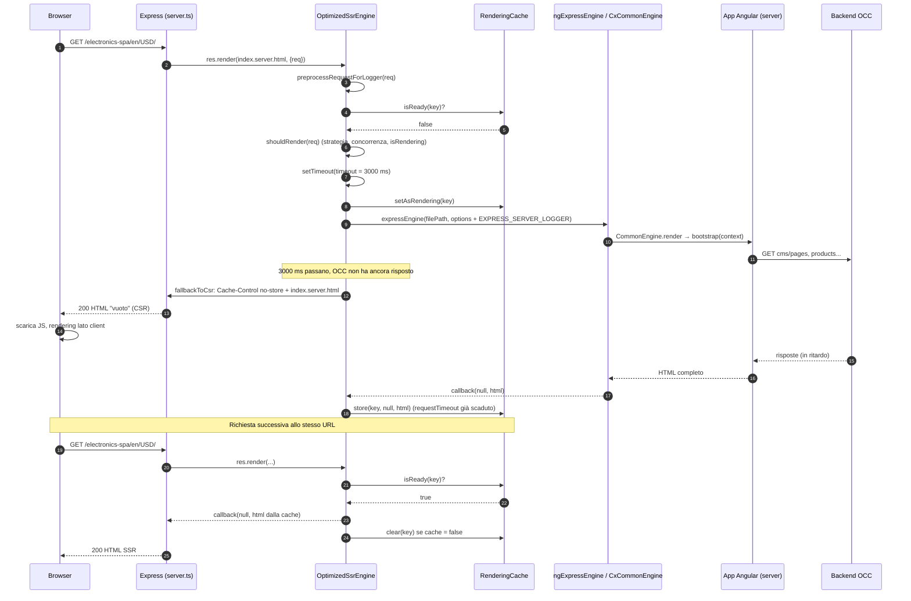
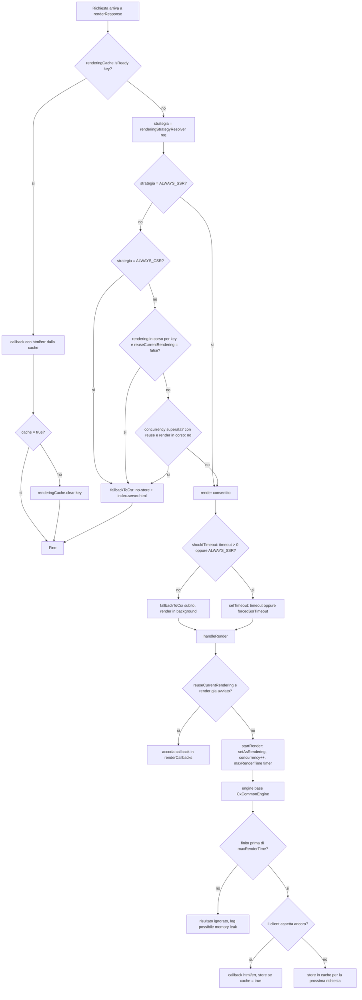
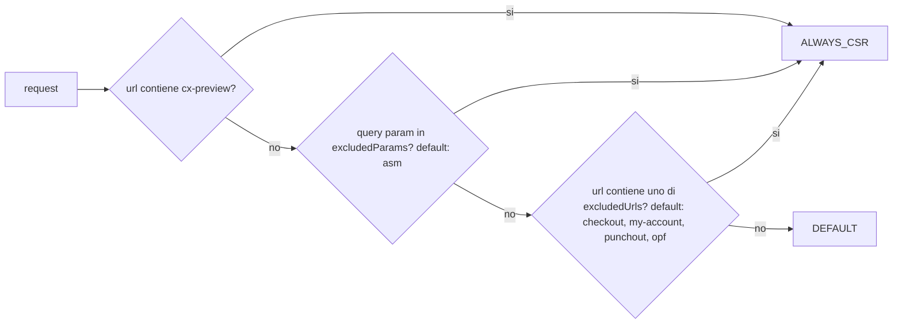
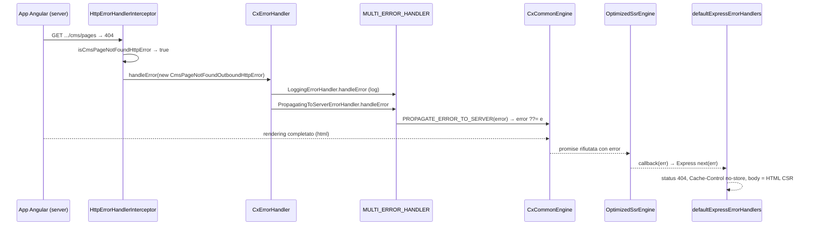

# 09 — Server-Side Rendering (SSR) in Spartacus

> Area H del deep dive. Basato sul codice reale del repository (versione `2611.0.0`, Angular 21.2, `@angular/ssr ~21.2.23` da `package.json`).
> Ogni affermazione cita un path relativo alla root del repo e il simbolo (classe, funzione, token). Quando qualcosa non è verificabile nei sorgenti presenti (ad esempio il codice interno di `@angular/ssr`, perché `node_modules` non è installato in questo checkout) lo segnalo con **NON VERIFICATO NEL CODICE**.

---

## Indice

1. [In una frase](#1-in-una-frase)
2. [Il problema che risolve](#2-il-problema-che-risolve)
3. [Come è implementato (con path)](#3-come-è-implementato-con-path)
   - 3.1 Mappa dei file
   - 3.2 Setup dell'app demo: `server.ts`, `main.server.ts`, `app.config.server.ts`, `app.module.server.ts`
   - 3.3 Quale engine usa davvero: `ngExpressEngine` → `CxCommonEngine` → `CommonEngine`
   - 3.4 `NgExpressEngineDecorator` e `decorateExpressEngine`
   - 3.5 `provideServer` e i provider per-richiesta
   - 3.6 `OptimizedSsrEngine` e `SsrOptimizationOptions`
   - 3.7 `RenderingStrategy` e `defaultRenderingStrategyResolver`
   - 3.8 `RenderingCache`
   - 3.9 Gestione errori SSR
   - 3.10 Logger lato server
   - 3.11 TransferState
   - 3.12 Piattaforma: `PLATFORM_ID`, `WindowRef`, servizi server/browser
   - 3.13 Hydration
   - 3.14 Autenticazione e cookie in SSR
   - 3.15 Componenti CMS con `disableSSR`
   - 3.16 Prerendering
   - 3.17 Script npm, target Nx e struttura `dist/`
   - 3.18 Sicurezza: validazione dell'origin
   - 3.19 Test E2E SSR
4. [Flusso passo-passo](#4-flusso-passo-passo)
5. [Codice minimo riscritto a mano](#5-codice-minimo-riscritto-a-mano)
6. [Errori comuni](#6-errori-comuni)
7. [Domande di autoverifica](#7-domande-di-autoverifica)

---

## 1. In una frase

Spartacus esegue la stessa app Angular dentro un server Node/Express per produrre l'HTML completo della pagina richiesta, lo protegge con un "motore ottimizzato" (`OptimizedSsrEngine`) che, se il rendering è troppo lento o il server è troppo carico, risponde subito con l'`index.html` vuoto della SPA (fallback CSR), e passa al browser lo stato NgRx già caricato (TransferState) così che il client non ripeta le stesse chiamate OCC.

---

## 2. Il problema che risolve

### 2.1 Cos'è

Una SPA Angular "pura" (CSR, Client-Side Rendering) manda al browser un HTML quasi vuoto: `<cx-storefront>` più i tag `<script>`. Il contenuto vero (header, prodotti, CMS) appare solo dopo che il JavaScript è stato scaricato, eseguito e ha chiamato le API OCC.

L'SSR (Server-Side Rendering) sposta il primo rendering sul server: Node avvia l'app Angular, questa chiama OCC, costruisce il DOM e il server lo serializza in una stringa HTML che il browser può dipingere subito.

### 2.2 Perché serve in un e-commerce

| Problema in CSR | Come lo risolve l'SSR |
|---|---|
| SEO: i crawler vedono una pagina vuota | L'HTML contiene titolo, meta, testo del prodotto |
| First Contentful Paint lento | Il browser dipinge l'HTML prima del JS |
| Anteprime social (Open Graph) vuote | I meta tag sono già nel documento |
| Doppie chiamate API (server + client) | TransferState porta lo stato NgRx nel client |

### 2.3 Perché serve un motore "ottimizzato"

L'SSR ha dei costi concreti:

- ogni richiesta crea una **nuova istanza** dell'app Angular in memoria;
- se OCC risponde lentamente, la richiesta HTTP del cliente resta appesa;
- sotto carico, troppi rendering in parallelo esauriscono CPU e memoria di Node.

Per questo Spartacus non usa l'engine di Angular "nudo", ma lo avvolge in `OptimizedSsrEngine` (`core-libs/setup/ssr/optimized-engine/optimized-ssr-engine.ts`) che aggiunge timeout, limite di concorrenza, cache in memoria, deduplicazione dei rendering e fallback a CSR. Il commento di `fallbackToCsr` lo dice esplicitamente: "When SSR page can not be returned in time, we're returning index.html of the CSR application".

### 2.4 Esempio minimo del problema

```typescript
// Senza protezione: se OCC impiega 15 secondi, il cliente aspetta 15 secondi.
server.get('*', (req, res) => {
  res.render('index.html', { req }); // nessun timeout, nessun limite
});

// Con OptimizedSsrEngine: dopo `timeout` ms (default 3000) il cliente
// riceve l'index.html vuoto (CSR) e il rendering continua in background
// per finire in cache e servire la richiesta successiva.
const engine = NgExpressEngineDecorator.get(ngExpressEngine, { timeout: 3000 });
```

---

## 3. Come è implementato (con path)

### 3.1 Mappa dei file

| Path | Simboli principali | Ruolo |
|---|---|---|
| `projects/storefrontapp/src/server.ts` | `app()`, `run()`, `ssrOptions` | Server Express dell'app demo |
| `projects/storefrontapp/src/main.server.ts` | `bootstrap` (export default) | Bootstrap standalone lato server |
| `projects/storefrontapp/src/app/app.config.server.ts` | `config`, `serverConfig` | `ApplicationConfig` server = client + server |
| `projects/storefrontapp/src/app/app.module.server.ts` | `AppServerModule` | Chiama `provideServer(...)` |
| `projects/storefrontapp/src/app/app.config.ts` | `appConfig` | Config client con `provideClientHydration` |
| `core-libs/setup/ssr/public_api.ts` | re-export | API pubblica di `@spartacus/setup/ssr` |
| `core-libs/setup/ssr/engine/ng-express-engine.ts` | `ngExpressEngine`, `NgSetupOptions`, `RenderOptions` | Adattatore Express → `CxCommonEngine` |
| `core-libs/setup/ssr/engine/cx-common-engine.ts` | `CxCommonEngine` | Estende `CommonEngine` di `@angular/ssr/node` e propaga errori |
| `core-libs/setup/ssr/engine-decorator/ng-express-engine-decorator.ts` | `NgExpressEngineDecorator`, `decorateExpressEngine` | Aggiunge provider Spartacus e `OptimizedSsrEngine` |
| `core-libs/setup/ssr/optimized-engine/optimized-ssr-engine.ts` | `OptimizedSsrEngine`, `SsrCallbackFn` | Timeout, concorrenza, cache, fallback CSR |
| `core-libs/setup/ssr/optimized-engine/ssr-optimization-options.ts` | `SsrOptimizationOptions`, `RenderingStrategy`, `defaultSsrOptimizationOptions`, `getDefaultRenderKey` | Opzioni e default |
| `core-libs/setup/ssr/optimized-engine/rendering-strategy-resolver.ts` | `defaultRenderingStrategyResolver` | Decide CSR/SSR per richiesta |
| `core-libs/setup/ssr/optimized-engine/rendering-strategy-resolver-options.ts` | `RenderingStrategyResolverOptions`, `defaultRenderingStrategyResolverOptions` | URL e query param esclusi |
| `core-libs/setup/ssr/optimized-engine/rendering-cache/rendering-cache.ts` | `RenderingCache` | Cache in memoria dei rendering |
| `core-libs/setup/ssr/optimized-engine/rendering-cache/default-cache-entry-size-calculator.ts` | `DefaultCacheEntrySizeCalculator` | Stima dimensione voce di cache |
| `core-libs/setup/ssr/optimized-engine/request-context.ts` | `RequestContext`, `getRequestContext`, `preprocessRequestForLogger` | UUID e trace per i log |
| `core-libs/setup/ssr/providers/ssr-providers.ts` | `provideServer`, `getServerRequestProviders` | Provider SSR |
| `core-libs/setup/ssr/providers/server-request-url.ts` | `serverRequestUrlFactory` | Risolve `SERVER_REQUEST_URL` |
| `core-libs/setup/ssr/providers/server-request-origin.ts` | `serverRequestOriginFactory` | Risolve `SERVER_REQUEST_ORIGIN` |
| `core-libs/setup/ssr/express-utils/express-request-url.ts` | `getRequestUrl` | Origin + `req.originalUrl` |
| `core-libs/setup/ssr/express-utils/express-request-origin.ts` | `getRequestOrigin` | Protocollo + host (o `X-Forwarded-Host`) |
| `core-libs/setup/ssr/express-utils/express-origin-validation-middleware.ts` | `getOriginValidationMiddleware` | Allowlist degli origin |
| `core-libs/setup/ssr/tokens/express.tokens.ts` | `REQUEST`, `RESPONSE` | Token per `req`/`res` di Express |
| `core-libs/setup/ssr/error-handling/...` | `PROPAGATE_ERROR_TO_SERVER`, `PropagatingToServerErrorHandler`, `defaultExpressErrorHandlers` | Errori SSR |
| `core-libs/setup/ssr/logger/...` | `ExpressServerLogger`, `EXPRESS_SERVER_LOGGER`, `DefaultExpressServerLogger`, `ExpressLoggerService`, `PrerenderingLoggerService`, `serverLoggerServiceFactory` | Log lato server |
| `core-libs/setup/ssr/testing/test-config-server.module.ts` | `TestConfigServerModule` | Config iniettata dai test E2E via cookie |
| `core-libs/core/src/util/ssr.tokens.ts` | `SERVER_REQUEST_URL`, `SERVER_REQUEST_ORIGIN` | Token in `@spartacus/core` |
| `core-libs/core/src/state/reducers/transfer-state.reducer.ts` | `CX_KEY`, `getTransferStateReducer`, `getServerTransferStateReducer`, `getBrowserTransferStateReducer` | TransferState dello store NgRx |
| `core-libs/core/src/state/config/state-config.ts` | `StateTransferType`, `StateConfig` | Config delle chiavi trasferite |
| `core-libs/core/src/window/window-ref.ts` | `WindowRef` | Accesso sicuro a `window`/`location` |
| `core-libs/storefront/utils/directive-state-transfer.service.ts` | `DirectiveStateTransferService` | Transfer di stringhe via attributi DOM |
| `core-libs/storefront/cms-structure/services/cms-components.service.ts` | `CmsComponentsService.shouldRender` | Rispetta `disableSSR` |

L'API pubblica di `@spartacus/setup/ssr` è definita in `core-libs/setup/ssr/public_api.ts` (entry point secondario, `core-libs/setup/ssr/ng-package.json`) e riesporta: `engine-decorator`, `express-utils/express-origin-validation-middleware`, `engine/cx-common-engine`, `engine/ng-express-engine`, `error-handling`, `logger`, `optimized-engine`, `providers`, `testing`, `tokens/express.tokens`.

Nota: `express-request-url.ts` e `express-request-origin.ts` **non** sono riesportati da `public_api.ts` (vengono usati internamente, ad esempio `getDefaultRenderKey = getRequestUrl` in `ssr-optimization-options.ts`, che invece è pubblico).

---

### 3.2 Setup dell'app demo

#### 3.2.1 `server.ts` (letto per intero)

**Cos'è.** Il punto d'ingresso Node: crea l'app Express, registra l'engine HTML, serve i file statici e usa l'engine Angular per tutte le altre rotte.

**Perché.** Il builder Angular (`@angular-builders/custom-esbuild:application` in `projects/storefrontapp/project.json`, opzione `"ssr": { "entry": "projects/storefrontapp/src/server.ts" }`) compila questo file come `server.mjs`.

**Dove sta.** `projects/storefrontapp/src/server.ts`.

Cosa fa, riga per riga (riassunto fedele):

1. Importa da `@spartacus/setup/ssr`: `NgExpressEngineDecorator`, `SsrOptimizationOptions`, `defaultExpressErrorHandlers`, `defaultSsrOptimizationOptions`, `ngExpressEngine as engine`, `getOriginValidationMiddleware`.
2. Costruisce `ssrOptions`:
   - `timeout: Number(process.env['SSR_TIMEOUT'] ?? defaultSsrOptimizationOptions.timeout)`;
   - `cache: process.env['SSR_CACHE'] === 'true'`.
3. `const ngExpressEngine = NgExpressEngineDecorator.get(engine, ssrOptions);`
4. `app()`:
   - `serverDistFolder = dirname(fileURLToPath(import.meta.url))` (cartella di `server.mjs`);
   - `browserDistFolder = resolve(serverDistFolder, '../browser')`;
   - `indexHtml = join(serverDistFolder, 'index.server.html')` e ne legge il contenuto in `indexHtmlContent`;
   - `server.set('trust proxy', 'loopback')`;
   - `server.use(getOriginValidationMiddleware({ allowedOrigins: process.env['SSR_ALLOWED_ORIGINS'] }))`;
   - `server.engine('html', ngExpressEngine({ bootstrap }))`;
   - `server.set('view engine', 'html')`, `server.set('views', browserDistFolder)`;
   - statici: `server.get(/.*\..*/, express.static(browserDistFolder, { maxAge: '1y' }))` (qualsiasi path con un punto, cioè file);
   - tutte le altre rotte: `server.get(/.*/, (req, res) => res.render(indexHtml, { req, providers: [{ provide: APP_BASE_HREF, useValue: req.baseUrl }] }))`;
   - in coda: `server.use(defaultExpressErrorHandlers(indexHtmlContent))`.
5. `run()`: ascolta su `process.env['PORT'] || 4000` e stampa `Node Express server listening on http://localhost:${port}` (il test E2E aspetta proprio questa stringa: `projects/ssr-tests/src/utils/ssr.utils.ts`, `startSsrServer`).

Esempio minimo (ridotto all'essenziale):

```typescript
import express from 'express';
import {
  NgExpressEngineDecorator,
  ngExpressEngine as engine,
  defaultExpressErrorHandlers,
} from '@spartacus/setup/ssr';
import bootstrap from './main.server';

const ngExpressEngine = NgExpressEngineDecorator.get(engine, { timeout: 3000 });

const server = express();
server.engine('html', ngExpressEngine({ bootstrap }));
server.set('view engine', 'html');
server.get(/.*/, (req, res) => res.render('/abs/path/index.server.html', { req }));
server.use(defaultExpressErrorHandlers('<html>...csr...</html>'));
```

#### 3.2.2 `main.server.ts`

**Cos'è.** Esporta di default una funzione `bootstrap(context: BootstrapContext)` che chiama `bootstrapApplication(AppComponent, config, context)`.

**Perché.** Con le API standalone di Angular, l'engine lato server riceve una funzione di bootstrap (non un `NgModule`). Il `BootstrapContext` è passato dal motore di rendering di Angular per legare l'app alla piattaforma server della singola richiesta.

**Dove sta.** `projects/storefrontapp/src/main.server.ts`; `config` arriva da `./app/app.config.server`.

```typescript
const bootstrap = (context: BootstrapContext) =>
  bootstrapApplication(AppComponent, config, context);
export default bootstrap;
```

#### 3.2.3 `app.config.server.ts`

**Cos'è.** `config = mergeApplicationConfig(appConfig, serverConfig)`, dove `serverConfig.providers` contiene:

- `provideServerRendering()` (da `@angular/platform-server`);
- `importProvidersFrom(AppServerModule)`;
- `importProvidersFrom(TestConfigServerModule.forRoot())` con il commento "DO NOT USE IN CUSTOMERS APPS" (serve ai test E2E per iniettare config via cookie).

**Perché.** Il server deve avere tutti i provider del client (`appConfig`) più quelli specifici del server.

**Dove sta.** `projects/storefrontapp/src/app/app.config.server.ts`.

#### 3.2.4 `app.module.server.ts`

**Cos'è.** `AppServerModule` è un `NgModule` vuoto a parte i provider: `...provideServer({ serverRequestOrigin: process.env['SERVER_REQUEST_ORIGIN'] })`.

**Perché.** `provideServer` registra `SERVER_REQUEST_ORIGIN`, `SERVER_REQUEST_URL`, il `LoggerService` lato server e il `PropagatingToServerErrorHandler` (vedi 3.5). La variabile d'ambiente `SERVER_REQUEST_ORIGIN` è opzionale in SSR ma obbligatoria nel prerendering (commento di `ServerOptions.serverRequestOrigin` in `core-libs/setup/ssr/providers/model.ts`).

**Dove sta.** `projects/storefrontapp/src/app/app.module.server.ts`.

#### 3.2.5 `app.config.ts` (lato client, ma rilevante per SSR)

```typescript
export const appConfig: ApplicationConfig = {
  providers: [
    provideHttpClient(withFetch(), withInterceptorsFromDi()),
    provideClientHydration(withEventReplay(), withNoHttpTransferCache()),
    provideZoneChangeDetection({ eventCoalescing: true }),
    provideBrowserGlobalErrorListeners(),
    importProvidersFrom(AppModule),
  ],
};
```

Punti chiave (path: `projects/storefrontapp/src/app/app.config.ts`):

- `withFetch()`: l'`HttpClient` usa `fetch`, disponibile anche in Node.
- `withInterceptorsFromDi()`: Spartacus registra i suoi interceptor come classi via DI (`HTTP_INTERCEPTORS`), quindi questa opzione è necessaria.
- `withNoHttpTransferCache()`: disabilita la cache HTTP automatica di Angular, perché Spartacus trasferisce lo **stato NgRx** (vedi 3.11), non le risposte HTTP.
- `withEventReplay()`: gli eventi utente (click) avvenuti prima della hydration vengono registrati e rieseguiti dopo.

---

### 3.3 Quale engine usa davvero

Domanda: Spartacus usa `NgExpressEngineDecorator`, `CommonEngine` o `AngularNodeAppEngine`?

Risposta verificata nel codice:

- `server.ts` usa `NgExpressEngineDecorator.get(engine, ssrOptions)` dove `engine` è `ngExpressEngine` di Spartacus.
- `ngExpressEngine` (`core-libs/setup/ssr/engine/ng-express-engine.ts`) crea `new CxCommonEngine({ bootstrap, providers, enablePerformanceProfiler, allowedHosts })`.
- `CxCommonEngine` (`core-libs/setup/ssr/engine/cx-common-engine.ts`) **estende `CommonEngine`** importato da `@angular/ssr/node`.
- `AngularNodeAppEngine` / `AngularAppEngine` / `createNodeRequestHandler`: un grep su `core-libs` e `projects` non trova nessun uso. **Spartacus 2611 non usa `AngularNodeAppEngine`.**

Quindi la catena è:

```
Express res.render()
  → OptimizedSsrEngine.renderResponse()   (se ci sono optimizationOptions)
    → funzione restituita da ngExpressEngine()
      → CxCommonEngine.render()
        → CommonEngine.render()  (@angular/ssr/node)
          → bootstrap(context)  (main.server.ts)
```

#### 3.3.1 `ngExpressEngine`

**Cos'è.** Una factory che restituisce una funzione con la firma di un "view engine" Express: `(filePath, options, callback) => void`.

**Perché.** Angular 17 ha rimosso `@nguniversal/express-engine`; Spartacus ne ha scritto un equivalente (i commenti in `tokens/express.tokens.ts` lo spiegano: "It's a replacement for the `REQUEST` token from `@nguniversal/express-engine` that was removed only in Angular 17").

**Cosa fa per ogni richiesta** (`ngExpressEngine`, funzione interna):

1. Se né `setupOptions.bootstrap` né `renderOptions.bootstrap` sono presenti, lancia `'You must pass in a NgModule to be bootstrapped'`.
2. `res = renderOptions.res ?? req.res`.
3. `url` = `${req.protocol}://${req.get('host') || ''}${req.baseUrl}${req.url}` se non già fornito.
4. `documentFilePath` = `filePath` (il file passato a `res.render`, cioè `index.server.html`).
5. Aggiunge i provider `REQUEST` (sempre) e `RESPONSE` (se c'è `res`) tramite `getReqResProviders`.
6. `publicPath` = opzione esplicita, oppure `options.settings.views` (il valore di `server.set('views', browserDistFolder)`).
7. `engine.render(renderOptions).then(html => callback(null, html)).catch(callback)`.

#### 3.3.2 `CxCommonEngine`

**Cos'è.** Sottoclasse di `CommonEngine` che sovrascrive `render()`.

**Perché.** Angular non propaga all'esterno gli errori asincroni dell'app (il commento di `PROPAGATE_ERROR_TO_SERVER` cita l'issue Angular #33642). Senza questa classe una pagina con OCC in errore verrebbe restituita come 200.

**Come.** Aggiunge un provider `PROPAGATE_ERROR_TO_SERVER` che salva **solo il primo** errore (`error ??= propagatedError`); quando il rendering finisce, se c'è un errore, la promise viene rifiutata con quell'errore invece di restituire l'HTML.

```typescript
override async render(options: CommonEngineRenderOptions): Promise<string> {
  let error: unknown;
  return super
    .render({
      ...options,
      providers: [
        {
          provide: PROPAGATE_ERROR_TO_SERVER,
          useFactory: () => (e: unknown) => { error ??= e; },
        },
        ...(options.providers ?? []),
      ],
    })
    .then((html) => {
      if (error) throw error;
      return html;
    });
}
```

Nota importante: l'errore viene lanciato **dopo** che il rendering è completo, non subito.

#### 3.3.3 `allowedHosts` e `NG_ALLOWED_HOSTS`

`ngExpressEngine` passa `setupOptions.allowedHosts` a `CxCommonEngine`. Gli script `serve:ssr*` in `package.json` impostano `NG_ALLOWED_HOSTS=localhost`. Che `CommonEngine` legga `NG_ALLOWED_HOSTS` come fallback è comportamento di `@angular/ssr`: **NON VERIFICATO NEL CODICE** (sorgente non presente nel checkout).

---

### 3.4 `NgExpressEngineDecorator` e `decorateExpressEngine`

**Cos'è.** Un "decoratore" (higher-order function) sopra `ngExpressEngine`.

**Perché.** Due cose da aggiungere senza toccare l'engine base:

1. i provider Spartacus per-richiesta (`getServerRequestProviders()`);
2. il wrapper `OptimizedSsrEngine`.

**Dove sta.** `core-libs/setup/ssr/engine-decorator/ng-express-engine-decorator.ts`.

```typescript
export function decorateExpressEngine(
  ngExpressEngine: NgExpressEngine,
  optimizationOptions: SsrOptimizationOptions | null | undefined = defaultSsrOptimizationOptions
): NgExpressEngine {
  return function (setupOptions: NgSetupOptions) {
    const engineInstance = ngExpressEngine({
      ...setupOptions,
      providers: [...getServerRequestProviders(), ...(setupOptions.providers ?? [])],
    });
    return optimizationOptions
      ? new OptimizedSsrEngine(engineInstance, optimizationOptions).engineInstance
      : engineInstance;
  };
}
```

Dettaglio sottile ma importante:

- `NgExpressEngineDecorator.get(engine)` (senza secondo argomento) → `optimizationOptions` è `undefined` → scatta il valore di default del parametro → **motore ottimizzato con i default**.
- `NgExpressEngineDecorator.get(engine, null)` → `null` non attiva il default → **nessun `OptimizedSsrEngine`**, solo l'engine base.

---

### 3.5 `provideServer` e i provider per-richiesta

**Dove sta.** `core-libs/setup/ssr/providers/ssr-providers.ts`.

Ci sono **due** funzioni diverse:

#### 3.5.1 `getServerRequestProviders()` (livello engine)

Chiamata da `decorateExpressEngine`. Restituisce `StaticProvider[]`:

```typescript
{ provide: SERVER_REQUEST_ORIGIN, useFactory: getRequestOrigin, deps: [REQUEST] },
{ provide: SERVER_REQUEST_URL,    useFactory: getRequestUrl,    deps: [REQUEST] },
```

Cioè calcola origin e URL direttamente dall'oggetto `Request` di Express.

- `getRequestOrigin(req)` (`core-libs/setup/ssr/express-utils/express-request-origin.ts`): se c'è l'header `X-Forwarded-Host` **e** Express si fida del proxy (`req.app.get('trust proxy fn')(req.connection.remoteAddress, 0)`), usa il primo valore di `X-Forwarded-Host`; altrimenti `req.get('host')`. Il protocollo è `req.protocol`.
- `getRequestUrl(req)` (`express-request-url.ts`): `getRequestOrigin(req) + req.originalUrl`.

Siccome `server.ts` imposta `trust proxy = 'loopback'`, `X-Forwarded-Host` è considerato solo se la connessione arriva da localhost.

#### 3.5.2 `provideServer(options?)` (livello applicazione)

Usata in `AppServerModule`. Restituisce `Provider[]`:

| Token | Provider | Effetto |
|---|---|---|
| `SERVER_REQUEST_ORIGIN` | `useFactory: serverRequestOriginFactory(options)` | Se c'è `options.serverRequestOrigin` vince quello; altrimenti prende il valore del livello superiore (`inject(SERVER_REQUEST_ORIGIN, { optional: true, skipSelf: true })`); se manca tutto lancia un errore con istruzioni |
| `SERVER_REQUEST_URL` | `useFactory: serverRequestUrlFactory(options)` | In SSR prende il valore del livello superiore (con `skipSelf`), eventualmente sostituendo l'origin; nel prerendering lo costruisce da `INITIAL_CONFIG.url` (solo il `pathname`) |
| `LoggerService` | `useFactory: serverLoggerServiceFactory` | `ExpressLoggerService` se c'è `REQUEST`, altrimenti `PrerenderingLoggerService` |
| `MULTI_ERROR_HANDLER` | `useExisting: PropagatingToServerErrorHandler, multi: true` | Inoltra gli errori a `PROPAGATE_ERROR_TO_SERVER` |

Il fatto che le factory usino `skipSelf: true` indica che i provider di `getServerRequestProviders` vivono in un injector **padre** (quello della piattaforma creato da `CommonEngine`). Che `CommonEngine` metta i provider del costruttore e del `render` tra i provider di piattaforma è comportamento interno di `@angular/ssr`: **NON VERIFICATO NEL CODICE**, ma è coerente con l'uso di `skipSelf` e con i test `core-libs/setup/ssr/providers/server-request-url.spec.ts`.

#### 3.5.3 I token `SERVER_REQUEST_URL` e `SERVER_REQUEST_ORIGIN`

Definiti in `core-libs/core/src/util/ssr.tokens.ts` (quindi in `@spartacus/core`, non in `setup/ssr`), come `InjectionToken<string>`. Il consumatore principale è `WindowRef.location` (vedi 3.12).

#### 3.5.4 `REQUEST` e `RESPONSE`

Definiti in `core-libs/setup/ssr/tokens/express.tokens.ts` come `InjectionToken<Request>` / `InjectionToken<Response>` (tipi di `express`). Forniti per ogni richiesta da `ngExpressEngine` (`getReqResProviders`). Sono `null` nel browser e nel prerendering: per questo vanno iniettati con `{ optional: true }`, come fanno `serverLoggerServiceFactory` e `TestConfigServerModule`.

Esempio: leggere un cookie in SSR.

```typescript
import { inject, Injectable } from '@angular/core';
import { REQUEST } from '@spartacus/setup/ssr';

@Injectable({ providedIn: 'root' })
export class CookieReader {
  private request = inject(REQUEST, { optional: true });

  get(name: string): string | undefined {
    const header = this.request?.get('Cookie') ?? '';
    const match = header.match(new RegExp(`(?:^|;\\s*)${name}=([^;]*)`));
    return match ? decodeURIComponent(match[1]) : undefined;
  }
}
```

Nota: importare `@spartacus/setup/ssr` porta dipendenze Node (`express`, `crypto`, `fs`) nel grafo. In un'app reale conviene usare questi token solo in codice che finisce nel bundle server.

---

### 3.6 `OptimizedSsrEngine` e `SsrOptimizationOptions`

#### 3.6.1 Cos'è

`OptimizedSsrEngine` (`core-libs/setup/ssr/optimized-engine/optimized-ssr-engine.ts`) è una classe che riceve l'engine Express "base" e ne espone uno nuovo tramite il getter `engineInstance` (`this.renderResponse.bind(this)`). Per Express è un view engine come un altro; dentro però decide, richiesta per richiesta, se:

- servire un risultato dalla cache;
- rispondere subito con l'HTML CSR;
- avviare il rendering con un timeout;
- agganciarsi a un rendering già in corso per la stessa chiave.

#### 3.6.2 Perché

Vedi sezione 2.3: proteggere tempi di risposta e memoria del server Node.

#### 3.6.3 Stato interno

| Campo | Tipo | Uso |
|---|---|---|
| `currentConcurrency` | `number` | Rendering attivi in questo momento |
| `renderingCache` | `RenderingCache` | Rendering in corso e risultati salvati |
| `logger` | `ExpressServerLogger` | Log strutturati |
| `templateCache` | `Map<string, string>` (private) | Contenuto di `index.server.html` letto una volta con `fs.readFileSync` (`getDocument`) |
| `renderCallbacks` | `Map<string, SsrCallbackFn[]>` (private) | Callback in attesa dello stesso rendering (solo con `reuseCurrentRendering`) |

Nel costruttore le opzioni utente vengono unite ai default (`{ ...defaultSsrOptimizationOptions, ...ssrOptions, ssrFeatureToggles: {...} }`). Se alla fine manca `logger` viene lanciato `'`SsrOptimizationOptions.logger` is not defined'`. Poi `logOptions()` scrive nel log `[spartacus] SSR optimization engine initialized` con le opzioni rese stampabili da `getLoggableSsrOptimizationOptions` (`get-loggable-ssr-optimization-options.ts`: le istanze di classe diventano il nome della classe, le funzioni diventano il loro sorgente).

#### 3.6.4 Tabella completa delle opzioni

Fonte: interfaccia `SsrOptimizationOptions` e costante `defaultSsrOptimizationOptions` in `core-libs/setup/ssr/optimized-engine/ssr-optimization-options.ts`.

| Opzione | Tipo | Default | Significato (dal codice) |
|---|---|---|---|
| `timeout` | `number` | `3_000` | Ms di attesa del rendering prima del fallback CSR. Se `0` (falsy) e la strategia non è `ALWAYS_SSR`, la risposta è **subito** CSR e il rendering prosegue in background (`renderResponse`, ramo `else`) |
| `cache` | `boolean` | `false` | Cache in memoria persistente. Se `false` la cache è usata comunque per conservare **una volta** un rendering finito dopo il fallback, poi viene rimosso (`returnCachedRender` chiama `clear`) |
| `cacheSizeMemory` | `number` | `800_000_000` | Limite in byte della memoria della cache (non esiste un'opzione `cacheSize`: il nome reale è `cacheSizeMemory`) |
| `cacheEntrySizeCalculator` | `CacheEntrySizeCalculator` | `new DefaultCacheEntrySizeCalculator()` | Stima la dimensione di una voce (`2 * string.length` per HTML; somma di `name`, `message`, `stack` per gli errori) |
| `concurrency` | `number` | `10` | Numero massimo di rendering paralleli; oltre, fallback CSR |
| `ttl` | `number \| undefined` | `undefined` | Ms dopo cui una voce in cache è "vecchia" (`RenderingCache.isFresh`). Senza ttl non scade mai |
| `renderKeyResolver` | `(req) => string` | `getDefaultRenderKey` (= `getRequestUrl`) | Chiave della cache e della deduplicazione; default = URL completo con origin |
| `renderingStrategyResolver` | `(req) => RenderingStrategy` | `defaultRenderingStrategyResolver(defaultRenderingStrategyResolverOptions)` | Strategia per richiesta (vedi 3.7) |
| `forcedSsrTimeout` | `number` | `60_000` | Timeout usato quando la strategia è `ALWAYS_SSR` |
| `maxRenderTime` | `number` | `300_000` | Oltre questo tempo un rendering è considerato "appeso": libera lo slot di concorrenza, dimentica i callback, logga un possibile memory leak |
| `reuseCurrentRendering` | `boolean` | `true` | Le richieste successive per la stessa chiave attendono il rendering in corso invece di fare fallback; occupano **un solo** slot di concorrenza |
| `debug` | `boolean` | (escluso dai default) | `@deprecated` dalla 2211.27: i log sono ora sempre attivi |
| `logger` | `ExpressServerLogger` | `new DefaultExpressServerLogger()` | Logger del motore |
| `shouldCacheRenderingResult` | `({ options, entry }) => boolean` | `({ entry: { err } }) => !err` | Se salvare in cache un risultato. Di default gli errori **non** vengono salvati |
| `ssrFeatureToggles` | `{}` | `{}` | Toggle temporanei del motore; oggi l'oggetto è vuoto |

Il tipo `DefaultSsrOptimizationOptions` usa `Required<...>` (meno `debug` e `ttl`) per garantire che ogni opzione abbia un default e sia stampabile nei log all'avvio.

#### 3.6.5 Il metodo `renderResponse` spiegato

Pseudocodice fedele a `OptimizedSsrEngine.renderResponse`:

```typescript
renderResponse(filePath, options, callback) {
  preprocessRequestForLogger(options.req, this.logger); // UUID + traceparent in res.locals.cx.request
  const request = options.req;
  const response = options.req.res;

  // 1. Cache
  if (this.returnCachedRender(request, callback)) { log('Render from cache'); return; }

  // 2. Posso renderizzare?
  if (!this.shouldRender(request)) { this.fallbackToCsr(response, filePath, callback); return; }

  // 3. Timeout
  let requestTimeout;
  if (this.shouldTimeout(request)) {
    requestTimeout = setTimeout(() => {
      requestTimeout = undefined;
      this.fallbackToCsr(response, filePath, callback);
    }, this.getTimeout(request));
  } else {
    this.fallbackToCsr(response, filePath, callback); // risposta subito, render in background
  }

  // 4. Callback di fine rendering
  const renderCallback = (err, html) => {
    if (requestTimeout) {           // il client sta ancora aspettando
      clearTimeout(requestTimeout);
      callback(err, html);
      this.ssrOptions.cache
        ? this.renderingCache.store(key, err, html)
        : this.renderingCache.clear(key);
    } else {                        // il client ha già ricevuto CSR
      this.renderingCache.store(key, err, html); // per la prossima richiesta
    }
  };

  // 5. Avvio (o aggancio) del rendering
  this.handleRender({ filePath, options, renderCallback, request });
}
```

#### 3.6.6 `shouldRender`

```typescript
const fallBack = renderingCache.isRendering(key) && !reuseCurrentRendering;
return (
  (!fallBack && !concurrencyLimitExceeded && strategy !== ALWAYS_CSR) ||
  strategy === ALWAYS_SSR
);
```

Conseguenze:

- `ALWAYS_SSR` ignora concorrenza e rendering in corso.
- `ALWAYS_CSR` non renderizza mai (a meno che… non sia anche `ALWAYS_SSR`, impossibile).
- `isConcurrencyLimitExceeded(key)` restituisce `false` se `reuseCurrentRendering` è attivo e c'è già un rendering per la stessa chiave: agganciarsi non costa uno slot.

#### 3.6.7 `fallbackToCsr`, header e "indice CSR"

```typescript
protected fallbackToCsr(response, filePath, callback) {
  response.set('Cache-Control', 'no-store');
  callback(undefined, this.getDocument(filePath));
}
```

- **Header**: `Cache-Control: no-store`, così CDN e proxy non memorizzano la pagina vuota al posto di quella renderizzata.
- **Indice CSR**: è il file passato a `res.render`, cioè `index.server.html` nella cartella server (`server.ts`), letto una sola volta e tenuto in `templateCache`. Non è l'HTML renderizzato: è il template "vuoto" con i `<script>` della SPA, che il browser poi esegue in modalità CSR.

#### 3.6.8 `handleRender` e `startRender`

- Senza `reuseCurrentRendering`: `startRender` diretto.
- Con `reuseCurrentRendering`: il `renderCallback` viene messo in `renderCallbacks[key]`; solo se non c'è già un rendering per quella chiave si chiama `startRender`, con un callback che distribuisce il risultato a **tutti** i callback in attesa e poi cancella la voce. Log: `Request is waiting for the SSR rendering to complete (...)`.

`startRender`:

1. avvia un `setTimeout` di `maxRenderTime` che, se scatta, fa `renderingCache.clear(key)`, `currentConcurrency--`, cancella `renderCallbacks[key]` e logga `Rendering of ... was not able to complete. This might cause memory leaks!`;
2. `renderingCache.setAsRendering(key)` e `currentConcurrency++`;
3. aggiunge il provider `{ provide: EXPRESS_SERVER_LOGGER, useValue: this.logger }` alle opzioni: è così che il logger del motore arriva dentro l'app Angular;
4. chiama l'engine base; al termine, se il `maxRenderTimeout` è già scattato ignora il risultato (log `...completed after the specified maxRenderTime, therefore it was ignored.`), altrimenti `clearTimeout`, `currentConcurrency--`, `renderCallback(err, html)`.

Il commento dice chiaramente: "There is no way to abort the running render of Angular Universal". Il rendering appeso continua a consumare memoria.

#### 3.6.9 Esempio di configurazione

```typescript
import {
  NgExpressEngineDecorator,
  ngExpressEngine,
  RenderingStrategy,
  SsrOptimizationOptions,
  defaultRenderingStrategyResolver,
  defaultRenderingStrategyResolverOptions,
} from '@spartacus/setup/ssr';

const resolveDefault = defaultRenderingStrategyResolver({
  ...defaultRenderingStrategyResolverOptions,
  excludedUrls: [...(defaultRenderingStrategyResolverOptions.excludedUrls ?? []), 'cart'],
});

const ssrOptions: SsrOptimizationOptions = {
  timeout: 3000,
  cache: true,
  ttl: 10 * 60 * 1000,              // 10 minuti
  cacheSizeMemory: 300_000_000,     // 300 MB
  concurrency: 20,
  reuseCurrentRendering: true,
  // chiave senza query string di tracking
  renderKeyResolver: (req) => `${req.protocol}://${req.get('host')}${req.path}`,
  renderingStrategyResolver: (req) =>
    req.get('User-Agent')?.includes('Googlebot')
      ? RenderingStrategy.ALWAYS_SSR
      : resolveDefault(req),
};

export const engine = NgExpressEngineDecorator.get(ngExpressEngine, ssrOptions);
```

---

### 3.7 `RenderingStrategy` e `defaultRenderingStrategyResolver`

#### 3.7.1 L'enum

```typescript
export enum RenderingStrategy {
  ALWAYS_CSR = -1,
  DEFAULT = 0,
  ALWAYS_SSR = 1,
}
```

(`core-libs/setup/ssr/optimized-engine/ssr-optimization-options.ts`)

| Valore | Comportamento in `OptimizedSsrEngine` |
|---|---|
| `ALWAYS_CSR` | `shouldRender` → `false` → fallback CSR immediato, nessun rendering |
| `DEFAULT` | Rispetta cache, concorrenza, `timeout` |
| `ALWAYS_SSR` | Renderizza sempre, ignora concorrenza e deduplicazione; timeout = `forcedSsrTimeout` (default 60 s); `shouldTimeout` è sempre vero |

#### 3.7.2 Il resolver di default

`defaultRenderingStrategyResolver(options)` (`rendering-strategy-resolver.ts`) restituisce `(request) => RenderingStrategy`:

1. se `request.url` contiene `cx-preview` (costante privata `defaultAlwaysCsrOptions.excludedUrls`) → `ALWAYS_CSR` (anteprima SmartEdit/CMS);
2. se una delle query string ha un nome in `options.excludedParams` → `ALWAYS_CSR`;
3. se `request.url` contiene (con `String.search`, quindi come regex) una delle stringhe di `options.excludedUrls` → `ALWAYS_CSR`;
4. altrimenti `DEFAULT`.

Non restituisce mai `ALWAYS_SSR`: per quello serve un resolver personalizzato.

Default (`rendering-strategy-resolver-options.ts`, `defaultRenderingStrategyResolverOptions`):

```typescript
{
  excludedUrls: ['checkout', 'my-account', 'punchout', 'opf'],
  excludedParams: ['asm'],
}
```

Perché: checkout e area personale dipendono dall'utente loggato (che il server non conosce, vedi 3.14); `asm` è la modalità Assisted Service; `punchout` e `opf` sono flussi di integrazione.

Attenzione: `search()` interpreta la stringa come regex e controlla tutto `request.url`, quindi `excludedUrls: ['opf']` esclude anche un ipotetico `/product/12/sopfa`.

---

### 3.8 `RenderingCache`

**Cos'è.** Una `Map<string, RenderingEntry>` con gestione della memoria (`core-libs/setup/ssr/optimized-engine/rendering-cache/rendering-cache.ts`).

`RenderingEntry` (`rendering-cache.model.ts`): `{ html?, err?, time?, rendering?, _size? }`.

| Metodo | Cosa fa |
|---|---|
| `setAsRendering(key)` | `clear(key)` poi salva `{ rendering: true }` |
| `isRendering(key)` | `true` se la voce ha `rendering` |
| `store(key, err, html)` | Crea `{ err, html }` (+ `time` se `ttl`), fa `clear(key)`, chiede a `shouldCacheRenderingResult` se salvare; se sì, `storeUsingMemoryLimit` |
| `storeUsingMemoryLimit` | Calcola la dimensione; se è più grande dell'intero limite non salva; altrimenti elimina le voci più vecchie (ordine di inserimento della `Map`, quindi FIFO) finché c'è spazio |
| `isReady(key)` | Esiste `html` o `err` **e** la voce è fresca |
| `isFresh(key)` | Senza `ttl` sempre `true`; altrimenti `Date.now() - time < ttl` |
| `clear(key)` | Cancella e decrementa la memoria tracciata (`RenderingCacheSizeManager.untrackEntrySize`) |

Perché `clear` prima di sovrascrivere: i commenti spiegano che altrimenti la dimensione della voce precedente resterebbe "orfana" nel contatore della memoria.

Esempio di calcolatore personalizzato:

```typescript
import { CacheEntrySizeCalculator, RenderingEntry } from '@spartacus/setup/ssr';

export class Utf8SizeCalculator implements CacheEntrySizeCalculator {
  calculateSize(entry: RenderingEntry): number {
    if (entry.html) return Buffer.byteLength(entry.html, 'utf8');
    if (entry.err) return Buffer.byteLength(String(entry.err?.stack ?? ''), 'utf8');
    return 0;
  }
}
```

---

### 3.9 Gestione errori SSR

#### 3.9.1 Cos'è

Un percorso che porta un errore nato dentro l'app Angular (tipicamente un errore HTTP verso OCC) fino a Express, per rispondere con lo **status code giusto** (404 o 500) invece di un 200 con una pagina rotta.

#### 3.9.2 Perché

Se la pagina CMS non esiste, i motori di ricerca devono vedere 404. Se OCC è giù, non bisogna mettere in cache (CDN) una pagina vuota con 200.

#### 3.9.3 I pezzi

| Pezzo | Path | Ruolo |
|---|---|---|
| `HttpErrorHandlerInterceptor` | `core-libs/core/src/error-handling/http-error-handler/http-error-handler.interceptor.ts` | Solo sul server (`shouldHandleError` → `!windowRef.isBrowser()`) avvolge gli errori HTTP in `OutboundHttpError` o `CmsPageNotFoundOutboundHttpError` e li passa a `ErrorHandler` |
| `CmsPageNotFoundOutboundHttpError` | `core-libs/core/src/error-handling/http-error-handler/outbound-http-error.ts` | Creato se status 404 e l'URL inizia con l'endpoint OCC `pages` (`isCmsPageNotFoundHttpError`) |
| `ErrorActionService` | `core-libs/core/src/error-handling/effects-error-handler/error-action.service.ts` | Solo sul server, passa a `ErrorHandler` le azioni NgRx di errore **non HTTP** (quelle HTTP sono già gestite dall'interceptor) |
| `CxErrorHandler` | `core-libs/core/src/error-handling/cx-error-handler.ts` | `ErrorHandler` di Angular che chiama tutti i `MULTI_ERROR_HANDLER` (registrato da `ErrorHandlingModule.forRoot()` in `error-handling.module.ts`) |
| `LoggingErrorHandler` | `core-libs/core/src/error-handling/multi-error-handler/logging-error-handler.ts` | Multi-handler di default: `logger.error(error)` |
| `PropagatingToServerErrorHandler` | `core-libs/setup/ssr/error-handling/multi-error-handlers/propagating-to-server-error-handler.ts` | Aggiunto da `provideServer`; chiama `PROPAGATE_ERROR_TO_SERVER` (o noop se assente) |
| `PROPAGATE_ERROR_TO_SERVER` | `core-libs/setup/ssr/error-handling/error-response/propagate-error-to-server.ts` | `InjectionToken<(error: unknown) => void>` fornito da `CxCommonEngine.render` |
| `defaultExpressErrorHandlers` | `core-libs/setup/ssr/error-handling/express-error-handlers/express-error-handlers.ts` | Middleware di errore Express |

#### 3.9.4 `defaultExpressErrorHandlers`

```typescript
export const defaultExpressErrorHandlers =
  (documentContent: string): ErrorRequestHandler =>
  (err, _req, res, _next) => {
    if (!res.headersSent) {
      res.set('Cache-Control', 'no-store');
      const statusCode =
        err instanceof CmsPageNotFoundOutboundHttpError
          ? HttpResponseStatus.NOT_FOUND
          : HttpResponseStatus.INTERNAL_SERVER_ERROR;
      res.status(statusCode).send(documentContent);
    }
  };
```

Il corpo della risposta d'errore è ancora l'HTML CSR (`indexHtmlContent` letto in `server.ts`): il browser caricherà la SPA, che mostrerà la sua pagina di errore/404 lato client. Lo status HTTP però è corretto.

Come arriva l'errore a questo middleware: `res.render(view, options)` senza callback, in Express, inoltra un eventuale errore a `next(err)` (comportamento standard di Express, **NON VERIFICATO NEL CODICE** del repo perché è interno a `express`).

#### 3.9.5 Errori e cache

- Con `cache: true`, di default gli errori **non** sono salvati (`shouldCacheRenderingResult: ({ entry: { err } }) => !err`). Il test `should render for the next request if previous render failed` in `projects/ssr-tests/src/ssr-testing.spec.ts` verifica che la seconda richiesta non sia servita dalla cache.
- Quando il rendering finisce **dopo** il fallback, `renderingCache.store` passa comunque per `shouldCacheRenderingResult`, quindi anche lì gli errori non vengono salvati.

#### 3.9.6 Timeout HTTP verso il backend

`HttpTimeoutInterceptor` (`core-libs/core/src/http/http-timeout/http-timeout.interceptor.ts`) applica un timeout diverso per piattaforma: `timeoutConfig.browser` o `timeoutConfig.server`. Il default (`default-http-timeout.config.ts`, `defaultBackendHttpTimeoutConfig`) è `backend.timeout.server = 20_000` (nessun default per il browser). Un timeout diventa un `HttpErrorResponse` e quindi, in SSR, un 500 (test `should receive response with status 500 if HTTP call to backend timeouted`).

---

### 3.10 Logger lato server

#### 3.10.1 Due livelli di logger

| Livello | Interfaccia / classe | Path | Chi lo usa |
|---|---|---|---|
| Express (motore) | `ExpressServerLogger` (`log/warn/error/info/debug(message, context)`) | `core-libs/setup/ssr/logger/loggers/express-server-logger.ts` | `OptimizedSsrEngine`, `preprocessRequestForLogger` |
| Default Express | `DefaultExpressServerLogger` | `core-libs/setup/ssr/logger/loggers/default-express-server-logger.ts` | Default di `SsrOptimizationOptions.logger` |
| Token | `EXPRESS_SERVER_LOGGER` | `express-server-logger.ts` | Fornito da `OptimizedSsrEngine.startRender` all'app |
| Angular | `LoggerService` | `core-libs/core/src/logger/logger.service.ts` | Tutto il codice Spartacus (`inject(LoggerService)`) |
| Angular su Express | `ExpressLoggerService` | `core-libs/setup/ssr/logger/services/express-logger.service.ts` | Inoltra a `EXPRESS_SERVER_LOGGER` aggiungendo `{ request }` |
| Angular in prerendering | `PrerenderingLoggerService` | `core-libs/setup/ssr/logger/services/prerendering-logger.service.ts` | Semplice `console.*` |
| Scelta | `serverLoggerServiceFactory` | `core-libs/setup/ssr/logger/services/server-logger-service-factory.ts` | `REQUEST` presente → Express, altrimenti Prerendering |

Nomi citati nella richiesta come `SERVER_LOGGER`, `SsrLogger` o "prefixed logger": un grep in `core-libs`, `feature-libs`, `integration-libs` e `projects` non trova simboli con questi nomi. **NON VERIFICATO NEL CODICE**: i nomi reali sono `EXPRESS_SERVER_LOGGER`, `ExpressServerLogger`, `DefaultExpressServerLogger`.

#### 3.10.2 Formato dei log

`DefaultExpressServerLogger.stringifyWithContext`:

- in dev mode (`isDevMode()`): output leggibile con `formatWithOptions(getLoggerInspectOptions(), logObject)`;
- in prod: **una riga JSON** `{ message, context }`, con gli `Error` convertiti in stringa (`stringifyError`).

`mapContext` aggiunge `timestamp`; `mapRequest` sostituisce l'oggetto `Request` con `{ url: request.originalUrl, ...getRequestContext(request) }`, cioè `uuid`, `timeReceived` e `traceContext` (W3C `traceparent`, parsato in `logger/loggers/w3c-trace-context/parse-traceparent.ts`).

`preprocessRequestForLogger` (`optimized-engine/request-context.ts`) salva il contesto in `request.res.locals.cx.request` all'inizio di `renderResponse`.

#### 3.10.3 Esempio: logger personalizzato

```typescript
import { DefaultExpressServerLogger, ExpressServerLoggerContext } from '@spartacus/setup/ssr';

export class TenantAwareLogger extends DefaultExpressServerLogger {
  protected override mapContext(context: ExpressServerLoggerContext) {
    return { ...super.mapContext(context), service: 'storefront-ssr' };
  }
}

// server.ts
const engine = NgExpressEngineDecorator.get(ngExpressEngine, {
  logger: new TenantAwareLogger(),
});
```

---

### 3.11 TransferState

#### 3.11.1 Cos'è

`TransferState` di Angular è una mappa chiave/valore che il server serializza nell'HTML (in uno `<script>` JSON) e che il client rilegge all'avvio. Spartacus la usa per trasferire **fette dello store NgRx** sotto un'unica chiave: `CX_KEY = makeStateKey<string>('cx-state')` (`core-libs/core/src/state/reducers/transfer-state.reducer.ts`). Il formato esatto del tag `<script>` generato da Angular è interno a `@angular/core`: **NON VERIFICATO NEL CODICE**.

#### 3.11.2 Perché

Senza TransferState il client ripartirebbe da uno store vuoto e rifarebbe tutte le chiamate OCC (pagina CMS, componenti, prodotto, siti, lingue, valute) appena fatte dal server: doppio carico e "flicker" durante la hydration. Per lo stesso motivo `app.config.ts` usa `withNoHttpTransferCache()`: lo stato viaggia già dentro NgRx, non serve anche la cache delle risposte HTTP.

#### 3.11.3 Cosa viene serializzato

Solo le feature NgRx che dichiarano `StateTransferType.TRANSFER_STATE` nella config `state.ssrTransfer.keys` (`core-libs/core/src/state/config/state-config.ts`; nota: il valore dell'enum è la stringa `'SSR'`).

| Feature | Dichiarata in | Chiave |
|---|---|---|
| CMS | `core-libs/core/src/cms/store/cms-store.module.ts` (`cmsStoreConfigFactory`) | `CMS_FEATURE` |
| Prodotti | `core-libs/core/src/product/store/product-store.module.ts` | `PRODUCT_FEATURE` |
| Site context | `core-libs/core/src/site-context/store/site-context-store.module.ts` | `SITE_CONTEXT_FEATURE` |
| Site theme | `core-libs/core/src/site-theme/store/site-theme-store.module.ts` | `SITE_THEME_FEATURE` |

Un grep di `TRANSFER_STATE` in `feature-libs` e `integration-libs` non trova altre dichiarazioni: carrello, utente, ordini **non** vengono trasferiti.

Esempio di dichiarazione (da `cms-store.module.ts`):

```typescript
export function cmsStoreConfigFactory(): StateConfig {
  return {
    state: {
      ssrTransfer: {
        keys: { [CMS_FEATURE]: StateTransferType.TRANSFER_STATE },
      },
    },
  };
}
// providers: [provideDefaultConfigFactory(cmsStoreConfigFactory)]
```

Le chiavi possono essere anche path annidati (es. `'product.details'`): la selezione avviene con `filterKeysByType` e `getStateSlice` (`core-libs/core/src/state/utils/get-state-slice.ts`). Il dettaglio di `getStateSlice` è descritto nel capitolo 06.

#### 3.11.4 Il meta-reducer

Registrazione (`core-libs/core/src/state/reducers/index.ts`, `stateMetaReducers`):

```typescript
{
  provide: TRANSFER_STATE_META_REDUCER,
  useFactory: getTransferStateReducer,
  deps: [PLATFORM_ID, [new Optional(), TransferState], [new Optional(), Config],
         [new Optional(), AuthStatePersistenceService]],
},
{ provide: META_REDUCERS, useExisting: TRANSFER_STATE_META_REDUCER, multi: true },
```

`getTransferStateReducer` sceglie in base alla piattaforma:

**Server** (`getServerTransferStateReducer`): dopo **ogni** azione, se il nuovo stato esiste, estrae la fetta configurata e fa `transferState.set(CX_KEY, stateSlice)`. Quindi l'ultima scrittura prima della serializzazione vince.

**Browser** (`getBrowserTransferStateReducer`): interviene **solo** sull'azione `INIT` di NgRx:

```typescript
if (action.type === INIT) {
  if (!state) state = reducer(state, action);
  if (!isLoggedIn && transferState.hasKey(CX_KEY)) {
    const cxKey = transferState.get<Object>(CX_KEY, {});
    const transferredStateSlice = getStateSlice(transferStateKeys, [], cxKey);
    state = deepMerge({}, state, transferredStateSlice);
  }
  return state;
}
return reducer(state, action);
```

Regola importante: se l'utente risulta loggato (`AuthStatePersistenceService.isUserLoggedIn()`, cioè c'è un `access_token` nello storage del browser) lo stato del server **non** viene applicato, perché è stato calcolato per un utente anonimo (prezzi, visibilità prodotti, contenuti personalizzati possono differire).

#### 3.11.5 Transfer "per direttiva"

`DirectiveStateTransferService` (`core-libs/storefront/utils/directive-state-transfer.service.ts`) trasferisce stringhe tramite attributi DOM `data-cx-state-transfer-<key>`: sul server `set()` scrive l'attributo, nel browser `get()` lo legge. È usato da `PageTemplateDirective` (`core-libs/storefront/cms-structure/page/page-layout/page-template.directive.ts`) per ricordare la classe CSS del template di pagina ("restore the currentTemplate from SSR state so that the directive is fully rehydrated").

---

### 3.12 Piattaforma: `PLATFORM_ID`, `WindowRef`, servizi server/browser

#### 3.12.1 `isPlatformBrowser` / `isPlatformServer`

Funzioni di `@angular/common` che confrontano il token `PLATFORM_ID`. Nel codice Spartacus si usano direttamente in pochi punti:

| Path | Simbolo | Effetto in SSR |
|---|---|---|
| `core-libs/storefront/cms-structure/services/cms-components.service.ts` | `shouldRender` | Non renderizza componenti con `disableSSR` |
| `core-libs/storefront/layout/loading/defer-loader.service.ts` | `shouldLoadInstantly` (condizione `isPlatformServer(...)`) | In SSR tutto è caricato subito (niente lazy "on scroll") |
| `core-libs/storefront/layout/loading/intersection.service.ts` | `isPlatformServer` → `of(false)` | Niente `IntersectionObserver` sul server |
| `core-libs/core/src/util/script-loader.service.ts` | `ScriptLoader.embedScript` | In SSR non aggiunge script con callback |
| `core-libs/core/src/state/reducers/transfer-state.reducer.ts` | `getTransferStateReducer` | Sceglie reducer server/browser |
| `core-libs/core/src/auth/user-auth/user-auth.module.ts` | `checkOAuthParamsInUrl` | "Do nothing in SSR" |

Nella maggior parte degli altri casi si passa per `WindowRef.isBrowser()`.

#### 3.12.2 `WindowRef`

**Dove sta.** `core-libs/core/src/window/window-ref.ts`.

| Membro | Browser | Server |
|---|---|---|
| `isBrowser()` | `true` | `false` |
| `nativeWindow` | `window` | `undefined` |
| `localStorage` / `sessionStorage` | oggetti reali | `undefined` |
| `location` | `document.location` | `{ href: SERVER_REQUEST_URL, origin: SERVER_REQUEST_ORIGIN }`; lancia errore se uno dei due token manca |
| `resize$` | `fromEvent(window, 'resize')` con debounce 300 ms | `of(null)` |
| `document` | `DOCUMENT` | `DOCUMENT` (DOM emulato dal server) |

Esempio di uso corretto:

```typescript
import { inject, Injectable } from '@angular/core';
import { WindowRef } from '@spartacus/core';

@Injectable({ providedIn: 'root' })
export class ScrollService {
  private winRef = inject(WindowRef);

  scrollTop(): void {
    // SSR-safe: nativeWindow è undefined sul server
    this.winRef.nativeWindow?.scrollTo(0, 0);
  }

  currentUrl(): string {
    // Funziona su entrambe le piattaforme grazie a SERVER_REQUEST_URL
    return this.winRef.location.href ?? '';
  }
}
```

Esempio reale: `SiteContextConfigInitializer` (`core-libs/core/src/site-context/config/config-loader/site-context-config-initializer.ts`) legge `this.winRef.location.href` per capire da quale URL dedurre base site, lingua e valuta. Sul server quel valore arriva da `SERVER_REQUEST_URL`: è il motivo per cui questi token sono indispensabili.

#### 3.12.3 Servizi con versione server e browser

| Servizio astratto | Browser | Server (Express) | Prerendering |
|---|---|---|---|
| `LoggerService` | `LoggerService` (console) | `ExpressLoggerService` | `PrerenderingLoggerService` |
| `SERVER_REQUEST_URL` | non fornito | `getRequestUrl(req)` | `SERVER_REQUEST_ORIGIN + pathname` |
| `ErrorHandler` multi | `LoggingErrorHandler` | `LoggingErrorHandler` + `PropagatingToServerErrorHandler` | idem ma `PROPAGATE_ERROR_TO_SERVER` assente → noop |
| `TEST_CONFIG` | factory del token `TEST_CONFIG` (`core-libs/core/src/config/test-config.module.ts`) legge `document.cookie` | `TestConfigServerModule` legge l'header `Cookie` da `REQUEST` | `{}` (nessun `REQUEST`) |

#### 3.12.4 `ServerRequestInterceptor` / `SiteContextUrl`

Un grep di `ServerRequestInterceptor` e di `SiteContextUrl` in tutto il codice sorgente non trova risultati: **NON VERIFICATO NEL CODICE**, queste classi non esistono in questa versione. Gli interceptor HTTP realmente presenti in `core-libs/core/src` sono, tra gli altri, `HttpErrorHandlerInterceptor`, `HttpTimeoutInterceptor`, `SiteContextInterceptor` (`occ/adapters/site-context/site-context.interceptor.ts`), `AuthInterceptor`, `ClientTokenInterceptor`, `WithCredentialsInterceptor`. Il contesto di sito lato server è ricavato dall'URL tramite `WindowRef.location` (vedi sopra).

---

### 3.13 Hydration

#### 3.13.1 Cos'è

La hydration è il processo con cui Angular, nel browser, **riusa** il DOM prodotto dal server invece di distruggerlo e ricrearlo. Si attiva con `provideClientHydration(...)`.

#### 3.13.2 Stato attuale nel repo

`projects/storefrontapp/src/app/app.config.ts`:

```typescript
provideClientHydration(withEventReplay(), withNoHttpTransferCache()),
```

La schematic `add-ssr` (`core-libs/schematics/src/add-ssr/update-app-config-in-ssr.ts`) inserisce o completa la stessa chiamata nelle app dei clienti ("Ensure provideClientHydration has withEventReplay() and withNoHttpTransferCache()").

#### 3.13.3 `ngSkipHydration`

Alcuni componenti escludono sé stessi dalla hydration con `host: { ngSkipHydration: 'true' }`. Il componente viene quindi distrutto e ricreato nel browser.

| Componente | Path |
|---|---|
| `CarouselComponent` | `core-libs/storefront/shared/components/carousel/carousel.component.ts` |
| `LoginFormComponent` | `feature-libs/user/account/components/login-form/login-form.component.ts` |
| `OneTimePasswordLoginFormComponent` | `feature-libs/user/account/components/otp-login-form/otp-login-form.component.ts` |
| `RegisterComponent` | `feature-libs/user/profile/components/register/register.component.ts` |
| `UpdatePasswordComponent`, `ResetPasswordComponent`, `UpdateEmailComponent` | `feature-libs/user/profile/components/...` |
| `MyAccountV2PasswordComponent`, `MyAccountV2EmailComponent` | `feature-libs/user/profile/components/...` |
| `RegistrationVerificationTokenFormComponent` | `feature-libs/user/profile/components/registration-verification-token-form/verify-register-verification-token-form.component.ts` |
| `OrderGuestRegisterFormComponent` | `feature-libs/order/components/order-confirmation/order-guest-register-form/...` |
| `CSAgentLoginFormComponent` | `feature-libs/asm/components/csagent-login-form/csagent-login-form.component.ts` |
| `UserChangePasswordFormComponent` | `feature-libs/organization/administration/components/user/change-password-form/...` |

Motivazione documentata nel codice per il carousel: "due to inconsistencies between client-side rendering (CSR) and server-side rendering (SSR)". Per i form la motivazione non è commentata: **NON VERIFICATO NEL CODICE** (ipotesi ragionevole: form reattivi il cui DOM differisce tra server e client).

Esempio:

```typescript
@Component({
  selector: 'app-random-banner',
  template: `<p>{{ value }}</p>`,
  host: { ngSkipHydration: 'true' }, // il valore cambia tra server e client
})
export class RandomBannerComponent {
  value = Math.random();
}
```

---

### 3.14 Autenticazione e cookie in SSR

#### 3.14.1 Regole verificate

1. **Il token non esiste sul server.** Il token OAuth è salvato da `AuthStatePersistenceService` (`core-libs/core/src/auth/user-auth/services/auth-state-persistence.service.ts`) tramite `StatePersistenceService.syncWithStorage`, con storage di default `StorageSyncType.LOCAL_STORAGE`. Sul server `getStorage` (`core-libs/core/src/state/utils/browser-storage.ts`) restituisce `winRef.localStorage`, cioè `undefined`; `persistToStorage` e `readFromStorage` non fanno nulla se `isSsr(storage)` (storage mancante). Quindi in SSR `isUserLoggedIn()` è sempre `false` e non si legge alcun token.
2. **Il `refresh_token` non viene mai persistito** (`getAuthState`: `delete token.refresh_token`).
3. **Il rendering SSR è anonimo.** Lo dicono i commenti di `HttpErrorHandlerInterceptor.shouldHandleError` e di `ErrorActionService.shouldHandleError`: "This isn't an issue in SSR, where pages are rendered anonymously".
4. **Nessun cookie di autenticazione viene letto.** L'unico codice SSR che legge i cookie della richiesta è `TestConfigServerModule` (cookie di config dei test). **NON VERIFICATO NEL CODICE** l'esistenza di un meccanismo OOTB che passi cookie di sessione al backend in SSR.
5. **Il callback OAuth non gira sul server.** `checkOAuthParamsInUrl` in `core-libs/core/src/auth/user-auth/user-auth.module.ts` restituisce `Promise.resolve()` fuori dal browser; `OAuthLibWrapperService.generateCustomerLoginConfig` usa `redirectUri = ''` in SSR; `OAuthCallbackGuard` e `CustomLoginGuard` controllano `windowRef.isBrowser()`.
6. **Le pagine personali non sono renderizzate sul server.** `defaultRenderingStrategyResolverOptions.excludedUrls` contiene `checkout` e `my-account` → `ALWAYS_CSR`.
7. **Lo stato del server è scartato per l'utente loggato.** `getBrowserTransferStateReducer` applica lo stato solo se `!isLoggedIn`.

#### 3.14.2 Conseguenza pratica

Un utente loggato che ricarica una pagina prodotto riceve l'HTML "anonimo" dal server, poi il client parte con store vuoto (ignora `cx-state`), legge il token dal `localStorage` e ricarica i dati con il suo contesto. Per questo il prezzo B2B personalizzato non compare mai nell'HTML SSR.

---

### 3.15 Componenti CMS con `disableSSR`

**Cos'è.** Un flag nel mapping di un componente CMS: `CmsComponentMapping.disableSSR?: boolean` (`core-libs/core/src/cms/config/cms-config.ts`).

**Perché.** Alcuni componenti dipendono da API solo browser o da dati personali; non ha senso (o è dannoso) eseguirli sul server.

**Dove agisce.**

```typescript
// core-libs/storefront/cms-structure/services/cms-components.service.ts
shouldRender(componentType: string): boolean {
  const isSSR = isPlatformServer(this.platformId);
  return !(isSSR && this.getMapping(componentType)?.disableSSR);
}
```

`ComponentWrapperDirective.ngOnInit` (`core-libs/storefront/cms-structure/page/component/component-wrapper.directive.ts`) chiama `determineMappings(...)` e poi `launchComponent()` solo se `shouldRender(flexType)` è `true`. Sul server resta quindi il solo elemento wrapper vuoto; nel browser il componente viene creato normalmente. Con la hydration attiva questo produce una differenza server/client limitata a quel nodo.

Nel repo nessuna libreria usa `disableSSR: true` (grep senza risultati in `core-libs`, `feature-libs`, `integration-libs`, `projects`): è un'estensione a disposizione dei progetti.

Esempio:

```typescript
import { provideConfig, CmsConfig } from '@spartacus/core';

provideConfig(<CmsConfig>{
  cmsComponents: {
    RecentlyViewedComponent: {
      component: RecentlyViewedComponent,
      disableSSR: true, // legge localStorage: solo browser
    },
  },
});
```

---

### 3.16 Prerendering

**Cos'è.** Generare l'HTML di alcune rotte **al momento della build**, invece che a runtime.

**Dove sta.**

- `projects/storefrontapp/project.json`, target `build`: `"prerender": false` di default; configurazione `withPrerender` con `"prerender": { "discoverRoutes": false, "routesFile": "projects/storefrontapp/prerender.txt" }`.
- Target `prerender` (executor `@angular-devkit/architect:concat`) che lancia `storefrontapp:build:production,withPrerender` (o `development,withPrerender`).
- `projects/storefrontapp/prerender.txt`: elenco di rotte, ad esempio `/electronics-spa/en/USD/product/553637/NV10`, `/electronics-spa/en/USD/faq`, `/apparel-uk-spa/en/GBP/`.
- Script root `package.json`: `"prerender": "env-cmd --no-override -e dev,$SPA_ENV -- cross-env NODE_TLS_REJECT_UNAUTHORIZED=0 nx run storefrontapp:prerender"`.

**Differenze rispetto all'SSR** (dal codice):

- Non c'è Express né `REQUEST`: `serverLoggerServiceFactory` sceglie `PrerenderingLoggerService`.
- `SERVER_REQUEST_ORIGIN` va passato esplicitamente (`provideServer({ serverRequestOrigin })` o variabile `SERVER_REQUEST_ORIGIN`); altrimenti `serverRequestOriginFactory` lancia l'errore con l'esempio `SERVER_REQUEST_ORIGIN=https://my.domain.com yarn prerender`.
- `SERVER_REQUEST_URL` = origin + `pathname` di `INITIAL_CONFIG.url` (`serverRequestUrlFactory`).
- `PROPAGATE_ERROR_TO_SERVER` non è fornito ("Currently, it's provided OOTB only in SSR (not prerendering)"), quindi `PropagatingToServerErrorHandler` è un noop.
- `OptimizedSsrEngine` non partecipa (niente timeout/cache).

---

### 3.17 Script npm, target Nx e struttura `dist/`

#### 3.17.1 Script in `package.json` (root)

| Script | Comando (sintesi) | Scopo |
|---|---|---|
| `build:ssr` | `env-cmd ... -e dev,b2c,$SPA_ENV -- nx run storefrontapp:build:production` | Build prod con SSR (SSR è attivo di default nel target `build`) |
| `build:ssr:ci` / `build:ssr:opf` / `build:cds:ssr` | Come sopra con altri env | Varianti |
| `build:ssr:local-http-backend` | `env-cmd -e local-http,b2c,...` | Build per i test E2E SSR (OCC = proxy locale `http://localhost:9002`) |
| `watch` | `npm run build -- --watch --configuration development` | Build dev in watch |
| `delete:ssr-dist` | `rimraf dist/storefrontapp/server` | Pulizia |
| `dev:ssr` | `delete:ssr-dist` + `concurrently "npm run watch" "npm run serve:ssr:watch"` | Sviluppo SSR con rebuild e restart |
| `serve:ssr` | `NG_ALLOWED_HOSTS=localhost node dist/storefrontapp/server/server.mjs` | Avvio server |
| `serve:ssr:watch` | Attende `server.mjs`, poi `node --watch-path=dist/storefrontapp/server/` con `SSR_TIMEOUT=30000`, `NODE_TLS_REJECT_UNAUTHORIZED=0` | Restart automatico |
| `serve:ssr:dev` | Come `serve:ssr` con `SSR_TIMEOUT=30000` e TLS non verificato | Backend dev con certificato non valido |
| `serve:ssr:ci` | `SSR_TIMEOUT=0` | Con timeout 0 la risposta è sempre CSR immediata e il rendering finisce in background (vedi 3.6.4) |
| `test:ssr` / `test:ssr:ci` | `env-cmd -e dev -- nx test ssr-tests` | Test E2E SSR |
| `prerender` | vedi 3.16 | Prerendering |

Il target `serve` di Nx (`nx serve storefrontapp`, usato da `npm start`) usa `build:development,noSsr`: **il dev server normale non fa SSR**. Anche `build-csr` usa la configurazione `noSsr` (`"ssr": false, "prerender": false`).

#### 3.17.2 Target `build` di `storefrontapp`

In `projects/storefrontapp/project.json`: executor `@angular-builders/custom-esbuild:application`, `"outputPath": "dist/storefrontapp"`, `"browser": ".../main.ts"`, `"server": ".../main.server.ts"`, `"ssr": { "entry": ".../server.ts" }`, `"prerender": false`, `defaultConfiguration: "production"`.

#### 3.17.3 Struttura di `dist/`

La cartella `dist/` non esiste in questo checkout, quindi la struttura è ricostruita dai path usati nel codice e negli script:

```
dist/storefrontapp/
├── browser/                 # server.ts: resolve(serverDistFolder, '../browser'); servito da express.static
│   └── ... bundle JS/CSS, assets/, manifest.json
└── server/
    ├── server.mjs           # package.json: node dist/storefrontapp/server/server.mjs
    └── index.server.html    # server.ts: join(serverDistFolder, 'index.server.html')
```

Eventuali altri file generati dal builder Angular (chunk del server, `index.csr.html`, manifest) dipendono da `@angular/build`: **NON VERIFICATO NEL CODICE**.

---

### 3.18 Sicurezza: validazione dell'origin

`getOriginValidationMiddleware({ allowedOrigins })` (`core-libs/setup/ssr/express-utils/express-origin-validation-middleware.ts`) protegge da Host header injection e cache poisoning: `SERVER_REQUEST_ORIGIN` deriva dall'header `Host` (o `X-Forwarded-Host`), e un attaccante potrebbe far generare link verso un dominio suo.

- Accetta array o stringa separata da virgole (in `server.ts`: `process.env['SSR_ALLOWED_ORIGINS']`).
- Se vuoto → middleware no-op.
- Confronto case-insensitive; `*` sostituisce **una sola** etichetta (`https://*.domain.com` accetta `shop.domain.com`, non `domain.com` né `a.b.domain.com`).
- Origin non ammesso → `400 Bad Request` con `Cache-Control: no-store`.

```typescript
server.use(
  getOriginValidationMiddleware({
    allowedOrigins: ['https://shop.example.com', 'https://*.example.com'],
  })
);
```

---

### 3.19 Test E2E SSR

`projects/ssr-tests/src/ssr-testing.spec.ts` avvia il vero `server.mjs` (`startSsrServer` in `projects/ssr-tests/src/utils/ssr.utils.ts`, con `SSR_CACHE`, `SSR_TIMEOUT`, `PORT`) e un proxy del backend (`utils/proxy.utils.ts`) per simulare errori. Casi verificati:

- 200 su richiesta normale;
- 404 se la pagina non esiste;
- 404 se `cms/pages` risponde con errore 404;
- 500 se un'altra API risponde con errore;
- 500 se una chiamata al backend va in timeout;
- con cache: la seconda richiesta logga `Render from cache (...)`;
- con cache: dopo un errore la seconda richiesta **non** viene dalla cache.

`projects/ssr-tests/validate-ssr-build.ts` verifica prima che la build sia prod (log JSON a riga singola) e punti al proxy `http://localhost:9002`.

---

## 4. Flusso passo-passo

### 4.1 Avvio del server

1. `node dist/storefrontapp/server/server.mjs` esegue il modulo compilato da `server.ts`.
2. A livello di modulo: `NgExpressEngineDecorator.get(engine, ssrOptions)` restituisce una factory (nessun rendering ancora).
3. `run()` → `app()`:
   - legge `index.server.html`;
   - registra il middleware di validazione origin;
   - chiama `ngExpressEngine({ bootstrap })`: dentro `decorateExpressEngine` viene creato l'engine base (`new CxCommonEngine(...)`) e, siccome `ssrOptions` è definito, `new OptimizedSsrEngine(engineInstance, ssrOptions)`, che logga `[spartacus] SSR optimization engine initialized`;
   - registra statici, rotta catch-all ed error handler.
4. `server.listen(port)`.

### 4.2 Una richiesta di pagina (caso felice)

1. Il browser chiede `GET /electronics-spa/en/USD/product/553637/NV10`.
2. Middleware origin: se `SSR_ALLOWED_ORIGINS` non è impostato, passa.
3. `server.get(/.*\..*/)` non corrisponde (nessun punto nel path) → `server.get(/.*/)` → `res.render(indexHtml, { req, providers: [APP_BASE_HREF] })`.
4. Express chiama `OptimizedSsrEngine.renderResponse(filePath, options, callback)`.
5. `preprocessRequestForLogger`: UUID e `traceparent` in `res.locals.cx.request`.
6. `returnCachedRender`: niente in cache.
7. `shouldRender`: strategia `DEFAULT`, concorrenza sotto il limite → `true`.
8. `shouldTimeout` → `true` (timeout 3000): parte il `setTimeout`.
9. `handleRender` → `startRender`: `setAsRendering(key)`, `currentConcurrency++`, aggiunta di `EXPRESS_SERVER_LOGGER`, chiamata dell'engine base.
10. `ngExpressEngine` costruisce `url`, aggiunge `REQUEST`/`RESPONSE`, chiama `CxCommonEngine.render`.
11. `CxCommonEngine` aggiunge `PROPAGATE_ERROR_TO_SERVER` e chiama `CommonEngine.render`, che esegue `bootstrap(context)` di `main.server.ts`.
12. L'app parte con i provider di `app.config.server.ts`: `SERVER_REQUEST_URL`/`ORIGIN` risolti da `getServerRequestProviders` + `provideServer`; `LoggerService` = `ExpressLoggerService`.
13. `SiteContextConfigInitializer` legge `winRef.location.href` (= `SERVER_REQUEST_URL`) e ricava base site, lingua, valuta.
14. Router → pagina CMS → chiamate OCC (con `HttpTimeoutInterceptor` a 20 s lato server) → azioni NgRx.
15. Ad ogni azione il meta-reducer server scrive la fetta `cms`/`product`/`siteContext`/`siteTheme` in `TransferState[CX_KEY]`.
16. `DeferLoaderService` carica tutto subito (piattaforma server); componenti con `disableSSR` non vengono creati.
17. L'app diventa stabile, Angular serializza DOM + TransferState in una stringa HTML.
18. `CxCommonEngine`: nessun errore propagato → restituisce l'HTML.
19. `startRender`: `clearTimeout(maxRenderTimeout)`, `currentConcurrency--`, `renderCallback(null, html)` (via `renderCallbacks` se `reuseCurrentRendering`).
20. `renderCallback`: il timeout della richiesta è ancora attivo → `clearTimeout`, `callback(null, html)`, log `Request is resolved with the SSR rendering result`; se `cache: true` salva, altrimenti `clear`.
21. Express invia l'HTML con status 200.
22. Browser: dipinge l'HTML, scarica `main.js`, `bootstrapApplication(AppComponent, appConfig)`.
23. NgRx `INIT`: il meta-reducer browser, se l'utente non è loggato, fonde `cx-state` nello store.
24. Hydration: Angular riusa il DOM; gli eventi registrati da `withEventReplay` vengono rieseguiti; i componenti con `ngSkipHydration` vengono ricreati.

### 4.3 Diagramma di sequenza: richiesta con timeout e fallback CSR



### 4.4 Flowchart: strategia di rendering in `renderResponse`



### 4.5 Flowchart: dal `defaultRenderingStrategyResolver` alla strategia



### 4.6 Diagramma di sequenza: propagazione di un errore 404 CMS



---

## 5. Codice minimo riscritto a mano

Obiettivo: capire l'idea riscrivendo un "mini motore ottimizzato" senza Spartacus, in circa 150 righe. Non è il codice di Spartacus; è una versione didattica che rispetta la stessa logica di `OptimizedSsrEngine` (cache, timeout, concorrenza, fallback CSR, riuso del rendering).

### 5.1 Tipi e opzioni

```typescript
// mini-ssr/options.ts
import type { Request } from 'express';

export enum Strategy {
  ALWAYS_CSR = -1,
  DEFAULT = 0,
  ALWAYS_SSR = 1,
}

export interface MiniOptions {
  timeout: number;          // ms prima del fallback CSR
  forcedSsrTimeout: number; // ms per ALWAYS_SSR
  concurrency: number;
  cache: boolean;
  ttl?: number;
  reuseCurrentRendering: boolean;
  renderKey: (req: Request) => string;
  strategy: (req: Request) => Strategy;
}

export const defaults: MiniOptions = {
  timeout: 3000,
  forcedSsrTimeout: 60000,
  concurrency: 10,
  cache: false,
  reuseCurrentRendering: true,
  renderKey: (req) => `${req.protocol}://${req.get('host')}${req.originalUrl}`,
  strategy: (req) =>
    /checkout|my-account/.test(req.url) || 'asm' in req.query
      ? Strategy.ALWAYS_CSR
      : Strategy.DEFAULT,
};

export type Callback = (err?: unknown, html?: string) => void;
export type BaseEngine = (file: string, opts: any, cb: Callback) => void;
```

### 5.2 Cache

```typescript
// mini-ssr/cache.ts
interface Entry { html?: string; err?: unknown; time?: number; rendering?: boolean }

export class MiniCache {
  private map = new Map<string, Entry>();
  constructor(private ttl?: number) {}

  setAsRendering(key: string) { this.map.set(key, { rendering: true }); }
  isRendering(key: string) { return !!this.map.get(key)?.rendering; }

  store(key: string, err: unknown, html?: string) {
    this.map.delete(key);
    if (err) return; // come shouldCacheRenderingResult di default
    this.map.set(key, { html, time: Date.now() });
  }

  isReady(key: string) {
    const e = this.map.get(key);
    if (!e || (!e.html && !e.err)) return false;
    return !this.ttl || Date.now() - (e.time ?? 0) < this.ttl;
  }

  get(key: string) { return this.map.get(key); }
  clear(key: string) { this.map.delete(key); }
}
```

### 5.3 Motore

```typescript
// mini-ssr/engine.ts
import { readFileSync } from 'node:fs';
import type { Request, Response } from 'express';
import { BaseEngine, Callback, defaults, MiniOptions, Strategy } from './options';
import { MiniCache } from './cache';

export class MiniOptimizedEngine {
  private running = 0;
  private cache: MiniCache;
  private waiting = new Map<string, Callback[]>();
  private template?: string;
  private o: MiniOptions;

  constructor(private base: BaseEngine, options: Partial<MiniOptions> = {}) {
    this.o = { ...defaults, ...options };
    this.cache = new MiniCache(this.o.ttl);
  }

  get engine() {
    return (file: string, opts: any, cb: Callback) => this.handle(file, opts, cb);
  }

  private csr(res: Response, file: string, cb: Callback) {
    res.set('Cache-Control', 'no-store');
    this.template ??= readFileSync(file, 'utf-8');
    cb(undefined, this.template);
  }

  private shouldRender(req: Request, key: string): boolean {
    const s = this.o.strategy(req);
    if (s === Strategy.ALWAYS_SSR) return true;
    if (s === Strategy.ALWAYS_CSR) return false;
    const busy = this.cache.isRendering(key);
    if (busy && !this.o.reuseCurrentRendering) return false;
    if (busy && this.o.reuseCurrentRendering) return true; // non occupa slot
    return this.running < this.o.concurrency;
  }

  private handle(file: string, opts: any, cb: Callback) {
    const req: Request = opts.req;
    const res: Response = req.res!;
    const key = this.o.renderKey(req);

    // 1) cache
    if (this.cache.isReady(key)) {
      const e = this.cache.get(key)!;
      cb(e.err, e.html);
      if (!this.o.cache) this.cache.clear(key);
      return;
    }

    // 2) decisione
    if (!this.shouldRender(req, key)) return this.csr(res, file, cb);

    // 3) timeout
    const isForced = this.o.strategy(req) === Strategy.ALWAYS_SSR;
    const ms = isForced ? this.o.forcedSsrTimeout : this.o.timeout;
    let timer: ReturnType<typeof setTimeout> | undefined;
    if (ms > 0) {
      timer = setTimeout(() => { timer = undefined; this.csr(res, file, cb); }, ms);
    } else {
      this.csr(res, file, cb);
    }

    // 4) cosa fare alla fine
    const onDone: Callback = (err, html) => {
      if (timer) {
        clearTimeout(timer);
        cb(err, html);
        this.o.cache ? this.cache.store(key, err, html) : this.cache.clear(key);
      } else {
        this.cache.store(key, err, html); // servirà alla prossima richiesta
      }
    };

    // 5) avvio o aggancio
    const list = this.waiting.get(key) ?? [];
    list.push(onDone);
    this.waiting.set(key, list);
    if (this.cache.isRendering(key) && this.o.reuseCurrentRendering) return;

    this.cache.setAsRendering(key);
    this.running++;
    this.base(file, opts, (err, html) => {
      this.running--;
      const cbs = this.waiting.get(key) ?? [];
      this.waiting.delete(key);
      cbs.forEach((fn) => fn(err, html));
    });
  }
}
```

Nota: rispetto all'originale mancano `maxRenderTime`, il limite di memoria della cache e i log. Il flusso decisionale però è lo stesso.

### 5.4 Propagazione errori (versione minima)

```typescript
// mini-ssr/error-propagation.ts
import { ErrorHandler, Injectable, InjectionToken, inject } from '@angular/core';
import { CommonEngine, CommonEngineRenderOptions } from '@angular/ssr/node';

export const PROPAGATE = new InjectionToken<(e: unknown) => void>('PROPAGATE');

@Injectable()
export class PropagatingErrorHandler implements ErrorHandler {
  private propagate = inject(PROPAGATE, { optional: true }) ?? (() => {});
  handleError(error: unknown) {
    console.error(error);
    this.propagate(error);
  }
}

export class MiniCommonEngine extends CommonEngine {
  override async render(opts: CommonEngineRenderOptions): Promise<string> {
    let first: unknown;
    const html = await super.render({
      ...opts,
      providers: [
        { provide: PROPAGATE, useValue: (e: unknown) => { first ??= e; } },
        ...(opts.providers ?? []),
      ],
    });
    if (first) throw first;
    return html;
  }
}
```

Nell'app server: `{ provide: ErrorHandler, useClass: PropagatingErrorHandler }` e un interceptor HTTP che, solo sul server, chiama `inject(ErrorHandler).handleError(err)` per ogni errore HTTP.

### 5.5 Engine Express minimo

```typescript
// mini-ssr/express-engine.ts
import type { Request } from 'express';
import { InjectionToken } from '@angular/core';
import { MiniCommonEngine } from './error-propagation';

export const REQUEST = new InjectionToken<Request>('REQUEST');
export const SERVER_REQUEST_URL = new InjectionToken<string>('SERVER_REQUEST_URL');

export function miniExpressEngine(bootstrap: any) {
  const engine = new MiniCommonEngine({ bootstrap });
  return (file: string, opts: any, cb: (e?: unknown, html?: string) => void) => {
    const req: Request = opts.req;
    const url = `${req.protocol}://${req.get('host')}${req.originalUrl}`;
    engine
      .render({
        url,
        documentFilePath: file,
        publicPath: opts.settings?.views,
        providers: [
          { provide: REQUEST, useValue: req },
          { provide: SERVER_REQUEST_URL, useValue: url },
          ...(opts.providers ?? []),
        ],
      })
      .then((html) => cb(null, html))
      .catch(cb);
  };
}
```

### 5.6 TransferState dello store (versione minima)

```typescript
// mini-ssr/transfer-state.meta-reducer.ts
import { isPlatformBrowser } from '@angular/common';
import { makeStateKey, TransferState } from '@angular/core';
import { ActionReducer, INIT } from '@ngrx/store';

const KEY = makeStateKey<Record<string, unknown>>('cx-state');
const TRANSFERRED = ['cms', 'product'];

const pick = (state: any) =>
  Object.fromEntries(TRANSFERRED.filter((k) => k in state).map((k) => [k, state[k]]));

export function transferStateMetaReducer(
  platformId: object,
  ts: TransferState,
  isLoggedIn: () => boolean
) {
  return (reducer: ActionReducer<any>): ActionReducer<any> =>
    (state, action) => {
      if (!isPlatformBrowser(platformId)) {
        const next = reducer(state, action);
        if (next) ts.set(KEY, pick(next)); // server: scrive a ogni azione
        return next;
      }
      if (action.type === INIT) {           // browser: legge una volta
        let next = state ?? reducer(state, action);
        if (!isLoggedIn() && ts.hasKey(KEY)) {
          next = { ...next, ...ts.get(KEY, {}) }; // Spartacus usa deepMerge
        }
        return next;
      }
      return reducer(state, action);
    };
}
```

### 5.7 `server.ts` minimo che mette tutto insieme

```typescript
import express from 'express';
import { dirname, join, resolve } from 'node:path';
import { fileURLToPath } from 'node:url';
import { readFileSync } from 'node:fs';
import bootstrap from './main.server';
import { miniExpressEngine } from './mini-ssr/express-engine';
import { MiniOptimizedEngine } from './mini-ssr/engine';

const serverDir = dirname(fileURLToPath(import.meta.url));
const browserDir = resolve(serverDir, '../browser');
const indexHtml = join(serverDir, 'index.server.html');
const indexContent = readFileSync(indexHtml, 'utf-8');

const optimized = new MiniOptimizedEngine(miniExpressEngine(bootstrap), {
  timeout: Number(process.env['SSR_TIMEOUT'] ?? 3000),
  cache: process.env['SSR_CACHE'] === 'true',
});

const app = express();
app.set('trust proxy', 'loopback');
app.engine('html', optimized.engine);
app.set('view engine', 'html');
app.set('views', browserDir);
app.get(/.*\..*/, express.static(browserDir, { maxAge: '1y' }));
app.get(/.*/, (req, res) => res.render(indexHtml, { req }));
app.use((err: unknown, _req: express.Request, res: express.Response, _n: express.NextFunction) => {
  if (res.headersSent) return;
  const is404 = err instanceof Error && err.message === 'CMS Page Not Found';
  res.set('Cache-Control', 'no-store').status(is404 ? 404 : 500).send(indexContent);
});
app.listen(4000);
```

---

## 6. Errori comuni

### 6.1 Usare `window`, `document.location`, `localStorage` direttamente

**Sintomo.** `ReferenceError: window is not defined` nei log SSR, oppure rendering che va in errore → 500.

**Perché.** Sul server non esiste `window`. `WindowRef.nativeWindow`, `localStorage` e `sessionStorage` restituiscono `undefined` (`core-libs/core/src/window/window-ref.ts`).

**Correzione.**

```typescript
// Sbagliato
const token = localStorage.getItem('x');

// Giusto
const token = this.winRef.localStorage?.getItem('x');
// oppure
if (this.winRef.isBrowser()) { /* codice solo browser */ }
```

### 6.2 Dimenticare `SERVER_REQUEST_ORIGIN` nel prerendering

**Sintomo.** Errore "The request origin is not set" da `serverRequestOriginFactory`, oppure "Cannot resolve the origin as the SERVER_REQUEST_ORIGIN is undefined" da `WindowRef.location`.

**Correzione.** `SERVER_REQUEST_ORIGIN=https://my.domain.com npm run prerender`, oppure `provideServer({ serverRequestOrigin: '...' })`.

### 6.3 Pensare che `timeout: 0` significhi "nessun timeout"

**Realtà.** In `OptimizedSsrEngine.shouldTimeout`, `!!0` è `false`: la richiesta riceve **subito** il fallback CSR e il rendering finisce in background (salvato per la richiesta successiva). Se si vuole "aspetta sempre", usare un valore alto oppure un `renderingStrategyResolver` che restituisce `ALWAYS_SSR` (che usa `forcedSsrTimeout`).

### 6.4 Confondere `NgExpressEngineDecorator.get(engine)` con `get(engine, null)`

- Senza secondo argomento → `defaultSsrOptimizationOptions` (motore ottimizzato attivo).
- Con `null` → nessuna ottimizzazione: niente timeout, niente limiti di concorrenza.

### 6.5 Cache che cresce o che serve dati sbagliati

- La chiave di default è l'URL **completo** con query string (`getRequestUrl`): parametri di tracking (`utm_*`) creano voci diverse. Soluzione: `renderKeyResolver` personalizzato.
- Senza `ttl` una voce non scade mai finché non viene espulsa per memoria.
- `cacheSizeMemory` (non `cacheSize`) va dimensionato sapendo che Node ha bisogno di molta memoria operativa per i rendering (commento nell'interfaccia).

### 6.6 Aspettarsi che l'utente loggato veda HTML personalizzato

Il server non ha il token (è in `localStorage`, vedi 3.14). Le pagine con dati personali escono anonime o vanno escluse (`excludedUrls`). Lo stato SSR viene ignorato nel client se l'utente è loggato.

### 6.7 Servire pagine vuote con status 200 in cache CDN

Il fallback CSR imposta `Cache-Control: no-store`. Se un proxy personalizzato o un middleware sovrascrive quell'header, la CDN può memorizzare la pagina vuota. Lo stesso vale per `defaultExpressErrorHandlers`.

### 6.8 Rimuovere `defaultExpressErrorHandlers` o metterlo prima delle rotte

In Express i middleware d'errore vanno registrati **dopo** le rotte. Senza di esso Express userebbe il suo handler di default (pagina di errore testuale invece della SPA).

### 6.9 Aggiungere una seconda fonte di trasferimento dati

Rimuovere `withNoHttpTransferCache()` riattiva la cache HTTP di Angular in aggiunta al TransferState NgRx: dati duplicati nell'HTML e possibili incoerenze (per esempio risposte in cache per l'utente anonimo usate da un utente loggato).

### 6.10 Mismatch di hydration

**Sintomo.** Warning di hydration in console o DOM duplicato.

**Cause tipiche.** Valori diversi tra server e client (date, `Math.random()`, dati dipendenti dall'utente), manipolazione diretta del DOM, componenti `disableSSR`.

**Correzione.** Rendere deterministico il template, spostare la logica browser in `afterNextRender`, oppure `host: { ngSkipHydration: 'true' }` come fa `CarouselComponent`.

### 6.11 Rendering che non finisce mai

Un `setInterval` o un observable che non completa impedisce all'app di diventare stabile. Il rendering resta appeso fino a `maxRenderTime` (default 5 minuti), occupando uno slot di concorrenza e memoria. Log da cercare: `was not able to complete. This might cause memory leaks!`.

### 6.12 Iniettare `REQUEST` senza `optional: true`

Nel browser e nel prerendering `REQUEST` non esiste: `inject(REQUEST)` senza `optional` lancia `NullInjectorError`.

### 6.13 Fidarsi di `X-Forwarded-Host` senza allowlist

`getRequestOrigin` usa `X-Forwarded-Host` quando il proxy è considerato fidato. Senza `SSR_ALLOWED_ORIGINS` un header manipolato può finire in `SERVER_REQUEST_ORIGIN` e nei link generati. Usare `getOriginValidationMiddleware`.

### 6.14 Credere che `npm start` faccia SSR

Il target `serve` usa `build:development,noSsr`. Per sviluppare in SSR usare `npm run dev:ssr`.

---

## 7. Domande di autoverifica

Ogni domanda ha la risposta subito sotto, con il riferimento nel codice.

1. **Quale classe di Angular estende Spartacus per il rendering server?**
   `CommonEngine` di `@angular/ssr/node`, estesa da `CxCommonEngine` in `core-libs/setup/ssr/engine/cx-common-engine.ts`. `AngularNodeAppEngine` non è usato.

2. **Cosa succede se il rendering supera `timeout`?**
   Il `setTimeout` in `renderResponse` chiama `fallbackToCsr`: header `Cache-Control: no-store` e `index.server.html` come corpo. Il rendering continua e, a fine lavoro, `renderingCache.store` lo salva per la richiesta successiva (se non è un errore).

3. **Qual è il default di `timeout`, `concurrency`, `maxRenderTime`, `forcedSsrTimeout`?**
   3000, 10, 300000, 60000 ms (`defaultSsrOptimizationOptions`).

4. **Con `cache: false`, la cache viene usata?**
   Sì, ma solo per conservare **una volta** un rendering completato dopo il fallback; `returnCachedRender` poi fa `clear(key)`.

5. **Cosa fa `reuseCurrentRendering: true`?**
   Le richieste con la stessa chiave si accodano in `renderCallbacks` e ricevono lo stesso risultato; occupano un solo slot di concorrenza (`isConcurrencyLimitExceeded` restituisce `false`). Ogni richiesta mantiene il proprio `timeout`.

6. **Quali URL non vengono mai renderizzati sul server di default?**
   Quelli che contengono `cx-preview` (sempre), `checkout`, `my-account`, `punchout`, `opf`, e le richieste con query param `asm` (`rendering-strategy-resolver.ts`, `rendering-strategy-resolver-options.ts`).

7. **Come si ottiene `ALWAYS_SSR`?**
   Solo con un `renderingStrategyResolver` personalizzato: quello di default restituisce `ALWAYS_CSR` o `DEFAULT`.

8. **Come arriva un 404 della pagina CMS fino allo status HTTP?**
   `HttpErrorHandlerInterceptor` → `CmsPageNotFoundOutboundHttpError` → `CxErrorHandler` → `PropagatingToServerErrorHandler` → `PROPAGATE_ERROR_TO_SERVER` (fornito da `CxCommonEngine`) → promise rifiutata → `defaultExpressErrorHandlers` → `404`.

9. **Perché `HttpErrorHandlerInterceptor` non inoltra errori nel browser?**
   `shouldHandleError` restituisce `!windowRef.isBrowser()`: nel browser si evita di esporre in console dati potenzialmente riservati dell'utente.

10. **Quale chiave usa Spartacus in `TransferState`?**
    `CX_KEY = makeStateKey('cx-state')` in `core-libs/core/src/state/reducers/transfer-state.reducer.ts`.

11. **Quali feature NgRx vengono trasferite?**
    CMS, product, site-context, site-theme (moduli store in `core-libs/core/src/.../store/*-store.module.ts` con `StateTransferType.TRANSFER_STATE`).

12. **Quando il client ignora lo stato arrivato dal server?**
    Quando `AuthStatePersistenceService.isUserLoggedIn()` è vero (`getBrowserTransferStateReducer`).

13. **Perché `withNoHttpTransferCache()`?**
    Perché lo stato viene già trasferito tramite NgRx; la cache HTTP di Angular sarebbe un duplicato.

14. **Da dove viene `SERVER_REQUEST_URL` in SSR e nel prerendering?**
    SSR: `getRequestUrl(req)` via `getServerRequestProviders()`, poi `serverRequestUrlFactory` (con `skipSelf`). Prerendering: `SERVER_REQUEST_ORIGIN` + `pathname` di `INITIAL_CONFIG.url`.

15. **Cosa restituisce `WindowRef.location` sul server?**
    `{ href: SERVER_REQUEST_URL, origin: SERVER_REQUEST_ORIGIN }`; errore se uno manca.

16. **Quale `LoggerService` è attivo durante un rendering Express?**
    `ExpressLoggerService`, scelto da `serverLoggerServiceFactory` perché `REQUEST` è presente. Inoltra a `EXPRESS_SERVER_LOGGER`, fornito da `OptimizedSsrEngine.startRender`.

17. **Come sono formattati i log in produzione?**
    JSON su una riga `{ message, context }` con `timestamp`, `request.url`, `uuid`, `timeReceived`, `traceContext` (`DefaultExpressServerLogger`).

18. **Cosa fa `disableSSR: true` su un componente CMS?**
    `CmsComponentsService.shouldRender` restituisce `false` sul server, quindi `ComponentWrapperDirective` non chiama `launchComponent()`.

19. **Perché alcuni form hanno `ngSkipHydration`?**
    Per evitare problemi di hydration (motivo esplicito commentato solo per `CarouselComponent`); il componente viene ricreato lato client.

20. **Come si lancia l'SSR in sviluppo con rebuild automatico?**
    `npm run dev:ssr` (build `watch` + `serve:ssr:watch` con `SSR_TIMEOUT=30000`).

21. **Dove sono l'entry server e l'HTML template dopo la build?**
    `dist/storefrontapp/server/server.mjs` e `dist/storefrontapp/server/index.server.html`; statici in `dist/storefrontapp/browser`.

22. **Come si abilita il prerendering?**
    `npm run prerender` → target Nx `storefrontapp:prerender` → configurazione `withPrerender` con `routesFile: projects/storefrontapp/prerender.txt`.

23. **Cosa succede a un rendering che supera `maxRenderTime`?**
    Lo slot di concorrenza viene liberato, la voce e i callback in attesa vengono eliminati, il risultato tardivo viene ignorato; il lavoro però continua in memoria (non si può interrompere).

24. **Perché `server.ts` usa `trust proxy = 'loopback'`?**
    Perché `getRequestOrigin` usi `X-Forwarded-Host` solo se la richiesta arriva da un proxy locale; da altre sorgenti si usa `Host`.

25. **Come si protegge `SERVER_REQUEST_ORIGIN` da header manipolati?**
    Con `getOriginValidationMiddleware({ allowedOrigins })` (in `server.ts` letto da `SSR_ALLOWED_ORIGINS`): origin fuori lista → `400` con `no-store`.

26. **Esercizio.** Scrivi un `renderingStrategyResolver` che forzi SSR per i bot e mantenga le regole di default per gli altri.

```typescript
import {
  RenderingStrategy,
  defaultRenderingStrategyResolver,
  defaultRenderingStrategyResolverOptions,
} from '@spartacus/setup/ssr';
import type { Request } from 'express';

const base = defaultRenderingStrategyResolver(defaultRenderingStrategyResolverOptions);
const BOT = /bot|crawler|spider/i;

export const resolver = (req: Request): RenderingStrategy =>
  BOT.test(req.get('User-Agent') ?? '') ? RenderingStrategy.ALWAYS_SSR : base(req);
```

27. **Esercizio.** Fai in modo che anche gli errori 5xx vengano messi in cache per 30 secondi.

```typescript
const ssrOptions: SsrOptimizationOptions = {
  cache: true,
  ttl: 30_000,
  shouldCacheRenderingResult: () => true, // anche gli errori
};
```

Attenzione: `ttl` vale per tutte le voci, anche per l'HTML valido.

28. **Esercizio.** Un componente CMS mostra "Ciao, <nome>" leggendo il nome da `localStorage`. Come lo rendi sicuro per SSR?
    Opzione A: `disableSSR: true` nel mapping. Opzione B: usare `WindowRef.localStorage?.getItem(...)` e mostrare un placeholder quando è `undefined`, più `ngSkipHydration` se il DOM cambia dopo l'avvio.

---

Fine capitolo 09. Capitoli collegati: 02 (bootstrap e config initializer), 04 (CMS e `ComponentWrapperDirective`), 06 (meta-reducer e `getStateSlice`), 08 (auth OAuth2).
