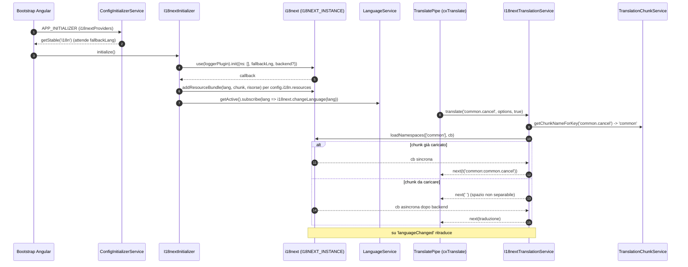
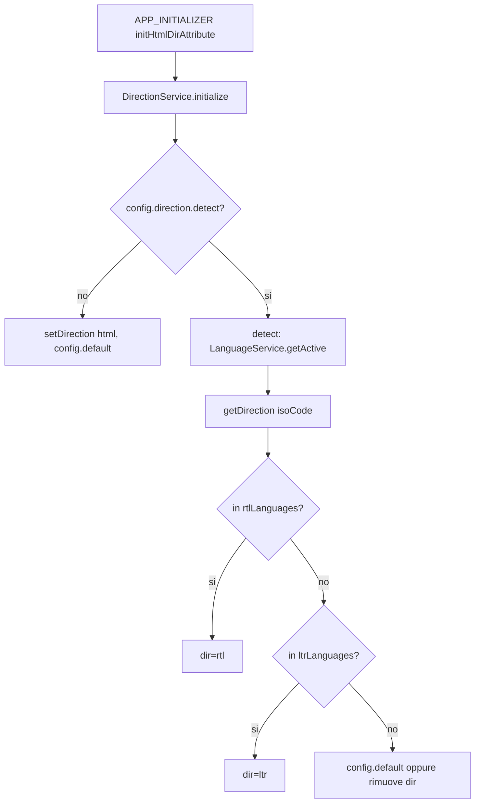
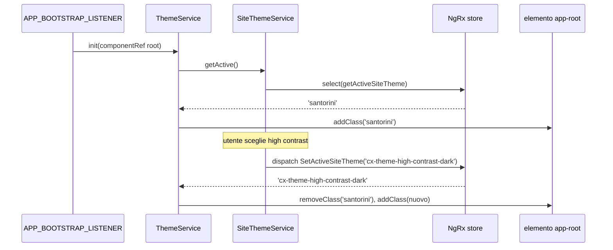
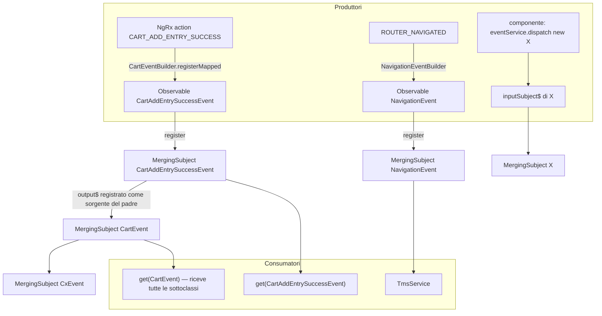
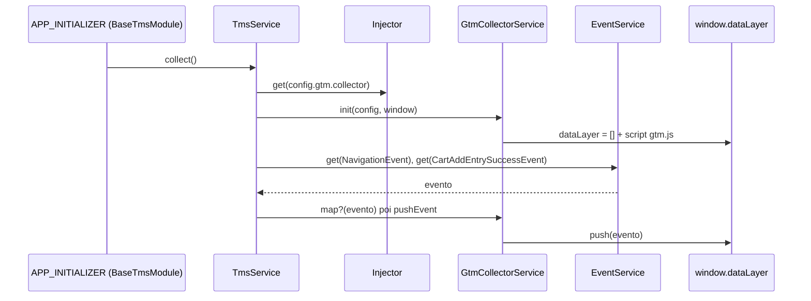
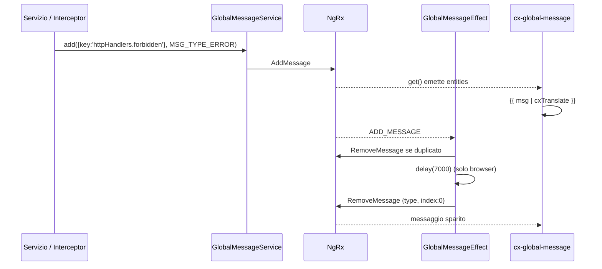
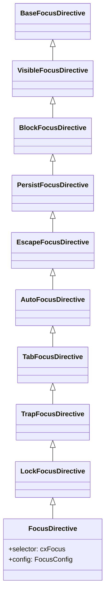
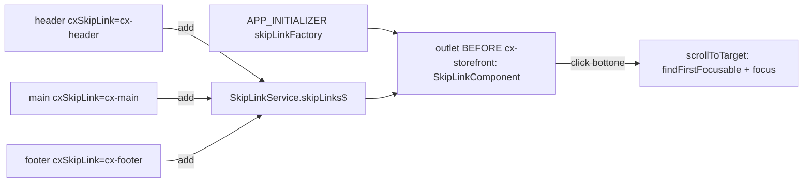
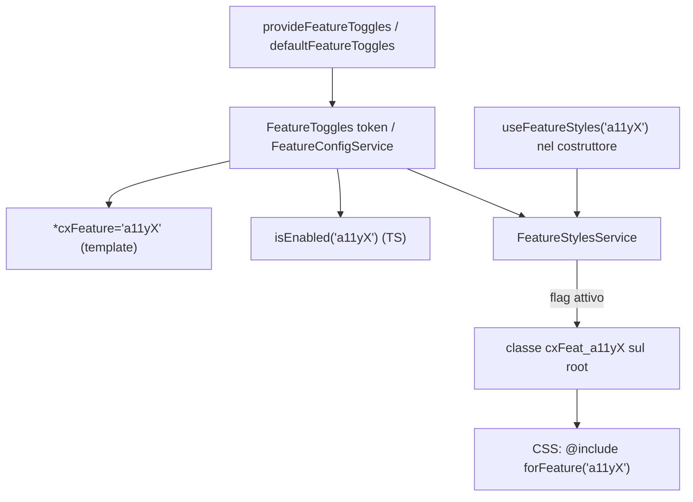
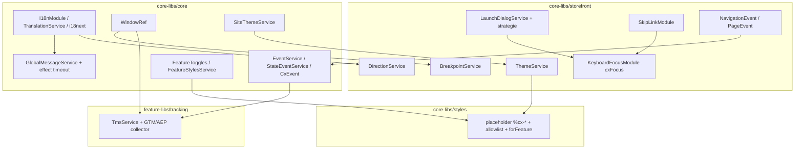

# 10 — i18n, stili, eventi e servizi UI trasversali

> Area I della deep dive. Tutto ciò che sta "attorno" ai componenti: traduzioni, CSS globale,
> bus di eventi, messaggi globali, dialog, focus da tastiera, skip link, breakpoint e accessibilità.
> Codice di riferimento: versione `2611.0.0`. Ogni path è relativo alla root del repo `/home/user/spartacus`.

## Indice

1. [i18n — traduzioni](#1-i18n--traduzioni)
2. [Pipe di data e numero + direzione RTL](#2-pipe-di-data-e-numero--direzione-rtl)
3. [Styling — `@spartacus/styles`](#3-styling--spartacusstyles)
4. [Temi di sito — SiteThemeService e ThemeService](#4-temi-di-sito--sitethemeservice-e-themeservice)
5. [Eventi — EventService e CxEvent](#5-eventi--eventservice-e-cxevent)
6. [Tracking — TMS (GTM / AEP)](#6-tracking--tms-gtm--aep)
7. [GlobalMessageService](#7-globalmessageservice)
8. [WindowRef](#8-windowref)
9. [LaunchDialogService](#9-launchdialogservice)
10. [KeyboardFocusModule (cxFocus)](#10-keyboardfocusmodule-cxfocus)
11. [SkipLinkModule](#11-skiplinkmodule)
12. [BreakpointService e LayoutConfig.breakpoints](#12-breakpointservice-e-layoutconfigbreakpoints)
13. [Feature toggle a11y*](#13-feature-toggle-a11y)
14. [Riepilogo e domande di autoverifica finali](#14-riepilogo-e-domande-di-autoverifica-finali)

---

## 1. i18n — traduzioni

### In una frase

Spartacus traduce le etichette con **i18next**, nascosto dietro un'astrazione Angular
(`TranslationService` + pipe `cxTranslate`), e organizza le chiavi in **chunk** (namespace)
che possono essere caricati tutti subito oppure in lazy loading.

### Il problema che risolve

- Uno storefront è multilingua: la lingua attiva dipende dal *site context* (URL `/en/USD/...`), quindi
  la traduzione deve cambiare quando cambia la lingua, senza ricaricare la pagina.
- I testi sono tanti (centinaia di chiavi per ogni feature library): serve spezzarli in pezzi
  (chunk) per non caricare tutto all'avvio.
- Il cliente deve poter **sovrascrivere** una singola traduzione senza forkare Spartacus.
- In SSR le traduzioni devono essere pronte **in modo sincrono** quando possibile, altrimenti l'HTML
  renderizzato dal server conterrebbe spazi vuoti.

### Come è implementato (con path)

| Pezzo | Path | Ruolo |
|---|---|---|
| `I18nModule` | `core-libs/core/src/i18n/i18n.module.ts` | Esporta pipe; `forRoot()` registra provider |
| `I18nConfig` | `core-libs/core/src/i18n/config/i18n-config.ts` | Tipo di config `i18n.*` |
| `defaultI18nConfig` | `core-libs/core/src/i18n/config/default-i18n-config.ts` | `fallbackLang: undefined, debug: false` |
| `I18nConfigInitializer` | `core-libs/core/src/i18n/config/i18n-config-initializer.ts` | Calcola `fallbackLang` dalla prima lingua di `context.language` |
| `TranslationService` (abstract) | `core-libs/core/src/i18n/translation.service.ts` | Contratto `translate()` + `loadChunks()` |
| `I18nextTranslationService` | `core-libs/core/src/i18n/i18next/i18next-translation.service.ts` | Implementazione concreta su i18next |
| `I18NEXT_INSTANCE` | `core-libs/core/src/i18n/i18next/i18next-instance.ts` | `InjectionToken` con `i18next.createInstance()` |
| `i18nextProviders` | `core-libs/core/src/i18n/i18next/i18next-providers.ts` | `APP_INITIALIZER` che inizializza i18next |
| `I18nextInitializer` | `core-libs/core/src/i18n/i18next/i18next-initializer.ts` | `init()` di i18next, risorse statiche, sync lingua |
| `I18nextBackendService` | `core-libs/core/src/i18n/i18next/i18next-backend/i18next-backend.service.ts` | Sceglie il backend applicabile |
| `I18nextHttpBackendInitializer` | `.../i18next-backend/i18next-http-backend.initializer.ts` | Backend `i18next-http-backend` (`loadPath`) |
| `I18nextResourcesToBackendInitializer` | `.../i18next-backend/i18next-resources-to-backend.initializer.ts` | Backend `i18next-resources-to-backend` (`loader`) |
| `I18NEXT_HTTP_BACKEND_CLIENT` | `.../i18next-backend/i18next-http-backend-client.ts` | Client HTTP basato su `HttpClient` Angular |
| `TranslationChunkService` | `core-libs/core/src/i18n/translation-chunk.service.ts` | Mappa chiave → chunk |
| `TranslatePipe` (`cxTranslate`) | `core-libs/core/src/i18n/translate.pipe.ts` | Pipe impura per i template |
| `Translatable` | `core-libs/core/src/i18n/translatable.ts` | `{ key?, params?, raw? }` |
| `TranslationResources` | `core-libs/core/src/i18n/translation-resources.ts` | `{ [lang]: { [chunk]: {...} } }` |
| Testing | `core-libs/core/src/i18n/testing/` | `I18nTestingModule`, `MockTranslatePipe`, `MockTranslationService` |

**`I18nModule.forRoot()`** (in `i18n.module.ts`) fa quattro cose:

1. `provideDefaultConfig(defaultI18nConfig)`;
2. `{ provide: TranslationService, useExisting: I18nextTranslationService }` — cioè chi inietta
   l'astrazione riceve l'implementazione i18next;
3. aggiunge `...i18nextProviders` (APP_INITIALIZER + provider dei backend);
4. registra un `CONFIG_INITIALIZER` tramite la funzione `initI18nConfig`, che restituisce
   `I18nConfigInitializer` **solo se** `i18n.fallbackLang` non è già stato configurato staticamente.

`I18nModule.forRoot()` è importato da `BaseCoreModule` (`core-libs/core/src/base-core.module.ts`).
Senza `forRoot()` (`I18nModule` semplice) si ottengono solo le pipe `TranslatePipe`, `CxDatePipe`,
`CxNumericPipe` (che sono standalone: il modulo le importa e le esporta).

**`I18nConfig.i18n`** (in `i18n-config.ts`) ha queste chiavi:

| Chiave | Tipo | Significato |
|---|---|---|
| `fallbackLang` | `string \| false` | Lingua usata quando manca una chiave nella lingua attiva |
| `backend.loadPath` | `string` | URL con placeholder `{{lng}}` e `{{ns}}` (sconsigliato per asset locali) |
| `backend.loader` | `(lang, chunk) => Promise<...>` | Funzione (es. `import()` dinamico) — raccomandata per asset locali, più performante in SSR |
| `resources` | `TranslationResources` | Traduzioni **eager** incluse nel bundle JS |
| `debug` | `boolean` | Log di i18next in console |
| `chunks` | `{ [chunk]: string[] }` | Quali "chiavi radice" stanno in quale chunk |

**Nota**: non esiste una direttiva `cxTranslate`; nel codice c'è solo la pipe
`@Pipe({ name: 'cxTranslate', pure: false })` in `translate.pipe.ts`. (Cercato con grep
`selector: '[cxTranslate'`: nessun risultato.)

#### Chunk e chiavi

Una chiave ha la forma `chiaveRadice.sotto.chiave`, es. `common.cancel` o `cartDetails.proceedToCheckout`.
`TranslationChunkService.getChunkNameForKey(key)` prende la parte prima del primo punto
(`KEY_SEPARATOR = '.'`) e cerca in quale chunk è dichiarata. Se non la trova **usa la chiave radice stessa
come nome del chunk** (fallback). Nel costruttore rileva i duplicati (stessa chiave radice in due chunk)
e, in dev mode, stampa un warning con `LoggerService`.

Esempio reale: `core-libs/assets/src/translations/translations.ts` esporta `translationChunksConfig`:

```ts
// estratto reale di core-libs/assets/src/translations/translations.ts
export const translationChunksConfig = {
  common: ['common', 'pageMetaResolver', 'spinner', 'navigation', 'searchBox', /* ... */ 'skipLink', /* ... */],
  deliveryMode: ['setDeliveryMode'],
  myAccount: ['closeAccount', 'updatePasswordForm', /* ... */],
  payment: ['paymentForm', 'paymentMethods', /* ... */],
  // ...
};
```

Quindi `skipLink.labels.header` → chiave radice `skipLink` → chunk `common` → chiave namespaced
per i18next `common:skipLink.labels.header` (separatore `NAMESPACE_SEPARATOR = ':'` in
`I18nextTranslationService.getNamespacedKey`).

#### File di traduzione (asset)

- `core-libs/assets/src/translations/<lingua>/` contiene un JSON per chunk (`common.json`, `myAccount.json`,
  `payment.json`, `product.json`, `pwa.json`, `siteThemeSwitcher.json`, `user.json`, `video.json`, ...) e un
  `index.ts` che li importa e li esporta come oggetto (es. `export const en = { common, deliveryMode, ... }`).
- Lingue presenti: `cs de en es es_CO fr hi hu id it ja ko pl pt ru zh zh_TW`.
- `translations.ts` riesporta ogni lingua con alias: `translationsEn`, `translationsDe`, `translationsJa`, ...
- `core-libs/assets/src/translations/translation-chunks-config.ts` definisce l'interfaccia `TranslationChunksConfig`
  (`{ [chunk: string]: string[] }`).
- Ogni feature library ha i propri asset con lo stesso schema, es.
  `feature-libs/cart/base/assets/translations/translations.ts` esporta `cartBaseTranslationChunksConfig`
  (`cart: ['cartDetails', 'cartItems', 'orderCost', 'voucher', ...]`) e `cartBaseTranslationsEn`, ecc.

#### Come l'app demo le configura

In `projects/storefrontapp/src/app/spartacus/spartacus-configuration.module.ts`:

```ts
// reale (semplificato)
provideConfig({
  i18n: {
    resources: { en: translationsEn, ja: translationsJa, de: translationsDe, zh: translationsZh },
    chunks: translationChunksConfig,
    fallbackLang: 'en',
  },
}),
```

e le feature fanno lo stesso nel proprio modulo, es.
`projects/storefrontapp/src/app/spartacus/features/cart/cart-base-feature.module.ts` usa
`cartBaseTranslationsEn` + `cartBaseTranslationChunksConfig`. Poiché la config di Spartacus è fatta
con deep-merge, le `resources` e i `chunks` di tutte le librerie si sommano.

L'app demo quindi usa **risorse eager** (nessun `backend`). Il lazy loading via `backend.loader` o
`backend.loadPath` è supportato dal codice ma non attivato nella demo.

#### i18nKeys nei cmsComponents

`CmsComponentMapping` (`core-libs/core/src/cms/config/cms-config.ts`) ha il campo `i18nKeys?: string[]`.
Il flusso reale:

1. `CmsPageGuardService` (`core-libs/storefront/cms-structure/guards/cms-page-guard.service.ts`) dopo che le
   guard CMS permettono l'accesso chiama `this.cmsI18n.loadForComponents(componentTypes)`.
2. `CmsI18nService.loadForComponents` (`core-libs/storefront/cms-structure/services/cms-i18n.service.ts`)
   chiede a `CmsComponentsService.getI18nKeys(componentTypes)` le chiavi dichiarate, le converte in chunk con
   `TranslationChunkService.getChunkNameForKey`, e chiama `TranslationService.loadChunks([...chunk])`.
3. Effetto: i chunk necessari ai componenti della pagina sono **precaricati** durante la navigazione,
   prima che i componenti vengano renderizzati.

Nel repo (file non-spec di `core-libs` e `feature-libs`) nessuna mapping di default valorizza `i18nKeys:`
(verificato con grep): è un punto di estensione per chi usa il lazy loading.

### Flusso passo-passo



Dettagli verificati:

1. `i18nextProviders` registra un `APP_INITIALIZER` che fa
   `lastValueFrom(configInitializerService.getStable('i18n')).then(() => i18nextInitializer.initialize())`.
2. `I18nextInitializer.getI18nextConfig()` imposta `ns: []` (nessun namespace precaricato),
   `fallbackLng`, `debug`, `interpolation: { escapeValue: false, skipOnVariables: false }`;
   se c'è `config.i18n.backend` aggiunge ciò che ritorna `I18nextBackendService.initialize()`.
3. Le `resources` statiche **non** sono passate come `resources` di i18next (il commento nel codice spiega
   che disabiliterebbe il caricamento dei chunk dal backend): vengono aggiunte nella callback con
   `addResourceBundle(lang, chunkName, ..., true, true)` (deep + overwrite).
4. `synchronizeLanguage()` sottoscrive `LanguageService.getActive()` e chiama `i18next.changeLanguage`.
5. `I18nextBackendService.initialize()` usa `resolveApplicable(backendInitializers)` fra i due provider multi
   registrati in `i18nextBackendProviders`: `I18nextHttpBackendInitializer.hasMatch()` è vero se c'è `loadPath`,
   `I18nextResourcesToBackendInitializer.hasMatch()` è vero se c'è `loader`.
6. HTTP backend: `reloadInterval: false` (altrimenti in SSR un `setInterval` impedirebbe al rendering di
   finire) e `getLoadPath()` trasforma un path relativo in assoluto in SSR usando `WindowRef.location.origin`.
7. `I18nextTranslationService.translate()` restituisce un `Observable` "freddo" che:
   - esce subito se `i18next.isInitialized` è falso;
   - chiama `loadNamespaces` e, se le chiavi esistono, emette `i18next.t(namespacedKeys, options)`;
   - se nessuna chiave esiste: `reportMissingKey` (warning in dev) ed emette `getFallbackValue`:
     in dev `[chunk:chiave]`, in prod uno spazio non separabile;
   - se il namespace non era ancora caricato e `whitespaceUntilLoaded` è `true`, emette subito ` `;
   - si registra su `languageChanged` e si deregistra nel teardown.
8. Accetta anche **un array di chiavi**: la prima esistente vince (fallback fra chiavi).
9. `TranslatePipe.transform()` supporta: stringa, array, oppure `Translatable` (`{ key, params }` o `{ raw }`).
   Con `raw` restituisce il testo così com'è. La pipe è impura: ricalcola la sottoscrizione solo se chiave
   o opzioni cambiano (`ObjectComparisonUtils.shallowEqualObjects`) e chiama `cd.markForCheck()` a ogni valore.

### Codice minimo riscritto a mano

Un mini-sistema i18n con la stessa architettura (astrazione + chunk + pipe impura):

```ts
// mini-i18n.ts — riscritto a mano, non è codice Spartacus
import { ChangeDetectorRef, Injectable, OnDestroy, Pipe, PipeTransform, inject } from '@angular/core';
import { BehaviorSubject, Observable, Subscription, map } from 'rxjs';

type Resources = Record<string, Record<string, Record<string, any>>>; // lang -> chunk -> json

export abstract class MiniTranslationService {
  abstract translate(key: string, params?: Record<string, any>): Observable<string>;
}

@Injectable({ providedIn: 'root' })
export class MiniChunkService {
  private keyToChunk: Record<string, string> = {};
  constructor() {
    const chunks: Record<string, string[]> = { common: ['common', 'skipLink'], cart: ['cartDetails'] };
    for (const [chunk, roots] of Object.entries(chunks)) {
      roots.forEach((root) => (this.keyToChunk[root] = chunk));
    }
  }
  getChunkNameForKey(key: string): string {
    const root = key.split('.')[0];
    return this.keyToChunk[root] ?? root; // stesso fallback di TranslationChunkService
  }
}

@Injectable({ providedIn: 'root' })
export class MiniI18nService implements MiniTranslationService {
  readonly lang$ = new BehaviorSubject('en');
  private chunks = inject(MiniChunkService);
  private resources: Resources = {
    en: { common: { common: { cancel: 'Cancel', hello: 'Hello {{name}}' } } },
    it: { common: { common: { cancel: 'Annulla', hello: 'Ciao {{name}}' } } },
  };

  translate(key: string, params: Record<string, any> = {}): Observable<string> {
    const chunk = this.chunks.getChunkNameForKey(key);
    return this.lang$.pipe(
      map((lang) => {
        const value = this.lookup(lang, chunk, key) ?? this.lookup('en', chunk, key); // fallbackLang
        if (value === undefined) return `[${chunk}:${key}]`;
        return value.replace(/{{(\w+)}}/g, (_: string, p: string) => String(params[p] ?? ''));
      })
    );
  }

  private lookup(lang: string, chunk: string, key: string): string | undefined {
    return key.split('.').reduce<any>((acc, part) => acc?.[part], this.resources[lang]?.[chunk]);
  }
}

@Pipe({ name: 'miniTranslate', pure: false })
export class MiniTranslatePipe implements PipeTransform, OnDestroy {
  private service = inject(MiniI18nService);
  private cd = inject(ChangeDetectorRef);
  private lastKey?: string;
  private value = ' ';
  private sub?: Subscription;

  transform(key: string, params?: Record<string, any>): string {
    if (key !== this.lastKey) {
      this.lastKey = key;
      this.sub?.unsubscribe();
      this.sub = this.service.translate(key, params).subscribe((v) => {
        this.value = v;
        this.cd.markForCheck();
      });
    }
    return this.value;
  }
  ngOnDestroy() {
    this.sub?.unsubscribe();
  }
}
```

Uso reale in Spartacus (template):

```html
<!-- core-libs/storefront/shared/components/star-rating/star-rating.component.html (reale) -->
{{ 'productReview.ratedOutOf' | cxTranslate: { rating: rating.toFixed(1) } }}
```

Uso in TypeScript:

```ts
// esempio d'uso dell'API reale
import { inject } from '@angular/core';
import { TranslationService } from '@spartacus/core';

const translation = inject(TranslationService);
translation.translate(['myFeature.title', 'common.home']).subscribe(console.log); // prima chiave esistente
translation.loadChunks(['cart']); // precarica un chunk (Promise)
```

Configurazione per il lazy loading con `loader` (API reale di `I18nConfig`):

```ts
provideConfig({
  i18n: {
    backend: {
      loader: (lng: string, ns: string) => import(`../assets/i18n/${lng}/${ns}.json`),
    },
    chunks: translationChunksConfig,
    fallbackLang: 'en',
  },
});
```

Override di una singola chiave (funziona grazie a `addResourceBundle(..., deep=true, overwrite=true)`):

```ts
provideConfig({
  i18n: { resources: { en: { common: { common: { cancel: 'Abort' } } } } },
});
```

### Errori comuni

- **Chiave nel chunk sbagliato**: se `myFeature` non è elencato in `chunks`, i18next cerca un chunk chiamato
  `myFeature`. Con risorse eager il chunk esiste solo se l'hai chiamato così → in dev vedi `[myFeature:myFeature.title]`.
- **Chiave radice duplicata in due chunk**: il primo vince, warning `Duplicated keys has been found...`.
- **Usare `backend.loadPath` per asset locali**: sconsigliato dalla JSDoc di `I18nConfig`; in SSR costa una
  chiamata HTTP verso sé stessi. Preferire `backend.loader`.
- **Dimenticare `fallbackLang`**: se non configurato viene calcolato dal primo elemento di `context.language`
  (`I18nConfigInitializer.resolveConfig`); se neanche quello esiste, nessun fallback.
- **Aspettarsi che `cxTranslate` sia pura**: è `pure: false`; non passare oggetti nuovi a ogni change detection
  nei `params` se non necessario (il confronto è shallow, quindi funziona, ma genera lavoro).
- **Tradurre in un servizio con `take(1)` prima che il chunk sia caricato**: con `whitespaceUntilLoaded=true`
  il primo valore può essere ` `. Con il default (`false`) invece si attende il caricamento.
- **Passare `null`/`''` alla pipe**: restituisce `''` e in dev logga un errore.

### Domande di autoverifica

1. Perché le risorse statiche vengono aggiunte con `addResourceBundle` nella callback di `init` invece che con l'opzione `resources` di i18next?
2. Che cosa restituisce `getChunkNameForKey('foo.bar')` se `foo` non è in nessun chunk?
3. Qual è la differenza fra `backend.loadPath` e `backend.loader`, e quale classe gestisce ciascuno?
4. Cosa emette `translate()` per una chiave mancante in dev mode e in produzione?
5. Quale token fornisce l'istanza di i18next e perché non si usa l'istanza globale `i18next`?
6. Chi chiama `CmsI18nService.loadForComponents` e con quale scopo?

---

## 2. Pipe di data e numero + direzione RTL

### In una frase

`cxDate` e `cxNumeric` sono le pipe `DatePipe`/`DecimalPipe` di Angular con il **locale preso
dalla lingua attiva di Spartacus**; `DirectionService` imposta `dir="ltr|rtl"` su `<html>` in base
alla lingua.

### Il problema che risolve

Le pipe native di Angular usano il `LOCALE_ID` fisso deciso al bootstrap. Spartacus cambia lingua a
runtime, quindi serve una pipe che legga ogni volta la lingua corrente. Per le lingue come arabo o ebraico
serve anche invertire il layout (RTL).

### Come è implementato (con path)

- `CxDatePipe` — `core-libs/core/src/i18n/date.pipe.ts`, `@Pipe({ name: 'cxDate' })`, `extends DatePipe`.
  `transform(value, format?, timezone?)` chiama `super.transform(value, format, timezone, this.getLang())`.
- `CxNumericPipe` — `core-libs/core/src/i18n/numeric.pipe.ts`, `@Pipe({ name: 'cxNumeric' })`, `extends DecimalPipe`.
- In entrambe `getLang()` legge la lingua attiva **in modo sincrono** da `LanguageService.getActive()`
  (subscribe + unsubscribe immediato) e prova `getLocaleId(lang)`; se Angular non ha i dati del locale
  registrati logga un warning (in dev) e usa `'en'`.
- Per questo l'app demo chiama `registerLocaleData(localeDe)`, `localeJa`, `localeZh` in
  `projects/storefrontapp/src/app/spartacus/spartacus-configuration.module.ts`.
- `DirectionService` — `core-libs/storefront/layout/direction/direction.service.ts`.
- `DirectionModule` — `core-libs/storefront/layout/direction/direction.module.ts`: `APP_INITIALIZER` con
  `initHtmlDirAttribute` che chiama `directionService.initialize()`; importato da `LayoutModule`
  (`core-libs/storefront/layout/layout.module.ts`).
- Modello `Direction` / `DirectionMode` (`LTR = 'ltr'`, `RTL = 'rtl'`) in
  `core-libs/storefront/layout/direction/config/direction.model.ts`: campi `default`, `detect`,
  `rtlLanguages`, `ltrLanguages`.

### Flusso passo-passo



1. `initialize()` attende `configInit.getStable('direction')`.
2. Se `detect` è falso imposta subito `config.default` su `document.documentElement`.
3. Se `detect` è vero, `detect()` (protetto da `startsDetecting`) osserva la lingua e ricalcola la direzione.
4. `setDirection(el, undefined)` **rimuove** l'attributo `dir`.
5. Lato CSS, `core-libs/styles/scss/root.scss` definisce `--cx-direction: #{$direction}` e `body { text-align: start; }`:
   usare proprietà logiche (`start`/`end`) rende il layout reversibile.

### Codice minimo riscritto a mano

```ts
// riscritto a mano: pipe data "locale-aware"
import { DatePipe, getLocaleId } from '@angular/common';
import { Pipe, PipeTransform, inject } from '@angular/core';
import { LanguageService } from '@spartacus/core';

@Pipe({ name: 'myDate' })
export class MyDatePipe extends DatePipe implements PipeTransform {
  private language = inject(LanguageService);
  constructor() { super(''); }

  override transform(value: any, format?: string): any {
    let lang = 'en';
    this.language.getActive().subscribe((l) => (lang = l)).unsubscribe(); // lettura sincrona
    try { getLocaleId(lang); } catch { lang = 'en'; }
    return super.transform(value, format, undefined, lang);
  }
}
```

```ts
// configurazione reale di direzione
import { DirectionMode } from '@spartacus/storefront';
provideConfig({
  direction: { detect: true, default: DirectionMode.LTR, rtlLanguages: ['ar', 'he'] },
});
```

```html
{{ order.created | cxDate: 'medium' }}  {{ 1234.5 | cxNumeric: '1.2-2' }}
```

### Errori comuni

- Non chiamare `registerLocaleData` per le lingue usate → warning `cxDate pipe: No locale data registered...`
  e formattazione inglese.
- Aspettarsi che `cxDate` si aggiorni al cambio lingua senza change detection: la pipe è **pura** (default),
  quindi ricalcola solo se cambiano gli input; il cambio lingua di solito provoca comunque un ri-render.
  (Il comportamento esatto al cambio lingua in una view OnPush: NON VERIFICATO NEL CODICE.)
- Usare `margin-left` / `left` invece di proprietà logiche → layout rotto in RTL.

### Domande di autoverifica

1. Quale valore di locale usa `CxNumericPipe` se la lingua attiva è `ja` ma i dati `ja` non sono registrati?
2. Dove viene impostato l'attributo `dir` e su quale elemento?
3. Cosa succede se `detect` è `true` e la lingua non è né in `rtlLanguages` né in `ltrLanguages`?

---
## 3. Styling — `@spartacus/styles`

### In una frase

I componenti Spartacus **non hanno `styleUrls`**: tutto il CSS vive nella libreria Sass
`core-libs/styles` (e nelle cartelle `styles/` delle feature library) sotto forma di **placeholder**
`%cx-nome-componente`, che vengono "attaccati" ai selettori globali degli elementi
(`cx-nome-componente { @extend %cx-nome-componente; }`) al momento della compilazione dell'app.

### Il problema che risolve

- **Personalizzazione totale**: se il CSS fosse dentro il componente (`styleUrls` + `ViewEncapsulation.Emulated`)
  il cliente dovrebbe usare `::ng-deep` o sostituire il componente per cambiare un colore. Con CSS globale
  basta sovrascrivere variabili o selettori.
- **Escludere stili**: il cliente che riscrive un componente può togliere il suo CSS dal bundle con
  `$skipComponentStyles`.
- **Versioning degli stili**: cambiamenti CSS "breaking" non devono rompere i clienti in una minor release
  → mixin `forVersion` (deprecato) e `forFeature` (feature flag).
- **Theming** runtime con CSS custom properties (`--cx-color-*`).

### Come è implementato (con path)

**Entry point della libreria** — `core-libs/styles/_index.scss`:

```scss
@import 'scss/app';
@import 'scss/root';
@import 'scss/page-template';
@import 'scss/components';
```

**Core (solo strumenti, nessun CSS emesso)** — `core-libs/styles/scss/_core.scss`:

```scss
@import 'features';   // mixin forFeature
@import 'versioning'; // $styleVersion, $useLatestStyles, forVersion
@import 'functions';
@import 'mixins';
@import 'theme';      // variabili Sass del tema (santorini)
```

| File | Contenuto verificato |
|---|---|
| `core-libs/styles/scss/app.scss` | font, FontAwesome, ng-select theme, `cxbase/index`, blocchi Bootstrap personalizzati (`cxbase/blocks/buttons`, `forms`, `modal`, ...), `misc/dialog`, `site-theme` |
| `core-libs/styles/scss/root.scss` | `:root { --cx-color-*; --cx-page-width-max; --cx-font-weight-*; --cx-direction; --cx-border-radius; ... }` generati da `$theme-colors` |
| `core-libs/styles/scss/_components.scss` | allowlist, `$skipComponentStyles`, `$selectors`, ciclo `@extend` |
| `core-libs/styles/scss/_page-template.scss` | `cx-page-layout.<Template> { @extend %<Template> }` con `$page-template-allowlist` / `$page-template-blocklist` |
| `core-libs/styles/scss/_versioning.scss` | `$_fullVersion`, `$_majorVersion: 2211`, `$styleVersion`, `$useLatestStyles`, `@mixin forVersion` (deprecato dal 2211.20) |
| `core-libs/styles/scss/_features.scss` | `$CSS_FEATURE_FLAG_PREFIX: 'cxFeat_'`, `@mixin forFeature($feature, $classTarget)` |
| `core-libs/styles/scss/_theme.scss` | importa `theme/santorini/variables` |
| `core-libs/styles/scss/_site-theme.scss` | importa i temi high-contrast (dark/light) |
| `core-libs/styles/scss/theme/` | `santorini`, `santorini-updated`, `sparta`, `lambda`, `high-contrast` |
| `core-libs/styles/theme-santorini.scss` (e `theme-sparta.scss`, `theme-lambda.scss`) | font + variabili del tema + `./index` |
| `core-libs/styles/vendor/bootstrap/` | Bootstrap **v4.6.2** (header di `vendor/bootstrap/scss/bootstrap.scss`) **vendorizzato** dentro la libreria: non è una dipendenza npm di `@spartacus/styles` |
| `core-libs/styles/scss/components/` | placeholder dei componenti core: `layout/`, `content/`, `product/`, `misc/`, `myaccount/`, `pwa/`, `cds/`, `digital-payments/`, `cpq-quote/` |

**Il meccanismo allowlist + placeholder** (`core-libs/styles/scss/_components.scss`, reale):

```scss
$skipComponentStyles: () !default;
$layout-components-allowlist: () !default;
// ... altre allowlist
$selectors: mergeAll(( $layout-components-allowlist, $misc-components-allowlist, /* ... */ ));

@each $selector in $selectors {
  #{$selector} {
    @if (index($skipComponentStyles, $selector) ==null) {
      @extend %#{$selector} !optional;
    }
  }
}
body {
  @each $selector in $selectors {
    @if (index($skipComponentStyles, $selector) ==null) {
      @extend %#{$selector}__body !optional;
    }
  }
}
```

Ogni gruppo dichiara la propria allowlist, es. `core-libs/styles/scss/components/layout/_index.scss`:

```scss
$layout-components-allowlist:
  cx-storefront, header, cx-site-context-selector, cx-skip-link, cx-split-view !default;
```

e ogni componente è un placeholder, es. `core-libs/styles/scss/components/layout/_skip-link.scss` inizia con
`%cx-skip-link { position: fixed; ... }` e
`core-libs/styles/scss/components/content/global-message/_global-message.scss` con
`%cx-global-message { position: sticky; ... }`.

Le feature library replicano lo schema: `feature-libs/cart/base/styles/components/_index.scss` dichiara
`$cart-components-allowlist: cx-mini-cart, cx-add-to-cart, ...` e ripete lo stesso `@each ... @extend`.
Il file `feature-libs/cart/_index.scss` importa `@spartacus/styles/scss/core` e poi `./base/index`, ecc.

**Perché funziona senza `styleUrls`**: i componenti Angular hanno selettori elemento come
`cx-global-message` (vedi `GlobalMessageComponent` in
`core-libs/storefront/cms-components/misc/global-message/global-message.component.ts`, selector
`'cx-global-message'`, nessun `styleUrls`). Il CSS globale `cx-global-message { ... }` colpisce l'elemento
host e i suoi figli; non essendoci incapsulamento emulato non ci sono attributi `_ngcontent-*` da rispettare.
Grep su `core-libs/storefront` (file non-spec) per `ViewEncapsulation`, `styleUrls` e `styleUrl:`:
**nessun risultato**, quindi i componenti del core non definiscono CSS proprio.

**Lato app demo**:

- `projects/storefrontapp/src/styles-config.scss`: `$useLatestStyles: true;` (sempre gli ultimi stili).
- `projects/storefrontapp/src/styles.scss` — ordine **importante**:
  1. `@import 'styles-config';`
  2. `@import '@spartacus/styles/scss/core';` (variabili e mixin)
  3. selettivamente i parziali Bootstrap: `reboot`, `type`, `grid`, `utilities`, `transitions`, `dropdown`,
     `card`, `nav`, `buttons`, `forms`, `custom-forms`, `modal`, `close`, `alert`, `tooltip`
     (da `@spartacus/styles/vendor/bootstrap/scss/...`)
  4. `@import '@spartacus/styles';` (il CSS vero dei componenti)
  5. `@import 'cms-themes';`
- `projects/storefrontapp/src/cms-themes.scss`: classi `.santorini`, `.lambda`, `.sparta` che ridefiniscono
  le custom properties `--cx-color-*`. Il commento in `styles.scss` spiega che devono venire *dopo* gli stili
  Spartacus per sovrascrivere i default di `:root`.
- `projects/storefrontapp/src/styles/lib-*.scss`: un file per feature, es. `lib-cart.scss` =
  `@import '../styles-config'; @import '@spartacus/cart';`. In `projects/storefrontapp/project.json` ciascuno è
  un entry `styles` con `bundleName` proprio (`cart`, `user`, `asm`, ...), quindi produce un CSS separato.

**Feature flag negli stili** — `_features.scss`:

```scss
@mixin forFeature($feature, $classTarget: 'ancestorSelector') {
  $featureClass: getFeatureCssClass($feature); // 'cxFeat_' + $feature
  @if ($classTarget == 'ancestorSelector') { @at-root .#{$featureClass} & { @content; } }
  @if ($classTarget == 'currentSelector')  { @at-root &.#{$featureClass} { @content; } }
}
```

La classe `cxFeat_<nome>` viene aggiunta all'elemento root dell'app da `FeatureStylesService`
(`core-libs/core/src/features-config/services/feature-styles.service.ts`, prefisso
`CSS_FEATURE_FLAG_PREFIX = 'cxFeat_'`) quando un componente chiama `useFeatureStyles('<nome>')`
(`core-libs/core/src/features-config/utils/use-feature-styles.ts`) **e** il flag è attivo. Il servizio conta
gli utilizzi (`usagesCounter`) e rimuove la classe quando scendono a zero (`destroyRef.onDestroy` → `unregisterUsage`).
Esempio reale: `GlobalMessageComponent` chiama `useFeatureStyles('a11yIncreaseContastGlobalMessageCloseButton')`
nel costruttore e `_global-message.scss` usa `@include forFeature('a11yIncreaseContastGlobalMessageCloseButton') {...}`.

**High contrast** — `core-libs/styles/scss/theme/high-contrast/mixins/_mixins.scss`:
`@mixin cx-highContrastTheme()` genera `.cx-theme-high-contrast-dark &, .cx-theme-high-contrast-light & {...}`.

### Flusso passo-passo

```mermaid
flowchart LR
    subgraph Build Sass app
      A[styles-config.scss<br/>$useLatestStyles, $skipComponentStyles] --> B[@spartacus/styles/scss/core<br/>variabili, mixin]
      B --> C[Bootstrap vendor parziali]
      C --> D[@spartacus/styles _index<br/>app, root, page-template, components]
      D --> E[cms-themes.scss<br/>.santorini .sparta ...]
    end
    D --> F["cx-mini-cart { @extend %cx-mini-cart }"]
    F --> G[CSS globale in styles.css]
    G --> H[Elemento host &lt;cx-mini-cart&gt; nel DOM]
    I[ThemeService aggiunge classe tema a app-root] --> H
    J[FeatureStylesService aggiunge cxFeat_*] --> H
```

1. Il cliente definisce variabili *prima* di importare Spartacus (`$styleVersion`, `$useLatestStyles`,
   `$skipComponentStyles`, allowlist personalizzate) — funzionano perché in libreria sono `!default`.
2. `core` porta variabili e mixin senza emettere CSS.
3. `@spartacus/styles` emette: base (`app.scss`), custom properties (`root.scss`), layout dei template
   (`_page-template.scss`), componenti (`_components.scss`).
4. Per ogni selettore in allowlist e non in `$skipComponentStyles` viene emesso `selector { @extend %selector }`;
   placeholder non estesi non producono CSS.
5. A runtime le classi di tema (`ThemeService`) e di feature (`FeatureStylesService`) sull'elemento root
   attivano le regole condizionali.

### Codice minimo riscritto a mano

```scss
// my-lib/_placeholders.scss  (riscritto a mano)
%cx-hello-card {
  display: block;
  padding: 1rem;
  border: 1px solid var(--cx-color-medium);
  color: var(--cx-color-text);
  .title { font-weight: var(--cx-font-weight-bold); }
}

// my-lib/_index.scss
$my-components-allowlist: cx-hello-card !default;
$skipComponentStyles: () !default;

@each $selector in $my-components-allowlist {
  #{$selector} {
    @if (index($skipComponentStyles, $selector) == null) {
      @extend %#{$selector} !optional;
    }
  }
}
```

```ts
// hello-card.component.ts — nessun styleUrls
import { Component, Input } from '@angular/core';

@Component({
  selector: 'cx-hello-card', // il nome coincide con il placeholder %cx-hello-card
  template: `<div class="title">{{ title }}</div><ng-content />`,
})
export class HelloCardComponent {
  @Input() title = '';
}
```

```scss
// styles.scss dell'app cliente: escludo lo stile di default del mini-cart e ne scrivo uno mio
$skipComponentStyles: (cx-mini-cart);
@import '@spartacus/styles/scss/core';
@import '@spartacus/styles';
cx-mini-cart { background: hotpink; }
```

### Errori comuni

- **Importare Bootstrap prima di `scss/core`** o dimenticarlo: molti placeholder usano variabili/mixin Bootstrap;
  l'ordine dell'app demo è documentato con commenti `ORDER IMPORTANT`.
- **Definire `$skipComponentStyles` dopo l'import**: essendo `!default`, deve essere dichiarato prima.
- **Aggiungere `styleUrls` + encapsulation a un componente che sostituisce uno standard**: gli stili globali
  continuano ad applicarsi all'elemento host con lo stesso nome; conviene usare `$skipComponentStyles`.
- **`forFeature` senza `useFeatureStyles`**: il commento in `_features.scss` avverte che gli stili possono non
  attivarsi anche con il flag attivo.
- **Sovrascrivere colori con variabili Sass invece che con custom properties**: le variabili Sass sono risolte a
  build time; i temi runtime (`.santorini`, high contrast) agiscono su `--cx-color-*`.
- **Dimenticare di importare lo stile di una feature** (`@spartacus/cart`): i componenti appaiono senza CSS.

### Domande di autoverifica

1. Perché i componenti Spartacus non usano `styleUrls`? Quale vantaggio dà al cliente?
2. Cosa produce `@extend %cx-foo !optional` se il placeholder `%cx-foo` non esiste?
3. A cosa servono `$useLatestStyles` e `$styleVersion`?
4. Qual è il ruolo di `useFeatureStyles()` rispetto al mixin `forFeature`?
5. Perché `cms-themes.scss` è importato per ultimo in `styles.scss`?

---

## 4. Temi di sito — SiteThemeService e ThemeService

### In una frase

Il tema è un **parametro di site context** (`THEME_CONTEXT_ID`) salvato in NgRx; `ThemeService`
lo traduce in una **classe CSS sull'elemento root** dell'app (es. `santorini` o
`cx-theme-high-contrast-dark`).

### Il problema che risolve

Permettere di cambiare tema senza ricompilare: tema di default per base site (anche letto dal CMS) e
temi opzionali selezionabili dall'utente (switcher), con persistenza.

### Come è implementato (con path)

- `SiteThemeModule` — `core-libs/core/src/site-theme/site-theme.module.ts`, importato da `BaseCoreModule`.
- `SiteThemeService` — `core-libs/core/src/site-theme/facade/site-theme.service.ts`, implementa
  `SiteContext<SiteTheme>`:
  - `getDefault()` → `{ className: getDefaultClassName(), i18nNameKey: 'siteThemeSwitcher.themes.default' }`;
  - `getDefaultClassName()`: prima `config.context.theme` statico, poi (se feature toggle
    `applyBaseSiteThemeFromCms`) il `theme` del base site attivo, altrimenti `''`;
  - `getAll()`: default + `config.siteTheme.optionalThemes`;
  - `getActive()` / `setActive(className)` tramite `SiteThemeSelectors.getActiveSiteTheme` e
    `SiteThemeActions.SetActiveSiteTheme`.
- `default-site-theme-config.ts` definisce `optionalThemes` con `cx-theme-high-contrast-dark` e
  `cx-theme-high-contrast-light`.
- `SiteThemeInitializer` — `core-libs/core/src/site-theme/services/site-theme-initializer.ts`: attende
  `getStable('context')`, sincronizza la persistenza (`SiteThemePersistenceService.initSync()`), poi
  imposta il default se non ancora inizializzato.
- `ThemeService` — `core-libs/storefront/layout/theme/theme.service.ts`: `init(rootComponent)` sottoscrive
  `siteThemeService.getActive()` e `setTheme()` rimuove la classe precedente e aggiunge la nuova con `Renderer2`.
- `ThemeModule` — `core-libs/storefront/layout/theme/theme.module.ts`: `APP_BOOTSTRAP_LISTENER` → `initTheme`.
- Switcher UI: `core-libs/storefront/cms-components/misc/site-theme-switcher/`.

### Flusso passo-passo



### Codice minimo riscritto a mano

```ts
// riscritto a mano
import { APP_BOOTSTRAP_LISTENER, ComponentRef, Injectable, RendererFactory2, inject } from '@angular/core';
import { BehaviorSubject } from 'rxjs';

@Injectable({ providedIn: 'root' })
export class MiniThemeService {
  readonly active$ = new BehaviorSubject<string>('santorini');
  private renderer = inject(RendererFactory2).createRenderer(null, null);
  private current?: string;

  init(root: ComponentRef<unknown>) {
    const el = root.location.nativeElement as HTMLElement;
    this.active$.subscribe((theme) => {
      if (this.current) this.renderer.removeClass(el, this.current);
      if (theme) { this.renderer.addClass(el, theme); this.current = theme; }
    });
  }
}

export const miniThemeProviders = [
  {
    provide: APP_BOOTSTRAP_LISTENER,
    multi: true,
    useFactory: (s: MiniThemeService) => (c: ComponentRef<unknown>) => s.init(c),
    deps: [MiniThemeService],
  },
];
```

### Errori comuni

- Impostare un `className` non presente fra i temi: senza `applyBaseSiteThemeFromCms`, `isValid()` lo rifiuta
  e `setActive` non fa nulla.
- Confondere ordine e ereditarietà: la classe del tema sta su `app-root`, discendente di `<html>` (`:root`),
  quindi le sue `--cx-color-*` prevalgono per ereditarietà sui valori di `:root`. L'app demo mette comunque
  `cms-themes` per ultimo (commento in `styles.scss`): è una garanzia in più se una regola futura avesse la
  stessa specificità sullo stesso elemento.
- Dimenticare `ThemeModule` (importato da `LayoutModule`): lo store ha il tema attivo ma nessuno aggiunge la classe.

### Domande di autoverifica

1. In quale hook Angular `ThemeService` riceve l'elemento root e perché non in un `APP_INITIALIZER`?
2. Quali sono i due temi opzionali di default?
3. Da dove arriva il tema di default quando `applyBaseSiteThemeFromCms` è attivo?

---
## 5. Eventi — EventService e CxEvent

### In una frase

`EventService` è un **bus di eventi tipizzato per classe**: qualcuno *registra* sorgenti
(`Observable`) o *dispatcha* istanze singole, chiunque altro fa `get(TipoEvento)` e riceve uno stream,
senza conoscere chi produce l'evento.

### Il problema che risolve

- Disaccoppiare "chi sa che è successo qualcosa" (store NgRx del carrello, router, auth) da "chi vuole
  reagire" (tracking, analytics, componenti UI, feature lazy).
- Nascondere NgRx: le action sono un dettaglio interno; gli eventi sono l'API **pubblica** e stabile.
- Supportare la **gerarchia**: chi ascolta `CartEvent` riceve anche `CartAddEntrySuccessEvent` (sottoclasse).
- Funzionare con feature caricate in lazy: si può sottoscrivere un evento prima che esista una sorgente.

### Come è implementato (con path)

| Pezzo | Path |
|---|---|
| `CxEvent` (classe base astratta, `static readonly type = 'CxEvent'`) | `core-libs/core/src/event/cx-event.ts` |
| `EventService` | `core-libs/core/src/event/event.service.ts` |
| `MergingSubject` (API privata) | `core-libs/core/src/event/utils/merging-subject.ts` |
| `createFrom(type, data)` = `Object.assign(new type(), data)` | `core-libs/core/src/util/create-from.ts` |
| `StateEventService` | `core-libs/core/src/state/event/state-event.service.ts` |
| `ActionToEventMapping<T>` (`action`, `event`, `factory?`) | `core-libs/core/src/state/event/action-to-event-mapping.ts` |

**`EventService`** mantiene una `Map<tipo, EventMeta>`; ogni `EventMeta` ha:

- `inputSubject$`: un `Subject` creato lazy alla prima `dispatch`;
- `mergingSubject`: un `MergingSubject` che unisce dinamicamente tutte le sorgenti registrate.

API:

- `register<T>(eventType, source$): () => void` — aggiunge la sorgente (warning in dev se già presente) e
  restituisce la funzione di teardown che la rimuove.
- `get<T>(eventType): Observable<T>` — restituisce `mergingSubject.output$`; in dev aggiunge una validazione
  che l'evento emesso sia `instanceof eventType`.
- `dispatch<T>(event, eventType?)` — se `eventType` manca usa `event.constructor`; se `event` non è un'istanza
  di `eventType` lo converte con `createFrom`. Poi `inputSubject$.next(event)`.
- In `createEventMeta` risale la catena dei prototipi del tipo (`Object.getPrototypeOf`) e **registra
  l'output del figlio come sorgente del padre**: è così che `get(CartEvent)` riceve le sottoclassi.
- In dev `validateCxEvent` avvisa se la classe non discende da `CxEvent` (confronta `type === 'CxEvent'`).

**`MergingSubject`**: `output$` è un `Observable` con `share()`: si sottoscrive alle sorgenti solo quando ha
almeno un consumer e si disiscrive quando i consumer scendono a zero. Le sorgenti aggiunte/rimosse mentre c'è
un consumer vengono collegate/scollegate al volo. Quindi le sorgenti registrate sono **lazy**: se nessuno
ascolta, la catena `ActionsSubject → map → createFrom` non viene neanche eseguita.

**`StateEventService.register(mapping)`** trasforma action NgRx in eventi:
`actionsSubject.pipe(ofType(...actions), map(action => factory ? factory(action) : createFrom(event, action.payload ?? {})))`
e la registra con `eventService.register(mapping.event, ...)`.

#### Eventi reali (verificati)

| Evento | Path | Padre | Sorgente |
|---|---|---|---|
| `LoginEvent` | `core-libs/core/src/auth/user-auth/events/user-auth.events.ts` | `CxEvent` | `UserAuthEventBuilder.registerLoginEvent` → action `AuthActions.LOGIN` via `StateEventService` |
| `LogoutEvent` | stesso file | `CxEvent` | `UserAuthEventBuilder.buildLogoutEvent`: `authService.isUserLoggedIn().pipe(pairwise(), filter(prev && !curr))` |
| `LanguageSetEvent`, `CurrencySetEvent` | `core-libs/core/src/site-context/events/site-context.events.ts` | `CxEvent` | `core-libs/core/src/site-context/events/site-context-event.builder.ts` |
| `NavigationEvent` (`context`, `semanticRoute`, `url`, `params`) | `core-libs/storefront/events/navigation/navigation.event.ts` | `CxEvent` | `NavigationEventBuilder`: action `ROUTER_NAVIGATED` di `@ngrx/router-store` |
| `PageEvent` (abstract, campo `navigation`) | `core-libs/storefront/events/page/page.events.ts` | `CxEvent` | — |
| `HomePageEvent` | `core-libs/storefront/events/home/home-page.events.ts` | `PageEvent` | `HomePageEventBuilder` |
| `ProductDetailsPageEvent`, `CategoryPageResultsEvent`, `SearchPageResultsEvent` | `core-libs/storefront/events/product/product-page.events.ts` | `PageEvent` | `ProductPageEventBuilder` |
| `CartEvent` (abstract: `cartId`, `cartCode`, `userId`) | `feature-libs/cart/base/root/events/cart.events.ts` | `CxEvent` | — |
| `CartAddEntryEvent`, `CartAddEntrySuccessEvent` (`productCode`, `quantity`, `entry?`, `quantityAdded?`, `deliveryModeChanged?`), `CartAddEntryFailEvent` | stesso file | `CartEvent` | `CartEventBuilder.registerAddEntry` |
| `CreateCartEvent`/`Success`/`Fail`, `DeleteCartEvent`..., voucher events, `MergeCartSuccessEvent` | stesso file | `CartEvent` | `CartEventBuilder` |
| `CartUiEventAddToCart` | stesso file | `CxEvent` | dispatch dalla UI |
| `OrderPlacedEvent` | `feature-libs/order/root/events/order.events.ts` | `OrderEvent` | builder dell'order |

**Il pattern "EventBuilder + EventModule"**: il builder è un servizio che registra le sorgenti nel costruttore;
il modulo lo istanzia iniettandolo nel proprio costruttore vuoto. Esempio reale
`feature-libs/cart/base/core/event/cart-event.module.ts`:

```ts
@NgModule({})
export class CartEventModule {
  constructor(_CartEventBuilder: CartEventBuilder) {
    // Intentional empty constructor
  }
}
```

`CartEventModule` è importato da `CartBaseCoreModule` (`feature-libs/cart/base/core/cart-base-core.module.ts`),
`UserAuthEventModule` da `UserAuthModule` (`core-libs/core/src/auth/user-auth/user-auth.module.ts`),
`NavigationEventModule` dall'app demo (`projects/storefrontapp/src/app/spartacus/spartacus-features.module.ts`).

**`CartEventBuilder.registerMapped`** (`feature-libs/cart/base/core/event/cart-event.builder.ts`) è più ricco di
`StateEventService`: per ogni action usa `switchMap` + `withLatestFrom(activeCartService.getActive(), getActiveCartId())`
(commento: evita di caricare il carrello quando nessuno lo chiede), filtra solo le action del **carrello attivo**
(`action.payload.cartId === activeCartId`) e arricchisce l'evento con `cartCode` ed `entry`.

### Flusso passo-passo



1. Il builder viene creato (import del modulo) e chiama `eventService.register(Tipo, stream$)`.
2. `getEventMeta(Tipo)` crea la meta e collega il suo `output$` ai `MergingSubject` dei padri.
3. Un consumer fa `get(Tipo).subscribe(...)`: `share()` si attiva, il `MergingSubject` si sottoscrive alle
   sorgenti, che a loro volta si sottoscrivono a `ActionsSubject`.
4. Quando arriva l'action, la sorgente crea l'istanza con `createFrom` e la emette.
5. Quando l'ultimo consumer si disiscrive, tutto si stacca.

### Codice minimo riscritto a mano

```ts
// mini-event-bus.ts — riscritto a mano (senza MergingSubject, usa un Subject per tipo)
import { AbstractType, Injectable, Type } from '@angular/core';
import { Observable, Subject, Subscription, merge } from 'rxjs';

export abstract class MyEvent { static readonly type: string = 'MyEvent'; }

@Injectable({ providedIn: 'root' })
export class MiniEventService {
  private bus = new Map<AbstractType<any>, Subject<any>>();

  private subjectFor<T>(type: AbstractType<T>): Subject<T> {
    if (!this.bus.has(type)) this.bus.set(type, new Subject<T>());
    return this.bus.get(type)!;
  }

  /** emette anche su tutti i tipi padre, come fa EventService con i prototipi */
  private emit(event: object) {
    let proto = Object.getPrototypeOf(event).constructor;
    while (proto && proto !== Object) {
      this.bus.get(proto)?.next(event);
      proto = Object.getPrototypeOf(proto);
    }
  }

  dispatch<T extends object>(event: T, type?: Type<T>) {
    const instance = type && !(event instanceof type) ? Object.assign(new type(), event) : event;
    this.emit(instance);
  }

  register<T extends object>(_type: AbstractType<T>, source$: Observable<T>): () => void {
    const sub: Subscription = source$.subscribe((e) => this.emit(e)); // NB: eager, a differenza di Spartacus
    return () => sub.unsubscribe();
  }

  get<T>(type: AbstractType<T>): Observable<T> {
    return this.subjectFor(type).asObservable();
  }
}

// --- definizione eventi
export abstract class BasketEvent extends MyEvent { basketId!: string; }
export class ItemAddedEvent extends BasketEvent { static override readonly type = 'ItemAddedEvent'; sku!: string; }

// --- uso
// events.dispatch({ basketId: 'b1', sku: '123' } as ItemAddedEvent, ItemAddedEvent);
// events.get(BasketEvent).subscribe(e => console.log('qualunque evento del basket', e));
```

Uso delle API reali:

```ts
import { inject } from '@angular/core';
import { EventService, LoginEvent, createFrom } from '@spartacus/core';
import { CartAddEntrySuccessEvent } from '@spartacus/cart/base/root';
import { NavigationEvent } from '@spartacus/storefront';

const events = inject(EventService);

// ascolto
events.get(CartAddEntrySuccessEvent).subscribe((e) => console.log(e.productCode, e.quantityAdded));
events.get(NavigationEvent).subscribe((e) => console.log(e.semanticRoute, e.url));

// evento custom
export class NewsletterSubscribedEvent extends CxEvent {
  static readonly type = 'NewsletterSubscribedEvent';
  email: string;
}
events.dispatch(createFrom(NewsletterSubscribedEvent, { email: 'a@b.c' }));
// oppure: events.dispatch({ email: 'a@b.c' }, NewsletterSubscribedEvent);

// evento da action NgRx
inject(StateEventService).register({
  action: '[My] Something Success',
  event: NewsletterSubscribedEvent,
  factory: (action) => createFrom(NewsletterSubscribedEvent, { email: action.payload.mail }),
});
```

(Nel secondo blocco manca l'import di `CxEvent` e `StateEventService` da `@spartacus/core` per brevità.)

### Errori comuni

- **Non chiamare il teardown** restituito da `register` quando la sorgente vive in un componente → memory leak
  (lo dice la JSDoc di `register`).
- **Classe evento che non estende `CxEvent`**: funziona ma in dev genera un warning.
- **Dispatch di un oggetto letterale senza `eventType`**: `event.constructor` è `Object`, quindi l'evento va sul
  tipo sbagliato. Passare sempre `eventType` o usare `createFrom`.
- **Aspettarsi il "replay"**: gli stream non sono `ReplaySubject`; chi si sottoscrive dopo non riceve eventi passati.
- **Aspettarsi eventi del carrello per carrelli non attivi**: `CartEventBuilder.registerMapped` li filtra.
- **Dimenticare di importare il modulo del builder** (es. `NavigationEventModule`): nessuna sorgente, stream silenzioso.

### Domande di autoverifica

1. Come fa `get(CartEvent)` a ricevere un `CartAddEntrySuccessEvent`? In quale metodo avviene il collegamento?
2. Perché le sorgenti registrate non consumano risorse finché nessuno chiama `get()`?
3. Che differenza c'è fra `register` e `dispatch`?
4. Cosa fa `StateEventService.createEvent` se non viene passata una `factory`?
5. Perché `CartEventBuilder` usa `switchMap` + `withLatestFrom` invece di un semplice `withLatestFrom`?

---

## 6. Tracking — TMS (GTM / AEP)

### In una frase

`@spartacus/tracking/tms` ascolta una lista configurabile di eventi `CxEvent` tramite `EventService` e li
spinge nel *data layer* di Google Tag Manager (`window.dataLayer`) o di Adobe Experience Platform
(`window.digitalData`).

### Il problema che risolve

Il marketing vuole dati di navigazione/carrello senza che gli sviluppatori tocchino i componenti:
basta configurare *quali eventi* e *quale collector*.

### Come è implementato (con path)

- `TmsConfig` — `feature-libs/tracking/tms/core/config/tms-config.ts`: `tagManager?: { [tms]: TmsCollectorConfig }`,
  dove `TmsCollectorConfig` = `{ debug?, dataLayerProperty?, events?: AbstractType<CxEvent>[], collector?: Type<TmsCollector> }`.
- `TmsCollector` — `feature-libs/tracking/tms/core/model/tms.model.ts`: `init(config, window)`, `pushEvent(config, window, event)`,
  `map?(event)` opzionale.
- `TmsService.collect()` — `feature-libs/tracking/tms/core/services/tms.service.ts`: solo nel browser
  (`windowRef.isBrowser()`); per ogni voce di `tagManager` risolve il collector dall'`Injector`, chiama `init`,
  fa `merge(...events.map(e => eventsService.get(e)))`, applica `collector.map?.(event)` e `pushEvent`.
  Con `debug: true` logga `🎤 Pushing the following event to ...`.
- `BaseTmsModule.forRoot()` — `feature-libs/tracking/tms/core/base-tms.module.ts`: `APP_INITIALIZER` → `tmsFactory` → `service.collect()`.
- GTM: `GtmCollectorService` (`feature-libs/tracking/tms/gtm/services/gtm-collector.service.ts`) — `init` crea
  `window[dataLayer] ??= []` e, se c'è `gtmId`, inietta lo script `https://www.googletagmanager.com/gtm.js?id=...`;
  `pushEvent` fa `window[dataLayer].push(event)`. Config di default in `gtm/config/default-gtm.config.ts`
  (`GtmCollectorConfig` aggiunge `gtmId`), modulo `GtmModule`.
- AEP: `AepCollectorService` (`feature-libs/tracking/tms/aep/services/aep-collector.service.ts`) — data layer di
  default `digitalData` (oggetto, non array); `init` carica `scriptUrl` con `ScriptLoader.embedScript`;
  `pushEvent` fa merge `{ ...window.digitalData, ...event }`.
- L'app demo **non** configura TMS: in `projects/storefrontapp/src/app/spartacus/features/tracking/` c'è solo
  `personalization-feature.module.ts`.

### Flusso passo-passo



### Codice minimo riscritto a mano

```ts
// configurazione reale d'uso
import { provideConfig } from '@spartacus/core';
import { BaseTmsModule, TmsConfig } from '@spartacus/tracking/tms/core';
import { GtmModule } from '@spartacus/tracking/tms/gtm';
import { NavigationEvent } from '@spartacus/storefront';
import { CartAddEntrySuccessEvent } from '@spartacus/cart/base/root';

@NgModule({
  imports: [BaseTmsModule.forRoot(), GtmModule],
  providers: [
    provideConfig(<TmsConfig>{
      tagManager: {
        gtm: { gtmId: 'GTM-XXXX', events: [NavigationEvent, CartAddEntrySuccessEvent], debug: true },
      },
    }),
  ],
})
export class TrackingFeatureModule {}
```

```ts
// collector personalizzato riscritto a mano
@Injectable({ providedIn: 'root' })
export class ConsoleCollector implements TmsCollector {
  init(config: TmsCollectorConfig, w: WindowObject) { w['myLayer'] = []; }
  map<T extends CxEvent>(event: T) { return { name: (event.constructor as any).type, ...event }; }
  pushEvent(config: TmsCollectorConfig, w: WindowObject, event: any) { w['myLayer'].push(event); }
}
// provideConfig({ tagManager: { console: { collector: ConsoleCollector, events: [LoginEvent] } } })
```

### Errori comuni

- Config senza `collector`: la voce è saltata con warning in dev.
- Aspettarsi tracking in SSR: `collect()` esce subito sul server.
- Eventi con riferimenti non serializzabili: `CartUiEventAddToCart` ha il campo `triggerElementRef?: ElementRef`
  (in `feature-libs/cart/base/root/events/cart.events.ts`, serve a rimettere il focus dopo il dialog).
  Conviene usare `map()` del collector per ripulire il payload prima del push.
- Dimenticare `BaseTmsModule.forRoot()`: nessun `APP_INITIALIZER`, nessuna raccolta.

### Domande di autoverifica

1. Chi decide quali eventi vengono inviati a GTM?
2. Qual è la differenza di struttura fra il data layer GTM e quello AEP nei collector di default?
3. Perché `TmsService` usa `Injector.get` invece di iniettare direttamente i collector?

---
## 7. GlobalMessageService

### In una frase

`GlobalMessageService` mette messaggi (conferma, errore, info, warning, assistivi) in uno slice NgRx;
il componente `cx-global-message` in cima allo storefront li mostra e un effect li rimuove dopo un timeout.

### Il problema che risolve

Un unico punto per comunicare all'utente esiti di operazioni ed errori HTTP, da qualunque parte del codice
(servizi, interceptor, effect), senza passare per i componenti; con deduplicazione e scomparsa automatica.

### Come è implementato (con path)

- Modello — `core-libs/core/src/global-message/models/global-message.model.ts`:
  `enum GlobalMessageType { MSG_TYPE_CONFIRMATION = '[GlobalMessage] Confirmation', MSG_TYPE_ERROR = '[GlobalMessage] Error',
  MSG_TYPE_INFO = '[GlobalMessage] Information', MSG_TYPE_WARNING = '[GlobalMessage] Warning', MSG_TYPE_ASSISTIVE = '[GlobalMessage] Assistive' }`
  e `interface GlobalMessage { text: Translatable; type; timeout? }`.
- Facade — `core-libs/core/src/global-message/facade/global-message.service.ts`:
  - `get()` → `GlobalMessageSelectors.getGlobalMessageEntities`;
  - `add(text: string | Translatable, type, timeout?)` → se `text` è stringa lo trasforma in `{ raw: text }`
    (quindi **non** lo traduce), poi dispatch di `GlobalMessageActions.AddMessage`;
  - `remove(type, index?)` → `RemoveMessage` (per indice) o `RemoveMessagesByType`.
- Config — `core-libs/core/src/global-message/config/global-message-config.ts` (`globalMessages[type].timeout`) e
  default in `default-global-message-config.ts`:

| Tipo | Timeout di default |
|---|---|
| `MSG_TYPE_CONFIRMATION` | 3000 ms |
| `MSG_TYPE_INFO` | 3000 ms |
| `MSG_TYPE_ERROR` | 7000 ms |
| `MSG_TYPE_WARNING` | 7000 ms |
| `MSG_TYPE_ASSISTIVE` | 7000 ms |

- Effect — `core-libs/core/src/global-message/store/effects/global-message.effect.ts` (`GlobalMessageEffect`):
  - `removeDuplicated$`: dopo `ADD_MESSAGE`, se lo stesso testo (confronto profondo
    `ObjectComparisonUtils.countOfDeepEqualObjects`) compare più di una volta nello stesso tipo, rimuove la prima occorrenza;
  - `hideAfterDelay$`: **solo nel browser** (`isPlatformBrowser`), per ogni messaggio aggiunto con timeout
    (del messaggio o da config) attende `delay(message.timeout || config.timeout)` e rimuove l'indice 0 di quel tipo.
    In SSR è `() => EMPTY`.
- Interceptor HTTP — `core-libs/core/src/global-message/http-interceptors/http-error.interceptor.ts` con handler in
  `http-interceptors/handlers/` (`bad-request`, `forbidden`, `not-found`, `conflict`, `bad-gateway`, `gateway`,
  `internal-server`, `unknown-error`). Esempio reale: `ForbiddenHandler` fa
  `globalMessageService.add({ key: 'httpHandlers.forbidden' }, GlobalMessageType.MSG_TYPE_ERROR)`.
- UI — `GlobalMessageComponent` (`core-libs/storefront/cms-components/misc/global-message/global-message.component.ts`),
  selector `cx-global-message`; `clear(type, index)` chiama `remove`. È inserito in
  `core-libs/storefront/layout/main/storefront.component.html` come `<cx-global-message aria-atomic="true" aria-live="assertive" />`.
  I messaggi `MSG_TYPE_ASSISTIVE` sono resi in un `div.cx-visually-hidden` con `aria-live="polite"`
  (visibili solo agli screen reader).

### Flusso passo-passo



### Codice minimo riscritto a mano

```ts
// uso reale
import { inject } from '@angular/core';
import { GlobalMessageService, GlobalMessageType } from '@spartacus/core';

const gms = inject(GlobalMessageService);
gms.add({ key: 'common.saved' }, GlobalMessageType.MSG_TYPE_CONFIRMATION);            // tradotto
gms.add('Testo già pronto', GlobalMessageType.MSG_TYPE_INFO);                           // raw, non tradotto
gms.add({ key: 'myFeature.slow' }, GlobalMessageType.MSG_TYPE_WARNING, 15000);          // timeout custom
gms.add({ key: 'search.resultsUpdated' }, GlobalMessageType.MSG_TYPE_ASSISTIVE);        // solo screen reader
gms.remove(GlobalMessageType.MSG_TYPE_ERROR);                                           // tutti gli errori
```

```ts
// mini versione riscritta a mano senza NgRx
type MsgType = 'confirm' | 'error';
interface Msg { text: string; type: MsgType; }
const TIMEOUTS: Record<MsgType, number> = { confirm: 3000, error: 7000 };

@Injectable({ providedIn: 'root' })
export class MiniMessages {
  readonly messages$ = new BehaviorSubject<Msg[]>([]);
  add(text: string, type: MsgType, timeout = TIMEOUTS[type]) {
    const list = this.messages$.value.filter((m) => !(m.text === text && m.type === type)); // dedup
    this.messages$.next([...list, { text, type }]);
    setTimeout(() => this.removeFirst(type), timeout); // in SSR non andrebbe fatto
  }
  private removeFirst(type: MsgType) {
    const list = [...this.messages$.value];
    const i = list.findIndex((m) => m.type === type);
    if (i > -1) { list.splice(i, 1); this.messages$.next(list); }
  }
}
```

### Errori comuni

- Passare una stringa pensando che venga tradotta: diventa `{ raw }`.
- Aspettarsi che i messaggi spariscano in SSR: l'effect di timeout non gira sul server.
- Rimozione per indice 0: il timeout rimuove sempre il **più vecchio** del tipo, non necessariamente quello che
  l'ha generato (conseguenza del codice `index: 0`).
- Aggiungere lo stesso errore due volte: viene tenuta una sola copia (la prima è rimossa).

### Domande di autoverifica

1. Perché `hideAfterDelay$` è disabilitato in SSR?
2. Che differenza c'è fra `add('ciao', ...)` e `add({ key: 'ciao' }, ...)`?
3. Dove sono definiti i timeout di default e come si cambiano?
4. A cosa servono i messaggi `MSG_TYPE_ASSISTIVE`?

---

## 8. WindowRef

### In una frase

`WindowRef` (`core-libs/core/src/window/window-ref.ts`) è un wrapper iniettabile di `window`/`document`
che **non esplode in SSR**.

### Il problema che risolve

In Node non esiste `window`; accedervi direttamente rompe il server rendering. Serve un'astrazione che
risponda "sono nel browser?" e dia valori sensati sul server (es. `location` ricostruita dalla request).

### Come è implementato (con path)

Classe `WindowRef` (`providedIn: 'root'`), costruttore con `DOCUMENT`, `PLATFORM_ID` e opzionali
`SERVER_REQUEST_URL`, `SERVER_REQUEST_ORIGIN` (`core-libs/core/src/util/ssr.tokens.ts`):

| Membro | Comportamento verificato |
|---|---|
| `document` | sempre disponibile (anche in SSR, il DOM di Angular server) |
| `isBrowser()` | `isPlatformBrowser(platformId)` |
| `nativeWindow` | `window` nel browser, `undefined` sul server |
| `sessionStorage` / `localStorage` | da `nativeWindow`, `undefined` sul server |
| `location` | nel browser `document.location`; sul server `{ href: serverUrl, origin: serverOrigin }`, e **lancia un Error** se i token mancano |
| `resize$` | `fromEvent(window, 'resize')` con `debounceTime(300)`, `startWith({ target: window })`, `distinctUntilChanged()`; sul server `of(null)` |

Usato ad esempio da `I18nextHttpBackendInitializer.getLoadPath` (origin in SSR), `BreakpointService` (`resize$`),
`TmsService` (`isBrowser`, `nativeWindow`), `SkipFocusDirective`, `DirectionService` (`document.documentElement`).

### Flusso passo-passo

1. Il codice inietta `WindowRef`.
2. Prima di usare API solo-browser chiama `isBrowser()` o controlla `nativeWindow`.
3. Per l'URL corrente usa `location`, che in SSR è costruita dai token forniti dal motore SSR.

### Codice minimo riscritto a mano

```ts
import { DOCUMENT, isPlatformBrowser } from '@angular/common';
import { Injectable, PLATFORM_ID, inject } from '@angular/core';

@Injectable({ providedIn: 'root' })
export class MiniWindowRef {
  readonly document = inject(DOCUMENT);
  private platformId = inject(PLATFORM_ID);
  isBrowser() { return isPlatformBrowser(this.platformId); }
  get nativeWindow(): Window | undefined { return this.isBrowser() ? window : undefined; }
  get localStorage(): Storage | undefined { return this.nativeWindow?.localStorage; }
}

// uso
const w = inject(MiniWindowRef);
w.localStorage?.setItem('seen', '1'); // no-op sicuro in SSR
```

### Errori comuni

- Usare `window.innerWidth` direttamente in un componente → `ReferenceError: window is not defined` in SSR.
- Leggere `winRef.location` sul server senza i token `SERVER_REQUEST_URL/ORIGIN` → eccezione.
- Dimenticare che `resize$` emette subito un valore (`startWith`).

### Domande di autoverifica

1. Cosa restituisce `nativeWindow` in SSR?
2. Da dove prende `location.origin` `WindowRef` sul server?

---

## 9. LaunchDialogService

### In una frase

`LaunchDialogService` apre componenti (dialog, popover, sidebar) **per nome** (`LAUNCH_CALLER`),
leggendo da `LayoutConfig.launch` *quale* componente e *con quale strategia di rendering*.

### Il problema che risolve

- Aprire un modal da un punto qualsiasi senza importarne il componente (che magari sta in una feature lazy).
- Permettere al cliente di **sostituire** il componente del dialog o cambiarne la posizione solo via config.
- Gestire in modo uniforme dati in ingresso (`data$`), chiusura (`closeDialog(reason)`) e ritorno del focus
  all'elemento che ha aperto il dialog.

### Come è implementato (con path)

**Config** — `core-libs/storefront/layout/launch-dialog/config/launch-config.ts`:

```ts
export interface LaunchConfig { [key: string]: LaunchOptions; }
export type LaunchOptions = LaunchOutletDialog | LaunchInlineDialog | LaunchRoute | LaunchInlineRootDialog;
export interface LaunchDialog { component: any; multi?: boolean; dialogType?: DIALOG_TYPE; }
export interface LaunchOutletDialog extends LaunchDialog { outlet: string; position?: OutletPosition; }
export interface LaunchInlineDialog extends LaunchDialog { inline: boolean; }
export interface LaunchInlineRootDialog extends LaunchDialog { inlineRoot: boolean; }
export interface LaunchRoute { cxRoute: string; params?: { [param: string]: any }; }
export enum DIALOG_TYPE { POPOVER, POPOVER_CENTER, POPOVER_CENTER_BACKDROP, DIALOG, SIDEBAR_START, SIDEBAR_END } // valori stringa
export enum LAUNCH_CALLER { ASM, SKIP_LINKS, ANONYMOUS_CONSENT, REPLENISHMENT_ORDER, PLACE_ORDER_SPINNER,
  SUGGESTED_ADDRESSES, COUPON, CLAIM_DIALOG, STOCK_NOTIFICATION } // valori stringa
```

`LayoutConfig.launch?: LaunchConfig` (`core-libs/storefront/layout/config/layout-config.ts`). Le feature
estendono `LAUNCH_CALLER` con module augmentation (il tipo accetta anche `string`).

**Strategie** — `core-libs/storefront/layout/launch-dialog/services/`:

| Strategia | `hasMatch(config)` | Cosa fa |
|---|---|---|
| `OutletRenderStrategy` | `Boolean(config.outlet)` | `outletService.add(config.outlet, component, position)` + `outletRendererService.render(outlet)` |
| `InlineRenderStrategy` | `Boolean(config.inline)` | `vcr.createComponent(...)` nel `ViewContainerRef` passato dal chiamante |
| `InlineRootRenderStrategy` | `Boolean(config.inlineRoot)` | crea il componente con un `Injector` nuovo, `ApplicationRef.attachView`, e lo **appende all'elemento del root component** (`ApplicationRef.components[0]`) |
| `RoutingRenderStrategy` | `Boolean(config.cxRoute)` | naviga alla rotta semantica |

Classe base `LaunchRenderStrategy` (`launch-render.strategy.ts`): `shouldRender(caller, config)` impedisce
render doppi salvo `multi: true`; `applyClasses(component, dialogType)` aggiunge classi CSS:
`DIALOG` → `d-block fade modal show` + `modal-open` sul `body`; `POPOVER` → `cx-dialog-popover`;
`POPOVER_CENTER` → `cx-dialog-popover-center`; `POPOVER_CENTER_BACKDROP` → `cx-dialog-popover-center-backdrop`;
`SIDEBAR_START`/`END` → `cx-sidebar-start`/`cx-sidebar-end`. `remove()` toglie `modal-open`. `getPriority()` → `Priority.LOW`.

`LaunchDialogModule` (`launch-dialog.module.ts`) registra le quattro strategie come multi-provider di
`LaunchRenderStrategy`; `forRoot()` aggiunge `{ provide: LayoutConfig, useExisting: Config }`. È importato da
`LayoutModule` (`core-libs/storefront/layout/layout.module.ts`).

**Servizio** — `launch-dialog.service.ts`:

- `launch(caller, vcr?, data?)`: `findConfiguration(caller)` da `layoutConfig.launch[caller]`, sceglie la strategia
  con `resolveApplicable(renderStrategies, [config])`, resetta `_dialogClose` a `undefined`, pubblica `data` su
  `_dataSubject` e chiama `renderer.render(config, caller, vcr)`. Senza config: warning in dev.
- `openDialog(caller, openElement?, vcr?, data?)`: `combineLatest([component$, dialogClose])`, filtra finché
  `close !== undefined`, poi: `focusElement(openElement)` (usa `AutoFocusService.findFirstFocusable`, tabindex
  temporaneo `-1`), `clear(caller)`, `comp.destroy()`.
- `openDialogAndSubscribe(caller, openElement?, data?)`: scorciatoia con `take(1)`.
- `closeDialog(reason)`, `dialogClose` (Observable), `data$` (Observable), `clear(caller)`.

**Esempio reale** — `core-libs/storefront/cms-components/myaccount/my-coupons/default-coupon-card-layout.config.ts`:

```ts
export const defaultCouponLayoutConfig: LayoutConfig = {
  launch: {
    COUPON: { inlineRoot: true, component: CouponDialogComponent, dialogType: DIALOG_TYPE.DIALOG },
    CLAIM_DIALOG: { inlineRoot: true, component: ClaimDialogComponent, dialogType: DIALOG_TYPE.DIALOG },
  },
};
```

e `CouponCardComponent.readMore()` (`.../coupon-card/coupon-card.component.ts`):

```ts
const dialog = this.launchDialogService.openDialog(LAUNCH_CALLER.COUPON, this.element, this.vcr, { coupon: this.coupon });
if (dialog) { dialog.pipe(take(1)).subscribe(); }
```

`CouponDialogComponent` chiude con `this.launchDialogService.closeDialog(reason)` e usa
`focusConfig: FocusConfig = { trap: true, block: true, autofocus: 'button', focusOnEscape: true }`.

### Flusso passo-passo

```mermaid
sequenceDiagram
    participant C as CouponCardComponent
    participant L as LaunchDialogService
    participant Cfg as LayoutConfig.launch
    participant R as InlineRootRenderStrategy
    participant D as CouponDialogComponent
    C->>L: openDialog(COUPON, element, vcr, {coupon})
    L->>Cfg: launch['COUPON']
    L->>L: resolveApplicable(strategie) -> InlineRoot
    L->>L: _dialogClose.next(undefined); _dataSubject.next(data)
    L->>R: render(config, 'COUPON')
    R->>R: create + attachView + appendChild(root) + applyClasses(DIALOG)
    R-->>L: of(componentRef)
    D->>L: data$ (legge coupon)
    D->>L: closeDialog('Cross click')
    L->>L: focusElement(element); clear('COUPON'); comp.destroy()
```

### Codice minimo riscritto a mano

```ts
// 1) componente dialog
@Component({
  selector: 'cx-hello-dialog',
  imports: [AsyncPipe, KeyboardFocusModule],
  template: `
    <div class="modal-dialog" [cxFocus]="focusConfig" (esc)="close('Escape')">
      <div class="modal-content">
        <p>Ciao {{ (data$ | async)?.name }}</p>
        <button (click)="close('Close click')">OK</button>
      </div>
    </div>`,
})
export class HelloDialogComponent {
  private launch = inject(LaunchDialogService);
  data$ = this.launch.data$;
  focusConfig: FocusConfig = { trap: true, block: true, autofocus: 'button', focusOnEscape: true };
  close(reason: string) { this.launch.closeDialog(reason); }
}

// 2) config
provideDefaultConfig(<LayoutConfig>{
  launch: { HELLO: { inlineRoot: true, component: HelloDialogComponent, dialogType: DIALOG_TYPE.DIALOG } },
});

// 3) apertura
export class HelloButtonComponent {
  private launch = inject(LaunchDialogService);
  @ViewChild('btn') btn!: ElementRef;
  open() {
    this.launch.openDialog('HELLO', this.btn, undefined, { name: 'Mario' })?.pipe(take(1)).subscribe();
  }
}
```

(L'output `(esc)` esiste davvero: `EscapeFocusDirective`, in
`core-libs/storefront/layout/a11y/keyboard-focus/escape/escape-focus.directive.ts`, dichiara
`@Output() esc = new EventEmitter<boolean>()` e lo emette nel suo `@HostListener('keydown.escape')`.
`FocusDirective` lo eredita, quindi è disponibile su `[cxFocus]`.)

### Errori comuni

- **Non sottoscrivere** l'Observable di `openDialog`: la pipeline che distrugge il componente alla chiusura non parte
  (per questo esiste `openDialogAndSubscribe`).
- **`inline: true` senza `vcr`**: la strategia inline ha bisogno del `ViewContainerRef`.
- **Doppia apertura** dello stesso caller: ignorata a meno di `multi: true`.
- **`LAUNCH_CALLER` non configurato**: warning `No configuration provided for caller ...` e nulla si apre.
- **Dimenticare di passare `openElement`**: alla chiusura il focus non torna al bottone (problema di accessibilità).
- `data$` è un `BehaviorSubject` condiviso: aprire due dialog in sequenza sovrascrive i dati del primo.

### Domande di autoverifica

1. Come sceglie `LaunchDialogService` la strategia di rendering?
2. Che differenza c'è fra `inline` e `inlineRoot`?
3. Quali classi CSS vengono aggiunte per `DIALOG_TYPE.DIALOG` e dove?
4. Cosa succede al focus quando il dialog si chiude?

---
## 10. KeyboardFocusModule (cxFocus)

### In una frase

`cxFocus` è **una sola direttiva** (`FocusDirective`) che, attraverso una lunga catena di ereditarietà,
somma tutte le funzioni di gestione del focus da tastiera: focus visibile solo da tastiera, blocco,
persistenza, escape, autofocus, navigazione con frecce, trap e lock. Si configura con un oggetto `FocusConfig`.

### Il problema che risolve

Accessibilità da tastiera (WCAG): nei dialog il focus deve restare intrappolato, all'apertura deve andare
sul primo elemento utile, `Esc` deve chiudere/tornare indietro, nei gruppi (tab, liste) si naviga con le
frecce, e il contorno di focus deve apparire con la tastiera ma non con il mouse. Farlo a mano in ogni
componente sarebbe fragile.

### Come è implementato (con path)

Tutto in `core-libs/storefront/layout/a11y/keyboard-focus/`.

`KeyboardFocusModule` (`keyboard-focus.module.ts`) esporta solo `FocusDirective` e `SkipFocusDirective`;
le altre direttive sono commentate nella lista (esistono come classi base con `@Directive()` senza selettore).

**Catena di ereditarietà** (verificata dagli `extends`):



**Modello** — `keyboard-focus.model.ts`. Anche le interfacce di config sono a catena
(`FocusConfig extends LockFocusConfig extends TrapFocusConfig extends ... VisibleFocusConfig`):

| Livello | Chiavi | Classe / file | Comportamento verificato |
|---|---|---|---|
| Base | `tabindex` (@Input + HostBinding) | `BaseFocusDirective`, `base/base-focus.directive.ts` | se il config è vuoto usa `defaultConfig`; mette `tabindex=-1` solo se l'host non è nativamente focusabile |
| Visible | `disableMouseFocus` | `VisibleFocusDirective`, `visible/` | HostBinding `class.mouse-focus`: `true` su `mousedown`, tolto su tasti di navigazione |
| Block | `block` | `BlockFocusDirective`, `block/` | impedisce il focus sull'host (tabindex -1) |
| Persist | `key`, `group`, `focusTargetSelector`, `clearOnRestore` | `PersistFocusDirective`, `persist/` | HostBinding `attr.data-cx-focus` (`FOCUS_ATTR`); ricorda l'ultimo elemento focalizzato del gruppo (`FOCUS_GROUP_ATTR = 'data-cx-focus-group'`) |
| Escape | `focusOnEscape`, `focusOnDoubleEscape` | `EscapeFocusDirective`, `escape/` | `@HostListener('keydown.escape')`, `@Output() esc` |
| AutoFocus | `autofocus: boolean \| string`, `refreshFocus` | `AutoFocusDirective`, `autofocus/` | all'avvio mette il focus sul primo focusabile, su un selettore CSS o su `':host'`; `refreshFocus` lo riapplica al cambio |
| Tab | `tab: boolean \| 'scroll' \| string` | `TabFocusDirective`, `tab/` | frecce sinistra/destra (`keydown.arrowRight/Left`) spostano il focus tra figli |
| Trap | `trap: boolean \| TrapFocus.start/end/both`, `trapTabOnly` | `TrapFocusDirective`, `trap/` | su `keydown.tab`/`arrowdown` e `shift.tab`/`arrowup` chiama `moveFocus(NEXT/PREV)` restando nel gruppo |
| Lock | `lock` | `LockFocusDirective`, `lock/` | HostBinding `class.focus-lock` e `class.is-locked`; figli con tabindex -1 finché l'utente preme Enter/Space o clicca; `@Output() unlock` |

`FocusDirective` (`focus.directive.ts`): `@Directive({ selector: '[cxFocus]' })`, `@Input('cxFocus') config: FocusConfig = {}`,
`defaultConfig = {}` — cioè `cxFocus` senza configurazione **non attiva nulla** di default (a differenza delle
singole direttive base che hanno default come `{ trap: true }`, `{ lock: true }`, `{ autofocus: true }`).

I servizi paralleli (`BaseFocusService` → ... → `LockFocusService`, e `KeyboardFocusService` in
`services/keyboard-focus.service.ts`) contengono la logica (es. `findFirstFocusable`, `moveFocus`).

`SkipFocusDirective` (`skip-focus.directive.ts`, selector `[cxSkipFocus]`, config `{ isEnabled, activeElementSelectors? }`)
mette `tabindex=-1` (o `0`) su tutti i focusabili visibili dentro l'host, tranne quelli che matchano i selettori attivi.

**Esempi reali**:

- `core-libs/storefront/layout/main/storefront.component.html`: `<main cxSkipLink="cx-main" [cxFocus]="{ disableMouseFocus: true }">`.
- `core-libs/storefront/shared/components/item-counter/item-counter.component.html`: `[cxFocus]="{ key: 'decrement' }"` (persistenza).
- `CouponDialogComponent`: `{ trap: true, block: true, autofocus: 'button', focusOnEscape: true }`.
- `AnonymousConsentDialogComponent` (`core-libs/storefront/shared/components/anonymous-consents-dialog/anonymous-consent-dialog.component.ts`):
  `{ trap: true, block: true, autofocus: 'input[type="checkbox"]', focusOnEscape: true }`.
- `messaging.component.html`: `[cxFocus]="i === 0 ? { autofocus: ':host' } : {}"`.

### Flusso passo-passo (dialog tipico)

```mermaid
sequenceDiagram
    participant U as Utente (tastiera)
    participant D as div [cxFocus]={trap,block,autofocus:'button',focusOnEscape}
    participant S as TrapFocusService / AutoFocusService
    D->>S: ngAfterViewInit -> autofocus 'button'
    S-->>D: focus sul primo button
    U->>D: Tab sull'ultimo elemento
    D->>S: handleTrapDown -> moveFocus(NEXT)
    S-->>D: focus torna al primo focusabile
    U->>D: Esc
    D->>D: emit esc; il componente chiama closeDialog
```

### Codice minimo riscritto a mano

Una mini direttiva "trap + autofocus", riscritta a mano:

```ts
import { AfterViewInit, Directive, ElementRef, HostListener, Input, inject } from '@angular/core';

const FOCUSABLE = 'a[href], button:not([disabled]), input:not([disabled]), select:not([disabled]), textarea:not([disabled]), [tabindex]:not([tabindex="-1"])';

@Directive({ selector: '[miniFocus]' })
export class MiniFocusDirective implements AfterViewInit {
  @Input('miniFocus') config: { trap?: boolean; autofocus?: string | boolean } = {};
  private host = inject(ElementRef<HTMLElement>).nativeElement as HTMLElement;

  private get focusables(): HTMLElement[] {
    return Array.from(this.host.querySelectorAll<HTMLElement>(FOCUSABLE));
  }

  ngAfterViewInit() {
    const af = this.config.autofocus;
    if (!af) return;
    const target = typeof af === 'string' ? this.host.querySelector<HTMLElement>(af) : this.focusables[0];
    target?.focus();
  }

  @HostListener('keydown.tab', ['$event']) next(e: KeyboardEvent) { this.move(e, 1); }
  @HostListener('keydown.shift.tab', ['$event']) prev(e: KeyboardEvent) { this.move(e, -1); }

  private move(e: KeyboardEvent, step: number) {
    if (!this.config.trap) return;
    const list = this.focusables;
    const i = list.indexOf(document.activeElement as HTMLElement);
    const j = (i + step + list.length) % list.length;
    list[j]?.focus();
    e.preventDefault();
  }
}
```

Uso reale:

```html
<div class="modal-dialog" [cxFocus]="{ trap: true, block: true, autofocus: 'button', focusOnEscape: true }" (esc)="close('Escape')">
  ...
</div>
```

### Errori comuni

- Usare `cxFocus` senza config sperando in un comportamento di default: `FocusDirective.defaultConfig` è `{}`.
- Dimenticare `trap` nei dialog modali → il focus esce nel contenuto sotto il backdrop.
- Usare `autofocus` con un selettore che non esiste nel momento dell'init (contenuto asincrono): serve `refreshFocus`.
- `lock: true` su un gruppo con un solo figlio: l'utente deve premere Enter per entrare, esperienza inutilmente complessa.
- Aggiungere `tabindex` manuali in conflitto con quelli gestiti dalle direttive.

### Domande di autoverifica

1. Perché esiste una sola direttiva pubblica `[cxFocus]` invece di tante direttive separate?
2. Quale classe CSS permette di nascondere l'outline quando si usa il mouse?
3. Che differenza c'è fra `trap` e `lock`?
4. Cosa significa `autofocus: ':host'`?
5. Quale direttiva espone l'output `esc`?

---

## 11. SkipLinkModule

### In una frase

I *skip link* sono bottoni nascosti che compaiono al primo `Tab` e permettono di saltare direttamente a
header, contenuto principale o footer; `SkipLinkService` tiene l'elenco dei target registrati con la
direttiva `cxSkipLink`.

### Il problema che risolve

Chi naviga con la tastiera o lo screen reader non deve attraversare tutto il menu a ogni pagina (WCAG 2.4.1 "Bypass Blocks").

### Come è implementato (con path)

Cartella `core-libs/storefront/layout/a11y/skip-link/`:

- `SkipLinkConfig` / `SkipLink` / `SkipLinkScrollPosition` (`BEFORE`, `AFTER`) — `config/skip-link.config.ts`.
- `defaultSkipLinkConfig` — `config/default-skip-link.config.ts`: `cx-header` → `skipLink.labels.header`,
  `cx-main` → `skipLink.labels.main`, `cx-footer` → `skipLink.labels.footer` (chiavi i18n del chunk `common`).
- `SkipLinkDirective` — `directive/skip-link.directive.ts`, selector `[cxSkipLink]`: in `ngOnInit` chiama
  `skipLinkService.add(key, nativeElement)`, in `ngOnDestroy` `remove(key)`.
- `SkipLinkService` — `service/skip-link.service.ts`: `skipLinks$` (`BehaviorSubject`), `add` accetta solo chiavi
  presenti in config e le inserisce **nell'ordine della config** (`getSkipLinkIndexInArray`), `scrollToTarget` usa
  `KeyboardFocusService.findFirstFocusable(target)` e un tabindex temporaneo `-1` per spostare il focus.
- `SkipLinkComponent` — `component/skip-link.component.ts` (UI; CSS nel placeholder `%cx-skip-link`:
  `position: fixed; top: -100%` e `&:focus-within { top: 0 }`).
- `SkipLinkModule` — `skip-link.module.ts`: `APP_INITIALIZER` `skipLinkFactory` che fa
  `outletService.add('cx-storefront', factory(SkipLinkComponent), OutletPosition.BEFORE)`: il componente viene
  iniettato **prima** di `cx-storefront` tramite outlet. È importato da `BaseStorefrontModule`
  (`core-libs/storefront/base-storefront.module.ts`) e `StorefrontComponentModule`.
- Target reali in `core-libs/storefront/layout/main/storefront.component.html`: `cxSkipLink="cx-header"`,
  `<main cxSkipLink="cx-main" ...>`, `<footer cxSkipLink="cx-footer" ...>`.

### Flusso passo-passo



### Codice minimo riscritto a mano

```ts
// aggiungere un nuovo skip link "cx-search"
provideConfig(<SkipLinkConfig>{
  skipLinks: [
    { key: 'cx-header', i18nKey: 'skipLink.labels.header' },
    { key: 'cx-search', i18nKey: 'mySkipLinks.search' },
    { key: 'cx-main', i18nKey: 'skipLink.labels.main' },
    { key: 'cx-footer', i18nKey: 'skipLink.labels.footer' },
  ],
});
```

```html
<section cxSkipLink="cx-search"><cx-searchbox></cx-searchbox></section>
```

Attenzione: `deepMerge` (`core-libs/core/src/config/utils/deep-merge.ts`) fonde solo gli oggetti
(`isObject` esclude esplicitamente gli array), quindi un array in config **sostituisce** quello di default.
Per questo l'esempio ripete anche i tre skip link standard.

### Errori comuni

- Usare `cxSkipLink` con una chiave non in config: `add` la ignora silenziosamente.
- Target senza elementi focusabili: `scrollToTarget` aggiunge un tabindex temporaneo e focalizza il contenitore.
- Nascondere lo skip link con `display: none`: non riceverebbe mai il focus; Spartacus usa `top: -100%` + `:focus-within`.

### Domande di autoverifica

1. Come viene inserito `SkipLinkComponent` nel DOM senza che sia nel template dello storefront?
2. Perché l'ordine dei link segue la config e non l'ordine di registrazione delle direttive?

---

## 12. BreakpointService e LayoutConfig.breakpoints

### In una frase

`BreakpointService` trasforma la larghezza della finestra in un valore `BREAKPOINT` (`xs|sm|md|lg|xl`)
osservabile, basandosi su `LayoutConfig.breakpoints`.

### Il problema che risolve

Alcune decisioni non si possono prendere solo in CSS: quali slot CMS mostrare su mobile (`layoutSlots` per breakpoint),
se renderizzare un componente, quante slide mostrare in un carousel. Serve una sorgente reattiva e SSR-safe.

### Come è implementato (con path)

- `enum BREAKPOINT { xs, sm, md, lg, xl }`, `BreakPoint { min?, max? }`, `LayoutBreakPoints`, `SlotGroup` —
  `core-libs/storefront/layout/config/layout-config.ts`. `LayoutConfig` contiene anche `layoutSlots`,
  `deferredLoading` e `launch`.
- Default — `core-libs/storefront/layout/config/default-layout.config.ts`:
  `xs: 576, sm: 768, md: 992, lg: 1200, xl: { min: 1200 }` (un numero significa **max**).
- `BreakpointService` — `core-libs/storefront/layout/breakpoint/breakpoint.service.ts`:
  - `breakpoint$`: nel browser `winRef.resize$` → `getBreakpoint(innerWidth)` → `distinctUntilChanged` →
    `shareReplay({ refCount: true, bufferSize: 1 })`; sul server `of(fallbackBreakpoint)` = il **più piccolo** (`xs`).
  - `breakpoints` (lazy): chiavi della config ordinate per dimensione (`resolveBreakpointsFromConfig`).
  - `getSize(bp)`: max esplicito o, se manca, il `min` del breakpoint successivo.
  - `getBreakpoint(width)`: il primo breakpoint con `width < size`, altrimenti l'ultimo.
  - `isDown(bp)`, `isUp(bp)`, `isEqual(bp)`: `Observable<boolean>`.

### Flusso passo-passo

1. `WindowRef.resize$` emette subito (startWith) e poi a ogni resize (debounce 300 ms).
2. Esempio: larghezza 800 → `xs` (576)? no; `sm` (768)? no; `md` (992)? sì → `md`.
3. `isDown(BREAKPOINT.md)` è `true` per `xs`, `sm`, `md`.

### Codice minimo riscritto a mano

```ts
@Component({
  selector: 'cx-hello-responsive',
  imports: [AsyncPipe],
  template: `@if (isMobile$ | async) { <button>Menu</button> } @else { <nav>...</nav> }`,
})
export class HelloResponsiveComponent {
  isMobile$ = inject(BreakpointService).isDown(BREAKPOINT.sm);
}
```

```ts
// riscritto a mano: calcolo breakpoint
const bps: [string, number][] = [['xs', 576], ['sm', 768], ['md', 992], ['lg', 1200]];
function getBreakpoint(width: number): string {
  return bps.find(([, max]) => width < max)?.[0] ?? 'xl';
}
```

### Errori comuni

- Dimenticare che in SSR il breakpoint è sempre il più piccolo → l'HTML server è "mobile" e può esserci un cambio al
  primo render client.
- Confondere i breakpoint Spartacus con quelli Bootstrap: i numeri qui sono **max esclusivi** (`width < size`).
- Usare `BreakpointService` per cose risolvibili con media query CSS (costo di change detection inutile).

### Domande di autoverifica

1. Quale breakpoint restituisce `breakpoint$` in SSR?
2. Come interpreta il servizio `xs: 576` e `xl: { min: 1200 }`?
3. Che differenza c'è fra `isDown` e `isUp`?

---

## 13. Feature toggle a11y*

### In una frase

Molti miglioramenti di accessibilità sono dietro **feature toggle** con prefisso `a11y` (98 righe che iniziano
con `a11y` in `feature-toggles.ts`), attivabili in config per non introdurre breaking change in una minor.

### Il problema che risolve

Correggere l'accessibilità spesso cambia DOM o CSS (e quindi test, snapshot, stili dei clienti). Con i toggle il
cliente sceglie quando adottare la correzione; nelle major i default vengono aggiornati.

### Come è implementato (con path)

- Interfaccia `FeatureTogglesInterface` e `defaultFeatureToggles: Required<FeatureTogglesInterface>` —
  `core-libs/core/src/features-config/feature-toggles/config/feature-toggles.ts`. Esempi:
  `a11yKeyboardAccessibleZoom`, `a11yPreventWindowsHighContrastOverride` (default `false`),
  `a11yPasswordVisibilityToggle` (default `true`), `a11yIncreaseContastGlobalMessageCloseButton`,
  `a11yCarouselPreventNavigationFocus`, `a11yItemCounterValueText`, `a11yFilteredFacetAnnouncement`, `a11yMessagingListKeyboardFocus`.
- Tre modi di consumarli, tutti verificati:
  1. **Template**: `FeatureDirective` (`core-libs/core/src/features-config/directives/feature.directive.ts`,
     selector `[cxFeature]`) crea/distrugge la view in base a `FeatureConfigService.isEnabled(expr)`; supporta la
     negazione `'!nome'`. Esempio reale in `password-visibility-toggle.component.html`:
     `*cxFeature="'!a11yPasswordVisibilityToggle'"` e `*cxFeature="'a11yPasswordVisibilityToggle'"` (due varianti del markup).
  2. **TypeScript**: `inject(FeatureConfigService).isEnabled('a11y...')` oppure `inject(FeatureToggles).a11y...`
     (come fa `SiteThemeService` con `applyBaseSiteThemeFromCms`).
  3. **SCSS**: `@include forFeature('a11y...')` + `useFeatureStyles('a11y...')` (vedi sezione 3). Esempio reale:
     `root.scss` usa `@include forFeature('a11yPreventWindowsHighContrastOverride', 'currentSelector')`.
- App demo: `provideFeatureTogglesFactory(() => { const appFeatureToggles: Required<FeatureToggles> = {...} })`
  in `projects/storefrontapp/src/app/spartacus/spartacus-features.module.ts` attiva quasi tutti i flag `a11y*`.

### Flusso passo-passo



### Codice minimo riscritto a mano

```ts
// config applicativa
provideFeatureToggles({ a11yPasswordVisibilityToggle: true, a11yKeyboardAccessibleZoom: true });
```

```ts
@Component({
  selector: 'cx-hello-a11y',
  imports: [FeatureDirective],
  template: `
    <button *cxFeature="'a11yLinkBtnsToTertiaryBtns'" class="btn btn-tertiary">Nuovo stile</button>
    <a *cxFeature="'!a11yLinkBtnsToTertiaryBtns'" class="btn-link">Vecchio stile</a>`,
})
export class HelloA11yComponent {
  constructor() { useFeatureStyles('a11yLinkBtnsToTertiaryBtns'); }
}
```

```scss
%cx-hello-a11y {
  .btn-tertiary { text-decoration: underline; }
  @include forFeature('a11yLinkBtnsToTertiaryBtns') { .btn-tertiary { font-weight: bold; } }
}
```

(`provideFeatureToggles(toggles: FeatureToggles = {}): ValueProvider` e
`provideFeatureTogglesFactory(factory): FactoryProvider` sono in
`core-libs/core/src/features-config/feature-toggles/feature-toggles-providers.ts`; l'app demo usa la variante factory.)

### Errori comuni

- Attivare un flag che cambia CSS senza che il componente chiami `useFeatureStyles`: lo stile non si attiva.
- Scrivere il nome del flag sbagliato nella stringa di `*cxFeature`: nessun errore di compilazione nel template.
- Dimenticare di testare entrambi i rami (`'x'` e `'!x'`).

### Domande di autoverifica

1. Quali sono i tre punti in cui un flag `a11y*` può cambiare il comportamento?
2. Perché le correzioni di accessibilità non vengono semplicemente rilasciate come default?

---

## 14. Riepilogo e domande di autoverifica finali

### Mappa riassuntiva



| Servizio | Dove | Una riga |
|---|---|---|
| `TranslationService` / `cxTranslate` | `core-libs/core/src/i18n/` | traduzioni con chunk, fallback, lazy loading |
| `CxDatePipe` / `CxNumericPipe` | `core-libs/core/src/i18n/` | formattazione con lingua attiva |
| `DirectionService` | `core-libs/storefront/layout/direction/` | `dir` su `<html>` |
| `@spartacus/styles` | `core-libs/styles/` | CSS globale via placeholder |
| `ThemeService` / `SiteThemeService` | `core-libs/storefront/layout/theme/`, `core-libs/core/src/site-theme/` | classe tema sul root |
| `EventService` | `core-libs/core/src/event/` | bus eventi tipizzato |
| `TmsService` | `feature-libs/tracking/tms/core/` | eventi → data layer |
| `GlobalMessageService` | `core-libs/core/src/global-message/` | messaggi globali con timeout |
| `WindowRef` | `core-libs/core/src/window/` | `window` SSR-safe |
| `LaunchDialogService` | `core-libs/storefront/layout/launch-dialog/` | dialog configurabili |
| `FocusDirective` | `core-libs/storefront/layout/a11y/keyboard-focus/` | focus da tastiera |
| `SkipLinkService` | `core-libs/storefront/layout/a11y/skip-link/` | salta blocchi |
| `BreakpointService` | `core-libs/storefront/layout/breakpoint/` | breakpoint reattivo |

### Domande finali (con risposta breve)

1. **Perché Spartacus avvolge i18next dietro `TranslationService`?** Per poter sostituire l'implementazione
   (`useExisting: I18nextTranslationService` in `I18nModule.forRoot`) e per i test (`MockTranslationService`).
2. **Cosa vede l'utente in produzione per una chiave mancante?** Uno spazio non separabile (`getFallbackValue`).
3. **Come si toglie il CSS di default di un componente?** Aggiungendo il suo selettore a `$skipComponentStyles` prima degli import.
4. **Come si ascoltano tutti gli eventi di carrello?** `eventService.get(CartEvent)`, grazie alla registrazione sui prototipi padre in `createEventMeta`.
5. **Perché i messaggi globali non scompaiono in SSR?** `hideAfterDelay$` è `() => EMPTY` quando `!isPlatformBrowser`.
6. **Come si apre un dialog di una feature lazy senza importarne il componente?** Con `LaunchDialogService.openDialog(caller)` e la voce `launch[caller]` in `LayoutConfig`.
7. **Cosa distingue `inlineRoot` da `outlet`?** `inlineRoot` appende al root component; `outlet` usa `OutletService` su un outlet nominato.
8. **Qual è il breakpoint in SSR?** Il primo della lista ordinata (`xs` con la config di default).
9. **Dove si aggiunge un nuovo skip link?** In `skipLinks` di `SkipLinkConfig` + direttiva `cxSkipLink` sull'elemento target.
10. **Come si attiva uno stile legato a un feature flag?** `useFeatureStyles(flag)` nel componente + `@include forFeature(flag)` in SCSS + flag attivo in config.
11. **Perché `WindowRef.location` può lanciare un errore?** Sul server, se mancano `SERVER_REQUEST_URL` o `SERVER_REQUEST_ORIGIN`.
12. **Quando parte la raccolta TMS?** In un `APP_INITIALIZER` registrato da `BaseTmsModule.forRoot()`, solo nel browser.
