# 32 — Tutti i diagrammi Mermaid

## In una frase

Questo file raccoglie, capitolo per capitolo, tutti i 63 diagrammi Mermaid prodotti nella documentazione, così puoi ripassare l'architettura di Spartacus "a colpo d'occhio".

## Il problema che risolve

Spartacus è fatto di molti meccanismi che si incastrano (config, site context, CMS, routing, NgRx, OCC, auth, SSR). Leggere i capitoli uno per volta fa perdere la visione d'insieme: i diagrammi, messi in fila, mostrano il flusso completo dal bootstrap alla risposta HTTP. Ogni diagramma è copiato identico dal capitolo di origine, con il titolo della sezione in cui compare, quindi puoi tornare al testo per i dettagli e i path del codice.

## Come è implementato (con path)

Il file è generato estraendo i blocchi ` ```mermaid ` da ogni capitolo di `docs-deep-dive/` (script Python di estrazione: per ogni blocco registra file, riga e titolo della sezione precedente). I path del codice Spartacus citati nei diagrammi sono spiegati nel capitolo di origine.

| Capitolo | Diagrammi |
|---|---|
| [01-PANORAMICA-E-MONOREPO.md](01-PANORAMICA-E-MONOREPO.md) | 4 |
| [02-BOOTSTRAP-E-CONFIG.md](02-BOOTSTRAP-E-CONFIG.md) | 6 |
| [03-COSTRUTTI-ANGULAR.md](03-COSTRUTTI-ANGULAR.md) | 7 |
| [04-CMS-DRIVEN-UI.md](04-CMS-DRIVEN-UI.md) | 3 |
| [05-ROUTING.md](05-ROUTING.md) | 13 |
| [06-STATE-NGRX-QUERY-COMMAND.md](06-STATE-NGRX-QUERY-COMMAND.md) | 5 |
| [07-DATA-LAYER-OCC.md](07-DATA-LAYER-OCC.md) | 3 |
| [08-CONTRATTO-BACKEND.md](08-CONTRATTO-BACKEND.md) | 4 |
| [09-SSR.md](09-SSR.md) | 4 |
| [10-I18N-STYLE-EVENTI-UI.md](10-I18N-STYLE-EVENTI-UI.md) | 13 |
| [20-RISCRIVERLO-DA-ZERO.md](20-RISCRIVERLO-DA-ZERO.md) | 0 |
| [21-BACKEND-MOCK.md](21-BACKEND-MOCK.md) | 0 |
| [30-GLOSSARIO.md](30-GLOSSARIO.md) | 0 |
| [31-DOMANDE-COLLOQUIO.md](31-DOMANDE-COLLOQUIO.md) | 0 |
| [33-MAPPA-FILE.md](33-MAPPA-FILE.md) | 1 |
| **Totale** | **63** |

| Tipo di diagramma | Quantità |
|---|---|
| `sequenceDiagram` | 32 |
| `flowchart` | 26 |
| `classDiagram` | 3 |
| `mindmap` | 1 |
| `stateDiagram-v2` | 1 |

## Flusso passo-passo

Ordine di lettura consigliato dei diagrammi, che segue il ciclo di vita di una richiesta:

1. Grafo delle librerie e bootstrap (capitoli 01, 02): chi importa chi e in che ordine partono i moduli.
2. Config e site context (02): come si fondono i chunk e come `baseSite`/`language`/`currency` entrano nell'URL.
3. Routing (05): dalla URL alla route `**` con `CmsPageGuard`, protezione e checkout guard.
4. CMS (04): caricamento pagina, slot, `ComponentWrapperDirective`, outlet, defer.
5. Stato e dati (06, 07): action → effect → connector → adapter → OCC → normalizer → reducer → selector.
6. Backend (08): login OAuth2, refresh su 401, errori.
7. SSR (09): richiesta Express, timeout, fallback CSR, cache, TransferState.
8. UI trasversale (10): i18n, eventi, dialog, focus.
9. Mini-Spartacus (20, 21): gli stessi flussi nella versione riscritta a mano.

## Diagrammi per capitolo

### 01-PANORAMICA-E-MONOREPO.md

#### D01 — 6. Il grafo delle dipendenze tra librerie (`flowchart`, 01-PANORAMICA-E-MONOREPO.md riga 225)

```mermaid
flowchart BT
  %% core-libs
  storefront --> core
  setup --> cart & core & order & user
  %% feature-libs
  asm --> cart & core & order & schematics & storefinder & storefront & styles & user
  cart --> core & schematics & storefront & styles & user
  checkout --> cart & core & order & schematics & storefront & styles & user
  customer_ticketing --> cart & core & schematics & storefront & styles
  estimated_delivery_date --> cart & core & order & schematics & storefront & styles
  order --> cart & core & pdf_invoices & schematics & storefront & styles & user
  organization --> cart & core & order & schematics & storefront & styles & user
  pdf_invoices --> core & schematics & storefront & styles
  pickup_in_store --> cart & core & order & schematics & storefinder & storefront & styles & user
  product_configurator --> cart & checkout & core & order & schematics & storefront & styles
  product_multi_dimensional --> core & schematics & storefront & styles
  product --> core & schematics & storefront & styles
  qualtrics --> core & schematics & styles
  quote --> cart & core & order & schematics & storefront & styles
  requested_delivery_date --> cart & checkout & core & order & schematics & storefront & styles
  smartedit --> core & schematics
  storefinder --> core & schematics & storefront & styles
  subscription_billing --> cart & core & schematics & storefront & styles
  tracking --> core & schematics
  user --> core & schematics & storefront & styles
  %% integration-libs
  cdc --> asm & core & organization & schematics & storefront & user
  cdp --> customer_ticketing & schematics
  cds --> cart & core & order & schematics & storefront & tracking
  cpq_quote --> cart & core & schematics & storefront
  digital_payments --> cart & checkout & core & schematics & storefront
  epd_visualization --> cart & core & schematics & storefront & styles
  omf --> core & order & schematics
  opf --> cart & checkout & core & order & pickup_in_store & schematics & storefront & styles & user
  opps --> core & schematics & storefront
  punchout --> cart & core & schematics & storefront & styles
  s4_service --> cart & checkout & core & order & schematics & storefront
  s4om --> cart & core & pdf_invoices & requested_delivery_date & schematics & storefront & styles
  segment_refs --> core & schematics
```

#### D02 — 6. Il grafo delle dipendenze tra librerie (`flowchart`, 01-PANORAMICA-E-MONOREPO.md riga 271)

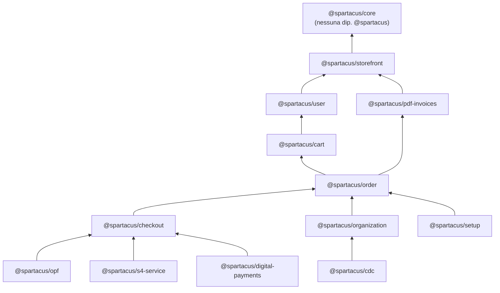

#### D03 — B. Bootstrap dell'app demo (`sequenceDiagram`, 01-PANORAMICA-E-MONOREPO.md riga 771)

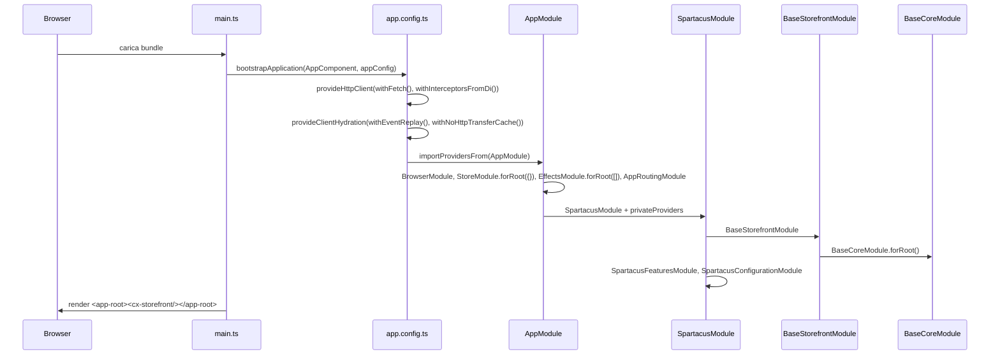

#### D04 — C. Caricamento lazy di una feature (esempio: mini-cart) (`sequenceDiagram`, 01-PANORAMICA-E-MONOREPO.md riga 817)

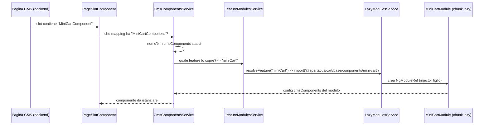

### 02-BOOTSTRAP-E-CONFIG.md

#### D05 — Flusso passo-passo (`flowchart`, 02-BOOTSTRAP-E-CONFIG.md riga 166)

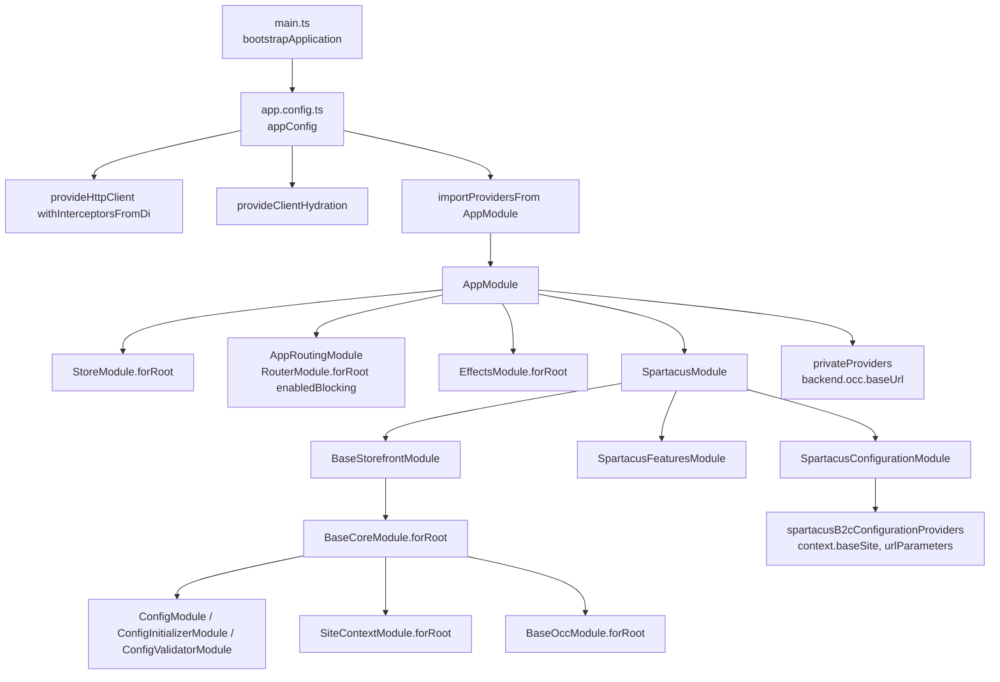

#### D06 — Ordine di precedenza (dal più debole al più forte) (`flowchart`, 02-BOOTSTRAP-E-CONFIG.md riga 395)

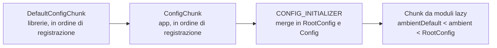

#### D07 — Flusso passo-passo (`sequenceDiagram`, 02-BOOTSTRAP-E-CONFIG.md riga 409)

```mermaid
sequenceDiagram
  participant NG as Angular DI
  participant CF as configFactory
  participant AI as APP_INITIALIZER (configInitializerFactory)
  participant CIS as ConfigInitializerService
  participant INIT as CONFIG_INITIALIZER[]
  participant V as ConfigValidator
  NG->>CF: primo inject(Config)
  CF->>NG: inject(DefaultConfig) = deepMerge(DefaultConfigChunk[])
  CF->>NG: inject(RootConfig) = deepMerge(ConfigChunk[])
  CF-->>NG: Config = deepMerge({}, Default, Root)
  NG->>AI: esegue initializer
  AI->>CIS: initialize(initializers)
  CIS->>INIT: configFactory() in parallelo
  INIT-->>CIS: chunk async
  CIS->>CIS: deepMerge(rootConfig, chunk); deepMerge(config, chunk); finishScopes
  CIS-->>V: getStable() emette (solo dev mode)
  V->>V: validateConfig -> logger.warn
```

#### D08 — Flusso passo-passo (`flowchart`, 02-BOOTSTRAP-E-CONFIG.md riga 602)

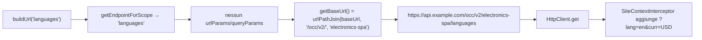

#### D09 — Flusso passo-passo (`sequenceDiagram`, 02-BOOTSTRAP-E-CONFIG.md riga 793)

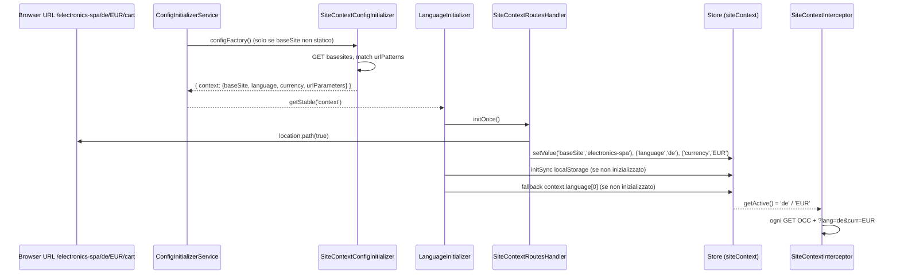

#### D10 — Flusso passo-passo (`sequenceDiagram`, 02-BOOTSTRAP-E-CONFIG.md riga 1007)

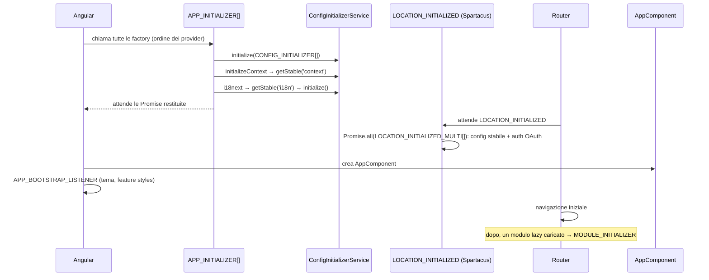

### 03-COSTRUTTI-ANGULAR.md

#### D11 — Flusso passo-passo (risoluzione di `Config`) (`flowchart`, 03-COSTRUTTI-ANGULAR.md riga 270)

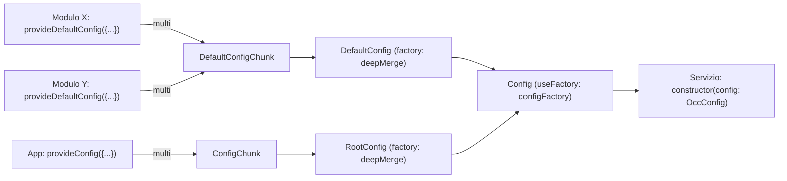

#### D12 — Flusso passo-passo (`sequenceDiagram`, 03-COSTRUTTI-ANGULAR.md riga 396)

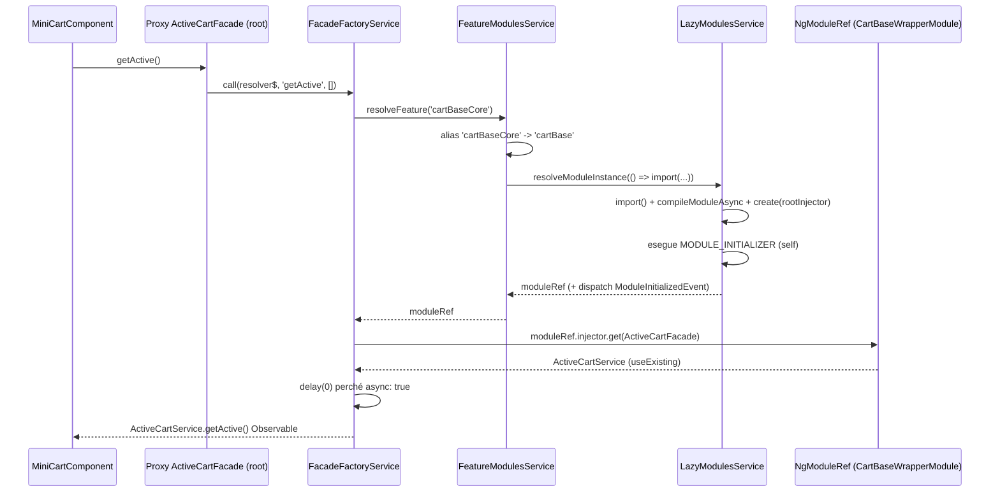

#### D13 — Flusso passo-passo (caricamento per componente CMS) (`flowchart`, 03-COSTRUTTI-ANGULAR.md riga 546)

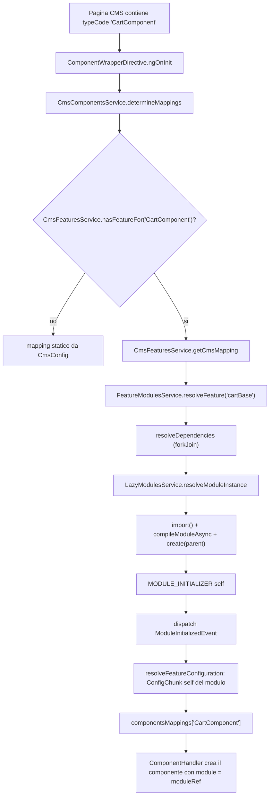

#### D14 — Flusso passo-passo (`sequenceDiagram`, 03-COSTRUTTI-ANGULAR.md riga 806)

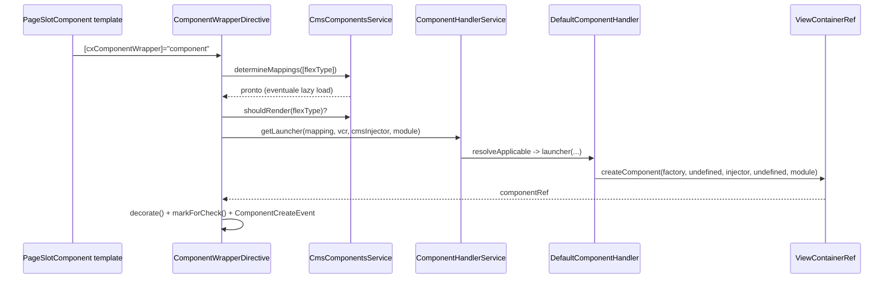

#### D15 — Flusso passo-passo (`flowchart`, 03-COSTRUTTI-ANGULAR.md riga 1041)

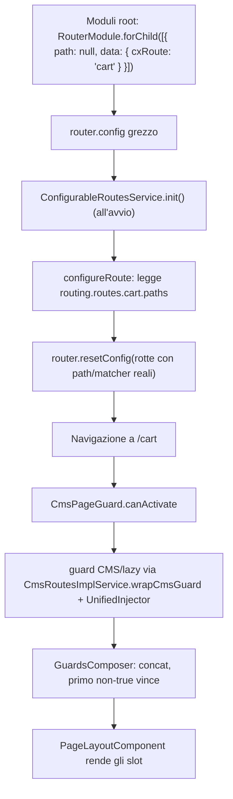

#### D16 — Flusso passo-passo (`sequenceDiagram`, 03-COSTRUTTI-ANGULAR.md riga 1183)

```mermaid
sequenceDiagram
  participant A as OccCartAdapter (HttpClient.get)
  participant E as HttpErrorHandlerInterceptor
  participant G as HttpErrorInterceptor
  participant S as SiteContextInterceptor
  participant Au as AuthInterceptor
  participant B as Backend OCC
  A->>E: request
  E->>G: next.handle
  G->>S: next.handle
  S->>S: clone(setParams lang, curr)
  S->>Au: next.handle
  Au->>Au: token = getStableToken(); alterRequest
  Au->>B: GET /occ/v2/site/users/current/carts?lang=en&curr=USD
  B-->>Au: 401 invalid_token (scaduto)
  Au->>Au: handleExpiredAccessToken: refresh + retry
  B-->>Au: 200
  Au-->>G: risposta
  G-->>E: risposta
  E-->>A: risposta
```

#### D17 — Mappa mentale (`mindmap`, 03-COSTRUTTI-ANGULAR.md riga 1378)

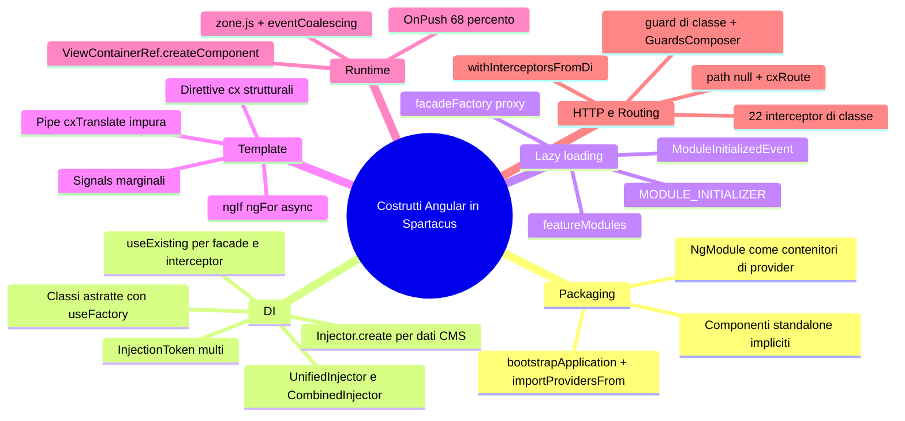

### 04-CMS-DRIVEN-UI.md

#### D18 — 4.1 Diagramma di sequenza (`sequenceDiagram`, 04-CMS-DRIVEN-UI.md riga 100)

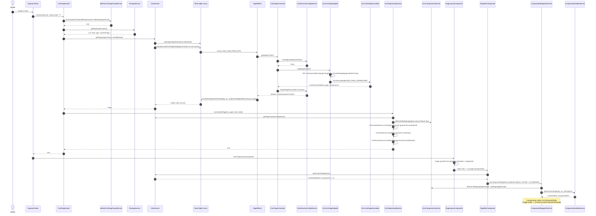

#### D19 — 6.4 Lo store `cms` (`flowchart`, 04-CMS-DRIVEN-UI.md riga 543)

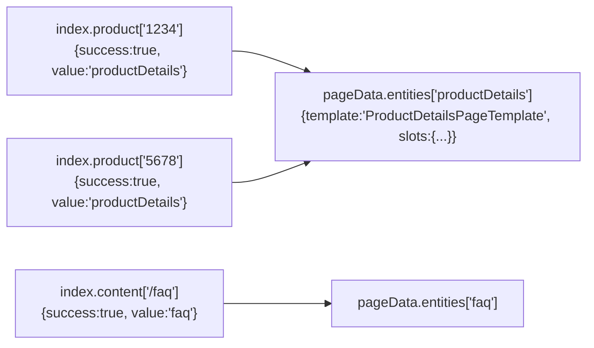

#### D20 — Flusso SmartEdit (`sequenceDiagram`, 04-CMS-DRIVEN-UI.md riga 1524)

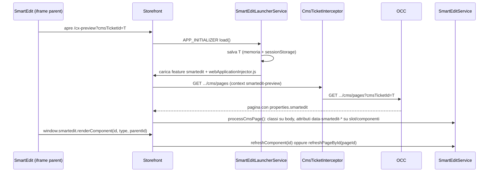

### 05-ROUTING.md

#### D21 — Come è implementato (con path) (`flowchart`, 05-ROUTING.md riga 72)

```mermaid
flowchart TD
  A[URL del browser<br>/electronics-spa/en/USD/product/123/camera] --> B[SiteContextUrlSerializer.parse<br>toglie sito/lingua/valuta]
  B --> C[Router Angular<br>config già riscritta da ConfigurableRoutesService]
  C -->|match di una route con data.cxRoute| D[route statica es. product]
  C -->|nessun match| E[route wildcard ** ]
  D --> F[CmsPageGuard]
  E --> F
  F --> G[BeforeCmsPageGuardService<br>ProtectedRoutesGuard, FederatedLoginGuard]
  G --> H[CmsService.getPage pageContext]
  H --> I[CmsGuardsService<br>guard dei componenti CMS]
  I --> J[PageLayoutComponent renderizza gli slot]
  C -. eventi router .-> K[StoreRouterConnectingModule]
  K --> L[CustomSerializer -> RouterState in NgRx<br>context: PageContext]
  L --> F
```

#### D22 — Come è implementato (con path) (`flowchart`, 05-ROUTING.md riga 196)

```mermaid
flowchart TD
  S[route con data.cxRoute] --> A{routeConfig.disabled?}
  A -- sì --> A1[delete path<br>matcher = urlMatcherService.getFalsy]
  A -- no --> B{routeConfig.matchers?}
  B -- sì --> B1[delete path<br>matcher = resolveUrlMatchers -> getCombined]
  B -- no --> C{paths.length === 1?}
  C -- sì --> C1[delete matcher<br>path = paths 0]
  C -- no --> D1[delete path<br>matcher = urlMatcherService.getFromPaths paths]
```

#### D23 — Come è implementato (con path) (`sequenceDiagram`, 05-ROUTING.md riga 414)

```mermaid
sequenceDiagram
  participant T as Template
  participant P as UrlPipe (cxUrl)
  participant S as SemanticPathService
  participant C as RoutingConfigService
  T->>P: { cxRoute: 'product', params: { code: '123', name: 'camera' } }
  P->>S: transform(commands)
  S->>C: getRouteConfig('product')
  C-->>S: { paths: ['product/:productCode/:name','product/:productCode'], paramsMapping: { productCode: 'code' } }
  S->>S: findPathWithFillableParams -> 'product/:productCode/:name'
  S->>S: provideParamsValues -> ['product','123','camera']
  S-->>P: ['/', 'product', '123', 'camera']
  P-->>T: [routerLink] = ['/', 'product', '123', 'camera']
```

#### D24 — Come è implementato (con path) (`flowchart`, 05-ROUTING.md riga 672)

```mermaid
flowchart LR
  U["/Cameras/Sony/p/1234"] --> M1{defaultMatcher<br>product/:productCode/:name<br>product/:productCode}
  M1 -- null --> M2{suffixUrlMatcher marker 'p'}
  M2 -- match --> R["posParams: productCode=1234,<br>param0=Cameras, param1=Sony"]
  R --> CS[CustomSerializer: params.productCode<br>=> PageContext ProductPage 1234]
```

#### D25 — Come è implementato (con path) (`sequenceDiagram`, 05-ROUTING.md riga 818)

```mermaid
sequenceDiagram
  participant R as Router
  participant G as CmsPageGuard
  participant B as BeforeCmsPageGuardService
  participant RS as RoutingService
  participant C as CmsService
  participant S as CmsPageGuardService
  R->>G: canActivate(route, state)
  G->>B: canActivate (ProtectedRoutesGuard, FederatedLoginGuard)
  B-->>G: true
  G->>RS: getNextPageContext()
  RS-->>G: { id: '/faq', type: ContentPage }
  G->>C: getPage(ctx, reload)
  alt pagina trovata
    C-->>G: Page
    G->>S: canActivatePage -> guard componenti, i18n, child routes
  else pagina non trovata
    C-->>G: null
    G->>S: canActivateNotFoundPage -> pagina notFound con URL invariato
  end
  S-->>R: true | false | UrlTree
```

#### D26 — Come è implementato (con path) (`sequenceDiagram`, 05-ROUTING.md riga 953)

```mermaid
sequenceDiagram
  participant G as CmsPageGuardService
  participant CR as CmsRoutesImplService
  participant R as Router
  G->>CR: handleCmsRoutesInGuard(ctx '/store-finder', types, '/store-finder/find')
  CR->>R: esiste route cxCmsRouteContext 'store-finder'? no
  CR->>CR: getChildRoutes(types) -> children [find, view-all, ...]
  CR->>R: resetConfig([ {path:'store-finder', children, data.cxCmsRouteContext}, ...config ])
  CR->>R: navigateByUrl('/store-finder/find')
  CR-->>G: false (navigazione corrente annullata)
  Note over R: seconda navigazione: match sulla nuova route,<br>cxCmsRouteContext presente => niente loop
```

#### D27 — Come è implementato (con path) (`flowchart`, 05-ROUTING.md riga 1095)

```mermaid
flowchart TD
  N[navigazione verso /my-account/orders] --> P{routing.protected?}
  P -- no --> CMS[caricamento pagina CMS]
  P -- sì --> NP{path in nonProtectedPaths?<br>route con protected:false}
  NP -- sì --> CMS
  NP -- no --> AG[AuthGuard.canActivate]
  AG -- loggato --> CMS
  AG -- anonimo --> SAVE[AuthRedirectService.saveCurrentNavigationUrl]
  SAVE --> L[UrlTree /login]
  L -.dopo login.-> RED[AuthRedirectService.redirect -> /my-account/orders]
```

#### D28 — Come è implementato (con path) (`flowchart`, 05-ROUTING.md riga 1220)

```mermaid
flowchart TD
  U["/checkout/delivery-mode"] --> CPG[CmsPageGuard: pagina CMS con<br>CheckoutProgress, DeliveryMode...]
  CPG --> CG[CmsGuardsService: Set di guard dei componenti]
  CG --> A{CheckoutAuthGuard}
  A -- anonimo, no guest --> LOGIN[UrlTree /login]
  A -- ok --> B{CartNotEmptyGuard}
  B -- carrello vuoto --> HOME[UrlTree /]
  B -- ok --> C{CheckoutStepsSetGuard}
  C -- indirizzo non impostato --> ADDR[UrlTree /checkout/delivery-address]
  C -- ok --> OK[true: render pagina]
```

#### D29 — Come è implementato (con path) (`sequenceDiagram`, 05-ROUTING.md riga 1356)

```mermaid
sequenceDiagram
  participant B as Browser
  participant S as SiteContextUrlSerializer
  participant R as Router
  participant H as SiteContextRoutesHandler
  participant L as LanguageService
  B->>S: parse('/electronics-spa/it/EUR/product/123')
  S-->>R: UrlTree('/product/123') + siteContext {baseSite, language:'it', currency:'EUR'}
  R->>H: NavigationStart
  H->>L: setValue('language','it')
  Note over R: link generati: router.serializeUrl(tree)
  R->>S: serialize(tree '/cart')
  S-->>R: '/electronics-spa/it/EUR/cart'
  L-->>H: getActive() = 'de' (utente cambia lingua)
  H->>B: location.replaceState('/electronics-spa/de/EUR/cart')
```

#### D30 — Come è implementato (con path) (`stateDiagram-v2`, 05-ROUTING.md riga 1536)

```mermaid
stateDiagram-v2
  [*] --> Idle: initialState (state.url='', nextState undefined)
  Idle --> Navigating: ROUTER_NAVIGATION (nextState = snapshot serializzata)
  Navigating --> Navigating: CHANGE_NEXT_PAGE_CONTEXT (es. notFound)
  Navigating --> Idle: ROUTER_CANCEL / ROUTER_ERROR (nextState = undefined)
  Navigating --> Idle: ROUTER_NAVIGATED (state = snapshot, context preservato)
```

#### D31 — Come è implementato (con path) (`flowchart`, 05-ROUTING.md riga 1665)

```mermaid
flowchart LR
  RN[ROUTER_NAVIGATED<br>payload.routerState] --> NEB[NavigationEventBuilder]
  NEB --> ES[EventService: NavigationEvent]
  ES --> A[analytics / tag manager / ProductPageEventBuilder]
  NE[NavigationEnd] --> ARS[ActivatedRoutesService.routes$]
  ARS --> RPMR[RoutingPageMetaResolver.resolveBreadcrumbs]
  ARS --> RPS[RoutingParamsService.getParams]
```

#### D32 — Come è implementato (con path) (`flowchart`, 05-ROUTING.md riga 1788)

```mermaid
flowchart TD
  S[Router event Scroll] --> P{position presente?<br>back/forward}
  P -- sì --> R1[scrollToPosition position, 0ms]
  P -- no --> Q{ignoreQueryString e<br>stesso path?}
  Q -- sì --> X[nessuna azione]
  Q -- no --> C{URL contiene ignoreRoutes?}
  C -- sì --> X
  C -- no --> R2[scroll a anchor o 0,0 dopo 100ms]
  R1 --> F[focusOnHostElement]
  R2 --> F
```

#### D33 — Come è implementato (con path) (`flowchart`, 05-ROUTING.md riga 1981)

```mermaid
flowchart TB
  subgraph Avvio
    A1[AppRoutingModule<br>RouterModule.forRoot vuoto] --> A2[RoutingModule storefront]
    A2 --> A3[CoreRoutingModule.forRoot<br>store router + CustomSerializer]
    A3 --> A4[APP_INITIALIZER ConfigurableRoutesService.init]
    A2 --> A5[APP_INITIALIZER addCmsRoute: push **]
    A6[SiteContext initializers -> SiteContextRoutesHandler.initOnce]
  end
  subgraph Navigazione
    N1[SiteContextUrlSerializer.parse] --> N2[match route]
    N2 --> N3[ROUTER_NAVIGATION -> nextState + PageContext]
    N3 --> N4[CmsPageGuard -> before guards -> CMS page -> component guards -> child routes]
    N4 --> N5[ROUTER_NAVIGATED -> state]
    N5 --> N6[NavigationEvent, OnNavigateService, RoutingParamsService]
  end
  Avvio --> Navigazione
```

### 06-STATE-NGRX-QUERY-COMMAND.md

#### D34 — Flusso passo-passo (`sequenceDiagram`, 06-STATE-NGRX-QUERY-COMMAND.md riga 1104)

```mermaid
sequenceDiagram
  participant S as Server (Node)
  participant SR as ServerTransferStateReducer
  participant TS as TransferState (HTML)
  participant B as Browser
  participant BR as BrowserTransferStateReducer
  S->>SR: ogni action (LoadProductSuccess, LoadCmsPageDataSuccess...)
  SR->>SR: newState = reducer(state, action)
  SR->>TS: set('cx-state', getStateSlice(['product','cms','siteContext',...], [], newState))
  TS-->>B: script JSON serializzato nella pagina
  B->>BR: @ngrx/store/init
  BR->>BR: utente loggato? (AuthStatePersistenceService.isUserLoggedIn)
  alt non loggato e hasKey(cx-state)
    BR->>BR: state = deepMerge({}, state, slice)
  end
  BR-->>B: store iniziale gia popolato, niente nuove GET
```

#### D35 — Flusso passo-passo (`sequenceDiagram`, 06-STATE-NGRX-QUERY-COMMAND.md riga 1537)

```mermaid
sequenceDiagram
  participant C as Componente
  participant F as CheckoutQueryService
  participant Q as Query (state$ BehaviorSubject)
  participant CN as CheckoutConnector
  participant E as EventService
  C->>F: getCheckoutDetailsState()
  F->>Q: getState() -> subscribe
  Q->>Q: state.loading == true -> onSubscribeLoad$
  Q->>CN: loaderFactory() -> getCheckoutDetails(userId, cartId)
  CN-->>Q: CheckoutState
  Q-->>C: { loading:false, error:false, data }
  E-->>Q: CheckoutQueryResetEvent (es. indirizzo impostato)
  Q->>Q: state = initialState (data undefined, loading true)
  Q->>CN: nuova GET (c'e un subscriber attivo)
  CN-->>Q: CheckoutState aggiornato
  Q-->>C: { loading:false, data: nuovo }
```

#### D36 — Flusso passo-passo (`sequenceDiagram`, 06-STATE-NGRX-QUERY-COMMAND.md riga 1727)

```mermaid
sequenceDiagram
  participant UI as Componente indirizzo
  participant F as CheckoutDeliveryAddressService
  participant CMD as Command (CancelPrevious)
  participant CN as CheckoutDeliveryAddressConnector
  participant EV as EventService
  participant L as CheckoutDeliveryAddressEventListener
  participant Q as CheckoutQueryService (Query)
  UI->>F: setDeliveryAddress(address)
  F->>CMD: execute(address)
  CMD-->>UI: ReplaySubject (risultato futuro)
  CMD->>CN: setAddress(userId, cartId, addressId)
  CN-->>CMD: 200 OK
  CMD->>EV: dispatch(CheckoutDeliveryAddressSetEvent)
  EV->>L: CheckoutDeliveryAddressSetEvent
  L->>EV: dispatch(CheckoutQueryResetEvent)
  EV->>Q: resetOn -> state = initial, nuova GET
  CMD-->>UI: complete
```

#### D37 — Flusso passo-passo (`sequenceDiagram`, 06-STATE-NGRX-QUERY-COMMAND.md riga 2141)

```mermaid
sequenceDiagram
  autonumber
  participant CMP as ProductIntroComponent
  participant CUR as CurrentProductService
  participant PS as ProductService
  participant PLS as ProductLoadingService
  participant LS as LoadingScopesService
  participant ST as Store (product.details)
  participant EF as ProductEffects
  participant CON as ProductConnector
  participant AD as OccProductAdapter
  participant EP as OccEndpointsService
  participant OPT as OccRequestsOptimizerService
  participant HTTP as HttpClient + interceptor
  participant CNV as ConverterService (PRODUCT_NORMALIZER)
  CMP->>CUR: getProduct()
  CUR->>PS: get('1234', 'details')
  PS->>PLS: get('1234', ['details'])
  PLS->>LS: expand('product', ['details'])
  LS-->>PLS: ['list','variants','details']
  PLS->>ST: select getSelectedProductStateFactory x3
  ST-->>PLS: stato iniziale (shouldLoad = true)
  PLS->>ST: dispatch LoadProduct('1234', list/variants/details)
  ST->>ST: entityScopedLoaderReducer: loading = true
  ST->>EF: actions$ (ofType LOAD_PRODUCT)
  EF->>EF: bufferDebounceTime(0) -> array di 3
  EF->>CON: getMany([...])
  CON->>AD: loadMany([...])
  AD->>EP: buildUrl('product', {urlParams, scope}) x3
  EP-->>AD: 3 URL con fields diversi
  AD->>OPT: scopedDataLoad(urls)
  OPT->>OPT: getOptimalUrlGroups -> 1 URL con fields uniti
  OPT->>HTTP: GET /products/1234?fields=...&lang&curr (una volta)
  HTTP-->>OPT: JSON Occ.Product
  OPT-->>AD: 3 data$ (extractFields per scope)
  AD->>CNV: pipeable(PRODUCT_NORMALIZER) per scope
  CNV-->>EF: Product normalizzato (immagini, nome, slug)
  EF->>ST: LoadProductSuccess({code,...data}, scope) x3
  ST->>ST: entities['1234'][scope] = {success, value}
  ST-->>PLS: getSelectedProductFactory x3
  PLS->>PLS: uniteLatest + deepMerge
  PLS-->>PS: Product completo
  PS-->>CUR: Product
  CUR-->>CMP: Product (filter isNotUndefined)
```

#### D38 — Flusso passo-passo (`sequenceDiagram`, 06-STATE-NGRX-QUERY-COMMAND.md riga 2190)

```mermaid
sequenceDiagram
  participant SC as SiteContext (CurrencyChange)
  participant MR as clearProductsState
  participant EF as ProductEffects.withdrawOn
  participant PLS as ProductLoadingService
  SC->>MR: CURRENCY_CHANGE
  MR->>MR: state.product = undefined -> stato iniziale
  SC->>EF: contextChange$ emette
  EF->>EF: switchMap annulla le GET in volo
  MR-->>PLS: selector: stato iniziale per ogni scope osservato
  PLS->>PLS: shouldLoad$ = true
  PLS->>EF: dispatch LoadProduct (nuova valuta)
```

### 07-DATA-LAYER-OCC.md

#### D39 — 3.1 Pattern Connector → Adapter → OccAdapter (`classDiagram`, 07-DATA-LAYER-OCC.md riga 88)

```mermaid
classDiagram
    direction LR
    class ProductConnector {
      +get(productCode, scope) Observable~Product~
      +getMany(products) ScopedProductData[]
      #adapter: ProductAdapter
    }
    class ProductAdapter {
      <<abstract>>
      +load(productCode, scope?)* Observable~Product~
      +loadMany?(products)* ScopedProductData[]
    }
    class OccProductAdapter {
      #http: HttpClient
      #occEndpoints: OccEndpointsService
      #converter: ConverterService
      #requestsOptimizer: OccRequestsOptimizerService
      +load(productCode, scope?)
      +loadMany(products)
      #getEndpoint(code, scope?) string
    }
    class OccEndpointsService {
      +buildUrl(endpoint, attributes?, propertiesToOmit?) string
      +getRawEndpointValue(endpoint, scope?) string
      +isConfigured(endpoint, scope?) boolean
      +getBaseUrl(props?) string
    }
    class ConverterService {
      +convert(source, token)
      +convertMany(sources, token)
      +pipeable(token) OperatorFunction
      +pipeableMany(token) OperatorFunction
      +hasConverters(token) boolean
    }
    class ProductImageNormalizer {
      +convert(source, target?) Product
    }
    class ProductNameNormalizer {
      +convert(source, target?) Product
    }
    ProductConnector --> ProductAdapter : delega
    OccProductAdapter ..|> ProductAdapter : implements
    OccProductAdapter --> OccEndpointsService : buildUrl('product')
    OccProductAdapter --> ConverterService : pipeable(PRODUCT_NORMALIZER)
    ConverterService --> ProductImageNormalizer : PRODUCT_NORMALIZER[0]
    ConverterService --> ProductNameNormalizer : PRODUCT_NORMALIZER[1]
```

#### D40 — 3.1 Pattern Connector → Adapter → OccAdapter (`classDiagram`, 07-DATA-LAYER-OCC.md riga 137)

```mermaid
classDiagram
    direction LR
    class CartConnector {
      +loadAll(userId)
      +load(userId, cartId)
      +create(userId, oldCartId?, toMergeCartGuid?)
      +delete(userId, cartId)
      +save(userId, cartId, name?, description?)
      +addEmail(userId, cartId, email)
    }
    class CartAdapter {
      <<abstract>>
    }
    class OccCartAdapter {
      +loadAll() GET carts
      +load() GET cart
      +create() POST createCart
      +delete() DELETE deleteCart
      +save() PATCH saveCart
      +addEmail() PUT addEmail
    }
    class CmsPageConnector {
      +get(pageContext)
    }
    class CmsPageAdapter {
      <<abstract>>
      +load(pageContext)*
    }
    class OccCmsPageAdapter {
      +load(pageContext) GET page / pages
    }
    CartConnector --> CartAdapter
    OccCartAdapter ..|> CartAdapter
    CmsPageConnector --> CmsPageAdapter
    OccCmsPageAdapter ..|> CmsPageAdapter
```

#### D41 — 4.1 Caricamento di un prodotto (scope `details`) (`sequenceDiagram`, 07-DATA-LAYER-OCC.md riga 637)

```mermaid
sequenceDiagram
    participant C as Componente
    participant PS as ProductService
    participant PL as ProductLoadingService
    participant LS as LoadingScopesService
    participant ST as Store NgRx
    participant FX as ProductEffects
    participant PC as ProductConnector
    participant OA as OccProductAdapter
    participant RO as OccRequestsOptimizerService
    participant EP as OccEndpointsService
    participant CS as ConverterService
    C->>PS: get('123', 'details')
    PS->>PL: get('123', ['details'])
    PL->>LS: expand('product', ['details'])
    LS-->>PL: ['list','variants','details']
    PL->>ST: dispatch LoadProduct('123', scope) x3
    ST->>FX: LOAD_PRODUCT (bufferDebounceTime)
    FX->>PC: getMany([{code,scope}...])
    PC->>OA: loadMany(...)
    OA->>EP: buildUrl('product', {urlParams, scope}) x3
    OA->>RO: scopedDataLoad(urls)
    RO->>RO: getOptimalUrlGroups → 1 URL con fields uniti
    RO-->>OA: data$ per scope (extractFields)
    OA->>CS: pipeable(PRODUCT_NORMALIZER)
    FX->>ST: LoadProductSuccess(product, scope) x3
    ST-->>PL: stato per scope
    PL-->>C: deepMerge delle 3 parti
```

### 08-CONTRATTO-BACKEND.md

#### D42 — 4.1 Avvio di un utente anonimo (B2C, niente `context` statico) (`sequenceDiagram`, 08-CONTRATTO-BACKEND.md riga 960)

```mermaid
sequenceDiagram
    autonumber
    participant B as Browser (Spartacus)
    participant O as OCC /occ/v2
    B->>O: GET /occ/v2/basesites?fields=FULL
    O-->>B: 200 { baseSites: [ { uid, urlPatterns, stores } ] }
    Note over B: SiteContextConfigInitializer sceglie il sito
    B->>O: GET /occ/v2/electronics-spa/languages?lang=en&curr=USD
    O-->>B: 200 { languages: [...] }
    B->>O: GET /occ/v2/electronics-spa/users/anonymous/cms/pages?lang=en&curr=USD
    O-->>B: 200 Occ.CMSPage (contentSlots.contentSlot[].components.component[])
    B->>O: GET .../users/anonymous/cms/components?fields=DEFAULT&componentIds=a,b
    O-->>B: 200 { component: [...] }
```

#### D43 — 4.2 Login OAuth2 con password flow e merge del carrello (`sequenceDiagram`, 08-CONTRATTO-BACKEND.md riga 989)

```mermaid
sequenceDiagram
    autonumber
    participant U as Utente
    participant S as Spartacus
    participant A as Auth server /authorizationserver
    participant O as OCC /occ/v2/{site}
    U->>S: submit email + password
    S->>A: POST /oauth/token (form) grant_type=password, username, password, client_id, client_secret
    alt credenziali corrette
        A-->>S: 200 { access_token, token_type, expires_in, refresh_token }
        Note over S: AuthStorageService salva il token, UserIdService = current
        S->>O: GET /users/current (Authorization: Bearer AT1)
        O-->>S: 200 Occ.User
        S->>O: GET /users/current/carts (cerca il carrello senza saveTime)
        O-->>S: 200 { carts: [ { code, guid: GUIDUSER } ] }
        S->>O: POST /users/current/carts?oldCartId=GUIDANON&toMergeCartGuid=GUIDUSER
        O-->>S: 201/200 Occ.Cart (merged)
    else credenziali errate
        A-->>S: 400 { error: invalid_grant, error_description: Bad credentials }
        Note over S: BadRequestHandler mostra httpHandlers.badRequest.bad_credentials
    end
```

#### D44 — 4.3 Access token scaduto: refresh e retry (`sequenceDiagram`, 08-CONTRATTO-BACKEND.md riga 1026)

```mermaid
sequenceDiagram
    autonumber
    participant C as Componente/Adapter
    participant I as AuthInterceptor
    participant H as AuthHttpHeaderService
    participant A as Auth server
    participant O as OCC
    C->>I: GET /users/current/carts
    I->>O: GET ... Authorization: Bearer AT1
    O-->>I: 401 { errors: [ { type: InvalidTokenError } ] }
    I->>H: handleExpiredAccessToken(request, next, AT1)
    H->>H: token in storage == AT1 -> refreshTokenTrigger$.next
    H->>A: POST /oauth/token grant_type=refresh_token, refresh_token=RT1
    alt refresh valido
        A-->>H: 200 { access_token: AT2, refresh_token: RT2 }
        H->>O: retry GET ... Authorization: Bearer AT2
        O-->>C: 200 Occ.CartList
    else refresh scaduto
        A-->>I: 400 { error: invalid_grant }
        I->>H: handleExpiredRefreshToken()
        H->>H: saveCurrentNavigationUrl, coreLogout, go login
        Note over C: messaggio httpHandlers.sessionExpired
    end
```

#### D45 — 4.4 Login con Authorization Code + PKCE e custom login page (default 2611) (`sequenceDiagram`, 08-CONTRATTO-BACKEND.md riga 1062)

```mermaid
sequenceDiagram
    autonumber
    participant B as Browser (Spartacus)
    participant A as Auth server /authorizationserver
    B->>A: GET /csrf (withCredentials)
    A-->>B: 200 { headerName, parameterName, token } + Set-Cookie sessione
    B->>A: GET /oauth/authorize?response_type=code&client_id=mobile_android_public&code_challenge=X&code_challenge_method=S256&redirect_uri=R
    A-->>B: 302 verso la custom login page della storefront
    B->>A: POST /login (form nativo) username, password, _csrf
    A-->>B: 302 /oauth/authorize ... poi 302 R?code=C
    B->>A: POST /oauth/token grant_type=authorization_code, code=C, code_verifier, client_id, redirect_uri
    A-->>B: 200 { access_token, token_type, expires_in, refresh_token }
```

### 09-SSR.md

#### D46 — 4.3 Diagramma di sequenza: richiesta con timeout e fallback CSR (`sequenceDiagram`, 09-SSR.md riga 1166)

```mermaid
sequenceDiagram
    autonumber
    participant B as Browser
    participant E as Express (server.ts)
    participant O as OptimizedSsrEngine
    participant C as RenderingCache
    participant NG as ngExpressEngine / CxCommonEngine
    participant APP as App Angular (server)
    participant OCC as Backend OCC

    B->>E: GET /electronics-spa/en/USD/
    E->>O: res.render(index.server.html, {req})
    O->>O: preprocessRequestForLogger(req)
    O->>C: isReady(key)?
    C-->>O: false
    O->>O: shouldRender(req) (strategia, concorrenza, isRendering)
    O->>O: setTimeout(timeout = 3000 ms)
    O->>C: setAsRendering(key)
    O->>NG: expressEngine(filePath, options + EXPRESS_SERVER_LOGGER)
    NG->>APP: CommonEngine.render → bootstrap(context)
    APP->>OCC: GET cms/pages, products...
    Note over O: 3000 ms passano, OCC non ha ancora risposto
    O->>E: fallbackToCsr: Cache-Control no-store + index.server.html
    E-->>B: 200 HTML "vuoto" (CSR)
    B->>B: scarica JS, rendering lato client
    OCC-->>APP: risposte (in ritardo)
    APP-->>NG: HTML completo
    NG-->>O: callback(null, html)
    O->>C: store(key, null, html) (requestTimeout già scaduto)
    Note over B,C: Richiesta successiva allo stesso URL
    B->>E: GET /electronics-spa/en/USD/
    E->>O: res.render(...)
    O->>C: isReady(key)?
    C-->>O: true
    O-->>E: callback(null, html dalla cache)
    O->>C: clear(key) se cache = false
    E-->>B: 200 HTML SSR
```

#### D47 — 4.4 Flowchart: strategia di rendering in `renderResponse` (`flowchart`, 09-SSR.md riga 1208)

```mermaid
flowchart TD
    A[Richiesta arriva a renderResponse] --> B{renderingCache.isReady key?}
    B -- si --> B1[callback con html/err dalla cache]
    B1 --> B2{cache = true?}
    B2 -- no --> B3[renderingCache.clear key]
    B2 -- si --> Z[Fine]
    B3 --> Z
    B -- no --> S[strategia = renderingStrategyResolver req]
    S --> S1{strategia = ALWAYS_SSR?}
    S1 -- si --> R[render consentito]
    S1 -- no --> S2{strategia = ALWAYS_CSR?}
    S2 -- si --> CSR[fallbackToCsr: no-store + index.server.html]
    S2 -- no --> S3{rendering in corso per key e reuseCurrentRendering = false?}
    S3 -- si --> CSR
    S3 -- no --> S4{concurrency superata? con reuse e render in corso: no}
    S4 -- si --> CSR
    S4 -- no --> R
    R --> T{shouldTimeout: timeout > 0 oppure ALWAYS_SSR?}
    T -- no --> T1[fallbackToCsr subito, render in background]
    T -- si --> T2[setTimeout: timeout oppure forcedSsrTimeout]
    T1 --> H[handleRender]
    T2 --> H
    H --> H1{reuseCurrentRendering e render gia avviato?}
    H1 -- si --> H2[accoda callback in renderCallbacks]
    H1 -- no --> H3[startRender: setAsRendering, concurrency++, maxRenderTime timer]
    H3 --> E[engine base CxCommonEngine]
    E --> F{finito prima di maxRenderTime?}
    F -- no --> F1[risultato ignorato, log possibile memory leak]
    F -- si --> G{il client aspetta ancora?}
    G -- si --> G1[callback html/err, store se cache = true]
    G -- no --> G2[store in cache per la prossima richiesta]
    CSR --> Z
```

#### D48 — 4.5 Flowchart: dal `defaultRenderingStrategyResolver` alla strategia (`flowchart`, 09-SSR.md riga 1245)

```mermaid
flowchart LR
    Q[request] --> P{url contiene cx-preview?}
    P -- si --> CSR[ALWAYS_CSR]
    P -- no --> QP{query param in excludedParams? default: asm}
    QP -- si --> CSR
    QP -- no --> U{url contiene uno di excludedUrls? default: checkout, my-account, punchout, opf}
    U -- si --> CSR
    U -- no --> D[DEFAULT]
```

#### D49 — 4.6 Diagramma di sequenza: propagazione di un errore 404 CMS (`sequenceDiagram`, 09-SSR.md riga 1258)

```mermaid
sequenceDiagram
    participant APP as App Angular (server)
    participant INT as HttpErrorHandlerInterceptor
    participant EH as CxErrorHandler
    participant MH as MULTI_ERROR_HANDLER
    participant CE as CxCommonEngine
    participant O as OptimizedSsrEngine
    participant X as defaultExpressErrorHandlers

    APP->>INT: GET .../cms/pages → 404
    INT->>INT: isCmsPageNotFoundHttpError → true
    INT->>EH: handleError(new CmsPageNotFoundOutboundHttpError)
    EH->>MH: LoggingErrorHandler.handleError (log)
    EH->>MH: PropagatingToServerErrorHandler.handleError
    MH->>CE: PROPAGATE_ERROR_TO_SERVER(error) → error ??= e
    APP-->>CE: rendering completato (html)
    CE-->>O: promise rifiutata con error
    O-->>X: callback(err) → Express next(err)
    X-->>X: status 404, Cache-Control no-store, body = HTML CSR
```

### 10-I18N-STYLE-EVENTI-UI.md

#### D50 — Flusso passo-passo (`sequenceDiagram`, 10-I18N-STYLE-EVENTI-UI.md riga 174)

```mermaid
sequenceDiagram
    autonumber
    participant App as Bootstrap Angular
    participant CI as ConfigInitializerService
    participant Init as I18nextInitializer
    participant I18 as i18next (I18NEXT_INSTANCE)
    participant LS as LanguageService
    participant Pipe as TranslatePipe (cxTranslate)
    participant TS as I18nextTranslationService
    participant TC as TranslationChunkService

    App->>CI: APP_INITIALIZER (i18nextProviders)
    CI-->>App: getStable('i18n') (attende fallbackLang)
    App->>Init: initialize()
    Init->>I18: use(loggerPlugin).init({ns: [], fallbackLng, backend?})
    I18-->>Init: callback
    Init->>I18: addResourceBundle(lang, chunk, risorse) per config.i18n.resources
    Init->>LS: getActive().subscribe(lang => i18next.changeLanguage(lang))
    Pipe->>TS: translate('common.cancel', options, true)
    TS->>TC: getChunkNameForKey('common.cancel') -> 'common'
    TS->>I18: loadNamespaces(['common'], cb)
    alt chunk già caricato
        I18-->>TS: cb sincrona
        TS-->>Pipe: next(t('common:common.cancel'))
    else chunk da caricare
        TS-->>Pipe: next(' ') (spazio non separabile)
        I18-->>TS: cb asincrona dopo backend
        TS-->>Pipe: next(traduzione)
    end
    Note over TS,I18: su 'languageChanged' ritraduce
```

#### D51 — Flusso passo-passo (`flowchart`, 10-I18N-STYLE-EVENTI-UI.md riga 416)

```mermaid
flowchart TD
    A[APP_INITIALIZER initHtmlDirAttribute] --> B[DirectionService.initialize]
    B --> C{config.direction.detect?}
    C -- no --> D[setDirection html, config.default]
    C -- si --> E[detect: LanguageService.getActive]
    E --> F[getDirection isoCode]
    F --> G{in rtlLanguages?}
    G -- si --> H[dir=rtl]
    G -- no --> I{in ltrLanguages?}
    I -- si --> J[dir=ltr]
    I -- no --> K[config.default oppure rimuove dir]
```

#### D52 — Flusso passo-passo (`flowchart`, 10-I18N-STYLE-EVENTI-UI.md riga 632)

```mermaid
flowchart LR
    subgraph Build Sass app
      A[styles-config.scss<br/>$useLatestStyles, $skipComponentStyles] --> B[@spartacus/styles/scss/core<br/>variabili, mixin]
      B --> C[Bootstrap vendor parziali]
      C --> D[@spartacus/styles _index<br/>app, root, page-template, components]
      D --> E[cms-themes.scss<br/>.santorini .sparta ...]
    end
    D --> F["cx-mini-cart { @extend %cx-mini-cart }"]
    F --> G[CSS globale in styles.css]
    G --> H[Elemento host &lt;cx-mini-cart&gt; nel DOM]
    I[ThemeService aggiunge classe tema a app-root] --> H
    J[FeatureStylesService aggiunge cxFeat_*] --> H
```

#### D53 — Flusso passo-passo (`sequenceDiagram`, 10-I18N-STYLE-EVENTI-UI.md riga 762)

```mermaid
sequenceDiagram
    participant Boot as APP_BOOTSTRAP_LISTENER
    participant TS as ThemeService
    participant STS as SiteThemeService
    participant Store as NgRx store
    participant Root as elemento app-root
    Boot->>TS: init(componentRef root)
    TS->>STS: getActive()
    STS->>Store: select(getActiveSiteTheme)
    Store-->>TS: 'santorini'
    TS->>Root: addClass('santorini')
    Note over STS: utente sceglie high contrast
    STS->>Store: dispatch SetActiveSiteTheme('cx-theme-high-contrast-dark')
    Store-->>TS: 'cx-theme-high-contrast-dark'
    TS->>Root: removeClass('santorini'), addClass(nuovo)
```

#### D54 — Flusso passo-passo (`flowchart`, 10-I18N-STYLE-EVENTI-UI.md riga 923)

```mermaid
flowchart TD
    subgraph Produttori
      A1[NgRx action CART_ADD_ENTRY_SUCCESS] -->|CartEventBuilder.registerMapped| S1[Observable CartAddEntrySuccessEvent]
      A2[ROUTER_NAVIGATED] -->|NavigationEventBuilder| S2[Observable NavigationEvent]
      A3[componente: eventService.dispatch new X] --> S3[inputSubject$ di X]
    end
    S1 -->|register| M1[MergingSubject CartAddEntrySuccessEvent]
    M1 -->|output$ registrato come sorgente del padre| M2[MergingSubject CartEvent]
    M2 --> M3[MergingSubject CxEvent]
    S2 -->|register| M4[MergingSubject NavigationEvent]
    S3 --> M5[MergingSubject X]
    subgraph Consumatori
      C1["get(CartAddEntrySuccessEvent)"]
      C2["get(CartEvent) — riceve tutte le sottoclassi"]
      C3[TmsService]
    end
    M1 --> C1
    M2 --> C2
    M4 --> C3
```

#### D55 — Flusso passo-passo (`sequenceDiagram`, 10-I18N-STYLE-EVENTI-UI.md riga 1092)

```mermaid
sequenceDiagram
    participant Init as APP_INITIALIZER (BaseTmsModule)
    participant TMS as TmsService
    participant Inj as Injector
    participant Col as GtmCollectorService
    participant ES as EventService
    participant W as window.dataLayer
    Init->>TMS: collect()
    TMS->>Inj: get(config.gtm.collector)
    TMS->>Col: init(config, window)
    Col->>W: dataLayer = [] + script gtm.js
    TMS->>ES: get(NavigationEvent), get(CartAddEntrySuccessEvent)
    ES-->>TMS: evento
    TMS->>Col: map?(evento) poi pushEvent
    Col->>W: push(evento)
```

#### D56 — Flusso passo-passo (`sequenceDiagram`, 10-I18N-STYLE-EVENTI-UI.md riga 1212)

```mermaid
sequenceDiagram
    participant S as Servizio / Interceptor
    participant GMS as GlobalMessageService
    participant Store as NgRx
    participant Eff as GlobalMessageEffect
    participant UI as cx-global-message
    S->>GMS: add({key:'httpHandlers.forbidden'}, MSG_TYPE_ERROR)
    GMS->>Store: AddMessage
    Store-->>UI: get() emette entities
    UI->>UI: {{ msg | cxTranslate }}
    Store-->>Eff: ADD_MESSAGE
    Eff->>Store: RemoveMessage se duplicato
    Eff->>Eff: delay(7000) (solo browser)
    Eff->>Store: RemoveMessage {type, index:0}
    Store-->>UI: messaggio sparito
```

#### D57 — Flusso passo-passo (`sequenceDiagram`, 10-I18N-STYLE-EVENTI-UI.md riga 1439)

```mermaid
sequenceDiagram
    participant C as CouponCardComponent
    participant L as LaunchDialogService
    participant Cfg as LayoutConfig.launch
    participant R as InlineRootRenderStrategy
    participant D as CouponDialogComponent
    C->>L: openDialog(COUPON, element, vcr, {coupon})
    L->>Cfg: launch['COUPON']
    L->>L: resolveApplicable(strategie) -> InlineRoot
    L->>L: _dialogClose.next(undefined); _dataSubject.next(data)
    L->>R: render(config, 'COUPON')
    R->>R: create + attachView + appendChild(root) + applyClasses(DIALOG)
    R-->>L: of(componentRef)
    D->>L: data$ (legge coupon)
    D->>L: closeDialog('Cross click')
    L->>L: focusElement(element); clear('COUPON'); comp.destroy()
```

#### D58 — Come è implementato (con path) (`classDiagram`, 10-I18N-STYLE-EVENTI-UI.md riga 1542)

```mermaid
classDiagram
    BaseFocusDirective <|-- VisibleFocusDirective
    VisibleFocusDirective <|-- BlockFocusDirective
    BlockFocusDirective <|-- PersistFocusDirective
    PersistFocusDirective <|-- EscapeFocusDirective
    EscapeFocusDirective <|-- AutoFocusDirective
    AutoFocusDirective <|-- TabFocusDirective
    TabFocusDirective <|-- TrapFocusDirective
    TrapFocusDirective <|-- LockFocusDirective
    LockFocusDirective <|-- FocusDirective
    class FocusDirective {
      +selector: cxFocus
      +config: FocusConfig
    }
```

#### D59 — Flusso passo-passo (dialog tipico) (`sequenceDiagram`, 10-I18N-STYLE-EVENTI-UI.md riga 1595)

```mermaid
sequenceDiagram
    participant U as Utente (tastiera)
    participant D as div [cxFocus]={trap,block,autofocus:'button',focusOnEscape}
    participant S as TrapFocusService / AutoFocusService
    D->>S: ngAfterViewInit -> autofocus 'button'
    S-->>D: focus sul primo button
    U->>D: Tab sull'ultimo elemento
    D->>S: handleTrapDown -> moveFocus(NEXT)
    S-->>D: focus torna al primo focusabile
    U->>D: Esc
    D->>D: emit esc; il componente chiama closeDialog
```

#### D60 — Flusso passo-passo (`flowchart`, 10-I18N-STYLE-EVENTI-UI.md riga 1709)

```mermaid
flowchart LR
    A[APP_INITIALIZER skipLinkFactory] --> B[outlet BEFORE cx-storefront: SkipLinkComponent]
    C[header cxSkipLink=cx-header] -->|add| S[SkipLinkService.skipLinks$]
    D[main cxSkipLink=cx-main] -->|add| S
    E[footer cxSkipLink=cx-footer] -->|add| S
    S --> B
    B -->|click bottone| F[scrollToTarget: findFirstFocusable + focus]
```

#### D61 — Flusso passo-passo (`flowchart`, 10-I18N-STYLE-EVENTI-UI.md riga 1856)

```mermaid
flowchart TD
    A[provideFeatureToggles / defaultFeatureToggles] --> B[FeatureToggles token / FeatureConfigService]
    B --> C["*cxFeature='a11yX' (template)"]
    B --> D["isEnabled('a11yX') (TS)"]
    B --> E[FeatureStylesService]
    F["useFeatureStyles('a11yX') nel costruttore"] --> E
    E -->|flag attivo| G[classe cxFeat_a11yX sul root]
    G --> H["CSS: @include forFeature('a11yX')"]
```

#### D62 — Mappa riassuntiva (`flowchart`, 10-I18N-STYLE-EVENTI-UI.md riga 1915)

```mermaid
flowchart TB
    subgraph core-libs/core
      I18N[I18nModule / TranslationService / i18next]
      EV[EventService / StateEventService / CxEvent]
      GM[GlobalMessageService + effect timeout]
      WR[WindowRef]
      ST[SiteThemeService]
      FT[FeatureToggles / FeatureStylesService]
    end
    subgraph core-libs/storefront
      LD[LaunchDialogService + strategie]
      KF[KeyboardFocusModule cxFocus]
      SL[SkipLinkModule]
      BP[BreakpointService]
      DIR[DirectionService]
      TH[ThemeService]
      NE[NavigationEvent / PageEvent]
    end
    subgraph core-libs/styles
      SCSS[placeholder %cx-* + allowlist + forFeature]
    end
    subgraph feature-libs/tracking
      TMS[TmsService + GTM/AEP collector]
    end
    I18N --> GM
    EV --> TMS
    NE --> EV
    ST --> TH
    TH --> SCSS
    FT --> SCSS
    WR --> BP
    WR --> TMS
    LD --> KF
    SL --> KF
    I18N --> DIR
```

### 33-MAPPA-FILE.md

#### D63 — Flusso passo-passo (`flowchart`, 33-MAPPA-FILE.md riga 94)

```mermaid
flowchart LR
  T1[1 Monorepo] --> T2[2 Bootstrap] --> T3[3 Config]
  T3 --> T4[4 Site context] --> T5[5 OCC] --> T6[6 Auth]
  T5 --> T7[7 State]
  T7 --> T8[8 CMS dati] --> T9[9 CMS rendering] --> T10[10 Lazy loading]
  T10 --> T11[11 Routing] --> T12[12 Layout]
  T12 --> T13[13 SSR]
  T12 --> T14[14 i18n] --> T15[15 Eventi/errori]
  T15 --> T16[16 Cart] --> T17[17 User] --> T18[18 Checkout] --> T19[19 Order]
  T19 --> T20[20 Prodotto e altro] --> T21[21 Schematics/e2e]
```

## Codice minimo riscritto a mano

Per aggiungere un diagramma nuovo alla documentazione o rigenerare questo file, questo è lo script minimo (TypeScript, Node) che fa la stessa estrazione:

```ts
import { readdirSync, readFileSync, writeFileSync } from 'node:fs';

interface Diagram { file: string; line: number; heading: string; body: string[]; }

export function extractDiagrams(dir: string): Diagram[] {
  const result: Diagram[] = [];
  const files = readdirSync(dir).filter((f) => /^\d\d-.*\.md$/.test(f) && !f.startsWith('32'));
  for (const file of files.sort()) {
    const lines = readFileSync(`${dir}/${file}`, 'utf-8').split('\n');
    let heading = '';
    for (let i = 0; i < lines.length; i++) {
      if (lines[i].startsWith('#')) heading = lines[i].replace(/^#+\s*/, '');
      if (lines[i].trim().startsWith('```mermaid')) {
        const start = i + 1;
        while (i + 1 < lines.length && !lines[++i].trim().startsWith('```')) { /* avanza */ }
        result.push({ file, line: start, heading, body: lines.slice(start, i) });
      }
    }
  }
  return result;
}

export function render(diagrams: Diagram[]): string {
  return diagrams
    .map((d, n) => `#### D${n + 1} — ${d.heading}\n\n\`\`\`mermaid\n${d.body.join('\n')}\n\`\`\`\n`)
    .join('\n');
}

writeFileSync('32-DIAGRAMMI.generated.md', render(extractDiagrams('.')));
```

## Errori comuni

- **Leggere un diagramma come codice.** I diagrammi semplificano: i nomi delle classi sono reali, ma l'ordine esatto di alcuni passi asincroni (es. interceptor, initializer paralleli) è spiegato con le sue riserve nel capitolo di origine.
- **Confondere sequence e flowchart.** Un `sequenceDiagram` mostra *chi chiama chi nel tempo*; un `flowchart` mostra *decisioni e dipendenze*. Il grafo delle librerie (01) non è un ordine di esecuzione.
- **Dimenticare lo scope del diagramma.** Il flusso "carica prodotto" (06) vale per le feature NgRx; checkout e altre feature recenti usano Query/Command, con un flusso diverso (sempre in 06).
- **Pensare che SSR e browser seguano lo stesso diagramma.** Il TransferState (09) fa sì che in browser alcune chiamate OCC non partano proprio.
- **Renderer Mermaid vecchi.** Alcuni diagrammi usano sintassi recenti (`stateDiagram-v2`, `classDiagram` con generics): se non si vedono, usa un renderer aggiornato (GitHub, VS Code con estensione Mermaid, mermaid.live).

## Domande di autoverifica

1. Guardando il grafo delle librerie, perché `@spartacus/storefront` non può dipendere da `@spartacus/cart`?
2. Nel diagramma del bootstrap, quale modulo registra gli interceptor HTTP di core?
3. Nel diagramma della config, chi vince tra un `provideDefaultConfig` e un `provideConfig` sulla stessa chiave?
4. Nel caricamento di una pagina CMS, quale guard avvia la richiesta a `/cms/pages`?
5. Nel diagramma del `ComponentWrapperDirective`, cosa succede se un `typeCode` non ha mapping in `cmsComponents`?
6. Nel flusso "carica prodotto", in quale punto più scope vengono fusi in una sola chiamata HTTP?
7. In quale diagramma si vede dove intervengono i normalizer?
8. Nel sequence OAuth2, cosa scatena il refresh del token?
9. Nel sequence SSR, cosa riceve il browser se il rendering supera il timeout?
10. Nel diagramma del TransferState, perché il browser ignora lo stato se l'utente è loggato?
11. Nel diagramma degli outlet, qual è la differenza tra BEFORE, REPLACE e AFTER?
12. Nel diagramma della catena di guard del checkout, in che ordine vengono valutati i guard?
13. Quale diagramma del mini-Spartacus corrisponde al `facadeFactory` reale?
