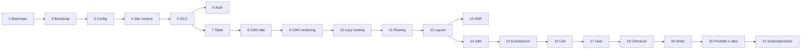

# 33 — Mappa dei file

> I **150 file più importanti** del repository Spartacus, numerati e ordinati nell'**ordine di lettura consigliato**, raggruppati in 21 tappe. Ogni path è stato verificato con `test -f` sulla revisione `8a84d3dc` (vedi "Codice minimo riscritto a mano" per lo script di verifica). Tutti i path sono relativi alla root del repository.

---

## In una frase

Questa mappa è un **itinerario di lettura**: invece di perderti tra migliaia di file, segui 150 file scelti, in un ordine in cui ogni tappa usa solo concetti già visti nelle tappe precedenti.

---

## Il problema che risolve

Il repository contiene centinaia di librerie secondarie (314 file `ng-package.json`, cioè 314 entry point) e migliaia di file TypeScript. Un collega nuovo che apre il progetto incontra subito tre difficoltà:

1. **Da dove comincio?** `core-libs/core/src` da solo ha 26 sotto-cartelle (`auth`, `cms`, `config`, `occ`, `site-context`, `state`, ...). Leggerle in ordine alfabetico non ha senso: `auth` usa `config`, `occ` e `state`, che vengono dopo.
2. **Quali file contano davvero?** Per ogni file "importante" ce ne sono molti di contorno: `index.ts` che riesportano, `*.spec.ts`, modelli, costanti. Leggere tutto costa settimane.
3. **Come si collegano le librerie?** Il pattern Root/Core/Occ/Components di una feature lib si capisce solo leggendo, nell'ordine giusto, i file di più entry point diversi e dell'app demo.

La mappa risolve questi problemi con una selezione e un ordine:

- **Selezione**: si escludono `index.ts`, `public_api.ts` (salvo quando spiegano una regola), spec, modelli banali. Si includono i file che definiscono **contratti** (token, classi astratte, interfacce di config), **meccanismi** (servizi centrali, interceptor, guard, engine) ed **esempi canonici** (un componente CMS semplice, una feature lib completa).
- **Ordine**: dalle fondamenta (monorepo, bootstrap, config) ai meccanismi trasversali (site context, OCC, auth, state, CMS, lazy loading, routing, layout, SSR, i18n, eventi) fino alle feature lib (cart, user, checkout, order, product).

---

## Come è implementato (con path)

### Criteri di scelta

| Criterio | Esempio nella mappa |
|---|---|
| Definisce un **token** o una **classe astratta** usata ovunque | `core-libs/core/src/config/config-tokens.ts`, `core-libs/core/src/cms/config/cms-config.ts` |
| È il **punto d'ingresso** di un meccanismo | `core-libs/core/src/base-core.module.ts`, `core-libs/storefront/base-storefront.module.ts` |
| Implementa un **pattern ricorrente** | `feature-libs/cart/base/root/cart-base-root.module.ts` (Root), `core-libs/core/src/lazy-loading/facade-factory/facade-factory.ts` (facade proxy) |
| È un **collegamento app ↔ lib** | `projects/storefrontapp/src/app/spartacus/features/cart/cart-base-feature.module.ts` |
| È **tooling** che spiega vincoli del codice | `eslint.config.mjs`, `tools/build-lib/declaration-merging/index.ts` |

### Distribuzione dei 150 file

| Area del repo | File nella mappa |
|---|---|
| `core-libs/` (core, storefront, setup, assets, schematics) | 98 |
| `feature-libs/` (cart, user, checkout, order, product, storefinder, asm) | 25 |
| `projects/` (storefrontapp, e2e Cypress, ssr-tests) | 19 |
| root (`package.json`, `nx.json`, `tsconfig.json`, `eslint.config.mjs`, `.env-cmdrc`) | 5 |
| `tools/` e `ci-scripts/` | 3 |

| Tappa | Tema | N. file | Numeri |
|---|---|---|---|
| 1 | Monorepo e tooling | 10 | 1–10 |
| 2 | Bootstrap dell'app demo | 13 | 11–23 |
| 3 | Sistema di configurazione | 9 | 24–32 |
| 4 | Site context | 8 | 33–40 |
| 5 | OCC | 9 | 41–49 |
| 6 | Autenticazione | 8 | 50–57 |
| 7 | State management e Query/Command | 8 | 58–65 |
| 8 | CMS: dati | 5 | 66–70 |
| 9 | CMS: rendering | 9 | 71–79 |
| 10 | Lazy loading e facade | 4 | 80–83 |
| 11 | Routing | 7 | 84–90 |
| 12 | Layout e UI trasversale | 5 | 91–95 |
| 13 | SSR | 9 | 96–104 |
| 14 | i18n | 5 | 105–109 |
| 15 | Eventi, messaggi, errori, logger | 6 | 110–115 |
| 16 | Feature lib: cart | 10 | 116–125 |
| 17 | Feature lib: user | 4 | 126–129 |
| 18 | Feature lib: checkout | 6 | 130–135 |
| 19 | Feature lib: order | 4 | 136–139 |
| 20 | Prodotto e altre feature | 6 | 140–145 |
| 21 | Schematics ed e2e | 5 | 146–150 |

### Nota sui nomi dei progetti

Quando un file appartiene a una libreria, ricordati la corrispondenza cartella → progetto Nx → pacchetto npm:

| Cartella | Progetto Nx | Pacchetto npm |
|---|---|---|
| `core-libs/core` | `core` | `@spartacus/core` |
| `core-libs/storefront` | `storefrontlib` | `@spartacus/storefront` |
| `core-libs/styles` | `storefrontstyles` | `@spartacus/styles` |
| `core-libs/setup` (+ `ssr/`) | `setup` | `@spartacus/setup`, `@spartacus/setup/ssr` |
| `core-libs/assets` | `assets` | `@spartacus/assets` |
| `core-libs/schematics` | `schematics` | `@spartacus/schematics` |
| `feature-libs/cart/base/root` | `cart` | `@spartacus/cart/base/root` |

---

## Flusso passo-passo

Come usare la mappa nella pratica.



1. **Giorno 1 — tappe 1-3.** Apri i file con l'editor affiancato al capitolo 01/02. Obiettivo: saper spiegare come nasce l'albero dei moduli da `projects/storefrontapp/src/main.ts` fino a `core-libs/core/src/base-core.module.ts`, e come una config scritta con `provideConfig` arriva a un servizio.
2. **Giorno 2 — tappe 4-7.** Obiettivo: seguire una richiesta HTTP dal facade (`ProductService`) fino all'URL OCC, passando da interceptor di site context e di auth, e capire dove finisce la risposta (store NgRx o Query).
3. **Giorno 3 — tappe 8-12.** Obiettivo: saper spiegare come una rotta attiva il `CmsPageGuard`, come arriva la pagina, come `cx-page-layout` → `cx-page-slot` → `ComponentWrapperDirective` istanziano i componenti, e quando scatta il lazy loading di una feature.
4. **Giorno 4 — tappe 13-15.** Obiettivo: capire le differenze browser/server, il flusso delle traduzioni e come errori e messaggi vengono propagati.
5. **Giorno 5 — tappe 16-21.** Obiettivo: leggere una feature lib completa (cart) e riconoscere lo stesso schema in user, checkout, order; infine vedere come gli schematics generano la stessa struttura dell'app demo.

Suggerimenti di metodo:

- Per ogni file, prima leggi **solo le firme** (classi, metodi pubblici, token), poi torna sul corpo solo se serve.
- Tieni aperto `tsconfig.json` per risolvere al volo un import `@spartacus/...` nel suo path sorgente.
- Quando un file importa da un `index.ts`, salta direttamente al file concreto (in VS Code: "Go to Definition").
- Dopo ogni tappa rispondi alle domande di autoverifica del capitolo corrispondente.

---

## La mappa: 150 file in ordine di lettura

### Tappa 1 — Monorepo e tooling (orientarsi)

**Perché ora:** prima di leggere codice Angular devi sapere dove stanno le cose e come si builda/testa. Qui capisci workspaces, path alias, confini tra librerie e test runner. Approfondimento: capitolo 01.

1. `package.json` — Workspace root: npm workspaces, versioni Angular/NgRx/RxJS, script `build:libs`, `start`, `test:*`, `e2e:*`.
2. `nx.json` — Config Nx: cache e `dependsOn: ["^build"]` per buildare prima le dipendenze.
3. `tsconfig.json` — I 315 path alias `@spartacus/*` che puntano ai `public_api.ts` sorgenti.
4. `eslint.config.mjs` — ESLint flat config: tag Nx, `enforce-module-boundaries`, regole custom `@nx/workspace-*`.
5. `.env-cmdrc` — Ambienti per `env-cmd` (`CX_BASE_URL`, `CX_B2B`, `CX_CDC`...), letti dagli script npm.
6. `tools/config/index.ts` — Tool `config:check`/`config:update`: dipendenze, peerDependencies e tsconfig paths.
7. `tools/build-lib/declaration-merging/index.ts` — Builder ng-packagr custom che corregge i `declare module` relativi nei `.d.ts`.
8. `ci-scripts/unit-tests.sh` — Come la CI lancia Karma, Jest e Vitest (`TEST_RUNNER`).
9. `feature-libs/cart/package.json` — Esempio di feature lib: peerDependencies `@spartacus/*` e `schematics`.
10. `core-libs/storefront/vitest.config.ts` — Config Vitest tipo: analog plugin, jsdom, alias, coverage.

### Tappa 2 — Bootstrap dell'app demo

**Perché ora:** è la "porta d'ingresso" reale. Seguendo questi file dall'alto in basso ricostruisci l'albero dei moduli che parte da `main.ts` e arriva a `BaseCoreModule`. Approfondimento: capitolo 02.

11. `projects/storefrontapp/project.json` — Target build/serve/test/prerender dell'app (custom-esbuild, SSR entry).
12. `projects/storefrontapp/esbuild/plugins.ts` — Plugin esbuild che inietta le env `CX_*` come `buildProcess.env`.
13. `projects/storefrontapp/src/environments/environment.ts` — Flag d'ambiente (b2b, cdc, opf...) letti da `buildProcess.env`.
14. `projects/storefrontapp/src/main.ts` — `bootstrapApplication(AppComponent, appConfig)` lato browser.
15. `projects/storefrontapp/src/app/app.config.ts` — Provider root: HttpClient con fetch + interceptor DI, hydration, zone.
16. `projects/storefrontapp/src/app/app.module.ts` — NgModule ponte: Store/Effects root, `AppRoutingModule`, `SpartacusModule`.
17. `projects/storefrontapp/src/app/spartacus/spartacus.module.ts` — Unisce BaseStorefrontModule, feature e configurazione.
18. `projects/storefrontapp/src/app/spartacus/spartacus-features.module.ts` — Elenco di tutte le feature importate + feature toggle dell'app.
19. `projects/storefrontapp/src/app/spartacus/spartacus-configuration.module.ts` — Config globale: layout, media, i18n, PWA, canale B2B/B2C.
20. `projects/storefrontapp/src/app/private/private.providers.ts` — Config solo-repo: backend OCC, TestConfigModule, StoreDevtools.
21. `core-libs/storefront/base-storefront.module.ts` — `BaseStorefrontModule`: tutti i moduli UI di base + `BaseCoreModule`.
22. `core-libs/core/src/base-core.module.ts` — `BaseCoreModule`: ordine di import di state, config, i18n, cms, site context, occ.
23. `core-libs/storefront/layout/main/storefront.component.ts` — `StorefrontComponent` (`cx-storefront`): header, main, footer.

### Tappa 3 — Sistema di configurazione

**Perché ora:** quasi ogni servizio Spartacus legge la config. Capire chunk, default e root config e i feature toggle ti evita di "combattere" con valori che non si applicano. Approfondimento: capitolo 02.

24. `core-libs/core/src/config/config-tokens.ts` — Token `Config`, `DefaultConfig`, `RootConfig`, `ConfigChunk`, `DefaultConfigChunk`.
25. `core-libs/core/src/config/config-providers.ts` — `provideConfig`, `provideDefaultConfig` e varianti factory.
26. `core-libs/core/src/config/utils/deep-merge.ts` — Merge profondo usato per fondere i chunk di config.
27. `core-libs/core/src/config/services/configuration.service.ts` — `ConfigurationService`: config unificata che cresce con i moduli lazy.
28. `core-libs/core/src/config/config-initializer/config-initializer.ts` — Contratto `ConfigInitializer` per config asincrona.
29. `core-libs/core/src/config/config-initializer/config-initializer.service.ts` — Attende gli initializer prima di considerare la config stabile.
30. `core-libs/core/src/features-config/feature-toggles/config/feature-toggles.ts` — `FeatureTogglesInterface` e `defaultFeatureToggles`.
31. `core-libs/core/src/features-config/feature-toggles/feature-toggles-tokens.ts` — Token e classe `FeatureToggles` (default + root).
32. `core-libs/core/src/features-config/features-config.module.ts` — `FeaturesConfigModule.forRoot()` e direttive `cxFeature`.

### Tappa 4 — Site context (baseSite, lingua, valuta)

**Perché ora:** baseSite, lingua e valuta finiscono nell'URL e in ogni chiamata OCC. Senza questa tappa non capisci perché gli URL sono `/electronics-spa/en/USD/...`. Approfondimento: capitolo 02.

33. `core-libs/core/src/site-context/site-context.module.ts` — Modulo del site context: store, provider, serializer URL.
34. `core-libs/core/src/site-context/config/site-context-config.ts` — `SiteContextConfig`: `context.baseSite`, `urlParameters`.
35. `core-libs/core/src/site-context/config/config-loader/site-context-config-initializer.ts` — Carica il context dal backend (base sites) come ConfigInitializer.
36. `core-libs/core/src/site-context/providers/context-service-map.ts` — Mappa nome contesto → servizio (`BaseSiteService`, `LanguageService`...).
37. `core-libs/core/src/site-context/services/site-context-url-serializer.ts` — `UrlSerializer` che toglie/aggiunge i parametri di contesto all'URL.
38. `core-libs/core/src/site-context/facade/base-site.service.ts` — Facade del base site attivo.
39. `core-libs/core/src/site-context/facade/language.service.ts` — Facade della lingua attiva.
40. `core-libs/core/src/occ/adapters/site-context/site-context.interceptor.ts` — Aggiunge `lang` e `curr` alle chiamate OCC.

### Tappa 5 — OCC: connector, adapter, converter, endpoint

**Perché ora:** è lo strato che parla col backend SAP Commerce. Impara la catena Service → Connector → Adapter → OCC e il ruolo dei converter. Approfondimento: capitoli 07 e 08.

41. `core-libs/core/src/occ/config/occ-config.ts` — `OccConfig`/`BackendConfig` (baseUrl, prefix, endpoints) + declaration merging.
42. `core-libs/core/src/occ/config/default-occ-config.ts` — Valori di default del backend OCC.
43. `core-libs/core/src/occ/occ-models/occ-endpoints.model.ts` — Interfaccia `OccEndpoints`, estesa dalle feature lib.
44. `core-libs/core/src/occ/services/occ-endpoints.service.ts` — `OccEndpointsService.buildUrl`: costruisce gli URL OCC.
45. `core-libs/core/src/util/converter.service.ts` — `ConverterService` e token dei converter (normalizer/serializer).
46. `core-libs/core/src/occ/adapters/product/occ-product.adapter.ts` — Adapter OCC del prodotto (implementazione concreta).
47. `core-libs/core/src/occ/adapters/cms/occ-cms-page.adapter.ts` — Adapter OCC per le pagine CMS.
48. `core-libs/core/src/cms/connectors/page/cms-page.connector.ts` — Connector: separa i servizi dall'adapter concreto.
49. `core-libs/core/src/cms/connectors/page/cms-page.adapter.ts` — Adapter astratto (contratto) per le pagine CMS.

### Tappa 6 — Autenticazione

**Perché ora:** l'auth tocca interceptor, token, guard e user id (`current`/`anonymous`), che poi ritrovi in tutte le feature. Approfondimento: capitolo 08.

50. `core-libs/core/src/auth/auth.module.ts` — `AuthModule.forRoot()`: user-auth + client-auth.
51. `core-libs/core/src/auth/user-auth/user-auth.module.ts` — Modulo auth utente: OAuth lib, interceptor, initializer.
52. `core-libs/core/src/auth/user-auth/config/auth-config.ts` — `AuthConfig`: client id/secret, endpoint token, flusso OAuth.
53. `core-libs/core/src/auth/user-auth/facade/auth.service.ts` — `AuthService`: login, logout, stato di login.
54. `core-libs/core/src/auth/user-auth/facade/user-id.service.ts` — `UserIdService`: `current` vs `anonymous` vs emulated.
55. `core-libs/core/src/auth/user-auth/services/oauth-lib-wrapper.service.ts` — Wrapper attorno a `angular-oauth2-oidc`.
56. `core-libs/core/src/auth/user-auth/http-interceptors/auth.interceptor.ts` — Aggiunge il Bearer token e gestisce 401/refresh.
57. `core-libs/core/src/auth/client-auth/services/client-token.service.ts` — Token "client credentials" per chiamate anonime protette.

### Tappa 7 — State management (NgRx) e Query/Command

**Perché ora:** NgRx è usato dal core e da molte feature lib; le feature più recenti usano invece Query/Command. Qui vedi entrambi. Approfondimento: capitolo 06.

58. `core-libs/core/src/state/state.module.ts` — `StateModule.forRoot()`: meta-reducer, transfer state.
59. `core-libs/core/src/state/config/state-config.ts` — `StateConfig`: persistenza e transfer state per chiave.
60. `core-libs/core/src/state/reducers/transfer-state.reducer.ts` — Meta-reducer che passa lo store da server a browser.
61. `core-libs/core/src/state/utils/utils-group.ts` — Raccolta di utility (loader, entity, processes) esposta come namespace `StateUtils` da `state/utils/index.ts`.
62. `core-libs/core/src/state/utils/loader/loader.reducer.ts` — Reducer "loader" (loading/error/success/value).
63. `core-libs/core/src/state/services/state-persistence.service.ts` — Sincronizza pezzi di stato con localStorage/sessionStorage.
64. `core-libs/core/src/util/command-query/query.service.ts` — `QueryService`: letture cache-ate con reload su eventi.
65. `core-libs/core/src/util/command-query/command.service.ts` — `CommandService`: scritture con strategia di concorrenza.

### Tappa 8 — CMS: dati

**Perché ora:** le pagine arrivano dal CMS. Questi file spiegano come si carica una pagina e come si memorizza nello store. Approfondimento: capitolo 04.

66. `core-libs/core/src/cms/config/cms-config.ts` — `CmsConfig`: `cmsComponents`, `featureModules` (lazy).
67. `core-libs/core/src/cms/facade/cms.service.ts` — `CmsService`: pagina corrente, componenti, navigazione.
68. `core-libs/core/src/cms/store/effects/page.effect.ts` — Effect che carica la pagina CMS dal connector.
69. `core-libs/core/src/cms/model/page.model.ts` — Modelli `Page`, `PageMeta`, slot.
70. `core-libs/core/src/cms/page/page-meta.resolver.ts` — Base dei resolver di meta tag (title, description, robots).

### Tappa 9 — CMS: rendering (storefront)

**Perché ora:** dopo i dati, il rendering: guard, layout, slot, wrapper dinamico dei componenti, outlet. È il cuore della UI "CMS-driven". Approfondimento: capitolo 04.

71. `core-libs/storefront/cms-structure/guards/cms-page.guard.ts` — `CmsPageGuard`: carica la pagina CMS prima di attivare la rotta.
72. `core-libs/storefront/cms-structure/page/page-layout/page-layout.component.ts` — `cx-page-layout`: disegna gli slot della pagina.
73. `core-libs/storefront/cms-structure/page/page-layout/page-layout.service.ts` — Calcola quali slot mostrare per template e breakpoint.
74. `core-libs/storefront/cms-structure/page/slot/page-slot.component.ts` — `cx-page-slot`: renderizza i componenti di uno slot.
75. `core-libs/storefront/cms-structure/page/component/component-wrapper.directive.ts` — Istanzia dinamicamente il componente mappato.
76. `core-libs/storefront/cms-structure/services/cms-components.service.ts` — Risolve mapping, guard, i18n e lazy loading dei componenti.
77. `core-libs/storefront/cms-structure/services/cms-features.service.ts` — Carica le feature lazy che coprono un componente CMS.
78. `core-libs/storefront/cms-structure/outlet/outlet.directive.ts` — `*cxOutlet`: punti di estensione del template.
79. `core-libs/storefront/recipes/config/static-cms-structure.ts` — `defaultCmsContentProviders`: struttura CMS statica di base.

### Tappa 10 — Lazy loading e facade

**Perché ora:** con CMS e config in testa, il lazy loading delle feature diventa chiaro: nomi di feature, alias e facade proxy. Approfondimento: capitolo 03.

80. `core-libs/core/src/lazy-loading/feature-modules.service.ts` — `FeatureModulesService.resolveFeature`: carica feature per nome/alias.
81. `core-libs/core/src/lazy-loading/lazy-modules.service.ts` — Crea i `NgModuleRef` lazy e gestisce dipendenze.
82. `core-libs/core/src/lazy-loading/facade-factory/facade-factory.ts` — `facadeFactory()`: proxy che carica la feature al primo uso.
83. `core-libs/core/src/lazy-loading/facade-factory/facade-factory.service.ts` — Implementazione del proxy dei facade.

### Tappa 11 — Routing

**Perché ora:** rotte configurabili e semantic path: perché nei template non vedi mai URL scritti a mano. Approfondimento: capitolo 05.

84. `core-libs/storefront/router/app-routing.module.ts` — `AppRoutingModule`: `RouterModule.forRoot` con opzioni Spartacus.
85. `core-libs/core/src/routing/routing.module.ts` — Router store NgRx e config delle rotte.
86. `core-libs/core/src/routing/configurable-routes/config/routing-config.ts` — `RoutingConfig`: `routes.<nome>.paths`, `paramsMapping`.
87. `core-libs/core/src/routing/configurable-routes/configurable-routes.service.ts` — Applica i path configurati alle rotte con `cxRoute`.
88. `core-libs/core/src/routing/configurable-routes/url-translation/semantic-path.service.ts` — Traduce `{ cxRoute: 'product', params }` in URL.
89. `core-libs/core/src/routing/facade/routing.service.ts` — `RoutingService`: go(), stato router, page context.
90. `core-libs/storefront/cms-structure/routing/default-routing-config.ts` — Rotte di default (product, category, search, login...).

### Tappa 12 — Layout e UI trasversale

**Perché ora:** layout per breakpoint, dialog e media sono usati da quasi tutti i componenti UI. Approfondimento: capitolo 10.

91. `core-libs/storefront/layout/config/layout-config.ts` — `LayoutConfig`: breakpoint, slot per template.
92. `core-libs/storefront/recipes/config/layout-config.ts` — `layoutConfigFactory`: layout di default dello storefront.
93. `core-libs/storefront/layout/breakpoint/breakpoint.service.ts` — `BreakpointService`: breakpoint corrente reattivo.
94. `core-libs/storefront/layout/launch-dialog/services/launch-dialog.service.ts` — Apertura di dialog/modali con strategie di rendering.
95. `core-libs/storefront/shared/components/media/media.component.ts` — `cx-media`: immagini responsive dal CMS/OCC.

### Tappa 13 — SSR

**Perché ora:** solo dopo aver capito il bootstrap browser ha senso guardare il server: engine, ottimizzazioni, provider server. Approfondimento: capitolo 09.

96. `projects/storefrontapp/src/main.server.ts` — Bootstrap server (`BootstrapContext`).
97. `projects/storefrontapp/src/app/app.config.server.ts` — Merge della config browser con `provideServerRendering()`.
98. `projects/storefrontapp/src/app/app.module.server.ts` — `provideServer(...)` da `@spartacus/setup/ssr`.
99. `projects/storefrontapp/src/server.ts` — Server Express con engine decorato, origin validation, error handler.
100. `core-libs/setup/ssr/engine/ng-express-engine.ts` — `ngExpressEngine`: engine Express per Angular SSR.
101. `core-libs/setup/ssr/engine-decorator/ng-express-engine-decorator.ts` — `NgExpressEngineDecorator`: avvolge l'engine con l'ottimizzato.
102. `core-libs/setup/ssr/optimized-engine/optimized-ssr-engine.ts` — `OptimizedSsrEngine`: timeout, cache, fallback CSR, concorrenza.
103. `core-libs/setup/ssr/providers/ssr-providers.ts` — `provideServer`: logger, request url/origin, error handler.
104. `core-libs/core/src/window/window-ref.ts` — `WindowRef`: accesso sicuro a window/document in SSR.

### Tappa 14 — i18n

**Perché ora:** traduzioni a chunk con i18next e le pipe usate in ogni template. Approfondimento: capitolo 10.

105. `core-libs/core/src/i18n/i18n.module.ts` — `I18nModule.forRoot()`: pipe e provider i18next.
106. `core-libs/core/src/i18n/config/i18n-config.ts` — `I18nConfig`: resources, chunks, backend, fallbackLang.
107. `core-libs/core/src/i18n/i18next/i18next-translation.service.ts` — Implementazione con i18next.
108. `core-libs/core/src/i18n/translate.pipe.ts` — Pipe `cxTranslate`.
109. `core-libs/assets/src/translations/translations.ts` — Traduzioni base (en, de, ja, zh, ...) esportate da `@spartacus/assets`.

### Tappa 15 — Eventi, messaggi, errori, logger

**Perché ora:** meccanismi trasversali di comunicazione (eventi), feedback all'utente (messaggi globali) ed error handling. Approfondimento: capitolo 10.

110. `core-libs/core/src/event/event.service.ts` — `EventService`: bus di eventi tipizzati (`CxEvent`).
111. `core-libs/core/src/state/event/state-event.service.ts` — Converte action NgRx in eventi.
112. `core-libs/core/src/global-message/facade/global-message.service.ts` — Messaggi globali (successo/errore/info).
113. `core-libs/core/src/global-message/http-interceptors/http-error.interceptor.ts` — Traduce errori HTTP in messaggi/handler.
114. `core-libs/core/src/error-handling/cx-error-handler.ts` — `ErrorHandler` Angular di Spartacus.
115. `core-libs/core/src/logger/logger.service.ts` — `LoggerService` (sostituibile lato server).

### Tappa 16 — Feature lib: cart

**Perché ora:** la prima feature lib "completa". Leggi i file nell'ordine root → module → core → occ → app per vedere tutto il pattern in un solo posto. Approfondimento: capitolo 01 (sezione 9) e 06.

116. `feature-libs/cart/base/root/cart-base-root.module.ts` — `CartBaseRootModule` e `defaultCartComponentsConfig` (pattern Root).
117. `feature-libs/cart/base/root/facade/active-cart.facade.ts` — `ActiveCartFacade` con `facadeFactory`.
118. `feature-libs/cart/base/cart-base.module.ts` — `CartBaseModule` = Core + Occ + Components (lazy).
119. `feature-libs/cart/base/core/facade/active-cart.service.ts` — Implementazione del carrello attivo.
120. `feature-libs/cart/base/core/facade/multi-cart.service.ts` — Gestione di più carrelli nello store.
121. `feature-libs/cart/base/core/store/reducers/multi-cart.reducer.ts` — Reducer multi-cart.
122. `feature-libs/cart/base/core/connectors/cart/cart.connector.ts` — Connector del carrello.
123. `feature-libs/cart/base/occ/adapters/occ-cart.adapter.ts` — Adapter OCC del carrello.
124. `projects/storefrontapp/src/app/spartacus/features/cart/cart-base-feature.module.ts` — Come l'app registra le feature lazy del carrello.
125. `projects/storefrontapp/src/app/spartacus/features/cart/cart-base-wrapper.module.ts` — Wrapper module: CartBaseModule + estensioni.

### Tappa 17 — Feature lib: user

**Perché ora:** stessa struttura del carrello, con due sotto-feature (`account`, `profile`). Ottimo per consolidare il pattern.

126. `feature-libs/user/account/root/user-account-root.module.ts` — Root module account (login form, user info).
127. `feature-libs/user/account/root/facade/user-account.facade.ts` — Facade dei dati dell'utente loggato.
128. `feature-libs/user/profile/root/user-profile-root.module.ts` — Root module profilo (registrazione, password, email).
129. `projects/storefrontapp/src/app/spartacus/features/user/user-feature.module.ts` — Registrazione nell'app delle feature user.

### Tappa 18 — Feature lib: checkout

**Perché ora:** il checkout mostra step configurabili, guard e servizi basati su Command/Query.

130. `feature-libs/checkout/base/root/checkout-root.module.ts` — Root module del checkout e config componenti.
131. `feature-libs/checkout/base/root/config/default-checkout-config.ts` — Step del checkout di default.
132. `feature-libs/checkout/base/root/facade/checkout-query.facade.ts` — Facade per leggere lo stato del checkout.
133. `feature-libs/checkout/base/core/facade/checkout-delivery-address.service.ts` — Esempio di servizio che usa `CommandService`/`Command` per le scritture e `CheckoutQueryFacade` per le letture.
134. `feature-libs/checkout/base/occ/adapters/occ-checkout.adapter.ts` — Adapter OCC del checkout.
135. `feature-libs/checkout/base/components/checkout-orchestrator/checkout-orchestrator.component.ts` — Componente CMS con template vuoto: il redirect al primo step lo fa il guard `CheckoutGuard` (`guards/checkout.guard.ts`).

### Tappa 19 — Feature lib: order

**Perché ora:** gli ordini chiudono il percorso d'acquisto e mostrano `Command` per il place order.

136. `feature-libs/order/root/order-root.module.ts` — Root module ordini e `defaultOrderComponentsConfig`.
137. `feature-libs/order/root/facade/order-history.facade.ts` — Facade storico ordini.
138. `feature-libs/order/core/facade/order.service.ts` — Piazzamento ordine e ordine corrente.
139. `feature-libs/order/occ/adapters/occ-order.adapter.ts` — Adapter OCC ordini.

### Tappa 20 — Prodotto e altre feature

**Perché ora:** il prodotto è nel core (non in una feature lib) ed è l'esempio migliore di "loading scopes"; poi alcuni root module di altre feature per confronto.

140. `core-libs/core/src/product/facade/product.service.ts` — `ProductService.get(code, scope)` con loading scopes.
141. `core-libs/core/src/product/services/product-loading.service.ts` — Caricamento per scope e ottimizzazione richieste.
142. `core-libs/storefront/cms-components/product/product-list/container/product-list-component.service.ts` — Logica della lista prodotti (ricerca, paginazione).
143. `feature-libs/product/variants/root/product-variants-root.module.ts` — Esempio di root module in `@spartacus/product`.
144. `feature-libs/storefinder/root/store-finder-root.module.ts` — Root module store finder.
145. `feature-libs/asm/root/asm-root.module.ts` — Root module Assisted Service Mode.

### Tappa 21 — Schematics ed e2e

**Perché ora:** per ultimi, gli strumenti che generano e verificano un'app Spartacus: schematics ed e2e.

146. `core-libs/schematics/src/collection.json` — Elenco degli schematics (`ng-add`, `add-spartacus`, `wrapper-module`...).
147. `core-libs/schematics/src/add-spartacus/index.ts` — `addSpartacus`: la catena di regole di installazione.
148. `core-libs/schematics/src/shared/lib-configs/cart-schematics-config.ts` — Descrittore schematics della feature carrello.
149. `projects/storefrontapp-e2e-cypress/cypress.config.ts` — Config Cypress (baseUrl, OCC, base site).
150. `projects/ssr-tests/src/ssr-testing.spec.ts` — Test end-to-end del server SSR.

---

## Codice minimo riscritto a mano

Tre piccoli strumenti, scritti a mano, per usare e mantenere questa mappa.

### 1. Verificare che ogni path esista (quello usato per questo capitolo)

La mappa sorgente è un file di testo con righe `path|descrizione` e righe `#Tappa ...`. Lo script bash seguente conta le voci e segnala i path mancanti. È lo stesso controllo eseguito prima di pubblicare il capitolo (risultato: `total=150 missing=0`).

```bash
#!/usr/bin/env bash
# verify-map.sh — da lanciare nella root del repository
n=0; miss=0
while IFS='|' read -r path desc; do
  case "$path" in \#*|'') continue ;; esac   # salta intestazioni di tappa e righe vuote
  n=$((n+1))
  if [ ! -f "$path" ]; then
    echo "MISSING: $path"
    miss=$((miss+1))
  fi
done < map.txt
echo "total=$n missing=$miss"
[ "$miss" -eq 0 ]   # exit code != 0 se manca qualcosa (utile in CI)
```

Variante che estrae i path direttamente da questo file Markdown (le voci hanno la forma ``N. `path` — descrizione``):

```bash
grep -oE '^[0-9]+\. `[^`]+`' docs-deep-dive/33-MAPPA-FILE.md \
  | sed -E 's/^[0-9]+\. `([^`]+)`/\1/' \
  | while read -r p; do [ -f "$p" ] || echo "MISSING: $p"; done
```

### 2. Generare la lista numerata da `map.txt`

```bash
awk -F'|' 'BEGIN{n=0}
  /^#/ { sub(/^#/, ""); print "\n### " $0 "\n"; next }
       { n++; printf "%d. `%s` — %s\n", n, $1, $2 }' map.txt > maplist.md
```

### 3. Trovare "chi importa chi" per decidere l'ordine di lettura (TypeScript)

Uno script Node minimo che, dato un file, elenca gli import `@spartacus/...` e relativi. Serve a verificare che un file della tappa N non dipenda da concetti di tappe successive.

```ts
// list-imports.ts — esecuzione: npx ts-node list-imports.ts core-libs/core/src/base-core.module.ts
import { readFileSync } from 'node:fs';
import { dirname, resolve } from 'node:path';

interface ImportInfo {
  from: string;
  names: string[];
  kind: 'spartacus' | 'relative' | 'external';
}

function listImports(file: string): ImportInfo[] {
  const src = readFileSync(file, 'utf-8');
  // cattura: import { A, B } from 'x';  (anche su più righe)
  const re = /import\s*\{([^}]*)\}\s*from\s*'([^']+)'/g;
  const result: ImportInfo[] = [];
  let m: RegExpExecArray | null;
  while ((m = re.exec(src)) !== null) {
    const names = m[1]
      .split(',')
      .map((s) => s.trim())
      .filter(Boolean);
    const from = m[2];
    const kind = from.startsWith('@spartacus/')
      ? 'spartacus'
      : from.startsWith('.')
        ? 'relative'
        : 'external';
    result.push({
      from: kind === 'relative' ? resolve(dirname(file), from) : from,
      names,
      kind,
    });
  }
  return result;
}

const target = process.argv[2];
for (const imp of listImports(target)) {
  console.log(`[${imp.kind}] ${imp.from}: ${imp.names.join(', ')}`);
}
```

Esempio d'uso sul file n. 22 (`core-libs/core/src/base-core.module.ts`): l'output elenca solo import relativi (`./cms/cms.module`, `./config/config.module`, `./state/state.module`, ...) più `@angular/core`, confermando che il core non importa da altre librerie `@spartacus` (coerente con i tag `scope:core` in `eslint.config.mjs`).

### 4. Risolvere un alias `@spartacus/...` nel file sorgente (TypeScript)

```ts
// resolve-alias.ts — npx ts-node resolve-alias.ts @spartacus/cart/base/root
import { readFileSync } from 'node:fs';

// tsconfig.json contiene commenti? In questo repo no, quindi JSON.parse basta.
const tsconfig = JSON.parse(readFileSync('tsconfig.json', 'utf-8'));
const paths: Record<string, string[]> = tsconfig.compilerOptions.paths;

const alias = process.argv[2];
const target = paths[alias];
console.log(target ? `${alias} -> ${target[0]}.ts` : `${alias}: alias non trovato`);
// @spartacus/cart/base/root -> feature-libs/cart/base/root/public_api.ts
```

---

## Errori comuni

1. **Leggere in ordine alfabetico di cartella.** `auth` viene prima di `config` e `occ` in ordine alfabetico, ma dipende da entrambi. Segui l'ordine delle tappe.
2. **Fermarsi agli `index.ts` / `public_api.ts`.** Riesportano e basta: la mappa li evita di proposito. Vai sempre al file concreto.
3. **Cercare `@spartacus/storefront` in una cartella `storefront` di feature-libs.** È in `core-libs/storefront` (progetto Nx `storefrontlib`).
4. **Pensare che il prodotto sia in `feature-libs/product`.** Il cuore del prodotto (`ProductService`, adapter OCC, loading scopes) è nel **core** (`core-libs/core/src/product`, `core-libs/core/src/occ/adapters/product`); `feature-libs/product` contiene funzionalità aggiuntive (variants, bulk-pricing, future-stock, image-zoom).
5. **Confondere l'`CheckoutOrchestratorComponent` con la logica di redirect.** Il componente ha template vuoto (`feature-libs/checkout/base/components/checkout-orchestrator/checkout-orchestrator.component.ts`); il redirect lo fa il guard.
6. **Leggere `core` di una feature prima del suo `root`.** Il `root` dichiara il contratto (facade astratti, nomi feature, config di default): leggerlo dopo rende incomprensibile perché il `core` è fatto così.
7. **Prendere i file dell'app demo come codice di libreria.** `projects/storefrontapp/src/app/private/private.providers.ts` e l'uso di `TestConfigModule` sono solo per il repo, non per applicazioni reali.
8. **Saltare la tappa SSR pensando che non riguardi il browser.** Molti servizi del core (es. `WindowRef`, `core-libs/core/src/window/window-ref.ts`) esistono proprio perché lo stesso codice gira anche sul server.
9. **Fidarsi di una mappa vecchia.** I path cambiano tra versioni (es. passaggio da `angular.json` a `project.json`, da Karma a Vitest). Rilancia lo script di verifica quando aggiorni il repository.
10. **Usare `core-libs/core/src/util/converter.service.ts` senza capire i token.** I converter si registrano come multi-provider su token (`PRODUCT_NORMALIZER` e simili nelle cartelle `connectors`): leggere solo il servizio non basta.

---

## Domande di autoverifica

1. Perché la tappa "Configurazione" (3) viene prima di "Site context" (4)? Quale file della tappa 4 è esso stesso un `ConfigInitializer`?
2. Nella tappa 5, qual è la differenza di responsabilità tra `cms-page.connector.ts`, `cms-page.adapter.ts` e `occ-cms-page.adapter.ts`?
3. Quali due file dell'app demo devi leggere per capire come il carrello viene caricato lazy (tappa 16)?
4. Perché `facade-factory.ts` (tappa 10) si capisce meglio dopo aver letto `cms-config.ts` (tappa 8)?
5. Dove sono definiti i token Express `REQUEST`/`RESPONSE` usati lato server? (Suggerimento: `core-libs/setup/ssr/tokens/express.tokens.ts`, non nella mappa ma riesportato dalla `public_api.ts` di `@spartacus/setup/ssr`.)
6. Quale file della mappa contiene l'elenco completo dei feature toggle con il loro valore di default?
7. In quale tappa trovi il meccanismo che aggiunge `lang` e `curr` alle chiamate OCC? E quello che aggiunge il token Bearer?
8. Qual è il ruolo di `utils-group.ts` rispetto al namespace `StateUtils`?
9. Perché nella tappa 18 compaiono sia un file `root/facade` sia un file `core/facade` con nomi simili (`checkout-query.facade.ts`, `checkout-delivery-address.service.ts`)?
10. Quale file della tappa 13 decide se una richiesta viene renderizzata sul server o rimandata al client (fallback CSR)?
11. Se volessi aggiungere un nuovo file alla mappa, quali due verifiche faresti prima (esistenza del path e posizione nell'ordine di dipendenze)? Con quale script?
12. Perché `core-libs/storefront/recipes/config/layout-config.ts` e `core-libs/storefront/layout/config/layout-config.ts` hanno lo stesso nome ma ruoli diversi?
13. Quale file della tappa 1 spiega perché `nx build storefront` fallisce?
14. Quali file della tappa 2 cambieresti per aggiungere una nuova feature lib all'app demo?
15. Da quale file partiresti per capire come `ng add @spartacus/schematics` genera `spartacus-features.module.ts`?
